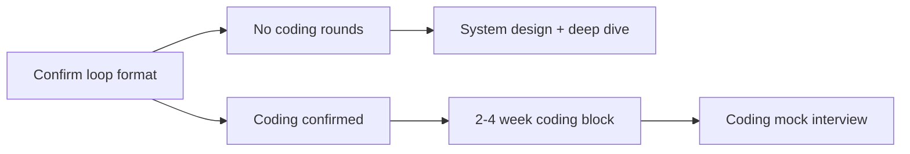

# Coding Preparation

Principal Architect loops are **architecture-first** — but some companies still include **coding or design+coding hybrid** rounds. This guide ensures coding does not become a blind spot.

## The 80/15/5 Rule

| Allocation | Focus |
|------------|-------|
| **~80%** | System design, distributed systems, scenarios |
| **~15%** | Leadership, behavioral, company prep |
| **~5–15%** | Coding maintenance *(only if recruiter confirms coding rounds)* |

## Quick Links

| Topic | Guide |
|-------|-------|
| Overview | [Coding Preparation](/docs/coding-preparation/overview) |
| What to expect at L7+ | [Principal-Level Expectations](/docs/coding-preparation/principal-level-expectations) |
| Problem bank | [Design-Adjacent Problems](/docs/coding-preparation/design-adjacent-problems) |
| Weekly routine | [Practice Routine](/docs/coding-preparation/practice-routine) |
| Timed mock | [Coding Mock Interview](/docs/coding-preparation/coding-mock-interview) |

## Ask Your Recruiter First

Before heavy LeetCode prep:

1. Are there **dedicated coding/algorithms** rounds?
2. **Whiteboard** or **live IDE**?
3. Are coding rounds **waived** at principal level?
4. Preferred **language**?

## Highest-Yield Problems (Not LeetCode Grind)

1. Rate limiter
2. Idempotent API handler
3. LRU cache
4. Consistent hashing
5. Autocomplete / top-K

Each maps to a curriculum chapter and often a lab — see [Design-Adjacent Problems](/docs/coding-preparation/design-adjacent-problems).

## Integration with 12-Week Sprint

| Weeks | Coding |
|-------|--------|
| 1–7 | Skip — focus on foundations and design |
| 8–9 | Coding maintenance if Google or coding confirmed |
| 10–12 | One coding mock + taper |

Full path: [12-Week Learning Path](/docs/start-here/12-week-learning-path).

## Company Notes

- **Google:** May include 1–2 coding rounds — see [Google guide](/docs/company-specific-preparation/google)
- **Amazon / AWS:** Typically **no** classic coding — design + deep dive
- **Others:** See [Company-Specific Preparation](/docs/company-specific-preparation/overview)
