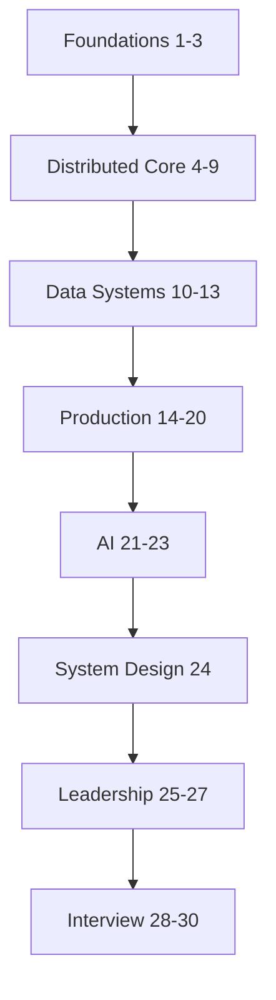

# Curriculum Overview

The curriculum is organized into 33 domains spanning computing foundations through mock interviews and coding preparation.



*Figure: Curriculum domain progression from foundations to interview preparation.*

## Domain Map

### Foundations (Domains 1–3)

- [Computer Architecture](/docs/computer-architecture/overview)
- [Operating Systems](/docs/operating-systems/overview)
- [Networking](/docs/networking/overview)

### Distributed Systems Core (Domains 4–9)

- [Distributed Systems Foundations](/docs/distributed-systems-foundations/overview)
- [Time, Ordering, and Coordination](/docs/time-ordering-and-coordination/overview)
- [Consensus](/docs/consensus/overview)
- [Replication](/docs/replication/overview)
- [Consistency](/docs/consistency/overview)
- [Transactions](/docs/transactions/overview)

### Data and Messaging (Domains 10–13)

- [Storage Engines](/docs/storage-engines/overview)
- [Distributed Databases](/docs/distributed-databases/overview)
- [Messaging and Streaming](/docs/messaging-and-streaming/overview)
- [Caching](/docs/caching/overview)

### Platform and Production (Domains 14–20)

- [Microservices](/docs/microservices/overview)
- [API and Integration Architecture](/docs/api-and-integration-architecture/overview)
- [Cloud Architecture](/docs/cloud-architecture/overview)
- [Kubernetes and Platform Engineering](/docs/kubernetes-and-platform-engineering/overview)
- [Reliability and Resilience](/docs/reliability-and-resilience/overview)
- [Observability](/docs/observability/overview)
- [Security](/docs/security/overview)

### Data Platforms and AI (Domains 21–23)

- [Data Platforms](/docs/data-platforms/overview)
- [AI Distributed Systems](/docs/ai-distributed-systems/overview)
- [Agentic AI Architecture](/docs/agentic-ai-architecture/overview)

### Interview and Leadership (Domains 24–30, 32–33)

- [System Design](/docs/system-design/overview)
- [Architecture Leadership](/docs/architecture-leadership/overview)
- [Cost and FinOps](/docs/cost-and-finops/overview)
- [Production Failures](/docs/production-failures/overview)
- [Company-Specific Preparation](/docs/company-specific-preparation/overview)
- [Behavioral and Leadership](/docs/behavioral-and-leadership/overview)
- [Mock Interviews](/docs/mock-interviews/overview)
- [Coding Preparation](/docs/coding-preparation/overview) — principal-level coding expectations and design-adjacent problems

### Real-World Scenarios (Domain 32)

Production-grounded, step-by-step interview walkthroughs — 12 scenarios covering Stripe, Netflix, Uber, Meta, and more.

- [Real-World Scenarios Overview](/docs/real-world-scenarios/overview)
- [Real-World Interview Prep](/docs/start-here/real-world-interview-prep) — STEP framework and weekly practice routine
- [Scenario Index](/docs/reference/real-world-scenario-index) — lookup by topic, company, and related chapters

### Reference (Domain 31)

- [Glossary](/docs/reference/glossary) — 110+ distributed systems terms
- [Decision Frameworks](/docs/reference/decision-frameworks) — CAP/PACELC, build vs buy, technology selection
- [Reading List](/docs/reference/reading-list) — books, papers, talks by domain

### Interview Assets (repository)

- Question banks: `interview/question-bank/` (**520** principal-level questions across 14 domains)
- Flashcards: `flashcards/flashcards.json` (auto-generated from curriculum)
- Scoring rubrics: `interview/scoring-rubrics/`

## Implementation Phases

| Phase | Focus | Status |
|-------|-------|--------|
| Phase 0 | Foundation and scaffolding | Complete |
| Phase 1 | Distributed Systems Core | Complete |
| Phase 2 | Data Systems | Complete |
| Phase 3 | Production Architecture | Complete |
| Phase 4 | AI and Leadership | Complete |
| Phase 5 | Interview System | Complete |
| Phase 6 | Labs and Case Studies | Complete |

See [ROADMAP](https://github.com/hbhadra/principal-architect-knowledge-system/blob/main/ROADMAP.md) for details.

## Hands-On Labs

**17 runnable labs** in `labs/` — each with unit tests, Docker Compose, Swagger `/docs`, and a demo script. All can run concurrently on distinct host ports.

| Lab | Name | Port | Portal chapter |
|-----|------|------|----------------|
| 001 | Consistent hashing | `:8096` | [Distributed Caching §25](/docs/caching/distributed-caching#25-hands-on-exercise) |
| 002 | Vector clocks | `:8097` | [Vector Clocks §25](/docs/time-ordering-and-coordination/vector-clocks#25-hands-on-exercise) |
| 003 | Raft simulation | `:8098` | [Raft §25](/docs/consensus/raft#25-hands-on-exercise) |
| 004 | Replicated KV store | `:8095` | [Quorum Systems §25](/docs/consistency/quorum-systems#25-hands-on-exercise) |
| 005 | Eventual consistency | `:8099` | [Eventual Consistency §25](/docs/consistency/eventual-consistency#25-hands-on-exercise) |
| 006 | Kafka stream processing | `:8094` | [Kafka Architecture §25](/docs/messaging-and-streaming/kafka-architecture#25-hands-on-exercise) |
| 007 | Distributed locks | `:8100` | [Distributed Leases §25](/docs/consensus/distributed-leases#25-hands-on-exercise) |
| 008 | Idempotent API | `:8081` / `:8091`* | [Idempotency §25](/docs/distributed-systems-foundations/idempotency#25-hands-on-exercise) |
| 009 | Transactional outbox | `:8092` | [Transactional Outbox §25](/docs/transactions/transactional-outbox#25-hands-on-exercise) |
| 010 | Saga orchestration | `:8093` | [Sagas §25](/docs/transactions/sagas#25-hands-on-exercise) |
| 011 | Rate limiter | `:8101` | [Distributed Rate Limiter §25](/docs/system-design/distributed-rate-limiter#25-hands-on-exercise) |
| 012 | Multi-region AWS | `:8102` | [Multi-Region Architecture §25](/docs/cloud-architecture/multi-region-architecture#25-hands-on-exercise) |
| 013 | Chaos testing | `:8103` | [Chaos Engineering §25](/docs/reliability-and-resilience/chaos-engineering#25-hands-on-exercise) |
| 014 | Observability | `:8104` | [Observability Fundamentals §25](/docs/observability/observability-fundamentals#25-hands-on-exercise) |
| 015 | RAG platform | `:8105` | [RAG Architecture §25](/docs/ai-distributed-systems/rag-architecture#25-hands-on-exercise) |
| 016 | Agentic AI platform | `:8106` | [Agent Platform Architecture §25](/docs/agentic-ai-architecture/agent-platform-architecture#25-hands-on-exercise) |
| 017 | Stripe payment idempotency | `:8080` | [Stripe scenario — Hands-On Lab](/docs/real-world-scenarios/stripe-payment-idempotency#hands-on-lab-local) |

\*Lab 008: `:8081` with `python -m src.main --serve`; `:8091` when using Docker Compose (`8091:8081`).

**Quick start pattern:**

```bash
cd labs/lab-NNN-name
docker compose -p labNNN -f docker/docker-compose.yml up --build -d
curl http://localhost:PORT/health
chmod +x scripts/demo_*.sh && ./scripts/demo_*.sh
```

See the [12-Week Learning Path](/docs/start-here/12-week-learning-path) for lab pairings by week.
