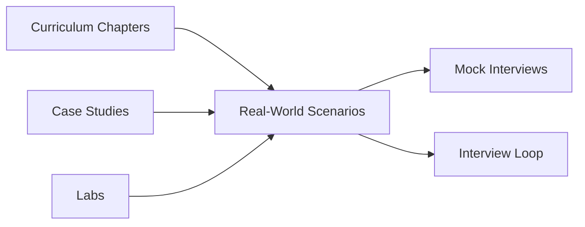
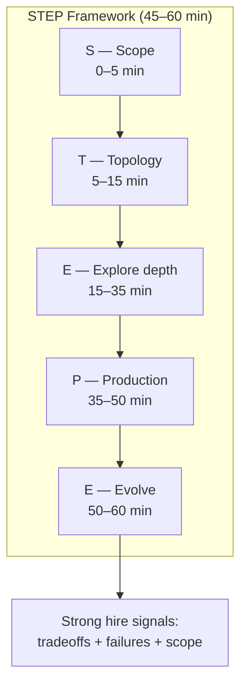
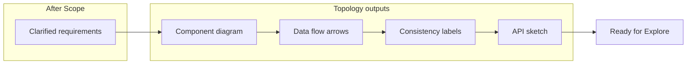
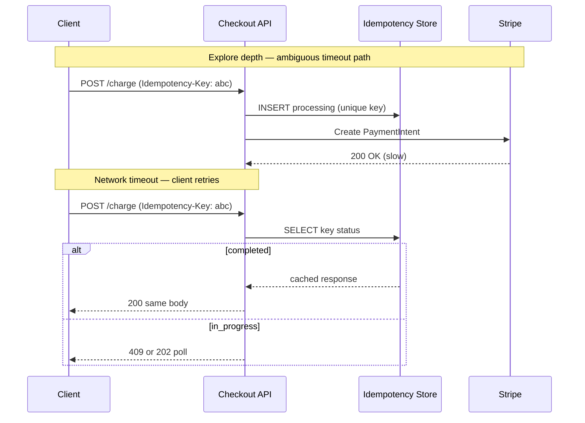
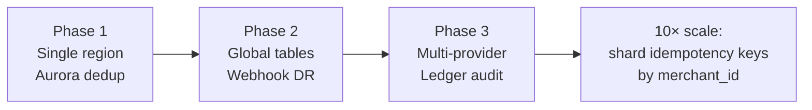
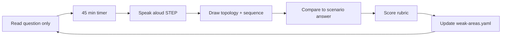

# Real-World Interview Prep

Principal interviews reward **production reasoning**, not textbook recitation. This guide shows how to use **real-world scenario walkthroughs** — step-by-step answers grounded in systems companies actually run.

## How This Fits the Curriculum

*Figure: Learn mechanism in chapters → apply in scenarios → practice under time pressure.*

| Layer | Purpose | Location |
|-------|---------|----------|
| **Theory** | Mechanisms, guarantees, formal models | `docs/` curriculum |
| **Production evidence** | How companies built it | `case-studies/` |
| **Interview application** | Step-by-step timed answers | [Real-World Scenarios](/docs/real-world-scenarios/overview) |
| **Hands-on** | Implement the pattern | `labs/` |
| **Drill** | Timed mocks | [Mock Interviews](/docs/mock-interviews/overview) |

## The STEP Interview Framework

**STEP** is the timed answer structure used across all [Real-World Scenarios](/docs/real-world-scenarios/overview). It turns a vague principal-level prompt into a **production-grounded narrative** in 45–60 minutes — the same window most onsite system-design and technical-deep-dive rounds allow.

STEP complements (does not replace) the [PRACTICE framework](/docs/system-design/system-design-methodology) used in greenfield system-design interviews. Use **PRACTICE** when you start from a blank problem ("design Twitter"). Use **STEP** when the prompt is anchored in a **real system** ("how does Stripe prevent duplicate charges?") or when you walk through a scenario from this portal.

*Figure 1: Linear flow through STEP phases. Do not skip Scope — principal panels penalize technology-first answers.*

### Why STEP exists

| Problem in principal interviews | How STEP fixes it |
|--------------------------------|-------------------|
| Jumping to microservices before clarifying requirements | **Scope** forces explicit requirements and non-goals |
| Diagrams without named consistency or delivery semantics | **Topology** names models and boundaries early |
| Shallow "we use Kafka" without bottleneck math | **Explore** dedicates 20 minutes to depth + numbers |
| Designs that ignore ops, cost, and incidents | **Production** covers failure modes and observability |
| No roadmap or scaling story | **Evolve** shows phased delivery and 10× growth |

### Time budget overview

```mermaid
gantt
    title STEP Interview Timeline (60-minute round)
    dateFormat X
    axisFormat %M min
    section Phases
    Scope           :0, 5
    Topology        :5, 15
    Explore depth   :15, 35
    Production      :35, 50
    Evolve          :50, 60
```

*Figure 2: Recommended time boxes. In a 45-minute round, compress Explore to ~15 min and Evolve to ~5 min.*

| Phase | Time | One-line goal |
|-------|------|---------------|
| **S** — Scope | 0–5 min | Align on problem, constraints, and **non-goals** |
| **T** — Topology | 5–15 min | Draw components, data flow, APIs; name consistency model |
| **E** — Explore depth | 15–35 min | Deep dive on bottleneck with stated assumptions and numbers |
| **P** — Production | 35–50 min | Failure modes, observability, rollout, cost, org impact |
| **E** — Evolve | 50–60 min | Phase 1 vs target state; what changes at 10× scale |

---

### S — Scope (0–5 minutes)

**Purpose:** Prove you can **lead the conversation** before drawing boxes. Principal interviewers often withhold requirements to test judgment.

**What to do:**

1. Restate the question in your own words.
2. Ask clarifying questions (functional + non-functional).
3. State **explicit non-goals** ("we are not solving fraud ML in this round").
4. Agree on success metrics with the interviewer (latency, durability, correctness).
5. Write requirements on the whiteboard — get a nod before proceeding.

**Questions to ask (pick 3–5):**

| Category | Example questions |
|----------|-------------------|
| **Users & scale** | How many QPS at peak? Read/write ratio? Multi-tenant? |
| **Correctness** | Can we lose writes? Duplicate charges acceptable? |
| **Latency** | p99 target? Sync vs async acceptable to user? |
| **Scope** | Greenfield or evolution of existing system? |
| **Constraints** | Cloud (AWS/GCP)? Compliance (PCI, GDPR)? |

**Principal signals:**

- "Timeout after charge succeeded is the hard case — not duplicate network retries alone."
- "Non-goal: optimizing for sub-10ms latency; goal is **no duplicate money movement**."

**Red flags:**

- Drawing databases before asking who the client is.
- Assuming scale numbers without stating them as assumptions.

**Example (Stripe idempotency):**  
*Scope answer:* "We're designing payment API behavior when the client sees a timeout. Success means: retries never double-charge; ambiguous states resolve safely. Non-goal: card network settlement optimization. Assume REST + `Idempotency-Key` header, 24h key retention."

→ Full scenario: [Stripe Payment Idempotency](/docs/real-world-scenarios/stripe-payment-idempotency)

---

### T — Topology (5–15 minutes)

**Purpose:** Establish a **shared mental model** — components, boundaries, and data flow — before diving into algorithms.

**What to do:**

1. Draw 4–7 boxes: clients, API tier, data stores, async pipeline, external deps.
2. Label **sync vs async** paths (solid vs dashed arrows).
3. Name the **consistency model** on each read/write path.
4. Sketch critical API contracts (headers, idempotency keys, webhook flow).
5. Call out trust boundaries (public internet vs VPC vs partner API).

*Figure 3: Topology deliverables before deep dive.*

**Principal signals:**

- "Mutations go through API → idempotency store → payment provider; webhooks are **at-least-once** with dedup."
- "Strong consistency on idempotency row; eventual on analytics."

**Red flags:**

- 15 microservices with no data flow arrows.
- No external dependency (Stripe, Kafka, S3) when the question implies one.

**Example (Stripe):**  
Draw client → ALB → Checkout API → Aurora (`idempotency_keys`) → Stripe API; parallel path Stripe webhooks → SQS → worker → same ledger.

---

### E — Explore depth (15–35 minutes)

**Purpose:** This phase separates **Staff** from **Principal**. Go deep on **one or two critical mechanisms** — the bottleneck, correctness argument, or algorithm — with numbers.

**What to do:**

1. Identify the **hardest sub-problem** (ambiguous timeout, fan-out hot key, cross-region failover).
2. Walk through **happy path** step-by-step (numbered sequence).
3. Walk through **failure path** (timeout after provider success, duplicate webhook).
4. Show **state machine** or sequence diagram for critical logic.
5. Provide **back-of-envelope** math with stated assumptions.

**Depth checklist:**

| Item | Include? |
|------|----------|
| State machine for idempotency (`processing` → `completed`) | ✓ |
| DB unique constraint + transaction boundaries | ✓ |
| Timeout values and why (client vs server vs provider) | ✓ |
| QPS / storage estimate for idempotency table | ✓ |
| Comparison of at-least-once vs exactly-once semantics | ✓ |

*Figure 4: Sequence diagram typical of Explore phase (Stripe-style idempotency).*

**Principal signals:**

- "The invariant: at most one financial side effect per idempotency key."
- "Reconciliation job heals `processing` rows older than 5 minutes."

**Red flags:**

- Only happy path; no timeout or duplicate delivery story.
- Numbers without assumptions ("we need Redis" with no QPS).

---

### P — Production (35–50 minutes)

**Purpose:** Demonstrate you have **operated** systems — not only designed them. Cover failure modes, observability, deployment, cost, and organizational impact.

**What to do:**

1. **Failure modes table** — symptom, detection, mitigation (minimum 4 rows).
2. **Observability** — metrics, logs, traces; alert on what?
3. **SLOs** — error budget linkage; what page wakes someone up?
4. **Rollout** — feature flags, canary, backward compatibility.
5. **Cost** — dominant cost drivers at scale.
6. **Security / compliance** — PCI scope, secrets, audit trail.
7. **Runbooks** — sweeper job, reconciliation, game day.

| Failure | Symptom | Mitigation |
|---------|---------|------------|
| Idempotency store unavailable | 503 on all POSTs | Fail closed; no charges without dedup |
| Stuck `processing` rows | Keys blocked 24h | Sweeper + manual COE threshold |
| Webhook duplicate storm | Duplicate downstream events | Consumer idempotency on `event_id` |
| Regional Aurora failover | Brief write unavailability | Promote replica; RPO documented |

**Principal signals:**

- "Alert on `idempotency_processing_age_p99 > 2m` and duplicate `payment_intent_id` in reconciliation."
- "Postmortem action: mandatory idempotency on all mutating merchant APIs."

**Red flags:**

- "We'll monitor it" without metric names.
- No mention of on-call or incident response.

---

### E — Evolve (50–60 minutes)

**Purpose:** Show **strategic thinking** — phased delivery, technical debt, and how the system changes at 10× scale or in year two.

**What to do:**

1. **Phase 1 (MVP)** — minimum safe production slice.
2. **Phase 2** — scale, multi-region, advanced features.
3. **10× scale** — what breaks first (hot keys, DB size, webhook lag).
4. **Alternatives considered** — what you rejected and why.
5. **Org impact** — teams, standards, platform adoption.

*Figure 5: Evolve phase — roadmap narrative.*

**Principal signals:**

- "Phase 1 ships idempotency in API only; Phase 2 adds async outbox for webhooks."
- "At 10× merchants, partition idempotency table by `merchant_id` — hot key risk on mega-tenant."

**Red flags:**

- No phases — everything in v1.
- Cannot name what breaks at scale.

---

### STEP vs PRACTICE — when to use which

| Framework | Best for | Starts with | Portal location |
|-----------|----------|-------------|-----------------|
| **STEP** | Real-world scenarios, deep dives on production systems | Clarified production problem | This page + [Domain 32](/docs/real-world-scenarios/overview) |
| **PRACTICE** | Greenfield system design ("design X") | Problem restatement + capacity | [System Design Methodology](/docs/system-design/system-design-methodology) |

Many principal loops use **both**: a 60-min greenfield design (PRACTICE) plus a 45-min "tell me about a system you built" or scenario walkthrough (STEP).

---

### Scoring rubric (self-assessment)

After each practice session, score 1–5 per phase:

| Score | Meaning |
|-------|---------|
| 1 | Skipped or incoherent |
| 2 | Mentioned topic but shallow |
| 3 | Adequate — hire bar for some companies |
| 4 | Strong — clear tradeoffs and numbers |
| 5 | Principal — production war stories, org scope, anticipates follow-ups |

**Pass threshold:** Average ≥ 3.5 with **no phase below 2**. Weak Scope or Production usually fails principal bar even if Explore is strong.

---

### Worked example: STEP on Stripe (condensed)

| Phase | What you say (summary) |
|-------|------------------------|
| **S** | Prevent duplicate charges on timeout; idempotency keys; PCI-aware; non-goal: FX optimization |
| **T** | Client → API → Aurora dedup → Stripe; webhooks via SQS; fail-closed without store |
| **E** | State machine; sequence for timeout retry; unique `(tenant, key)`; reconciliation sweeper |
| **P** | Metrics on processing age; alerts; stuck row runbook; webhook idempotent consumer |
| **E** | v1 single-region; v2 multi-region dedup; shard by merchant at 10× |

Full 90-minute walkthrough: [Stripe Payment Idempotency](/docs/real-world-scenarios/stripe-payment-idempotency)

---

### STEP practice loop

*Figure 6: Weekly practice loop — repeat with a new scenario each Friday.*

| Step | Action |
|------|--------|
| 1 | Pick a [scenario](/docs/real-world-scenarios/overview) |
| 2 | Cover the answer; read **only** the interview question |
| 3 | Run STEP aloud with a timer |
| 4 | Uncover the official walkthrough; note gaps |
| 5 | Log weak phases in `progress/weak-areas.yaml` |

---

### Quick reference card

| Letter | Phase | Must mention |
|--------|-------|--------------|
| **S** | Scope | Requirements, non-goals, success metrics |
| **T** | Topology | Diagram, consistency model, API contract |
| **E** | Explore | Deep dive, numbers, failure path, state machine |
| **P** | Production | Observability, incidents, rollout, cost |
| **E** | Evolve | Phases, 10× scale, alternatives rejected |

Print or bookmark this section before mock interviews.

## Weekly Integration

| Day | Activity |
|-----|----------|
| Mon–Wed | Read related curriculum chapter |
| Thu | Complete related lab |
| Fri | Read one [real-world scenario](/docs/real-world-scenarios/overview) aloud (45 min timed) |
| Sat | Full system-design mock using scenario as prompt |
| Sun | Update `progress/weak-areas.yaml`; review flashcards |

## Scenario Catalog

Start with these high-frequency principal topics:

| Scenario | Company / system | Interview focus |
|----------|------------------|-----------------|
| [Stripe Payment Idempotency](/docs/real-world-scenarios/stripe-payment-idempotency) | Stripe | Partial failure, ambiguous timeouts |
| [Netflix Cascading Failure](/docs/real-world-scenarios/netflix-cascading-failure) | Netflix | Circuit breakers, bulkheads, retry storms |
| [Shopify Transactional Outbox](/docs/real-world-scenarios/shopify-transactional-outbox) | Shopify | Dual-write, reliable event publishing |
| [Amazon DynamoDB Consistency](/docs/real-world-scenarios/amazon-dynamodb-eventual-consistency) | AWS DynamoDB | CAP, quorums, session guarantees |
| [Uber Ride Matching](/docs/real-world-scenarios/uber-ride-matching) | Uber | Geospatial, real-time matching, consistency |
| [Slack Message Delivery](/docs/real-world-scenarios/slack-message-delivery) | Slack | Ordering, Kafka, delivery semantics |
| [Google Spanner TrueTime](/docs/real-world-scenarios/google-spanner-global-consistency) | Google Spanner | Global consistency, clock uncertainty |
| [Airbnb Rate Limiting](/docs/real-world-scenarios/airbnb-distributed-rate-limiting) | Airbnb | Distributed quotas, fairness |
| [Dropbox Sync Conflicts](/docs/real-world-scenarios/dropbox-file-sync-conflicts) | Dropbox | Eventual consistency, conflict resolution |
| [Meta News Feed](/docs/real-world-scenarios/meta-news-feed-design) | Meta | Fan-out, caching, hot keys |
| [AWS S3 Multi-Region DR](/docs/real-world-scenarios/aws-s3-multi-region-dr) | AWS S3 | Durability, RPO/RTO, failover |
| [OpenAI LLM Gateway](/docs/real-world-scenarios/openai-llm-gateway) | OpenAI / platform | Routing, budgets, tail latency |

Full index: [Real-World Scenario Index](/docs/reference/real-world-scenario-index).

## How to Practice One Scenario (45 minutes)

1. **Set a timer** for 45 minutes.
2. **Read only the interview question** (cover the answer).
3. **Speak aloud** using STEP — record yourself if possible.
4. **Draw** the whiteboard section on paper.
5. **Uncover** the step-by-step answer; compare gaps.
6. **Score** yourself with the scenario's rubric (Strong / Adequate / Weak).
7. **Log** weak areas in `progress/weak-areas.yaml`.

## Connecting to Your Experience

For each scenario, prepare one sentence:

> "In my role at [company], we faced a similar problem when [situation]. We chose [decision] because [tradeoff], and measured [metric]."

Interviewers at principal level expect **organizational scope** — not only what the system does, but how you influenced teams, SLOs, and roadmaps.

## Next Steps

1. Read [System Design Methodology](/docs/system-design/system-design-methodology) for the PRACTICE framework.
2. Pick your first scenario from the [catalog](/docs/real-world-scenarios/overview).
3. Schedule a [mock interview](/docs/mock-interviews/system-design-mock) after completing three scenarios.
