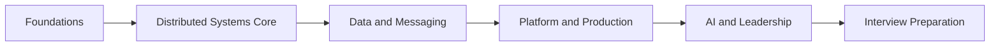

# Welcome

Welcome to the **Principal Architect Knowledge System** — a comprehensive platform for Senior Principal Architect, Distinguished Engineer, and Principal Engineer interview preparation.

## What This System Is

This is five products in one:

1. **Graduate-level technical textbook** — distributed systems, storage, consensus, and production architecture
2. **Interview preparation system** — principal-level questions, mock interviews, and company guides
3. **Architecture reference library** — searchable concepts, case studies, and cheat sheets
4. **Hands-on lab environment** — implement algorithms and production patterns
5. **Knowledge-management platform** — track progress, weak areas, and readiness

## Who This Is For

Experienced architects with production knowledge of cloud platforms, microservices, and enterprise systems who are preparing for technically rigorous interviews at companies such as Adobe, Amazon, Google, Microsoft, Meta, NVIDIA, Snowflake, Databricks, Stripe, OpenAI, and Anthropic.

## How to Begin

1. Read [How to Use This System](./how-to-use-this-system)
2. Review the [Curriculum Overview](./curriculum-overview)
3. Choose a learning path — start with the [12-Week Interview Sprint](./12-week-learning-path) if you have active applications
4. Practice with [Real-World Interview Prep](./real-world-interview-prep) — step-by-step scenarios from Stripe, Netflix, Uber, and more
5. Review [Coding Preparation](./coding-preparation) — principal-level expectations when recruiters confirm coding rounds

**Live portal:** [https://paks.bayareala8s.com](https://paks.bayareala8s.com) (AWS-hosted; share with students)

6. Begin with [Distributed Systems Foundations](/docs/distributed-systems-foundations/overview)

## Guiding Principles

- **Depth before breadth** — understand mechanisms, guarantees, and failures
- **First-principles reasoning** — explain *why*, not just *what*
- **Tradeoffs over prescriptions** — no universal best practices
- **Production realism** — connect theory to operations
- **Interview usefulness** — every module includes principal-level practice

*Figure: Recommended learning progression through the curriculum domains.*
