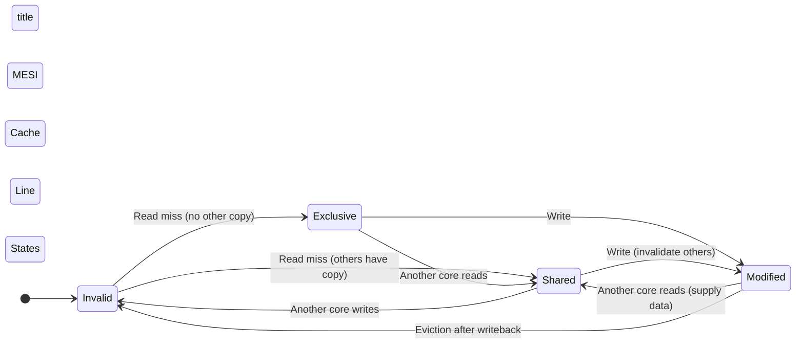
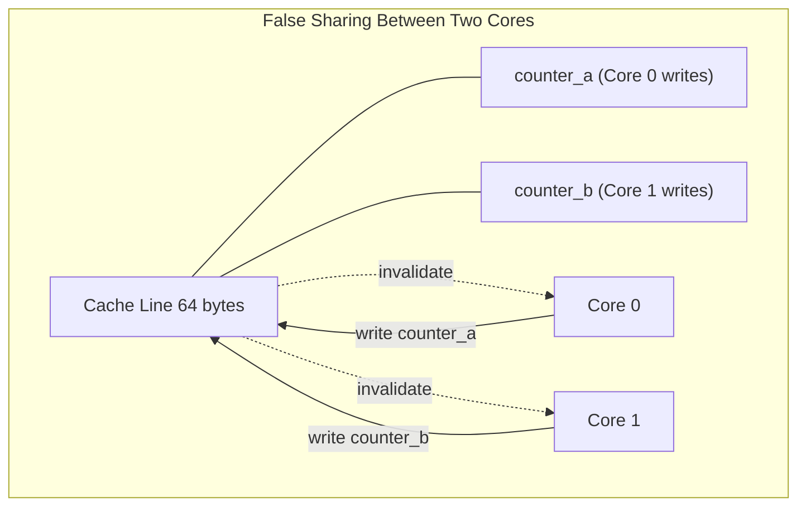
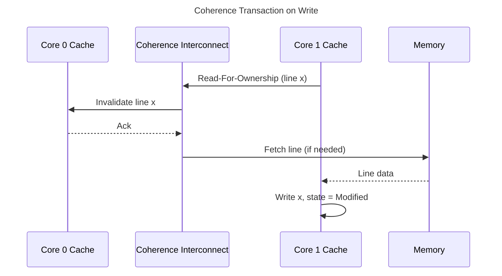

# Caches and Cache Coherence

## 1. Executive Summary

Caches bridge the speed gap between CPUs and main memory by keeping copies of recently used data close to the cores that need them. In multi-core systems, each core may hold its own copy of the same memory location — creating a coherence problem: when one core writes, all other copies must be updated or invalidated so software observes a consistent memory model.

This chapter explains cache organization (direct-mapped, set-associative, fully associative), replacement policies, write policies, the MESI family of coherence protocols, false sharing, and cache-conscious data structure design. You will learn why a 1% change in data layout can cause a 10x performance swing, and why distributed caches at the application layer echo the same invalidation challenges at the hardware level.

**Key takeaway:** Caches are not transparent performance boosters — they are shared, finite resources whose behavior shapes scalability, tail latency, and correctness in concurrent programs.

---

## 2. Why This Topic Matters

Principal architects routinely debug production incidents where "nothing changed in the algorithm" but throughput collapsed — often due to cache effects. Interview panels probe:

- What is false sharing and how do you fix it?
- How does MESI work at a high level?
- Why do concurrent hash maps need careful design?
- How do hardware caches relate to application-level distributed caches?

Understanding cache coherence connects low-level concurrency bugs to high-level architecture decisions: shard ownership, read replicas, and cache invalidation strategies in [Distributed Caching](/docs/caching/distributed-caching) mirror hardware invalidation traffic.

This chapter builds on [CPU and Memory Fundamentals](/docs/computer-architecture/cpu-and-memory-fundamentals) and precedes [Memory Ordering and Concurrency](/docs/computer-architecture/memory-ordering-and-concurrency).

---

## 3. Problems Being Solved

| Problem | Description | Why it is hard |
|---------|-------------|----------------|
| **Capacity misses** | Working set exceeds cache size | Must evict useful data |
| **Conflict misses** | Multiple addresses map to same cache set | Pathological access patterns |
| **Coherence** | Multiple cores hold stale copies | Requires inter-core communication |
| **Write ordering** | When do writes become visible? | Performance vs. correctness tradeoff |
| **False sharing** | Independent variables share a cache line | Coherence traffic without logical sharing |

The goal is to **maximize hit rate** for hot data, **minimize coherence traffic** on shared writes, and **design data layouts** that align with cache line granularity.

---

## 4. Assumptions and System Model

- **Cache line granularity:** We assume 64-byte lines on commodity x86-64 and ARM servers unless stated otherwise.
- **Write-back, write-allocate** caches are typical at L1/L2 for performance.
- **MESI or MOESI** coherence on multi-core chips; directory or snooping implementation is microarchitecture-specific.
- **Sequential consistency not assumed** for multi-threaded programs without synchronization.

**Assumption to state in designs:** "We assume standard cache coherence on commodity servers. Cross-socket coherence may use a directory or snoop filter; remote invalidation adds latency we account for in NUMA deployments."

---

## 5. Essential Terminology

| Term | Definition |
|------|------------|
| **Cache hit** | Requested data found in cache |
| **Cache miss** | Data must be fetched from lower level |
| **Cache line / block** | Unit of transfer between cache levels |
| **Set-associative** | Each address maps to one set of N possible lines |
| **Tag** | Address bits identifying which memory block occupies a line |
| **Dirty line** | Modified in cache but not yet written to lower level |
| **MESI** | Modified, Exclusive, Shared, Invalid — coherence state machine |
| **Snooping** | Cores monitor bus/interconnect for coherence transactions |
| **Directory** | Per-line record of which cores hold copies (common at scale) |
| **False sharing** | Independent data in same line causes unnecessary invalidations |
| **Write-through** | Writes go immediately to lower level |
| **Write-back** | Writes update cache; lower level updated on eviction |

---

## 6. Core Mechanism

Multi-core caches coordinate through coherence protocols. MESI is the canonical teaching model:

**Explanation:** A line in **Modified** state means this core has the only valid copy and main memory is stale. A write on a **Shared** line requires invalidating other cores' copies. **Invalid** means the line must be refetched on access. Transitions generate interconnect traffic — the cost of multi-core sharing.

**Explanation:** `counter_a` and `counter_b` are logically independent but physically share a cache line. Each write invalidates the other core's copy, forcing refetch — scalability collapses despite no logical data race.

---

## 7. Step-by-Step Walkthrough

**Scenario:** Core 0 reads variable `x`; Core 1 writes `x`.

**Step 1 — Core 0 read miss.** `x` loads into Core 0's L1 in **Exclusive** state (assuming no other copies).

**Step 2 — Core 1 write.** Core 1 must obtain the line in **Modified** state. It sends an invalidate or read-for-ownership request.

**Step 3 — Core 0 invalidation.** Core 0's copy transitions to **Invalid**. If Core 0 reads `x` again, it misses and fetches the updated value.

**Step 4 — Visibility.** The coherence protocol ensures that after Core 1's write completes (in the coherence sense), Core 0 eventually sees the new value — but **not necessarily immediately without memory barriers** (see [Memory Ordering and Concurrency](/docs/computer-architecture/memory-ordering-and-concurrency)).

**Step 5 — False sharing variant.** If Core 0 writes `a` and Core 1 writes `b` in the same line, each write triggers invalidation on the other core — ping-pong effect.

---

## 8. Invariants and Guarantees

| Property | Guarantee | Scope |
|----------|-----------|-------|
| **Coherence** | Writes to one address eventually visible to all cores | Per-address, hardware-enforced |
| **Atomicity of aligned accesses** | Native word-sized aligned loads/stores are atomic | ISA-dependent size (e.g., 64-bit on x86-64) |
| **Cache inclusion** | Some hierarchies include lower levels in upper (not universal) | Microarchitecture-specific |

**Not guaranteed without synchronization:**

- Ordering of writes to different addresses across cores.
- That avoiding data races in source code eliminates false sharing.
- Constant-time access — coherence misses add variable latency.

---

## 9. Failure Scenarios

### Scenario 1: False Sharing in Metrics

A service exports per-thread request counters stored in a dense array. All threads update distinct indices.

**Symptoms:** CPU utilization high; throughput flat; coherence traffic dominates (`perf c2c` shows HITM — hit modified).

**Mitigation:** Pad each counter to a cache line (`alignas(64)`); use per-core sharded counters.

### Scenario 2: Cache Thrashing in Hash Table

A hash table with capacity just above a power of two causes many keys to map to the same cache sets (conflict misses).

**Symptoms:** Miss rate spikes despite small working set; worse than theoretical O(1) expectations.

**Mitigation:** Increase associativity cannot be controlled in software; change table size, use different hash bits, or restructure for open addressing with better locality.

### Scenario 3: Read-Mostly Cache Stampede at Application Layer

Mirrors hardware: thousands of clients invalidate the same application cache entry simultaneously.

**Symptoms:** Database overload; latency spike — analogous to coherence storm on a hot cache line.

**Mitigation:** See [Cache Invalidation](/docs/caching/cache-invalidation) — probabilistic early expiration, request coalescing, single-flight.

---

## 10. Performance Characteristics

Cache performance depends on:

- **Hit rate:** Fraction of accesses served from cache.
- **Miss penalty:** Cycles to fetch from lower levels.
- **Coherence traffic:** Invalidations and writebacks on shared writes.

**Read-heavy, immutable data** scales well — lines stay in **Shared** state without invalidations.

**Write-heavy shared state** serializes through coherence — the hardware analog of a poorly sharded distributed lock.

Qualitative rule: **one hot write-shared cache line can bottleneck an entire socket**. Measure with hardware counters; do not invent hit-rate percentages.

---

## 11. Scalability Limits

| Signal | Limit | Response |
|--------|-------|----------|
| Many writers to adjacent fields | False sharing | Padding, sharding |
| Globally mutable hot struct | Single line coherence bottleneck | Split fields; per-shard ownership |
| Working set > LLC | Capacity misses | Reduce footprint; tiered storage |
| Cross-socket sharing | Remote coherence latency | NUMA-local data structures |

Application caches face the same limits at cluster scale: a hot key is a distributed false-sharing problem.

---

## 12. Operational Considerations

**Profiling tools:** Linux `perf c2c` (false sharing detection), Intel VTune cache analysis, `pcm-memory` for bandwidth.

**Deployment:** Document cache-line size assumptions in performance-sensitive libraries. ARM and x86 are typically 64 bytes but verify.

**Regression testing:** Include microbenchmarks for concurrent counters and queues in CI for platform teams.

**Hardware migration:** Cache sizes and associativity change across CPU generations — re-profile after upgrades.

---

## 13. Security Considerations

- **Cache timing side channels:** Attacker measures access time to infer secrets (AES T-table attacks historically). Mitigation: constant-time algorithms, cache partitioning in some environments.
- **Flush+Reload:** Coherence used to detect victim's cache access patterns across security domains — relevant for cloud multi-tenancy threat models.

Security-sensitive crypto code must be cache-aware, not only algorithmically correct.

---

## 14. Cost Considerations

False sharing and coherence storms waste CPU cycles you already paid for — no additional hardware fixes bad layout.

Application-level cache clusters (Redis, Memcached) incur network and memory cost; hardware cache misses incur latency cost. Both reward **ownership partitioning**: each datum has one primary writer.

---

## 15. Production Implementations

| Pattern | Example | Cache analogy |
|---------|---------|---------------|
| **Padded counters** | `statsd`, per-CPU kernel counters | Avoid false sharing |
| **Seqlock** | Linux kernel `seqlock_t` | Read-mostly with rare writes |
| **RCU** | Linux Read-Copy-Update | Readers without writer invalidation storms |
| **Sharded concurrent maps** | Java `ConcurrentHashMap` segments | Partition coherence domains |
| **CPU affinity for hot loops** | DPDK, trading engines | Keep line in local cache |

### Extended: Replacement Policies and LRU Approximation

Caches use **replacement policies** (LRU approximations, random, NRU) to choose victims on capacity miss. True LRU is expensive at scale; CPUs use pseudo-LRU trees or clock algorithms. **Scan resistance** matters for streaming workloads — one sequential pass can evict entire working set (cache pollution). **Cache-friendly algorithms** reuse blocks before eviction completes. Database buffer pools mimic these policies with LRU-K or clock sweeps — hardware and software caches share design tensions.

### Extended: Prefetching Strategies

**Hardware stride prefetchers** detect regular access patterns and issue prefetch requests. **Software prefetch** intrinsics (`__builtin_prefetch`) hint upcoming accesses — useful when access pattern is irregular but predictable by domain knowledge (graph traversal with known next node). Over-prefetching wastes bandwidth and evicts useful lines — profile before adding hints fleet-wide.

---

## 16. Alternatives and Tradeoffs

| Approach | Pros | Cons | When |
|----------|------|------|------|
| **Padding** | Simple false-sharing fix | Memory overhead | Hot counters |
| **Per-core aggregation** | Zero sharing during update | Merge complexity | Metrics, histograms |
| **Message passing** | No shared mutable state | Latency | Pipeline stages |
| **Read-copy-update** | Fast reads | Deferred reclamation | Read-heavy config |
| **Distributed cache** | Cross-process sharing | Network invalidation | Multi-instance services |

---

## 17. Common Misconceptions

1. **"Volatile fixes false sharing."** — Volatile affects visibility ordering, not cache line placement.

2. **"Mutexes prevent false sharing."** — Mutexes prevent data races; adjacent fields can still ping-pong cache lines.

3. **"MESI is only academic."** — It explains production scalability cliffs.

4. **"More cores help read-heavy workloads always."** — Even reads cause coherence traffic if another core writes nearby.

5. **"L3 is shared so L1 doesn't matter."** — L1 miss rate still dominates hot loops.

6. **"Application cache replaces need to think about hardware."** — Both layers need invalidation discipline.

---

## 18. Principal Architect Perspective

Principal architects connect hardware coherence to system design:

- **Shard by cache-line-equivalent boundaries** at scale: partition tenant data so hot writes do not collide.
- **Metrics pipelines** should use per-instance aggregation before global merge — mirrors per-core counters.
- **Platform libraries** should expose padded atomic types or document alignment requirements.

**Interview signal at principal level:** Candidate draws parallel between MESI invalidation and Redis pub/sub invalidation across app servers.

### Extended: Associativity and Conflict Misses

A set-associative cache maps each memory address to exactly one **set** containing N lines. If a working set of N+1 frequently used lines maps to the same set, capacity exists globally but **conflict misses** occur — lines evict each other in a ping-pong pattern. Matrix transpose and strided access patterns trigger this behavior. Mitigations include **loop tiling** (blocking) so submatrices fit cache levels, padding leading dimensions to avoid power-of-two strides, and choosing hash table sizes that reduce set collisions. This is distinct from capacity misses (total working set too large) and compulsory misses (first touch).

### Extended: MOESI and Directory Coherence

Production multi-socket systems often use **MOESI** (adding **Owned** — a core may respond to reads without memory fetch) and **directory protocols** that track which sockets cache each line. Snooping broadcasts invalidations on a bus; directories target only sharers, reducing traffic at scale. Cross-socket invalidation latency explains why NUMA-local allocation matters even when total RAM is sufficient. Interviewers may ask you to connect MESI invalidation to **why a single hot lock degrades all cores** — the lock metadata line becomes a coherence hotspot analogous to a hot Redis key.

### Extended: Cache-Conscious Queue Design

Lock-free Michael-Scott queues place head and tail pointers in separate cache lines intentionally so producer and consumer threads minimize coherence traffic. Without padding, head and tail updates on the same line cause false sharing despite correct atomic semantics. When reviewing concurrent data structures, always ask: **who writes which line?** The answer predicts scalability better than Big-O alone.

---

## 19. Architecture Review Exercise

**Scenario:** A latency-critical order book stores bids and asks in a single struct array updated by 16 threads (one per symbol shard). After adding a per-symbol `last_updated_timestamp` field at the start of each struct, throughput dropped 40%.

**Tasks:**

1. Explain a cache-related root cause.
2. Propose struct layout changes.
3. Describe how you would confirm with `perf c2c`.
4. Relate to distributed cache invalidation if order book state is replicated.

---

## 20. Whiteboard Explanation

"Each core has private L1/L2 caches but shared memory. When one core writes, hardware invalidates other cores' copies of that cache line — MESI tracks Modified, Exclusive, Shared, Invalid. If two independent variables sit in the same 64-byte line, writes ping-pong invalidations — false sharing. Fix by padding or giving each writer its own line. At scale, the same pattern appears when 100 servers invalidate one Redis key."

---

## Extended Walkthrough: Designing a Sharded Metrics System

Consider a metrics aggregator receiving 1M counter updates per second from 200 application instances. Version 1 stores all counters in a single `ConcurrentHashMap` with striped locks. CPU is high; scalability stalls at 32 cores.

**Analysis:** Profiling with `perf c2c` shows HITM events on hash bucket headers — false sharing and lock line contention. Even lock-free `AtomicLong` per key fails if keys hash to adjacent buckets in the same cache line.

**Version 2:** Partition counters by `(tenant_id, metric_name)` hash into 64 shards. Each shard is a struct padded to 64 bytes containing only local counters. Aggregation thread per shard; global merge every second.

**Version 3:** Eliminate cross-core writes entirely during ingest — each application instance maintains local counters; push deltas via UDP to assigned aggregator core using SO_REUSEPORT and CPU pinning.

**Result framing (qualitative):** Coherence traffic drops because writes stay on owned lines. This mirrors hardware lesson: **minimize shared writable cache lines**. At distributed scale, the same design appears in [Distributed Caching](/docs/caching/distributed-caching) with per-partition ownership.

**Interview articulation:** Candidate connects MESI invalidation, false sharing, sharding, and merge intervals without inventing throughput numbers — describes measurement plan instead.

---

## Extended Failure Scenario: Cache-Induced Latency Spike During GC

A JVM service experiences periodic p99 latency spikes aligned with young-generation GC. Investigation shows GC threads scanning or moving objects causing **cache pollution** — hot application data evicted from LLC. Subsequent requests miss cache until working set reheats.

**Mitigation strategies (implementation choices):** Increase young gen if allocation rate high; use object pools for short-lived garbage; colocate GC threads on separate NUMA node where possible; consider low-pause collectors for latency targets; reduce allocation rate in hot path. **Principal angle:** GC is not only heap management — it interacts with CPU cache hierarchy. Capacity reviews should include GC pause *and* post-GC cache rewarm effects for latency-sensitive tiers.

---

## 21. Interview Questions

1. What problem does cache coherence solve?

2. Name the four MESI states and what triggers transitions.

3. What is false sharing? How do you detect and fix it?

4. Difference between write-through and write-back caches?

5. What is a cache conflict miss?

6. Why does padding a struct to 64 bytes sometimes improve multi-threaded performance?

7. How does set-associativity reduce conflict misses?

8. Compare snooping and directory-based coherence.

9. How do hardware caches relate to application-level distributed caches?

10. What is HITM in `perf c2c` output?

11. Why might a concurrent queue suffer from cache effects even when algorithmically lock-free?

12. How would you design a per-core metrics aggregator?

---

## 22. Interview Follow-Ups

1. **After Q3:** "Does `std::atomic` on adjacent variables prevent false sharing?" — *No; need alignment/padding.*

2. **After Q8:** "When does directory beat snooping?" — *Many cores; reduces broadcast traffic; common cross-socket.*

3. **Principal:** "Your team's shared config struct is a bottleneck — organizational fix?" — *Platform-owned RCU config, versioned snapshots, change review for hot paths.*

---

## 23. Strong Answer Example

**Question:** "Explain false sharing and give a production example."

**Strong answer:**

"False sharing occurs when two threads mutate different variables that reside in the same cache line. Coherence requires each write to invalidate other cores' copies of the line, even though there is no logical data race.

A classic production case is per-thread counters in a dense array — each thread increments its own index, but eight counters fit in one 64-byte line, so cores invalidate each other continuously. Throughput can decrease as threads increase.

Fix: pad each counter to a cache line boundary, or use per-core accumulation with a merge step. Confirm with `perf c2c` showing HITM events on the offending addresses. This is the on-chip analog of 50 services invalidating the same Redis key — partition ownership to reduce invalidation storms."

---

## 24. Weak Answer Example

**Weak answer:** "False sharing is when two threads access the same variable. Use a mutex."

**Why weak:** Confuses false sharing with data races; mutex does not fix line placement; no detection or layout strategy.

---

## 25. Hands-On Exercise

1. Implement two increment benchmarks: padded `int64` per thread vs. packed array.
2. Run with 1, 2, 4, 8 threads; plot throughput.
3. Use `perf c2c` (Linux) to identify HITM on packed version.
4. Document cache line size from `getconf LEVEL1_DCACHE_LINESIZE`.

---

## 26. Knowledge Check

1. MESI **Modified** means? *(This core has sole valid copy; memory stale.)*
2. False sharing requires a data race? *(No — independent variables, same line.)*
3. Typical cache line size? *(64 bytes on most commodity servers.)*
4. Write-back vs. write-through? *(Write-back defers DRAM update until eviction.)*
5. Coherence vs. consistency? *(Coherence: same address; consistency: ordering across addresses.)*

---

## 27. Flashcards

| Front | Back |
|-------|------|
| MESI | Modified, Exclusive, Shared, Invalid coherence states |
| False sharing | Independent vars in same line cause invalidation ping-pong |
| Cache line | 64-byte typical unit of cache transfer |
| Write-back | Update cache first; DRAM updated on eviction |
| Invalid state | Line not valid; must refetch on access |
| HITM | Hit modified — another core owns dirty line |
| Set-associative | Address maps to one of N lines in a set |
| Conflict miss | Multiple addresses compete for same cache set |
| Snooping | Cores observe coherence traffic on interconnect |
| Directory | Tracks which cores cache each line |
| RCU | Read-copy-update; minimizes reader invalidation |
| Padding | Align data to cache line to isolate writers |

---

## 28. Cheat Sheet

**MESI:** Write → Modified · Solo read → Exclusive · Others read → Shared · Others write → Invalid

**False sharing fix:** `alignas(64)` · per-core shards · merge later

**Detect:** `perf c2c` · VTune · scalability cliff when adding threads

**Read-heavy:** Shared state OK · Write-heavy: partition ownership

**App layer parallel:** Hot Redis key = distributed false sharing

---

## 29. Related Concepts

- [CPU and Memory Fundamentals](/docs/computer-architecture/cpu-and-memory-fundamentals)
- [Memory Ordering and Concurrency](/docs/computer-architecture/memory-ordering-and-concurrency)
- [Caching Fundamentals](/docs/caching/caching-fundamentals)
- [Cache Invalidation](/docs/caching/cache-invalidation)
- [Distributed Caching](/docs/caching/distributed-caching)

---

## 30. References

- Hennessy, J. L., & Patterson, D. A. (2017). *Computer Architecture: A Quantitative Approach* — Cache design and coherence.
- Sorin, D. J., Hill, M. D., & Wood, D. A. (2011). *A Primer on Memory Consistency and Cache Coherence* — MESI and memory models.
- Intel. [Intel 64 and IA-32 Architectures Software Developer Manuals](https://www.intel.com/content/www/us/en/developer/articles/technical/intel-sdm.html).
- Linux `perf-c2c` documentation — False sharing detection tooling.
