# CPU and Memory Fundamentals

## 1. Executive Summary

Modern servers execute billions of instructions per second, yet every instruction ultimately reduces to fetch-decode-execute cycles over bytes stored in memory. Understanding how the central processing unit (CPU) interacts with memory — registers, caches, main memory (DRAM), and persistent storage — is foundational for reasoning about latency, throughput, and correctness in distributed systems.

This chapter covers the Von Neumann execution model, instruction pipelines, the memory hierarchy, and how hardware fundamentals constrain software design. You will learn why a cache miss costs orders of magnitude more than a register access, how branch prediction affects tail latency, and why NUMA topology matters when you scale a database or inference workload across sockets.

**Key takeaway:** Software performance and correctness are not abstract — they are constrained by how CPUs fetch instructions, move data across the memory hierarchy, and coordinate with other cores.

---

## 2. Why This Topic Matters

Principal architects are rarely asked to design silicon, but they are constantly asked to explain why a system is slow, why tail latency spikes under load, or why a seemingly innocent data structure change caused a production incident. Interview panels at senior levels probe whether you can connect application-level decisions to hardware reality:

- Why does sequential memory access outperform random access?
- Why does adding threads not always improve throughput?
- What does "memory-bound" mean versus "CPU-bound"?
- How does NUMA affect database replica placement?

These questions appear in system design interviews, architecture reviews, and capacity planning discussions. A principal who cannot articulate the CPU–memory contract will over-provision compute, mis-size caches, and design data layouts that defeat hardware prefetchers.

This topic connects directly to [Caches and Cache Coherence](/docs/computer-architecture/caches-and-cache-coherence), [Memory Ordering and Concurrency](/docs/computer-architecture/memory-ordering-and-concurrency), and downstream domains including [Caching Fundamentals](/docs/caching/caching-fundamentals) and [Storage Engine Fundamentals](/docs/storage-engines/storage-engine-fundamentals).

---

## 3. Problems Being Solved

The CPU–memory subsystem addresses several interrelated problems:

| Problem | Description | Why it is hard |
|---------|-------------|----------------|
| **Speed gap** | CPU cycles are orders of magnitude faster than DRAM access | Physics limits; cannot make memory as fast as registers |
| **Bandwidth limits** | Moving data consumes pins, power, and time | Off-chip memory is a shared bottleneck |
| **Instruction throughput** | One instruction per cycle is insufficient at GHz clocks | Pipelining, superscalar execution, speculation |
| **Addressability** | Programs need a uniform address space | Virtual memory adds translation overhead |
| **Multi-core scaling** | Multiple cores share memory and caches | Contention, coherence traffic, NUMA distance |

The goal is not to eliminate the speed gap — that is impossible — but to **hide latency** through caching, **overlap work** through pipelining, and **place data** where the consuming core can access it efficiently.

---

## 4. Assumptions and System Model

We adopt a standard Von Neumann model unless stated otherwise:

- **Stored-program model:** Instructions and data reside in the same addressable memory.
- **Sequential instruction semantics:** Program order defines logical execution, though hardware may reorder for performance if semantics are preserved.
- **Cache hierarchy:** Fast, small SRAM caches sit between CPU and slower DRAM.
- **Multi-core:** Multiple cores share last-level cache and main memory; NUMA systems add non-uniform access latency across sockets.
- **Crash-stop at hardware level:** We do not assume Byzantine hardware behavior.

**Assumption to state explicitly in designs:** "We assume a commodity x86-64 or ARM server with multi-level caches and DRAM. Latency ratios between cache levels and memory are qualitative unless measured on target hardware."

Do not cite specific nanosecond latencies unless sourced from your own benchmarks or vendor documentation for a named product generation. Latency ratios (registers faster than L1, L1 faster than DRAM) are stable architectural facts; absolute numbers vary by chip, DIMM speed, and workload.

---

## 5. Essential Terminology

| Term | Definition |
|------|------------|
| **ISA (Instruction Set Architecture)** | The contract between software and hardware: opcodes, registers, addressing modes |
| **Microarchitecture** | How a specific CPU implements the ISA: pipeline depth, cache sizes, branch predictor |
| **Register** | Fastest storage inside the CPU; explicitly named in instructions |
| **ALU (Arithmetic Logic Unit)** | Executes integer arithmetic and bitwise operations |
| **Pipeline** | Overlaps instruction stages (fetch, decode, execute, writeback) |
| **IPC (Instructions Per Cycle)** | Average instructions retired per clock cycle |
| **Cache line** | Smallest unit of cache transfer, typically 64 bytes on x86-64 and ARM |
| **DRAM** | Dynamic random-access memory; main memory, volatile, refresh required |
| **Memory hierarchy** | Tiered storage from registers → L1 → L2 → L3 → DRAM → storage |
| **NUMA (Non-Uniform Memory Access)** | Memory attached to specific sockets; local access faster than remote |
| **TLB (Translation Lookaside Buffer)** | Cache for virtual-to-physical address translations |
| **Prefetcher** | Hardware or software mechanism that loads data before it is explicitly requested |
| **p99 (99th percentile latency)** | The latency value below which 99% of requests complete; 1% are slower — the standard **tail latency** SLO metric |
| **Tail latency** | The slow end of the latency distribution (p99, p99.9); often dominated by cache misses, contention, and NUMA — not average-case CPU work |

---

## 6. Core Mechanism

Program execution follows the fetch-decode-execute cycle, accelerated by pipelining and caching:

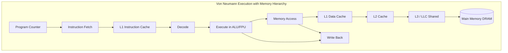

**Explanation:** The program counter points to the next instruction. The instruction fetch unit reads from the L1 instruction cache; on a miss, the hierarchy fills the line from slower levels. The execute stage may read or write operands through the data cache path. Writeback commits results to registers. Each miss propagates down the hierarchy, stalling the pipeline until data arrives.

Modern CPUs add **out-of-order execution**: independent instructions may execute before earlier slow instructions complete, provided architectural state remains consistent. **Branch prediction** speculatively fetches down one path; a misprediction flushes the pipeline — a common source of unpredictable latency in tight loops with data-dependent branches.

---

## 7. Step-by-Step Walkthrough

Consider a simple loop summing an array of integers:

**Step 1 — Address generation.** The CPU loads the base address of the array from a register and initializes an accumulator and loop counter.

**Step 2 — First iteration fetch.** The load instruction requests `array[0]`. The virtual address passes through the TLB, then the L1 data cache. On a cold start, this is a cache miss; the line is filled from L2, L3, or DRAM.

**Step 3 — Prefetching.** Hardware stride prefetchers may detect sequential access and request upcoming cache lines before the program explicitly loads them, hiding latency for subsequent iterations.

**Step 4 — Pipelined execution.** While one load waits on memory, the CPU may execute independent instructions from other iterations or other code, if register dependencies allow.

**Step 5 — Writeback.** The accumulator register updates each iteration. No memory write occurs until the compiler spills the result or the loop completes.

**Step 6 — NUMA effect (multi-socket).** If the array was allocated on socket 0 but the thread runs on socket 1, every access may incur remote memory latency and interconnect contention.

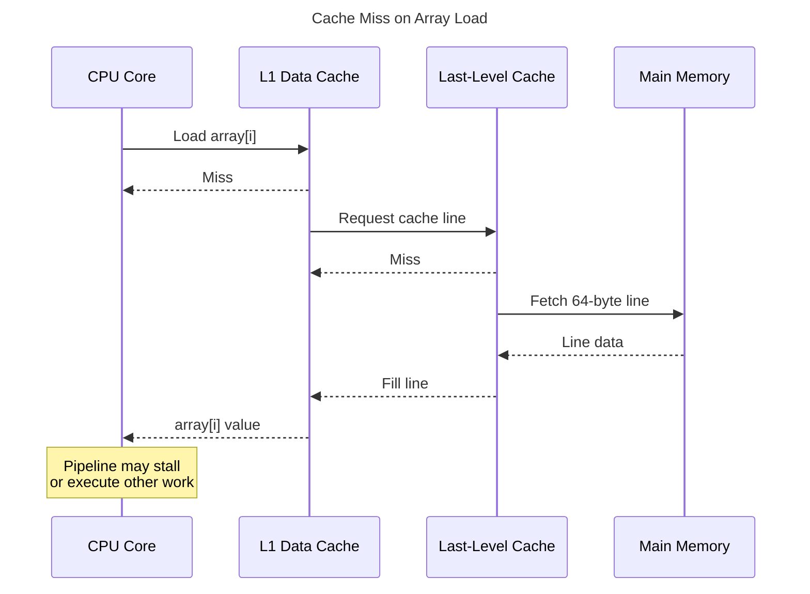

**Explanation:** A single scalar load can trigger a multi-level miss. Sequential access amortizes this cost because one miss brings an entire cache line (multiple elements). Random access defeats spatial locality and increases miss rate.

---

## 8. Invariants and Guarantees

Separate **architectural** guarantees (visible to software) from **microarchitectural** details (implementation-specific):

| Property | Guarantee | Notes |
|----------|-----------|-------|
| **ISA semantics** | Each instruction has defined behavior | Compiler and programmer rely on this |
| **Sequential consistency (single thread)** | Program order appears respected | Hardware reordering is invisible if dependencies preserved |
| **Coherence (multi-core)** | Writes eventually visible to all cores | Enforced by cache coherence protocol (see next chapter) |
| **Volatile memory persistence** | DRAM loses contents on power loss | Durability requires explicit write to persistent media |

**What hardware does not guarantee:**

- Constant-time memory access — latency varies with cache state.
- Linear speedup with core count — memory bandwidth and coherence traffic saturate.
- That "more RAM" fixes CPU-bound workloads.

**What careful software design can guarantee:**

- Predictable hot-path behavior when data structures respect cache locality.
- Bounded memory usage when allocation patterns are controlled.
- Correct cross-thread visibility when using proper synchronization (covered in [Memory Ordering and Concurrency](/docs/computer-architecture/memory-ordering-and-concurrency)).

---

## 9. Failure Scenarios

### Scenario 1: Memory Bandwidth Saturation

A analytics job spawns 64 threads, each scanning large in-memory datasets. CPU utilization appears moderate, but wall-clock time does not improve beyond a certain thread count.

**Symptoms:** High memory controller utilization; threads stall on loads; throughput plateaus.

**Mitigation:** Reduce concurrent scanners; use NUMA-aware allocation (`numactl --membind`); compress data to reduce bytes moved; partition work per socket.

**Interview signal:** Candidate distinguishes CPU-bound from memory-bound and names bandwidth as the limiter.

### Scenario 2: False Sharing at Scale

Multiple goroutines increment independent counters stored in the same cache line.

**Symptoms:** Severe scalability collapse; coherence traffic dominates; performance worse than single-threaded.

**Mitigation:** Pad structures to cache-line boundaries; use per-core accumulators with periodic merge.

**Interview signal:** Candidate connects cache line size to coherence protocol behavior (detailed in [Caches and Cache Coherence](/docs/computer-architecture/caches-and-cache-coherence)).

### Scenario 3: TLB Thrashing

A database maps a very large virtual address space with random access patterns across millions of pages.

**Symptoms:** Elevated page-fault-free latency; CPU time in kernel; poor scaling despite "fitting in RAM."

**Mitigation:** Use huge pages (2 MiB or 1 GiB on Linux x86-64); reduce mapped regions; improve access locality.

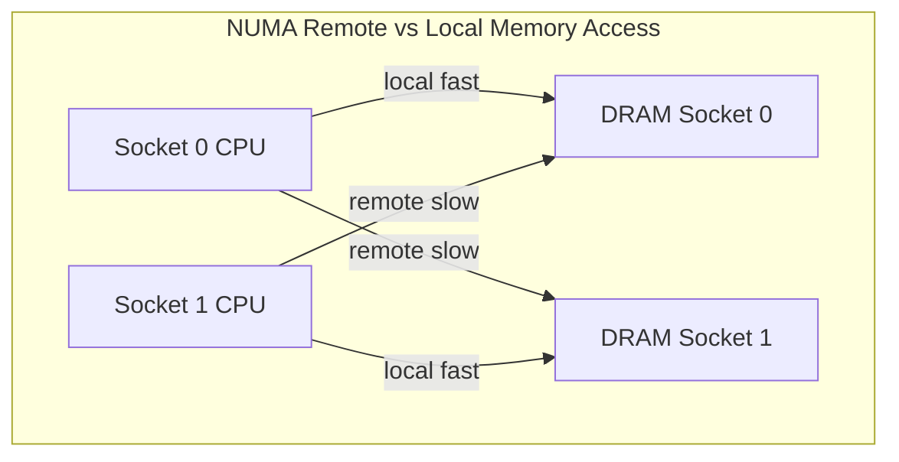

**Explanation:** Threads should allocate and run on the socket that owns their data. Remote access increases latency and interconnect traffic — common after careless container scheduling on dual-socket hosts.

---

## 10. Performance Characteristics

Performance is governed by ** locality** and **parallelism**:

- **Temporal locality:** Reuse recently accessed data (stays in cache).
- **Spatial locality:** Access nearby addresses (one miss fills neighbors).
- **Instruction locality:** Hot loops fit in instruction cache and µop cache.

**Roofline model (qualitative):** A workload is compute-bound if it performs many operations per byte loaded; memory-bound if it performs few. Architects should identify which roof limits their service before buying more CPUs.

**Amdahl's Law:** Speedup from parallelizing fraction \(P\) of a program with \(N\) processors is bounded by \(1 / ((1-P) + P/N)\). The serial fraction — including synchronization and memory contention — caps scalability.

Do not invent IPC or bandwidth numbers. Measure on representative hardware or cite vendor documentation for a named SKU when precision is required.

---

## 11. Scalability Limits

Scaling breaks when:

- **Shared memory bandwidth** is exhausted across cores on a socket.
- **Remote NUMA access** dominates when threads and data are misaligned.
- **Cache capacity** is exceeded; working set spills to DRAM.
- **Synchronization** serializes parallel work (locks, atomic contention).

| Scale signal | Limiting factor | Architectural response |
|--------------|-----------------|------------------------|
| Many threads, read-heavy | Memory bandwidth | Partition data per NUMA node; replicate read-only sets |
| Large working set | Cache/TLB capacity | Huge pages; algorithmic restructuring |
| Fine-grained sharing | Coherence traffic | Per-shard ownership; message passing over shared mutation |
| Low IPC loops | Branch mispredicts, dependencies | Data layout changes; SIMD where appropriate |

---

## 12. Operational Considerations

**Monitoring:** Hardware performance counters (Linux `perf`, Intel VTune, `pcm`) expose cache misses, IPC, branch mispredicts, and NUMA remote access ratios.

**Capacity planning:** Profile before scaling out. A service at 30% CPU may be memory-bandwidth saturated.

**Deployment:** Pin latency-sensitive databases to NUMA nodes with local memory. Kubernetes CPU limits do not express NUMA affinity — platform teams may need topology managers.

**Upgrades:** New CPU generations change cache sizes, prefetch behavior, and AVX-512 presence. Regression-test hot paths after hardware migrations.

---

## 13. Security Considerations

CPU and memory fundamentals intersect security:

- **Spectre/Meltdown class vulnerabilities:** Speculative execution leaks data across security boundaries. Mitigations (KPTI, retpolines) add overhead.
- **Rowhammer:** Repeated DRAM row access can flip adjacent rows; relevant for multi-tenant hosts.
- **Side channels:** Cache timing can leak secrets (constant-time crypto requirement).
- **Memory encryption:** AMD SEV, Intel TDX provide confidential computing; adds architectural complexity.

Architects designing multi-tenant platforms must account for hardware vulnerability mitigations in performance budgets.

---

## 14. Cost Considerations

Hardware choices have direct cost:

- **High-memory instances** cost more per vCPU; right-sizing avoids paying for unused RAM.
- **NUMA-aware placement** reduces need for over-provisioning to compensate for remote access penalties.
- **Larger caches** (certain instance families) improve latency-sensitive workloads without more cores.

**Cost-aware design:** Profile first. Doubling cores on a memory-bound workload wastes money. Caching at the application layer (see [Caching Fundamentals](/docs/caching/caching-fundamentals)) may be cheaper than larger hardware if hit rates are high.

---

## 15. Production Implementations

Patterns seen in production (implementation choices, not universal law):

| Pattern | Where it appears | Role |
|---------|------------------|------|
| **Huge pages** | PostgreSQL, JVM `-XX:+UseLargePages`, Linux `hugetlbfs` | Reduce TLB pressure |
| **NUMA binding** | `numactl`, Oracle `numa`, Kubernetes Topology Manager | Local memory access |
| **Columnar layouts** | Parquet, ClickHouse | Improve spatial locality for analytics |
| **Arena allocators** | jemalloc, protobuf arenas | Reduce allocation overhead and fragmentation |
| **SIMD** | Vectorized JSON parsing, compression codecs | Increase ops per byte loaded |

Study how your language runtime manages memory — GC pauses and allocation patterns are CPU–memory phenomena.

---

## 16. Alternatives and Tradeoffs

| Approach | Pros | Cons | When to use |
|----------|------|------|-------------|
| **Shared-memory parallelism** | Low latency between threads | Coherence cost; harder to reason about | Single-node, fine-grained sharing |
| **Message passing (per-core queues)** | Avoids false sharing | Serialization overhead | High-contention counters, pipelines |
| **Memory-mapped I/O** | Zero-copy access to files | Page fault latency; complex invalidation | Large read-mostly datasets |
| **GPU offload** | Massive parallelism for suitable workloads | PCIe bandwidth; programming model | ML inference, batch numerics |
| **Distributed memory (cluster)** | Scales beyond one machine | Network latency | Working set exceeds single node |

There is no universally fastest architecture — only one matched to access patterns and deployment constraints.

---

## 17. Common Misconceptions

1. **"More cores always means faster."** — Memory bandwidth and serial sections limit speedup.

2. **"RAM is RAM."** — NUMA topology makes access latency non-uniform.

3. **"The CPU is at 100%, so we need more CPUs."** — CPUs may stall waiting on memory; check IPC and cache miss rates.

4. **"Cache is just a software concern."** — Data structure layout determines hardware cache behavior.

5. **"64-bit means unlimited fast memory."** — Address space is large; physical memory speed and TLB still bound performance.

6. **"Compilers optimize everything."** — Aliasing, alignment, and access patterns still matter for hot paths.

7. **"Cloud abstracts hardware away."** — Instance types differ in cache, NUMA, and network; abstraction is not elimination.

---

## 18. Principal Architect Perspective

At principal level, interviewers want:

- **Quantitative reasoning without fake precision:** Qualitative latency hierarchy plus measured profiles on target hardware.
- **Cross-layer thinking:** How a protobuf field layout affects cache lines affects RPC tail latency.
- **Platform standards:** NUMA policies, huge page enablement, instance family selection guides.
- **Business alignment:** "We accept higher per-request CPU for predictable p99 by colocating hot data with compute."

Frame CPU–memory awareness as a **design constraint** that informs service boundaries, data formats, and hardware selection — not as micro-optimization trivia.

**Red flags in architecture reviews:** Unbounded in-memory joins on multi-tenant hosts; counter arrays without padding; ignoring NUMA on large DB instances; scaling replicas without profiling memory bandwidth.

---

## 19. Understanding p99 and Tail Latency

> **Diagram convention:** Steps are labeled **1, 2, 3…** below.

**p99** (99th percentile latency) is the latency threshold below which **99% of requests** complete. The slowest **1%** of requests exceed p99. In production SLOs, p99 is the standard metric for **tail latency** — the experience of unlucky requests, not the average case.

This matters on a CPU and memory fundamentals page because **hardware rarely makes every request equally fast**. Most requests hit warm caches; a few stall on LLC misses, NUMA remote DRAM, cache coherence invalidation, lock contention, or TLB walks. Those rare stalls define p99 — and users notice them.

### 19.1 What p99 means (with a concrete example)

Suppose a bidding service handles **10,000 requests** in a one-minute window. Sort all request latencies from fastest to slowest:

| Rank | Latency | Percentile |
|------|---------|------------|
| 5,000th (median) | 2 ms | **p50** |
| 9,000th | 8 ms | **p90** |
| **9,900th** | **45 ms** | **p99** |
| 9,990th | 120 ms | **p99.9** |
| 10,000th (slowest) | 800 ms | **max** |

**p99 = 45 ms** means 9,900 requests finished in ≤ 45 ms, but **100 requests** (1%) took longer. At **500K RPS**, that 1% is **5,000 slow requests every second** — not a rounding error.

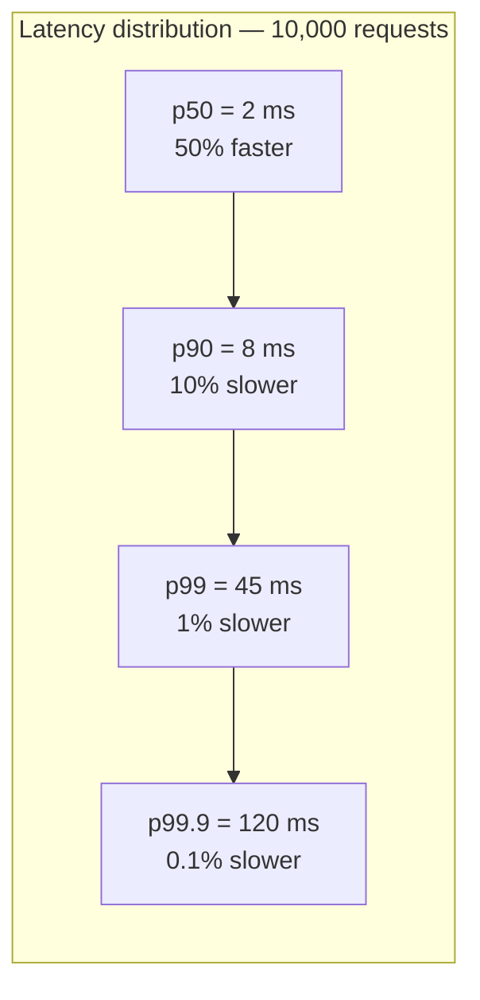

**Step-by-step flow:**

| Step | Concept | Explanation |
|------|---------|-------------|
| **1** | Sort latencies | Order all request durations in one time window |
| **2** | p50 (median) | Half of requests are faster; typical user experience |
| **3** | p90 | 10% slower — early warning of contention |
| **4** | **p99** | **1% slowest** — standard production SLO target |
| **5** | p99.9 / max | Extreme tails; often dominated by GC pauses, cold starts, or outages |

### 19.2 Why average latency misleads architects

| Metric | 500K RPS example | Problem |
|--------|------------------|---------|
| **Average** | 3 ms | Hides 100× slower tail requests |
| **p50** | 2 ms | Still ignores the slowest 50% of "bad" half |
| **p99** | 45 ms | Captures what 5,000 req/sec actually feel like |

**Interview sound bite:** "Average latency is a throughput metric disguised as a user metric. p99 tells you what happens when caches miss, locks contend, or NUMA goes remote."

### 19.3 How CPU and memory hardware create tail latency

Most requests follow the **fast path**; p99 requests hit the **slow path** through the memory hierarchy:

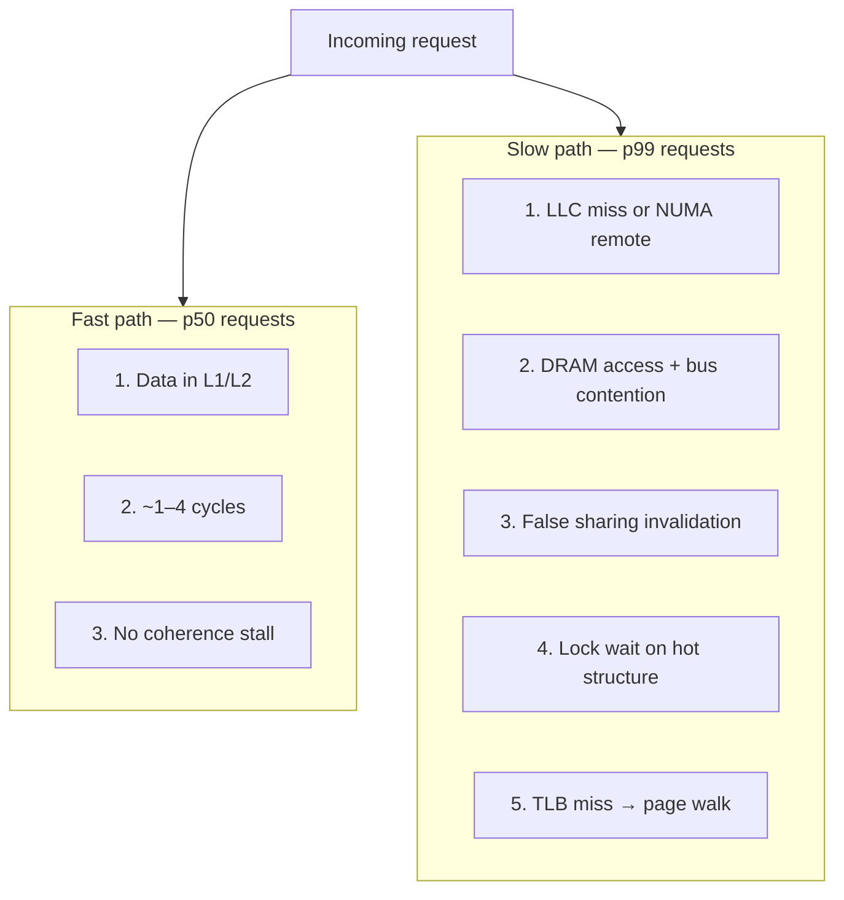

**Step-by-step flow:**

| Step | Hardware event | Effect on latency | Shows up in |
|------|----------------|-------------------|-------------|
| **1** | L1/L2 hit | Baseline fast path | p50 |
| **2** | LLC miss | Load from DRAM — orders of magnitude slower | p90–p99 |
| **3** | NUMA remote access | Cross-socket DRAM — ~1.5–2× local latency | p99 |
| **4** | Cache coherence (false sharing) | Core waits for invalidated cache line reload | p99 spikes |
| **5** | Lock / atomic contention | Threads serialize on shared metadata | p99–p99.9 |
| **6** | TLB miss | Kernel page-table walk on large working set | Steady p99 elevation |

**Key insight:** Adding cores increases the probability that **some** request hits contention or remote memory — which is why the [Architecture Review Exercise](#20-architecture-review-exercise) shows **worse p99 on 64-core vs 32-core** despite more CPU.

### 19.4 p99 vs throughput — the scalability trap

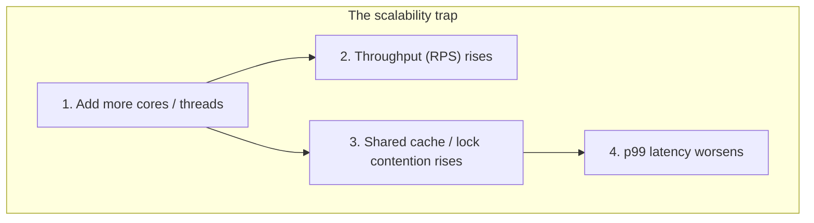

| Observation | Throughput | p99 | Interpretation |
|-------------|------------|-----|----------------|
| More cores, shared `ConcurrentHashMap` | ↑ RPS | ↑ p99 | Contention tax on tail |
| Shard cache per NUMA node | → RPS | ↓ p99 | Better locality, less coherence |
| Fewer threads, same RPS | → RPS | ↓ p99 | Less lock fighting — counterintuitive win |

**Principal framing:** Optimize **p99 and throughput together**. A change that raises RPS but doubles p99 may violate SLOs and degrade user experience.

### 19.5 Measuring p99 in production

| Layer | Tool | What to measure |
|-------|------|-----------------|
| **Application** | Prometheus histogram, Datadog, CloudWatch | `http_request_duration_seconds` p99 |
| **Service mesh** | Envoy, Istio | Per-route upstream p99 |
| **Hardware** | `perf stat`, `perf record` | LLC misses, stalls, NUMA remote refs during p99 window |
| **Correlation** | Trace ID + span timing | Which span (deserialize, DB, cache) dominates p99 |

**Histogram example (Prometheus):**

```promql
histogram_quantile(0.99,
  sum(rate(http_request_duration_seconds_bucket[5m])) by (le, service)
)
```

**Step-by-step measurement protocol:**

| Step | Action | Detail |
|------|--------|--------|
| **1** | Define window | Use ≥ 5-minute rolling windows — not single-request samples |
| **2** | Record histogram buckets | Exponential buckets (1ms, 2ms, 5ms, 10ms, 25ms, 50ms, 100ms, …) |
| **3** | Compute p99 | `histogram_quantile(0.99, …)` or equivalent |
| **4** | Segment | Break down p99 by endpoint, tenant, region, instance type |
| **5** | Correlate with hardware | During p99 spike, capture `perf stat` on same host |
| **6** | Set SLO | Example: "p99 &lt; 50 ms at 500K RPS per region" |

### 19.6 Common p99 mistakes in architecture reviews

| Mistake | Why it fails | Better approach |
|---------|--------------|-----------------|
| **Reporting average only** | Hides tail | Always pair avg with p50, p99, p99.9 |
| **Optimizing p50 alone** | Tail still hurts 1% of users | Profile p99 path separately |
| **Short measurement window** | p99 noisy on small samples | ≥ 5 min; ≥ 10K requests |
| **Confusing p99 with max** | Max is one outlier; p99 is systematic tail | Use max for incident debug only |
| **"Low CPU = healthy"** | Memory-bound stalls show low CPU, high p99 | Check IPC, LLC misses, stall cycles |
| **Scaling out without profiling tail** | More replicas ≠ better p99 if root cause is layout | Profile then shard / pad / NUMA-bind |

### 19.7 How to improve p99 (CPU/memory levers)

| Lever | Mechanism | p99 impact |
|-------|-----------|------------|
| **Cache locality** | Sequential access, struct layout, smaller working set | ↓ LLC misses |
| **Sharding** | Per-core or per-NUMA data ownership | ↓ lock + coherence traffic |
| **False-sharing padding** | 64-byte align per-core counters | ↓ coherence stalls |
| **NUMA binding** | `numactl`, K8s Topology Manager | ↓ remote DRAM |
| **Huge pages** | `-XX:+UseLargePages`, `hugetlbfs` | ↓ TLB misses |
| **Immutable read-mostly data** | Deserialize once, serve bytes | ↓ per-request CPU variance |

### 19.8 p99 cheat sheet (whiteboard)

```
Latency percentiles (sorted slowest → fastest):

  max    ████████████████████  one-off outlier (GC, cold start)
  p99.9  ████████████████      0.1% — incident territory
  p99    ████████████          1%  — standard SLO  ← target this
  p90    ██████                early warning
  p50    ███                   median — typical fast path

CPU/memory tail causes: LLC miss · NUMA remote · false sharing · lock wait · TLB miss
```

**60-second explanation:** "p99 is the latency that 1% of requests exceed. Hardware makes most requests fast via caches, but rare cache misses, NUMA remote access, and lock contention create a long tail. That's why we measure p99, not average — and why adding cores without fixing data layout can make p99 worse even as throughput rises."

---

## 20. Architecture Review Exercise

> **Prerequisite:** Read [§19 Understanding p99 and Tail Latency](#19-understanding-p99-and-tail-latency) before this exercise — p99 is the central metric throughout.

> **Diagram convention:** Steps are labeled **1, 2, 3…** in diagrams and tables below.

**Scenario:** A real-time bidding service processes 500K requests per second per region. Each request deserializes a 2 KB profile object from a shared in-memory cache backed by a concurrent hash map. p99 latency regressed after a migration from 32-core to 64-core instances.

**Your task:**

1. Hypothesize three hardware-level causes for worse p99 despite more cores.
2. Propose profiling steps using `perf` or equivalent.
3. Recommend data layout or sharding changes to improve cache locality.
4. State NUMA considerations for the new instance type.
5. Define metrics to validate improvement.

### Baseline system (before fix)

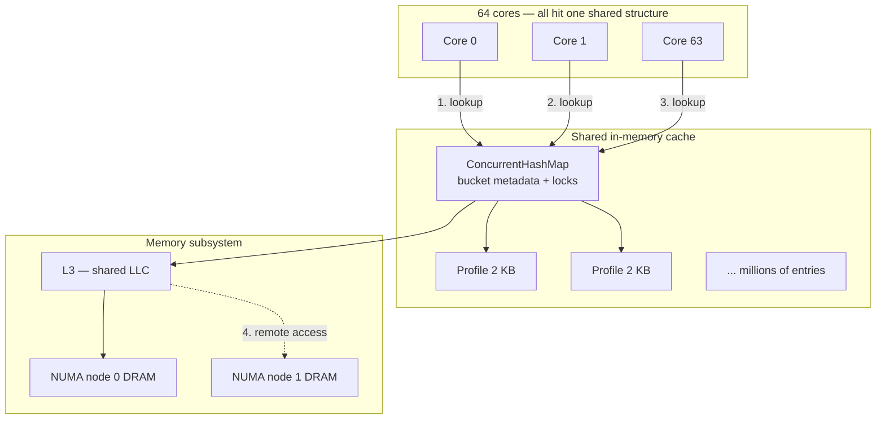

**Step-by-step flow:**

| Step | What happens | Why p99 suffers at 64 cores |
|------|----------------|----------------------------|
| **1–3** | Every core reads/writes the same `ConcurrentHashMap` | More threads ⇒ more lock/metadata contention on hot buckets |
| **4** | Cross-socket DRAM access | 64-core SKU is often **2-socket NUMA**; remote memory is slower |
| — | 2 KB profile deserialize per request | Large objects stress cache lines and TLB; random key access defeats prefetch |

---

### Step 1 — Three hardware-level hypotheses

| # | Hypothesis | Mechanism | p99 symptom |
|---|------------|-----------|-------------|
| **H1** | **False sharing + cache coherence traffic** | Adjacent bucket headers or counter fields sit on the same 64-byte cache line; one core’s write invalidates the line for all other cores | Tail spikes when many cores update/read nearby map metadata |
| **H2** | **NUMA remote memory access** | Old 32-core box may have been single-socket; new 64-core is dual-socket. Threads on socket 1 read profiles allocated on socket 0 | p99 grows with core count; `numa_miss` rises |
| **H3** | **TLB + LLC pressure from working set** | Millions of 2 KB profiles + map overhead exceed per-core L3; random lookups cause LLC misses and page walks | Steady p99 regression, not just spikes; memory-bound stalls despite low CPU % |

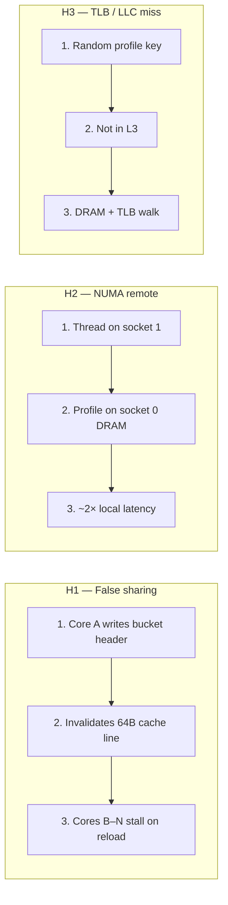

**Interview answer (60s):** “More cores made contention worse, not better. I’d bet on coherence traffic on the shared concurrent map, NUMA remote reads on a dual-socket 64-core instance, and LLC/TLB misses from a large random-access working set of 2 KB objects.”

---

### Step 2 — Profiling plan (`perf` and friends)

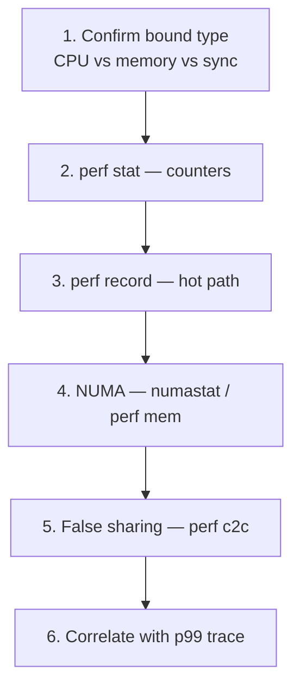

**Step-by-step flow:**

| Step | Command / tool | What to look for |
|------|----------------|------------------|
| **1** | Application traces + `top` IPC | Low IPC + moderate CPU ⇒ memory/sync bound |
| **2** | `perf stat -e cycles,instructions,cache-misses,LLC-load-misses,stall_frontend,stall_backend` | High `LLC-load-misses` / backend stalls ⇒ H3 |
| **3** | `perf record -g -p <pid> -- sleep 30` then `perf report` | Time in map lookup, deserialize, lock primitives |
| **4** | `numastat -p <pid>` or `perf stat -e node0-reads,node1-reads,node0-remote-refs` | Remote refs &gt; ~10–15% ⇒ H2 |
| **5** | `perf c2c record` / `perf c2c report` (Intel) | HITM (hit modified) on same cache line ⇒ H1 false sharing |
| **6** | Compare p99 window to counter spikes | Tie regressions to migration date and core count |

**Example `perf stat` one-liner:**

```bash
perf stat -e cycles,instructions,cache-references,cache-misses,LLC-loads,LLC-load-misses \
  -p $(pgrep -n bidding-service) -- sleep 60
```

**Strong signal checklist:**

- `LLC-load-miss rate` &gt; ~20–30% on hot path ⇒ layout / sharding needed  
- `node-remote-refs` rising with thread count ⇒ NUMA placement bug  
- `c2c` HITM on map bucket or counter structs ⇒ false sharing  

---

### Step 3 — Data layout and sharding recommendations

**Target architecture:** eliminate single hot shared map; colocate read-mostly profile bytes with the consuming cores.

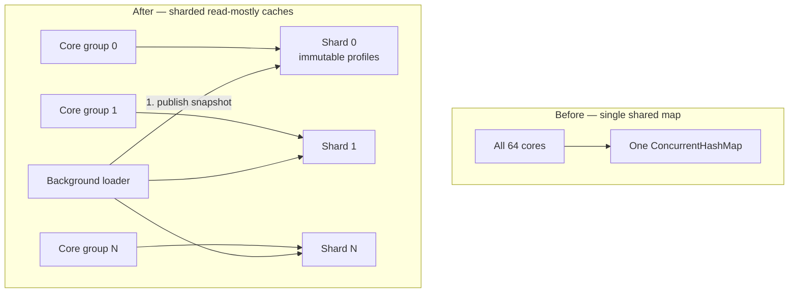

**Step-by-step flow:**

| Step | Change | Rationale |
|------|--------|-----------|
| **1** | **Shard by `hash(user_id) % N`** (N = 16–64) | Each shard owned by a thread pool; reduces single-structure coherence |
| **2** | **Immutable profile snapshot** after load | Deserialize once; serve `byte[]` or off-heap read-only buffer — no per-request parse |
| **3** | **Struct layout: hot fields first, 64B align counters** | Keep frequently read fields in one–two cache lines; pad per-shard stats to avoid false sharing |
| **4** | **Per-core or per-NUMA replica** for hottest 1% keys | Replication cheaper than cross-core sharing for RTB hot users |
| **5** | **Open-addressing or `fastutil` primitive map** for int→offset index | Smaller metadata, better cache density than boxed `ConcurrentHashMap` |
| **6** | **Huge pages for stable heap** (`-XX:+UseLargePages`) | Cuts TLB misses on large stable working set |

**False-sharing fix (whiteboard):**

```text
// BAD: counters on same cache line
long requests;   // core 0 increments
long hits;       // core 1 increments  → false sharing

// GOOD: pad to 64 bytes per core
class PaddedCounter { long value; byte pad[56]; }
PaddedCounter perCore[64];
```

---

### Step 4 — NUMA considerations (64-core instance)

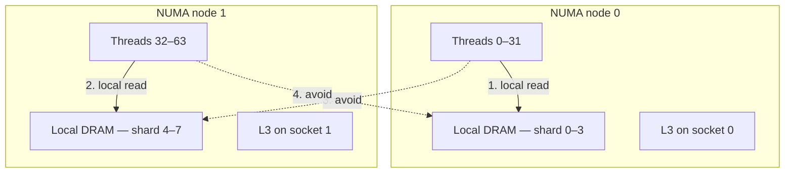

**Step-by-step flow:**

| Step | Action | Detail |
|------|--------|--------|
| **1** | **Detect topology** | `lscpu`, `numactl -H` — confirm 2 nodes × 32 cores |
| **2** | **Pin thread pools** | `numactl --cpunodebind=0 --membind=0` for pool A; node 1 for pool B |
| **3** | **Allocate shards on local node** | Shard 0–3 memory from node 0; 4–7 from node 1 |
| **4** | **Kubernetes** | Use Topology Manager `single-numa-node` for guaranteed pods (K8s 1.18+) |
| **5** | **Avoid default OS spread** | Linux first-touch helps only if threads allocate where they run — reload caches after bind |
| **6** | **Validate** | `numastat` remote hits should drop after rebind |

**Principal sound bite:** “Doubling cores without NUMA-aware placement doubled cross-socket traffic. I’d treat each socket as a cell: local shards, local threads, minimal cross-node reads.”

---

### Step 5 — Metrics to validate improvement

| Metric | Source | Baseline (bad) | Target (good) |
|--------|--------|----------------|---------------|
| **p99 request latency** | APM / histogram | Regressed post-migration | ≤ pre-migration at ≥ same RPS |
| **LLC load miss rate** | `perf` / CloudWatch agent | High, rises with cores | ↓ 30–50% after sharding |
| **NUMA remote access %** | `numastat`, `perf` | &gt; 15% | &lt; 5% |
| **CPU stalled cycles (backend)** | `perf stat` | High vs instructions | ↓ with local data |
| **Cache coherence (HITM)** | `perf c2c` | Non-zero on map lines | → 0 on hot path |
| **Deserialize time p99** | App timer | Dominates handler | Near zero with immutable cache |
| **RPS per core efficiency** | `RPS / cores` | Flat or down | Up after fix |

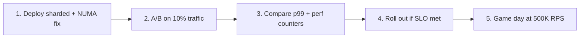

**Validation protocol:**

1. Capture **baseline** `perf stat` + p99 on old 32-core (if still available) and broken 64-core.  
2. Deploy sharded cache + NUMA binding in staging; replay production traffic shape.  
3. Gate rollout: p99 ≤ SLO **and** remote NUMA refs &lt; 5% **and** LLC miss rate improved.  
4. Document instance-family standard: “RTB bidders use single-socket or NUMA-pinned dual-socket only.”

---

### Model answer summary

| Task | Strong answer in one line |
|------|---------------------------|
| **1. Hypotheses** | False sharing on map metadata; NUMA remote DRAM; LLC/TLB misses on 2 KB random profiles |
| **2. Profiling** | `perf stat` → `perf record` → `numastat` → `perf c2c`; correlate with p99 |
| **3. Layout / sharding** | NUMA-local shards, immutable profiles, padded counters, huge pages |
| **4. NUMA** | Pin threads and memory per socket; per-node shard replicas |
| **5. Metrics** | p99, LLC miss rate, remote NUMA %, HITM, deserialize time |

**Evaluation rubric:**

| Score | Criteria |
|-------|----------|
| **Strong** | Names false sharing, coherence traffic, remote NUMA, TLB effects; proposes per-core shards or read replicas; defines cache-miss and remote-access metrics |
| **Adequate** | Mentions caching and profiling but lacks coherence or NUMA depth |
| **Weak** | "Add more instances" without root-cause analysis |

---

## 21. Whiteboard Explanation

**60-second version:**

"A CPU executes instructions from memory, but memory is slow relative to registers. So we have a hierarchy: L1, L2, L3 caches, then DRAM. Sequential access is fast because one cache miss loads a whole 64-byte line. Random access misses constantly. Multiple cores share caches and memory, so writes invalidate cache lines across cores — that's coherence traffic. On multi-socket machines, NUMA means accessing another socket's memory is slower. Software that ignores layout and placement leaves performance on the table."

**Whiteboard sketch:**

```
[Registers] → [L1] → [L2] → [L3] → [DRAM]
     ↑ fast                              ↑ slow
[Core 0] [Core 1] ... share L3 and memory bus
```

---

## 22. Interview Questions

1. Explain the Von Neumann architecture and the stored-program concept.

2. What is the difference between ISA and microarchitecture?

3. Describe the memory hierarchy and why each level exists.

4. What is spatial locality? Temporal locality? Give examples that improve each.

5. Why does sequential array traversal outperform linked-list traversal for read-heavy workloads?

6. What is a cache line, and why does its size matter for data structure design?

7. Explain pipelining and one reason a pipeline stalls.

8. What is branch prediction, and how can misprediction affect latency?

9. Define NUMA. How does it affect database or JVM deployment?

10. What is the TLB, and when does TLB pressure hurt performance?

11. Distinguish CPU-bound, memory-bound, and I/O-bound workloads. How do you identify each?

12. How does Amdahl's Law limit parallel speedup?

13. What is p99 latency, and why do architects prefer it over average latency?

14. Name three hardware-level causes of high p99 on a multi-core server.

**Expected answer signals:** Fetch-decode-execute; latency hierarchy; 64-byte lines; coherence invalidation; NUMA local vs. remote; `perf` top-down or cache-miss counters; roofline intuition; p99 = 99th percentile tail SLO; LLC miss / NUMA / false sharing inflate p99.

**Red flags:** Invented nanosecond latencies without context; "cache is only for databases"; ignoring NUMA on large servers.

---

## 23. Interview Follow-Ups

1. **After Q6 (cache line):** "How would you design a sharded counter to avoid false sharing?" — *Expect: per-core counters, padding to 64 bytes, periodic aggregation.*

2. **After Q9 (NUMA):** "How does Kubernetes expose NUMA?" — *Expect: Topology Manager, guaranteed pods, limitations of generic scheduling.*

3. **After Q10 (TLB):** "What are huge pages and what breaks them?" — *Expect: fewer translations; fragmentation; allocation failures if not reserved.*

4. **After Q11 (bound types):** "Your service is at 20% CPU but slow — what next?" — *Expect: check blocked I/O, memory stalls, lock contention, not just CPU %.*

5. **Principal-level:** "How do you set hardware standards for 50 teams?" — *Expect: approved instance families, profiling gates, platform-run huge page config, documentation.*

---

## 24. Strong Answer Example

**Question:** "Why did our multi-threaded aggregator get slower when we doubled threads?"

**Strong answer:**

"First I'd check whether we're memory-bandwidth or coherence-bound, not CPU-bound. Doubling threads increases concurrent memory traffic. If threads mutate adjacent counters, false sharing causes cache lines to bounce between cores — scalability can go negative.

I'd profile with hardware counters: L1/L3 cache misses, `mem_load_uops_retired.l3_miss`, and on NUMA systems, remote DRAM access ratio. I'd inspect data layout: are hot structures padded to cache lines? Are threads pinned to sockets with local memory via `numactl`?

Remediation depends on findings: per-shard aggregation with merge, structure padding, NUMA-aware allocation, or reducing thread count to match memory bandwidth. I'd validate with the same load test and compare p99, not just throughput."

---

## 25. Weak Answer Example

**Question:** "Why did our multi-threaded aggregator get slower when we doubled threads?"

**Weak answer:**

"Probably lock contention. Add more locks or use a bigger machine."

**Why this is weak:** Assumes locking without evidence; suggests more locks (often wrong); does not mention false sharing, bandwidth, or NUMA; no profiling plan; bigger machine may not help memory-bound workloads.

---

## 26. Hands-On Exercise

**Exercise: Locality and Cache Effects**

**Prerequisites:** Linux or macOS, C or Go compiler, `perf` (Linux) or Instruments (macOS).

**Steps:**

1. Implement two versions of array sum: sequential index iteration and random index permutation (same array, same total work).
2. Implement linked-list traversal sum with identical element count.
3. Measure wall-clock time for each; run multiple iterations to warm caches.
4. On Linux, run `perf stat -e cycles,instructions,cache-misses` on each version.
5. Repeat with an array larger than L3 cache size (document your machine's L3 size from `lscpu` or sysctl).
6. Document: Which version had highest IPC? Highest cache misses? Relate to spatial locality.

**Success criteria:** Written comparison explaining results qualitatively; no invented latency constants; one diagram of memory hierarchy with your workload's access pattern marked.

---

## 27. Knowledge Check

1. True or false: Registers are part of main memory. *(False — registers are inside the CPU.)*

2. What is the typical cache line size on x86-64? *(64 bytes — verify on target with `getconf LEVEL1_DCACHE_LINESIZE`.)*

3. Why does pipelining improve throughput? *(Overlaps stages of different instructions.)*

4. Name two types of locality. *(Temporal and spatial.)*

5. What does NUMA stand for, and what is non-uniform about it? *(Non-Uniform Memory Access; latency depends on which socket owns the memory.)*

6. What happens on a branch misprediction? *(Speculative pipeline work is discarded; fetch restarts at correct target.)*

7. Is DRAM volatile or non-volatile? *(Volatile — loses contents without power.)*

---

## 28. Flashcards

| Front | Back |
|-------|------|
| Von Neumann model | Instructions and data stored in same addressable memory |
| ISA | Software–hardware interface: opcodes, registers, semantics |
| Cache line | Smallest unit of cache transfer; typically 64 bytes |
| Spatial locality | Accessing nearby memory locations benefits from one cache fill |
| Temporal locality | Reusing recently accessed data likely hits cache |
| Pipeline stall | Delay when dependency or cache miss blocks progress |
| NUMA | Memory latency varies by which socket owns the DRAM |
| TLB | Cache for virtual-to-physical page translations |
| IPC | Instructions retired per CPU cycle |
| Amdahl's Law | Parallel speedup limited by serial fraction of work |
| Memory-bound | Performance limited by bytes moved, not arithmetic rate |
| Roofline model | Compares compute intensity to memory bandwidth ceilings |
| p99 latency | 99th percentile — 1% of requests are slower; standard tail SLO |
| Tail latency | Slow end of distribution (p99+); driven by cache misses, NUMA, contention |

---

## 29. Cheat Sheet

**Hierarchy:** Registers → L1 → L2 → L3 → DRAM → storage (each step slower, larger)

**Locality:** Sequential access good · Reuse recent data · Keep hot loops small

**Multi-core:** Shared LLC · Coherence on writes · False sharing on adjacent writes

**NUMA:** Allocate and run on same socket · `numactl` / topology manager

**Profile:** `perf stat` cache-misses · IPC · remote NUMA counters

**p99 / tail:** Measure p99 not average · 1% slow at 500K RPS = 5K bad req/s · LLC miss / NUMA / locks inflate tail

**Design:** Pad hot counters · Columnar for scans · Huge pages for large mappings

**Avoid:** Random pointer chasing · Unbounded shared mutation · Ignoring socket topology

---

## 30. Related Concepts

- [Caches and Cache Coherence](/docs/computer-architecture/caches-and-cache-coherence) — MESI, false sharing, cache hierarchy depth
- [Memory Ordering and Concurrency](/docs/computer-architecture/memory-ordering-and-concurrency) — Barriers, happens-before, atomic visibility
- [Processes, Threads, and Scheduling](/docs/operating-systems/processes-threads-and-scheduling) — How the OS maps threads to cores
- [Virtual Memory and I/O](/docs/operating-systems/virtual-memory-and-io) — Page tables, mmap, I/O paths
- [Caching Fundamentals](/docs/caching/caching-fundamentals) — Application-level caching over hardware caches
- [Storage Engine Fundamentals](/docs/storage-engines/storage-engine-fundamentals) — How databases lay out pages for I/O and memory

---

## 31. References

### Primary sources

- Hennessy, J. L., & Patterson, D. A. (2017). *Computer Architecture: A Quantitative Approach*, 6th ed. Morgan Kaufmann — Memory hierarchy, pipelining, NUMA.
- Intel Corporation. [Intel 64 and IA-32 Architectures Optimization Reference Manual](https://www.intel.com/content/www/us/en/developer/articles/technical/intel-sdm.html) — Microarchitectural behavior (implementation-specific).
- AMD. [AMD64 Architecture Programmer's Manual](https://www.amd.com/en/support/tech-docs) — x86-64 ISA and system programming.

### Books and practitioner texts

- Kleppmann, M. (2017). *Designing Data-Intensive Applications*. O'Reilly — Data locality and throughput in distributed data systems.
- Drepper, U. (2007). [What Every Programmer Should Know About Memory](https://people.freebsd.org/~lstewart/articles/cpumemory.pdf) — Classic treatment of caches, NUMA, and allocation.

### Distinguish guarantee types

| Claim type | Example in this chapter |
|------------|---------------------------|
| **Architectural** | ISA instruction semantics; single-thread program order |
| **Implementation choice** | Huge pages in PostgreSQL; `numactl` binding |
| **Operational practice** | `perf` profiling; instance family selection guides |

*TODO: Add entries to `references/books.yaml` for Hennessy & Patterson when bibliography curation phase begins.*
