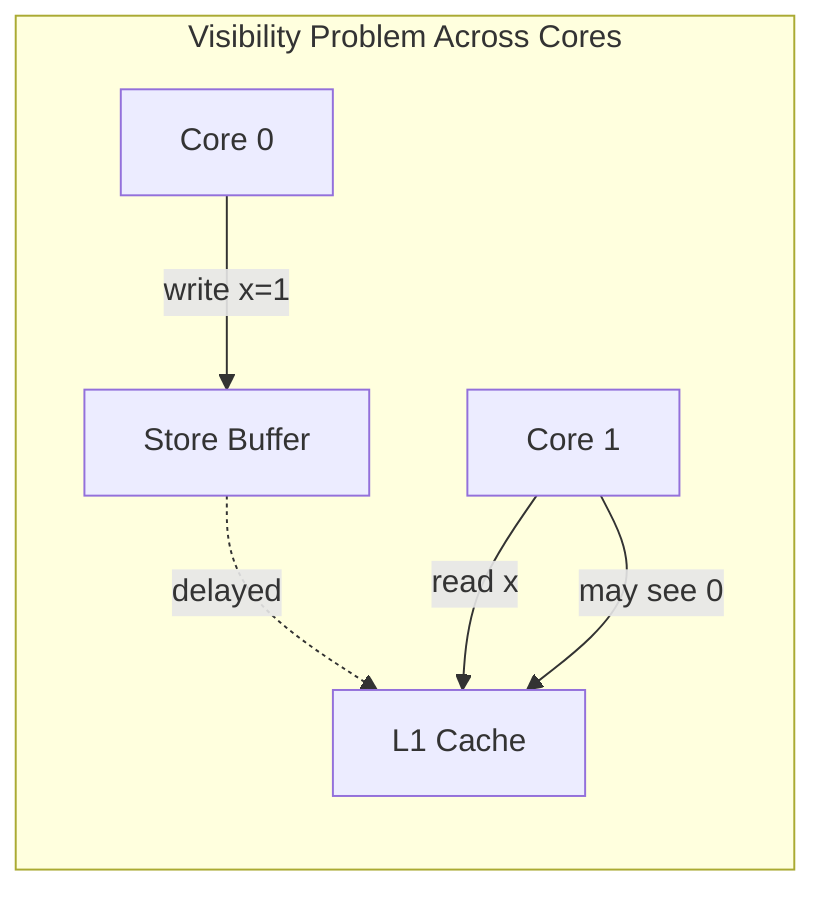
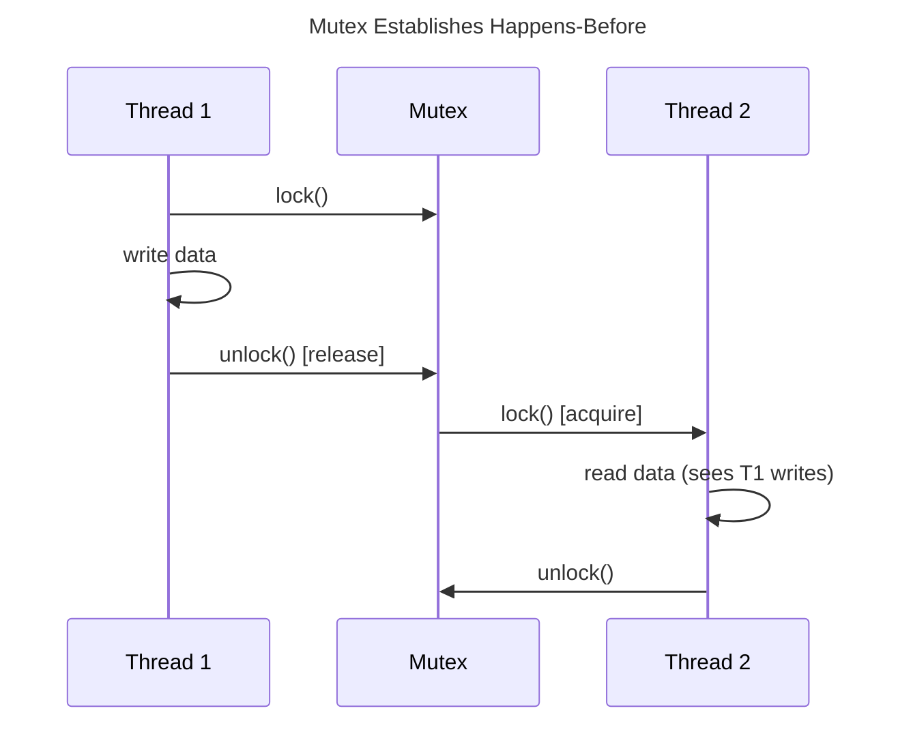
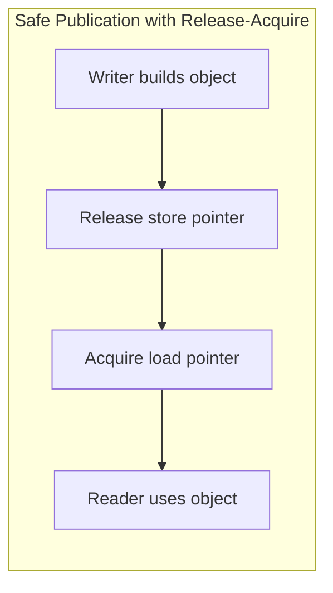

# Memory Ordering and Concurrency

## 1. Executive Summary

Modern CPUs reorder memory operations to hide latency and exploit instruction-level parallelism. Compilers add further reorderings when optimizing. In a multi-threaded program, these reorderings are invisible on a single thread but can produce surprising results across threads unless you establish ordering through synchronization primitives, atomics with explicit memory orders, or locks.

This chapter explains sequential consistency versus relaxed models, the happens-before relation, memory barriers (fences), acquire-release semantics, and how language memory models (C++, Java, Go) map to hardware behavior. You will learn why double-checked locking failed historically, why lock-free algorithms are hard, and how memory ordering choices affect both correctness and performance in production systems.

**Key takeaway:** Correct concurrent programs specify which writes must be visible to which reads and in what order — hardware does not do this automatically across cores.

---

## 2. Why This Topic Matters

Concurrency bugs are among the hardest to reproduce and most expensive to fix in production. Principal architects are asked:

- Why did our singleton initialization race?
- Is our lock-free queue actually correct?
- What memory order do we need for this atomic counter?
- How does this relate to distributed consistency?

Memory ordering is the on-machine foundation for [Linearizability](/docs/consistency/linearizability), [Session Guarantees](/docs/consistency/session-guarantees), and reasoning about what "visible" means before you even reach the network.

---

## 3. Problems Being Solved

| Problem | Description | Why it is hard |
|---------|-------------|----------------|
| **Visibility** | Core A's write not seen by Core B | Store buffers, cache delays |
| **Ordering** | Observed order differs from program order | CPU and compiler reordering |
| **Atomicity** | Read-modify-write races | Non-atomic compound operations |
| **Publication safety** | Publishing pointer before initialized fields visible | Reordering of struct writes |

Goals: define **happens-before** edges; choose minimal synchronization for required invariants; avoid over-synchronizing (performance cost).

---

## 4. Assumptions and System Model

- **Multi-core** with cache coherence (see [Caches and Cache Coherence](/docs/computer-architecture/caches-and-cache-coherence)).
- **Data-race-free programs** have well-defined behavior in languages like Java and C++11+.
- **Relaxed atomics** allow reordering unless paired with fences or stronger orders.
- We do not assume sequential consistency by default for all operations.

**State explicitly:** "We target languages with defined memory models (Java, C++11+, Go). Undefined behavior or data races invalidate reasoning."

---

## 5. Essential Terminology

| Term | Definition |
|------|------------|
| **Sequential consistency** | All threads see same total order of operations consistent with program order |
| **Happens-before** | Partial order; if A hb B, B observes A's effects |
| **Release/acquire** | Release makes prior writes visible; acquire sees those writes |
| **Memory barrier / fence** | Instruction preventing certain reorderings |
| **Store buffer** | Per-core queue of pending writes not yet globally visible |
| **LoadLoad, StoreStore, LoadStore, StoreLoad** | Barrier types by ordering edges |
| **Data race** | Concurrent access, at least one write, no synchronization |
| **Relaxed atomic** | Atomicity without ordering guarantees |
| **Seq_cst** | Sequential consistency memory order (strongest in C++) |
| **Synchronizes-with** | Release-acquire pair establishing happens-before |

---

## 6. Core Mechanism

Without synchronization, cores may observe stale values and reordered writes:

**Explanation:** Core 0 writes `x=1` into its store buffer before the value reaches cache or memory. Core 1 may read stale `x=0` from its cache. A release fence or lock unlock flushes visibility obligations.

**Happens-before with mutex:**

---

## 7. Step-by-Step Walkthrough

**Broken double-checked locking (historical pattern):**

**Step 1 — Thread A** checks `instance == null` without lock (fast path).

**Step 2 — Thread A** acquires lock, constructs object, assigns pointer.

**Step 3 — CPU/compiler** reorders: pointer published before constructor fields written.

**Step 4 — Thread B** sees non-null pointer, reads uninitialized fields.

**Fix:** Use `std::atomic` with release-acquire; or initialize under lock before publishing; or use static holder idiom.

**Explanation:** Release after initialization ensures prior writes are visible to the acquire load on the reader side — establishing happens-before for all object fields.

**Lock-free counter with `fetch_add(relaxed)`:** Atomicity guaranteed; no ordering with other variables — sufficient for independent counter, insufficient for publishing linked nodes.

---

## 8. Invariants and Guarantees

| Model | Guarantee |
|-------|-----------|
| **Sequential consistency** | Simplest mental model; often too slow for all ops |
| **Acquire-release** | Publisher-subscriber pattern for handoff |
| **Relaxed** | Atomicity only; no cross-variable order |
| **Data-race-free (C++/Java)** | If no races, defined behavior |

**Safety vs. performance:** Stronger orders cost more fences; use weakest order that preserves invariants.

---

## 9. Failure Scenarios

### Scenario 1: Lazy Singleton Race

**Symptoms:** Rare crashes in production; unreproducible in dev.

**Mitigation:** Initialize eagerly, use `enum` singleton, or proper volatile/atomic publication.

### Scenario 2: Lock-Free Queue ABA

**Symptoms:** Corrupted queue; lost elements.

**Mitigation:** Tagged pointers, hazard pointers, epoch-based reclamation — not just memory order.

### Scenario 3: Metrics Counter with Relaxed Atomics

**Symptoms:** Counter correct but associated timestamp never updated coherently.

**Mitigation:** Pair counter increment (relaxed) with release on batch publish event.

### Extended Deep Dive: Memory Ordering and Lock-Free Queue Correctness

The Michael-Scott lock-free queue requires **CAS on head and tail** with careful helping of stalled operations. Memory orders on CAS typically use `acquire` on success for the pointer being loaded and `release` when publishing new nodes. A common student bug uses `relaxed` on link publication — another thread may observe the new node in the list before its payload fields are visible.

**ABA problem:** Thread A reads head pointer H, stalls. Thread B pops H, frees H, pushes new node that reuses same address H. Thread A's CAS succeeds on "same" pointer but structure changed. **Tagged pointers** (version counter in unused address bits) or **hazard pointers** / **epoch reclamation** prevent premature reuse.

**Principal interview bar:** Candidate names ABA, reclamation strategy, and memory orders on publication — not just "lock-free is faster."

### Extended Deep Dive: x86 TSO vs ARM Weak Ordering

x86 provides **Total Store Order** — a strong model where stores are not reordered with each other (simplified; still uses store buffer). Loads may be reordered with stores to different addresses in subtle ways; `lock`ed instructions provide full fence. ARM and RISC-V are weaker — require explicit barriers for publication patterns that "accidentally work" on x86. **Portability rule:** never rely on x86 behavior in cross-platform code; use language atomics. This explains intermittent ARM production bugs after x86-only testing.

---

## 10. Performance Characteristics

Memory fences stall the pipeline and prevent reordering optimizations. `seq_cst` atomics on hot paths can degrade throughput versus `relaxed` when order is unnecessary.

**Rule:** Synchronize at domain boundaries — per request handoff, queue publish — not around every field access.

Profile with and without stronger orders; do not assume fences are free.

---

## 11. Scalability Limits

- **Contended locks** serialize threads; coherence traffic on lock word.
- **Seq_cst on hot counters** adds global ordering cost.
- **False sharing on lock metadata** — see cache chapter.

Lock-free structures scale until CAS retry storms dominate.

---

## 12. Operational Considerations

Concurrency bugs need stress tests, thread sanitizers (`TSAN`), and formal litmus tests for lock-free code.

Document memory order choices in code review checklists for platform teams.

---

## 13. Security Considerations

Speculative execution and memory ordering interact in subtle vulnerability classes; use platform guidance for crypto code.

Data races in security checks (TOCTOU) are correctness and security failures.

---

## 14. Cost Considerations

Over-synchronization wastes CPU; under-synchronization costs incidents. Principal tradeoff: engineering time for formal lock-free vs. simple locks with proven throughput.

---

## 15. Production Implementations

| System | Pattern |
|--------|---------|
| **Linux kernel** | `smp_mb()`, RCU, seqlocks |
| **Java `java.util.concurrent`** | `volatile`, `AtomicReference`, JMM |
| **C++ folly** | Futex, relaxed atomics where safe |
| **Go** | Channel happens-before; `sync/atomic` |
| **Disruptor** | Memory barriers between ring buffer stages |

### Extended: Synchronization Primitive Comparison

| Primitive | Typical cost | Ordering provided |
|-----------|--------------|-------------------|
| Mutex | syscall on contention | Full critical section HB |
| RWLock | writer exclusion | Reader-writer HB edges |
| spinlock | busy-wait | HB when lock API used correctly |
| atomic CAS | variable; retries under contention | Per memory order selected |
| futex | fast path user, slow path kernel | Mutex implementation detail |

**Priority inversion** occurs when high-priority thread waits on lock held by low-priority thread — mitigated by priority inheritance mutexes in RT contexts. User-space spinlocks inappropriate when critical section may block on I/O — wastes CPU.

### Extended: Sequential Consistency for Cost

`memory_order_seq_cst` provides global total order on all seq_cst operations — simplest mental model, highest fence cost. Use for default in prototypes; downgrade to acquire-release after profiling and correctness review. **Release sequences** in C++ chain RMW operations for lock-free algorithms — advanced pattern for principal-level lock-free discussions.

### Extended: Happens-Before in Distributed Systems Analogy

Local release-acquire mirrors **writing to a quorum then updating a version pointer** — readers acquire version and see prior writes. Without version or fence, readers may observe **stale composite state** — analogous to reading partially updated struct in shared memory. This analogy helps teams reason about [Session Guarantees](/docs/consistency/session-guarantees) without treating distributed systems as magic.

---

## 16. Alternatives and Tradeoffs

| Approach | Pros | Cons |
|----------|------|------|
| **Mutex** | Simple correctness | Contention |
| **RWLock** | Parallel readers | Writer starvation risk |
| **Lock-free** | Low latency potential | Hard to verify |
| **Actor/message** | No shared memory | Serialization |
| **Seq_cst everywhere** | Easy reasoning | Performance |

---

## 17. Common Misconceptions

1. **"Coherence = sequential consistency."** — Coherence is per-address; ordering across addresses needs sync.

2. **"Volatile in C = Java volatile."** — C `volatile` is not a threading primitive in C++.

3. **"Atomics always faster than locks."** — Contended CAS can be worse.

4. **"If it works on x86, it's portable."** — x86 gives strong TSO; ARM is weaker.

5. **"Happens-before is wall-clock time."** — It's logical ordering, not physical time.

---

## 18. Principal Architect Perspective

Connect on-chip ordering to distributed visibility: a release-acquire pair is a local linearizable handoff. Scaling out does not remove ordering requirements — they move to the protocol layer ([Replication](/docs/replication/overview), [Consensus](/docs/consensus/overview)).

Platform standards: approved concurrency primitives, ban raw double-checked locking, require TSAN in CI for new lock-free code.

### Extended: Store Buffering and the Dekker Example

Consider two threads each writing a flag then reading the other's flag. Without synchronization, both can observe the other flag as false simultaneously — violating sequential consistency. Store buffers allow each core to see its own writes before they become globally visible. This is not a "compiler bug" — it is permitted behavior on weakly ordered architectures unless fences or atomics establish ordering. The Dekker idiom requires explicit synchronization; on x86, locks provide sufficient ordering, but incorrect lock-free publication remains broken on ARM without release-acquire pairs.

### Extended: Mapping to Distributed Visibility

Release-acquire on a flag mirrors **committing a write to a quorum** before marking a record visible — readers acquire the version marker and see prior field updates. Relaxed atomics resemble **eventual visibility without ordering guarantees** across fields. Principal architects who understand local memory models reason better about **session guarantees** and **read-your-writes** in geo-distributed databases: both require explicit happens-before edges, locally via atomics and globally via replication protocols.

### Extended: Litmus Tests and Tooling

Hardware and compiler memory model researchers use **litmus tests** — small concurrent programs with allowed/forbidden outcome sets. Tools like herd7 and CDSChecker explore outcomes. For production teams, Thread Sanitizer (TSAN) catches many races but not all lock-free bugs. Property-based stress tests and formal methods (TLA+) apply at principal level for critical paths like payment ledger append. The investment is justified when the cost of a rare reordering bug exceeds modeling cost.

### Extended: Java volatile vs C++ atomic

Java `volatile` establishes happens-before between volatile reads/writes — sufficient for single-reference publication in many patterns. C++ requires `std::atomic` with explicit memory orders; plain `volatile` does not provide threading semantics. Go channels and `sync/atomic` document happens-before rules in the language spec. Cross-language microservices must not assume identical mappings — only API contracts and serialization boundaries define correctness at the network edge.

---

## 19. Architecture Review Exercise

Review a lock-free MPMC queue used between ingestion and processing threads. List three ordering bugs that TSAN might miss. Propose test strategy including litmus tests and long-run stress.

---

## 20. Whiteboard Explanation

"CPUs and compilers reorder memory ops for speed. Cache coherence makes writes eventually visible per address, but doesn't order different variables. Mutex unlock-release paired with lock-acquire creates happens-before: everything before unlock is visible after acquire. Atomics let you pick strength: relaxed for counters, release-acquire for publishing objects. Sequential consistency is the easiest model and the most expensive."

---

## Extended Walkthrough: Publishing a Configuration Snapshot

A service reloads configuration from disk and swaps a global pointer read by thousands of request threads.

**Unsafe pattern:** Allocate new config struct; assign pointer without synchronization. Reader may see new pointer but stale field values due to store reordering.

**Safe pattern (C++):** Build config off-thread; `std::atomic<Config*> store` with `memory_order_release`. Readers use `load(memory_order_acquire)` before dereferencing fields.

**Safe pattern (Java):** Hold volatile reference to immutable config object — fields final, object constructed completely before publish; volatile write establishes happens-before for readers.

**Safe pattern (Go):** `atomic.Value` stores complete config struct; Load returns typed config.

**RCU variant (advanced):** Readers proceed lock-free with old pointer; writers publish new tree; grace period before freeing old — used in Linux kernel and some C++ frameworks. Tradeoff: deferred reclamation complexity vs. reader performance.

**Distributed parallel:** Blue/green config deploy publishes new version atomically at load balancer; in-flight requests complete on old version — same publication safety problem at cluster scope with versioned routing.

---

## Extended Failure Scenario: Lost Wake-Up vs Spurious Wake-Up

Condition variables require waiting in a loop rechecking predicate while holding mutex coordination — `while (!predicate) wait()`. Without loop, **lost wakeup** if notify occurs between check and wait. **Spurious wakeup** is permitted — loop handles both. Memory ordering still matters for predicate fields updated outside lock — they must be published under same mutex or with atomics.

---

## 21. Interview Questions

1. What is the difference between cache coherence and memory consistency?

2. Define happens-before.

3. Explain why double-checked locking was broken and how to fix it.

4. Compare `relaxed`, `acquire`, `release`, and `seq_cst` memory orders.

5. What is a StoreLoad barrier and when is it needed?

6. How does Java's `volatile` relate to happens-before?

7. What is TSO (Total Store Order) on x86?

8. Why are lock-free algorithms difficult to get right?

9. What is a data race in C++11?

10. How does a Go channel establish happens-before?

11. Relate memory ordering to linearizability in distributed systems.

12. When is a mutex preferable to lock-free code?

---

## 22. Interview Follow-Ups

1. **After Q4:** "Can you use relaxed for a lock-free stack's CAS?" — *Usually need acq_rel on success for pointer publication.*

2. **After Q7:** "Does TSO mean x86 needs no fences?" — *Still need for compiler; ARM ports need explicit atomics.*

3. **Principal:** "Team proposes lock-free everything — your response?" — *Cost/benefit, verification burden, default to locks until profiling proves need.*

---

## 23. Strong Answer Example

**Question:** "Explain happens-before and give an example."

**Strong answer:**

"Happens-before is a partial order defining when one operation's effects are guaranteed visible to another. If A happens-before B, B cannot observe state prior to A.

Example: Thread 1 writes to a buffer, then unlocks a mutex (release). Thread 2 locks the same mutex (acquire), then reads the buffer. The unlock-acquire pair synchronizes-with, establishing happens-before from Thread 1's writes to Thread 2's reads.

Without this, reordering in CPU or compiler could let Thread 2 see a published flag before buffer contents. For a counter-only statistic, relaxed atomics suffice because no other variable's visibility is coupled. Choosing memory order is matching synchronization strength to invariants — weaker when possible, stronger when publishing composite state."

---

## 24. Weak Answer Example

**Weak answer:** "Use `volatile` for all shared variables and it will work."

**Why weak:** Volatile semantics vary by language; insufficient for compound invariants; no happens-before for arbitrary field groups in Java without proper publication idiom.

---

## 25. Hands-On Exercise

Run the classic Peterson litmus test or use [herd7](https://memmodel.inria.fr/) models. Implement buggy vs. fixed publisher-subscriber with and without release-acquire. Run under Thread Sanitizer.

---

## 26. Knowledge Check

1. Coherence ensures? *(All cores agree on value of each address eventually.)*
2. Data race in C++? *(Concurrent unprotected access, one write — UB.)*
3. Release semantics? *(Prior writes visible to acquire side.)*
4. seq_cst cost? *(Strongest ordering; most fences.)*
5. Double-checked locking fix? *(Proper publication: holder idiom, volatile/atomic release.)*

---

## 27. Flashcards

| Front | Back |
|-------|------|
| Happens-before | Partial order defining visibility between operations |
| Sequential consistency | All threads see one global order matching program order |
| Release | Makes preceding writes visible to acquire |
| Acquire | Subsequent reads see prior release writes |
| Relaxed atomic | Atomicity without ordering other memory |
| Data race | Unsynchronized concurrent access with write |
| Store buffer | Per-core pending writes not yet globally visible |
| Memory fence | Prevents hardware/compiler reorderings |
| TSO | x86 model: stores not reordered with each other (simplified) |
| Synchronizes-with | Release-acquire pair linking threads |
| seq_cst | Sequentially consistent memory order |
| Litmus test | Small concurrent program probing allowed outcomes |

---

## 28. Cheat Sheet

**Coherence ≠ ordering** · Per-address vs. cross-variable

**Publish object:** release after init · acquire before read

**Counters only:** `relaxed` often enough

**Default:** mutex · prove need for lock-free

**Test:** TSAN · stress · litmus · formal for lock-free

**Portable:** use language atomics, not raw assumptions from x86

## Supplementary Principal Content: Ordering Decision Framework

When reviewing concurrent code or distributed handoff protocols, use this decision framework:

**Step 1 — Identify shared mutable state.** List variables read/written by more than one thread without holding a lock.

**Step 2 — Classify access pattern.** Single-writer/multiple-reader? Multiple writers to disjoint fields? Counter only?

**Step 3 — Choose synchronization minimum.** Mutex for complex invariants; release-acquire for pointer publication; relaxed for independent counters with no coupled reads.

**Step 4 — Verify on weak memory test hardware or use TSAN + ARM CI.** x86-only CI misses ordering bugs.

**Step 5 — Document invariant.** "Readers always see fully initialized Config" is testable; "fast path" is not sufficient spec.

**Distributed analog:** Step 3 becomes quorum write + version publish; Step 4 becomes chaos/partition tests; Step 5 becomes consistency model documentation ([Causal Consistency](/docs/consistency/causal-consistency), etc.).

### Additional Interview Scenarios

**Scenario A:** Double-checked locking for singleton in C++. **Signal:** broken without atomic/volatile in C++; holder idiom preferred.

**Scenario B:** `atomic<bool> ready` with non-atomic data array. **Signal:** ready needs release, reader needs acquire before reading array.

**Scenario C:** Seqlock for read-mostly config. **Signal:** readers retry if sequence odd; writer increments sequence twice around write.

---

## 29. Related Concepts

- [Caches and Cache Coherence](/docs/computer-architecture/caches-and-cache-coherence)
- [Processes, Threads, and Scheduling](/docs/operating-systems/processes-threads-and-scheduling)
- [Linearizability](/docs/consistency/linearizability)
- [CRDTs](/docs/replication/crdts)
- [Ordering of Events](/docs/time-ordering-and-coordination/ordering-of-events)

---

### Final expansion: Scoring Rubric for Interview Answers on Memory Models

| Score | Criteria |
|-------|----------|
| **Strong** | Separates coherence vs consistency; names happens-before; chooses memory order with justification; mentions ARM vs x86 portability |
| **Adequate** | Uses mutex correctly; vague on reordering |
| **Weak** | "volatile fixes it"; confuses atomicity with ordering |

## Architecture Integration Notes

Memory ordering discipline belongs in **platform concurrency guidelines**: approved primitives, banned patterns (raw double-checked locking), TSAN in CI for C++ services, stress tests for lock-free structures, and code review checklist for any new shared mutable state. Principal architects align local happens-before reasoning with distributed consistency documentation — a release-acquire pair is the on-machine analog of publish-after-quorum-commit.

Teams shipping on ARM (Apple Silicon dev laptops, Graviton in AWS) must not rely on x86-only CI. Ordering bugs manifest as "works on my Mac Intel" historically; today "works on x86 server" fails on ARM production. Mandate ARM runners or cross-compile test farms for critical services.

When interviewing senior candidates, score on whether they **choose minimal synchronization** — relaxed atomics for independent counters, acquire-release for publication, mutex for complex invariants — rather than defaulting to `seq_cst` everywhere or mutex everywhere.

## 30. References

- Lamport, L. (1979). [How to Make a Multiprocessor Computer That Correctly Executes Multiprocess Programs](https://lamport.azurewebsites.net/pubs/multi.pdf).
- Boehm, H. J., & Adve, S. V. (2008). Foundations of the C++ Concurrency Memory Model.
- Manson, J., et al. (2005). Java Memory Model specification.
- Sorin, D. J., Hill, M. D., & Wood, D. A. (2011). *A Primer on Memory Consistency and Cache Coherence*.
- LLVM Memory Order documentation — Implementation mapping for atomics.
