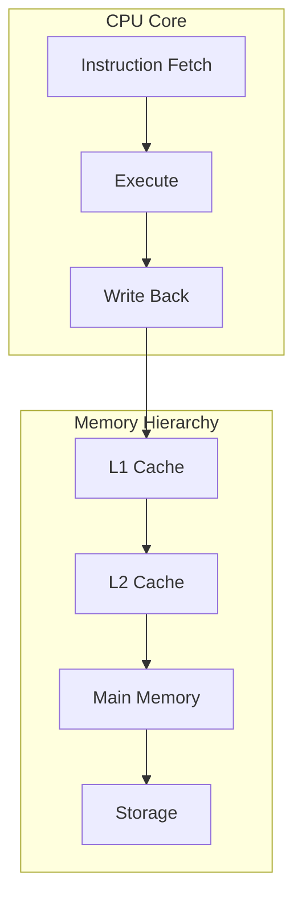

# Computer Architecture

CPU pipelines, caches, memory hierarchy, NUMA, and hardware fundamentals.

*Figure: Memory hierarchy and CPU pipeline — foundation for latency reasoning.*

## Chapters

| Chapter | Focus |
|---------|-------|
| CPU and Memory Fundamentals | [CPU and Memory Fundamentals](/docs/computer-architecture/cpu-and-memory-fundamentals) |
| Caches and Cache Coherence | [Caches and Cache Coherence](/docs/computer-architecture/caches-and-cache-coherence) |
| Memory Ordering and Concurrency | [Memory Ordering and Concurrency](/docs/computer-architecture/memory-ordering-and-concurrency) |

## Learning Path

1. Start with **CPU and Memory Fundamentals** for pipelines, caches, and the memory hierarchy.
2. Study **Caches and Cache Coherence** for MESI, false sharing, and NUMA effects on distributed systems.
3. Finish with **Memory Ordering and Concurrency** for acquire/release semantics and lock-free reasoning.

## Related Domains

- [Operating Systems](/docs/operating-systems/overview)
- [Distributed Systems Foundations](/docs/distributed-systems-foundations/overview)

Return to the [Curriculum Overview](/docs/start-here/curriculum-overview) to see how this domain fits the learning path.
