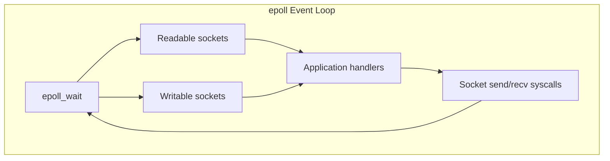
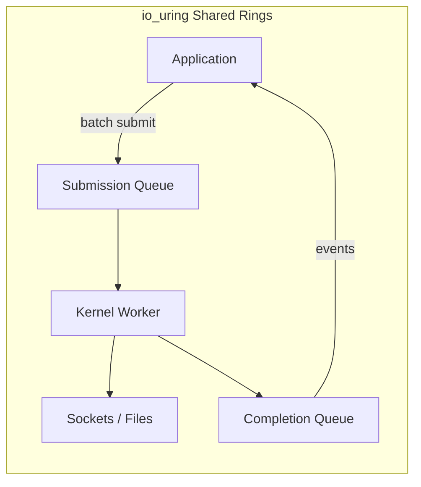
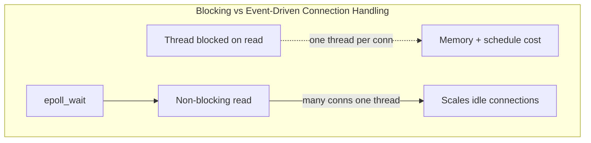

# Kernel Networking and io_uring

## 1. Executive Summary

Application networking on Linux traditionally flows through BSD sockets, kernel TCP/IP stack, and readiness notification mechanisms (`select`, `poll`, `epoll`). Each syscall and buffer copy adds overhead at high connection counts and throughput. **io_uring** (Linux 5.1+) provides a shared submission/completion queue interface reducing syscall overhead and enabling linked, batched, and registered-buffer I/O.

This chapter covers socket fundamentals, the epoll event loop model, zero-copy techniques (`sendfile`, `splice`), io_uring architecture, and when kernel bypass (DPDK, AF_XDP) is justified. You will learn how reverse proxies achieve millions of concurrent connections and why "we need more pods" sometimes masks inefficient I/O patterns.

**Key takeaway:** High-performance networking is a collaboration between application event models, kernel stack behavior, and hardware — not raw bandwidth alone.

---

## 2. Why This Topic Matters

Principal architects evaluate:

- Why does our gateway CPU spike at moderate QPS?
- epoll vs. io_uring for our proxy?
- When is kernel bypass worth the operational cost?
- How do connection counts affect memory?

Connects [TCP/IP Fundamentals](/docs/networking/tcp-ip-fundamentals) to [HTTP, TLS, and QUIC](/docs/networking/http-tls-and-quic) and production edge architecture.

---

## 3. Problems Being Solved

| Problem | Description |
|---------|-------------|
| **C10K/C10M** | Many concurrent connections |
| **Syscall overhead** | Per-operation kernel transitions |
| **Buffer copying** | User/kernel space copies |
| **Blocking I/O** | Threads waiting on network |
| **Latency variance** | Interrupt coalescing, scheduling |

---

## 4. Assumptions and System Model

- **Linux kernel** TCP/IP stack unless noted.
- **Non-blocking sockets** + event loop as default high-concurrency pattern.
- **io_uring** availability on modern kernels (5.1+; features added over versions).
- Kernel bypass is specialized — not default for general microservices.

---

## 5. Essential Terminology

| Term | Definition |
|------|------------|
| **Socket** | Endpoint for network communication (fd) |
| **Non-blocking I/O** | Returns immediately if operation would block |
| **epoll** | Linux scalable readiness notification |
| **Edge-triggered vs level-triggered** | epoll notification semantics |
| **io_uring** | Shared ring buffers for async I/O submission/completion |
| **SQ / CQ** | Submission queue / completion queue |
| **sendfile** | Kernel transfers data fd-to-socket without user buffer |
| **SO_REUSEPORT** | Multiple sockets bind same port; kernel load spreads |
| **Backlog** | Queue of incomplete connections (`listen`) |
| **Kernel bypass** | User-space driver (DPDK) skipping full stack |

---

## 6. Core Mechanism

**Classic epoll event loop:**

**io_uring model:**

**Explanation:** epoll tells you when I/O is possible; you still issue `read`/`write` syscalls. io_uring batches operations into rings — often fewer syscalls per thousand operations. Registered buffers can reduce copies for supported operations.

---

## 7. Step-by-Step Walkthrough

**High-concurrency HTTP server accepting connections:**

**Step 1 — socket/bind/listen** with non-blocking listening fd.

**Step 2 — epoll_ctl** add listen fd for read events.

**Step 3 — epoll_wait** returns when connections ready.

**Step 4 — accept** in loop until EAGAIN; register new client fds.

**Step 5 — read** request; if partial, wait for next epoll event (edge-triggered must drain).

**Step 6 — write** response; if socket buffer full, wait for writable event.

**io_uring variant:** Submit `accept`, `recv`, `send` ops to SQ; process CQ completions without per-op syscall (with `IORING_SETUP_SQPOLL` optional kernel thread).

---

## 8. Invariants and Guarantees

| Property | Guarantee |
|----------|-----------|
| **TCP byte stream** | Ordered, reliable delivery (end-to-end, modulo errors) |
| **Socket fd semantics** | Standard read/write/poll interface |
| **Completion ordering** | io_uring completion order depends on op type and flags |

**Not guaranteed:** Constant syscall-free latency; kernel bypass compatibility on all cloud instances.

---

## 9. Failure Scenarios

### Scenario 1: epoll Thundering Herd

Many threads blocked on same listen socket wake together.

**Mitigation:** `SO_REUSEPORT` with multiple accept sockets; single acceptor pattern.

### Scenario 2: Receive Buffer Exhaustion

Slow consumers; TCP window shrinks; backpressure propagates.

**Mitigation:** Read pacing, flow control at application layer, tune `net.core.rmem_max`.

### Scenario 3: io_uring CVE / feature mismatch

Kernel version differences across fleet.

**Mitigation:** Pin kernel versions; feature detect; fallback to epoll.

**Explanation:** Blocking threads wait in kernel until data arrives — simple but costly at high connection counts. Event loops multiplex many connections on few threads.

### Extended Deep Dive: Socket Option Catalog for Architects

| Option | Purpose |
|--------|---------|
| `TCP_NODELAY` | Disable Nagle for low-latency RPC |
| `SO_KEEPALIVE` | Detect dead peers on idle connections |
| `SO_REUSEADDR` | Bind during TIME_WAIT for restarts |
| `SO_REUSEPORT` | Load-balance accepts across processes |
| `TCP_FASTOPEN` | Reduce handshake latency (deployment caveats) |
| `IP_TOS` / DSCP | QoS marking (if network honors) |

Misaligned client/LB idle timeouts cause **ghost connections** — LB thinks open, server closed — RST on next request.

### Extended Deep Dive: io_uring vs libaio

**libaio** Linux AIO had limited support (historically no socket AIO). **io_uring** generalizes async I/O for files and sockets with unified completion model. Migration evaluation: measure `strace` syscall count before/after on representative workload; verify seccomp compatibility in containers; plan kernel minimum version for fleet.

---

## 10. Performance Characteristics

Syscall batching reduces user/kernel transitions — benefit grows with ops/sec.

`sendfile` avoids user-space copies for static file serving.

Interrupt coalescing reduces CPU at cost of latency — tunable on NICs.

Do not invent throughput numbers; measure with `wrk`, `iperf`, or production traces.

---

## 11. Scalability Limits

- **File descriptor limits** (`ulimit -n`).
- **Per-connection memory** (socket buffers).
- **CPU for TLS** (see [HTTP, TLS, and QUIC](/docs/networking/http-tls-and-quic)).
- **Single-listen-socket accept bottleneck** at extreme scale.

---

## 12. Operational Considerations

Tune: `somaxconn`, `tcp_tw_reuse` (understand implications), `netdev_max_backlog`, IRQ affinity.

Monitor: SYN backlog drops, retransmits, softnet drops, syscall rate (`perf`).

Document kernel version requirements for io_uring features in platform standards.

---

## 13. Security Considerations

`io_uring` has been restricted in some container policies due to attack surface — verify seccomp profiles.

`SO_REUSEPORT` can affect connection hijacking mitigations — understand load spread semantics.

Kernel bypass reduces some kernel protections — dedicated use cases only.

---

## 14. Cost Considerations

Kernel bypass needs dedicated cores and NICs — justified at packet-processing scale, rarely for CRUD APIs.

Efficient epoll/io_uring reduces CPU per request — fewer instances needed.

---

## 15. Production Implementations

| System | I/O model |
|--------|-----------|
| **Nginx** | epoll/kqueue event loop |
| **Node.js** | libuv over epoll |
| **C10k papers →** | Modern proxies (Envoy, HAProxy) |
| **io_uring** | Some databases, high-speed proxies (adoption growing) |
| **DPDK** | Telco, firewalls, custom packet pipelines |

### Extended: Zero-Copy Path Details

**sendfile** moves data socket-bound from file without user buffer — kernel pages mapped to socket. **splice** pipes data between fds via kernel pipe buffer. **MSG_ZEROCOPY** (Linux) completes copy asynchronously with completion notifications — complexity for marginal gain unless high throughput proven. TLS encryption generally requires user-space plaintext — zero-copy limited for HTTPS terminate points.

### Extended: Connection Accept Scaling

Single-threaded `accept` loop bottlenecks at extreme connection rates. **SO_REUSEPORT** with multiple bind sockets distributes accepts via kernel hash. **reuseport BPF** programs customize selection. Load balancers in front absorb connection establishment — backends see fewer SYNs directly. SYN cookies under flood allow completing handshake without storing full state until ACK.

### Extended: Observability for Network Stack

Metrics: `TcpExtListenOverflows`, `TcpExtTCPTimeouts`, `SoftnetDropped`, `sockstat TCP alloc`. `ss -tin` shows retransmits per socket. `bpftrace` and `tcpdump` for deep dives. Correlate application timeout with kernel retrans timer — app timeout should account for TCP RTO behavior on lossy paths.

---

## 16. Alternatives and Tradeoffs

| Model | Pros | Cons |
|-------|------|------|
| **Thread per connection** | Simple | Poor at high fan-in |
| **epoll loop** | Mature ecosystem | Syscall per I/O |
| **io_uring** | Batching, less syscall | Kernel version, complexity |
| **Kernel bypass** | Max packet rate | Ops burden, no full TCP in DPDK alone |

---

## 17. Common Misconceptions

1. **"io_uring replaces epoll entirely."** — Often complements; migration is incremental.

2. **"Non-blocking means no waiting."** — Application still waits via event loop.

3. **"More connections always need more threads."** — Event-driven contradicts this.

4. **"Kernel bypass is faster for HTTPS APIs."** — TLS and HTTP logic usually dominate.

5. **"epoll scales infinitely."** — Accept and TLS costs still matter.

---

## 18. Principal Architect Perspective

Choose I/O model based on measured bottleneck: syscall rate, copy cost, TLS CPU, not hype.

Platform teams provide approved runtime versions and kernel baselines; app teams justify bypass proposals with TCO analysis.

### Extended: epoll ET vs LT Semantics

**Level-triggered (LT):** `epoll_wait` returns while fd remains readable — safe for partial reads; may wake repeatedly until buffer drained. **Edge-triggered (ET):** notification on state transition only — must drain fd completely on each wake or miss events. ET reduces syscall wakeups but demands careful non-blocking read loops. Production servers (nginx, libuv) encapsulate these semantics — application developers rarely touch epoll directly but inherit timeout and backlog behavior from frameworks.

### Extended: io_uring Operation Families

io_uring supports read, write, accept, connect, splice, and registered buffer/file descriptor optimizations. **Linked SQEs** chain dependent operations (e.g., read header then read body) reducing submission overhead. **IORING_OP_POLL_ADD** integrates polling for fds. Kernel version gates features — fleet heterogeneity requires runtime capability detection. Some container policies restrict `io_uring` via seccomp; verify before mandating fleet-wide.

### Extended: TCP Socket Buffer Tuning

`SO_RCVBUF` and `SO_SNDBUF` influence kernel buffer sizes (actual values may be doubled internally). Undersized buffers limit throughput on high-BDP links; oversized buffers exacerbate bufferbloat latency. Auto-tuning (`tcp_moderate_rcvbuf`) adapts within bounds. Architects should align application read pacing with socket buffers — slow consumers propagate TCP window shrink to senders (backpressure).

### Extended: When Kernel Bypass Is Justified

DPDK and AF_XDP target **packet-per-second** bound workloads: firewalls, load balancers, telco UPF. Full TCP in userspace (e.g., some proprietary stacks) trades kernel maturity for control. For HTTPS APIs, TLS session handling and HTTP parsing dominate — kernel TCP with epoll remains appropriate until profiling proves syscall or copy overhead is the bottleneck. Operational cost of kernel bypass (dedicated cores, NIC drivers, no standard tooling) is substantial.

---

## 19. Architecture Review Exercise

Edge proxy at 200K RPS shows high `sys` CPU, moderate `user`. Evaluate epoll tuning vs. io_uring migration vs. horizontal scale. List metrics and experiments.

---

## 20. Whiteboard Explanation

"Sockets are the OS API for TCP. For many connections, blocking threads don't scale — use non-blocking sockets plus epoll to wait for readiness, then read/write. Each operation may syscall. io_uring batches I/O through shared rings, cutting syscall overhead. sendfile avoids copying file data through user space. Kernel bypass like DPDK skips the stack for specialized packet processing — overkill for typical REST."

---

## Extended Walkthrough: epoll HTTP Server Mental Model

**Listen socket** non-blocking. **epoll instance** registers listen fd for EPOLLIN. Main loop: `epoll_wait` → accept until EAGAIN; read client until EAGAIN or complete request; register EPOLLOUT if write blocked.

**Edge-triggered caveat:** Must drain input fully; partial HTTP parser state per connection — memory cost at 100K connections.

**Thread pool variant:** epoll thread accepts and pushes complete requests to workers — bounds CPU parallelism; watch queue depth for backpressure.

**io_uring migration:** Batch read/write via submission queue; measure syscall reduction with profiling tools.

---

## Extended Failure Scenario: Ephemeral Port Exhaustion

Load test client opens new TCP connection per request. Client ephemeral ports exhaust; `Cannot assign requested address`. **Fix:** HTTP keep-alive, widen `ip_local_port_range`, multiple source IPs, distributed generators. Symmetric issue on NAT gateways in production.

---

## 21. Interview Questions

1. How does epoll differ from poll?

2. Edge-triggered vs level-triggered epoll?

3. What is io_uring and what problem does it solve?

4. Explain sendfile zero-copy.

5. Why use non-blocking sockets with event loops?

6. What is SO_REUSEPORT?

7. How does TCP backpressure manifest to applications?

8. When would you choose kernel bypass?

9. What limits concurrent connections on a host?

10. How do syscalls affect high-QPS servers?

11. Relationship between listen backlog and SYN floods?

12. Compare blocking thread pool vs epoll for 50K idle connections.

---

## 22. Interview Follow-Ups

1. **After Q3:** "IORING_SETUP_SQPOLL tradeoffs?" — *Kernel thread polling; CPU use vs latency.*

2. **After Q8:** "DPDK for API gateway?" — *Usually no — ops cost, TLS, HTTP parsing still needed.*

3. **Principal:** "Standardize io_uring fleet-wide?" — *Kernel homogeneity, seccomp, fallback, phased rollout.*

---

## 23. Strong Answer Example

**Question:** "Our API server uses a thread per connection and struggles at 5K concurrent users. What do you recommend?"

**Strong answer:**

"5K idle connections shouldn't need 5K threads — each thread costs stack memory and scheduler overhead. Move to an event-driven model: non-blocking sockets, epoll (or io_uring on supported kernels), and a small worker pool for CPU-bound work only.

I'd profile whether we're syscall-bound, TLS-bound, or application-bound. If serving static assets, sendfile helps. Tune `ulimit` fds and socket buffer sizes. If after refactor we're still CPU-limited on TLS, consider session tickets, hardware acceleration, or terminating TLS at the edge. Kernel bypass is unlikely for a typical API — epoll/nginx-class patterns suffice until proven otherwise by measurement."

---

## 24. Weak Answer Example

**Weak answer:** "Switch to UDP and add more threads."

**Why weak:** UDP doesn't replace TCP semantics for APIs; more threads worsen problem.

---

## 25. Hands-On Exercise

Build minimal epoll echo server. Measure connections with `ab` or `wrk`. Compare thread-per-connection prototype. Optional: same with liburing if kernel supports.

---

## 26. Knowledge Check

1. epoll advantage? *(O(1) readiness notification for many fds.)*
2. io_uring SQ purpose? *(Submit I/O operations to kernel.)*
3. Non-blocking EAGAIN means? *(Operation would block; retry later.)*
4. sendfile avoids? *(User-space buffer copy for file-to-socket.)*
5. SO_REUSEPORT effect? *(Multiple bind sockets share load.)*

---

## 27. Flashcards

| Front | Back |
|-------|------|
| epoll | Scalable Linux fd readiness notification |
| io_uring | Ring-based async I/O interface in Linux |
| Non-blocking socket | Returns EAGAIN instead of blocking thread |
| Edge-triggered | Notify once on state transition |
| sendfile | Kernel file-to-socket transfer |
| SQ / CQ | io_uring submission and completion queues |
| SO_REUSEPORT | Kernel load balances accepts across sockets |
| listen backlog | Queue for incomplete TCP handshakes |
| Kernel bypass | User-space networking skipping full stack |
| C10K problem | Scaling many concurrent connections |
| softnet drops | Kernel network processing drops under load |
| SQPOLL | Optional io_uring kernel submission thread |

---

## 28. Cheat Sheet

**Many connections:** non-blocking + epoll/io_uring · not thread-per-conn

**Reduce copies:** sendfile · registered buffers (io_uring)

**Tune:** fd limits · socket buffers · backlog · IRQ affinity

**Measure:** sys CPU · syscall rate · retransmits · p99 connect

**Bypass:** only when kernel stack proven bottleneck + ops capacity

## Supplementary Principal Content: Event-Driven Service Checklist

- Non-blocking sockets throughout?
- Backpressure when write buffer full (pause reads)?
- Connection limits enforced (max fds)?
- Timeouts on every phase: connect, read, write, idle?
- Graceful shutdown: stop accept, drain connections, then exit?
- Metrics: active connections, accept queue, syscall rate, softnet drops?

**Framework selection:** Node, Netty, Tokio, Go net/http — all event-driven under the hood. Performance differences often from buffer sizes, allocator, TLS library, and copy count — not raw epoll vs kqueue naming.

**Sidecar overhead:** Service mesh adds extra TCP hop (app → sidecar → remote sidecar → app). Latency budget must include mTLS and serialization at both hops. Sometimes **ambient mesh** or **eBPF dataplane** reduces copies — evaluate with measured p99, not architecture diagrams alone.

### Comparing Blocking and Async Teams

Organizations split between thread-pool servlet style and async reactive style. Principal role: define **when each is acceptable** — CRUD with JDBC often stays thread pool with right-sized pool; high fan-out gateway may need async. Avoid mandating one religion; mandate profiling and timeout discipline.

---

## 29. Related Concepts

- [TCP/IP Fundamentals](/docs/networking/tcp-ip-fundamentals)
- [HTTP, TLS, and QUIC](/docs/networking/http-tls-and-quic)
- [Routing, Load Balancing, and Congestion](/docs/networking/routing-load-balancing-and-congestion)
- [Processes, Threads, and Scheduling](/docs/operating-systems/processes-threads-and-scheduling)
- [Caching Fundamentals](/docs/caching/caching-fundamentals)

---

### Final expansion: Network Namespace in Containers

Each container network namespace has own routing table, interfaces, iptables. **veth pair** connects container to bridge/CNI plugin. **SNAT** on egress masquerades pod IP to node IP — affects connection logging and IP-based ACLs. **Host network** mode shares namespace — performance vs isolation tradeoff.

**Listen backlog tuning:** `somaxconn` kernel global; application `listen(backlog)`; LB may have separate queue. Bottleneck is minimum of all three — tune coherently.

### Final expansion: Bandwidth-Delay Product

BDP = bandwidth × RTT = data in flight needed to saturate link. TCP window must be ≥ BDP for high throughput on long fat networks. Cross-region replication over high BDP links needs sufficient congestion window growth — application-level pacing if parallel TCP flows compete.

## Architecture Integration Notes

Principal architects integrate kernel networking and I/O models into platform standards rather than leaving each team to rediscover epoll tuning. A practical **platform networking baseline** includes: documented kernel minimum version; default `somaxconn` and file descriptor ulimits on node images; approved ingress controller (Envoy, NGINX, or cloud LB) with connection drain configuration; mandatory connect/read/write/idle timeouts in HTTP client libraries; and dashboards for `TcpExtListenOverflows`, softnet drops, and SYN retransmits.

When evaluating **io_uring adoption**, run a phased proof: microbenchmark syscall rate; representative service canary with kernel feature flags; seccomp policy update in container runtime; fallback code path tested in CI. io_uring shines when syscall overhead is measurable fraction of CPU — not when TLS or JSON parsing dominates. The decision mirrors hardware cache optimization: profile first, optimize the actual bottleneck.

**East-west vs north-south traffic** shapes tuning differently. North-south (client to edge) benefits from TLS session resumption, CDN caching, and connection reuse from browsers. East-west (service to service) multiplies connection counts inside the mesh — each hop adds latency budget and file descriptors. Architects reduce hops via monolith extraction discipline, batch APIs, and colocation of chatty services in same availability zone.

**Backpressure end-to-end** requires cooperation: TCP window shrink signals slow consumer; application must stop reading when downstream queue full; message brokers use consumer prefetch limits; HTTP servers return 503 with `Retry-After` when overloaded. Kernel buffers alone cannot prevent memory exhaustion if application reads unconditionally — the event loop must pause interest on readable fds when write side backs up (write-ready registration pattern).

For **incident response**, capture at failure time: `ss -tin` snapshot for retrans counts; `nstat` TCP counters delta; application active connection gauge; LB healthy host count; recent deploy correlating with SYN spike. Layered evidence prevents blaming "the network" without distinguishing DNS, SYN, TLS, or application stall.

Interviewers at principal level ask you to **size connection infrastructure**: given peak RPS and keep-alive duration, estimate concurrent connections (Little's Law). Given connection memory per socket (kernel buffers configurable), estimate RAM on LB tier. Given accept rate, verify listen backlog and SYN proxy capacity. Refuse to invent constants — state assumptions and measurement plan.

### Production Readiness Checklist for High-Connection Services

Before declaring a service ready for 10K+ concurrent connections, verify: file descriptor ulimit exceeds peak connections plus margin; `net.ipv4.ip_local_port_range` adequate for outbound fan-out; TCP `tcp_fin_timeout` and LB idle timeout aligned; application stops accepting on SIGTERM before kill; memory per connection modeled (socket buffers default often tens of KB each direction); and load test includes connection churn not only steady state. Document results in service catalog entry for platform SRE review.

Epoll-based services should expose metrics: `epoll_wait` loop duration histogram, active connections gauge, accept queue depth if available, and bytes read/written per second. Sudden loop duration increase may indicate thundering herd on wake or expensive per-event handler work — not necessarily kernel regression.

Kernel networking expertise also informs **security architecture**: syscall filtering (seccomp) may block `io_uring_setup`; unprivileged user namespaces enable container escapes in historical CVEs — follow distro hardening guides. Architects approving host-network pods document threat model acceptance. DDoS absorption at SYN layer (SYN cookies, SYN proxy on LB) protects backend accept queues — application never sees malicious SYN flood volume if edge configured correctly.

### Closing Principal Synthesis

Foundation chapters in computer architecture, operating systems, and networking form a **single reasoning chain** for production systems. A slow API is rarely one layer's fault: DNS TTL stale after failover (networking); SYN retransmit on lossy path (TCP); TLS handshake without session resumption (HTTP/TLS); epoll thread blocked on synchronous JDBC (kernel I/O + scheduling); page fault on cold JVM heap (virtual memory); false sharing on metrics counter (cache coherence); or ambiguous timeout after partial gateway success (distributed partial failure — next domain in curriculum).

Interview answers that traverse this chain — naming the layer, the mechanism, the measurement, and the tradeoff — signal principal-level systems thinking. Answers that jump to "scale horizontally" without layer discrimination signal staff-level gaps.

Hands-on reinforcement: pick one production incident from your career (or a public postmortem) and rewrite the root cause analysis tagging each contributing factor with the chapter that explains it. Link remediation to mechanism: if coherence traffic, pad or shard; if throttling, fix cgroup quota; if DNS, fix TTL; if bufferbloat, pace bulk traffic.

This synthesis intentionally avoids invented benchmark numbers. Your fleet's constants come from profiling on your hardware, your network path, and your workload shape — the curriculum teaches **which counter to read**, not which magic millisecond threshold to memorize.

## 30. References

- Kerrisk, M. (2010). *The Linux Programming Interface* — Sockets, epoll.
- Axboe, J. io_uring design notes — Linux kernel documentation.
- Welch, B. (2003). [The C10K problem](http://www.kegel.com/c10k.html) — Historical scaling context.
- Nginx documentation — Event model and tuning.
- Linux `man 7 epoll`, `man 2 io_uring_setup`.
