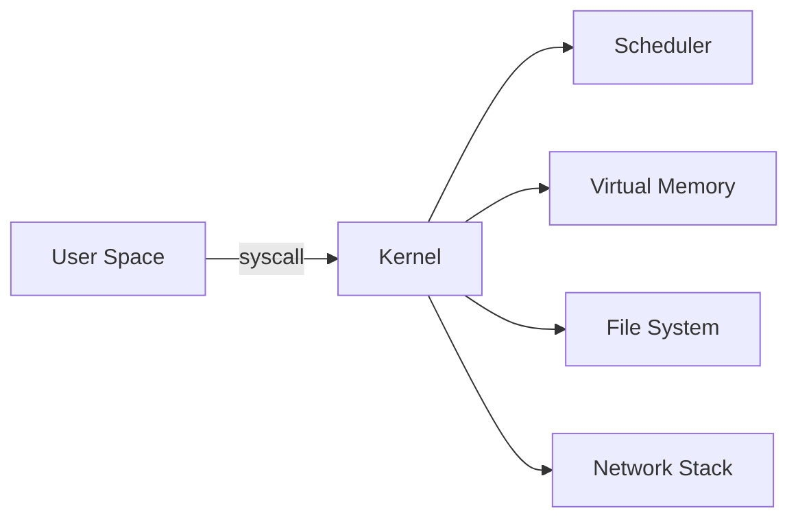

# Operating Systems

Processes, threads, virtual memory, file systems, synchronization, and kernel networking.

*Figure: OS kernel responsibilities — scheduling, memory, I/O, and networking.*

## Chapters

| Chapter | Focus |
|---------|-------|
| Processes, Threads, and Scheduling | [Processes, Threads, and Scheduling](/docs/operating-systems/processes-threads-and-scheduling) |
| Virtual Memory and I/O | [Virtual Memory and I/O](/docs/operating-systems/virtual-memory-and-io) |
| Kernel Networking and io_uring | [Kernel Networking and io_uring](/docs/operating-systems/kernel-networking-and-io-uring) |

## Learning Path

1. Begin with **Processes, Threads, and Scheduling** for concurrency primitives and scheduler behavior.
2. Cover **Virtual Memory and I/O** for paging, mmap, and storage I/O paths.
3. Finish with **Kernel Networking and io_uring** for syscall overhead and modern async I/O.

## Related Domains

- [Computer Architecture](/docs/computer-architecture/overview)
- [Networking](/docs/networking/overview)

Return to the [Curriculum Overview](/docs/start-here/curriculum-overview) to see how this domain fits the learning path.
