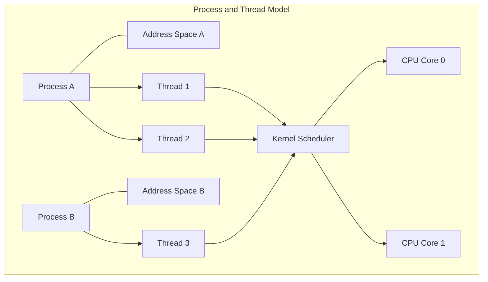
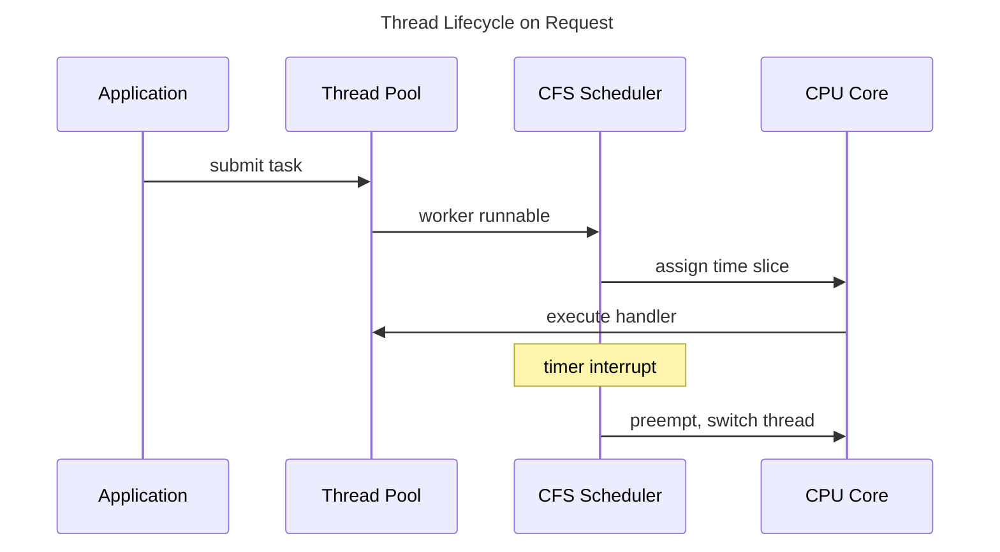
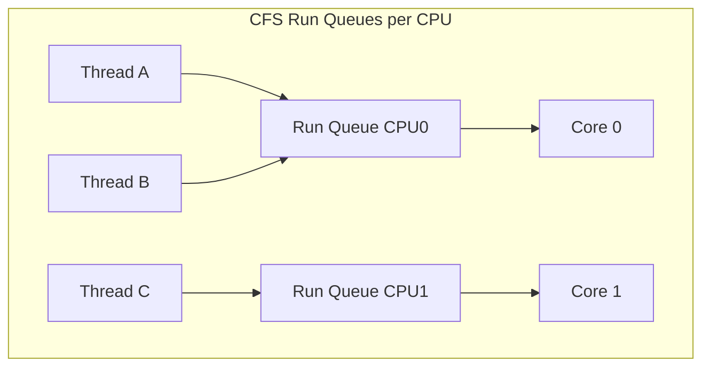

# Processes, Threads, and Scheduling

## 1. Executive Summary

An operating system multiplexes hardware among many programs by abstracting **processes** (isolated address spaces with resources) and **threads** (units of execution within a process). The **scheduler** decides which runnable thread runs on which CPU core and for how long — balancing throughput, latency, and fairness.

This chapter covers process lifecycle, thread models, context switching cost, preemptive scheduling, Linux CFS (Completely Fair Scheduler), real-time classes, and how containers and cgroups relate to these abstractions. You will learn why "we'll just add threads" is not a free scalability knob and how scheduler behavior shows up in production tail latency.

**Key takeaway:** Threads are how work meets cores; the scheduler is the hidden queue in every latency investigation.

---

## 2. Why This Topic Matters

Principal architects explain production phenomena grounded in OS mechanics:

- Why did p99 spike when we deployed more pods on the same node?
- Process vs. thread — when does isolation matter?
- How do Kubernetes CPU limits cause throttling?
- What is cgroup-induced latency?

These questions bridge [CPU and Memory Fundamentals](/docs/computer-architecture/cpu-and-memory-fundamentals) to [Virtual Memory and I/O](/docs/operating-systems/virtual-memory-and-io) and container platforms.

---

## 3. Problems Being Solved

| Problem | Description | Why it is hard |
|---------|-------------|----------------|
| **Multiplexing** | Few cores, many threads | Must share CPU time |
| **Isolation** | Fault/contain one program | Processes need separate address spaces |
| **Responsiveness** | Interactive vs. batch tradeoff | Scheduler policy choices |
| **Utilization** | Keep CPUs busy without starvation | Fairness vs. throughput |
| **Accounting** | Bill and limit resource use | cgroups, quotas |

---

## 4. Assumptions and System Model

- **Preemptive multitasking:** Kernel can interrupt running threads.
- **Linux focus** for examples (CFS, `clone`, cgroups v2) — concepts transfer to other Unix kernels.
- **Multi-core** with per-CPU run queues and load balancing.
- **Containers** are processes with constrained namespaces and cgroups, not a separate kernel (in standard deployments).

---

## 5. Essential Terminology

| Term | Definition |
|------|------------|
| **Process** | Address space + resources (file descriptors, credentials) |
| **Thread** | Schedulable execution context within a process |
| **Context switch** | Save/restore CPU state when changing runnable entity |
| **PID / TID** | Process ID; Thread ID |
| **Fork / exec** | Create process; load new program image |
| **Run queue** | Threads ready to execute |
| **Time slice / quantum** | Scheduled interval before preemption |
| **CFS** | Linux default fair scheduler using virtual runtime |
| **Nice / priority** | User-visible priority bias |
| **cgroup** | Resource limit and accounting group |
| **NUMA affinity** | Scheduler and allocator aware of socket topology |

---

## 6. Core Mechanism

**Explanation:** Process A shares one address space between two threads; Process B is isolated. The scheduler picks runnable threads from run queues and assigns them to cores. A context switch saves registers, stack pointer, program counter, and updates memory management state if switching processes.

---

## 7. Step-by-Step Walkthrough

**HTTP request handled by a thread pool:**

**Step 1 — Accept.** Listener thread receives connection (may block in epoll — see [Kernel Networking and io_uring](/docs/operating-systems/kernel-networking-and-io-uring)).

**Step 2 — Dispatch.** Task queued to worker thread pool.

**Step 3 — Schedule.** CFS selects worker with lowest virtual runtime among runnable threads on that CPU.

**Step 4 — Preemption.** If a higher-priority thread or timer interrupt occurs, kernel preempts; context switch saves state.

**Step 5 — cgroup check.** If process exceeded CPU quota, thread throttled — added latency invisible in application logs.

---

## 8. Invariants and Guarantees

| Property | Guarantee |
|----------|-----------|
| **Process isolation** | Virtual memory separates address spaces (barring shared mappings) |
| **Thread preemption** | Runnable higher-priority or fair share eventually runs (liveness, modulo starvation bugs) |
| **PID uniqueness** | Unique process identifiers per namespace |

**Not guaranteed:** Fixed latency per thread; CPU affinity without explicit pinning; that thread count equals parallelism.

---

## 9. Failure Scenarios

### Scenario 1: Thread Pool Exhaustion

All workers blocked on slow DB; accept queue grows; timeouts cascade.

**Mitigation:** Bounded queues, backpressure, separate pools for I/O vs. CPU work, async I/O.

**Explanation:** Each logical CPU has a run queue. CFS picks the runnable thread with lowest vruntime on that CPU; load balancing migrates threads when queues skew — migration costs cache warmth.

### Scenario 2: cgroup CPU Throttling

Kubernetes `limits.cpu` causes CFS bandwidth throttling; latency spikes while `kubectl top` shows low usage.

**Mitigation:** Set requests/limits based on latency testing; use `cpu.cfs_burst`; consider dedicated nodes for latency-sensitive workloads.

### Scenario 3: Scheduler Runaway on Many Runnable Threads

Thousands of runnable threads increase context switch overhead.

**Mitigation:** Right-size pools; use event-driven model; `M:N` runtimes (Go scheduler) multiplex goroutines.

### Extended Deep Dive: Wait Queues and Blocked Thread States

Threads in **D state** (uninterruptible sleep) await I/O completion — counted in load average but not runnable. High D-state load indicates storage or NFS hang — scaling CPU does not help. **Zombie** threads completed but not reaped. **Runnable** threads compete for CPU; **blocked** on mutex or condition variable are not runnable until wakeup.

**Scheduler latency** = time from becoming runnable to actually running. Measured with `schedstat` or `perf sched latency`. Latency-sensitive services monitor p99 scheduler latency on dedicated nodes — noisy neighbors increase wait time even with CPU headroom.

### Extended Deep Dive: Worker Pool Sizing Heuristic

For **CPU-bound** work, threads ≈ cores (or cores - 1 for system overhead). For **I/O-bound**, threads can exceed cores — each blocks awaiting I/O. Little's Law: required threads = throughput × blocking time. If average request blocks 50ms on DB and target 1000 RPS, need ~50 concurrent requests in flight — thread pool sized accordingly, not "200 because why not." Combine with async I/O to reduce thread count.

---

## 10. Performance Characteristics

Context switch cost includes register save/restore, TLB/cache effects, and scheduler data structure updates. Order of magnitude: microseconds — not free compared to nanosecond function calls.

**Little's Law** (L = λW): Concurrency = throughput × latency. More threads increase concurrency but do not increase throughput if CPUs saturated.

Measure context switches with `vmstat`, `pidstat -w`, `perf sched`.

---

## 11. Scalability Limits

- **CPU cores** cap parallel compute.
- **Lock contention** serializes threads.
- **O(n) scheduler work** in pathological cases with extreme thread counts.
- **Cross-NUMA migration** hurts cache warmth.

---

## 12. Operational Considerations

Monitor: run queue length (`load average`), context switch rate, cgroup throttling metrics (`container_cpu_cfs_throttled_seconds_total`).

Tune: `taskset` CPU pinning for databases; `nice` for batch jobs; isolate systemd slices.

Kubernetes: understand requests vs. limits; use Guaranteed QoS for critical pods when warranted.

---

## 13. Security Considerations

Processes provide isolation boundaries; threads share address space — a thread compromise exposes whole process.

Namespaces and seccomp reduce container syscall surface. Principal architects define when multi-tenant workloads require process-level isolation vs. thread pools.

---

## 14. Cost Considerations

Over-provisioned thread pools waste memory (per-thread stacks, often megabytes each). Under-provisioned pools cause queueing delay.

Right-sizing pod CPU avoids paying for throttled cores that deliver poor latency.

---

## 15. Production Implementations

| System | Model |
|--------|-------|
| **Nginx** | Few worker processes, event-driven within each |
| **Java JVM** | OS threads + GC threads; virtual threads (Project Loom) change tradeoff |
| **Go** | Goroutines multiplexed on `GOMAXPROCS` OS threads |
| **Tokio (Rust)** | Work-stealing thread pool + async tasks |
| **PostgreSQL** | Process per connection (traditionally) vs. poolers |

### Extended: Context Switch Cost Components

Context switch saves **general-purpose registers**, **program counter**, **stack pointer**, and may switch **page tables** (process switch) flushing TLB entries — expensive compared to thread switch within same process. **TLB shootdown** on multiprocessor systems broadcasts when page tables change. This explains why process-per-connection models (historical Apache) lost to thread and event models — switch frequency matters.

### Extended: Load Average Interpretation

Unix load average counts **runnable + uninterruptible** tasks (traditionally including D-state I/O wait). Load of 4 on 4 CPUs suggests saturation; load of 4 on 16 CPUs suggests headroom. **Load average is smoothed** — slow to reflect spikes. Combine with `run queue latency`, scheduler metrics, and utilization for capacity decisions — not load alone.

### Extended: Interrupts and Softirq

Network packets arrive via **hardware interrupts**; kernel processes in softirq context. Excessive interrupt rate on single CPU causes **softnet backlog** drops — packets discarded before socket buffer. **RPS/RFS** (Receive Packet Steering) distribute processing across cores. Architects seeing receive drops at high PPS should investigate IRQ affinity and kernel tuning before scaling application replicas.

---

## 16. Alternatives and Tradeoffs

| Model | Pros | Cons |
|-------|------|------|
| **Thread per request** | Simple | Memory, context switches |
| **Event-driven async** | High concurrency | Callback/async complexity |
| **Process pool** | Isolation | IPC overhead |
| **Serverless** | No thread management | Cold start, limits |

---

## 17. Common Misconceptions

1. **"Threads are free."** — Memory and scheduling overhead.

2. **"More threads = more speed."** — Amdahl and contention limits.

3. **"Containers are VMs."** — Shared kernel; process isolation model.

4. **"Low CPU means not CPU-bound."** — May be throttled or I/O blocked.

5. **"CFS is perfectly fair."** — Fair over long horizons; short-term variance exists.

---

## 18. Principal Architect Perspective

Define platform defaults: max thread pool sizes, async-first for I/O-bound services, cgroup guidance for latency tiers.

Organizational: SRE owns node saturation; app teams own pool sizing — align via load tests and SLO reviews.

### Extended: Linux CFS Mechanics

CFS maintains a red-black tree of runnable tasks keyed by **virtual runtime (vruntime)** — proportional to actual runtime divided by weight (nice value). The task with lowest vruntime runs next. This approximates fair CPU sharing over a scheduling period. **Group scheduling** (cgroups) nests fairness: a cgroup's children compete within allocated shares. When `cpu.cfs_quota_us` limits a cgroup, runnable threads are throttled even if physical CPUs are idle — a common source of "mysterious" latency in containerized Java services.

### Extended: Real-Time Scheduling Classes

`SCHED_FIFO` and `SCHED_DEADLINE` provide priority-based preemptive scheduling for latency-sensitive workloads (audio, industrial control). Misconfigured RT priorities can starve the kernel and cause system instability — cap RT CPU usage (`sched_rt_runtime_us`). Most cloud microservices use `SCHED_OTHER` (CFS); RT classes require dedicated capacity planning and are rarely appropriate for generic API tiers.

### Extended: Container Threading Model

A Kubernetes pod shares network namespace and may share PID namespace depending on configuration. Threads in one container process see the same cgroup limits as the pod unless further subdivided. Sidecar containers in the same pod share the kernel but have separate cgroups in cgroup v2 hierarchies depending on setup — verify platform behavior before attributing latency. **Init containers** run to completion before app containers start — scheduling delays during node pressure affect startup SLOs.

### Extended: Go Scheduler and Work Stealing

Go's runtime multiplexes goroutines onto `GOMAXPROCS` OS threads. When a thread's local run queue empties, it steals work from another thread's queue — reducing idle cores without unbounded OS threads. Blocking syscalls spawn additional threads (up to limits). This model explains why Go services handle I/O concurrency well but still need tuning for CPU-bound work and CGO boundaries. Compare to Java virtual threads (Project Loom) which mount many virtual threads on carrier platform threads with similar goals.

---

## 19. Architecture Review Exercise

A Java service defaults to 500 max threads per instance with 2 CPU limit in Kubernetes. p99 latency violates SLO during moderate load. Diagnose scheduler/cgroup factors and propose changes without only "scale horizontally."

---

## 20. Whiteboard Explanation

"A process is an isolated program with its own memory. Threads share that memory but run independently. The OS scheduler picks which thread runs on which core, preempting them on timers or I/O. Context switches cost time. cgroups limit CPU — you can be throttled while looking idle in app metrics. Match execution model to workload: threads for CPU parallelism, async for I/O concurrency."

---

## Extended Walkthrough: Kubernetes Pod CPU Throttling Investigation

**Symptoms:** Spring Boot API p99 = 800ms vs SLO 200ms. `kubectl top` shows 0.3 CPU used of 2 CPU limit. CPU saturation not obvious.

**Step 1:** Query `container_cpu_cfs_throttled_seconds_total` — rising steeply during incident.

**Step 2:** Confirm limit = 2000m, requests = 500m. Bursty GC + thread pool spikes exceed quota; CFS throttles pod in periodic intervals.

**Step 3:** Scheduler tracing shows run queue delays on pod cgroup.

**Remediation options:** Increase CPU limit to match burst needs; reduce thread pool max; tune GC; use Guaranteed QoS (requests=limits) for stability; horizontal scale to reduce per-pod burst.

**Organizational:** Platform documents that **low average CPU with throttling** is classic misconfiguration — not "the app is light."

---

## Extended Failure Scenario: PID Namespace and Signal Handling

Container PID 1 receives signals differently — default handlers may be ignored. SIGTERM to container must be handled for graceful shutdown. If PID 1 is application without signal handling, stop escalates to SIGKILL after timeout — unclean connection drain. **tini** as PID 1 forwards signals correctly. Architects specify graceful shutdown hooks (preStop, drain period) aligned with [Partial Failure](/docs/distributed-systems-foundations/partial-failure).

---

## 21. Interview Questions

1. Process vs. thread — differences and when to use each?

2. What happens during a context switch?

3. Explain Linux CFS at a high level.

4. What is cgroup CPU throttling?

5. Why can too many threads hurt performance?

6. Compare kernel threads and user-level threads.

7. How does Go's scheduler differ from 1:1 threading?

8. What is preemption?

9. How do CPU affinity and NUMA interact with scheduling?

10. Kubernetes requests vs. limits for CPU?

11. What is the thundering herd problem in thread pools?

12. How would you debug elevated context switch rate?

---

## 22. Interview Follow-Ups

1. **After Q4:** "How do you detect throttling in Prometheus?" — *`container_cpu_cfs_throttled_seconds_total`.*

2. **After Q7:** "When would you increase GOMAXPROCS?" — *CPU-bound work; not for I/O wait alone.*

3. **Principal:** "Standardize threading model across 30 services?" — *Platform async framework, pool sizing guides, load test gates.*

---

## 23. Strong Answer Example

**Question:** "Our API latency spiked after moving to smaller Kubernetes nodes with the same CPU limits."

**Strong answer:**

"I'd check cgroup throttling first — smaller nodes may pack more pods competing for physical cores while each pod's CFS quota unchanged. `container_cpu_cfs_throttled_seconds_total` correlating with p99 would confirm.

I'd also examine run queue depth on the node (`node_load1` vs. CPU count), context switch rate, and whether thread pools grew with traffic. Noisy neighbor pods without proper requests can steal cycles.

Remediation: right-size CPU requests for actual needs, use dedicated node pools for latency-sensitive services, reduce thread count in favor of async I/O if workers were blocking, and consider CPU manager static policy for pinning critical pods. Validate with load test comparing old and new node shapes — not just aggregate CPU percentage."

---

## 24. Weak Answer Example

**Weak answer:** "Scale to more pods and increase thread pool size."

**Why weak:** Ignores throttling and scheduler; more threads may worsen switching; no metrics-based diagnosis.

---

## 25. Hands-On Exercise

Run `stress-ng --cpu 4` and observe load and context switches. Create cgroup v2 CPU limit at 50%; run CPU loop; observe throttling in `cat cpu.stat`. Document latency of a simple loop inside vs. outside limit.

---

## 26. Knowledge Check

1. Threads share? *(Address space of parent process.)*
2. CFS uses? *(Virtual runtime for fairness.)*
3. fork() creates? *(New process, copy-on-write address space.)*
4. Throttling metric in K8s? *(CFS throttled seconds.)*
5. Preemption? *(Kernel forcibly suspends running thread.)*

---

## 27. Flashcards

| Front | Back |
|-------|------|
| Process | Isolated address space and OS resources |
| Thread | Schedulable unit within a process |
| Context switch | CPU state change between runnable entities |
| CFS | Linux Completely Fair Scheduler |
| cgroup | OS resource limit and accounting group |
| Preemption | Forcible thread suspension by kernel |
| Virtual runtime | CFS fairness accounting metric |
| CPU throttling | cgroup limit enforcing quota via CFS bandwidth |
| fork/exec | Create process; replace image with program |
| Nice value | Priority bias for scheduling |
| GOMAXPROCS | Go runtime OS threads used for goroutines |
| Run queue | Threads ready to execute on a CPU |

---

## 28. Cheat Sheet

**Process:** isolation · **Thread:** concurrency within process

**Debug latency:** throttling · run queue · ctx switches · blocking I/O

**K8s CPU:** requests = scheduling weight · limits = throttle cap

**I/O-bound:** async/event loop · **CPU-bound:** bounded thread pool ≈ cores

**Avoid:** unbounded threads · ignoring cgroup metrics

## Supplementary Principal Content: Scheduling and SLO Design

Scheduler behavior directly affects **scheduling latency** component of request SLO. Decompose p99 as: queue wait (thread pool) + scheduler wait (runnable but not running) + run time (CPU work) + block time (I/O). Teams optimizing only run time miss scheduler and pool queue contributions.

**Noisy neighbor on shared Kubernetes nodes:** Bursty neighbor exceeds CPU request but not limit — still steals cycles from others on same physical core via CFS shares. **Mitigation:** dedicated nodes, isolation with performance classes, enforce requests close to limits for critical tiers.

**Thread dump interpretation:** Many threads blocked on same monitor — lock contention. Many in `epoll_wait` — healthy event loop. Many in `Object.wait` — pool or queue wait. Principal architects request thread dumps correlated with metric timestamps during incidents.

### Capacity Review Checklist

- CPU requests/limits justified by load test with burst?
- Thread pool sizes derived from Little's Law or measured blocking?
- GC threads accounted in CPU budget?
- Init and sidecar containers included in pod resource sum?
- preStop hook duration < terminationGracePeriod?

---

## 29. Related Concepts

- [CPU and Memory Fundamentals](/docs/computer-architecture/cpu-and-memory-fundamentals)
- [Virtual Memory and I/O](/docs/operating-systems/virtual-memory-and-io)
- [Kernel Networking and io_uring](/docs/operating-systems/kernel-networking-and-io-uring)
- [Memory Ordering and Concurrency](/docs/computer-architecture/memory-ordering-and-concurrency)
- [Kubernetes and Platform Engineering](/docs/kubernetes-and-platform-engineering/overview)

---

### Final expansion: Historical Models and Modern Practice

**User-level threads (green threads)** scheduled by runtime — blocking syscall blocks all threads in process unless scheduler-aware thread migration (Go netpoller). **1:1 kernel threads** map each app thread to OS thread — simple blocking model. **M:N** hybrid — goroutines, Erlang processes. Interview question "why not million threads" answered by memory (MB stacks) and scheduler O(n) costs.

**cgroups v2 unified hierarchy:** CPU, memory, IO controllers on single tree — simplifies Kubernetes resource accounting. Understand `cpu.max` format `quota period` vs legacy `cfs_quota_us`.

## Architecture Integration Notes

Scheduler-aware platform engineering includes: **instance type selection** with documented CPU credit behavior for burstable classes; **Kubernetes QoS class** policy per tier; **vertical pod autoscaler** cautions for stateful latency-sensitive workloads; and **no CPU throttling** alerts wired to paging before customer SLO burn.

Organizational alignment: application teams own thread pool configuration; platform owns node tuning and cgroup defaults; SRE owns saturation metrics. Architecture review gate checks load test evidence at expected replica count and node shape — not dev laptop results.

Process isolation boundaries matter for **multi-tenant SaaS**: subprocess per tenant vs shared process with logical isolation trades memory overhead against blast radius of memory corruption or CPU steal via shared thread pools.

### Coordinating Shutdown Across Process Boundaries

Graceful shutdown sequence for stateful API: stop accepting (close listen socket or fail readiness); wait for in-flight requests up to deadline; flush metrics and logs; close database pool; exit. Kubernetes sends SIGTERM then waits `terminationGracePeriodSeconds`. PreStop hook can delay endpoint removal from Service before SIGTERM — critical ordering often missed. Threads must not block shutdown indefinitely on infinite queue wait — use bounded shutdown timeout per stage.

Additional study path: after completing this chapter, run the hands-on exercise, then explain the core mechanism to a colleague using only a whiteboard diagram — if you cannot draw the data flow, revisit sections 6 and 7. Principal interview loops often ask for teaching-back as signal of depth. Cross-link study with adjacent chapters in the same domain before moving to distributed systems foundations. Revisit flashcards weekly until you can define every term without looking — terminology precision matters in staff-and-principal loops where imprecise vocabulary signals shallow familiarity.

## 30. References

- Love, R. (2010). *Linux Kernel Development*. Addison-Wesley — Scheduling and process management.
- Kerrisk, M. (2010). *The Linux Programming Interface*. No Starch — Processes, threads, namespaces.
- Molnar, I. CFS documentation in Linux kernel source — Fair scheduler design.
- Kubernetes documentation — Resource management and QoS classes.
- Beyer, B., et al. (2016). *Site Reliability Engineering* — Utilization and overload.
