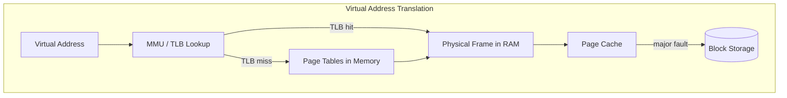
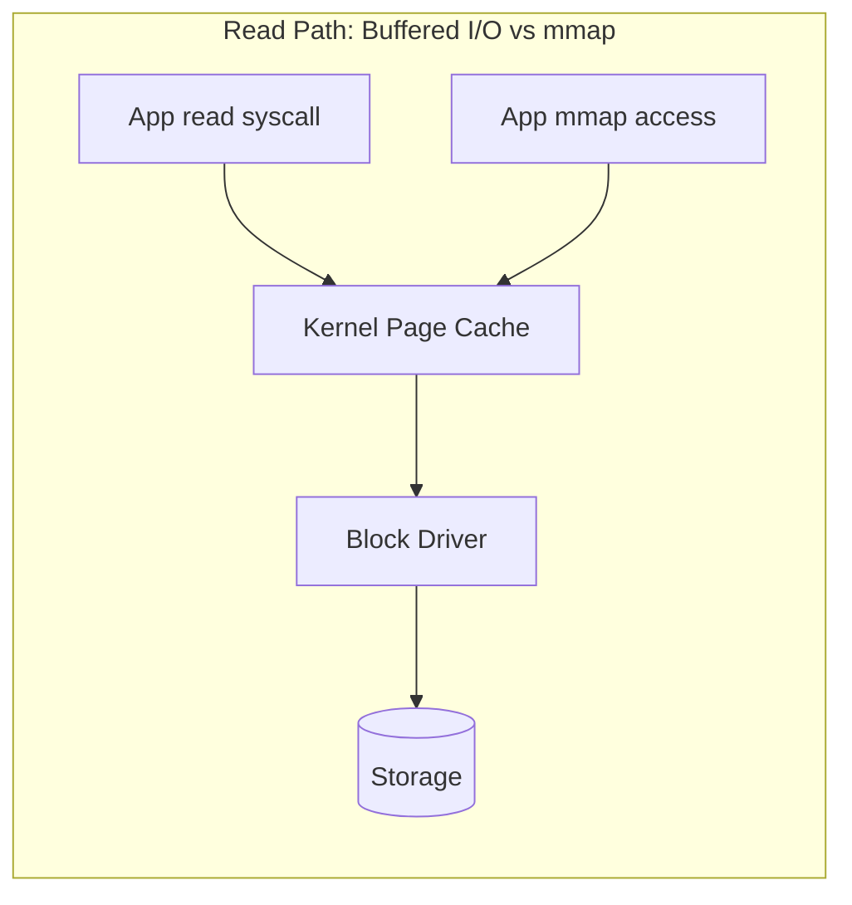
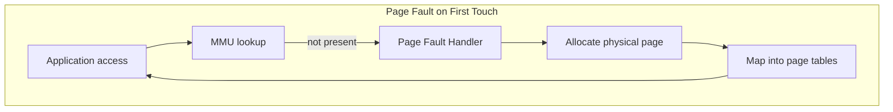

# Virtual Memory and I/O

## 1. Executive Summary

Virtual memory gives each process an isolated, contiguous address space mapped by hardware and the OS onto physical RAM and backing store. Paging enables overcommit, copy-on-write, memory-mapped files, and efficient process creation. Block and file I/O move data between persistent storage and memory through layered kernel subsystems buffered, direct, or memory-mapped.

This chapter covers page tables, TLBs, page faults, swapping, `mmap`, the page cache, and how I/O paths interact with schedulers and storage latency. Understanding virtual memory explains OOM kills, mmap performance cliffs, and database buffer pool behavior.

**Key takeaway:** Every pointer your application dereferences passes through virtual-to-physical translation — and every I/O path competes for the same memory bandwidth.

---

## 2. Why This Topic Matters

Principal architects debug:

- Why did the JVM get OOM-killed despite "free" memory on the node?
- mmap vs. read/write for log ingestion?
- How do huge pages help databases?
- What causes major vs. minor page faults?

Links to [Storage Engine Fundamentals](/docs/storage-engines/storage-engine-fundamentals) and [Write-Ahead Log](/docs/storage-engines/write-ahead-log).

---

## 3. Problems Being Solved

| Problem | Description |
|---------|-------------|
| **Isolation** | Processes cannot access each other's memory |
| **Sparse address spaces** | Allocate large virtual regions without physical RAM |
| **Shared libraries** | Map same code read-only into many processes |
| **Durability** | Persist data via block I/O and filesystems |
| **Performance** | Page cache amortizes disk reads |

---

## 4. Assumptions and System Model

- **Paged virtual memory** with hardware MMU on x86-64/ARM.
- **4 KiB base pages**; **huge pages** (2 MiB, 1 GiB) optional.
- **Linux** examples: `mmap`, page cache, `swap`, `vm.overcommit_memory`.
- Storage as block devices behind filesystems or direct device access.

---

## 5. Essential Terminology

| Term | Definition |
|------|------------|
| **Virtual address** | Address used by program |
| **Physical address** | Location in RAM |
| **Page table** | Maps virtual pages to physical frames |
| **TLB** | Cache of page table entries |
| **Page fault** | Access to unmapped or protected page triggers kernel handler |
| **Major fault** | Requires loading from disk |
| **Minor fault** | Mapping exists; no disk I/O |
| **Copy-on-write (COW)** | Share pages until write |
| **mmap** | Map file or anonymous memory into address space |
| **Page cache** | Kernel cache of file pages in memory |
| **Swap** | Evict cold pages to disk backing store |
| **Direct I/O** | Bypass page cache (`O_DIRECT`) |

---

## 6. Core Mechanism

**Explanation:** The MMU translates virtual to physical addresses. TLB hits are fast; misses walk page tables. If the page is not resident, a major page fault reads from disk via the page cache.

---

## 7. Step-by-Step Walkthrough

**`fork()` + `exec()` launching a service:**

**Step 1 — fork.** Child inherits parent's page table entries marked copy-on-write.

**Step 2 — Write in child.** COW fault allocates new physical page for modified page.

**Step 3 — exec.** Replace address space; load binary via page cache; demand paging brings code pages on first execution (minor faults).

**Step 4 — mmap WAL file.** Database maps write-ahead log; appends cause page cache dirty pages; `fsync` pushes to storage.

**Step 5 — Memory pressure.** Kernel reclaims clean page cache first; may swap anonymous pages; OOM killer if overcommit fails.

---

## 8. Invariants and Guarantees

| Property | Guarantee |
|----------|-----------|
| **Process isolation** | Without shared mappings, cannot access other's mapped memory |
| **CoW on fork** | Reads share until write |
| **Mapped file coherence** | `msync`/`fsync` semantics for durability (filesystem-dependent) |

**Not guaranteed:** Unlimited virtual allocation maps to RAM; `malloc` success implies future OOM safety.

---

## 9. Failure Scenarios

### Scenario 1: OOM Killer

Node overcommitted; spike in allocations; kernel kills largest process (often Java or database).

**Mitigation:** Set container memory limits; tune overcommit; use heap limits; monitor `node_memory_MemAvailable`.

### Scenario 2: Swap Thrashing

RAM exhausted; constant paging; latency collapses.

**Mitigation:** Disable swap on latency-sensitive DB nodes; right-size memory; reduce footprint.

### Scenario 3: mmap Random Write Amplification

Random updates to huge mmap file cause many page faults and cache pressure.

**Mitigation:** Sequential writes, appropriate record size, or traditional buffered I/O with application buffer.

**Explanation:** Anonymous mmap or first heap touch triggers demand paging — the kernel allocates a physical frame and updates page tables. This is a minor fault if no disk I/O is required.

### Extended Deep Dive: Anonymous Memory vs File-Backed

**Anonymous pages** (heap, stack) have no file backing — swap to swap partition/file if enabled. **File-backed** pages (mmap, page cache) can be reclaimed by dropping clean cache or writing dirty cache to file. **Locked memory** (`mlock`) prevents eviction — use sparingly for real-time or database buffers; failure to lock may indicate ulimit `RLIMIT_MEMLOCK`.

**Transparent Huge Pages (THP):** Kernel collapses small pages into huge pages automatically — can help or hurt databases (latency spikes during collapse). Many DB vendors document disable or `madvise` preferences — follow primary source for your engine.

### Extended Deep Dive: I/O Schedulers and NVMe

Legacy **CFQ** scheduler reordered rotational disk requests; **none** or **mq-deadline** common on NVMe with deep queues. Misapplied rotational tuning on flash is historical footgun. Cloud EBS/network storage adds queue depth limits — application concurrency must match device capability, not only CPU.

---

## 10. Performance Characteristics

TLB pressure hurts when working set spans many pages — huge pages reduce entries needed.

Page cache makes repeated reads fast; cold reads pay disk latency (orders of magnitude slower than RAM — qualitative).

`O_DIRECT` avoids double buffering for databases that manage their own cache.

---

## 11. Scalability Limits

- **RAM** bounds hot data.
- **Page table memory** for very large mappings.
- **I/O bandwidth** to storage and network block devices.
- **fsync rate** limits durable write throughput.

---

## 12. Operational Considerations

Tune: `vm.swappiness`, transparent huge pages (workload-dependent — databases often disable THP), `dirty_ratio` for writeback.

Monitor: page faults, major faults, OOM events, disk await, page cache hit ratio (indirect via I/O).

---

## 13. Security Considerations

ASLR randomizes mappings; W^X prevents writable+executable pages.

Meltdown/Spectre mitigations affect syscall and page table isolation (KPTI).

mmap of sensitive files needs permission checks; shared memory regions cross trust boundaries in containers.

---

## 14. Cost Considerations

Over-provisioning RAM avoids swap/OOM but increases cloud bill. Tiered storage trades latency for cost.

Efficient page cache use reduces IOPS charges on cloud disks.

---

## 15. Production Implementations

| System | Pattern |
|--------|---------|
| **PostgreSQL** | `shared_buffers` + OS page cache; optional huge pages |
| **LMDB** | mmap entire database |
| **Kafka** | Page cache relies on sequential log read |
| **Elasticsearch** | mmap for Lucene segments (with caveats) |
| **Containers** | cgroup memory limits + OOM behavior |

### Extended: mmap vs read/write Decision Framework

Choose **mmap** when: large read-mostly files, sequential or random read within mapped region, OS page cache desired, multiple processes share read-only mapping. Choose **read/write or direct I/O** when: fine-grained durability control, streaming writes with bounded memory, portability across OS, error handling simplicity, or working set exceeds address space sanity. Databases often combine: mmap for read segments, append-only log with explicit fsync for writes.

### Extended: VFS and Block Layer Path

Read syscall traverses **VFS** → filesystem (ext4, xfs) → **page cache** → block layer → driver → device. **Direct I/O** aligns buffers to block size and bypasses page cache — database manages consistency. **Async I/O** (libaio, io_uring) overlaps submission with computation. Each layer adds latency variance — distributed storage adds network block device latency on top.

### Extended: Zombie and Orphan Processes

Zombie (defunct) processes hold PID until parent calls `wait()` — PID exhaustion possible if parent bug. Init/systemd reaps orphaned children. In containers, PID 1 must reap zombies — use minimal init (`tini`, `dumb-init`) if application does not handle SIGCHLD. Operational symptom: cannot fork new processes despite low memory — check `ps aux | grep defunct`.

---

## 16. Alternatives and Tradeoffs

| Approach | Pros | Cons |
|----------|------|------|
| **Buffered I/O** | Kernel optimizes readahead | Extra copy |
| **mmap** | Zero-copy feel | Page faults, complex error handling |
| **Direct I/O** | Predictable cache | Alignment constraints |
| **Huge pages** | Fewer TLB misses | Allocation friction |
| **Swap enabled** | Survive spikes | Latency disaster |

---

## 17. Common Misconceptions

1. **"Virtual memory is unlimited."** — Backed by RAM, swap, or nothing (OOM).

2. **"mmap is always faster."** — Depends on access pattern.

3. **"Free memory is wasted."** — Linux uses it for page cache (reclaimable).

4. **"Minor faults are free."** — Cheaper than major, not zero cost.

5. **"Container limit = JVM heap limit."** — Need headroom for native, metaspace, page cache.

---

## 18. Principal Architect Perspective

Define memory limits policy for platforms; document huge page setup for stateful services; require capacity models including page cache and replication buffers.

### Extended: Multi-Level Page Tables

x86-64 uses 4-level (and optionally 5-level) page tables. Each virtual address translation may require multiple memory accesses for page table walks on TLB miss — **page walk cache** mitigates but does not eliminate cost. Very large sparse address spaces (many mappings, scattered access) increase TLB pressure disproportionate to RSS. Databases mapping terabytes virtually but touching gigabytes physically still pay translation costs on scattered access.

### Extended: Copy-on-Write in Containers and Fork

Container image layers use overlay filesystems with CoW — writes to upper layers duplicate blocks. `fork()` in Linux after `clone` flags shares memory until write — relevant for pre-forking web servers (historical Apache model). Understanding CoW explains memory usage spikes when processes diverge after fork — monitoring RSS vs. PSS (proportional set size) clarifies actual memory pressure in shared environments.

### Extended: Page Cache Writeback Policy

Dirty pages accumulate until `dirty_ratio` or `dirty_background_ratio` triggers **writeback** flusher threads. Burst writes can saturate disk briefly; synchronous `fsync` bypasses lazy writeback for durability at latency cost. Architects sizing log pipelines must model **fsync rate** not just bytes/sec — many small fsyncs destroy throughput on rotational and some SSD configurations.

### Extended: Memory Overcommit and OOM Scoring

Linux `vm.overcommit_memory` modes change whether `malloc` can succeed without guaranteed physical backing. Mode 0 heuristically allows overcommit; mode 2 strict caps commit. OOM killer selects victims by `oom_score` influenced by memory usage, cgroup limits, and `oom_score_adj`. In Kubernetes, container without memory limit runs as best-effort — can consume node memory until node-level OOM affects neighbors. **Always set memory limits** for multi-tenant nodes with headroom for kernel and page cache.

---

## 19. Architecture Review Exercise

A log analytics platform mmap's 10 TB of cold files per host with random access. Memory and latency are unstable. Propose architecture changes across I/O model, indexing, and hardware.

---

## 20. Whiteboard Explanation

"Each process sees virtual addresses. The MMU maps them to physical RAM via page tables cached in the TLB. Missing pages fault in from disk. fork uses copy-on-write. Files can be mmap'd into memory — reads hit the page cache. Under pressure, kernel reclaims cache or swaps, or OOM-kills. Databases tune huge pages and direct I/O to control latency."

---

## Extended Walkthrough: Database Buffer Pool vs OS Page Cache

PostgreSQL `shared_buffers` holds relation pages in process memory. OS page cache also caches same underlying files if double-cached — wasted RAM. Tuning balances shared_buffers size against kernel cache reliance.

**Direct I/O databases** bypass page cache for data files in some configurations — predictable memory accounting. WAL still uses buffered I/O typically.

**Checkpoint and writeback:** Dirty shared_buffers flushed during checkpoint; spikes I/O. `vm.dirty_*` sysctl affects concurrent OS-level writeback from other processes — noisy neighbor on shared nodes.

**Principal decision:** Document memory limit = heap + shared_buffers + connection overhead + autovacuum + headroom; do not assume page cache is free for colocated pods.

---

## Extended Failure Scenario: Container Memory Limit OOM vs Node OOM

Pod memory limit 4Gi; JVM max heap 4Gi — native memory, metaspace, thread stacks exceed limit; cgroup OOM kills container despite "heap not full." **Fix:** `MaxRAMPercentage` respecting cgroup; leave headroom; Native Memory Tracking. Distinguish from node-level OOM affecting multiple pods.

---

## 21. Interview Questions

1. What is virtual memory and why use it?

2. Major vs. minor page fault?

3. Explain copy-on-write after fork.

4. How does the TLB relate to page tables?

5. What are huge pages and when help?

6. mmap vs. read/write tradeoffs?

7. What is the page cache?

8. Why might a process be OOM-killed despite free memory on the system?

9. What does `fsync` guarantee?

10. Direct I/O use cases?

11. How do container memory limits interact with the page cache?

12. Explain demand paging.

---

## 22. Interview Follow-Ups

1. **After Q8:** "Explain cgroup memory accounting vs. host free." — *Limit includes cache charged to cgroup; host free may be mostly cache.*

2. **After Q6:** "When is mmap wrong for a database?" — *Random write, portability, error handling, huge VM.*

3. **Principal:** "OOM killed production DB — organizational prevention?" — *Memory requests/limits standards, load tests, OOM drill runbooks.*

---

## 23. Strong Answer Example

**Question:** "Should we use mmap for our write-heavy event store?"

**Strong answer:**

"Depends on access pattern and durability requirements. mmap shines for read-mostly, sequential, large files where the OS page cache helps — Kafka-style consumption. For random writes or fine-grained durability, page faults and flush semantics get painful; we manage less predictable latency.

A write-heavy store usually wants explicit control: append-only log with buffered or direct I/O, `fdatasync` at commit boundaries, and an application buffer pool sized to RAM. I'd prototype both with production-like fsync rates and measure p99 commit latency and major fault rate — not throughput alone. If we mmap, plan for huge pages and careful capacity limits so OOM doesn't take down the node."

---

## 24. Weak Answer Example

**Weak answer:** "mmap is zero-copy so always use it."

**Why weak:** Ignores fault patterns, durability, OOM, and operational complexity.

---

## 25. Hands-On Exercise

Use `mmap` to read a large file sequentially vs. randomly; count faults via `time` or `/proc/self/stat`. Compare `read()` loop. Enable transparent huge pages on/off (if safe) and note TLB behavior qualitatively.

---

## 26. Knowledge Check

1. TLB caches? *(Page table translations.)*
2. COW trigger? *(Write to shared page after fork.)*
3. Page cache purpose? *(Cache file data in RAM.)*
4. O_DIRECT effect? *(Bypass page cache.)*
5. Major fault? *(Disk I/O needed to satisfy access.)*

---

## 27. Flashcards

| Front | Back |
|-------|------|
| Virtual memory | Indirection layer giving each process its own address space |
| Page fault | Trap when accessing unmapped or protected page |
| Major fault | Fault requiring disk read |
| Copy-on-write | Share pages until first write after fork |
| mmap | Map files or anonymous memory into address space |
| Page cache | Kernel cache of file pages in RAM |
| TLB | Translation lookaside buffer for fast address lookup |
| Huge pages | Larger pages reducing TLB pressure |
| O_DIRECT | I/O bypassing page cache |
| Swap | Move cold pages to disk backing store |
| OOM killer | Kernel terminates process when memory exhausted |
| fsync | Flush modified data/metadata for durability |

---

## 28. Cheat Sheet

**Translate:** VA → TLB → page table → physical frame

**Fast reads:** page cache warm · sequential access

**DB tuning:** huge pages · direct I/O · sized buffer pool

**Watch:** major faults · OOM · swap · dirty page writeback

**mmap:** great for read-mostly sequential · careful with random write

## Supplementary Principal Content: Memory Accounting in Cloud

Cloud billing charges RAM provisioned; Kubernetes schedules on requests. **Over-requesting** wastes cluster capacity; **under-requesting** causes OOM or noisy neighbor. Page cache complicates container memory: file reads populate cache charged to cgroup on v2 in many configurations — mmap heavy services need higher limits than heap alone predicts.

**Huge pages operational steps (Linux):** reserve via `/sys/kernel/mm/hugepages`, mount `hugetlbfs`, configure application (PostgreSQL `huge_pages=try`, JVM large pages). Failure to allocate huge pages falls back silently in some configs — monitor allocation success.

**Storage I/O alignment:** Direct I/O requires buffer alignment to block size (often 512B or 4KiB). Misaligned buffers cause EINVAL or kernel bounce buffers defeating zero-copy goals.

### Incident Pattern: Slow fsync

Symptom: commit latency spikes; disk util moderate. Cause may be **fsync queue depth** on cloud volume with credit-based IOPS — burst exhausted. Not CPU or RAM issue. Remediation: provisioned IOPS, batch commits, or relax durability for non-critical paths with explicit tradeoff documentation in ADR.

---

## 29. Related Concepts

- [CPU and Memory Fundamentals](/docs/computer-architecture/cpu-and-memory-fundamentals)
- [Processes, Threads, and Scheduling](/docs/operating-systems/processes-threads-and-scheduling)
- [Kernel Networking and io_uring](/docs/operating-systems/kernel-networking-and-io-uring)
- [Storage Engine Fundamentals](/docs/storage-engines/storage-engine-fundamentals)
- [Write-Ahead Log](/docs/storage-engines/write-ahead-log)

---

### Final expansion: File Descriptor and Page Cache Interaction

Each open file descriptor references kernel `struct file` with offset pointer. Multiple fds can share file description — coordinated offset or independent depending on `dup` semantics. **Page cache** shared across fds to same inode — memory efficient. **unlink** while open — file data persists until last fd closed (common log rotation pattern).

**fadvise** hints (`POSIX_FADV_SEQUENTIAL`, `RANDOM`, `DONTNEED`) influence kernel readahead and reclaim — database engines use strategically; misuse hurts performance.

## Architecture Integration Notes

Memory architecture standards should specify: container memory limit headroom formula; huge page enablement procedure for approved databases; swap policy (usually disabled on DB nodes); `vm.overcommit` setting per node class; and OOM runbook distinguishing cgroup vs node events.

Data platform architects coordinate **mmap-heavy analytics** with **page cache pressure** on shared nodes — isolate batch workloads to separate node pools. File descriptor limits and max map count (`vm.max_map_count` for Elasticsearch) belong in pre-flight cluster checklists.

Durability SLAs drive fsync policy — architects document which paths require `fdatasync` per write vs batch commit, with explicit RPO tradeoff in ADRs linked from service catalog.

### Read-Ahead and Sequential I/O Performance

Linux kernel readahead heuristics prefetch pages when sequential access detected — dramatic speedup for full table scans and log replay. Random access disables readahead benefits — storage engine page layout should match access pattern (B-tree range scan vs point lookup). `readahead` sysfs and `fadvise` allow hinting; databases implement their own prefetch at logical page level when OS hints insufficient.

Virtual memory interactions with **containers and Kubernetes limits** require explicit testing: memory limit triggers cgroup OOM killer which sends SIGKILL — no graceful JVM shutdown. Liveness probe may restart pod into crash loop. Init containers that spike memory during dependency download need separate limit consideration. Ephemeral storage limits affect emptyDir spill for sort-heavy batch jobs — distinct from RAM limits but same operational playbook.

### Closing Principal Synthesis

Foundation chapters in computer architecture, operating systems, and networking form a **single reasoning chain** for production systems. A slow API is rarely one layer's fault: DNS TTL stale after failover (networking); SYN retransmit on lossy path (TCP); TLS handshake without session resumption (HTTP/TLS); epoll thread blocked on synchronous JDBC (kernel I/O + scheduling); page fault on cold JVM heap (virtual memory); false sharing on metrics counter (cache coherence); or ambiguous timeout after partial gateway success (distributed partial failure — next domain in curriculum).

Interview answers that traverse this chain — naming the layer, the mechanism, the measurement, and the tradeoff — signal principal-level systems thinking. Answers that jump to "scale horizontally" without layer discrimination signal staff-level gaps.

Hands-on reinforcement: pick one production incident from your career (or a public postmortem) and rewrite the root cause analysis tagging each contributing factor with the chapter that explains it. Link remediation to mechanism: if coherence traffic, pad or shard; if throttling, fix cgroup quota; if DNS, fix TTL; if bufferbloat, pace bulk traffic.

This synthesis intentionally avoids invented benchmark numbers. Your fleet's constants come from profiling on your hardware, your network path, and your workload shape — the curriculum teaches **which counter to read**, not which magic millisecond threshold to memorize.

Additional study path: after completing this chapter, run the hands-on exercise, then explain the core mechanism to a colleague using only a whiteboard diagram — if you cannot draw the data flow, revisit sections 6 and 7. Principal interview loops often ask for teaching-back as signal of depth. Cross-link study with adjacent chapters in the same domain before moving to distributed systems foundations.

## 30. References

- Love, R. (2010). *Linux Kernel Development* — VM subsystem.
- Kerrisk, M. (2010). *The Linux Programming Interface* — mmap, file I/O.
- Hennessy & Patterson — Virtual memory chapter.
- PostgreSQL documentation — Memory tuning and huge pages.
- Linux kernel documentation — cgroup v2 memory controller.
