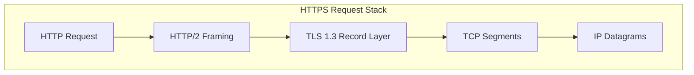
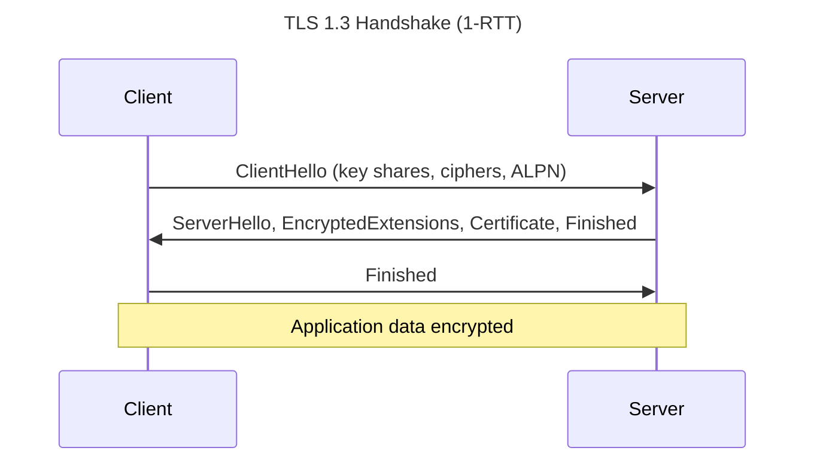
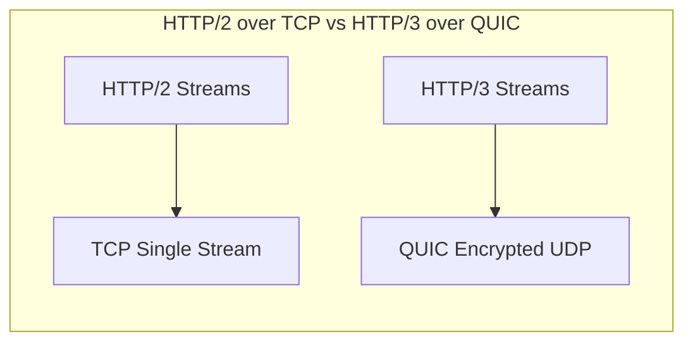

# HTTP, TLS, and QUIC

## 1. Executive Summary

**HTTP** defines application-layer semantics for resources, methods, status codes, and headers — evolving from HTTP/1.1 (text, head-of-line blocking) to **HTTP/2** (binary framing, multiplexing on one TCP connection) to **HTTP/3** over **QUIC** (UDP-based, encrypted transport with stream multiplexing without TCP HOL blocking). **TLS** provides confidentiality, integrity, and authentication atop TCP (or within QUIC).

This chapter covers request/response lifecycle, connection management, TLS handshake and certificate validation, session resumption, ALPN negotiation, QUIC architecture, and operational implications for APIs, browsers, and service meshes.

**Key takeaway:** Modern HTTPS is a stack of negotiated protocols — performance and security depend on every layer from cipher choice to connection reuse.

---

## 2. Why This Topic Matters

Principal architects decide:

- Terminate TLS at edge vs. service?
- HTTP/2 vs HTTP/3 for mobile clients?
- mTLS for zero-trust internal mesh?
- Why did certificate rotation cause an outage?

Essential for [API and Integration Architecture](/docs/api-and-integration-architecture/overview) and edge design.

---

## 3. Problems Being Solved

| Problem | Mechanism |
|---------|-----------|
| **Interoperable APIs** | HTTP semantics |
| **Eavesdropping / tampering** | TLS encryption + MAC/AEAD |
| **Server identity** | Certificates and PKI |
| **Multiplexing** | HTTP/2 streams; QUIC streams |
| **Latency** | TLS session tickets; QUIC 0-RTT (with replay caveats) |
| **Caching** | HTTP cache headers |

---

## 4. Assumptions and System Model

- **HTTPS** as default for external traffic; internal mTLS increasingly common.
- **Public PKI** for internet-facing certs; private CA for internal mesh.
- Middleboxes exist — some historically broke HTTP/2 or QUIC; improving over time.
- QUIC requires UDP path openness.

---

## 5. Essential Terminology

| Term | Definition |
|------|------------|
| **TLS handshake** | Negotiate crypto parameters and authenticate server |
| **Certificate chain** | Leaf → intermediate → root CA |
| **SNI** | Server Name Indication in TLS ClientHello |
| **ALPN** | Application-Layer Protocol Negotiation (h2, http/1.1) |
| **AEAD** | Authenticated encryption (e.g., AES-GCM, ChaCha20-Poly1305) |
| **mTLS** | Mutual TLS — client and server certificates |
| **HOL blocking** | Head-of-line blocking — one slow stream blocks others |
| **HTTP/2 frame** | Length-type-flags-stream-id unit multiplexed on TCP |
| **QUIC** | UDP transport with integrated TLS 1.3 and streams |
| **0-RTT** | Early data on resumed QUIC/TLS connection — replay risk |

---

## 6. Core Mechanism

**HTTPS stack on TCP:**

**TLS 1.3 simplified handshake (1-RTT):**

**QUIC vs TCP+TLS:**

**Explanation:** HTTP/2 multiplexes logical streams on one TCP byte stream — packet loss blocks all streams (TCP HOL). QUIC multiplexes independently at transport layer over UDP; loss on one stream does not block others.

---

## 7. Step-by-Step Walkthrough

**Browser loads `https://api.example.com/v1/users`:**

**Step 1 — DNS** resolves A/AAAA (TCP/IP chapter).

**Step 2 — TCP handshake** to port 443.

**Step 3 — TLS ClientHello** with SNI `api.example.com`, ALPN `h2,http/1.1`.

**Step 4 — Server** presents certificate chain; client validates against trust store and hostname.

**Step 5 — Encrypted HTTP/2** request on stream ID N; multiplexed with other assets on same connection.

**Step 6 — Response** headers + body; `Cache-Control` may allow CDN caching.

**HTTP/3 path:** QUIC handshake integrates TLS; UDP port 443 (often); Alt-Svc header advertises H3.

---

## 8. Invariants and Guarantees

| Layer | Guarantee |
|-------|-----------|
| **TLS 1.3** | Confidentiality and integrity of application data (with correct cert validation) |
| **HTTP** | Request/response semantics per RFC; idempotency rules for methods |
| **HTTP/2** | Ordered delivery per stream; not across streams on lossy TCP |

**Not guaranteed:** 0-RTT data idempotency; certificate pinning without rotation plan; identical behavior across all CDNs.

---

## 9. Failure Scenarios

### Scenario 1: Certificate Expiry

Leaf cert expires; clients reject TLS handshake.

**Mitigation:** Automated cert rotation (ACME/Let's Encrypt), alerting 30+ days ahead, staged rollout.

### Scenario 2: TLS Version/Cipher Mismatch

Legacy client cannot negotiate TLS 1.3 only server.

**Mitigation:** Document minimum versions; phased deprecation with metrics.

### Scenario 3: HTTP/2 Single Connection Stall

TCP retransmit on loss stalls all multiplexed API calls.

**Mitigation:** HTTP/3 for lossy/mobile paths; multiple connections (limited); timeout per stream at app layer.

### Scenario 4: mTLS Misconfiguration

Wrong CA in trust bundle; intermittent 503 in mesh.

**Mitigation:** Centralized cert management (SPIFFE/SPIRE), integration tests for rotation.

### Extended Deep Dive: Content Negotiation and Compression

`Accept-Encoding: gzip, br` — server selects algorithm. **Brotli** better compression, higher CPU. Compress at CDN edge for static assets; careful with dynamic secrets (CRIME/BREACH class concerns on compressing secrets with attacker-influenced input). `Vary` header affects cache keys at CDN.

### Extended Deep Dive: WebSocket Upgrade Path

Client `Connection: Upgrade`, `Upgrade: websocket`. LB must support connection upgrade and long-lived TCP passthrough or specialized L7 handling. Idle timeouts must exceed application ping interval. WebSocket over HTTP/2 extended CONNECT (RFC 8441) — deployment support varies.

### Extended Deep Dive: API Versioning at HTTP Layer

URL path (`/v1/`), header (`Accept-Version`), or content type. Versioning interacts with caching — CDN may cache wrong version if keys omit version. Deprecation policy: `Sunset` header (draft/RFC ecosystem), metrics on old version usage before removal.

---

## 10. Performance Characteristics

TLS handshake adds RTT(s) — session resumption (tickets, PSK) amortizes.

HTTP/2 reduces connection count; HPACK header compression helps repetitive headers.

QUIC improves lossy network behavior; CPU may differ from kernel TCP offload.

Measure with WebPageTest, `curl -w`, distributed synthetic probes — do not invent handshake millisecond claims.

---

## 11. Scalability Limits

- **TLS CPU** on edge at very high RPS.
- **Certificate count** on multi-tenant LBs (SNI scaling).
- **Connection memory** on L7 proxies.
- **OCSP stapling** and CRL fetch failures.

---

## 12. Operational Considerations

Automate cert lifecycle; monitor expiry, handshake error rate, ALPN distribution.

Configure idle timeouts consistently: client, LB, server.

HTTP/3: ensure UDP 443 allowed; fallback via Alt-Svc.

---

## 13. Security Considerations

- Validate full chain and hostname; no custom `TrustAll`.
- HSTS for browser clients.
- 0-RTT only for idempotent operations.
- mTLS for service identity; combine with authorization at app layer.
- Log redaction — headers may contain tokens.

---

## 14. Cost Considerations

L7 load balancers charge per rule and capacity; TLS at edge reduces service CPU.

CDN egress vs origin — cacheable HTTP responses save cost.

Dedicated crypto hardware (some LBs) vs general CPU tradeoff.

---

## 15. Production Implementations

| System | Notes |
|--------|-------|
| **Envoy / NGINX** | TLS termination, HTTP/2, QUIC (envoy quiche) |
| **Let's Encrypt / ACME** | Automated public certs |
| **Cloudflare / CloudFront** | Edge TLS and HTTP/3 |
| **Istio / Linkerd** | mTLS mesh |
| **gRPC** | HTTP/2 by default; h2 over TLS |

### Extended: Reverse Proxy and Forward Proxy

**Reverse proxy** (client-facing LB) terminates client connections, forwards to origin — hides backend topology. **Forward proxy** (corporate egress) mediates outbound client access. **CONNECT** method tunnels HTTPS through forward proxies. Architecture reviews should clarify proxy trust boundaries — TLS inspection proxies break end-to-end encryption with organizational policy implications.

### Extended: HPACK and Header Compression

HTTP/2 HPACK compresses headers via static and dynamic tables — **HPACK bomb** attacks use dynamic table manipulation — mitigated by server limits. Header size limits (`SETTINGS_MAX_HEADER_LIST_SIZE`) prevent abuse. Large cookies inflate every request — architectural debt visible at HTTP/2 layer.

### Extended: TLS Cipher Suite Selection

Prefer **AEAD** suites (AES-GCM, ChaCha20-Poly1305). Disable legacy CBC suites vulnerable to padding oracles. **Perfect Forward Secrecy** via ephemeral key exchange (ECDHE). Hardware AES-NI accelerates AES-GCM on modern CPUs. Document minimum TLS 1.2/1.3 policy; deprecate RSA key transport. Internal mTLS may use shorter cert lifetimes with automated rotation.

---

## 16. Alternatives and Tradeoffs

| Choice | Pros | Cons |
|--------|------|------|
| **Edge TLS termination** | Centralized cert mgmt | End-to-end encryption ends at edge |
| **Pass-through TLS** | Encryption to service | Cert per service; harder L7 routing |
| **HTTP/2 only** | Mature | TCP HOL on loss |
| **HTTP/3** | Better on lossy links | UDP path, newer stack |
| **JWT vs mTLS** | Different trust models | Often combined |

---

## 17. Common Misconceptions

1. **"HTTPS means secure application."** — TLS protects transport; app bugs remain.

2. **"HTTP/2 always faster."** — Multiplexing helps; single lossy TCP can hurt.

3. **"QUIC replaces TCP everywhere."** — Deployment-dependent; internal east-west may stay h2/TCP.

4. **"mTLS replaces authz."** — Identity ≠ permission.

5. **"Long-lived certs reduce ops."** — Increases breach blast radius; short-lived + automation preferred.

---

## 18. Principal Architect Perspective

Publish API gateway standards: TLS versions, cipher suites, max request size, timeout budgets, idempotency for retried POST with 0-RTT.

Coordinate cert rotation runbooks across edge and mesh.

### Extended: HTTP Semantics for Architects

**Idempotency:** GET, PUT, DELETE idempotent by specification; POST not — retries require idempotency keys for mutations. **Safe methods** (GET, HEAD, OPTIONS) should not mutate server state — caching and CDN behavior depend on this contract. Violating safe semantics breaks intermediaries. **Status code taxonomy:** 2xx success, 3xx redirection, 4xx client error (do not retry blindly except 429 with Retry-After), 5xx server error (retry with backoff). Align client retry policies with these semantics per [Partial Failure](/docs/distributed-systems-foundations/partial-failure).

### Extended: HTTP/2 Flow Control

HTTP/2 has connection-level and stream-level flow control windows separate from TCP windows. A slow stream consumer can block stream window without filling TCP — multiplexing does not eliminate all blocking dimensions. SETTINGS frames negotiate initial window sizes. Proxies must forward flow control correctly or stall streams opaquely.

### Extended: Certificate Lifecycle at Scale

Short-lived certs (90-day Let's Encrypt) require automation. **Certificate Transparency** logs provide public audit trail. Internal PKI for mTLS needs rotation runbooks, CRL/OCSP infrastructure or stapling, and break-glass procedures. Staged rotation: deploy new cert alongside old, validate chain, switch traffic, revoke old. Monitor `SSL_CERT_NOT_VALID_AFTER` metrics weeks ahead.

### Extended: QUIC Connection Migration

QUIC connection IDs allow **connection migration** when client IP changes (mobile handoff) without full re-handshake. Application state persists at QUIC layer. Security implications: path validation challenges prevent hijacking. Architects evaluating mobile APIs should test handoff scenarios — TCP+TLS would reset connection; QUIC may preserve — behavior differs for long-polling and streaming.

---

## 19. Architecture Review Exercise

Global API serves mobile clients on variable networks. p99 regresses on cellular but not Wi-Fi. Evaluate HTTP/2 vs HTTP/3, TLS resumption, and CDN strategy. Define success metrics.

---

## 20. Whiteboard Explanation

"HTTP defines methods, URLs, headers, bodies. HTTPS wraps HTTP in TLS — handshake negotiates keys and verifies server cert. HTTP/2 multiplexes streams on one TCP connection. Loss on TCP blocks all streams. HTTP/3 runs over QUIC on UDP — independent streams, integrated TLS 1.3. Terminate TLS at edge for ops simplicity or pass through for end-to-end encryption — tradeoff."

---

## Extended Walkthrough: mTLS Service Mesh Bootstrap

Control plane issues workload certificates (SPIFFE ID). Sidecar terminates mTLS inbound; presents client cert outbound. Rotation with dual trust during migration. **Failure:** stale trust bundle — partial mesh failure. mTLS authenticates, does not authorize.

---

## Extended Failure Scenario: HTTP/2 GOAWAY During Deploy

Server GOAWAY during shutdown — no new streams. Misconfigured last-stream ID kills in-flight requests. Clients retry idempotent ops on fresh connection. Align with LB drain and pod `terminationGracePeriodSeconds`.

---

## 21. Interview Questions

1. HTTP/1.1 vs HTTP/2 differences?

2. Walk through TLS 1.3 handshake at high level.

3. What is SNI and why needed?

4. Explain HTTP/2 head-of-line blocking.

5. How does QUIC address HOL blocking?

6. Edge TLS termination vs pass-through?

7. What is mTLS and when use?

8. Security risks of TLS 0-RTT?

9. Important HTTP caching headers?

10. gRPC relationship to HTTP/2?

11. How certificate validation works?

12. ALPN purpose?

---

## 22. Interview Follow-Ups

1. **After Q5:** "Why QUIC in kernel slowly?" — *Userspace stacks, evolution, deployment.*

2. **After Q7:** "SPIFFE vs corporate PKI?" — *Workload identity, federation.*

3. **Principal:** "Org-wide TLS 1.0 deprecation plan?" — *Inventory, metrics, exceptions, comms.*

---

## 23. Strong Answer Example

**Question:** "Should we adopt HTTP/3 for our public API?"

**Strong answer:**

"Evaluate on client network profile and operational readiness. HTTP/3 helps when packet loss causes TCP-level head-of-line blocking affecting all HTTP/2 streams — common on mobile/cellular. Benefits are less clear on stable datacenter paths where HTTP/2 over kernel TCP is mature and hardware-offloaded.

I'd run synthetic probes from diverse networks measuring TTFB and error rates for H2 vs H3. Operationally we need UDP 443 open on firewalls, CDN/LB support, and fallback via Alt-Svc. TLS 1.3 is assumed either way. Decision criteria: measured p99 improvement on target clients vs. added complexity — not novelty."

---

## 24. Weak Answer Example

**Weak answer:** "HTTP/3 is newest so enable it everywhere."

**Why weak:** No client analysis, ops readiness, or fallback; confuses new with appropriate.

---

## 25. Hands-On Exercise

`curl -v --http2 https://example.com` and `curl --http3-only` if supported. Inspect cert with `openssl s_client`. Compare waterfall with and without keep-alive. Document ALPN negotiated protocol.

---

## 26. Knowledge Check

1. HTTP/2 multiplexing transport? *(Single TCP connection.)*
2. TLS provides? *(Confidentiality, integrity, authentication.)*
3. SNI carries? *(Requested hostname at TLS start.)*
4. QUIC runs over? *(UDP.)*
5. Idempotent methods include? *(GET, PUT, DELETE — per HTTP semantics.)*

---

## 27. Flashcards

| Front | Back |
|-------|------|
| HTTP/2 | Binary protocol multiplexing streams on one TCP connection |
| TLS 1.3 | Modern TLS with fewer round trips than 1.2 |
| SNI | Client indicates target hostname during TLS handshake |
| ALPN | Negotiates application protocol (h2, http/1.1) in TLS |
| mTLS | Both client and server present certificates |
| HOL blocking | One delayed packet blocks subsequent multiplexed streams on TCP |
| QUIC | UDP transport with built-in encryption and stream multiplexing |
| HTTP/3 | HTTP semantics over QUIC |
| 0-RTT | Resumed connection sends data before full handshake — replay risk |
| HSTS | Browser policy forcing HTTPS for domain |
| AEAD | Authenticated encryption with associated data |
| OCSP stapling | Server provides cert revocation status in handshake |

---

## 28. Cheat Sheet

**Stack:** HTTP → TLS → TCP (or HTTP/3 → QUIC/UDP)

**Perf:** session resumption · connection reuse · right protocol for network

**Security:** validate certs · short-lived · automate rotation · careful 0-RTT

**H2 issue:** TCP loss blocks all streams → consider H3 on lossy paths

**mTLS:** identity at transport · still need authorization

## Supplementary Principal Content: API Gateway Standards

Document for all teams:

- Maximum request/response body size
- TLS minimum version and cipher order
- Allowed HTTP methods per route class
- Rate limit headers (`Retry-After`)
- Correlation ID propagation (`traceparent`)
- Error body schema (no stack traces to clients)

**HSTS preload:** Submit domain to browser preload list only with org commitment to HTTPS forever — rollback difficult.

**Certificate pinning:** Mobile apps pin leaf or SPKI — breaks on cert rotation unless pin update shipped before cert change. Prefer pinning backup keys or avoid pinning for web.

### HTTP Caching and CDN

`Cache-Control: public, max-age=3600` for immutable versioned assets (`app.v123.js`). `private` for user-specific data. `no-store` for sensitive PII. **Vary: Accept-Encoding** prevents serving gzip client br content. Purge API on CDN for emergency rollback — practice purge latency in drills.

---

## 29. Related Concepts

- [TCP/IP Fundamentals](/docs/networking/tcp-ip-fundamentals)
- [Routing, Load Balancing, and Congestion](/docs/networking/routing-load-balancing-and-congestion)
- [Kernel Networking and io_uring](/docs/operating-systems/kernel-networking-and-io-uring)
- [Security Architecture Fundamentals](/docs/security/security-architecture-fundamentals)
- [API and Integration Architecture](/docs/api-and-integration-architecture/overview)

---

### Final expansion: OAuth and HTTP Interaction

Bearer tokens in `Authorization` header — must not cache at shared CDN. **CORS** is browser enforcement only — not server-side auth. Architects distinguish transport security (TLS) from application auth (OAuth2/OIDC tokens).

**SameSite cookies** mitigate CSRF — `Strict`, `Lax`, `None` with Secure. API-first mobile apps use token headers instead of cookies — different threat model.

### Final expansion: Server Push (HTTP/2) Lessons

HTTP/2 server push promised proactive asset delivery — limited adoption due to cache mismatch and wasted bandwidth. **103 Early Hints** alternative for preload hints. Lesson: protocol features need client and CDN ecosystem — evaluate before architecting around push.

## Architecture Integration Notes

API platform teams publish **HTTP contract standards**: error model (RFC 7807 problem+json optional); pagination cursors; rate limit headers; versioning policy; maximum URL length; allowed content types. TLS standards specify cert rotation automation, minimum TLS version, and cipher suites vetted annually.

HTTP/3 enablement checklist: UDP 443 on firewalls; CDN support; fallback Alt-Svc; client library support matrix; metrics split by protocol version for comparison during rollout.

Security review includes: HSTS deployment plan; cookie flags; CORS policy not substituting for auth; mTLS identity mapping to service accounts; no secrets in query strings logged by proxies.

### Mutual TLS Operational Maturity Model

**Level 1:** Manual cert distribution, annual rotation, outage-prone. **Level 2:** Automated issuance (SPIFFE/SPIRE, cert-manager), short-lived certs, monitored expiry. **Level 3:** Full identity federation, policy-as-code for which services may call which, automatic revocation on compromise, zero-touch rotation game days quarterly. Principal architects push teams toward Level 2 minimum for internal production traffic.

HTTP **conditional requests** (`ETag`, `If-None-Match`, `If-Modified-Since`) reduce bandwidth for cache validation — CDN and browser caches rely on correct implementation. Strong ETags per representation; weak ETags for semantically equivalent variants. Mis-implemented ETag causes unnecessary full transfers or stale content bugs — both visible to customers. API gateways should pass through conditional headers unless transformation changes representation.

### Closing Principal Synthesis

Foundation chapters in computer architecture, operating systems, and networking form a **single reasoning chain** for production systems. A slow API is rarely one layer's fault: DNS TTL stale after failover (networking); SYN retransmit on lossy path (TCP); TLS handshake without session resumption (HTTP/TLS); epoll thread blocked on synchronous JDBC (kernel I/O + scheduling); page fault on cold JVM heap (virtual memory); false sharing on metrics counter (cache coherence); or ambiguous timeout after partial gateway success (distributed partial failure — next domain in curriculum).

Interview answers that traverse this chain — naming the layer, the mechanism, the measurement, and the tradeoff — signal principal-level systems thinking. Answers that jump to "scale horizontally" without layer discrimination signal staff-level gaps.

Hands-on reinforcement: pick one production incident from your career (or a public postmortem) and rewrite the root cause analysis tagging each contributing factor with the chapter that explains it. Link remediation to mechanism: if coherence traffic, pad or shard; if throttling, fix cgroup quota; if DNS, fix TTL; if bufferbloat, pace bulk traffic.

This synthesis intentionally avoids invented benchmark numbers. Your fleet's constants come from profiling on your hardware, your network path, and your workload shape — the curriculum teaches **which counter to read**, not which magic millisecond threshold to memorize.

Additional study path: after completing this chapter, run the hands-on exercise, then explain the core mechanism to a colleague using only a whiteboard diagram — if you cannot draw the data flow, revisit sections 6 and 7. Principal interview loops often ask for teaching-back as signal of depth. Cross-link study with [TCP/IP Fundamentals](/docs/networking/tcp-ip-fundamentals) and [Routing, Load Balancing, and Congestion](/docs/networking/routing-load-balancing-and-congestion) before moving to distributed systems foundations. Practice explaining TLS 1.3 handshake in one minute and HTTP/2 versus HTTP/3 tradeoffs without slides — clarity under time pressure mirrors executive communication expectations at principal level.

Review the **OWASP API Security Top 10** categories that intersect HTTP transport: broken authentication, excessive data exposure, and lack of rate limiting — TLS solves wiretap risk but not authorization bugs. Pair transport security chapters with [Security Architecture Fundamentals](/docs/security/security-architecture-fundamentals) before system design interviews.

When presenting HTTP versioning decisions to leadership, frame tradeoffs in customer-visible terms: "HTTP/3 reduces tail latency on lossy mobile networks" rather than protocol internals. Executives approve outcomes and risk, not frame types. Maintain a one-page decision log linking protocol choices to measured SLO impact and operational requirements (UDP path, cert rotation automation, CDN compatibility).

Complete the knowledge check in section 26 without notes, then record one real production incident from your experience where HTTP or TLS layer behavior mattered — if none come to mind, study a public CDN or certificate expiry postmortem and write three lessons mapped to sections in this chapter. Revisit section 16 alternatives table when choosing edge versus service-side TLS termination for your next architecture review. Document the decision in an ADR.

## 30. References

- RFC 9110 — HTTP Semantics.
- RFC 9113 — HTTP/2.
- RFC 9114 — HTTP/3.
- RFC 8446 — TLS 1.3.
- RFC 9000 — QUIC: A UDP-Based Multiplexed and Secure Transport.
- Mozilla SSL Configuration Generator — Cipher and version guidance.
