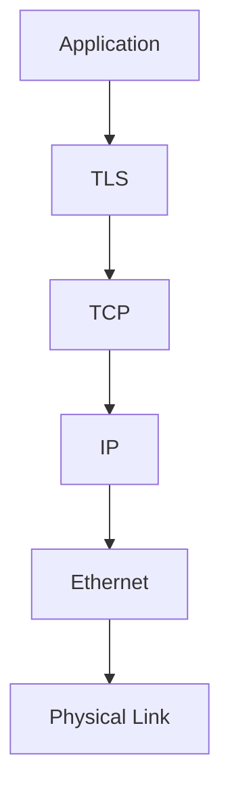

# Networking

TCP/IP, DNS, TLS, HTTP, load balancing, routing, and congestion control.

*Figure: Network stack layering from application to physical transport.*

## Chapters

| Chapter | Focus |
|---------|-------|
| TCP/IP Fundamentals | [TCP/IP Fundamentals](/docs/networking/tcp-ip-fundamentals) |
| Routing, Load Balancing, and Congestion | [Routing, Load Balancing, and Congestion](/docs/networking/routing-load-balancing-and-congestion) |
| HTTP, TLS, and QUIC | [HTTP, TLS, and QUIC](/docs/networking/http-tls-and-quic) |

## Learning Path

1. Start with **TCP/IP Fundamentals** for sockets, congestion control, and DNS.
2. Study **Routing, Load Balancing, and Congestion** for L4/L7 proxies and backpressure.
3. Finish with **HTTP, TLS, and QUIC** for application-layer protocols and modern transport.

## Related Domains

- [Operating Systems](/docs/operating-systems/overview)
- [API and Integration Architecture](/docs/api-and-integration-architecture/overview)

Return to the [Curriculum Overview](/docs/start-here/curriculum-overview) to see how this domain fits the learning path.
