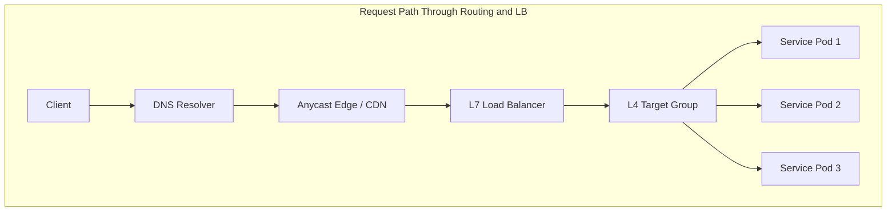
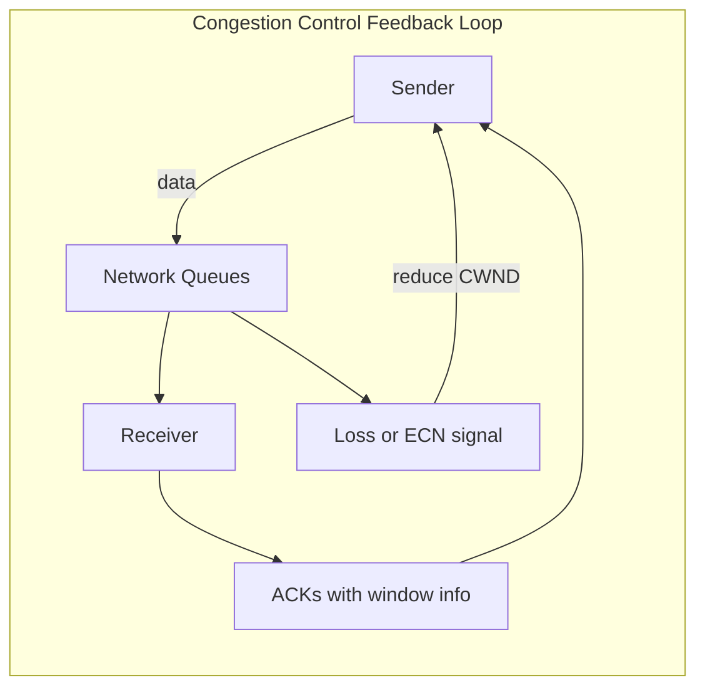
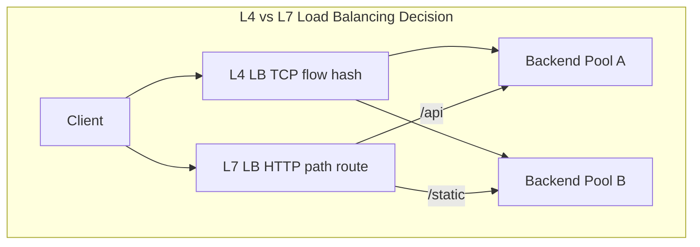

# Routing, Load Balancing, and Congestion

## 1. Executive Summary

**IP routing** determines which path packets take across autonomous systems — from host default gateways to **BGP** (Border Gateway Protocol) exchanging reachability between ISPs and data centers. **Load balancers** distribute traffic across backends at Layer 4 (connection) or Layer 7 (HTTP). **TCP congestion control** algorithms adjust send rates when the network signals overload — affecting throughput and fairness for every large transfer and many RPC workloads.

This chapter connects global routing (anycast, health-based DNS), data-center load balancing (round-robin, least connections, consistent hashing), and congestion control evolution (Reno, CUBIC, BBR) to architecture decisions for multi-region systems, failover, and capacity planning.

**Key takeaway:** Traffic reaches your service through routing and balancing decisions at multiple layers — each with failure modes, capacity limits, and consistency implications.

---

## 2. Why This Topic Matters

Principal architects design:

- Multi-region failover with BGP or DNS?
- L4 vs L7 load balancing for gRPC?
- Why did cross-AZ traffic spike costs?
- How congestion control affects bulk replication lag?

Links [Multi-Region Architecture](/docs/cloud-architecture/multi-region-architecture), [Partial Failure](/docs/distributed-systems-foundations/partial-failure), and [Quorum Systems](/docs/consistency/quorum-systems).

---

## 3. Problems Being Solved

| Problem | Solution layer |
|---------|----------------|
| **Reachability** | IP routing, BGP |
| **Scale-out** | Load balancers, anycast |
| **Failover** | Health checks, route withdrawal, DNS |
| **Overload** | Congestion control, admission control |
| **Stickiness** | Session affinity, consistent hashing |

---

## 4. Assumptions and System Model

- **Internet routing** is policy-driven and approximate — not guaranteed optimal or stable at all times.
- **Data-center** typically uses ECMP, overlay networks (VXLAN), and hardware or software LBs.
- **TCP congestion control** is end-to-end; middleboxes may shape or buffer.
- Health checks imply asynchronous failure detection — delayed failover is normal.

---

## 5. Essential Terminology

| Term | Definition |
|------|------------|
| **BGP** | Inter-domain routing protocol exchanging path vectors |
| **ASN** | Autonomous System Number |
| **Anycast** | Same IP announced from multiple locations; route to nearest |
| **L4 LB** | Distributes based on IP/port (TCP/UDP) |
| **L7 LB** | Routes based on HTTP headers, paths, cookies |
| **ECMP** | Equal-cost multipath — hash flows across links |
| **Consistent hashing** | Minimal key redistribution when nodes change |
| **CWND** | Congestion window — sender's allowed in-flight data |
| **RTT fairness** | Flows with longer RTT get lower throughput under some CCAs |
| **Bufferbloat** | Excessive queueing delay in buffers |
| **SYN proxy** | LB completes handshake on behalf of backends |

---

## 6. Core Mechanism

**Multi-layer traffic path:**

**TCP congestion window (conceptual):**

**Explanation:** Senders increase CWND until loss or ECN indicates congestion, then decrease — probing available bandwidth. Bufferbloat inflates RTT when queues are oversized, hurting interactive traffic sharing the path.

---

## 7. Step-by-Step Walkthrough

**User request to globally distributed API:**

**Step 1 — DNS** returns geo-proximate anycast IP or regional alias (Route 53 latency routing).

**Step 2 — BGP** routes packets to nearest POP announcing that prefix.

**Step 3 — L7 LB** terminates TLS, routes `/v1/orders` to order service pool by path rule.

**Step 4 — L4 / kube-proxy / service mesh** picks pod via consistent hash on `order_id` for affinity.

**Step 5 — TCP** flow subject to CUBIC or BBR on path; cross-region replication bulk transfer competes for bandwidth.

**Step 6 — Backend failure.** Health check fails; LB drains connections; BGP or DNS may shift traffic regionally — bounded by TTL and propagation delay.

---

## 8. Invariants and Guarantees

| Layer | Typical guarantee |
|-------|-------------------|
| **BGP** | Convergence to new routes after withdrawal (time varies) |
| **LB** | Distributes per algorithm; not strict global fairness |
| **TCP CC** | Avoids collapse; fairness properties algorithm-dependent |

**Not guaranteed:** Instant failover; equal share across tenants without isolation; zero cross-AZ cost.

---

## 9. Failure Scenarios

### Scenario 1: BGP Misconfiguration / Hijack

Wrong prefix announced; traffic diverted.

**Mitigation:** RPKI where supported, prefix monitoring, multi-homing, MANRS practices.

### Scenario 2: LB Health Check Flapping

Backends oscillate in/out of pool; connection resets.

**Mitigation:** Hysteresis on health checks, outlier detection, graceful drain.

### Scenario 3: Thundering Herd on Cold Cache

Failover shifts 100% traffic to standby region; overload.

**Mitigation:** Pre-warmed capacity, gradual shift, request shedding, cache priming.

### Scenario 4: Bufferbloat During Bulk Copy

Replication saturates link; user-facing RPC latency spikes.

**Mitigation:** QoS, separate networks, pacing, BBR vs CUBIC evaluation on path.

**Explanation:** L4 distributes connections without parsing HTTP — fast, protocol-agnostic. L7 inspects requests for path/host routing, TLS SNI, and WAF — more CPU, richer policy.

### Extended Deep Dive: Anycast vs GeoDNS Tradeoff Table

| Mechanism | Failover speed | Client precision | Complexity |
|-----------|----------------|------------------|------------|
| Anycast | Fast (BGP convergence) | Nearest POP to resolver path | BGP ops |
| GeoDNS | TTL-bound | Resolver location proxy | DNS provider |
| Latency routing | Policy-based | Measured probes | Vendor lock-in |

Hybrid common: anycast at edge, regional origins behind GeoDNS.

### Extended Deep Dive: Congestion Collapse

When retransmits flood network, effective throughput collapses — classic 1986 Internet event. Modern TCP CC prevents worst cases but **retry storms** at application layer recreate analogous collapse — see [Partial Failure](/docs/distributed-systems-foundations/partial-failure). Network and application congestion control both required.

### Extended Deep Dive: Equal-Cost Multipath Hash Polarization

ECMP hashes flow 5-tuple to link. If hash entropy low (same src/dst across flows), links underutilized. **Resilient ECMP** or **entropy labels** in MPLS/segment routing mitigate in carrier networks — awareness helps when diagnosing uneven link utilization in hybrid WAN.

---

## 10. Performance Characteristics

Routing convergence after failure: seconds to minutes depending on BGP timers and provider — not milliseconds.

LB adds small latency (TLS termination dominates for HTTPS).

Congestion control affects **goodput** — useful throughput after retransmits.

Cross-AZ latency is floor-bound by physics; architect to minimize chatty cross-zone calls.

---

## 11. Scalability Limits

- **LB connection table** size and new connections/sec.
- **ECMP hash polarization** if entropy poor.
- **BGP table size** on routers (internet-scale concern).
- **Consistent hash ring** rebalance on membership change.

---

## 12. Operational Considerations

Runbooks: regional failover, LB misroute, DDoS absorption, path MTU issues.

Monitor: BGP session state (if applicable), LB healthy host count, SYN rate, ECN marks, inter-AZ bytes.

Game days: DNS failover drill, single-AZ withdrawal.

---

## 13. Security Considerations

L7 WAF at edge; rate limiting against DDoS.

BGP security (RPKI) against hijack.

Internal LB segmentation — east-west policy in mesh.

---

## 14. Cost Considerations

Cross-AZ and cross-region transfer often billed per GB — architecture dominates network tax.

Anycast and CDN reduce origin load but add service fees.

Over-provisioned standby regions cost idle capacity — weighed against RTO/RPO.

---

## 15. Production Implementations

| System | Pattern |
|--------|---------|
| **AWS ALB/NLB** | L7 vs L4 tradeoffs |
| **GCP Cloud Load Balancing** | Global anycast frontends |
| **Envoy** | L7 routing, outlier detection, retry budgets |
| **Maglev / consistent hash** | Google LB paper — minimal disruption |
| **CUBIC / BBR** | Linux default CCAs — behavior differs |

### Extended: DSR (Direct Server Return)

In **Direct Server Return**, LB receives client traffic but backends reply directly to client — reduces LB egress bandwidth. Requires loopback on backends and L2 adjacency or tunnel tricks. Used at very high scale; operational complexity high. Contrast with NAT mode where all traffic traverses LB.

### Extended: Retry and Idempotency at LB

L7 LBs may retry failed requests to another backend — safe only for idempotent methods or with request IDs. Retrying POST without idempotency violates safety. Align with [Idempotency](/docs/distributed-systems-foundations/idempotency) patterns. **Outlier detection** ejects unhealthy backends based on consecutive failures or latency — prevents retry amplification to sick nodes.

### Extended: WAN vs DC Congestion

Datacenter networks often have shallow buffers and ECN enabled — BBR may perform well. WAN paths have variable loss and bufferbloat — CUBIC loss response may differ. Bulk cross-region replication should use **paced sends** and **bandwidth limits** to protect interactive traffic — application-level QoS when network QoS unavailable.

---

## 16. Alternatives and Tradeoffs

| Approach | Pros | Cons |
|----------|------|------|
| **DNS failover** | Simple | TTL delay |
| **BGP anycast** | Fast regional draw | Complex ops |
| **L4 LB** | Fast, generic | No path routing |
| **L7 LB** | Rich routing | CPU, latency |
| **Client-side LB** | No single point | Client complexity (gRPC xDS) |
| **Active-active regions** | Low RTO | Data consistency cost |

---

## 17. Common Misconceptions

1. **"BGP is fast failover like LB health check."** — Convergence times differ by orders of magnitude.

2. **"Round-robin is always fair."** — Unequal request costs skew load.

3. **"More bandwidth eliminates congestion."** — Bottleneck moves; CC still governs share.

4. **"Anycast means active-active compute."** — Anycast is routing; backends may still be regional.

5. **"Consistent hashing needs no rebalancing."** — Virtual nodes help; membership changes still move keys.

---

## 18. Principal Architect Perspective

Document RTO/RPO per tier; match failover mechanism (DNS vs BGP vs LB) to requirements.

Capacity: standby region must absorb full traffic without violating SLO — include congestion headroom.

Align with [SLO, SLI, and Error Budgets](/docs/reliability-and-resilience/slo-sli-error-budgets).

### Extended: BGP Path Selection (Conceptual)

BGP routers select routes using attribute policies: LOCAL_PREF (higher preferred within AS), AS_PATH length (shorter often preferred), MED (multi-exit discriminator between peers), and origin type. **Route leaks** — announcing routes without permission — redirect traffic globally. RPKI ROV validates origin AS against signed ROAs where deployed. Multi-homed enterprises use BGP to influence inbound and outbound paths — distinct from application load balancing.

### Extended: Load Balancer Algorithms

**Round robin:** simple; ignores backend load. **Least connections:** better for long-lived unequal-cost requests. **Weighted:** capacity heterogeneity. **Maglev consistent hash:** minimal disruption on backend set change — used at Google scale. **Power of two choices:** pick two random backends, route to lesser load — O(1) with good balance. Match algorithm to request duration distribution and health check granularity.

### Extended: TCP Reno and Fast Recovery (Teaching Baseline)

Reno increases CWND in slow start (exponential) until loss, then congestion avoidance (linear). On triple duplicate ACK, **fast retransmit** resends segment without waiting full RTO; **fast recovery** adjusts CWND. Modern Linux defaults differ (CUBIC), but Reno remains pedagogical baseline for understanding loss reaction. **Tail loss** on short flows may never trigger fast retransmit — single timeout dominates latency.

### Extended: Active Queue Management

**RED** and **CoDel** proactively drop or mark packets before buffers fill completely — signaling congestion earlier, reducing bufferbloat. **ECN** (Explicit Congestion Notification) marks IP headers instead of dropping — TCP reduces CWND on ECN-Echo. Datacenter TCP stacks increasingly enable ECN end-to-end where switches support it — requires coordinated enablement across path.

### Extended: Multi-Region Traffic Engineering

**GeoDNS** routes to nearest healthy region by resolver location — imprecise (resolver not user location). **Anycast** routes to nearest BGP announcement. **Latency-based routing** (AWS Route 53 policy) uses measured latency. **Active-active** requires data plane accepting writes in multiple regions with conflict handling — routing alone does not solve consistency. Pair routing decisions with RPO/RTO and [CAP](/docs/consistency/cap-theorem) tradeoff articulation.

---

## 19. Architecture Review Exercise

SaaS platform active-passive between us-east and eu-west. RTO 5 minutes required. Current DNS TTL 3600. Redesign routing, LB, data replication, and failover drill. State tradeoffs.

---

## 20. Whiteboard Explanation

"BGP advertises which IPs are reachable through which AS paths — internet routing. In DC, load balancers spread connections or HTTP requests across backends. L4 is IP/port; L7 is URL and headers. Anycast announces same IP from multiple sites — routing picks closest. TCP congestion control slows senders when network is full — affects replication and downloads. Failover is never instant — DNS TTL, BGP convergence, health checks all add delay."

---

## Extended Walkthrough: Regional Failover Timeline

AZ partition → ALB sheds unhealthy backends → error budget burn → DNS failover (TTL 60s) → partial cache delay → BGP withdrawal → traffic shift. **Lesson:** LB, DNS, BGP operate on different timescales; RTO must account for worst case. Standby region needs warmed capacity — routing alone insufficient.

---

## Extended Failure Scenario: Consistent Hash Hot Spot

Popular key overloads single backend despite balanced hash. **Mitigation:** key splitting, edge cache, rate limits, hot-key detection. Hash balancing ≠ load balancing under power-law skew.

---

## 21. Interview Questions

1. BGP purpose at high level?

2. L4 vs L7 load balancing?

3. How does anycast work?

4. Consistent hashing — why and how?

5. Explain TCP congestion window behavior.

6. CUBIC vs BBR at conceptual level?

7. DNS failover limitations?

8. What causes bufferbloat?

9. Session affinity tradeoffs?

10. ECMP and flow hashing?

11. Cross-AZ traffic cost implications for architecture?

12. How health checks relate to partial failure?

---

## 22. Interview Follow-Ups

1. **After Q4:** "Virtual nodes in consistent hash?" — *Better balance; more memory.*

2. **After Q6:** "When BBR problematic?" — *Fairness with loss-based CCAs; shared bottlenecks — context-dependent.*

3. **Principal:** "Multi-region active-active for payments?" — *Consistency, conflict resolution, regulatory residency — often active-passive.*

---

## 23. Strong Answer Example

**Question:** "Design load balancing for stateful WebSocket service."

**Strong answer:**

"WebSockets are long-lived TCP connections — L4 affinity required after handshake. Use L7 LB that supports WebSocket upgrade with **sticky sessions** by connection or cookie where applicable. Backend selection: consistent hash on `user_id` so reconnects likely hit same shard if we partition state.

Health checks must be WebSocket-aware or TCP-only with application heartbeats — HTTP GET may miss broken WS. On deploy, enable **connection draining** before removing instances. Cross-zone: prefer same-AZ backends to reduce latency and data transfer cost unless AZ failure domain requires spread.

Capacity plan for concurrent connections per LB node — not just RPS. Document failover: new connections redistribute; existing may drop unless graceful migration protocol exists."

---

## 24. Weak Answer Example

**Weak answer:** "Use round-robin ALB; WebSockets are just HTTP."

**Why weak:** Ignores stickiness, drain, connection limits, state partition.

---

## 25. Hands-On Exercise

Configure nginx upstream with `ip_hash` vs `least_conn`. Simulate backend failure with `iptables DROP`. Observe reconnect behavior. Use `iperf3` with parallel streams to see congestion behavior on constrained link (`tc netem`).

---

## 26. Knowledge Check

1. BGP exchanges? *(Path reachability between autonomous systems.)*
2. L7 LB routes on? *(Application data like HTTP path/headers.)*
3. Anycast property? *(Same IP, multiple sites, route to nearest.)*
4. CWND increases when? *(No congestion signals — probing bandwidth.)*
5. DNS failover delay driver? *(TTL and resolver caching.)*

---

## 27. Flashcards

| Front | Back |
|-------|------|
| BGP | Inter-domain routing protocol for IP prefix reachability |
| Anycast | Same IP announced from multiple locations |
| L4 load balancing | Distributes TCP/UDP flows by connection |
| L7 load balancing | Routes based on application-layer data |
| Consistent hashing | Maps keys to nodes with minimal remapping on change |
| Congestion window | Sender limit on unACKed data in flight |
| Bufferbloat | Excess queueing delay from oversized buffers |
| ECMP | Load splits flows across equal-cost paths |
| Session affinity | Same client to same backend |
| SYN proxy | Load balancer completes TCP handshake |
| CUBIC | Loss-based congestion control common on Linux |
| BBR | Model-based congestion control using bandwidth and RTT estimates |

---

## 28. Cheat Sheet

**Global:** BGP/anycast · DNS TTL · RTO realism

**LB:** L4 = connections · L7 = HTTP rules · drain on deploy

**Stateful:** sticky hash · connection limits · graceful failover

**Congestion:** CWND · bufferbloat · bulk vs interactive isolation

**Cost:** minimize cross-AZ chatter · cache at edge

## Supplementary Principal Content: Load Balancer Selection Matrix

| Requirement | Prefer |
|-------------|--------|
| TLS SNI routing | L7 |
| Millions of TCP passthrough | L4 |
| Path-based canary | L7 |
| Lowest latency overhead | L4 or DSR |
| WAF integration | L7 edge |
| gRPC with retry | L7 (gRPC-aware) or mesh |

**Global load balancing:** User → Anycast edge → regional origin. **Data sovereignty:** route EU users to EU region — GeoDNS or geofencing policies, not only latency optimization.

**Congestion and replication:** Database replication lag during bulk catch-up is TCP congestion on the wire — throttle replication bandwidth to protect OLTP traffic share same NIC.

### Chaos Experiments for Routing

- Withdraw single backend — verify drain
- Block BGP session in lab — measure convergence
- Set DNS TTL to 5s temporarily — observe resolver behavior
- Saturate link with iperf — measure API p99 alongside

---

## 29. Related Concepts

- [TCP/IP Fundamentals](/docs/networking/tcp-ip-fundamentals)
- [HTTP, TLS, and QUIC](/docs/networking/http-tls-and-quic)
- [Multi-Region Architecture](/docs/cloud-architecture/multi-region-architecture)
- [Partial Failure](/docs/distributed-systems-foundations/partial-failure)
- [Distributed Caching](/docs/caching/distributed-caching)
- [Quorum Systems](/docs/consistency/quorum-systems)

---

### Final expansion: Autoscaling and LB Interaction

HPA scales pods on CPU/custom metrics — LB must discover new endpoints via readiness. **Cold pods** during scale-out receive traffic before JVM warmup — latency spike. **Predicative scaling** or **warm pools** address. LB health check interval vs scale-up time — race causes 503s if traffic shifts before ready.

**Connection draining** duration must exceed longest in-flight request p99 — align with `terminationGracePeriodSeconds` and client timeouts.

## Architecture Integration Notes

Global traffic management ADRs record: primary and failover regions; DNS TTL choices; whether anycast or GeoDNS; RTO/RPO targets; data consistency model during failover; and last successful game day date. Load balancer configuration is infrastructure-as-code with peer review — manual console changes caused too many outages.

Congestion management spans **network and application**: TCP CC handles wire-level share; rate limits and admission control handle service overload; message queue prefetch handles consumer lag. Principal architects ensure no single layer assumes another will always protect it.

Capacity: standby region must pass load test at 100% production traffic shape — routing failover without capacity is a false sense of resilience.

### Weighted Capacity and Slow Start on Load Balancers

When adding backends after scale-out, **slow start** algorithms ramp connection fraction gradually — prevents overwhelming cold JVM or empty cache. Weighted routing sends more traffic to larger instances — requires homogeneous software version and health. Misconfigured weights cause effective hot spot — monitor per-backend request rate not only aggregate.

**Subnet and security group design** interacts with load balancing: LB subnets must route to backend subnets; NACLs must allow return traffic; health check source IPs may be LB-owned — document in IaC modules. Cross-account LB patterns in AWS require RAM sharing or centralized network account — principal architects standardize to reduce one-off misconfigurations during acquisitions or new product launches.

### Closing Principal Synthesis

Foundation chapters in computer architecture, operating systems, and networking form a **single reasoning chain** for production systems. A slow API is rarely one layer's fault: DNS TTL stale after failover (networking); SYN retransmit on lossy path (TCP); TLS handshake without session resumption (HTTP/TLS); epoll thread blocked on synchronous JDBC (kernel I/O + scheduling); page fault on cold JVM heap (virtual memory); false sharing on metrics counter (cache coherence); or ambiguous timeout after partial gateway success (distributed partial failure — next domain in curriculum).

Interview answers that traverse this chain — naming the layer, the mechanism, the measurement, and the tradeoff — signal principal-level systems thinking. Answers that jump to "scale horizontally" without layer discrimination signal staff-level gaps.

Hands-on reinforcement: pick one production incident from your career (or a public postmortem) and rewrite the root cause analysis tagging each contributing factor with the chapter that explains it. Link remediation to mechanism: if coherence traffic, pad or shard; if throttling, fix cgroup quota; if DNS, fix TTL; if bufferbloat, pace bulk traffic.

This synthesis intentionally avoids invented benchmark numbers. Your fleet's constants come from profiling on your hardware, your network path, and your workload shape — the curriculum teaches **which counter to read**, not which magic millisecond threshold to memorize.

## 30. References

- Kurose & Ross — BGP and congestion control chapters.
- RFC 4271 — A Border Gateway Protocol 4 (BGP-4).
- Eisenbud, D., et al. Maglev: A Fast and Reliable Software Network Load Balancer — Google.
- Cardwell, N., et al. BBR: Congestion-Based Congestion Control — ACM Queue.
- AWS/GCP/Azure load balancing and data transfer pricing documentation — cost modeling.
- RIPE NCC / MANRS — BGP security operational guidance.
