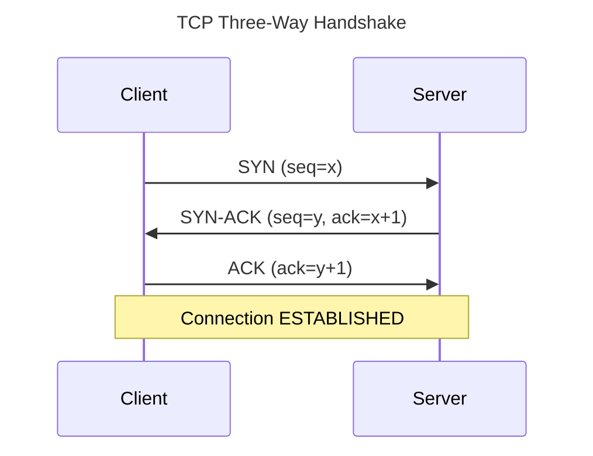
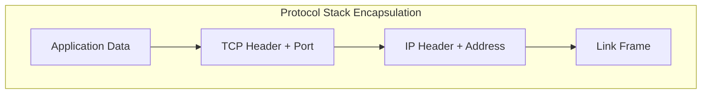
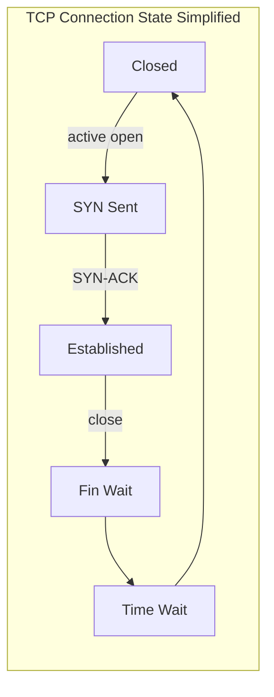

# TCP/IP Fundamentals

## 1. Executive Summary

The Internet protocol suite layers abstractions from physical links to applications. **IP** provides best-effort datagram delivery with addressing and routing. **TCP** adds reliable, ordered byte-stream delivery with flow control and congestion control atop IP. Together they underpin nearly every microservice RPC, database connection, and message queue protocol in production.

This chapter explains the TCP three-way handshake, connection teardown, sliding windows, retransmissions, DNS resolution, IPv4/IPv6 essentials, MTU and fragmentation, and how these mechanisms surface in timeouts, connection pools, and incident debugging.

**Key takeaway:** Every distributed system call over the network inherits TCP's semantics — reliability is negotiated behavior with latency and failure modes, not magic.

---

## 2. Why This Topic Matters

Principal architects must explain:

- Why do we see SYN retransmits during incidents?
- What causes `TIME_WAIT` accumulation?
- How does DNS TTL affect failover?
- Why did increasing timeout not fix intermittent errors?

Foundation for [HTTP, TLS, and QUIC](/docs/networking/http-tls-and-quic), [Kernel Networking and io_uring](/docs/operating-systems/kernel-networking-and-io-uring), and [Partial Failure](/docs/distributed-systems-foundations/partial-failure).

---

## 3. Problems Being Solved

| Problem | IP/TCP response |
|---------|-----------------|
| **Addressing** | IP addresses identify hosts |
| **Routing** | Forward datagrams hop by hop |
| **Reliability** | TCP ACKs, retransmit, ordering |
| **Flow control** | Receiver window prevents overrun |
| **Congestion control** | Sender rate adapts to network (see congestion chapter) |
| **Name resolution** | DNS maps names to addresses |

---

## 4. Assumptions and System Model

- **Best-effort IP:** Datagrams may be lost, duplicated, reordered, delayed.
- **TCP end-to-end:** Reliability between two endpoints; middleboxes may interfere (NAT, firewalls).
- **Client-server** and **peer** models both use sockets API.
- IPv4 primary in examples; IPv6 noted where dual-stack matters.

---

## 5. Essential Terminology

| Term | Definition |
|------|------------|
| **IP address** | Network-layer host identifier |
| **Port** | Transport-layer multiplexing within host |
| **Socket** | (address, port, protocol) endpoint |
| **SYN / ACK / FIN** | TCP control flags |
| **Three-way handshake** | SYN → SYN-ACK → ACK establishes connection |
| **RTT** | Round-trip time |
| **MSS** | Maximum segment size |
| **MTU** | Maximum transmission unit on link |
| **TTL** | IP time-to-live (hop limit) |
| **DNS** | Distributed naming system |
| **NAT** | Network address translation |
| **TIME_WAIT** | Post-close state ensuring delayed segments drain |

---

## 6. Core Mechanism

**TCP connection establishment:**

**IP datagram encapsulation:**

**Explanation:** Application bytes are segmented by TCP with sequence numbers. IP wraps segments in datagrams with source/destination addresses. Link layer frames traverse physical or virtual networks. Loss at any layer triggers TCP retransmission (not IP).

---

## 7. Step-by-Step Walkthrough

**Client resolves `api.example.com` and calls REST API:**

**Step 1 — DNS query.** Resolver returns A/AAAA records (possibly from cache per TTL).

**Step 2 — SYN.** Client sends SYN to server IP:443; may traverse NAT mapping ephemeral port.

**Step 3 — Handshake completes.** TLS may begin (next chapter).

**Step 4 — HTTP request** sent as TCP segments; ACKed by receiver.

**Step 5 — Response** arrives; if packet lost, TCP retransmits after RTO (retransmission timeout) — adds tail latency.

**Step 6 — Connection close.** FIN/FIN-ACK/ACK; client enters TIME_WAIT (typically 2×MSL).

---

## 8. Invariants and Guarantees

| TCP guarantee | Scope |
|---------------|-------|
| **Ordered delivery** | Byte stream to application |
| **Reliable delivery** | Eventually or connection abort |
| **No duplicates** | To application (deduped) |

**IP does not guarantee:** Delivery, ordering, or constant delay.

**Not guaranteed by TCP alone:** Sub-millisecond latency; instant failover on DNS change; immunity to middlebox interference.

---

## 9. Failure Scenarios

### Scenario 1: SYN Flood / Backlog Overflow

Attack or surge exhausts `listen` backlog; legitimate SYNs dropped.

**Mitigation:** SYN cookies, larger backlog, load balancer absorption, rate limiting.

**Explanation:** Understanding ESTABLISHED → FIN_WAIT → TIME_WAIT explains connection churn, port reuse, and drain behavior during deploys.

### Scenario 2: MTU Black Hole

ICMP "fragmentation needed" blocked; TCP hangs with repeated retransmits.

**Mitigation:** TCP MSS clamping, Path MTU Discovery tuning, end-to-end MTU awareness in VPNs.

### Scenario 3: DNS Stale After Failover

Low TTL not set; clients hit failed IP until cache expires.

**Mitigation:** Low TTL for failover records, health-checked DNS, client-side retry on alternate endpoints.

### Scenario 4: Connection Pool Exhaustion

Servers in TIME_WAIT; ephemeral ports depleted on busy clients.

**Mitigation:** Connection pooling, `SO_REUSEADDR`, tune `ip_local_port_range`, L4 LB with connection reuse.

### Extended Deep Dive: TCP Reset Conditions

**RST** sent when: port closed, firewall rejects, sequence number invalid, application abort. Client sees `Connection reset by peer`. Distinct from timeout (no response). **Half-open** connection — one side crashed without FIN — detected by keepalive or probe timeout.

### Extended Deep Dive: UDP When Architects Choose It

UDP for: DNS queries, QUIC, gaming state, metrics fire-and-forget, DHCP. Application must handle loss, ordering, duplication. **QUIC** adds reliability selectively per stream atop UDP. Do not choose UDP for "speed" alone without accepting semantic burden.

### Extended Deep Dive: Internal Service Discovery

Kubernetes **ClusterIP** DNS (`service.namespace.svc.cluster.local`) resolves to virtual IP; kube-proxy or dataplane routes to endpoints. **Headless** service returns pod IPs directly — useful for StatefulSets. DNS TTL low inside cluster — failures propagate quickly but increase query load. Architects document client retry and backoff for DNS transient failures during rollouts.

---

## 10. Performance Characteristics

Latency = handshake RTT + TLS (if any) + server processing + network RTT for data.

Throughput limited by congestion window, receiver window, and link capacity — see [Routing, Load Balancing, and Congestion](/docs/networking/routing-load-balancing-and-congestion).

Keep-alive reduces handshake amortization for HTTP/1.1.

---

## 11. Scalability Limits

- **Ephemeral ports** on client (~64K per quadruple).
- **Per-connection state** memory on servers and middleboxes.
- **NAT table** size on egress gateways.
- **Firewall connection tracking** limits.

---

## 12. Operational Considerations

Tools: `tcpdump`, Wireshark, `ss -tin`, `dig`, `mtr`, `netstat`.

Monitor: retransmit rate, SYN backlog drops, DNS resolution latency, connection count.

Runbooks: regional network partition, DNS provider outage, certificate issues (TLS chapter).

---

## 13. Security Considerations

IP spoofing enables reflection attacks; SYN floods are DoS vectors.

Unencrypted TCP exposes data and metadata — TLS required on untrusted networks.

DNS hijacking and cache poisoning mitigated by DNSSEC (where deployed) and TLS certificate validation.

---

## 14. Cost Considerations

Cross-AZ and cross-region data transfer charges dominate at scale — architecture affects TCP traffic volume (chatty protocols cost more).

Connection churn increases CPU on LBs — prefer persistent connections where safe.

---

## 15. Production Implementations

| Pattern | Usage |
|---------|-------|
| **HTTP keep-alive** | Reuse TCP for multiple requests |
| **gRPC over HTTP/2** | Multiplexed streams on one TCP |
| **Connection pools** | HikariCP, pgBouncer, Envoy upstream pools |
| **Service mesh** | mTLS, retries, outlier detection atop TCP |
| **Anycast** | Route to nearest POP by IP routing |

### Extended: DNS Record Types for Architects

**A/AAAA:** address records. **CNAME:** alias — adds lookup indirection; avoid CNAME at apex (use ALIAS/ANAME at provider). **SRV:** service location for some protocols. **TXT:** verification, SPF, DKIM. **TTL:** balance failover speed vs. query load. **Negative caching:** NXDOMAIN cached too — failed lookups persist for TTL duration.

### Extended: TCP Keepalive vs Application Heartbeat

TCP keepalive probes idle connections after `tcp_keepalive_time` — detects dead peers at OS level. Application heartbeats detect logical failures (peer alive but stuck). Align LB idle timeout > application keepalive interval > TCP keepalive to avoid half-open connections routing to dead backends.

### Extended: Path MTU Discovery

Endpoints learn path MTU via ICMP fragmentation needed messages or packetization layer (TCP MSS negotiation). Blocked ICMP causes **PMTUD black hole** — large packets dropped silently. VPN overlays reduce effective MTU — architects document MSS clamping for IPsec/WireGuard tunnels. Jumbo frames within DC do not extend to internet path.

---

## 16. Alternatives and Tradeoffs

| Protocol | Pros | Cons |
|----------|------|------|
| **TCP** | Reliable stream | Head-of-line blocking |
| **UDP** | Low overhead | App must handle loss |
| **QUIC (UDP)** | Multiplexed, encrypted | Middlebox compatibility (improved over time) |
| **RDMA** | Low latency in DC | Specialized hardware |

---

## 17. Common Misconceptions

1. **"TCP guarantees delivery instantly."** — Retransmits take time; connection may reset.

2. **"DNS change is instant."** — Bounded by TTL and resolver caches.

3. **"More bandwidth fixes latency."** — RTT and serialization delay remain.

4. **"localhost has no TCP costs."** — Still syscall and stack processing.

5. **"Close socket means peer got all data."** — Need graceful shutdown semantics.

---

## 18. Principal Architect Perspective

Articulate timeout budgets including DNS, TCP handshake, TLS, and retries. Define connection management standards for internal RPC.

Cross-region designs must account for RTT floor — physics, not configuration.

### Extended: TCP State Machine Essentials

Beyond ESTABLISHED, architects encounter **CLOSE_WAIT** (local app not closing after peer FIN — often fd leak), **FIN_WAIT_2** (waiting for peer close), and **TIME_WAIT** (local side closed connection; holds quadruple to drain delayed segments). High **TIME_WAIT** on load generators is normal; on servers may indicate short-lived client connections. Tuning `tcp_tw_reuse` (Linux) has nuanced semantics — understand before enabling fleet-wide.

### Extended: Nagle's Algorithm and Delayed ACK

Nagle coalesces small writes until outstanding data ACKed — reduces tinygram overhead but can interact badly with delayed ACK (up to typical 40ms on some stacks) causing **silly window** latency for request-response RPCs. `TCP_NODELAY` disables Nagle — common for latency-sensitive RPC; increases packet count. Measure before blanket enablement on high-throughput bulk transfers.

### Extended: IPv6 Dual-Stack Considerations

Dual-stack hosts may prefer IPv6 per Happy Eyeballs algorithm — connection attempts race v4 and v6. Misconfigured AAAA records or broken v6 paths cause fallback delays. Architects should monitor v6 success rates separately; disable v6 only as temporary mitigation with remediation plan. MTU differences (minimum 1280 for IPv6) affect tunnel and overlay designs.

### Extended: Connection Quadruple and NAT

A TCP connection is identified by (src IP, src port, dst IP, dst port). NAT rewrites source IP/port on egress, mapping to a translation table with timeout. High connection churn from microservices through single NAT gateway can exhaust table entries — symptoms resemble random connection failures. **Connection pooling** and **egress gateway scaling** address this at architecture level.

---

## 19. Architecture Review Exercise

Microservices use new TCP connection per request across 50 services in chain. Latency and LB cost grew. Propose connection architecture and DNS strategy for multi-region active-active.

---

## 20. Whiteboard Explanation

"IP delivers packets best-effort with addresses. TCP builds a reliable byte stream: three-way handshake, sequence numbers, ACKs, retransmit on loss, windows for flow control. DNS maps names to IPs with cache TTL. Failures show up as timeouts, resets, and retransmits. Design connection reuse, sane timeouts, and understand TIME_WAIT and NAT limits."

---

## Extended Walkthrough: Tracing a Failed RPC Connection

**Step 1:** Application logs `connection timed out` after 5s.

**Step 2:** DNS resolves correctly; TTL 60s.

**Step 3:** Packet capture — SYN, SYN-ACK, ACK, TLS ClientHello, no ServerHello — failure during TLS not TCP.

**Step 4:** Reclassify incident; layer discrimination via capture saves hours.

**Alternative:** SYN retransmits only — routing or firewall. RST after handshake — port closed.

---

## Extended Failure Scenario: Asymmetric Routing

Return path differs from forward path; stateful firewall drops unmatched return traffic. **Mitigation:** symmetric routing, stateful firewall on both paths. Validate bidirectional flows in network design reviews.

---

## 21. Interview Questions

1. Describe the TCP three-way handshake.

2. What is TIME_WAIT and why does it exist?

3. How does TCP detect loss and retransmit?

4. Difference between flow control and congestion control?

5. What happens when MTU is smaller than packet size?

6. Explain DNS resolution path and TTL impact.

7. NAT effects on TCP connections?

8. Why connection pools for databases?

9. SYN flood mitigation?

10. IPv4 vs IPv6 practical differences for architects?

11. How do TCP timeouts relate to application timeouts?

12. What is head-of-line blocking in TCP?

---

## 22. Interview Follow-Ups

1. **After Q2:** "How reduce TIME_WAIT on client?" — *Pooling, reuse, tune, design fewer connections.*

2. **After Q6:** "Failover with 300s TTL?" — *Slow drain; health checks + low TTL for critical records.*

3. **Principal:** "Internal mesh mTLS overhead?" — *CPU, handshake amortization, session resumption.*

---

## 23. Strong Answer Example

**Question:** "Users see intermittent API timeouts during deploys. Hypothesize network-layer causes."

**Strong answer:**

"I'd triangulate DNS, TCP, and LB layers. If deploy changes endpoints, stale DNS TTL keeps clients hitting old IPs until cache expires — correlate timeouts with TTL and resolver cache.

At TCP layer, I'd check `ss` for retransmits and SYN backlog drops on new instances coming up slower than traffic shift. Connection pool to drained instances causes waits until TCP timeout — often longer than app timeout, creating ambiguous failures per partial failure patterns.

I'd verify health checks before LB adds backends, use connection draining, keep-alive to stable endpoints, and align client idle timeouts with LB TCP idle timeout to avoid phantom connections. Packet capture on sample failures to distinguish RST vs timeout vs ICMP issues."

---

## 24. Weak Answer Example

**Weak answer:** "Must be the network team's firewall; increase timeout to 5 minutes."

**Why weak:** No systematic layers; huge timeouts mask problems and tie up resources.

---

## 25. Hands-On Exercise

Capture handshake with `tcpdump -i lo port 8080`. Measure RTT with `ping` vs TCP connect time. Simulate `iptables` drop to observe retransmits. Query DNS with `dig +trace`.

---

## 26. Knowledge Check

1. TCP provides? *(Reliable ordered byte stream.)*
2. Three-way handshake order? *(SYN, SYN-ACK, ACK.)*
3. IP guarantee? *(Best-effort delivery.)*
4. DNS TTL controls? *(Cache lifetime for records.)*
5. MSS related to? *(Maximum TCP segment payload size.)*

---

## 27. Flashcards

| Front | Back |
|-------|------|
| Three-way handshake | SYN, SYN-ACK, ACK establishes TCP connection |
| TIME_WAIT | Post-close wait for stray segments (2×MSL) |
| RTT | Round-trip time for segment and ACK |
| MTU | Maximum link-layer frame payload size |
| MSS | Max TCP segment data size per connection |
| DNS TTL | Duration resolvers cache a record |
| NAT | Rewrites addresses/ports at gateway |
| Flow control | Receiver window limits sender rate |
| Retransmission | TCP resends unACKed segments on loss/timeout |
| SYN flood | DoS filling connection queue with half-open connections |
| Ephemeral port | Client-side temporary port for outbound connections |
| Keep-alive | Reuse TCP connection for multiple transactions |

---

## 28. Cheat Sheet

**Handshake:** SYN → SYN-ACK → ACK · costs one RTT

**Debug:** retransmits · RST · SYN backlog · DNS TTL

**Reuse:** connection pools · HTTP keep-alive · fewer hops

**Timeouts:** app < TCP × retries · include DNS/TLS

**Deploy:** drain connections · health before LB weight · low TTL for failover

## Supplementary Principal Content: Timeout Budget Table

| Phase | Typical inclusion | Notes |
|-------|-------------------|-------|
| DNS | 10-50ms LAN; higher public | Cache on client/resolver |
| TCP handshake | 1× RTT | Cross-region dominates |
| TLS | 1-2× RTT | Session resumption reduces |
| HTTP server | App dependent | Largest variable |
| Retries | multiply carefully | Jitter required |

**Rule:** Client deadline ≥ sum of expected phases + margin; each hop gets sub-budget. Propagate `Deadline` or `timeout` headers in internal RPC (gRPC deadline propagation).

### TCP and Microservice Chains

Serial chain of N TCP connections multiplies handshake overhead on cold start. **Connection pools** at each hop maintain warmth. **Service mesh** adds connections — budget accordingly.

**Health check TCP vs HTTP:** TCP connect success does not imply application ready — causes black hole during deploy if readiness not aligned. Kubernetes **readiness** should exercise dependency graph minimally.

---

## 29. Related Concepts

- [HTTP, TLS, and QUIC](/docs/networking/http-tls-and-quic)
- [Routing, Load Balancing, and Congestion](/docs/networking/routing-load-balancing-and-congestion)
- [Kernel Networking and io_uring](/docs/operating-systems/kernel-networking-and-io-uring)
- [Partial Failure](/docs/distributed-systems-foundations/partial-failure)
- [API and Integration Architecture](/docs/api-and-integration-architecture/overview)

---

### Final expansion: ICMP and Network Diagnostics

**ICMP echo (ping)** tests reachability and RTT — not full path TCP health (firewalls may block ICMP but allow TCP). **Path MTU ICMP** required for PMTUD. **Destination unreachable** codes signal admin prohibited vs port unreachable — different debug actions.

**traceroute** uses TTL increment to map hops — NAT may obscure path. **mtr** combines ping over time — useful for intermittent loss investigation.

### Final expansion: TCP Fast Open and Cookie

TFO allows data in SYN after prior negotiated cookie — saves RTT on repeat connections. Security considerations: replay of SYN data — use only for idempotent early data per spec guidance. Deployment requires client, server, and middlebox support — often disabled in conservative enterprises.

## Architecture Integration Notes

Every internal client library should implement: connection pooling with max idle time; DNS caching with respect to TTL; exponential backoff retry on connect for idempotent ops; separate timeouts for connect vs read; and structured logging of remote IP/port on failure.

Multi-region designs document **RTT floor** between regions and size synchronous call chains accordingly — physics dominates. Prefer async replication and user-facing eventual consistency where business allows, per [Eventual Consistency](/docs/consistency/eventual-consistency).

Network debugging literacy is a **staff engineer skill**: teach tcpdump/wireshark basics in platform onboarding. Incidents shorten when teams distinguish SYN timeout from RST from TLS alert.

### TCP in Container Overlay Networks

VXLAN and other overlays encapsulate packets — effective MTU reduced. Without MSS clamping, TCP may send segments too large for overlay path — black hole or fragmentation issues. CNI plugins often set MSS automatically; custom networking requires explicit verification. Service mesh adds another encapsulation hop — compound MTU math in architecture reviews for multi-overlay stacks.

Understanding TCP **half-close** semantics (shutdown write with `shutdown(SHUT_WR)` while continuing read) matters for protocols that stream results then signal completion — HTTP/1.1 keep-alive reuse depends on correct connection lifecycle. Abrupt `close()` may RST buffered data. Library defaults vary; architects specify behavior for long-lived streaming APIs and gRPC bidirectional streams where application protocol maps onto TCP lifecycle.

### Closing Principal Synthesis

Foundation chapters in computer architecture, operating systems, and networking form a **single reasoning chain** for production systems. A slow API is rarely one layer's fault: DNS TTL stale after failover (networking); SYN retransmit on lossy path (TCP); TLS handshake without session resumption (HTTP/TLS); epoll thread blocked on synchronous JDBC (kernel I/O + scheduling); page fault on cold JVM heap (virtual memory); false sharing on metrics counter (cache coherence); or ambiguous timeout after partial gateway success (distributed partial failure — next domain in curriculum).

Interview answers that traverse this chain — naming the layer, the mechanism, the measurement, and the tradeoff — signal principal-level systems thinking. Answers that jump to "scale horizontally" without layer discrimination signal staff-level gaps.

Hands-on reinforcement: pick one production incident from your career (or a public postmortem) and rewrite the root cause analysis tagging each contributing factor with the chapter that explains it. Link remediation to mechanism: if coherence traffic, pad or shard; if throttling, fix cgroup quota; if DNS, fix TTL; if bufferbloat, pace bulk traffic.

This synthesis intentionally avoids invented benchmark numbers. Your fleet's constants come from profiling on your hardware, your network path, and your workload shape — the curriculum teaches **which counter to read**, not which magic millisecond threshold to memorize.

Additional study path: after completing this chapter, run the hands-on exercise, then explain the core mechanism to a colleague using only a whiteboard diagram — if you cannot draw the data flow, revisit sections 6 and 7. Principal interview loops often ask for teaching-back as signal of depth. Cross-link study with [HTTP, TLS, and QUIC](/docs/networking/http-tls-and-quic) and [Kernel Networking and io_uring](/docs/operating-systems/kernel-networking-and-io-uring) before moving to distributed systems foundations. Practice drawing the TCP state diagram and naming what triggers each transition — interviewers frequently whiteboard this before asking about production timeout tuning.

Relate TCP fundamentals to **service mesh data plane** behavior: sidecars terminate and re-origin TCP, doubling connection counts and TLS handshakes unless connection pooling and session resumption are configured end-to-end. A "simple" microservice hop adds full TCP+TLS cost — budget accordingly in chained call graphs documented during architecture review.

## 30. References

- Stevens, W. R., Fenner, B., & Rudoff, A. M. (2004). *UNIX Network Programming, Volume 1*. Addison-Wesley.
- Kurose, J. F., & Ross, K. W. *Computer Networking: A Top-Down Approach* — TCP/IP chapters.
- RFC 793 — Transmission Control Protocol (historical specification).
- RFC 791 — Internet Protocol.
- Cloud provider networking documentation — MTU and VPC routing (implementation-specific).
