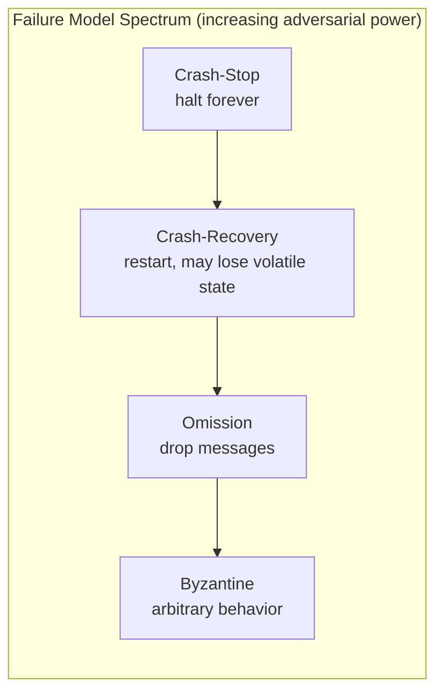
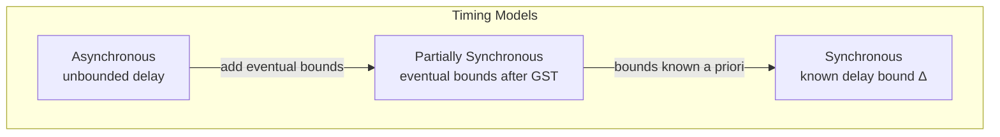
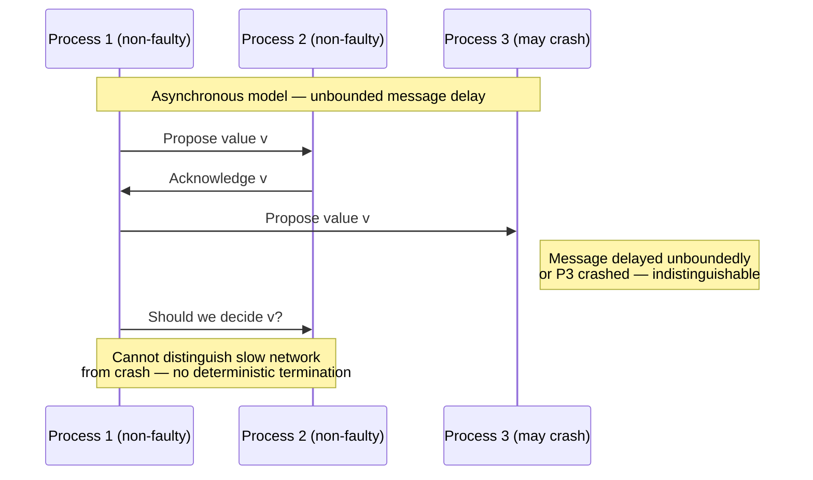

# Distributed System Models

## 1. Executive Summary

A **distributed system model** is the set of assumptions an algorithm or architecture makes about process behavior, network behavior, and timing. Every correctness argument—safety, liveness, fault tolerance—holds *only relative to a model*. Choosing the wrong model is one of the most expensive mistakes in production: you may deploy an algorithm proven correct under crash-stop assumptions into an environment with Byzantine actors, unbounded delays, or crash-recovery with lost in-memory state.

This chapter covers two orthogonal axes:

1. **Failure models** — what can go wrong with processes: crash-stop, crash-recovery, and Byzantine faults.
2. **Timing models** — what can be assumed about message delay and processing speed: asynchronous, synchronous, and partially synchronous.

Together, these models define the design space for coordination primitives (locks, leader election, consensus) and for the guarantees you can honestly claim in architecture reviews. The chapter also introduces the **FLP impossibility result**—a foundational limit in the asynchronous crash-stop model that explains why consensus algorithms in production universally rely on timeouts, leaders, or external failure detectors rather than pure asynchrony.

## 2. Why This Topic Matters

Principal architects are judged on whether they can **state assumptions explicitly** before recommending technology. Interviewers at senior levels rarely ask "What is Raft?" in isolation; they ask "Under what model does your design remain safe when the network partitions?" or "Why can't we solve consensus without a leader in an async network?"

System models matter because:

- **Correctness proofs are conditional.** A quorum write is safe under crash-stop; it is not automatically safe under Byzantine faults or arbitrary message reordering without additional mechanisms.
- **Operational tooling encodes models.** Heartbeats assume eventual synchrony. Fencing tokens assume crash-recovery with possible duplicate processes. Byzantine fault tolerance (BFT) protocols assume malicious behavior and pay a replication cost.
- **CAP and PACELC are often misapplied** when the underlying timing and failure assumptions are left implicit. Models make those assumptions legible.
- **Incident postmortems** frequently reveal a mismatch: the team assumed fail-stop, production delivered crash-recovery with stale leaders.

If you can articulate the model, you can defend tradeoffs, scope incident response, and choose algorithms that match reality rather than idealized diagrams.

## 3. Problems Being Solved

Distributed coordination must answer:

| Problem | Why the model matters |
|---------|----------------------|
| **Consensus** — agree on a single value | Impossible in pure async + crash-stop (FLP); feasible in partial synchrony or with randomization |
| **Leader election** — pick one decision-maker | Duplicate leaders appear when timing assumptions break |
| **Exactly-once processing** | Requires idempotency and deduplication when crash-recovery replays work |
| **Linearizable reads** | Depends on bounded staleness assumptions; unbounded delay breaks naive timeout logic |
| **Membership / failure detection** | "Suspected dead" is a guess under asynchrony; certainty requires sync bounds or external oracles |

Without an explicit model, teams debate symptoms (split brain, duplicate writes, stuck pipelines) instead of root cause: **the algorithm's assumptions were violated**.

## 4. Assumptions and System Model

This chapter itself assumes:

- A **message-passing** system: processes communicate by sending messages over channels; no shared memory unless explicitly introduced (e.g., via a distributed store with its own model).
- **Channels** are typically assumed **reliable** (messages are not corrupted or dropped permanently) unless stated otherwise. Unreliable channels can be modeled as processes that omit messages.
- Processes are identified and **membership** is either static or handled by a separate protocol.
- We distinguish **safety** (nothing bad happens) from **liveness** (something good eventually happens), as covered in the prerequisite chapter on [Safety and Liveness](/docs/distributed-systems-foundations/safety-and-liveness).

A complete system specification names:

1. **Process failure model** (crash-stop, crash-recovery, Byzantine)
2. **Timing model** (async, sync, partial sync)
3. **Channel assumptions** (fair loss, omission, Byzantine channels)
4. **Initial knowledge** (unique IDs, clocks, failure detectors)

Production systems are almost always **partially synchronous** with **crash-recovery** and **non-Byzantine** processes—unless you operate in adversarial environments (multi-tenant control planes, blockchain, cross-organizational consensus).

## 5. Essential Terminology

| Term | Definition |
|------|------------|
| **Crash-stop (fail-stop)** | A process runs correctly until it halts permanently; no recovery, no arbitrary behavior |
| **Crash-recovery** | A process may crash and restart; volatile state may be lost; stable storage may survive |
| **Omission fault** | A process or channel fails to send or deliver a message |
| **Byzantine fault** | A process may behave arbitrarily: lie, equivocate, or collude |
| **Asynchronous system** | No upper bound on message delay or processing time; clocks are not trustworthy for coordination |
| **Synchronous system** | Known upper bounds on message delay and step duration; timeouts are meaningful |
| **Partial synchrony** | The system is asynchronous for some period, then becomes synchronous after an unknown global stabilization time (GST) |
| **Failure detector** | A module that provides `suspect(p)` / `trust(p)` hints; must eventually be accurate in partial synchrony |
| **FLP impossibility** | No deterministic consensus in asynchronous crash-stop systems, even with one faulty process |
| **GST (Global Stabilization Time)** | Unknown time after which partial synchrony holds |

## 6. Core Mechanism

System models are not implemented as a single component—they are **contracts** that algorithms rely on. Mechanistically, production systems *approximate* models through:

- **Timeouts and leases** → partial synchrony
- **Persistent logs and epoch numbers** → crash-recovery
- **Fencing tokens / generation counters** → detect stale primary after recovery
- **Quorums** → mask crash-stop failures up to a threshold
- **Cryptographic signatures and proof-of-work** → narrow Byzantine attack surface (full BFT is a separate algorithm family)

### Failure model spectrum



**Crash-stop** is the simplest model: once a process fails, it never sends another message. Algorithms count failures and use quorums: with `n` replicas and `f` crash-stop failures, many protocols require `n ≥ 2f + 1`.

**Crash-recovery** adds complexity because a "dead" process may return with **stale state**. A recovered node is not a new process from the network's perspective—it may duplicate work unless the protocol uses epochs, ballots, or fencing.

**Byzantine** faults include malicious or buggy behavior that violates protocol rules. Classical results show that interactive consistency requires more replicas: to tolerate `f` Byzantine faults, you need `n > 3f` (equivalently `n ≥ 3f + 1` for integer counts). This is a **formal guarantee** from the Byzantine Generals Problem literature, not an implementation tuning knob.

### Timing model spectrum



**Asynchronous model:** Messages are delivered eventually if the sender retransmits forever and the receiver is eventually non-faulty. There is no shared notion of "now" for correctness—only for performance heuristics.

**Synchronous model:** If every step takes at most `φ` time and messages arrive within `Δ`, algorithms can use **round-based** progress: "If no response in `2Δ + φ`, declare failure."

**Partially synchronous model** (Chandra-Toueg): There exists unknown time GST such that after GST, all delays are bounded by Δ and all non-faulty processes take steps within φ. This matches real datacenters: periods of congestion look async; healthy periods look sync.

### FLP impossibility (preview)

The Fischer-Lynch-Paterson (FLP) result (1985) states:

> In an **asynchronous** network where processes are subject to **crash-stop** failure, there is no **deterministic** algorithm that solves **consensus** while guaranteeing both **safety** and **termination** (liveness), even for a single faulty process.

**Implications for architects:**

- Pure async + deterministic consensus does not exist; something must give: randomization, failure detectors, leaders with timeouts, or synchronous assumptions.
- Production consensus (Raft, Paxos, ZooKeeper, etcd) uses **partial synchrony in practice**: leaders, elections, and lease timeouts.
- This chapter previews FLP; the [Consensus](/docs/consensus/overview) domain develops the constructive side (Raft, Paxos, failure detectors).



The sequence illustrates the core FLP intuition: without timing bounds, a process cannot tell whether another is slow or failed, so it cannot safely commit to a decision without risking inconsistency or blocking forever.

## 7. Step-by-Step Walkthrough

**Scenario:** A three-node replicated control plane must elect a leader and agree on configuration updates.

### Step 1 — Declare the model

| Dimension | Choice | Rationale |
|-----------|--------|-----------|
| Failure | Crash-recovery | Nodes restart after OOM or host maintenance; SSD retains log |
| Timing | Partially synchronous | WAN jitter exists; healthy LAN has predictable RTT |
| Channels | Fair loss | TCP retries; not adversarial |
| Goal | Consensus on config | Requires agreement + validity + termination |

### Step 2 — Map model to mechanisms

- **Epoch / term numbers** increase on each election → stale leaders cannot commit new entries after recovery.
- **Quorum (`n ≥ 2f + 1`)** → tolerate `f` simultaneous crash-stop failures among voters.
- **Election timeout randomized** → reduces split-vote probability under partial synchrony (Raft-style).
- **Persistent log before ack** → crash-recovery safety: acknowledged writes survive restart.

### Step 3 — Identify model violations

- **GC pause longer than lease** → looks like crash; another node becomes leader → **duplicate primaries** unless fencing.
- **Disk loss on one replica** → breaks quorum safety if that replica votes with empty log → need **log consistency checks** and removal from quorum.
- **Byzantine client** forging requests → outside crash-recovery model → need authn/authz and possibly BFT if threat model requires it.

### Step 4 — State guarantees relative to model

Under crash-recovery + partial synchrony + majority quorums:

- **Safety:** Committed entries are not lost if a majority never loses persistent state.
- **Liveness:** Eventually a leader is elected if GST holds and majority is reachable—not guaranteed during extended async periods (election may stall, but safety holds).

## 8. Invariants and Guarantees

Guarantees are **always model-relative**:

| Property | Crash-stop + sync | Crash-recovery + partial sync | Byzantine + async |
|----------|-------------------|-------------------------------|-------------------|
| Agreement | Achievable with quorums | Achievable with epochs + persistent log | Requires BFT protocol (`n > 3f`) |
| Validity | Achievable | Achievable | Achievable with authenticated messages |
| Termination | Achievable in sync rounds | Achievable after GST with failure detector | Harder; randomized or partial sync |
| Linearizability | Achievable with strong leader | Achievable with lease + fencing | Costly; few production examples |

**Invariants** commonly preserved:

- **Quorum intersection:** Any two majorities overlap in at least one correct node (crash-stop).
- **Monotonic epochs:** Ballot/term numbers only increase; stale leaders cannot commit.
- **Log matching:** If two nodes have same index and term, prefixes are identical (Raft invariant).

Violating model assumptions breaks invariants without "buggy code"—the proof simply does not apply.

## 9. Failure Scenarios

### Crash-stop model

1. **Minority crash during write:** Leader accepts write, replicates to one follower, crashes before second ack. With `n=3, f=1`, quorum is 2—write not committed; system remains safe, may block until new leader.
2. **Majority crash:** Cluster cannot form quorum; **liveness** lost, **safety** preserved—no false commits.
3. **Network partition isolates leader:** Leader may continue accepting writes on minority side; without step-down logic, minority diverges—mitigated by quorum commit rule (writes not acknowledged to clients until majority).

### Crash-recovery model

1. **Zombie primary:** Node pauses (GC), lease expires, new leader elected; old leader resumes and serves stale reads/writes → **violates linearizability** unless fencing tokens or epoch checks reject stale ops.
2. **Replay after crash:** Node restarts mid-transaction, replays WAL, duplicates side effects → requires **idempotent** handlers and deduplication keys.
3. **Empty disk recovery:** Replica rejoins with wiped disk but old node ID; casts votes with outdated log → must run **data directory validation** and force full resync before voting.

### Byzantine model

1. **Equivocating leader:** Leader sends different values to different followers; crash-stop protocols may fork state → BFT protocols require evidence and `n > 3f`.
2. **Sybil-style membership:** Attacker adds fake voters → model assumes authenticated membership; violation is **operational/security**, not algorithmic alone.
3. **Malicious client amplifying writes:** Not a process fault but drives need for rate limits and signed requests; pure crash-stop quorum does not help.

### Asynchronous model

1. **Indistinguishable delay vs failure:** Failure detector cannot be both accurate and complete in pure async → protocols must not decide solely on suspicion.
2. **Unbounded reordering:** Messages arrive in unexpected order; algorithms need sequence numbers and buffered delivery.
3. **FLP-style stall:** Consensus may never terminate although no one crashed—liveness failure with safety intact.

### Synchronous model

1. **Assumed Δ too small:** False failure suspicion, unnecessary failover, flapping leadership.
2. **Clock skew breaking timeout math:** Nodes disagree on lease expiry → duplicate leaders if wall clocks trusted incorrectly.
3. **Step bound violated under load:** Backpressure causes processing > φ; synchronous round structure breaks.

### Partially synchronous model

1. **Extended async period before GST:** Elections retry; client timeouts fire; operators see "cluster unhealthy" though safety holds.
2. **Asymmetric partitions:** One side has majority, other minority; minority must not serve committed writes—correct implementations return errors.
3. **Slow follower after GST:** Leader cannot commit until majority ack; lagging replica does not break safety but affects durability visibility.

## 10. Performance Characteristics

Models affect **performance mechanisms**, not raw throughput numbers (which are workload- and hardware-specific):

| Model choice | Typical performance impact |
|--------------|---------------------------|
| Crash-stop vs recovery | Recovery paths add log replay, catch-up, anti-entropy |
| Sync assumptions | Aggressive timeouts → faster failover, more false positives |
| Async assumptions | More buffering, longer client-visible latency before declaring failure |
| Byzantine | Additional message rounds and signatures; higher replication factor |

**Design guidance:** Prefer the **weakest model that matches your threat environment**. Crash-recovery + partial sync captures most internal microservices; adding Byzantine tolerance multiplies coordination cost.

## 11. Scalability Limits

- **Quorum size:** Larger `n` tolerates more failures but increases replication fan-out per write.
- **Byzantine threshold:** `n > 3f` is a hard lower bound for classical BFT agreement—not a tunable "performance knob."
- **Leader-based protocols:** Leader becomes hotspot; partition tolerance trades off write locality.
- **Failure detector gossip:** Membership at scale (thousands of nodes) usually shards into smaller consensus groups (cell-based, multi-Paxos) because single-group consensus does not scale linearly with uniform membership.

## 12. Operational Considerations

- **Document the assumed model** in architecture decision records (ADRs): failure types, timing, quorum math.
- **Tune timeouts from measured RTT distributions**, not defaults—partial synchrony is an operational hypothesis.
- **Run chaos tests** that violate crash-stop (kill -9, disk full, long pauses) to exercise crash-recovery paths.
- **Monitor epoch/term inflation** and leader churn—symptoms of timing model stress.
- **Bootstrap and replace nodes** with explicit join protocols; ad-hoc cloning breaks log-matching invariants.

## 13. Security Considerations

- **Crash-stop ≠ secure:** A compromised node is Byzantine, not crashed—TLS and authn do not restore crash-stop semantics if the process is malicious.
- **Byzantine threat model** requires authenticated channels, often signed messages, and sometimes hardware roots of trust.
- **Timing attacks:** Adversary induces delay to manipulate failure detectors—relevant in multi-tenant networks.
- **Model elevation:** Treat external inputs as untrusted; internal RPC may be crash-recovery while edge is adversarial.

## 14. Cost Considerations

- **Replication factor:** `3` for crash-stop quorums vs `4+` for Byzantine tolerance in classical formulations—direct infra cost.
- **Operational toil:** False leader elections from aggressive timeouts increase incident volume and engineer time.
- **BFT in cloud:** Rare except blockchain and high-assurance control planes; cost often pushes teams toward trusted environments + crash-recovery instead.

## 15. Production Implementations

| System | Dominant model (simplified) | Notes |
|--------|----------------------------|-------|
| **etcd / ZooKeeper / Consul** | Crash-recovery, partial sync, leader-based quorum | Epochs/terms, session timeouts |
| **Kafka (KRaft)** | Crash-recovery, quorum metadata | Controller quorum separate from partition leadership |
| **Spanner / TrueTime** | Crash-recovery + **bounded** clock uncertainty | Uses time synchrony as additional assumption |
| **PBFT / Tendermint** | Byzantine + partial sync | Higher `n`, crypto overhead |
| **Dynamo-style stores** | Crash-stop omission, eventual sync via hinted handoff | Availability bias; conflict resolution explicit |

Implementations often **layer models**: TCP gives reliable channels; app layer adds crash-recovery; business layer may assume Byzantine clients at the API edge.

## 16. Alternatives and Tradeoffs

| If you need… | Consider… | Tradeoff |
|--------------|-----------|----------|
| Simplicity | Crash-stop + sync assumptions in design docs | Misleading if recovery happens |
| Realistic infra | Crash-recovery + partial sync | Fencing, idempotency required |
| Adversarial tenants | BFT or trusted hardware enclaves | Cost, complexity, latency |
| Availability over consistency | AP systems under partition | Explicit weak consistency model |
| No leader | Async-compatible structures (CRDTs, eventual consistency) | Weaker semantics than consensus |

**CAP note:** Under network partition, crash-stop models still force a consistency/availability tradeoff for linearizable operations—the model does not remove the tradeoff, it clarifies which failures count.

## 17. Common Misconceptions

1. **"We use Raft, so we are safe."** Raft assumes crash-recovery and partial synchrony; zombie primaries and disk loss are out-of-model failures if not handled operationally.
2. **"Async means we don't use timeouts."** Production async *algorithms* still use timeouts for liveness; they cannot use them as sole *correctness* basis in pure async (FLP).
3. **"Byzantine = any bug."** Informally yes; formally Byzantine is arbitrary behavior. Benign bugs often look like crash-stop or omission.
4. **"Sync clocks fix distributed ordering."** Clock sync is an additional assumption (see Time and Ordering); it does not replace logical ordering for correctness.
5. **"More replicas always help."** Without matching failure model math, extra replicas can increase split-brain risk if misconfigured.

## 18. Principal Architect Perspective

At principal level, the question is not naming models—it is **governing assumptions across teams**:

- **Align threat model with business risk:** Internal batch pipeline vs cross-bank settlement implies different failure models.
- **Make models visible in reviews:** Ask "What happens when this node recovers with a stale lease?" in every HA design.
- **Prevent implicit sync:** Organizations that punish downtime often incentivize aggressive failover, which only works if partial synchrony holds most of the time—document that bet.
- **Educate incident commanders:** During partitions, "no leader" may be **safe** liveness loss, not data loss—model literacy reduces harmful manual overrides.

## 19. Architecture Review Exercise

**System:** Multi-region active-active inventory service with async replication between regions.

**Review prompts:**

1. What failure model applies to regional leaders? Crash-recovery or crash-stop?
2. Is the cross-region link modeled as fair-loss or Byzantine? Should it be?
3. During partition, can two regions sell the last unit? Which invariant breaks—safety or liveness?
4. What fencing or version mechanism prevents stale regional primary writes?
5. Does the chosen consistency model require sync bounds across regions? If not, what user-visible anomalies are acceptable?

**Deliverable:** One-page ADR stating process model, timing model, channel assumptions, and explicit CAP/PACELC positioning.

## 20. Whiteboard Explanation

**Draw two axes:**

```
        Timing →
        Async    Partial-Sync    Sync
Failure
Crash-Stop     [FLP no-go]     [Raft/Paxos]    [Classic sync rounds]
Crash-Recovery [stall risk]    [etcd/ZK]       [lease + fence]
Byzantine      [very hard]     [PBFT]          [rare]
```

**Narration script (90 seconds):** "Every distributed algorithm is a proof under assumptions. We run in crash-recovery with partial synchrony: nodes restart, networks jitter, but eventually stabilize. That's why we use terms, quorums, and leases. Pure async can't deterministically consensus—FLP—so we don't pretend timeouts prove correctness; they drive liveness after we stabilize. If you need Byzantine tolerance, replica count and protocol complexity jump; most SaaS doesn't need it unless the threat model says so."

## 21. Interview Questions

1. **Define crash-stop vs crash-recovery. How does recovery change leader election?**
   - *Signals:* volatile vs stable state; zombie primary; epochs/fencing.

2. **What is partial synchrony? How does it differ from "we use timeouts"?**
   - *Signals:* GST; timeouts for liveness not safety in FLP sense.

3. **State the FLP impossibility result and one practical consequence.**
   - *Signals:* async + crash-stop; no deterministic consensus; leaders/failure detectors.

4. **How many replicas to tolerate `f` Byzantine faults in classical agreement?**
   - *Signals:* `n > 3f`; not `2f+1`.

5. **Why can a quorum intersection argument fail after crash-recovery?**
   - *Signals:* same node ID, empty disk, duplicate voting without log catch-up.

6. **A client sees duplicate writes after failover. Which model mismatch is likely?**
   - *Signals:* crash-recovery without idempotency; lease without fencing.

7. **Is CAP a theorem about every distributed system?**
   - *Signals:* partition + linearizability vs availability; model-dependent definitions.

8. **When would you choose BFT over crash-stop replication?**
   - *Signals:* adversarial participants, regulatory multi-party, blockchain; cost tradeoff.

9. **Explain fair-loss channels vs Byzantine channels.**
   - *Signals:* eventual delivery with retransmit; malicious alteration.

10. **How do failure detectors relate to system models?**
    - *Signals:* ◇P in partial sync; completeness vs accuracy; Chandra-Toueg.

11. **Design a heartbeat system: what model do heartbeats assume?**
    - *Signals:* eventual synchrony; false positives; not correctness proof alone.

12. **What happens to Raft safety if a majority of nodes permanently lose disks?**
    - *Signals:* safety may be violated if empty nodes vote; operational safeguards.

## 22. Interview Follow-Ups

1. **If FLP blocks deterministic consensus in async, how does randomized consensus work?** — Explore Ben-Or / Rabin-style protocols; termination with probability 1.

2. **Can Spanner's TrueTime be modeled as a synchronous system?** — Bounded uncertainty intervals; external clock assumption; not pure logical sync.

3. **How would you test that your system matches crash-recovery assumptions?** — Chaos: kill -9, partition, fill disk, long STW GC; verify no split brain.

4. **Does etcd violate FLP?** — No: it uses partial synchrony and randomized election timeouts; not pure async correctness proof.

5. **When is `n = 2f + 1` insufficient for Byzantine faults?** — Construct scenario with `f` Byzantine nodes equivocating; need `3f+1`.

6. **How do PACELC and system models interact?** — Partition behavior (ELC) plus normal-case latency/consistency; models clarify "else" conditions.

## 23. Strong Answer Example

**Question:** "Why can't we build consensus without a leader in an asynchronous network?"

**Strong answer outline:**

"Consensus requires agreement, validity, and termination. Fischer-Lynch-Paterson showed that in a fully asynchronous message-passing system, even one crash-stop failure makes deterministic consensus impossible—you cannot tell a crashed process from a very slow one, so any algorithm that might terminate could violate agreement, and any algorithm that always preserves agreement might never terminate. Production systems therefore adopt partial synchrony: we use leaders, election timeouts, and failure detectors to obtain liveness after the system stabilizes, while quorums and persistent logs preserve safety across crash-recovery. If we removed the leader, we'd need either randomized protocols with probabilistic termination or stronger timing assumptions. For our internal control plane, partial sync with Raft is the right match; for a public blockchain with adversarial miners, we'd need a different failure and timing model entirely."

## 24. Weak Answer Example

**Weak answer:** "We need a leader because it's faster, and FLP says consensus is impossible."

**Red flags:** No mention of crash-stop vs recovery; conflates performance with impossibility; no partial synchrony; no safety vs liveness distinction; sounds memorized without model vocabulary.

## 25. Hands-On Exercise

**Lab: Model mismatch simulation**

1. Deploy a 3-node Raft cluster (e.g., etcd or a Raft simulator).
2. **Crash-stop test:** Stop one follower permanently; verify writes commit with majority.
3. **Crash-recovery test:** `kill -9` leader mid-write; restart; measure whether duplicate or lost client writes occur without idempotency tokens.
4. **Async stress:** Introduce `tc netem` delay/jitter exceeding election timeout; observe leader flapping and client errors—document as liveness, not safety, failure.
5. **Write ADR:** State the model each test validated or violated.

**Success criteria:** Written explanation of at least one scenario where safety held but liveness failed, and one where operational mitigation (fencing/idempotency) was required for crash-recovery.

## 26. Knowledge Check

1. Name the three classical failure models discussed in this chapter.
2. What does GST mean in partial synchrony?
3. Why is `n > 3f` required for Byzantine agreement (high level)?
4. Can a failure detector be perfectly accurate in a purely asynchronous system? Why?
5. What property does FLP preserve while blocking termination?
6. How does crash-recovery differ from crash-stop for quorum voting?
7. Give one production symptom of partial synchrony violation.
8. Why are heartbeats insufficient as a sole correctness mechanism in async models?

## 27. Flashcards

| Front | Back |
|-------|------|
| Crash-stop | Process halts permanently; no recovery |
| Crash-recovery | Process restarts; volatile state may be lost |
| Byzantine fault | Arbitrary/process malicious behavior |
| Asynchronous system | No bound on message delay or processing speed |
| Partial synchrony | Eventually bounded delay after unknown GST |
| Synchronous system | Known bounds Δ, φ used by algorithm |
| FLP (1985) | No deterministic async crash-stop consensus |
| Quorum for crash-stop | Typically `n ≥ 2f + 1` |
| Byzantine replica bound | `n > 3f` for classical agreement |
| Failure detector ◇P | Eventually accurate suspicion after GST |
| Safety vs liveness (FLP) | FLP: safety possible; deterministic termination not |
| Fencing token purpose | Reject stale primary after recovery |

## 28. Cheat Sheet

```
FAILURE MODELS
  crash-stop     → halted forever
  crash-recovery → restart + stable storage
  Byzantine      → arbitrary; need n > 3f

TIMING MODELS
  async          → unbounded delay; FLP blocks det. consensus
  partial sync   → bounded after GST; production default
  sync           → known Δ, φ; enables round-based FD

PRODUCTION PATTERN
  quorum + persistent log + epochs + timeouts

NEVER CLAIM
  "proven safe" without stating the model
```

## 29. Related Concepts

- [Safety and Liveness](/docs/distributed-systems-foundations/safety-and-liveness) — prerequisite properties every model must specify separately
- [Partial Failure](/docs/distributed-systems-foundations/partial-failure) — why models exist in practice
- [Consensus](/docs/consensus/overview) — constructive algorithms after FLP
- [Replication](/docs/replication/overview) — quorum replication under crash-stop assumptions
- [Time, Ordering, and Coordination](/docs/time-ordering-and-coordination/overview) — clocks and ordering beyond timing models
- [Consistency](/docs/consistency/overview) — client-visible guarantees layered on failure/timing models

## 30. References

### Primary sources (formal guarantees)

- Fischer, M. J., Lynch, N. A., & Paterson, M. S. (1985). *Impossibility of Distributed Consensus with One Faulty Process.* Journal of the ACM. [FLP impossibility]
- Lamport, L., Shostak, R., & Pease, M. (1982). *The Byzantine Generals Problem.* ACM Transactions on Programming Languages and Systems. [`n > 3f` requirement]
- Chandra, T. D., & Toueg, S. (1996). *Unreliable Failure Detectors for Reliable Distributed Systems.* Journal of the ACM. [Partial synchrony and ◇P]
- Dwork, C., Lynch, N., & Stockmeyer, L. (1988). *Consensus in the Presence of Partial Synchrony.* Journal of the ACM. [GST formalization]

### Books (synthesis)

- Lynch, N. A. (1996). *Distributed Algorithms.* Morgan Kaufmann. [System models and proofs]
- Herlihy, M. P., & Wing, A. V. (1990). *Linearizability: A Correctness Condition for Concurrent Objects.* ACM Transactions on Programming Languages and Systems. [Safety-style object guarantees]
- Kleppmann, M. (2017). *Designing Data-Intensive Applications.* O'Reilly. [Chapters on replication, consistency, and fault tolerance—implementation-oriented]

### Implementation-oriented (engineering practice)

- Ongaro, D., & Ousterhout, J. (2014). *In Search of an Understandable Consensus Algorithm (Extended Version).* [Raft: crash-recovery + partial sync in practice]
- etcd documentation: Raft implementation and operational guidance — https://etcd.io/docs/
- Google Spanner paper: Corbett et al. (2012). *Spanner: Google's Globally-Distributed Database.* [External time synchrony as additional assumption]

### Distinction

- **Formal guarantees** (FLP, Byzantine bound, ◇P) come from peer-reviewed papers.
- **Implementation choices** (Raft election timeouts, etcd tuning) reflect operational practice under partial synchrony, not proofs in the pure async model.
- **Operational experience** (zombie primaries, GC pauses) illustrates crash-recovery model violations; document as anecdotal unless measured in your environment.
