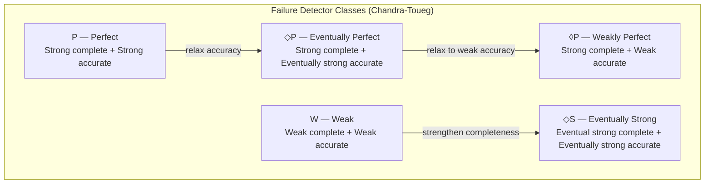
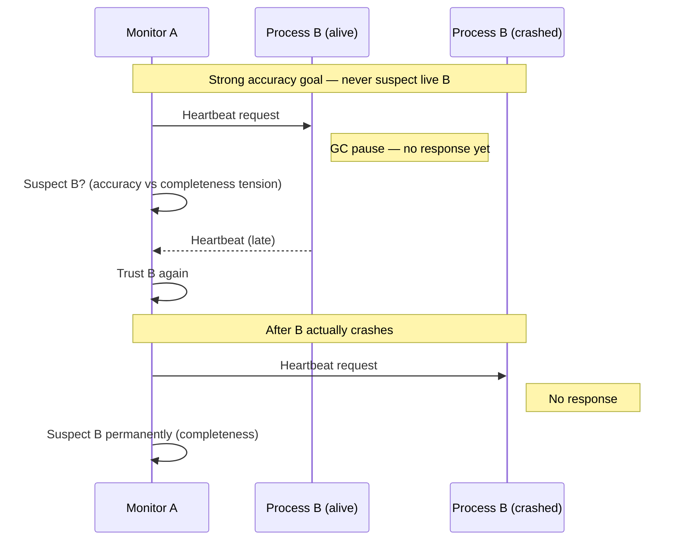
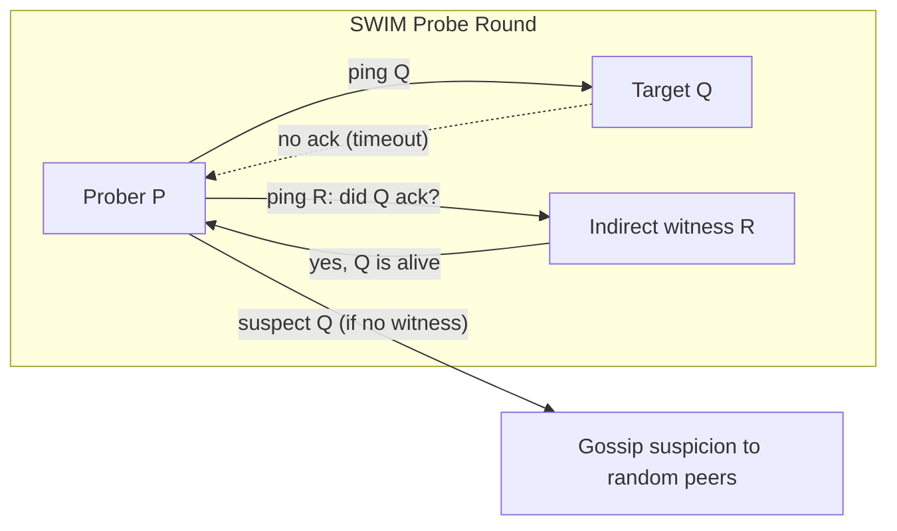

# Failure Detectors

## 1. Executive Summary

A **failure detector** is an oracle that outputs **suspicion** about whether remote processes have crashed. In a distributed system, no observer can know with certainty whether a silent peer is failed or merely slow—the fundamental indistinguishability that underlies the FLP impossibility result. Failure detectors make that uncertainty explicit: they trade **completeness** (eventually suspecting every crashed process) against **accuracy** (never suspecting correct processes, or doing so only temporarily).

Chandra and Toueg (1996) showed that unreliable failure detectors are sufficient to solve consensus in a **partially synchronous** system, and they classified detectors by how strongly they satisfy completeness and accuracy. The **eventually perfect failure detector** (denoted **◇P**) is the workhorse abstraction behind leader election, membership services, and partition handling in production systems.

This chapter covers the formal taxonomy (perfect vs imperfect detectors), practical mechanisms (heartbeats, **phi accrual**, gossip-based protocols like SWIM), and the operational reality that failure detection is always a **heuristic** tuned to workload and network behavior—not a ground-truth measurement of process health.

## 2. Why This Topic Matters

Every high-availability architecture depends on answering: *Is this node still alive?* Load balancers health-check backends. Kubernetes restarts unresponsive pods. etcd triggers leader election when the current leader stops heartbeating. Cassandra removes a replica from the read path when phi accrual crosses a threshold. Serf propagates failure suspicion across a cluster via gossip.

Principal architects are evaluated on whether they understand that **"dead" is a local decision under uncertainty**, not a global fact. Interviewers probe:

- Why false positives cause split brain and unnecessary failover
- Why false negatives delay recovery and extend outage windows
- How timing assumptions (partial synchrony) make failure detectors useful for **liveness** without being sufficient alone for **safety**
- When to choose fixed timeouts vs adaptive phi accrual vs epidemic gossip

Teams that treat heartbeats as infallible truth routinely ship incidents: GC pauses trigger elections, asymmetric partitions cause cascading removals, and aggressive suspicion settings amplify load during degradation. Failure detector literacy separates architects who design resilient coordination from those who copy default timeouts.

## 3. Problems Being Solved

| Problem | Role of failure detection |
|---------|---------------------------|
| **Leader election** | Suspect current leader → trigger election (Raft, ZooKeeper) |
| **Membership** | Maintain authoritative set of live nodes (cluster join/leave) |
| **Load balancing** | Remove unhealthy backends from rotation |
| **Replication** | Stop sending writes to lagging or unreachable replicas |
| **Distributed locking / leases** | Expire locks when holder is suspected dead |
| **Cascading failure containment** | Circuit-break when dependencies are unresponsive |

Without a failure detector (explicit or implicit), systems either **block forever** waiting for silent peers (liveness failure) or **act on stale membership** (safety risk if the "dead" node is actually alive).

## 4. Assumptions and System Model

This chapter assumes the **message-passing** model from [Distributed System Models](/docs/distributed-systems-foundations/distributed-system-models):

- **Process failures:** Primarily **crash-stop** or **crash-recovery**; Byzantine failure detection is a separate, harder problem.
- **Channels:** Typically **fair loss** (messages may be dropped but retransmission eventually succeeds if both endpoints are correct and sending continues).
- **Timing:** Failure detectors are meaningful in **partially synchronous** systems—after unknown global stabilization time (GST), delays are bounded. In pure asynchrony, no failure detector can be both complete and accurate forever.
- **Local outputs:** Each process runs a **local** failure detector module; outputs are not globally consistent in real time.

A failure detector does **not** replace quorums, epochs, or fencing for safety. It provides **hints** that drive liveness mechanisms. Correctness proofs state which detector class (e.g., ◇P) is required.

## 5. Essential Terminology

| Term | Definition |
|------|------------|
| **Suspect / trust** | Local state: process `p` is suspected crashed or trusted alive |
| **Perfect failure detector (P)** | Strong completeness + strong accuracy: eventually every crashed process is permanently suspected by every correct process, and no correct process is ever suspected |
| **Imperfect failure detector** | Violates strong completeness and/or strong accuracy |
| **◇P (eventually perfect)** | Strong completeness + **eventual** strong accuracy: after some time, correct processes are never suspected |
| **◊P (weakly perfect)** | Strong completeness + weak accuracy |
| **Strong completeness** | Eventually, every crashed process is permanently suspected by **every** correct process |
| **Weak completeness** | Eventually, every crashed process is suspected by **some** correct process |
| **Strong accuracy** | No correct process is **ever** suspected |
| **Weak accuracy** | Eventually, **some** correct process is never suspected |
| **Heartbeat** | Periodic message indicating a process is alive |
| **Phi (φ) accrual** | Adaptive suspicion score based on heartbeat inter-arrival statistics |
| **Gossip / epidemic protocol** | Peers periodically exchange membership and suspicion state; information spreads in O(log N) rounds |
| **SWIM** | Scalable Weakly-consistent Infection-style Membership protocol (used by Serf, Consul) |
| **False positive** | Suspecting a live (correct) process—accuracy violation |
| **False negative** | Failing to suspect a crashed process—completeness violation |

## 6. Core Mechanism

### 6.1 Chandra-Toueg taxonomy

Chandra and Toueg formalized failure detectors as modules with histories mapping time to suspicion sets. The key insight: **different algorithms require different detector strengths**, and in asynchronous systems some combinations are impossible.



**Perfect (P):** Idealized; requires synchronous bounds. Every crash is detected immediately and permanently; no false alarms.

**Eventually perfect (◇P):** The practical sweet spot for consensus transforms. After GST, crashes are detected and false suspicions cease. Before GST, arbitrary inaccuracy is allowed—algorithms must remain **safe** despite bad hints.

**Impossible in pure async:** No failure detector can achieve strong completeness and strong accuracy simultaneously in a fully asynchronous system (Chandra-Toueg). This parallels FLP: you cannot distinguish crash from unbounded delay.

### 6.2 Completeness vs accuracy tradeoff



| Tuning direction | Effect | Risk |
|------------------|--------|------|
| Shorter timeout | Faster crash detection (better completeness) | More false positives (worse accuracy) |
| Longer timeout | Fewer false positives | Slower failure detection; longer outage |
| Adaptive (phi) | Adjusts to observed jitter | Misconfigured distribution assumptions |
| Gossip + indirect probe | Reduces false positives on asymmetric paths | More protocol complexity |

**Safety vs liveness:** False positives threaten **safety** when suspicion triggers exclusive actions (new leader, lock steal) without fencing. False negatives threaten **liveness** (cluster appears healthy while quorum is lost). Production systems combine detection with **quorums, terms, and fencing** so suspicion alone cannot corrupt state.

### 6.3 Heartbeat-based detection

The simplest mechanism: process `B` sends heartbeats every `T` milliseconds; monitor `A` suspects `B` if no heartbeat arrives within `T × k` for multiplier `k`.

**Mechanism:**
1. `B` runs a timer; on fire, send heartbeat to monitors (or to leader).
2. `A` resets a deadline on each received heartbeat.
3. Deadline expiry → add `B` to suspected set; notify upper layer (election, membership).

**Assumptions:** Partial synchrony after GST; heartbeat path is representative of general reachability (often false under asymmetric partitions).

**Used in:** Raft (AppendEntries as implicit heartbeat), ZooKeeper (session timeouts), generic TCP keepalives (weak semantics).

### 6.4 Phi accrual failure detector

Hayashibara et al. (2004) proposed the **φ accrual failure detector** to avoid fixed timeouts that are either too aggressive (false positives) or too conservative (slow detection).

**Mechanism:**
1. Record inter-arrival times `t₁, t₂, …` between heartbeats from `B`.
2. Maintain a sliding window; estimate mean `μ` and variance `σ` of inter-arrival times (often assuming normal or exponential distribution).
3. On each check at time `now`, compute `φ = −log₁₀ P(last heartbeat arrived this late | B is alive)`.
4. If `φ ≥ φ_threshold` (commonly 8–12), suspect `B`.

**Intuition:** φ measures how many standard deviations "late" the current silence is. A quiet period after historically jittery heartbeats raises φ slowly; silence after very regular heartbeats raises φ quickly.

**Advantages:** Self-tuning to network conditions; graceful degradation under load (if heartbeats slow legitimately, distribution shifts).

**Caveats:** Assumes heartbeat arrival process is statistically stable; sudden traffic shifts or coordinated pauses can fool the estimator. Still a **hint**, not proof of crash.

### 6.5 Gossip-based detection (SWIM)

At scale, all-to-all heartbeats are O(N²). **SWIM** (Das et al.; popularized via HashiCorp Serf and Consul) uses epidemic dissemination:



**Mechanism:**
1. Each protocol period, `P` selects random member `Q` to probe (ping).
2. If `Q` acks → `Q` is alive.
3. If no ack → **indirect probes**: ask `k` random peers whether they recently heard from `Q`.
4. If no witness → move `Q` to **suspected** state; gossip suspicion to `β` random nodes per round.
5. Suspicion is **refutable**: if `Q` responds before `confirm_timeout`, remove suspicion.
6. After `confirm_timeout`, disseminate **dead** status.

**Properties:** Probabilistic accuracy; configurable false-positive rate; O(log N) propagation latency for membership changes. **Weakly consistent** membership—different nodes may briefly disagree on who is alive.

**Tradeoff:** Better scalability than heartbeats to all peers; membership is eventually consistent, not instantaneously global.

## 7. Step-by-Step Walkthrough

**Scenario:** Five-node Cassandra cluster; one node (`N3`) experiences a long GC pause.

### Step 1 — Baseline phi accrual

| Parameter | Value |
|-----------|-------|
| Heartbeat interval | ~1 s (gossip-driven) |
| φ threshold | 8 |
| Window size | Last 1000 intervals |

`N1` records `N3` heartbeats arriving every ~950–1050 ms. Distribution: μ ≈ 1 s, σ small. φ stays near 0.

### Step 2 — GC pause on N3

`N3` stops responding for 4 s. `N1` computes φ from tail probability of silence → φ crosses 8 at ~2.5–3 s (environment-dependent). `N1` marks `N3` as **down** for read/write routing.

### Step 3 — False positive window

`N3` resumes; gossips alive. Peers remove `N3` from suspicion. Brief period where some nodes excluded `N3` from queries—**availability blip**, not data loss (quorum writes still require other replicas).

### Step 4 — Contrast with fixed timeout

If timeout were 2 s fixed, healthy `N3` under minor jitter might flap. If timeout were 10 s, real crash detection would lag. Phi accrual adapted until the pause; fixed timeout would require manual per-environment tuning.

### Step 5 — Architect decision

Document: failure detection drives **routing and repair**, not sole authority for consistency. Writes still require `QUORUM`; hinted handoff handles temporary suspicion.

## 8. Invariants and Guarantees

Failure detectors provide **no data safety invariants by themselves**. Guarantees are relative to detector class and how upper layers use suspicion:

| Detector class | Guarantee (informal) | Required for |
|----------------|---------------------|--------------|
| **P** | Immediate, permanent, accurate suspicion | Synchronous algorithms |
| **◇P** | Eventually accurate + complete strong suspicion | Chandra-Toueg consensus transform |
| **◊P** | Complete but only weak accuracy | Some leader election variants |
| **W** | Weakest; both weak complete and weak accurate | Best-effort membership |

**Algorithmic pattern (consensus with ◇P):**
- **Safety:** Preserved even if detector lies arbitrarily early on—quorum intersection, ballot monotonicity.
- **Liveness:** After GST and ◇P properties hold, crashed leader is suspected → election proceeds.

**Operational invariants to enforce separately:**
- **Fencing:** Stale primary cannot write after suspicion clears elsewhere.
- **Quorum:** Commit requires majority acknowledgment, not merely leader aliveness.
- **Generation epochs:** Monotonic term numbers invalidate pre-crash leaders.

## 9. Failure Scenarios

### False positive (live node suspected)

1. **Long GC pause:** Node alive but not responding → duplicate leadership if leases expire without fencing.
2. **Asymmetric partition:** Monitor can reach node, but node cannot reach monitor—one-sided suspicion.
3. **Overload:** Heartbeat thread starved; node marked dead under load → thundering herd on remaining nodes.

### False negative (crashed node not suspected)

1. **Zombie TCP connection:** Half-open connection; heartbeats appear fine locally while peer is gone.
2. **Slow crash:** Process hung but occasionally emits heartbeat from watchdog thread.
3. **Gossip delay:** SWIM suspicion not yet propagated; clients still route to dead node.

### Phi accrual-specific

1. **Bimodal latency:** Sudden shift (e.g., cross-AZ routing change) invalidates historical μ, σ → mis-suspicion until window adapts.
2. **Coordinated omission:** Heartbeats prioritized over data plane; node "alive" but unable to serve.

### Gossip-specific

1. **Split membership views:** Partition A and B each believe different dead sets → overlapping writes without CRDT/consensus.
2. **Suspicion storms:** Mass simultaneous suspicion during network event → metastable failure.

### Chandra-Toueg / consensus interaction

1. **Pre-GST arbitrary suspicion:** Algorithm must not commit conflicting values due to premature leader replacement—epochs prevent this.
2. **◇P violation over long async period:** Elections stall; **safety holds**, cluster appears "stuck."

## 10. Performance Characteristics

| Mechanism | Message complexity | Detection latency | False positive sensitivity |
|-----------|-------------------|-------------------|---------------------------|
| All-to-all heartbeats | O(N²) per interval | ~k × T | High if k small |
| Central monitor | O(N) | ~k × T | Single point of bias |
| Phi accrual (pairwise) | O(N) with gossip | Adaptive | Lower under jitter |
| SWIM | O(1) probes per node per round | O(log N) rounds to spread | Tunable via indirect probes |

**Latency:** Detection time is lower-bounded by network RTT and chosen thresholds—not by algorithm elegance. Cross-region clusters inherently have slower detection or higher false positives.

**CPU:** Phi accrual adds statistical computation negligible vs network I/O. Gossip adds constant-factor overhead independent of N per node for SWIM-style probing.

## 11. Scalability Limits

- **Full mesh heartbeats** do not scale past tens of nodes; shard into smaller gossip domains or hierarchical aggregation.
- **SWIM** scales to thousands per gossip pool; Consul and Serf document practical limits per LAN segment.
- **False positive rate × N** drives cascading load—at large N, even 0.1% false positive per minute creates steady churn.
- **WAN gossip** amplifies latency variance; separate failure domains per region with explicit federation.

## 12. Operational Considerations

- **Measure RTT percentiles** (p50, p99, p999) before setting timeouts or phi thresholds.
- **Correlate suspicion events** with GC logs, CPU throttling, and network metrics—not just "node bad."
- **Use grace periods** for refutation (SWIM) or delayed removal from service discovery.
- **Avoid coupling detection to destructive actions** without manual confirmation for irreversible steps (data deletion).
- **Document asymmetric partition behavior** in runbooks: who suspects whom, and what clients see.
- **Chaos test:** inject latency, packet loss, and stop-the-world GC; count false positives vs detection time.

## 13. Security Considerations

- **Heartbeat forgery:** Without authentication, a malicious process can emit fake heartbeats for others—use mutual TLS and signed membership messages.
- **Denial of service:** Flooding suspicion gossip can cause mass evictions—rate-limit membership updates.
- **Manipulating detection:** Adversary induces delay to force false suspicion and trigger elections (leader churn attack)—relevant in multi-tenant networks.
- **Byzantine nodes:** Classical failure detectors assume crash-stop; Byzantine actors may equivocate about peer liveness—requires BFT membership protocols.

## 14. Cost Considerations

- **False positive cost:** Unnecessary failover, data re-replication, client errors, on-call pages—often exceeds hardware cost of an extra replica.
- **False negative cost:** Extended outage window, SLA breach, manual intervention.
- **Gossip overhead:** Bandwidth per node is modest but non-zero; cross-AZ gossip charges apply in cloud billing.
- **Engineering time:** Tuning detection across environments is recurring toil; adaptive methods reduce but do not eliminate tuning.

## 15. Production Implementations

| System | Detection approach | Notes |
|--------|-------------------|-------|
| **Apache Cassandra** | Phi accrual (AccrualFailureDetector) | φ threshold configurable; gossip disseminates state |
| **Akka / Akka Cluster** | Phi accrual failure detector | `akka.cluster.failure-detector` settings |
| **HashiCorp Serf / Consul** | SWIM with suspicion | `probe_interval`, `suspicion_mult`, indirect checks |
| **etcd / Raft** | Lease + heartbeat (AppendEntries) | Session TTL; leader liveness implicit |
| **ZooKeeper** | Session timeout | Client heartbeats to server; server timeout |
| **Kubernetes** | kubelet probes + node controller | Multiple probe types; not phi accrual by default |
| **AWS ELB / ALB** | Health checks | External passive detection; independent of cluster gossip |
| **Hazelcast** | Heartbeat + suspicion | Cluster membership similar to gossip patterns |

Implementations rarely expose Chandra-Toueg class names, but **◇P-like behavior** (eventual accuracy after stabilization) is the operational target.

## 16. Alternatives and Tradeoffs

| Approach | When to use | Tradeoff |
|----------|-------------|----------|
| Fixed timeout heartbeats | Small clusters, predictable LAN | Simple; brittle under jitter |
| Phi accrual | Large, variable-latency environments | Statistical assumptions; tuning φ threshold |
| SWIM / gossip | Thousands of nodes, membership service | Eventually consistent membership view |
| External health checks (LB) | Client-facing availability | May disagree with cluster-internal view |
| Lease without explicit FD | Leader-based systems | Lease expiry is implicit failure detection |
| No failure detector (pure async structure) | CRDTs, eventual consistency | Weak coordination; no strong leader failover |

**Coupling detection to consensus:** Prefer integrated designs (Raft) where election timeouts subsume explicit FD modules vs bolted-on heartbeats without epoch fencing.

## 17. Common Misconceptions

1. **"Suspected dead means dead."** Suspicion is a local, time-bounded guess. The process may be alive, reachable on another path, or recovering.

2. **"Heartbeats prove health."** Heartbeats prove the heartbeat path responded—not that the process correctly serves requests or holds valid leadership.

3. **"Phi accrual eliminates tuning."** Threshold and window size still matter; the detector adapts inter-arrival statistics, not business SLOs.

4. **"Gossip gives everyone the same membership instantly."** SWIM is weakly consistent; views converge, they do not snap globally.

5. **"◇P is implemented in production."** ◇P is an asymptotic property after GST; real systems approximate it and must stay safe when it is violated.

6. **"Faster detection is always better."** Aggressive detection increases false positives and metastable failures.

## 18. Principal Architect Perspective

Failure detection is a **policy decision** encoding risk tolerance:

- **Availability-first** systems accept brief false positives (fast removal from path) if clients retry elsewhere.
- **Consistency-first** systems delay suspicion and require quorum confirmation before reassigning primaries.
- **Organizational alignment:** SRE on-call pain from flapping often pushes longer timeouts; product SLA pushes shorter—resolve explicitly in ADRs.

Principal architects should require every HA design to state: (1) detector mechanism, (2) expected detection time at p99 network conditions, (3) false positive mitigation (fencing, refutation), and (4) behavior when detector and quorum disagree.

During incidents, challenge: *Are we failing over because of real crash or detection timeout?* Misdiagnosis leads to destructive recovery (force-remove alive node).

## 19. Architecture Review Exercise

**System:** Global API gateway with regional Kubernetes clusters and cross-region service mesh.

**Review prompts:**

1. What failure detector does the mesh use for endpoint health? How does it differ from kubelet liveness?
2. If region A suspects region B's gateway pods falsely, can traffic shift cause a cross-region stampede?
3. Is phi accrual or fixed timeout used? Are thresholds derived from measured mesh RTT?
4. When a pod is suspected, is it removed from **all** load balancers consistently? Gossip delay implications?
5. Does leader election for regional control plane use fencing if etcd lease expires during GC?

**Deliverable:** Sequence diagram for one false-positive scenario showing client impact and rollback path.

## 20. Whiteboard Explanation

**Draw a timeline:**

```
B heartbeats:  |--|--|--|----(silence)----|? crash or slow?
Fixed timeout:  suspect at T_fixed
Phi accrual:    φ rises with tail probability; suspect at φ ≥ 8
After GST:      ◇P — false suspects eventually cleared
```

**90-second narration:** "We can't tell crash from delay in async, so we use failure detectors—modules that suspect peers. Chandra-Toueg classified them by completeness and accuracy. Consensus needs eventually perfect ◇P: eventually every crash is detected and we stop suspecting live nodes. Production uses heartbeats with timeouts, phi accrual in Cassandra for adaptive thresholds, and SWIM gossip in Consul for scale. Suspicion drives liveness—failover, elections—not safety alone; quorums and epochs keep us safe when the detector is wrong."

## 21. Interview Questions

1. **What is a failure detector? How does it relate to FLP?**
   - *Signals:* Oracle for crash suspicion; cannot be perfect in pure async; enables liveness not safety alone.

2. **Define strong completeness and strong accuracy.**
   - *Signals:* All correct eventually suspect every crash vs never suspect correct; tradeoff.

3. **What is ◇P (eventually perfect failure detector)?**
   - *Signals:* Strong completeness + eventual strong accuracy; Chandra-Toueg consensus; after GST.

4. **Why can't you have strong completeness and strong accuracy in an asynchronous system?**
   - *Signals:* Crash indistinguishable from delay; accuracy requires waiting forever.

5. **Explain phi accrual. How does φ relate to suspicion?**
   - *Signals:* −log10 of tail probability; adaptive threshold; Hayashibara et al.

6. **Compare fixed heartbeat timeout vs phi accrual.**
   - *Signals:* Tuning burden, jitter tolerance, statistical assumptions.

7. **How does SWIM reduce false positives?**
   - *Signals:* Indirect probes, refutable suspicion, gossip dissemination.

8. **What happens if failure detector false-positives the leader?**
   - *Signals:* Election churn, split brain risk without fencing; safety via quorum.

9. **Is failure detection a safety or liveness mechanism?**
   - *Signals:* Primarily liveness; safety from other invariants; detector hints.

10. **How would you tune failure detection for a cross-region cluster?**
    - *Signals:* Higher RTT variance, longer thresholds, regional failure domains, measure p99.

11. **What is the difference between perfect and imperfect failure detectors?**
    - *Signals:* P vs ◇P, ◊P, W; perfect requires sync; imperfect realistic.

12. **How do etcd leases relate to failure detection?**
    - *Signals:* Implicit FD via timeout; session expiration; leader step-down.

## 22. Interview Follow-Ups

1. **If ◇P is only eventual, how does the consensus algorithm remain safe during inaccurate periods?** — Ballot monotonicity, quorum commit rules, no commit on minority.

2. **Design failure detection for 10,000 nodes.** — SWIM or hierarchical gossip; avoid O(N²) heartbeats; separate data plane health from membership.

3. **Can phi accrual work with irregular application-level health checks instead of transport heartbeats?** — Yes if inter-arrival model still fits; verify distribution shift on deploy.

4. **What is a metastable failure in the context of failure detection?** — False positives reduce capacity → more load on survivors → more false positives.

5. **How does Consul's `suspicion_mult` work?** — Scales refutation timeout by cluster size; reduces false positives at large N.

6. **Does Kubernetes need phi accrual?** — Not built-in; discuss custom controllers vs fixed probe thresholds; tradeoffs.

## 23. Strong Answer Example

**Question:** "Explain completeness and accuracy in failure detectors and why both matter in production."

**Strong answer outline:**

"Completeness means crashed processes eventually get suspected—strong completeness says every correct process suspects them permanently. Accuracy means we don't cry wolf—strong accuracy says correct processes are never suspected. In a fully asynchronous network you cannot have both strong completeness and strong accuracy because a silent peer might be crashed or might just be slow; waiting forever preserves accuracy but violates completeness, and suspecting early preserves completeness but risks accuracy. Chandra and Toueg defined classes like eventually perfect ◇P: after the system stabilizes, we get strong completeness and stop falsely suspecting live nodes. Production approximates this with heartbeats, phi accrual in Cassandra, or SWIM in Consul. Completeness affects how fast we failover—a false negative keeps routing to a dead node. Accuracy affects false positives—a mistaken suspicion can trigger unnecessary leader election or remove a healthy replica, which is why we pair detection with quorums, epochs, and fencing rather than treating suspicion as ground truth."

## 24. Weak Answer Example

**Weak answer:** "Failure detectors ping nodes and if they don't respond they're dead. You want fast timeouts."

**Red flags:** No completeness/accuracy vocabulary; no async impossibility; no false positive consequences; no Chandra-Toueg or ◇P; treats detection as certainty; no safety vs liveness distinction.

## 25. Hands-On Exercise

**Lab: Compare fixed timeout and phi accrual behavior**

1. Run Cassandra (or Akka cluster sample) with default phi accrual; observe `nodetool gossipinfo` / failure detector state.
2. Introduce `tc netem` delay on one node (e.g., 500 ms jitter); record false suspicion count over 10 minutes.
3. Switch to aggressive fixed timeout (if configurable) or simulate with a simple heartbeat script and 2 s timeout; repeat measurement.
4. Execute stop-the-world pause (`kill -STOP` / long GC simulation); measure time-to-suspect and time-to-recover trust.
5. **Write ADR:** Which approach fits your assumed RTT distribution? Document false positive vs detection latency tradeoff.

**Success criteria:** Table comparing detection latency and false positive count; explicit statement of which Chandra-Toueg properties the lab approximates (not proves).

## 26. Knowledge Check

1. What problem do failure detectors solve that raw message passing does not?
2. State the difference between strong and weak completeness.
3. Why is ◇P sufficient for consensus transforms but P is not required?
4. What does φ represent in phi accrual?
5. Name two production systems using phi accrual and one using SWIM.
6. What is an indirect probe in SWIM?
7. Can failure detectors alone prevent split brain? Why?
8. What happens to failure detector guarantees before GST in partial synchrony?

## 27. Flashcards

| Front | Back |
|-------|------|
| Failure detector | Module outputting suspect/trust hints about remote processes |
| Strong completeness | Every crashed process eventually suspected by all correct processes |
| Strong accuracy | No correct process ever suspected |
| ◇P | Eventually perfect: strong complete + eventually strong accurate |
| P (perfect) | Strong complete + strong accurate; requires synchrony |
| FLP link | Cannot distinguish crash from unbounded delay in async |
| Phi accrual | φ = −log₁₀ P(alive given silence); adaptive suspicion |
| SWIM | Scalable gossip membership with ping, indirect probe, suspicion |
| False positive | Suspecting a live process; threatens safety if uncoupled from fencing |
| False negative | Not suspecting crashed process; liveness / availability harm |
| Heartbeat | Periodic alive signal; fixed timeout compares last arrival |
| Chandra-Toueg (1996) | Formalized FD classes; consensus with ◇P in partial synchrony |

## 28. Cheat Sheet

```
COMPLETENESS (crash → suspect)
  strong: all correct processes suspect every crash
  weak:   some correct process suspects every crash

ACCURACY (live → not suspect)
  strong: no correct process ever suspected
  weak:   some correct process never suspected

KEY CLASSES
  P   = strong complete + strong accurate (sync ideal)
  ◇P  = strong complete + eventual strong accurate (consensus)
  ◊P  = strong complete + weak accurate

PRACTICAL MECHANISMS
  heartbeats     → fixed T × k timeout
  phi accrual    → adaptive φ threshold (Cassandra, Akka)
  SWIM gossip    → ping + indirect probe + epidemic suspicion

REMEMBER
  detection → liveness (failover, election)
  safety    → quorums, epochs, fencing (not FD alone)
```

## 29. Related Concepts

- [Distributed System Models](/docs/distributed-systems-foundations/distributed-system-models) — partial synchrony, GST, and ◇P prerequisite context
- [Safety and Liveness](/docs/distributed-systems-foundations/safety-and-liveness) — properties failure detectors affect separately
- [Partial Failure](/docs/distributed-systems-foundations/partial-failure) — why crash vs delay is indistinguishable
- [Consensus](/docs/consensus/overview) — algorithms using ◇P for election and agreement
- [Replication](/docs/replication/overview) — replica removal and hinted handoff on suspicion

## 30. References

### Primary sources (formal guarantees)

- Chandra, T. D., & Toueg, S. (1996). *Unreliable Failure Detectors for Reliable Distributed Systems.* Journal of the ACM. [Failure detector taxonomy; ◇P; consensus transform]
- Chandra, T. D., Hadzilacos, V., & Toueg, S. (1992). *The Weakest Failure Detector for Solving Consensus.* PODC. [Minimal detector strength]
- Hayashibara, M., Cherif, A., & Defago, X. (2004). *The φ Accrual Failure Detector.* IEEE International Symposium on Reliable Distributed Systems. [Phi accrual mechanism]
- Das, A., Gupta, I., & Gurumurthi, S. (2008). *SWIM: Scalable Weakly-consistent Infection-style Process Group Membership Protocol.* DSN. [Gossip-based detection]

### Books (synthesis)

- Lynch, N. A. (1996). *Distributed Algorithms.* Morgan Kaufmann. [Failure detector chapters; ◇P proofs]
- Coulouris, G., Dollimore, J., Kindberg, T., & Blair, G. (2011). *Distributed Systems: Concepts and Design.* [Practical failure detection overview]

### Implementation-oriented (engineering practice)

- Apache Cassandra documentation: Failure Detection and Phi Accrual — https://cassandra.apache.org/doc/latest/
- Akka documentation: Phi Accrual Failure Detector — https://doc.akka.io/docs/akka/current/split-brain-resolver.html
- HashiCorp Serf internals: SWIM and suspicion — https://www.serf.io/docs/internals/simulations.html
- Ongaro, D., & Ousterhout, J. (2014). *In Search of an Understandable Consensus Algorithm (Extended Version).* [Raft heartbeats and election timeouts as practical ◇P approximation]

### Distinction

- **Formal guarantees** (completeness/accuracy classes, ◇P sufficiency) come from Chandra-Toueg and related proofs in partial synchrony.
- **Implementation choices** (Cassandra φ threshold, Consul `probe_interval`) are tunable engineering parameters, not proofs of perfect detection.
- **Operational experience** (GC pause false positives, metastable failures) illustrates detector behavior under load; measure in your environment rather than assuming defaults.
