# Idempotency

## 1. Executive Summary

Idempotency is the property that makes **safe retries** possible in distributed systems. An operation is idempotent if executing it once or multiple times produces the same observable effect as executing it exactly once. Because networks drop responses, clients time out, and message brokers deliver at-least-once, duplicate execution is not an edge case — it is the default assumption for any mutating path that can be retried.

This chapter explains how to design idempotent APIs, idempotency keys, deduplication stores, and handler semantics that compose with at-least-once delivery. You will learn why HTTP `PUT` and `DELETE` are idempotent by convention but `POST` is not, how payment systems prevent double charges, and how AWS and major API providers implement client-supplied deduplication tokens.

**Key takeaway:** Exactly-once semantics in production are achieved by **at-least-once delivery plus idempotent handlers**, not by wishing the network were reliable.

---

## 2. Why This Topic Matters

Principal architect interviews probe whether you can reason about **ambiguous outcomes** — the state after a timeout when you do not know if work completed. Idempotency is the primary application-level mechanism that converts "maybe executed twice" into "effectively executed once."

Interview panels at senior levels expect you to:

- Distinguish **delivery semantics** (at-most-once, at-least-once) from **effect semantics** (idempotent vs. non-idempotent).
- Design payment and ledger APIs that survive client retries without double charges.
- Explain tradeoffs in idempotency store design: TTL, scope, consistency, and failure modes.
- Map HTTP method semantics to safe retry policies.

Idempotency connects directly to [Partial Failure](/docs/distributed-systems-foundations/partial-failure), [Safety and Liveness](/docs/distributed-systems-foundations/safety-and-liveness), messaging delivery guarantees, and saga compensation patterns. Without idempotency, every retry policy is a latent correctness bug.

---

## 3. Problems Being Solved

Retries and duplicate delivery create several interrelated problems:

| Problem | Description | Why idempotency matters |
|---------|-------------|-------------------------|
| **Timeout ambiguity** | Client cannot know if server processed the request | Retries must not duplicate side effects |
| **At-least-once messaging** | Brokers redeliver unacknowledged messages | Consumers must deduplicate or use idempotent writes |
| **Client auto-retry** | SDKs and browsers retry failed requests | Server must recognize duplicate attempts |
| **Workflow replay** | Durable execution engines replay steps after crash | Each step must be safe to re-execute |
| **Concurrent duplicates** | Two identical requests arrive before either completes | Atomic claim of idempotency key required |

The goal is not to prevent duplicates at the network layer — that is generally impossible without sacrificing availability or liveness — but to ensure **duplicate execution does not violate safety invariants** such as "charge at most once per intent" or "create at most one resource per submission."

---

## 4. Assumptions and System Model

We adopt the same model as [Partial Failure](/docs/distributed-systems-foundations/partial-failure):

- **Unreliable network:** Messages may be lost, delayed, duplicated, or reordered.
- **Crash-stop failures:** Processes halt; recovery may replay in-flight work.
- **No shared memory:** Deduplication requires durable or replicated storage accessible to all handlers.

**Formal definition:** Operation \(f\) is idempotent if for all valid states \(s\): \(f(f(s)) = f(s)\). In practice, we care about **observable state** — database rows, ledger entries, external API calls — not internal transient variables.

**Assumption to state in designs:** "We assume at-least-once delivery on mutating paths and enforce idempotency at the application layer via keys, natural keys, or compare-and-swap."

---

## 5. Essential Terminology

| Term | Definition |
|------|------------|
| **Idempotent operation** | Repeating the operation does not change outcome beyond the first successful application |
| **Idempotency key** | Client-supplied unique token (often UUID) identifying a single logical operation |
| **Dedup store** | Durable record mapping keys to request status and cached response — see [§8 Dedup Store Design](#8-dedup-store-design) |
| **Natural idempotency** | Idempotency inherent in the operation (e.g., `SET balance = 100`) |
| **Idempotency token** | Synonym for idempotency key; used by Stripe, AWS APIs |
| **At-least-once delivery** | Message or request may arrive one or more times |
| **Effectively exactly-once** | At-least-once transport + idempotent processing |
| **Request fingerprint** | Hash of method, path, body used when client cannot supply a key |
| **In-flight record** | Dedup entry marked `processing` before side effects complete |
| **Compare-and-swap (CAS)** | Conditional write that succeeds only if version matches; enables idempotent upserts |

---

## 6. Core Mechanism

Idempotency in production follows a common pattern:

1. **Client** generates an idempotency key per logical mutation and sends it on every attempt (including retries).
2. **Server** atomically checks the dedup store for the key.
3. If **no record**: insert `processing`, execute side effects, store result, mark `completed`.
4. If **completed**: return stored response without re-executing.
5. If **processing**: wait, poll, or return `409 Conflict` / `202 Accepted` depending on API contract.

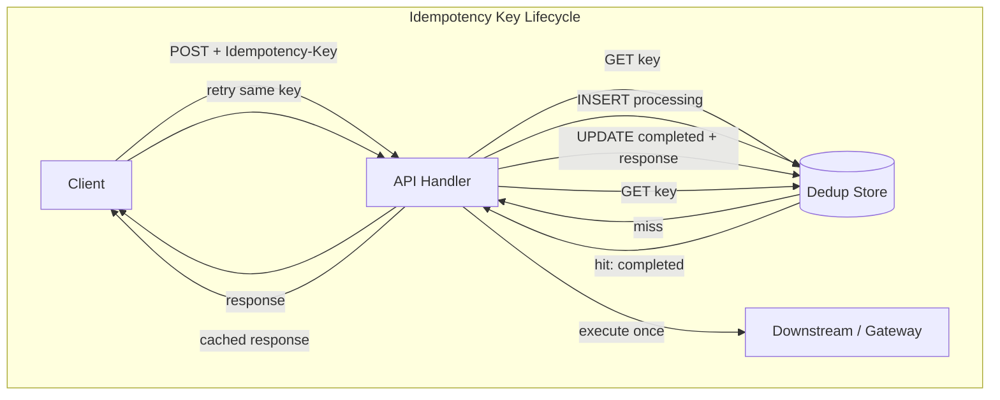

**Explanation:** The dedup store is the single source of truth for whether side effects already ran. The `processing` state prevents concurrent duplicate requests from both executing downstream calls. Payment systems extend this with gateway-level deduplication and reconciliation.

---

## 7. Step-by-Step Walkthrough

Consider a card charge via `POST /v1/charges` with header `Idempotency-Key: 550e8400-e29b-41d4-a716-446655440000`.

**Step 1 — First request.** API begins a transaction. Inserts into `idempotency_keys` with status `processing` and a unique constraint on `(merchant_id, key)`. Calls payment gateway with the same key. Gateway charges card. API writes ledger row, updates status to `completed`, stores response body, commits transaction. Returns `200 OK`.

**Step 2 — Response lost.** Client times out. Client retries with identical key and body.

**Step 3 — Dedup hit.** API finds `completed` record. Returns stored `200` and response body. No gateway call. No second ledger write.

**Step 4 — Concurrent duplicate.** Two requests with the same key arrive simultaneously. First wins the unique constraint insert. Second gets constraint violation or reads `processing`. Second either waits for first to complete or returns `409` with `Retry-After`.

**Step 5 — Key reuse with different body.** API returns `422 Unprocessable Entity`: idempotency key was already used with different parameters. Prevents semantic bugs.

**Step 6 — Reconciliation.** Nightly job compares ledger against gateway settlement file to catch any drift not covered by inline dedup.

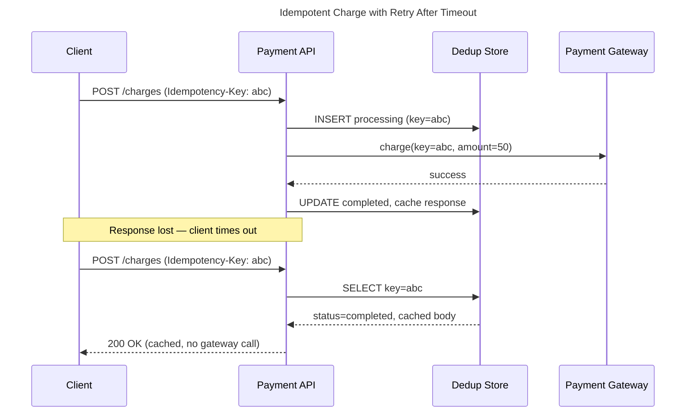

**Explanation:** The sequence shows how the dedup store short-circuits retries. The gateway may also deduplicate by key — defense in depth is standard for money movement.

---

## 7.1 Real-World Scenarios at Production Granularity

The following scenarios walk through **exact request flows**, **failure points**, and **recovery actions** as they occur at companies operating at scale. Use them in interviews to demonstrate production reasoning, not textbook definitions.

### Scenario A: Stripe card charge — timeout at T+29s

**Context:** E-commerce checkout calls `POST /v1/payment_intents` with `Idempotency-Key: ord_8f3a_20260728_001`. Amount: $247.50 USD. Stripe documents [idempotent requests](https://docs.stripe.com/api/idempotent_requests) with a **24-hour** deduplication window.

| Time | Event | System state |
|------|-------|--------------|
| T+0ms | Client sends POST with key `ord_8f3a...` | No dedup record |
| T+15ms | Stripe API inserts dedup row `processing` | Row locked |
| T+120ms | Card network authorization succeeds | Money held |
| T+145ms | Stripe marks dedup `completed`, caches JSON response | Terminal |
| T+29s | **Client TCP timeout** (30s limit) — no response received | Client state: unknown |
| T+29.5s | Client SDK **automatic retry** with **same key** | — |
| T+29.52s | Stripe dedup hit → returns cached `200` + PaymentIntent `pi_xxx` | No second auth |

**What would go wrong without idempotency:** Retry at T+29.5s creates a second PaymentIntent → customer charged twice → support refund + chargeback fees.

**Granular client rule:** The key must be generated **once per checkout session** (browser `sessionStorage` or server order draft ID), not per HTTP attempt.

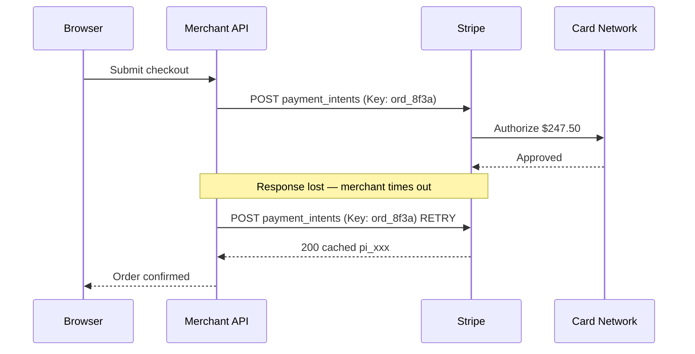

**Principal signal:** Merchant must **persist** the idempotency key with the order row *before* calling Stripe. If merchant crashes after Stripe succeeds but before order update, reconciliation matches `pi_xxx` to `order_id`.

See also: [Real-World Scenario: Stripe Payment Idempotency](/docs/real-world-scenarios/stripe-payment-idempotency).

---

### Scenario B: Uber trip — request, match, capture (multi-phase idempotency)

**Context:** Ride-hailing involves **multiple mutating steps** across services. Each phase needs its own idempotency scope.

| Phase | Operation | Idempotency key scope | Duplicate risk |
|-------|-----------|----------------------|----------------|
| 1 | `POST /trips` (request ride) | `rider_id + client_request_id` | Two drivers assigned |
| 2 | `POST /trips/{id}/match` | `trip_id + match_epoch` | Double dispatch |
| 3 | `POST /payments/capture` | `trip_id + fare_final` | Double charge |

**Timeline — rider app retries trip request:**

1. **T+0:** App sends `POST /trips` with `client_request_id: uuid-A` (generated when user taps "Request").
2. **T+200ms:** Dispatch service creates `trip_991`, begins matching. Response en route.
3. **T+5s:** App on cellular loses signal — no response. User sees spinner.
4. **T+8s:** App retries `POST /trips` with **same** `client_request_id: uuid-A`.
5. **T+8.05s:** API dedup returns existing `trip_991` — **no second trip**.

**Capture phase (after ride ends):**

- Fare computed: $18.40. `POST /capture` with key `trip_991:final`.
- Network glitch → retry with same key → payment processor returns original capture ID.
- If app mistakenly uses `trip_991:retry1` as key → **duplicate charge** — classic bug.

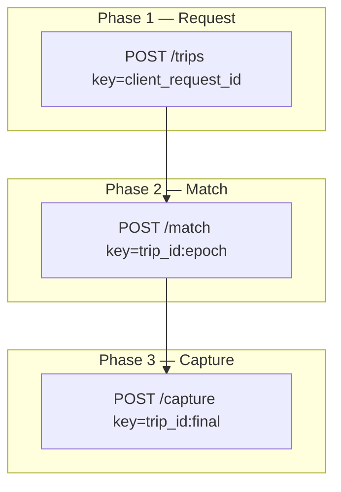

**Lesson:** Idempotency keys are **per logical operation**, not per API call globally. Document key naming conventions per endpoint.

---

### Scenario C: Amazon order — SQS fan-out + DynamoDB conditional write

**Context:** Order placement writes to DynamoDB and publishes to SQS. SQS delivers **at-least-once**. Multiple fulfillment workers may see duplicate messages.

**Order service (synchronous path):**

```
PUT order/{order_id}  — order_id is client-generated or server UUID (natural key)
ConditionExpression: attribute_not_exists(order_id)
```

Second identical `PUT` with same `order_id` → `ConditionalCheckFailedException` → return existing order (idempotent create).

**Fulfillment consumer (asynchronous path):**

| Message field | Purpose |
|---------------|---------|
| `order_id` | Business key |
| `dedup_id` | `order_id + line_item_id + fulfillment_attempt` |
| Handler | `INSERT INTO fulfillment_log (dedup_id) ... ON CONFLICT DO NOTHING` then ship |

**Failure:** Worker processes message, ships package, crashes before SQS `DeleteMessage`. Message redelivered.

**Without idempotency:** Second package shipped — customer gets duplicate items.

**With idempotency:** `fulfillment_log` contains `dedup_id` → handler returns success without re-shipping.

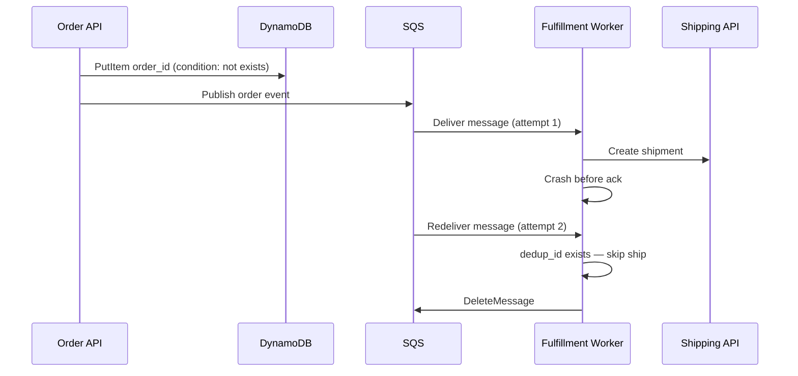

---

### Scenario D: Bank wire transfer — partner reference number

**Context:** ACH/wire APIs use **end-to-end idempotency** via `client_reference` or `idempotency_key` mandated by partner banks. TTL often **7–45 days** (longer than Stripe).

**Flow:**

1. Treasury system generates `wire_ref: W-20260728-0042` **before** calling bank API.
2. Persists `(wire_ref, status=processing)` in ledger DB.
3. Calls bank `POST /wires` with `client_reference=W-20260728-0042`.
4. Bank responds `202 Accepted` — settlement T+1 business day.
5. Timeout on HTTP — treasury retries with **same** `wire_ref`.
6. Bank returns original wire ID — no duplicate settlement.

**Reconciliation (T+24h):** Compare internal ledger `wire_ref` to bank CSV. Mismatches indicate crash window bugs.

| Failure | Symptom | Detection |
|---------|---------|-----------|
| New ref per retry | Duplicate wire | Bank rejects or double debit — reconciliation |
| Crash after bank accept | `processing` forever | Sweeper queries bank by `client_reference` |
| Partner idempotency TTL expired | Retry creates duplicate | Extend TTL; use durable workflow ID |

---

### Scenario E: SaaS subscription renewal — dunning retries

**Context:** Failed card on renewal triggers retry schedule (day 1, 3, 7). Each retry must **not** create a new invoice if previous attempt succeeded but notification failed.

**Idempotency key:** `subscription_id + billing_period_start` (e.g., `sub_abc:2026-07-01`).

| Attempt | Day | Key | Expected behavior |
|---------|-----|-----|-------------------|
| 1 | Jul 1 | `sub_abc:2026-07-01` | Charge; mark invoice paid |
| 2 | Jul 3 | same key | Dedup hit — no charge |
| 3 | Jul 7 | same key | Only if attempt 1 genuinely failed |

**Edge case:** Attempt 1 charges successfully; invoice email job fails. Support sees "unpaid" in UI if invoice status not updated atomically with charge. **Fix:** Single transaction: charge + invoice `paid` + dedup `completed`.

---

### Scenario F: Flash-sale inventory — reserve then confirm

**Context:** 1,000 units, 50,000 concurrent buyers. Idempotency prevents one user from reserving multiple units via retries.

```
POST /reservations
Idempotency-Key: user_123 + sale_event_id
```

**First request:** Decrement stock (conditional: stock > 0), create reservation row.

**Retry:** Return existing reservation — do **not** decrement stock again.

**Concurrent duplicate (two tabs):** Unique constraint `(user_id, sale_event_id)` — one wins, one gets existing reservation.

**Non-idempotent mistake:** `POST /reservations` without key → user refreshes → two units reserved (if stock allows) or oversell.

---

### Real-world pattern summary

| Company / domain | Key source | TTL / scope | Downstream dedup |
|------------------|------------|-------------|------------------|
| Stripe | Client header | 24 hours | Card network via Stripe |
| Uber | Per-phase client ID | Trip lifetime | Payment processor |
| Amazon | `order_id` natural key | Permanent | Fulfillment dedup table |
| Banks | `client_reference` | Days–weeks | Partner mandate |
| SaaS billing | `sub + period` | Per billing cycle | Gateway + ledger |
| Flash sale | `user + event` | Event duration | DB unique constraint |

---

## 7.2 Idempotency in Active-Passive, Active-Active, and Disaster Recovery

Failover changes **where** deduplication state lives and **whether two sites can process the same key simultaneously. Idempotency design must match your **availability topology** and **RPO/RTO** targets.

### DR vocabulary (idempotency lens)

| Term | Definition | Idempotency implication |
|------|------------|-------------------------|
| **RPO** (Recovery Point Objective) | Max acceptable data loss | Dedup records lost after RPO may allow duplicate charges on retry |
| **RTO** (Recovery Time Objective) | Max acceptable downtime | Longer RTO → more client retries → more duplicate pressure |
| **Failover** | Promote standby to active | Dedup store must be consistent or duplicates occur |
| **Failback** | Return to primary | In-flight keys must not double-apply |
| **Split brain** | Two sites both believe they are primary | **Highest duplicate risk** without fencing |

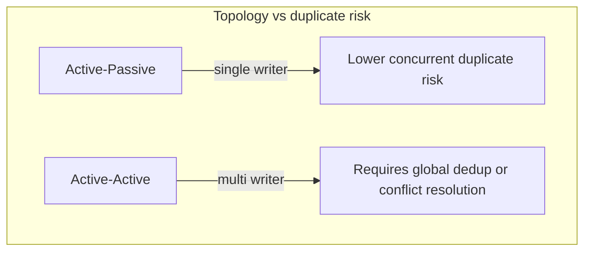

---

### Topology 1: Single-region active-passive (hot standby)

**Architecture:** Primary AZ processes all writes. Standby AZ has **synchronous or async replica** of dedup DB. Load balancer health-checks primary; on failure, promotes standby.

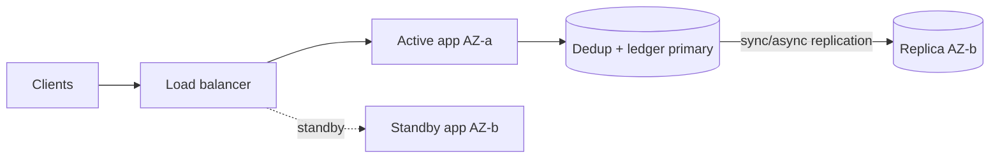

**Normal operation:**

1. All `POST /payments` hit Active. Dedup writes go to PrimaryDB.
2. Retry with same key → read from PrimaryDB → cache hit.

**Failover scenario (primary DB unavailable):**

| Step | Action | Idempotency risk |
|------|--------|------------------|
| 1 | LB stops routing to Active | In-flight requests may timeout |
| 2 | Clients retry with same keys | — |
| 3 | Promote ReplicaDB to primary | **Async lag:** dedup rows not yet replicated are **lost** |
| 4 | Retry treated as new request | **Duplicate charge** if original actually completed |

**Mitigation:**

- **Synchronous replication** for dedup table (or group commit with RPO ≈ 0).
- **Fail closed** during promotion — return `503` until dedup store is authoritative.
- **Gateway as source of truth:** On retry after failover, query payment gateway by idempotency key before charging.
- **Reconciliation** after every failover drill.

**RPO = 0, RTO = 5 min example:**

- Dedup row replicated before ACK to client.
- Failover completes in 5 minutes; clients retry; keys intact → safe.

**RPO = 30s async replication example:**

- Charge at T+0 replicated at T+28s; primary dies at T+15s; dedup row **never on replica** → retry at T+60s duplicates charge. **Unacceptable for payments** without gateway query.

---

### Topology 2: Multi-region active-passive (DR site cold/warm)

**Architecture:** **us-east-1** active; **us-west-2** DR standby. DNS or Global Accelerator routes traffic to active region only. DR database restored from replication or backup.

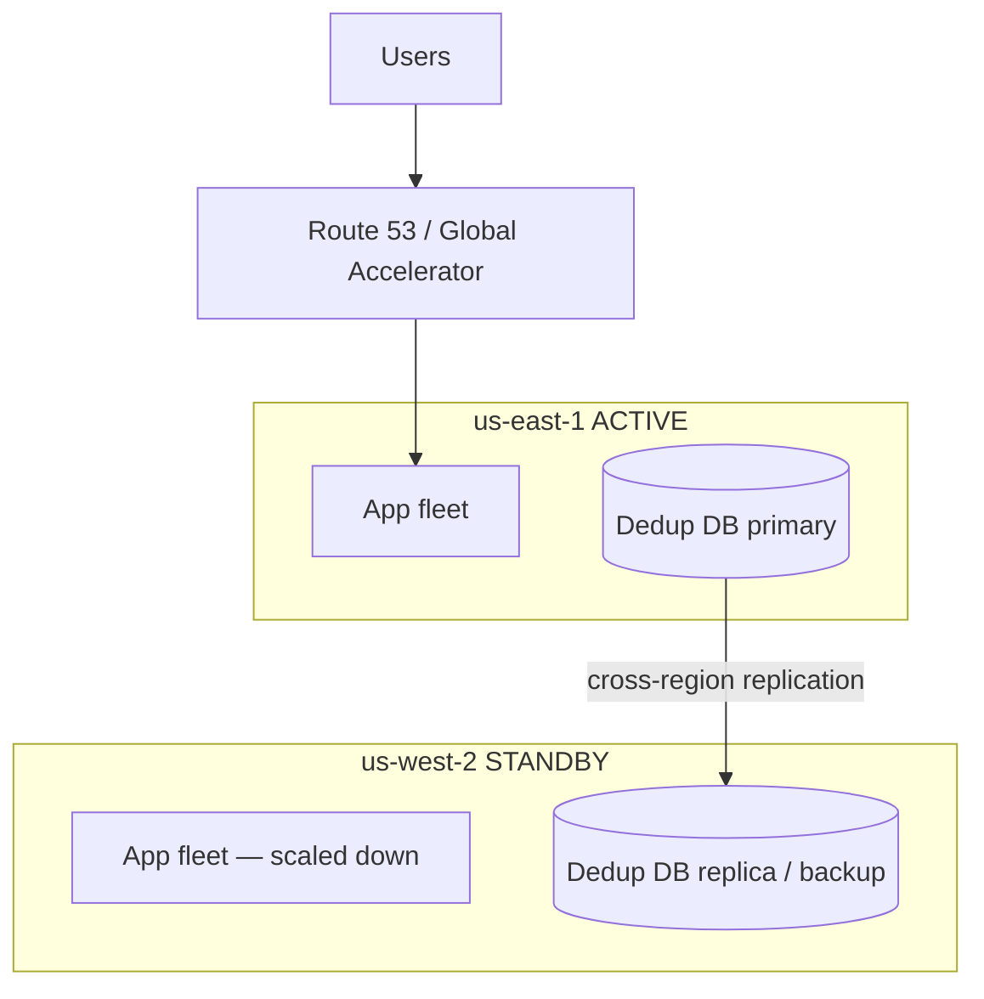

**Planned DR failover (region loss):**

| Phase | System behavior | Idempotency actions |
|-------|-----------------|---------------------|
| **Detect** | Health checks fail in us-east-1 | Pause outbound mutations globally (feature flag) |
| **Isolate** | Prevent split brain | Revoke east write credentials; fence old primary |
| **Promote** | us-west-2 DB promoted | Verify replication lag = 0 or accept RPO |
| **Redirect** | DNS → us-west-2 | Resume traffic |
| **Drain retries** | Clients retry with same keys | Dedup in west must contain east records |

**In-flight requests during failover:**

1. Client sent `POST /transfer` key `K` to us-east-1 at T+0.
2. East processed charge; dedup `completed`; response lost.
3. Region fails at T+2s before client receives response.
4. DNS flips to west at T+10min.
5. Client retries key `K` to us-west-2.

**If cross-region replication was synchronous:** West has `completed` for `K` → safe.

**If async with 5-minute lag and promotion at T+2min:** West may lack `K` → **duplicate transfer**.

**Production pattern (payments):** **Global dedup store** with strong consistency (Spanner, DynamoDB global tables with careful design) OR **gateway-level idempotency** that survives regional failover.

---

### Topology 3: Multi-region active-active

**Architecture:** Both regions accept writes. Users routed geographically. Data replicated bidirectionally. **Highest complexity** for idempotency.

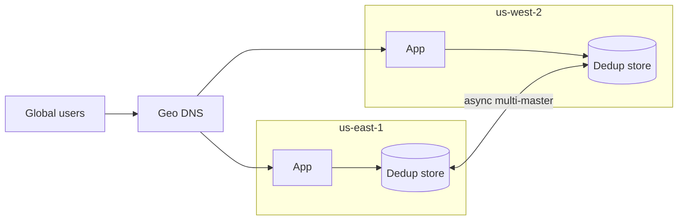

**Failure: same key hits both regions (mobile client retry + DNS flip):**

| Time | Event |
|------|-------|
| T+0 | Request key `K` → east; `processing` inserted east |
| T+1 | Timeout; client retries |
| T+1 | DNS resolves to west (user traveled or flaky resolver) |
| T+2 | Request key `K` → west; **no record** (replication lag) |
| T+3 | **Both regions charge** — catastrophic without global dedup |

**Mitigations:**

| Strategy | Mechanism | Tradeoff |
|----------|-----------|----------|
| **Global strongly consistent dedup** | Spanner/DynamoDB global table with linearizable read-before-write | Latency cross-region |
| **Regional keys + sticky routing** | Key includes `home_region`; reject foreign keys | Poor UX on travel |
| **External idempotency authority** | Payment gateway is global dedup | Depends on vendor |
| **CRDT / commutative operations** | Only for non-financial aggregates | Not for ledger |
| **Conflict-free ledger** | Single writer per `account_id` partition | Hot account limits |

**DynamoDB global tables example:**

- Idempotency table with partition key `merchant_id#idempotency_key`.
- `PutItem` with `attribute_not_exists(pk)` — **only one region wins** globally (with eventual consistency caveats — use **conditional writes with version** or transactions for money).

**Interview framing:** "Active-active for reads and geo proximity; **financial writes** funnel through a single partition owner or global consensus for dedup."

---

### Failover scenario matrix

| Scenario | Topology | What breaks | Idempotency response |
|----------|----------|-------------|----------------------|
| **AZ failure** | Active-passive same region | Some in-flight requests | Retry + dedup on promoted replica |
| **Primary DB crash** | Active-passive | Dedup unavailability | Fail closed; queue requests |
| **Region disaster** | Active-passive DR | Cross-region lag | RPO defines duplicate window; gateway query |
| **DNS failover during retry** | Active-active | Same key, two regions | Global dedup or sticky sessions |
| **Split brain** | Misconfigured HA | Dual writes | Fencing tokens; quorum promotion only |
| **Failback after DR** | Active-passive | Keys on both sites | Reconcile before accepting writes on old primary |
| **Backup restore** | Cold DR | Dedup data to yesterday | All client keys since backup may duplicate |

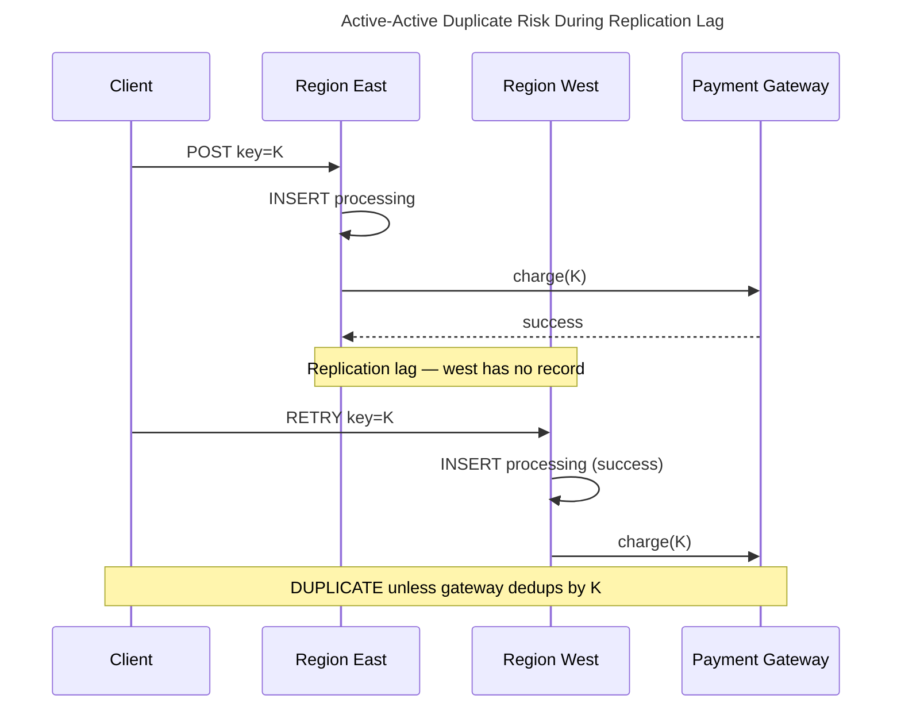

---

### Disaster recovery drill — idempotency checklist

**Before drill:**

- [ ] Document RPO/RTO for dedup store separately from general DB
- [ ] Verify gateway supports status query by idempotency key
- [ ] Freeze reconciliation baseline snapshot

**During failover:**

- [ ] Enable global `503` on mutations OR drain traffic
- [ ] Promote DB; confirm fencing of old primary
- [ ] Verify dedup row count / max key timestamp within RPO

**After failover:**

- [ ] Run reconciliation: gateway settlements vs. ledger
- [ ] Scan `processing` rows older than SLO — heal or fail
- [ ] Compare dedup count east vs. west before re-enabling active-active

**Failback:**

- [ ] Bidirectional sync conflict resolution for dedup rows
- [ ] Never accept writes on both primaries simultaneously

---

### Active-passive vs active-active — idempotency design choice

| Requirement | Prefer active-passive | Prefer active-active |
|-------------|----------------------|----------------------|
| Zero duplicate charges (strict) | ✓ Single writer simplifies dedup | Needs global store |
| RPO = 0 for dedup | ✓ Sync replica | Hard cross-region |
| Lowest latency globally | ✗ Single region | ✓ Geo routing |
| Regulatory data residency | ✓ Clear primary region | Split-brain risk |
| Read scale globally | Read replicas suffice | ✓ Multi-region reads |

**Principal recommendation for payments/ledger:**

- **Active-passive** (or single-primary per shard) for **mutations** with global dedup authority.
- **Active-active** for **read paths** and **idempotent consumers** (CDN, read replicas).
- **Never** rely on async bidirectional replication alone for idempotency without gateway reconciliation.

See also: [Disaster Recovery and Multi-Region](/docs/reliability-and-resilience/disaster-recovery-and-multi-region), [AWS S3 Multi-Region DR](/docs/real-world-scenarios/aws-s3-multi-region-dr), [Partial Failure](/docs/distributed-systems-foundations/partial-failure).

---


Separate **safety** and **liveness** when discussing idempotency:

| Property | Idempotency contribution | Typical guarantee |
|----------|-------------------------|-------------------|
| **Safety** | No duplicate charges, no duplicate resource creation | Same key → same effect at most once |
| **Liveness** | Retries eventually succeed or fail clearly | Stale `processing` records expire or are healed |
| **Consistency** | All replicas see same dedup decision | Strong consistency on dedup store write |

**What idempotency guarantees:**

- Re-executing a completed operation does not change observable state.
- Clients can safely retry after timeout if they reuse the same key.

**What idempotency does not guarantee:**

- **Ordering** of unrelated operations (use versioning or sequencing).
- **Exactly-once delivery** over the network without application support.
- **Correctness** if the client generates a new key per retry (each retry becomes a new operation).

**Safety invariant example:** "Total charged amount for intent key K is at most the requested amount." **Liveness invariant:** "Every submitted intent eventually reaches `completed` or `failed` with a retrievable status."

---

## 8. Dedup Store Design

The **dedup store** (deduplication store, idempotency store) is the durable system of record that answers one question before every mutating side effect:

> **Has this logical operation already been executed for this principal?**

If yes → return the prior outcome (cached response). If no → claim the key, execute once, persist the result. Without a dedup store, retries after timeouts are guesses — and guesses cause double charges, duplicate orders, and duplicate webhook side effects.

This section is the **engineering design guide** for building one. Hands-on practice: [Lab 008](#25-hands-on-exercise) (in-memory) → [Lab 017](/docs/real-world-scenarios/stripe-payment-idempotency#hands-on-lab-local) (PostgreSQL + Stripe mock).

### 8.1 What the dedup store is (and is not)

| It **is** | It **is not** |
|-----------|---------------|
| A mapping from `(scope, idempotency_key)` → `{status, request_hash, response}` | A message broker dedup window (SQS FIFO 5 min) by itself |
| The authority for "did we already run this intent?" | A client-side cache or retry counter |
| Durable across process restarts (in production) | Optional for learning labs (Lab 008 uses in-memory) |
| Scoped per tenant / merchant / user | A global namespace unless you design for it |

**Synonyms in the wild:** idempotency table, idempotency keys table, deduplication store, request replay cache. Stripe calls the client token an [Idempotency-Key](https://docs.stripe.com/api/idempotent_requests); AWS APIs use client tokens similarly.

### 8.2 Responsibilities

A production dedup store must support five operations:

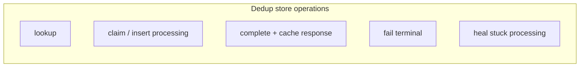

| Operation | When | Must be atomic? |
|-----------|------|-----------------|
| **Lookup** | Every `POST` / mutating handler entry | Read consistent enough to avoid duplicate charge |
| **Claim** | First sight of key — before external call | **Yes** — unique constraint or conditional write |
| **Complete** | After successful side effect | **Yes** — with business write or same transaction |
| **Fail** | Terminal error (declined card, validation) | Yes — cache error response for replay |
| **Heal** | Sweeper finds stuck `processing` | Query downstream; complete or fail |

### 8.3 Canonical schema

Minimum columns for HTTP API idempotency (payments, transfers, order creation):

```sql
CREATE TABLE idempotency_keys (
    tenant_id           TEXT NOT NULL,
    idempotency_key     TEXT NOT NULL,
    request_hash        TEXT NOT NULL,          -- SHA-256(canonical JSON body)
    status              TEXT NOT NULL           -- processing | completed | failed
                        CHECK (status IN ('processing', 'completed', 'failed')),
    response_status     INTEGER,                -- HTTP status to replay
    response_body       JSONB,                  -- cached response for client
    downstream_id       TEXT,                   -- e.g. stripe_payment_intent_id
    created_at          TIMESTAMPTZ NOT NULL DEFAULT NOW(),
    updated_at          TIMESTAMPTZ NOT NULL DEFAULT NOW(),
    expires_at          TIMESTAMPTZ,            -- TTL for row cleanup
    PRIMARY KEY (tenant_id, idempotency_key)
);

CREATE INDEX idx_idempotency_status_updated
    ON idempotency_keys (status, updated_at);
```

| Column | Purpose |
|--------|---------|
| `tenant_id` | Scope keys per merchant/user — **never** use a global key namespace |
| `idempotency_key` | Client-supplied intent ID (UUID, order draft ID) |
| `request_hash` | Detect same key + different body → `409` / `422` |
| `status` | State machine position |
| `response_body` | Full replay for ambiguous-timeout retries |
| `downstream_id` | Link to gateway for sweeper / reconciliation |
| `expires_at` | TTL enforcement (Stripe: 24h) |

**Webhook dedup** is a separate but related table — dedup by `event_id`, not idempotency key:

```sql
CREATE TABLE webhook_events (
    event_id      TEXT PRIMARY KEY,
    payload       JSONB NOT NULL,
    processed_at  TIMESTAMPTZ
);
```

Lab 017 implements both tables; Lab 008 implements the idempotency pattern in memory only.

### 8.4 State machine

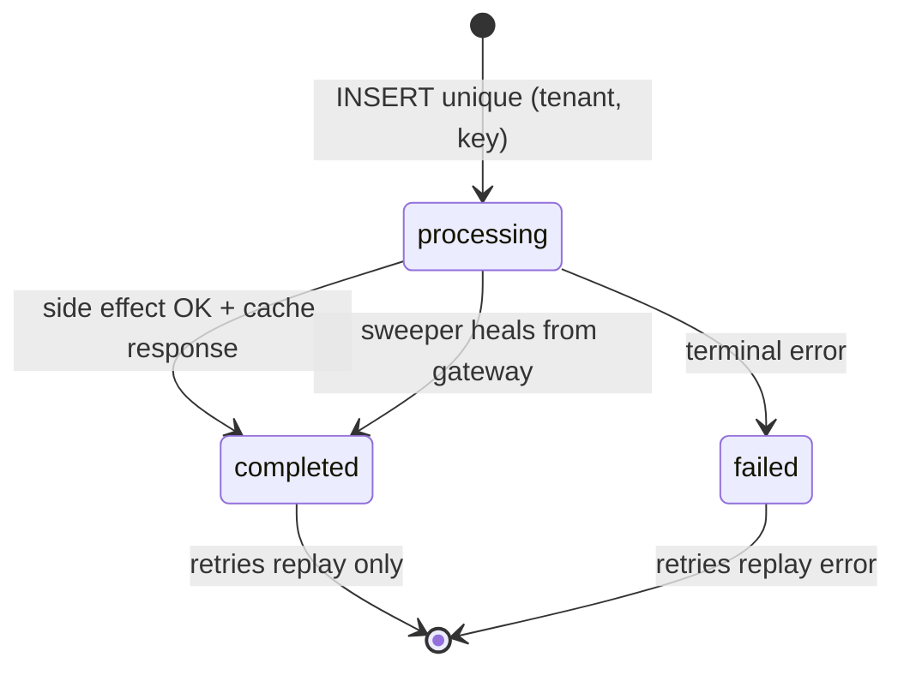

| State | Meaning | Handler behavior on duplicate |
|-------|---------|------------------------------|
| `processing` | Claimed; side effect may be in flight | `409 Conflict`, short poll, or wait (document contract) |
| `completed` | Success; response cached | Return cached `response_status` + body — **no downstream call** |
| `failed` | Terminal failure cached | Return cached error — no retry of side effect |

**Critical ordering:** insert `processing` **before** calling Stripe, database ledger, or SQS publish. If you call downstream first, a crash leaves no record and a retry double-charges.

### 8.5 Handler algorithm

Pseudocode every principal candidate should be able to whiteboard:

```
function handleMutation(tenantId, idempotencyKey, body):
    if idempotencyKey is empty:
        return 400

    hash = SHA256(canonicalJson(body))

    row = dedupStore.lookup(tenantId, idempotencyKey)
    if row exists:
        if row.request_hash != hash:
            return 409  // same key, different intent
        if row.status == completed or failed:
            return row.response_status, row.response_body  // replay
        if row.status == processing:
            return 409 or waitUntilComplete()

    if not dedupStore.insertProcessing(tenantId, idempotencyKey, hash):
        // lost race — re-read and replay
        return handleMutation(tenantId, idempotencyKey, body)

    try:
        result = executeSideEffect(body)   // charge, create order, etc.
        dedupStore.complete(tenantId, idempotencyKey, 201, result)
        return 201, result
    except DedupStoreUnavailable:
        return 503  // fail closed — do NOT charge without dedup
```

This is exactly what `PaymentService.create_charge()` does in [Lab 017](https://github.com/hbhadra/principal-architect-knowledge-system/tree/main/labs/lab-017-stripe-payment-idempotency) and `PaymentService.create_payment()` in [Lab 008](https://github.com/hbhadra/principal-architect-knowledge-system/tree/main/labs/lab-008-idempotent-api).

### 8.6 Design dimensions (decision table)

| Dimension | Options | Principal guidance |
|-----------|---------|-------------------|
| **Scope** | Per tenant, per user, per API key | Composite PK `(tenant_id, key)` always |
| **TTL** | 24h (Stripe), 7d, permanent | TTL ≥ max client retry window + clock skew; money often 24–72h |
| **Consistency** | Strong (sync rep), eventual | **Strong** for payment write path; eventual loses rows on failover |
| **Storage** | PostgreSQL, DynamoDB, Redis+DB | See §8.7 |
| **Response cache** | Full JSON vs resource ID only | Payments: full body; high-volume: ID + lazy fetch |
| **In-flight policy** | 409, poll, block | Document in OpenAPI; 409 simplest for REST |
| **Co-location** | Same DB as ledger vs separate | Same transaction as ledger when possible |
| **Failover** | Fail closed vs best effort | **Fail closed** for money if dedup unavailable |

### 8.7 Storage backend tradeoffs

| Backend | When to use | Pros | Cons |
|---------|-------------|------|------|
| **PostgreSQL / Aurora** | Default for payments, &lt; ~10K idempotency writes/s | ACID with ledger; familiar ops; sweeper SQL | Vertical scale limits; cross-region needs Global Database |
| **DynamoDB** | High QPS idempotency, serverless | Conditional writes; TTL built-in; horizontal scale | No joins with ledger; design PK/SK carefully |
| **Redis** | Lock + short TTL cache layer | Fast claim | Not durable alone — pair with DB |
| **In-memory** | Labs, unit tests (Lab 008) | Zero setup | Lost on restart — not production |

**DynamoDB item sketch:**

```
PK = TENANT#<tenant_id>
SK = IDEM#<idempotency_key>
Attributes: status, request_hash, response_body, ttl_epoch
ConditionExpression: attribute_not_exists(SK)  // claim
```

**Anti-pattern:** Redis-only dedup for payments without durable backing — restart = duplicate charges.

### 8.8 Atomicity with business writes

Best pattern — **single database transaction:**

```sql
BEGIN;
  INSERT INTO idempotency_keys (...) VALUES (..., 'processing', ...);
  INSERT INTO orders (...) VALUES (...);
  -- call external API after commit OR use outbox
COMMIT;
-- then call Stripe; on success UPDATE idempotency_keys SET status='completed'
```

When external API must be called mid-flow (payments):

1. `INSERT processing` (committed)
2. Call Stripe with same idempotency key
3. `INSERT order` + `UPDATE completed` (same transaction)

If step 3 crashes → row stuck `processing` → **sweeper** queries Stripe by `downstream_id` or key, then completes or fails.

### 8.9 Observability and operations

| Metric | What it tells you |
|--------|-------------------|
| `idempotency_replay_total` | Retry rate — high is normal after incidents |
| `idempotency_conflict_total` | Same key, different body — client bugs |
| `idempotency_processing_stuck` | Rows in `processing` &gt; N minutes — need sweeper |
| `dedup_store_unavailable` | Fail-closed 503 rate — capacity or outage |

**Runbook — stuck `processing`:**

1. Query rows `WHERE status='processing' AND updated_at < now() - interval '5 minutes'`
2. For each, query payment gateway by `downstream_id` or idempotency key
3. If gateway shows success → `complete` with cached response
4. If gateway shows nothing → `fail` or allow client retry with **same** key

### 8.10 Mapping to hands-on labs

| Concept | Lab 008 (`:8091` Docker) | Lab 017 (`:8080` Docker) |
|---------|--------------------------|--------------------------|
| Dedup store | `IdempotencyStore` dict in memory | `idempotency_keys` PostgreSQL table |
| Claim | `save(in_flight)` | `INSERT ... processing` + unique constraint |
| Replay | Return cached `response_body` | Same — durable across restart |
| Verify replay | Same `payment_id` in Swagger | Same `payment_intent_id` |
| Webhook dedup | `webhook_dedup` set | `webhook_events` table |
| Fail closed | Test only (`store_available=False`) | `503` when store down |

**Try it:** [Idempotency §25 Hands-On](/docs/distributed-systems-foundations/idempotency#25-hands-on-exercise) — Lab 008 quickstart; then [Stripe scenario engineer guide](/docs/real-world-scenarios/stripe-payment-idempotency#engineer-guide-how-the-local-stack-works).

### 8.11 Anti-patterns

| Anti-pattern | Why it fails |
|--------------|--------------|
| Client-only dedup (no server store) | Different clients, SDK retries, proxies all bypass |
| New UUID per HTTP retry | Each retry is a new operation — double charge |
| Downstream call before claim | Crash after charge, no record — retry charges again |
| Best-effort dedup when DB down | Duplicate money movement |
| Global idempotency key without tenant | Cross-tenant collision |
| TTL shorter than client retry window | Expired key → second charge |
| Storing only `completed` without `processing` | Concurrent duplicates both execute |

---

## 9. Failure Scenarios

### Scenario 1: Crash After Side Effect, Before Dedup Update

Handler charges the gateway, then crashes before marking `completed`. Retry finds `processing` or no record.

**Mitigation:** Two-phase pattern — mark `processing` before external call; on recovery, query gateway status by idempotency key before re-charging. Reconciliation job catches orphans.

### Scenario 2: Dedup Store Unavailable

Database for idempotency keys is down during a payment spike.

**Mitigation:** Fail closed on mutations (return `503`); do not process payments without dedup. Queue requests for later processing if business allows. Never "best effort" dedup for money.

### Scenario 3: TTL Expiry Before Retry Window

Client retries after 48 hours; dedup record expired (24-hour TTL).

**Mitigation:** Size TTL to exceed maximum client retry window plus clock skew. For long-running workflows, use durable workflow IDs (Temporal, Step Functions) rather than short-lived HTTP dedup alone.

### Scenario 4: Key Collision Across Tenants

Global idempotency table without tenant scoping; two merchants use the same UUID (unlikely but catastrophic if scoped wrong).

**Mitigation:** Composite unique key `(tenant_id, idempotency_key)`. Document that keys are unique per merchant, not globally.

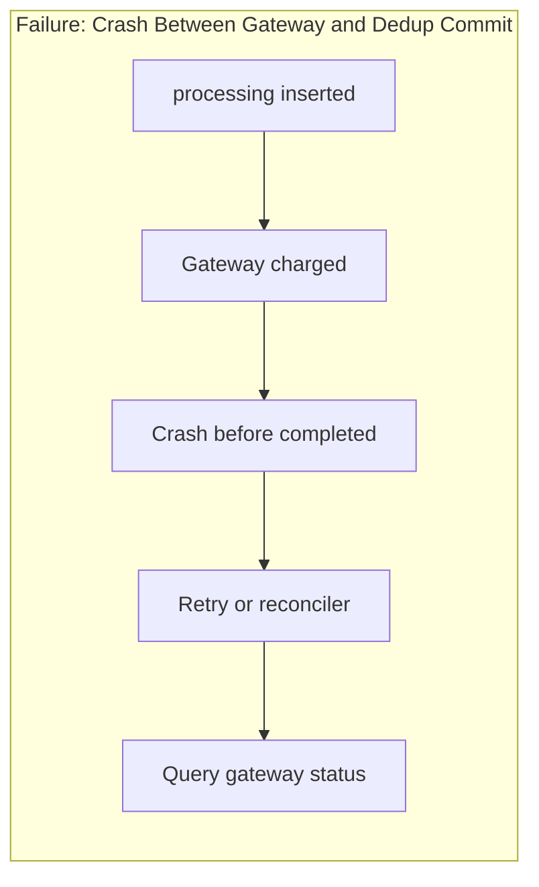

**Explanation:** The dangerous window is between irreversible external effect and durable local record. Design recovery paths for that window explicitly.

---

## 10. Performance Characteristics

Every idempotent mutation pays **at least one extra read** (dedup lookup) and **one write** (record insert/update) beyond the business logic.

| Factor | Impact |
|--------|--------|
| **Dedup store latency** | Adds to p99 on every `POST`; often co-located with primary DB |
| **Hot keys** | Same idempotency key retried aggressively creates read contention on one row |
| **Payload caching** | Storing full response bodies increases storage; compress or store references |
| **TTL sweeps** | Background deletion of expired keys; partition by time for efficiency |

**Rough structural argument:** If dedup lookup adds \(L_d\) latency and business logic adds \(L_b\), serial path is \(L_d + L_b\) on first attempt and ≈ \(L_d\) on cache hit. At high retry rates, cache hits dominate — optimize read path.

Do not cite specific production latency numbers unless sourced. The structural cost — extra durable round-trip per mutation — is unavoidable for key-based dedup.

---

## 11. Scalability Limits

Idempotency stores scale until:

- **Write rate** on single partition (per-tenant hot keys) exceeds database row lock throughput.
- **Storage** for cached responses grows without TTL or archival.
- **Cross-region** dedup requires either global strongly consistent store (latency cost) or regional keys with explicit tradeoffs.

| Scale signal | Limit | Response |
|--------------|-------|----------|
| >1k RPS per merchant key | Row lock contention | Shard by key hash; accept rare duplicate risk only with reconciliation |
| Multi-region active-active | Global dedup latency | Regional idempotency scope; conflict resolution for cross-region |
| Billion keys/month | Storage cost | Aggressive TTL; store outcome hash not full body |

---

## 12. Operational Considerations

**Monitoring:** Track dedup hit rate (retries), `processing` records older than SLO (stuck operations), key reuse violations (same key, different body), and reconciliation drift.

**Runbooks:** Stuck `processing` — query downstream, complete or fail manually. Dedup DB failover — fail closed on writes. Gateway mismatch — pause traffic, run reconciliation.

**TTL policy:** Document minimum retention (Stripe documents 24 hours for idempotency keys). Align with client SDK retry policies.

**Testing:** Chaos-test crash between gateway call and dedup commit. Property-test that N concurrent identical requests produce one side effect.

---

## 13. Security Considerations

- **Key predictability:** Clients must use cryptographically random UUIDs; predictable keys enable replay attacks across sessions if not bound to auth context.
- **Key binding:** Associate keys with authenticated principal and request hash; reject cross-tenant or cross-body reuse.
- **Response leakage:** Cached responses may contain PII; encrypt at rest; scope cache to same auth token.
- **Denial of service:** Attacker floods unique keys → dedup store growth. Rate limit mutations per principal; cap key length.

---

## 14. Cost Considerations

| Cost driver | Notes |
|-------------|-------|
| **Dedup storage** | One row per unique mutation intent; TTL bounds growth |
| **Read amplification** | Every retry is a cheap read vs. expensive duplicate charge |
| **Reconciliation** | Batch jobs comparing ledgers; cheaper than incident response |
| **Strong consistency** | Multi-AZ or global DB for dedup adds replication cost |

**Cost-aware design:** Full response caching is optional for non-financial APIs — storing `completed` status plus resource ID may suffice. For payments, cost of duplicate charge exceeds dedup storage by orders of magnitude.

---

## 15. Production Implementations

| Provider / Pattern | Mechanism | Notes |
|-------------------|-----------|-------|
| **Stripe** | `Idempotency-Key` header on POST | 24-hour window; returns cached response on replay |
| **AWS S3** | Conditional writes (`If-None-Match`, `If-Match`) | Overwrite semantics for PUT; multipart upload uploadId |
| **Amazon SQS** | FIFO deduplication ID | 5-minute dedup window per message group |
| **AWS Lambda** | Event source mapping partial batch responses | Idempotent handlers for at-least-once stream processing |
| **Kafka** | Idempotent producer + transactional writes | Broker dedup within `producer.id` epoch; consumers still need idempotent handlers |
| **Temporal / Cadence** | Workflow and activity IDs | Durable execution replays activities; activities must be idempotent |
| **HTTP PUT** | Resource-identifying URI | `PUT /accounts/123` overwrites; naturally idempotent |
| **PayPal / Adyen** | Merchant reference / idempotency headers | Gateway-level dedup standard in card networks |

These are **implementation choices** documented by vendors; behavior details change — verify current API docs before citing specifics in interviews.

---

## 16. Alternatives and Tradeoffs

| Approach | Pros | Cons | When to use |
|----------|------|------|-------------|
| **Client idempotency keys** | Explicit intent; works across services | Requires client cooperation | Public APIs, payments, mobile |
| **Natural idempotency (UPSERT)** | No extra store | Only works for set-style operations | Config updates, absolute counters |
| **Database unique constraints** | Simple; strong | Limited to create-once patterns | `INSERT ... ON CONFLICT` |
| **Distributed lock per key** | Serializes concurrent dupes | Lock service failure modes; latency | Short critical sections |
| **Outbox + single consumer** | Ordering per aggregate | Does not replace idempotency on consumer | Event-driven sagas |
| **Pessimistic: no retries** | No duplicates | Poor liveness; bad UX | Not acceptable for most user-facing APIs |

There is no universal best — **payments need fail-closed dedup**; **analytics ingestion** may tolerate at-least-once with idempotent aggregation.

---

## 17. Common Misconceptions

1. **"GET is always safe to retry."** — True for HTTP semantics (no server state change), but not if your GET triggers side effects (avoid non-standard GET mutations).

2. **"Kafka gives exactly-once."** — Kafka offers exactly-once *within* transactional produce/consume boundaries; end-to-end exactly-once still requires idempotent consumers and external side effects handled separately.

3. **"UUID per retry is fine."** — Each retry becomes a new operation; doubles charges.

4. **"Idempotency keys fix ordering."** — They fix duplicate *effects*, not out-of-order delivery. Use versioning for ordering.

5. **"DELETE is always safe."** — Deleting then recreating may not be idempotent in business terms; second DELETE may error or have different meaning.

6. **"We only need idempotency on the client."** — Server must enforce; malicious or buggy clients will not cooperate.

7. **"At-most-once delivery removes the need for idempotency."** — At-most-once sacrifices liveness; message loss may be worse than duplicates in many domains.

---

## 18. Principal Architect Perspective

Principal-level evaluation centers on **composing delivery semantics with business invariants**:

- **State the contract:** "Mutations are at-least-once; idempotency keys are required; TTL is 72 hours."
- **Blast radius:** Dedup store outage blocks all payments — design HA and fail-closed policy explicitly.
- **Organizational:** Platform team provides idempotency middleware; product teams declare which endpoints are safe for client retry.
- **Evolution:** Migrating from no keys to required keys needs versioning, grace period, and metrics on missing keys.

**Red flags in reviews:** Retry without key on `POST`; idempotency store eventually consistent with primary DB; no reconciliation for financial paths; `processing` records without timeout healing.

**Business alignment:** "Duplicate charge is unacceptable (safety); delayed charge with clear status is acceptable (liveness)." Idempotency is how you honor that tradeoff.

---

## 19. Architecture Review Exercise

**Scenario:** A fintech startup exposes `POST /transfers` without idempotency keys. Mobile clients retry on timeout. Customer support reports duplicate transfers. Engineering proposes "disable retries in the app."

**Your task:**

1. Identify safety and liveness violations in the current design.
2. Propose idempotency key flow including dedup store schema and HTTP status codes.
3. Define behavior when the same key is sent with different amounts.
4. Specify reconciliation with the bank partner.
5. List metrics and alerts for rollout.

**Evaluation rubric:**

| Score | Criteria |
|-------|----------|
| **Strong** | At-least-once + idempotent handler; atomic processing state; fail-closed if dedup unavailable; reconciliation; rejects body mismatch |
| **Adequate** | Keys and dedup store but no stuck-processing handling or reconciliation |
| **Weak** | "Fix the client" only; or rely on at-most-once without acknowledging message loss |

---

## 20. Whiteboard Explanation

**60-second version:**

"Networks and brokers give us at-least-once delivery. Timeouts mean we don't know if a payment went through. Idempotency means repeating the operation doesn't change the outcome — so retries are safe. The client sends an idempotency key with every attempt. The server stores that key in a dedup table: first time we process and cache the response; retries return the cache. For money we also reconcile with the gateway. Exactly-once end-to-end is really at-least-once plus idempotent handlers."

**Whiteboard sketch:**

```
Client --[POST + Key: K]--> API --> Dedup Store
                              |         |
                              |    miss? process
                              |    hit?  return cached
                              v
                          Gateway (also keyed)
```

---

## 21. Interview Questions

1. Define idempotency. Why is it necessary in distributed systems?

2. What is an idempotency key? Who generates it, and how long should it be retained?

3. Explain the difference between at-least-once delivery and idempotent processing. How do they combine to achieve effectively exactly-once effects?

4. Walk through designing an idempotent `POST /payments` API. Include dedup store schema and status transitions.

5. What HTTP methods are idempotent by specification? Is `POST` idempotent?

6. A client retries with the same idempotency key but a different request body. What should the server do?

7. Your service crashes after charging the gateway but before updating the dedup store. How do you recover?

8. Compare storing the full response in the dedup store vs. storing only a resource ID.

9. How does Stripe's idempotency model work at a high level?

10. Why do Kafka consumers need idempotent handlers even when using an idempotent producer?

11. Design idempotency for an SQS FIFO queue consumer processing order fulfillment.

12. How does idempotency interact with active-active multi-region failover?

13. What happens to in-flight idempotency keys when async replication lags during DR promotion?

14. What is the difference between natural idempotency and key-based deduplication? Give an example of each.

15. How would you test idempotency in a CI pipeline — including a DR failover drill?

**Expected answer signals:** Timeout ambiguity; dedup store with `processing`/`completed`; unique constraint; fail-closed on dedup outage; gateway status query; reconciliation; HTTP RFC semantics; at-least-once + idempotent handler = effective exactly-once; RPO defines dedup loss window; global dedup for active-active; gateway as authority during split brain.

**Red flags:** "Use exactly-once Kafka and you're done"; new UUID per retry; no mention of concurrent duplicate requests; ignore financial reconciliation.

---

## 22. Interview Follow-Ups

1. **After Q4 (payment API):** "What if the dedup store is partitioned from the primary DB?" — *Expect: same failure domain ideally; or accept risk and reconcile; never process payment without dedup.*

2. **After Q6 (body mismatch):** "Should we return 409 or 422?" — *Expect: 422 for semantic conflict; document in API spec; never apply new body to old key.*

3. **After Q7 (crash recovery):** "How long can a record stay in `processing`?" — *Expect: timeout heuristic; background sweeper; query downstream before retry.*

4. **After Q10 (Kafka):** "What about compacted topics?" — *Expect: log compaction is not application dedup; consumer still dedups side effects.*

5. **Principal-level:** "How do you roll out required idempotency keys to 200 teams without blocking releases?" — *Expect: middleware, gradual enforcement metrics, sandbox validation, platform SDK defaults.*

6. **After DR failover:** "RPO was 30 seconds and promotion happened at 15 seconds — what idempotency risk?" — *Expect: dedup rows not replicated; retries duplicate; gateway query + reconciliation; sync rep or fail closed.*

7. **Active-active:** "Same idempotency key hits two regions — how prevent double charge?" — *Expect: global consistent dedup, gateway dedup, sticky routing, or single writer per account.*

8. **After Q11 (SQS):** "FIFO dedup window is 5 minutes — is that enough?" — *Expect: depends on retry policy; may need application-level dedup beyond broker window.*

---

## 23. Strong Answer Example

**Question:** "Design idempotent handling for a money transfer API."

**Strong answer:**

"Transfers are mutating and will be retried on timeout, so I assume at-least-once delivery at the HTTP layer. The client must send an `Idempotency-Key` header — a UUID v4 per user intent — on every attempt including retries.

On the server, I use a dedup table with composite unique key `(user_id, idempotency_key)` and columns for `status` (`processing`, `completed`, `failed`), `request_hash`, and `response_body`. I begin a DB transaction, insert `processing` with the hash of the body, and rely on the unique constraint to detect concurrent duplicates.

Before calling the bank API, I pass the same idempotency key to the partner. If insert succeeds, I execute the transfer. On success, I update to `completed` and cache the response in the same transaction as the ledger write. On retry, I return the cached response with the same HTTP status.

If the same key arrives with a different body hash, I return 422 — the key is bound to the original intent. If the record is stuck in `processing` beyond 60 seconds, a sweeper queries the bank by partner reference before re-attempting.

If the dedup database is unavailable, I fail closed with 503 — I do not transfer money without dedup. Nightly reconciliation compares our ledger to the bank file. Safety invariant: at most one transfer per idempotency key. Liveness: every key eventually reaches terminal state or is healed by the sweeper."

---

## 24. Weak Answer Example

**Question:** "Design idempotent handling for a money transfer API."

**Weak answer:**

"We'll use a UUID on each request. If the request fails, generate a new UUID and try again. We'll add a unique index on transaction ID in the database. Kafka exactly-once will handle the rest."

**Why this is weak:** New UUID per retry causes duplicates; conflates Kafka semantics with HTTP client retries; no dedup lifecycle; no fail-closed policy; no reconciliation; no handling of concurrent requests or body mismatch.

---

## 25. Hands-On Exercise

### Lab 008: Idempotent API Design (runnable)

Full intro lab at `labs/lab-008-idempotent-api/` — FastAPI + Swagger on **port 8081** (local serve) or **`:8091`** (Docker), in-memory idempotency store.

```bash
cd labs/lab-008-idempotent-api
python3 -m venv .venv && source .venv/bin/activate
pip install -r requirements.txt
pytest tests/ -v
python -m src.main --serve          # http://localhost:8081/docs
# Or Docker:
docker compose -p lab008 -f docker/docker-compose.yml up --build -d
curl http://localhost:8091/health
```

Open http://localhost:8081/docs → **POST /v1/payments** with:

- Header: `Idempotency-Key: intro-1`
- Body: `{"amount": 10.0, "currency": "USD"}`

Execute twice with the same key — identical `payment_id`, `ledger_entries` stays at 1 (check `GET /health`).

**Graduate to Lab 017** for PostgreSQL, Stripe mock, webhooks, and sweeper: [Stripe Payment Idempotency](/docs/real-world-scenarios/stripe-payment-idempotency#hands-on-lab-local).

### Build-from-scratch exercise (optional)

**Exercise: Build an Idempotent POST Endpoint**

**Prerequisites:** Any web framework, SQL or Redis, HTTP client with retry.

**Steps:**

1. Implement `POST /orders` accepting header `Idempotency-Key`.
2. Back with a table: `key`, `status`, `request_hash`, `response_json`, `created_at`.
3. Send 20 parallel identical requests with the same key; verify exactly one order row.
4. Retry after killing the server mid-handler (between insert and complete); verify recovery without duplicate order.
5. Send same key with different body; verify 409.
6. Measure latency: first request vs. dedup cache hit.

**Success criteria:** Written state machine diagram, test results for concurrent and crash cases, and documented TTL choice with justification.

Or complete **Lab 008** above instead — it implements steps 1–3 and 5 with 12 passing tests.

---

## 26. Knowledge Check

1. True or false: An idempotent operation can be executed multiple times without changing system state beyond the first success. *(True.)*

2. Why must the client reuse the same idempotency key on retry? *(New key = new operation; duplicates side effects.)*

3. What HTTP status might you return for an in-flight duplicate while the first request is still processing? *(409 Conflict or 202 Accepted — document contract.)*

4. Name two places duplicate execution can originate besides client retry. *(Message broker redelivery, workflow replay, load balancer retry.)*

5. What is the practical meaning of "exactly-once" in most production systems? *(At-least-once delivery plus idempotent handlers.)*

6. Why fail closed when the dedup store is down for payments? *(Duplicate charge risk exceeds temporary unavailability.)*

7. How does `PUT` differ from `POST` regarding idempotency? *(PUT is idempotent by HTTP spec on a resource URI; POST creates new resources and is not idempotent without keys.)*

8. What should reconciliation catch that inline dedup might miss? *(Crash windows, TTL expiry, partner-side duplicates, DR replication lag, split brain.)*

9. During active-passive failover with 30s async replication lag, why can retries duplicate charges? *(Dedup row may not exist on promoted replica; retry looks like new request.)*

10. Name three mitigations for active-active duplicate idempotency keys across regions. *(Global dedup store, gateway-level dedup, sticky routing / single writer per partition.)*

---

## 27. Flashcards

| Front | Back |
|-------|------|
| Idempotency | Same effect whether executed once or multiple times |
| Idempotency key | Client token identifying one logical mutation across retries |
| Dedup store | Durable map from key to status and cached response |
| At-least-once + idempotent | Practical pattern for effectively exactly-once effects |
| processing status | In-flight marker preventing concurrent duplicate execution |
| Fail closed | Reject mutations when dedup cannot be verified (payments) |
| Request hash | Detects same key with different body — return 422 |
| Natural idempotency | Operation inherently safe to repeat (e.g., SET x=5) |
| HTTP POST | Not idempotent by default; requires application-level keys |
| Reconciliation | Background compare of ledger vs. external system of record |
| TTL on dedup keys | Must exceed max client retry window |
| Stripe Idempotency-Key | Header-based dedup with cached response on replay |
| RPO / dedup store | Async replication lag = window where retries may duplicate |
| Active-passive failover | Promote replica; dedup must meet RPO or fail closed |
| Active-active writes | Global dedup or external authority; replication lag = duplicate risk |
| Split brain | Two primaries → duplicate keys unless fenced |

---

## 28. Cheat Sheet

**Assume:** Retries happen; messages duplicate; timeouts are ambiguous.

**Client:** Generate key per intent · Reuse on every retry · Use UUID v4 · Never rotate key on failure

**Server:** Atomic claim (`processing`) · Execute once · Cache response · Bind key to principal + body hash

**Dedup store:** PK `(tenant_id, idempotency_key)` · states `processing|completed|failed` · `request_hash` · cache `response_body` · claim **before** downstream · fail closed if store down · sweeper heals stuck `processing` · TTL ≥ retry window

**HTTP:** GET/PUT/DELETE idempotent by spec · POST needs keys · 422 on body mismatch

**Money:** Gateway keyed calls · Fail closed if no dedup · Reconcile nightly

**Messaging:** At-least-once consumer → idempotent handler · Broker dedup window ≠ app dedup

**HA/DR:** Active-passive — sync dedup rep or gateway query on failover · Active-active — global dedup · RPO = max dedup loss · Fail closed during promotion

**Test:** Parallel same-key requests · Crash mid-handler · TTL boundary · DR failover drill

---

## 29. Related Concepts

- [Partial Failure](/docs/distributed-systems-foundations/partial-failure) — Prerequisite; timeout ambiguity motivates idempotency
- [Safety and Liveness](/docs/distributed-systems-foundations/safety-and-liveness) — Idempotency preserves safety under retry (liveness)
- [Distributed System Models](/docs/distributed-systems-foundations/distributed-system-models) — Crash-recovery and delivery assumptions
- [Messaging and Streaming](/docs/messaging-and-streaming/overview) — At-least-once delivery semantics
- [Transactions](/docs/transactions/overview) — Atomicity across dedup and business writes
- [Microservices](/docs/microservices/overview) — Retry policies across service boundaries
- [Reliability and Resilience](/docs/reliability-and-resilience/overview) — Retry budgets and circuit breakers
- [Disaster Recovery and Multi-Region](/docs/reliability-and-resilience/disaster-recovery-and-multi-region) — RPO/RTO, failover topologies
- [Real-World Scenario: Stripe Payment Idempotency](/docs/real-world-scenarios/stripe-payment-idempotency) — Timed interview walkthrough
- [Lab 008: Idempotent API](/docs/distributed-systems-foundations/idempotency#25-hands-on-exercise) — In-memory dedup store
- [Lab 017: Stripe Payment Idempotency](/docs/real-world-scenarios/stripe-payment-idempotency#hands-on-lab-local) — Durable dedup store + sweeper

---

## 30. References

### Primary sources

- Fielding, R. T. (2000). [Architectural Styles and the Design of Network-based Software Architectures](https://www.ics.uci.edu/~fielding/pubs/dissertation/top.htm) — REST definition of HTTP method idempotency and safety.
- Kleppmann, M. (2017). *Designing Data-Intensive Applications*. O'Reilly — Chapters on delivery semantics, stream processing, and exactly-once debates.

### API and vendor documentation (implementation choices)

- Stripe. [Idempotent requests](https://docs.stripe.com/api/idempotent_requests) — Idempotency-Key header, 24-hour retention, cached responses.
- Amazon Web Services. [Amazon SQS FIFO queues — deduplication](https://docs.aws.amazon.com/AWSSimpleQueueService/latest/SQSDeveloperGuide/FIFO-queues.html) — Message deduplication ID and interval.
- Amazon Web Services. [Lambda — handling duplicate events](https://docs.aws.amazon.com/lambda/latest/dg/with-sqs.html#services-sqs-batchfailurereporting) — At-least-once invocation and idempotent design.
- Apache Kafka. [Idempotent and transactional producers](https://kafka.apache.org/documentation/#producerconfigs_enable.idempotence) — Broker-side producer deduplication within an epoch.

### Practitioner texts

- Beyer, B., et al. (2016). *Site Reliability Engineering*. O'Reilly — Retries, overload, and production resilience.
- Hohpe, G., & Woolf, B. (2003). *Enterprise Integration Patterns*. Addison-Wesley — Messaging redelivery and duplicate handling.

### Distinguish guarantee types

| Claim type | Example in this chapter |
|------------|-------------------------|
| **Formal guarantee** | Idempotent operation definition \(f(f(s)) = f(s)\); HTTP method safety/idempotency per RFC 9110 |
| **Implementation choice** | Stripe 24-hour key window; SQS 5-minute FIFO dedup; dedup store schema |
| **Operational practice** | Reconciliation jobs; stuck-`processing` sweepers; fail-closed payment policy |

*Status: complete. Last reviewed 2026-07-28. Verify cloud-specific failover behaviors and vendor idempotency TTLs against current documentation before production decisions.*
