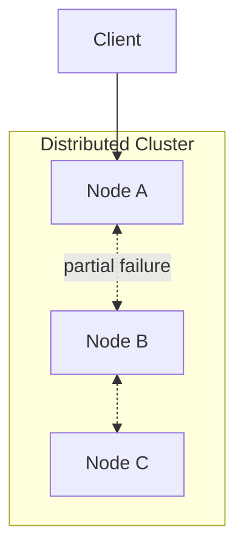

# Distributed Systems Foundations

Partial failure, safety, liveness, system models, and the building blocks every distributed design assumes.

*Figure: Independent nodes with partial failure — the defining constraint of distributed systems.*

## What You'll Learn

This domain establishes the vocabulary and mental models used throughout the curriculum. You will be able to explain why distribution is hard, separate safety from liveness, state assumptions about failures and timing, and design APIs that survive ambiguous outcomes.

## Chapters

| Chapter | Focus |
|---------|-------|
| [What Is a Distributed System?](/docs/distributed-systems-foundations/what-is-a-distributed-system) | Definition, independent failure, architectural consequences |
| [Partial Failure](/docs/distributed-systems-foundations/partial-failure) | Timeout ambiguity, retries, cascading failures |
| [Safety and Liveness](/docs/distributed-systems-foundations/safety-and-liveness) | Correctness properties and what can be guaranteed |
| [Distributed System Models](/docs/distributed-systems-foundations/distributed-system-models) | Sync vs async, crash vs Byzantine failures |
| [Failure Detectors](/docs/distributed-systems-foundations/failure-detectors) | Suspecting crashed nodes, lease-based detection |
| [Idempotency](/docs/distributed-systems-foundations/idempotency) | Safe retries, idempotency keys, deduplication |

## Learning Path

1. Start with **What Is a Distributed System?** for vocabulary and motivation.
2. Study **Partial Failure** and **Safety and Liveness** — these appear in every interview.
3. Read **Distributed System Models** before consensus and consistency chapters.
4. Finish with **Failure Detectors** and **Idempotency** — directly applicable to production APIs.

## Interview Prep

| Resource | Topic |
|----------|-------|
| [Stripe Payment Idempotency](/docs/real-world-scenarios/stripe-payment-idempotency) | Timeout ambiguity, duplicate charges |
| [Netflix Cascading Failure](/docs/real-world-scenarios/netflix-cascading-failure) | Retry storms, circuit breakers |
| [Lab 008 idempotent API](/docs/distributed-systems-foundations/idempotency#25-hands-on-exercise) | Intro idempotency on `:8081` / `:8091` (Docker) |
| [Lab 017 Stripe stack](/docs/real-world-scenarios/stripe-payment-idempotency#hands-on-lab-local) | Full PostgreSQL + Redis + webhooks on `:8080` |

## Prerequisites

- [Computer Architecture](/docs/computer-architecture/overview) — helpful for memory and concurrency intuition
- [Networking](/docs/networking/overview) — TCP, latency, partitions

## Next Domain

Continue to [Time, Ordering, and Coordination](/docs/time-ordering-and-coordination/overview), then [Consistency Models](/docs/consistency/overview).

Return to the [Curriculum Overview](/docs/start-here/curriculum-overview) for the full learning path.
