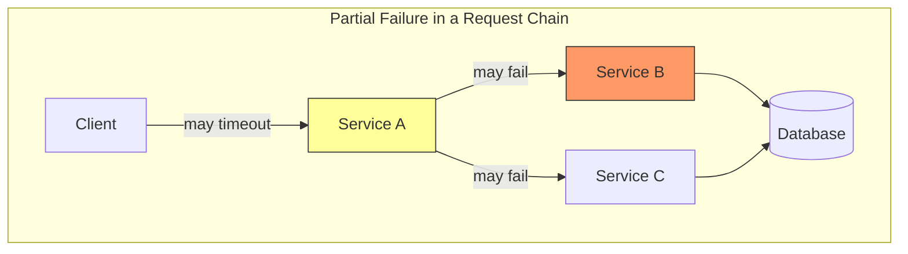
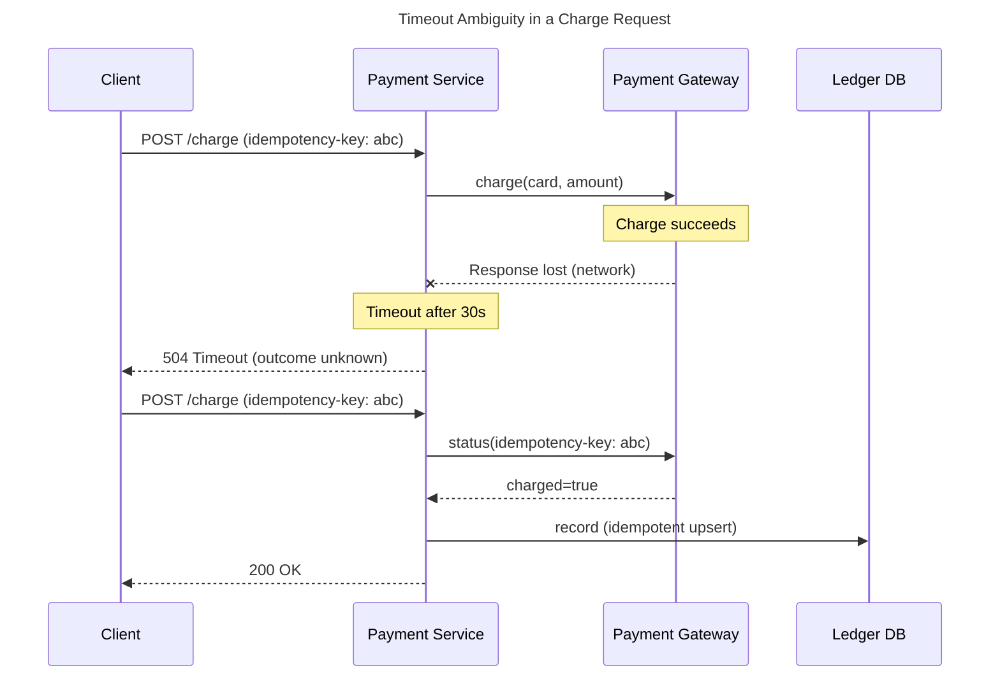
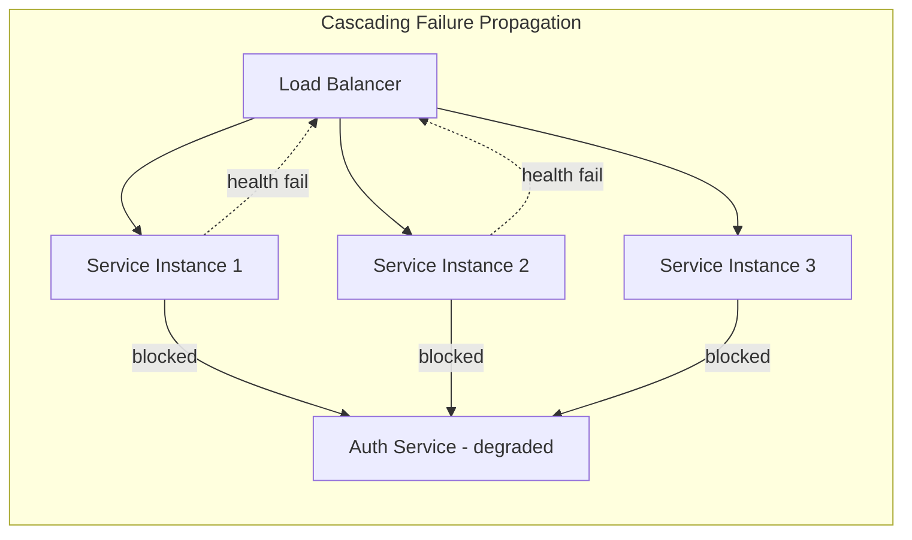

# Partial Failure

## 1. Executive Summary

Partial failure is the defining characteristic that separates distributed systems from single-machine programs. In a distributed system, some components can fail while others continue operating — a database replica may crash, a network link may drop, or a service may become slow without crashing. The rest of the system must detect ambiguity, preserve safety where possible, and degrade gracefully rather than collapse entirely.

This chapter explains why partial failure is inevitable, how it manifests in production, and what architectural patterns mitigate its impact. You will learn to reason about failure detection limits (including the FLP impossibility result), map failures to the [Fallacies of Distributed Computing](https://en.wikipedia.org/wiki/Fallacies_of_distributed_computing), and design systems that assume failure as the normal case rather than the exception.

**Key takeaway:** Every remote interaction is an unreliable message across an unreliable medium. Architecture that treats successful RPC calls as guaranteed is architecture that will fail in production.

---

## 2. Why This Topic Matters

Principal architects are evaluated on whether they design systems that survive real-world failure — not idealized LAN conditions. Interview panels at senior levels probe whether you understand that:

- A "healthy" load balancer can route traffic to an unhealthy backend.
- A timeout does not tell you whether work completed.
- Retries can convert a localized fault into a system-wide outage.
- Consensus algorithms exist precisely because nodes fail independently.

Partial failure is the root cause behind most distributed-systems complexity: replication, consensus, idempotency keys, circuit breakers, eventual consistency, and chaos engineering all exist because components fail independently. If you cannot articulate partial failure clearly, you cannot credibly defend tradeoffs in consistency, availability, or latency.

This topic connects directly to [Safety and Liveness](/docs/distributed-systems-foundations/safety-and-liveness), [Distributed System Models](/docs/distributed-systems-foundations/distributed-system-models), and every subsequent domain in this curriculum.

---

## 3. Problems Being Solved

Partial failure creates several interrelated problems that every distributed architecture must address:

| Problem | Description | Why it is hard |
|---------|-------------|----------------|
| **Failure detection** | Determine which nodes are down vs. slow | No perfect detector in asynchronous systems (FLP) |
| **Ambiguous outcomes** | Client cannot know if a request succeeded after timeout | Network may drop the response, not the request |
| **Inconsistent state** | Replicas diverge when some writes succeed and others do not | No shared memory; coordination is expensive |
| **Cascading overload** | Failed component causes retries that overwhelm survivors | Retry amplification without backpressure |
| **Gray failures** | Degraded nodes appear alive but behave incorrectly | Health checks pass; latency or correctness fails |

The goal is not to eliminate failure — that is impossible at scale — but to **bound blast radius**, **preserve invariants under fault**, and **recover automatically** where liveness permits.

---

## 4. Assumptions and System Model

We adopt a standard distributed-system model unless stated otherwise:

- **Processes** run on **nodes** connected by an **unreliable network**.
- **Crash-stop failures:** A node halts and does not resume (simplifying model). Byzantine failures (arbitrary/malicious behavior) are noted but not assumed unless specified.
- **Asynchronous timing:** Message delays are unbounded; local clocks are not trusted for correctness.
- **No shared memory:** Coordination requires message passing.

Under this model, the [FLP impossibility result](https://lamport.azurewebsites.net/pubs/fischer-lynch-paterson.pdf) (Fischer, Lynch, and Paterson, 1985) proves that in a fully asynchronous system with even one crash failure, no deterministic consensus algorithm can guarantee both **safety** (never decide wrongly) and **liveness** (eventually decide) in all executions. This is not a engineering inconvenience — it is a fundamental limit. Production systems work around it by weakening assumptions (partial synchrony, failure detectors with timeouts, randomized algorithms) or accepting bounded inconsistency.

**Assumption to state explicitly in designs:** "We assume crash-stop failures and an asynchronous network unless we introduce leases, epochs, or synchronized clocks for a specific subsystem."

---

## 5. Essential Terminology

| Term | Definition |
|------|------------|
| **Partial failure** | Some components fail while others continue; the system is neither fully up nor fully down |
| **Total failure** | All replicas or all paths fail; often easier to detect |
| **Fail-fast** | Detect failure quickly and return an error rather than block indefinitely |
| **Fail-silent** | A crashed node stops sending messages (crash-stop model) |
| **Gray failure** | A component is reachable but degraded; may violate SLOs without triggering health checks |
| **Split brain** | Partitioned nodes each believe they are authoritative, risking conflicting writes |
| **Blast radius** | Scope of impact when a component fails |
| **At-least-once delivery** | Message or operation may be delivered more than once; requires idempotency |
| **Exactly-once semantics** | Achieved in practice via idempotent operations + deduplication, not pure network magic |
| **Backpressure** | Signaling upstream to slow ingestion when downstream is overloaded |
| **Bulkhead** | Isolating resource pools so one tenant or dependency cannot exhaust shared capacity |

---

## 6. Core Mechanism

Partial failure propagates through **dependency chains**. A client calls Service A, which calls Services B and C, which each call a database. Any link in this chain can fail independently:



**Explanation:** Service B is shown as failed (red). Service A may still be running but cannot complete the request. The client may see a timeout even though Service C and the database are healthy. The failure boundary is *per link*, not per request tree.

The core mechanism for coping with partial failure is **defensive composition**:

1. **Timeouts** on every outbound call — bound wait time, but introduce ambiguity.
2. **Retries with jitter** — recover transient faults; risk amplification.
3. **Circuit breakers** — stop calling a known-bad dependency.
4. **Idempotency** — make retries safe.
5. **Bulkheads and quotas** — limit concurrent calls per dependency.
6. **Graceful degradation** — serve reduced functionality when dependencies fail.
7. **Reconciliation** — background jobs fix inconsistent state after ambiguous operations.

No single mechanism is sufficient. The architect's job is to compose them with explicit tradeoffs.

---

## 7. Step-by-Step Walkthrough

Consider a payment service charging a card via an external payment gateway.

**Step 1 — Happy path.** Client sends `POST /charge` with an idempotency key. Payment service calls the gateway, receives success, writes to the ledger, returns `200 OK`.

**Step 2 — Gateway slow, not down.** Payment service's outbound timeout fires at 30 seconds. The client receives `504 Gateway Timeout`. Unknown state: the gateway may have charged the card but the response was lost.

**Step 3 — Client retries** with the same idempotency key. Payment service checks its idempotency store: no record of success. It calls the gateway again.

**Step 4 — Gateway deduplicates** by idempotency key (if supported) or payment service queries gateway status before re-charging.

**Step 5 — Reconciliation job** runs hourly, comparing ledger entries against gateway settlement reports to catch any drift.



**Explanation:** The sequence diagram shows why timeouts alone are insufficient. The payment service must reconcile ambiguous outcomes through status queries, idempotency, and background reconciliation — not blind retries.

---

## 8. Invariants and Guarantees

When reasoning about partial failure, separate **safety** and **liveness** properties (see [Safety and Liveness](/docs/distributed-systems-foundations/safety-and-liveness)):

| Property | Under partial failure | Typical guarantee |
|----------|----------------------|-------------------|
| **Safety** | Bad things never happen | No double charge; no lost committed writes |
| **Liveness** | Good things eventually happen | Requests eventually complete or fail clearly |
| **Durability** | Committed data survives node crash | Replicated WAL with quorum ack |
| **Availability** | System responds to requests | May degrade; may choose CP or AP per partition |

**What you cannot guarantee** in an asynchronous system with crash failures:

- Perfect failure detection (a slow node is indistinguishable from a dead node until a timeout).
- Exactly-once delivery over an unreliable network without application-level deduplication.
- Simultaneous consistency and availability during a network partition (CAP theorem tradeoff space).

**What you can guarantee** with careful design:

- **At-most-once** or **at-least-once** with idempotency.
- **Bounded staleness** for reads from replicas.
- **Quorum intersection** for write safety when using majority replication.

State invariants explicitly: "Account balance never goes negative" is a safety invariant. "Every submitted payment is eventually settled or explicitly failed" is a liveness invariant. Partial failure often forces you to sacrifice liveness temporarily to preserve safety.

---

## 9. Failure Scenarios

### Scenario 1: Network Partition

Two data-center zones lose connectivity. Each zone's application tier can still reach its local database replica, but cross-zone replication stalls.

**Symptoms:** Elevated replication lag; split-brain risk if both sides accept writes; clients in each zone see locally consistent but globally divergent data.

**Mitigation:** Quorum-based writes requiring majority across zones; fencing tokens to prevent stale leaders from writing; read-your-writes routing to the leader; operator playbook for manual failover with explicit epoch bump.

**Interview signal:** Candidate distinguishes partition tolerance from partition *recovery* and names the consistency cost during the partition.

### Scenario 2: Slow Node (Gray Failure)

One of five database replicas develops a disk fault. It responds to pings and passes TCP health checks but read latency grows from 5 ms to 8 seconds.

**Symptoms:** Tail latency spikes; load balancer continues routing a fraction of traffic to the sick node; p99 latency violates SLO while mean latency looks fine.

**Mitigation:** Latency-aware load balancing; outlier detection (e.g., eject replicas exceeding peer latency by a factor); active health checks that measure query latency, not just port open; redundant reads with merge (as in Dynamo-style systems).

**Interview signal:** Candidate mentions that **the network is not the only source of partial failure** — degraded hardware and GC pauses are equally common.

### Scenario 3: Cascading Failure

A downstream authentication service slows due to a connection pool leak. Upstream services block threads waiting for auth, exhaust their own pools, and fail health checks. The load balancer removes them, concentrating traffic on remaining instances, which also fail.

**Symptoms:** Correlated failures across seemingly independent services; retry storms; error rate climbs exponentially over minutes.

**Mitigation:** Timeouts shorter than client patience; circuit breakers; bulkheads isolating auth thread pools; retry budgets (cap retries as a percentage of total traffic); load shedding at the edge; autoscaling on saturation signals, not just CPU.



**Explanation:** As instances fail health checks, the load balancer shifts traffic to survivors, accelerating overload. The root cause (auth) is a small fraction of the blast radius.

---

## 10. Performance Characteristics

Partial failure dominates **tail latency**, not mean latency. A single slow dependency in a serial call chain determines end-to-end latency:

If Service A calls B and C **serially**, and each has independent availability \(p\), the combined success probability is \(p^2\). With \(p = 0.999\) (three nines per service), the chain succeeds only \(0.999^2 \approx 0.998\) — roughly two nines for the composed path.

For **parallel** calls with "all must succeed" semantics, the same \(p^2\) applies. With "any one suffices" semantics, combined availability is \(1 - (1-p)^2\).

**Tail latency compounding:** If a request fans out to 100 shards and you need responses from all shards, the probability that at least one shard is slow at the p99 level approaches certainty at scale. This is why large-scale systems use **hedged requests**, **speculative retry**, or **relaxed consistency** — not because mean latency is high, but because tail events dominate at scale.

Do not cite specific production p99 numbers unless sourced. The structural argument — serial dependencies multiply failure probability; fan-out amplifies tail latency — holds regardless of constants.

---

## 11. Scalability Limits

Partial failure becomes harder as:

- **Fan-out grows:** More shards, more chances for one straggler.
- **Dependency depth grows:** More hops, more timeout ambiguity.
- **Multi-tenancy increases:** Noisy neighbors cause gray failures for others.
- **Geographic distribution increases:** Partitions and latency variance rise.

**Scaling breakpoints:**

| Scale signal | Failure mode | Architectural response |
|--------------|--------------|------------------------|
| 10+ synchronous hops | Timeout stacking | Async workflows, sagas, event-driven |
| 100+ shard fan-out | Straggler dominance | Scatter-gather with deadline propagation |
| Multi-region | Partition frequency | CRDTs, conflict resolution, active-passive |
| 1000+ microservices | Cascading failure | Bulkheads, mesh-level outlier detection |

The limit is not throughput alone — it is the **probability that at least one component is in a failed or degraded state** at any moment, which approaches 1 as component count grows (related to the "large numbers" argument in site reliability practice).

---

## 12. Operational Considerations

**Detection:** Metrics on error rate, latency histograms, saturation, and *useful* health checks. Synthetic probes that exercise critical paths. Distributed tracing to locate which hop failed.

**Response:** Runbooks for partition, single-node degradation, and cascading failure. Pre-defined degradation modes (disable recommendations, serve cached catalog). Feature flags to shed load.

**Recovery:** Verify data consistency after failover. Replay from durable logs. Post-incident review distinguishing root cause from amplifying factors.

**Chaos engineering:** Deliberately inject latency, packet loss, and process kills in staging (and carefully in production) to validate assumptions. A system that has never been tested under partial failure will fail under partial failure.

**On-call reality:** Alerts should fire on **user-visible SLO burn**, not only on instance death. Gray failures are the leading cause of "the dashboards look fine but customers are angry."

---

## 13. Security Considerations

Partial failure intersects security:

- **Fail-open vs. fail-closed:** When the auth service is unreachable, should the API deny all traffic (secure, unavailable) or allow cached credentials (available, risky)? This is a product and compliance decision, not purely technical.
- **Retry amplification as DoS:** An attacker triggering expensive retries can overload a system more effectively than direct requests. Rate limiting and retry budgets apply to adversarial as well as benign clients.
- **Split-brain and fencing:** A stale primary that resumes writing after a partition can corrupt data. Fencing tokens or epoch numbers prevent zombie leaders from committing.
- **Information leakage:** Detailed error messages from failed internal services can reveal topology. Return generic errors to clients; log specifics internally.

---

## 14. Cost Considerations

Fault tolerance has direct cost:

- **Replication:** N replicas mean roughly N times storage and write-path cost (often reduced by quorum).
- **Multi-AZ / multi-region:** Cross-zone traffic charges and idle standby capacity.
- **Idempotency stores:** Additional storage and lookup latency per mutating request.
- **Over-provisioning for burst:** Capacity headroom to absorb retry storms without saturation.

**Cost-aware resilience:** Not every path needs three-nines availability. Tier services by criticality; use async processing for non-critical paths; accept eventual consistency where the business allows. The principal architect articulates **which failures are worth preventing at what cost**.

---

## 15. Production Implementations

Patterns seen in production systems (implementation choices, not universal law):

| Pattern | Where it appears | Role in partial failure |
|---------|------------------|-------------------------|
| **Circuit breaker** | Netflix Hystrix, resilience4j, service meshes | Stop calling failing dependencies |
| **Bulkhead thread pools** | Hystrix, Envoy connection limits | Isolate failure per dependency |
| **Idempotency keys** | Stripe API, AWS S3 conditional writes | Safe retries after timeout |
| **Quorum reads/writes** | Cassandra, DynamoDB, etcd | Survive minority replica failure |
| **Leader election + fencing** | Kafka, ZooKeeper, Raft implementations | Single writer during normal operation |
| **Outlier detection** | gRPC, Envoy | Eject slow endpoints |
| **Durable execution / sagas** | Temporal, Cadence | Recover multi-step workflows after crash |

Study one system's postmortem (see [Production Failures](/docs/production-failures/overview)) after reading this chapter to connect theory to incident narratives.

---

## 16. Alternatives and Tradeoffs

| Approach | Pros | Cons | When to use |
|----------|------|------|-------------|
| **Synchronous RPC chain** | Simple mental model | Failure multiplies; tail latency stacks | Low hop count, strong consistency needed |
| **Async messaging** | Decouples failure domains | Complexity, eventual consistency | High throughput, fault isolation |
| **Cache fallback** | Maintains availability | Stale data | Read-heavy, tolerable staleness |
| **Active-active multi-region** | Low failover time | Conflict resolution, partition risk | Global latency requirements |
| **Active-passive failover** | Simpler consistency story | Failover time, idle cost | RPO/RTO allow minutes of recovery |
| **Chaos testing** | Validates real behavior | Risk if poorly scoped | Mature ops culture |

There is no "most resilient" architecture — only architecture matched to **failure modes you prioritize** and **SLOs you commit to**.

---

## 17. Common Misconceptions

1. **"We'll use retries, so failures are handled."** — Retries without idempotency cause duplicates; retries without budgets cause cascades.

2. **"Health checks prove a service is healthy."** — They prove a port responded. Gray failures violate SLOs while passing checks.

3. **"Timeouts mean the operation failed."** — Timeouts mean you do not know. The operation may have succeeded.

4. **"The network is reliable."** — First fallacy of distributed computing (Deutsch et al.). Packets drop, switches fail, DNS lies.

5. **"More replicas always mean more availability."** — Without correct quorum and fencing, more replicas can mean more split-brain risk.

6. **"Microservices isolate failure."** — They isolate *deployment*; they *couple* failure if synchronously chained without defensive patterns.

7. **"FLP means consensus is impossible."** — FLP applies to deterministic algorithms in fully asynchronous systems. Real systems use timeouts (partial synchrony), randomization, or accept brief unavailability.

---

## 18. Principal Architect Perspective

At principal level, interviewers want more than pattern names. They want:

- **Explicit system-model statements** when proposing designs.
- **Blast-radius analysis** for each dependency.
- **Business alignment:** "We accept duplicate charges are worse than delayed charges, so we fail closed and reconcile."
- **Organizational design:** Who owns the SLO for shared dependencies? How do teams coordinate timeout values across call chains?
- **Evolution path:** How does the design degrade at 10x traffic or during a regional outage?

Frame partial failure as a **design constraint**, not an operational afterthought. The best architects design APIs, data models, and deployment boundaries so that failure is **contained**, **observable**, and **recoverable** by default.

**Red flags in architecture reviews:** Unbounded retries, no idempotency on mutations, shared connection pools across tenants, synchronous chains deeper than three hops without async escape hatches, no defined degradation mode.

---

## 19. Architecture Review Exercise

**Scenario:** A global e-commerce platform serves product pages by synchronously calling Inventory, Pricing, Recommendations, and Reviews services. p99 page load SLO is 500 ms. During a sale event, the Recommendations team deploys a change that increases latency from 50 ms to 2 seconds. Page error rate spikes.

**Your task:**

1. Draw the dependency graph and identify failure propagation paths.
2. List three architectural changes that would reduce blast radius (with tradeoffs).
3. Define degradation behavior when Recommendations exceeds 200 ms.
4. Specify metrics and alerts that would have caught this before customers.
5. State safety and liveness properties for the product page.

**Evaluation rubric:**

| Score | Criteria |
|-------|----------|
| **Strong** | Names cascading failure, proposes timeout/deadline propagation, circuit breaker or async cache for recommendations, defines SLO-based alerts on burn rate |
| **Adequate** | Mentions caching and timeouts but no idempotency or organizational ownership |
| **Weak** | "Scale up Recommendations" without addressing synchronous coupling |

---

## 20. Whiteboard Explanation

**60-second version:**

"In a distributed system, components fail independently — that's partial failure. Unlike a single program that crashes entirely, one microservice can die while others keep running. The hard part is ambiguity: after a timeout, you don't know if the request succeeded. FLP proves you can't even solve consensus perfectly in an async system with crashes. So we design with timeouts, idempotency, circuit breakers, and quorums. We assume failure is normal and bound the blast radius."

**Whiteboard sketch:**

```
[Client] --timeout?--> [Service] --retry?--> [DB primary]
                          |                      |
                     circuit open            [DB replica - stale]
```

Label: failure boundaries on every arrow; "unknown" zone after timeout.

---

## 21. Interview Questions

1. What is partial failure, and how does it differ from failure in a monolithic application?

2. Why does a timeout not prove that an operation failed?

3. Explain the FLP impossibility result and its practical implications for system design.

4. Name three of the [Fallacies of Distributed Computing](https://en.wikipedia.org/wiki/Fallacies_of_distributed_computing) and describe how each leads to production incidents.

5. What is a gray failure? How would you detect and mitigate it?

6. How can retries cause a cascading failure? What defenses do you use?

7. Design an idempotent payment API that handles duplicate client retries safely.

8. Compare fail-open and fail-closed when an authentication dependency is unavailable.

9. A network partition splits your cluster into two halves. What happens if both sides continue accepting writes?

10. How does partial failure relate to the CAP theorem?

11. You have a 10-service synchronous chain. How do you reason about end-to-end availability?

12. What is the difference between at-least-once, at-most-once, and exactly-once delivery?

**Expected answer signals:** Independent failure of components; timeout ambiguity; FLP and partial synchrony workarounds; fallacies (network reliable, latency zero, bandwidth infinite); idempotency keys; circuit breakers and bulkheads; quorum and fencing; safety vs. liveness tradeoff under partition.

**Red flags:** "We use Kubernetes so it handles failures"; "exactly-once is built into Kafka" without nuance; no mention of ambiguous outcomes.

---

## 22. Interview Follow-Ups

1. **After Q3 (FLP):** "How does Raft get around FLP?" — *Expect: partial synchrony via election timeouts; leader-based approach sacrifices availability during partition to preserve safety.*

2. **After Q6 (cascading failure):** "How do you set retry budget vs. user-facing timeout?" — *Expect: retries must fit inside client deadline; jittered exponential backoff; cap retry percentage of total RPS.*

3. **After Q7 (idempotent payment):** "What if the idempotency store is down?" — *Expect: fail closed on mutations; queue for later; distinguish read vs. write path.*

4. **After Q9 (partition):** "How does Amazon Dynamo handle partition tolerance?" — *Expect: eventual consistency, vector clocks or last-writer-wins, conflict resolution; availability during partition at consistency cost.*

5. **After Q10 (CAP):** "Is CAP still useful?" — *Expect: useful as a forcing function for partition behavior; limited for multi-dimensional tradeoffs; PACELC extension.*

6. **Principal-level:** "How do you get 20 teams to adopt consistent timeout and retry policies?" — *Expect: platform standards, service mesh defaults, SLO contracts, automated linting of client configs, incident-driven adoption.*

---

## 23. Strong Answer Example

**Question:** "A client times out calling your service. What happened, and what should happen next?"

**Strong answer:**

"After a timeout, we are in an **ambiguous state** — we cannot conclude the operation failed. The request may still be in flight, the server may have processed it and lost the response, or the server may have crashed before processing. FLP tells us we cannot instantly distinguish a slow node from a dead one in an async model.

Our client should retry only if the operation is **idempotent**, using the same idempotency key. Our service, on receiving a retry, should check whether the original operation completed — via an idempotency store or by querying downstream state — before re-executing side effects.

We set timeouts based on SLO budgets: if the page SLO is 500 ms, internal calls cannot each use 500 ms. We propagate deadlines. If the dependency is consistently timing out, the circuit breaker opens and we **degrade** — return cached data or a clear error rather than blocking.

For a payment, we fail closed: we do not guess. We reconcile asynchronously against the payment gateway's settlement file. Safety over liveness for money."

---

## 24. Weak Answer Example

**Question:** "A client times out calling your service. What happened, and what should happen next?"

**Weak answer:**

"The service probably crashed. The client should retry a few times. We have Kubernetes, so it will restart the pod automatically. We also have three replicas so we're highly available."

**Why this is weak:** Assumes failure mode without acknowledging ambiguity; retries without idempotency; conflates orchestration with application-level correctness; no mention of safety, circuit breaking, or reconciliation; "three replicas" does not address timeout semantics.

---

## 25. Hands-On Exercise

**Exercise: Failure Injection and Observation**

**Prerequisites:** Docker, a simple HTTP service (provided or self-written), `toxiproxy` or Linux `tc netem`.

**Steps:**

1. Deploy a three-tier app: `client` → `api` → `db` (use any lightweight stack).
2. Inject 500 ms latency on the `api` → `db` link. Measure p50 and p99 end-to-end latency.
3. Add a 2-second client timeout. Observe error rate vs. actual completed writes.
4. Implement idempotency keys on a `POST` endpoint. Retry 10 times; verify exactly one row created.
5. Add a circuit breaker. Sustain db latency until breaker opens. Observe fail-fast behavior and recovery.
6. Document: Which fallacies of distributed computing did you observe?

**Success criteria:** Written summary of ambiguous outcomes observed, one diagram of failure propagation, and a recommendation for timeout values based on measured latency percentiles (not invented constants).

---

## 26. Knowledge Check

1. True or false: A failed health check proves a node is down. *(False — inverse is not guaranteed either; gray failures pass checks.)*

2. What property does FLP say is impossible in a fully asynchronous crash-stop system? *(Deterministic consensus with both safety and liveness.)*

3. Why must mutating retries use idempotency keys? *(Timeout does not imply failure; duplicate execution without idempotency violates safety.)*

4. Name two mechanisms that reduce cascading failure. *(Circuit breaker, bulkhead, retry budget, load shedding, backpressure — any two.)*

5. During a partition, can a CP system and an AP system both remain fully available? *(CP sacrifices availability; AP sacrifices strong consistency — per CAP framing.)*

6. What is the difference between crash-stop and Byzantine failure? *(Crash-stop halts; Byzantine may send arbitrary/wrong messages.)*

7. If two independent services each have 99.9% availability and a request needs both serially, what is approximate combined availability? *(≈ 99.8% or 0.999².)*

---

## 27. Flashcards

| Front | Back |
|-------|------|
| Partial failure | Some components fail while others continue operating |
| FLP impossibility | No deterministic consensus in fully async system with one crash |
| Gray failure | Node reachable but degraded; hard to detect via simple health checks |
| Timeout ambiguity | After timeout, outcome may be success, failure, or unknown |
| Idempotency key | Client-supplied token ensuring retries do not duplicate side effects |
| Circuit breaker | Stops calls to failing dependency to prevent cascade |
| Bulkhead | Isolated resource pool limiting blast radius per dependency |
| Split brain | Partitioned nodes both act as authority, risking divergence |
| Fail-open vs. fail-closed | Allow traffic vs. deny when dependency fails — security/availability tradeoff |
| Retry storm | Amplified load from many clients retrying simultaneously |
| Fallacy: network is reliable | Packets drop; designs must assume loss and partition |
| Quorum | Minimum replicas that must agree to commit a write |

---

## 28. Cheat Sheet

**Assume:** Every remote call can fail, hang, or succeed with a lost response.

**Always:** Timeouts · Idempotency on mutations · Deadline propagation · Metrics on tail latency

**Contain:** Circuit breakers · Bulkheads · Retry budgets with jitter · Load shedding

**Recover:** Reconciliation jobs · Durable logs · Quorum replication · Fencing stale leaders

**Detect:** SLO-based alerts · Outlier ejection · Synthetic probes · Distributed tracing

**Articulate:** Safety vs. liveness · System model · Blast radius · Degradation mode

**FLP takeaway:** Perfect failure detection is impossible; use timeouts and accept tradeoffs.

**Fallacies reminder:** Network not reliable · Latency not zero · Bandwidth not infinite · Topology changes · Transport not secure.

---

## 29. Related Concepts

- [What Is a Distributed System?](/docs/distributed-systems-foundations/what-is-a-distributed-system) — Prerequisite; defines nodes, messages, and independence
- [Safety and Liveness](/docs/distributed-systems-foundations/safety-and-liveness) — Formal properties under failure
- [Distributed System Models](/docs/distributed-systems-foundations/distributed-system-models) — Sync vs. async assumptions
- [Replication](/docs/replication/overview) — How copies survive node failure
- [Consensus](/docs/consensus/overview) — Agreement despite crash failures
- [Reliability and Resilience](/docs/reliability-and-resilience/overview) — SLOs, error budgets, chaos engineering
- [Microservices](/docs/microservices/overview) — Service coupling and failure domains
- [Production Failures](/docs/production-failures/overview) — Real postmortems and lessons learned
- [Real-World Scenario: Stripe Payment Idempotency](/docs/real-world-scenarios/stripe-payment-idempotency) — Step-by-step interview walkthrough for timeout ambiguity

---

## 30. References

### Primary sources

- Fischer, M. J., Lynch, N. A., & Paterson, M. S. (1985). [Impossibility of Distributed Consensus with One Faulty Process](https://lamport.azurewebsites.net/pubs/fischer-lynch-paterson.pdf). *Journal of the ACM* — The FLP impossibility result.
- Lamport, L., Shostak, R., & Pease, M. (1982). [The Byzantine Generals Problem](https://lamport.azurewebsites.net/pubs/byz.pdf). *ACM Transactions on Programming Languages and Systems* — Fault models beyond crash-stop.
- Deutsch, P., et al. [Fallacies of Distributed Computing](https://en.wikipedia.org/wiki/Fallacies_of_distributed_computing) — Foundational assumptions that fail in production (originally circulated at Sun Microsystems; widely cited in practitioner literature).

### Books and practitioner texts

- Kleppmann, M. (2017). *Designing Data-Intensive Applications*. O'Reilly — Chapters on replication, consistency, and fault tolerance.
- Burns, B., & Beda, J. (2019). *Kubernetes: Up and Running*. O'Reilly — Orchestration does not replace application-level failure handling.
- Beyer, B., et al. (2016). *Site Reliability Engineering*. O'Reilly — Cascading failure, overload management, and SLO practice.
- Hohpe, G., & Woolf, B. (2003). *Enterprise Integration Patterns*. Addison-Wesley — Messaging patterns for failure decoupling.

### Production experience and gray failures

- Huang, L., et al. (2017). [The Tail at Store: A Revelation from Millions of Hours of Disk and SSD Deployments](https://www.usenix.org/conference/fast17/technical-sessions/presentation/huang) — Tail latency and hardware variability at scale.
- Amazon Web Services. [Amazon Builder's Library: Reliability](https://aws.amazon.com/builders-library/reliability/) — Production resilience patterns (implementation choices).

### Distinguish guarantee types

| Claim type | Example in this chapter |
|------------|---------------------------|
| **Formal guarantee** | FLP impossibility; quorum intersection for write safety |
| **Implementation choice** | Circuit breakers in Hystrix/Envoy; Stripe idempotency keys |
| **Operational practice** | Chaos engineering; SLO burn-rate alerting |

*TODO: Add formal entries to `references/papers.yaml` for FLP and Byzantine Generals when bibliography curation phase begins.*
