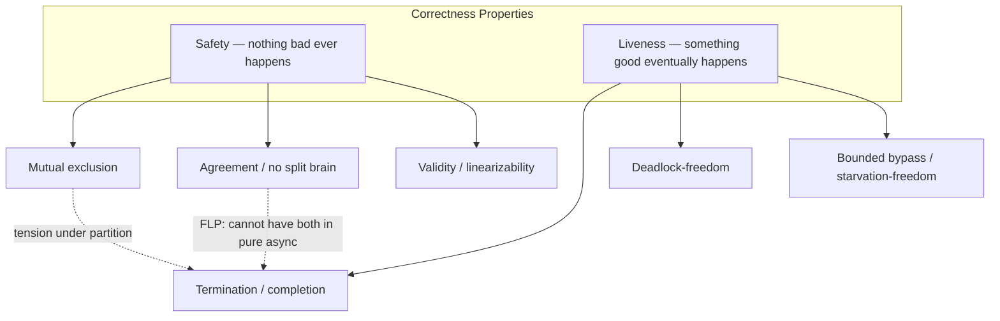
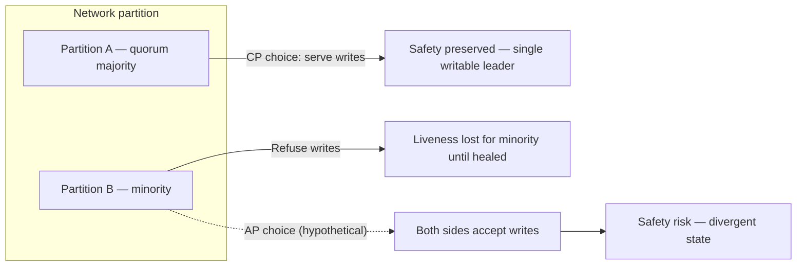
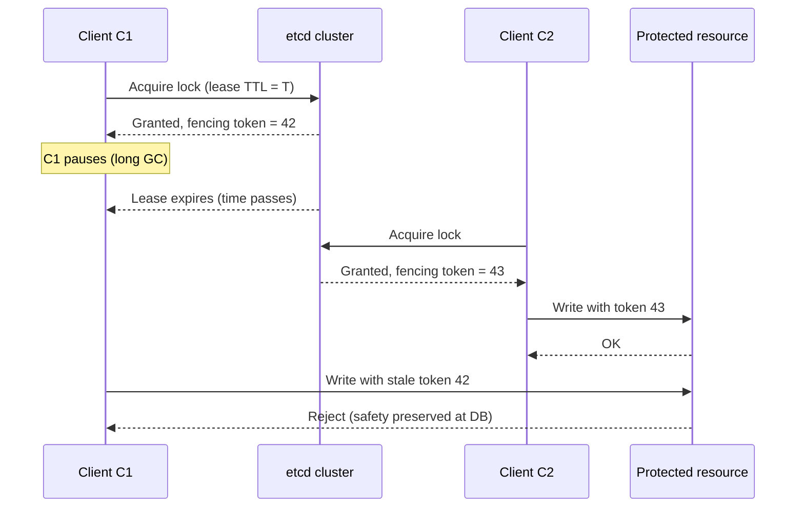

# Safety and Liveness

## 1. Executive Summary

Distributed systems fail in ways that single-machine programs do not. Processes crash, networks delay and drop messages, and clocks disagree. When you design coordination primitives—locks, leader election, consensus, transactional commit—you are really choosing which **correctness properties** the system will uphold under those failures.

Two families dominate the literature and interview room:

- **Safety properties** answer: *Can something forbidden ever happen?* If a safety property is violated, you can point to a finite moment when it broke—for example, two clients both believing they hold the same exclusive lock, or two replicas committing incompatible writes.
- **Liveness properties** answer: *Will something desirable eventually happen?* A liveness violation requires an infinite wait: a request that never completes, a leader that is never elected, a transaction that never commits or aborts.

Safety and liveness are not opposites; mature protocols pursue both. The engineering tension appears when partial failure forces a choice: preserve safety by stopping progress, or preserve liveness (availability) at the risk of inconsistency. The Fischer–Lynch–Patterson (FLP) impossibility result shows that in a fully asynchronous model with even one crash failure, deterministic consensus cannot guarantee both safety and termination. Production systems therefore embed **timeouts**, **quorums**, **fencing tokens**, and **operational guardrails** to navigate that gap.

This chapter formalizes safety and liveness, walks through mutual exclusion and consensus as canonical examples, introduces **termination** and **bounded bypass** (starvation-freedom), and connects the theory to etcd, PostgreSQL, and other systems you will encounter in architecture reviews and principal-level interviews.

## 2. Why This Topic Matters

Principal architects are judged on whether they can **name the invariant** a design protects and **predict what breaks** when that invariant is relaxed.

Interviewers use safety and liveness to separate candidates who memorize CAP from those who reason about protocols:

- Why does Raft refuse to elect two leaders simultaneously? **Safety.**
- Why might a healthy etcd cluster appear "stuck" during a partition? **Liveness** (or availability) tradeoff.
- Why is "we'll add retries until it works" insufficient for a distributed lock? Retries address **liveness**; without **fencing**, **safety** can still fail.

In production, mislabeling a property leads to real incidents: treating eventual consistency as "safe enough" for financial balances, or assuming a health check guarantees progress when the system is live-locked. Explicit safety/liveness vocabulary aligns engineering, SRE, and product on what "correct" means and what outage modes remain acceptable.

## 3. Problems Being Solved

| Problem | Safety concern | Liveness concern |
|---------|----------------|------------------|
| Mutual exclusion | Two holders of the same lock | A waiter never enters the critical section |
| Consensus | Processes decide different values | Correct processes never decide |
| Transaction commit | Double commit or lost updates | Transactions hang indefinitely |
| Leader election | Split brain (two leaders) | No leader elected |
| Replication | Divergent histories exposed as truth | Stale reads forever; lag unbounded |

Without a shared vocabulary, teams debate "availability" vs. "consistency" without specifying **which bad thing** must never happen and **which good thing** must eventually happen.

## 4. Assumptions and System Model

Throughout this chapter, assume the **partial failure** model from the prerequisite chapter: processes are autonomous, the network is unreliable (messages can be lost, duplicated, reordered, or delayed without bound), and there is no perfect failure detector unless stated otherwise.

We distinguish:

| Model dimension | Options | Effect on safety/liveness |
|-----------------|---------|---------------------------|
| Timing | Asynchronous vs. partially synchronous | FLP applies in pure async; real systems use clocks and timeouts (partial synchrony) |
| Failure | Crash-stop vs. Byzantine | Byzantine failures break more safety properties; crash-stop is the default for databases and etcd |
| Membership | Static vs. dynamic | Membership changes require extra safety rules (e.g., joint consensus in Raft) |

**Important:** Safety and liveness are defined relative to a **specification** and a **failure model**. A property that is liveness under crash failures may become impossible under Byzantine behavior without additional assumptions.

## 5. Essential Terminology

| Term | Definition |
|------|------------|
| **Safety** | A property stating that something bad never happens. Violations are detectable in a **finite** prefix of an execution. |
| **Liveness** | A property stating that something good eventually happens. Violations require an **infinite** execution that never satisfies the property. |
| **Invariant** | A condition that holds in every reachable state of a correct system; often the formal expression of a safety property. |
| **Mutual exclusion** | At most one process occupies the critical section at any time. |
| **Deadlock-freedom** | If some process requests the critical section, some request is eventually granted (system-level progress). |
| **Starvation-freedom / bounded bypass** | Every requesting process eventually enters; equivalently, there is a bound on how many times others may bypass a waiter. |
| **Consensus** | Agreement (all correct processes decide the same value), validity (only proposed values are decided), and **termination** (every correct process eventually decides). |
| **Termination** | A liveness property: the protocol does not run forever without delivering a result to correct participants. |
| **Linearizability** | A safety condition for concurrent objects: operations appear to occur at some instant between invocation and response, respecting sequential semantics. |
| **Fencing token** | A monotonically increasing token issued with a lease; storage rejects stale holders even if they believe they still hold the lock—restores safety when liveness heuristics fail. |

**Mnemonic (informal, not formal):** *Safety = never wrong; liveness = don't wait forever.* Use the formal prefix/suffix definitions in interviews when precision matters.

## 6. Core Mechanism

### Formal intuition

Following Lamport and subsequent textbooks (see References), classify a property \(P\) of executions:

- **Safety (prefix-closed):** If an execution violates \(P\), some **finite prefix** of that execution already violates \(P\). Equivalently: once the system is in a "good" state with respect to \(P\), it cannot become bad.
- **Liveness (suffix-closed):** For every finite prefix of an execution, there exists an **extension** that satisfies \(P\). Equivalently: no finite failure proves liveness impossible—you need an infinite stall or divergent behavior.

Every property can be expressed as the intersection of a safety property and a liveness property (the decomposition is not unique, but the classification guides design).

### Property taxonomy



*Figure 1: Taxonomy of safety and liveness properties in coordination protocols. Dashed edges highlight classic tensions when the network or processes fail.*

Safety properties are **preserved by doing less** (refuse to act). Liveness properties require **sufficient progress** (eventually act). Under partial failure, protocols often implement a **fail-safe** mode: sacrifice liveness locally to preserve global safety.

### Mutual exclusion: safety first, then progress

The mutual exclusion problem requires:

1. **Safety (mutual exclusion):** At most one process is in the critical section.
2. **Liveness (deadlock-freedom):** If processes request entry, some entry eventually occurs.
3. **Liveness (bounded bypass):** Each requesting process eventually enters; no infinite bypass by others.

Algorithms like Lamport's bakery algorithm or mutexes built on compare-and-swap illustrate the layering: the atomic step provides safety; the queue or ticket ordering provides bounded bypass.

### Consensus: safety vs. termination

Consensus combines:

| Property | Type | Statement |
|----------|------|-----------|
| Agreement | Safety | No two correct processes decide different values |
| Validity | Safety | Any decided value was proposed by some process |
| Integrity | Safety | A process decides at most once |
| Termination | Liveness | Every correct process eventually decides |

The **FLP impossibility result** (Fischer, Lynch, Patterson, 1985) proves that in an asynchronous system where messages may be delayed without bound, no deterministic consensus protocol tolerating even one crash failure can guarantee **both** agreement (safety) and termination (liveness) for all executions. Real systems escape this by:

- Assuming **partial synchrony** (eventually messages arrive within unknown bounds)
- Using **randomized** algorithms (termination with probability 1)
- Employing **failure detectors** with imperfect but useful accuracy
- Choosing **CP** behavior during partitions (sacrifice liveness)



*Figure 2: During a partition, preserving mutual exclusion or consensus safety typically requires one side to stop making progress.*

## 7. Step-by-Step Walkthrough

### Walkthrough A: Distributed lock with lease

Consider a service acquiring an exclusive lock in etcd using a lease-based key.

1. **Request:** Client C1 calls `grant` + `put` with a lease on key `/lock/resource`.
2. **Safety mechanism:** Only one key holder at a time if etcd linearizable semantics hold and clients respect lease expiry.
3. **Liveness mechanism:** If C1 crashes, the lease TTL expires and C2 can acquire.
4. **Failure — delayed C1:** C1 is paused (GC, VM freeze) but believes it holds the lock. Lease expires; C2 acquires. Both may act unless storage checks a **fencing token** (safety restored at the resource, not only at the lock service).

**Sequence (safety vs. liveness):**



*Figure 3: Lease expiry provides liveness for other waiters; fencing at the resource preserves safety when the first holder wakes late.*

### Walkthrough B: Raft leader election (conceptual)

1. **Safety:** At most one leader per term with a quorum of votes; log matching prevents committed entries from being overwritten.
2. **Liveness:** If a leader fails, followers timeout and elect a new leader, eventually.
3. **Tradeoff:** During a partition, the minority partition cannot commit new entries (liveness loss) rather than risk double leadership (safety loss).

## 8. Invariants and Guarantees

| Protocol / system | Primary safety invariants | Primary liveness guarantees |
|-------------------|----------------------------|----------------------------|
| Mutex / lock | ≤1 holder in critical section | Eventually a waiter enters (if algorithm is starvation-free) |
| Raft | Election safety; log matching; leader completeness | Eventually elect leader if majority reachable |
| 2PC (two-phase commit) | Atomic decision recorded at coordinator | Blocked if coordinator or cohort crashes mid-protocol (classic liveness hole) |
| Linearizable register | Operations appear sequential and respect real-time order | Operations complete if invoked (under crash model of the implementation) |
| PostgreSQL sync replication | No acknowledged commit lost on listed synchronous standbys | Writes may block if synchronous standby unavailable |

When reviewing a design, list invariants as **predicates on state** (safety) and **eventually properties** (liveness). Example Raft invariant: *if a log entry is committed in term T, it appears in all higher-term leaders' logs.*

## 9. Failure Scenarios

### Scenario 1: Split brain after network partition (safety vs. liveness)

**Setup:** A five-node database cluster; partition isolates two nodes from three.

| Choice | Safety | Liveness |
|--------|--------|----------|
| Majority partition continues as primary | Preserved if only majority accepts writes | Minority loses write liveness |
| Both partitions accept writes | **Violated** — divergent histories | Both sides remain "available" |

**Principal takeaway:** "Highly available" during partition without merge conflict handling is often a **safety** gamble, not a free lunch.

### Scenario 2: Coordinator crash in two-phase commit (liveness failure)

**Setup:** Transaction coordinator commits Phase 1 (all participants vote yes), then crashes before sending commit to participants.

**Safety:** Participants may block holding locks, avoiding incorrect commit/abort disagreement if designed conservatively.

**Liveness:** Participants cannot complete until coordinator recovers or manual intervention runs—a **blocking** protocol. Heuristic commits and three-phase commit trade complexity for improved liveness under some failures; each variant shifts the safety/liveness boundary.

### Scenario 3: Live lock vs. deadlock in lock service

**Setup:** Many clients retry lock acquisition with identical backoff after lease expiry events.

**Safety:** Mutual exclusion may still hold at the lock service.

**Liveness:** System-wide throughput collapses; some clients experience unbounded delay (starvation) without bounded bypass or jittered backoff—**liveness degradation** without a safety violation.

**Mitigation:** Exponential backoff with jitter, fair queuing, fencing tokens at resources, and SLOs on lock hold time.

### Scenario 4: etcd quorum loss (liveness stall, safety preserved)

**Setup:** Kubernetes control plane loses etcd quorum during an availability zone failure.

**Safety:** etcd refuses linearizable writes without quorum—no arbitrary forked state.

**Liveness:** API server operations depending on etcd stall. Cluster operators must restore quorum or fail over—an operational liveness recovery, not automatic in all deployments.

## 10. Performance Characteristics

Safety mechanisms often add **synchronization points**: quorum round-trips, fsync on a majority, lock handoffs. Liveness mechanisms add **timeouts, retries, and elections**, which create load spikes after failures.

| Mechanism | Typical cost driver | Safety/liveness role |
|-----------|--------------------|-----------------------|
| Quorum reads/writes | RTT × log replication | Safety via majority overlap |
| Lease TTL | False suspicion vs. slow recovery | Liveness after crash; tunable |
| Fencing token check | Extra field per request | Safety at shared resources |
| Paxos/Raft elections | Chatter under flaky network | Liveness recovery; tunable timeouts |

Avoid quoting universal latency numbers; measure for your topology. Qualitatively, **stronger safety usually costs round-trips and reduces availability under partition**.

## 11. Scalability Limits

- **Lock granularity:** Fine-grained locks improve liveness (less contention) but multiply safety surfaces (more keys to fence).
- **Quorum size:** Larger quorums strengthen durability assumptions but shrink the partition size that can remain live.
- **Leader-based designs:** Single leader simplifies safety; leader becomes liveness bottleneck and failover sensitivity point.
- **Consensus group size:** Raft/Paxos throughput often scales with leader capacity, not arbitrary member count—adding nodes improves fault tolerance, not linear write scalability.

## 12. Operational Considerations

- **Runbooks should state which property is sacrificed in degraded mode** (e.g., "read-only mode preserves safety; writes blocked").
- **Alert on liveness SLOs:** leader election storms, lock wait time, transaction age, replication lag—these precede safety incidents.
- **Chaos and game days:** Validate that failover does not violate fencing assumptions (stale leaders actually stop).
- **Configuration knobs** (election timeout, lease TTL, sync replication standbys) move the safety/liveness frontier—document defaults and approved ranges.

## 13. Security Considerations

Safety properties can be **broken by adversaries**, not only accidents. Byzantine participants may violate agreement; stolen lease credentials may bypass intended mutual exclusion unless resources validate fencing tokens or cryptographic proof of leadership.

Treat the **lock service and coordination store as security boundaries**: authenticate clients, audit leadership changes, and restrict who can force-failover or override safety interlocks.

## 14. Cost Considerations

- **Synchronous replication** (safety/durability): extra cross-AZ traffic and standby capacity; writes block on slowest sync replica.
- **Over-provisioned quorums:** running larger etcd/Consul clusters than needed increases operational cost without proportional liveness gain.
- **Incident cost of liveness failures:** blocked 2PC transactions can hold connections and licenses for extended periods—sometimes more expensive than brief unavailability with clear failure signaling.

## 15. Production Implementations

### etcd (Raft-based coordination)

etcd implements the Raft consensus protocol. From the Raft paper and etcd documentation:

- **Safety:** Leader election per term, log matching, committed entries survive as long as a majority of nodes retain them.
- **Liveness:** Leader heartbeat and election timeouts drive failover when the leader stops responding.
- **Operational pattern:** Kubernetes stores cluster state in etcd; loss of quorum blocks writes—**safety over liveness** for control plane metadata.

### PostgreSQL and database replication

- **Synchronous replication:** The primary waits for standby acknowledgment before reporting commit to the client—trades liveness (availability on primary if standby down) for durability/safety against loss of acknowledged transactions on listed standbys.
- **Asynchronous replication:** Higher liveness on the primary; risk of **lost acknowledged commits** if primary fails before propagation—a safety/durability tradeoff, not merely "performance."
- **Serializable isolation:** Safety property on transaction histories; may abort transactions (liveness impact via retries) to prevent anomalies.

### Other systems (brief)

- **ZooKeeper / Curator:** Sequential ephemerals and recipes for leader election; session expiry similar to lease liveness.
- **Spanner / TrueTime:** External time bounds used to reduce uncertainty in ordering—changes the system model assumptions enabling stronger safety with defined liveness windows.

## 16. Alternatives and Tradeoffs

| Approach | Favors | Sacrifices |
|----------|--------|------------|
| CP during partition (etcd, sync SQL) | Safety / consistency | Liveness on minority side |
| AP with conflict resolution (some multi-master designs) | Liveness / availability | Safety without CRDTs or merge rules |
| Lease + fencing | Practical liveness after crashes | Requires resource-side enforcement |
| Randomized consensus | Liveness in theory | Complexity, probabilistic guarantees |
| Eventual consistency with version vectors | Availability and partition tolerance | Strong safety on single-object linearizability |

**PACELC** extends CAP: if Partition, choose Availability vs. Consistency; **Else** (normal operation), choose Latency vs. Consistency—a reminder that safety/liveness tensions persist even without partitions.

## 17. Common Misconceptions

| Misconception | Reality |
|---------------|---------|
| "Safety and liveness are opposites" | They are orthogonal dimensions; protocols target both with different mechanisms. |
| "Retries fix distributed correctness" | Retries improve liveness; idempotency and fencing address safety. |
| "CAP means pick two of three" | CAP is about behavior **during a partition**; safety/liveness apply more broadly. |
| "If the health check is green, liveness holds" | Live-lock and partial stalls can keep health checks passing while work does not complete. |
| "Strong consistency is only a safety property" | Client-visible completion is liveness; isolation is safety. |

## 18. Principal Architect Perspective

At principal level, interviewers expect you to:

1. **Name the specification** before debating technologies.
2. **Identify which failures are in scope** (crash vs. Byzantine, regional vs. host).
3. **Explain what operators do** when liveness is lost (runbook, manual failover, read-only mode).
4. **Connect to business risk:** financial ledger vs. analytics pipeline tolerate different safety violations.
5. **Challenge hidden dual writes** and "mostly exclusive" locks—safety violations are not fixed by averaging.

Organizational signal: teams that conflate "outage" (liveness) with "data corruption" (safety) mis-prioritize incident response and postmortems.

## 19. Architecture Review Exercise

**Scenario:** A payment service uses Redis SETNX for per-user exclusivity during withdrawal, with a 30-second TTL and no fencing at the ledger database. Redis runs single-primary with async replication to a replica.

**Review prompts:**

1. Which safety properties are claimed? Which are actually enforced end-to-end?
2. Sketch a failure timeline where two withdrawal workers both succeed (hint: primary failure, TTL expiry, delayed client).
3. What liveness failures occur if Redis is unavailable?
4. Propose a redesign listing safety and liveness properties explicitly.

**Expected findings:** Lock safety is not composable through the ledger without fencing or transactional outbox; async replication can lose lock state; TTL introduces bounded bypass only if all participants respect time and tokens.

## 20. Whiteboard Explanation

**60-second version:**

> "Safety means nothing bad happens—you can catch it in a finite trace. Two leaders, double spend, wrong consensus value: safety bugs. Liveness means something good eventually happens—requests complete, leaders get elected, locks release. Distributed systems under partial failure often can't maximize both at once. FLP shows you can't guarantee consensus termination in a fully async model with crashes. So production uses quorums, leases, timeouts, and fencing: stop rather than guess when unsure—that's safety—and retry elections and expire leases so the system unblocks—that's liveness. When I review an architecture, I list invariants and ask what happens across a partition."

## 21. Interview Questions

1. **Define safety and liveness. Give one example of each from consensus.**
   - *Signals:* Prefix vs. infinite-execution argument; agreement vs. termination.
   - *Red flags:* "Safety is consistency, liveness is availability" without qualification.

2. **Why can't a distributed lock be both safe and live under all asynchronous failures without extra assumptions?**
   - *Signals:* FLP or impossibility of perfect failure detection in async; leases + fencing as engineering response.

3. **Explain mutual exclusion, deadlock-freedom, and bounded bypass.**
   - *Signals:* At most one in CS; some progress; no infinite bypass.

4. **During a network partition, would you rather lose safety or liveness for a metadata store? Why?**
   - *Signals:* Metadata → safety; cite etcd/Kubernetes; minority partition read-only or unavailable.

5. **How does Raft preserve safety across leader failover?**
   - *Signals:* Terms, votes, log matching, commit quorum.

6. **What is a fencing token and when is it required?**
   - *Signals:* Monotonic token; resource rejects stale lock holders after lease expiry.

7. **Compare 2PC safety and liveness when the coordinator crashes after prepare.**
   - *Signals:* Blocking; recovery protocol; heuristic dangers.

8. **Is linearizability a safety or liveness property?**
   - *Signals:* Safety on histories; operation completion is separate liveness assumption.

9. **How does synchronous PostgreSQL replication change the safety/liveness tradeoff?**
   - *Signals:* Commit waits for standby; primary may block if standby down.

10. **Your service retries idempotent writes forever. What property have you addressed? What remains?**
    - *Signals:* Liveness/retry; safety needs idempotency keys and deduplication.

11. **What does the FLP impossibility result assume? What do real systems do differently?**
    - *Signals:* Async, deterministic, crash failure; partial synchrony, randomization, failure detectors.

12. **Design a leader election for a job scheduler. List safety and liveness properties.**
    - *Signals:* At most one leader; eventually a leader if majority alive; fence workers.

## 22. Interview Follow-Ups

1. **If we shrink etcd from five nodes to three, how do safety and liveness change during failures?**
   - *Tradeoff:* Fewer failures tolerated; same safety rules; smaller majority.

2. **Can CRDTs eliminate safety/liveness tensions?**
   - *Nuanced:* They shift safety to convergence semantics; not for all workloads.

3. **How would you test liveness properties in CI?**
   - *Signals:* Time-bounded tests, model checking, chaos with eventual assertions—not just unit tests.

4. **When is "at-least-once delivery" a liveness property vs. a safety concern?**
   - *Signals:* Delivery attempts vs. duplicate handling (safety via idempotency).

5. **Executive asks for 100% availability and strict mutual exclusion globally. What do you say?**
   - *Signals:* Impossibility under partition; clarify RPO/RTO and business tolerance; documented degraded modes.

6. **Does etcd's `linearizable` read guarantee safety for your application?**
   - *Signals:* Only if application protocol composes; need end-to-end argument.

## 23. Strong Answer Example

**Question:** "Split brain just happened in our cluster. Walk me through your response."

> "First I classify whether we're seeing a safety incident or a liveness incident. Split brain is safety—two actors believe they own authority. I stop writes on the suspect minority partition if tooling allows, confirm quorum membership and term/generation in the consensus layer, and check whether any resource accepted writes without fencing since the partition. For recovery, I identify the authoritative history via quorum commit index or external tie-breaker, re-sync replicas, and only then restore write liveness. Post-incident, I add fencing or generation checks at the data plane and alert on dual-leader indicators. I document the degraded mode we operated in—likely sacrificing liveness on one side to regain safety."

## 24. Weak Answer Example

**Question:** "Split brain just happened in our cluster. Walk me through your response."

> "I'd restart the nodes and turn on automatic failover. We use a distributed lock so it should be fine. Maybe increase timeouts."

**Why weak:** No safety/liveness distinction, no quorum or fencing analysis, assumes locks compose without end-to-end proof, "increase timeouts" confuses liveness tuning with safety recovery.

## 25. Hands-On Exercise

**Exercise: Property matrix for a bank transfer**

1. Draw components: API, transfer service, ledger DB, lock service (your choice).
2. For **exactly-once transfer** (business requirement), list safety properties (e.g., no double debit) and liveness properties (e.g., transfer eventually completes or fails visibly).
3. Introduce one failure: lock service partition. Mark which properties hold, fail, or degrade.
4. Add fencing tokens to the ledger API and repeat the analysis.
5. Optional: implement a toy lease + fencing check in code and demonstrate stale token rejection.

**Success criteria:** Written matrix with explicit assumptions; clear statement of what manual intervention restores liveness.

## 26. Knowledge Check

1. Can a finite execution violate a liveness property? *(No—violations require infinite executions.)*
2. Is "no two leaders in the same term" safety or liveness? *(Safety.)*
3. Does FLP forbid consensus in all real systems? *(No—only asynchronous deterministic protocols under its assumptions.)*
4. If mutual exclusion holds but one process waits forever, which properties fail? *(Possibly starvation-freedom / bounded bypass; mutual exclusion may still hold.)*
5. Why is fencing not optional for lease-based locks at shared storage? *(Late awakened holder can violate safety without resource-side rejection.)*

## 27. Flashcards

| # | Front | Back |
|---|-------|------|
| 1 | What is a safety property? | Something bad never happens; violation visible in a finite prefix. |
| 2 | What is a liveness property? | Something good eventually happens; violation needs an infinite bad execution. |
| 3 | Mutual exclusion | At most one process in the critical section at a time (safety). |
| 4 | Bounded bypass | Waiters eventually enter; no infinite bypass (liveness). |
| 5 | Consensus agreement | All correct processes decide the same value (safety). |
| 6 | Consensus termination | Every correct process eventually decides (liveness). |
| 7 | FLP impossibility | Async + crash → no deterministic consensus with both safety and termination. |
| 8 | Fencing token | Monotonic value; storage rejects stale lock holders. |
| 9 | CP under partition | Preserve safety; minority may lose liveness. |
| 10 | 2PC coordinator crash after prepare | Classic liveness block; safety handled conservatively. |

## 28. Cheat Sheet

```
SAFETY  = nothing bad, ever (finite witness)
LIVENESS = something good, eventually (no finite witness)

Mutex:     safety → ≤1 in CS | liveness → progress, bounded bypass
Consensus: safety → agreement, validity | liveness → termination
Partition: CP → stop minority writes | AP → need merge rules for safety

Tools:
  - Quorum / Raft term  → safety
  - Lease TTL + election → liveness after crash
  - Fencing token       → safety at shared resource
  - Sync replication    → safety/durability vs write liveness

Review checklist:
  [ ] Name invariants
  [ ] Partition behavior
  [ ] Degraded mode (what is sacrificed?)
  [ ] End-to-end composability (lock ≠ safe app)
```

## 29. Related Concepts

- [Partial Failure](/docs/distributed-systems-foundations/partial-failure) — prerequisite system model
- [System Models](/docs/distributed-systems-foundations/distributed-system-models) — async vs. partially synchronous assumptions
- [Consensus](/docs/consensus/overview) — Raft, Paxos, safety proofs
- [Consistency](/docs/consistency/overview) — linearizability and session guarantees
- [Replication](/docs/replication/overview) — quorum intersection and failover
- [Reliability and Resilience](/docs/reliability-and-resilience/overview) — SLOs and degraded operation

## 30. References

### Primary sources

- Lamport, L. "The Mutual Exclusion Problem." *Journal of the ACM*, 1986. Foundational treatment of mutual exclusion, deadlock-freedom, and bounded bypass.
- Lamport, L. "On Interprocess Communication." *Distributed Computing*, 1986. Safety and liveness in message-passing systems.
- Fischer, M. J., Lynch, N. A., Patterson, M. S. "Impossibility of Distributed Consensus with One Faulty Process." *Journal of the ACM*, 1985. (FLP impossibility.)
- Herlihy, M. P., Wing, J. M. "Linearizability: A Correctness Condition for Concurrent Objects." *ACM TOPLAS*, 1990.
- Ongaro, D., Ousterhout, J. "In Search of an Understandable Consensus Algorithm (Extended Version)." 2014. Raft safety arguments and leader election.
- Dwork, C., Lynch, N., Stockmeyer, L. "Consensus in the Presence of Partial Synchrony." *Journal of the ACM*, 1988.

### Production documentation

- etcd Raft documentation: [https://etcd.io/docs/](https://etcd.io/docs/) — consensus behavior and operational limits.
- PostgreSQL documentation: synchronous replication and transaction isolation levels — [https://www.postgresql.org/docs/current/](https://www.postgresql.org/docs/current/).

### Textbooks

- Martin Kleppmann, *Designing Data-Intensive Applications* (O'Reilly) — Chapters on consistency, consensus, and fault tolerance.
- Nancy Lynch, *Distributed Algorithms* (Morgan Kaufmann) — Formal safety/liveness and impossibility results.

### Distinction

| Claim type | Source |
|------------|--------|
| Formal safety/liveness definitions | Lamport; Lynch textbook |
| FLP impossibility | Fischer, Lynch, Patterson (1985) |
| Raft invariants | Ongaro & Ousterhout; etcd docs |
| PostgreSQL sync replication behavior | PostgreSQL official documentation |
| Operational tradeoffs in this chapter | Engineering interpretation—validate against your deployment model |
