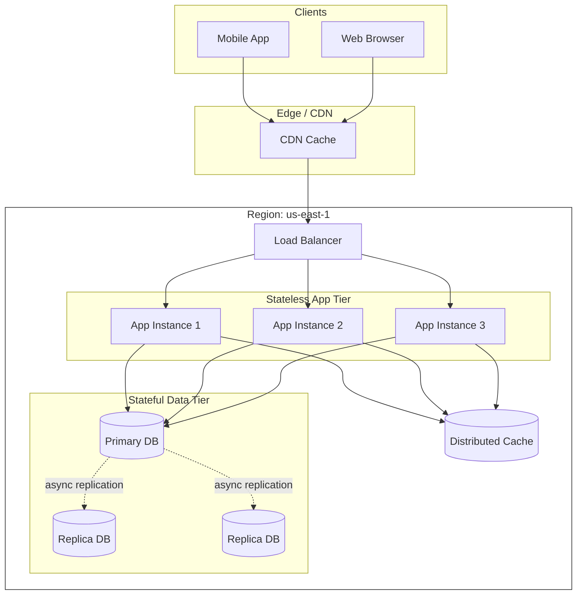
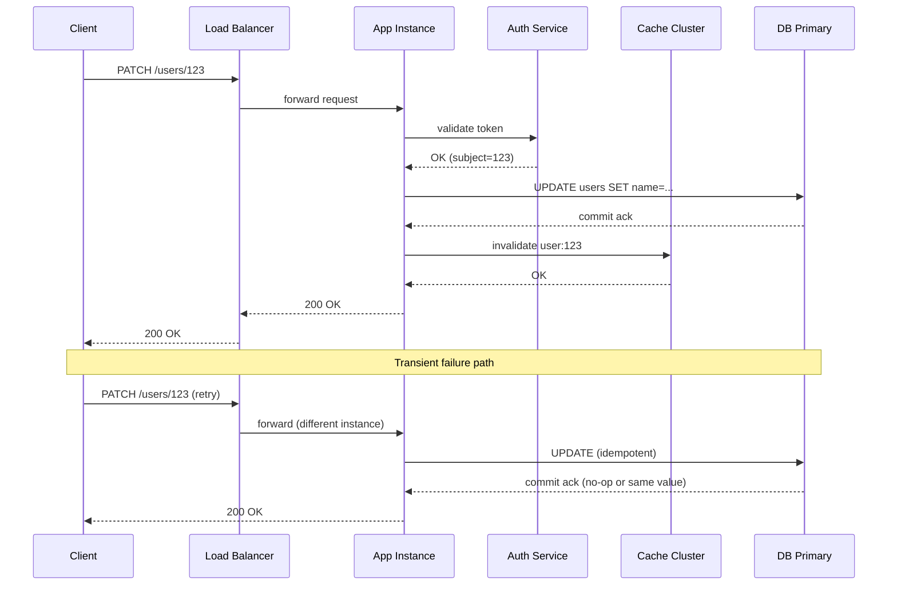
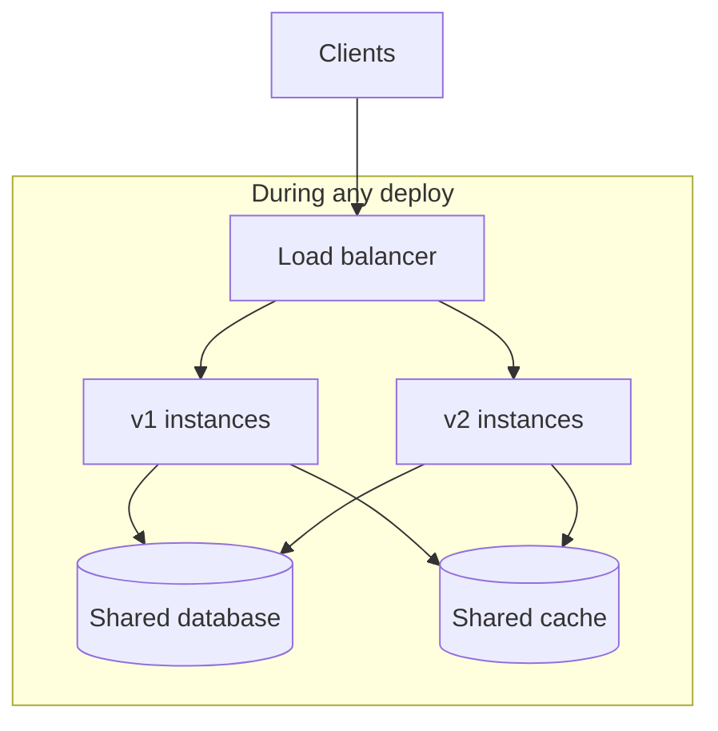
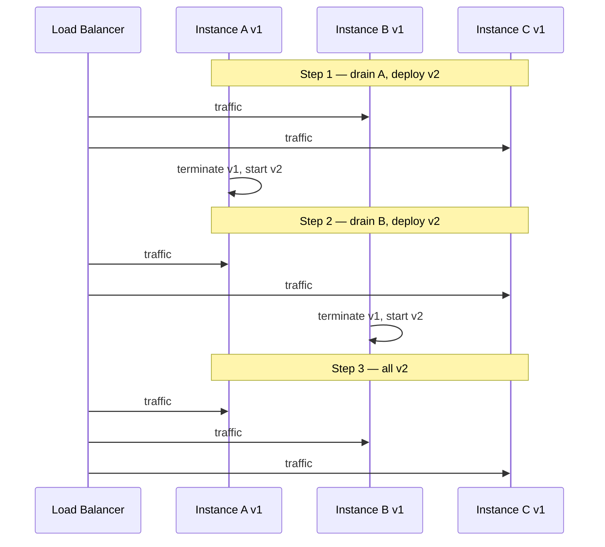
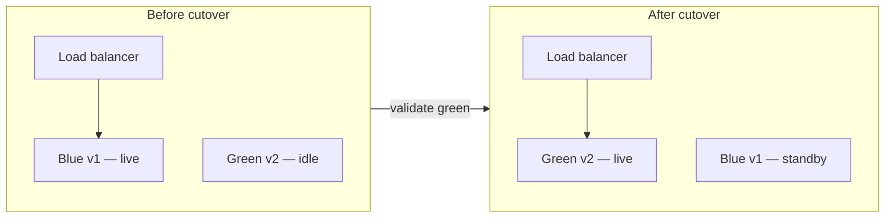
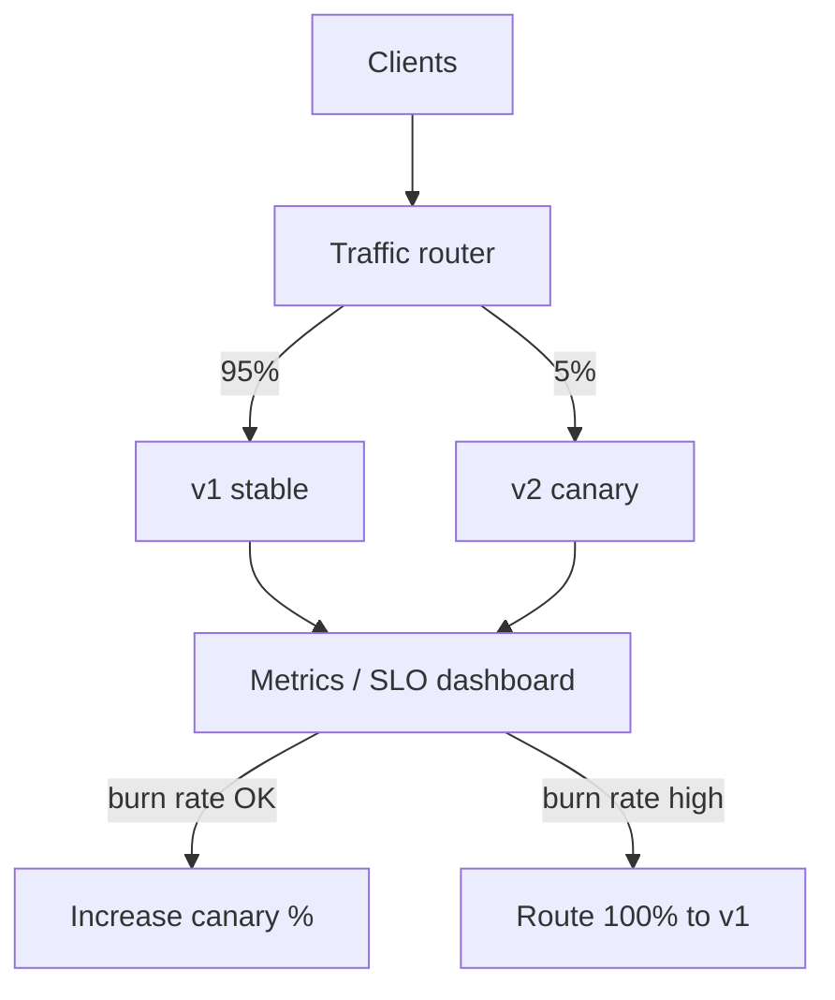
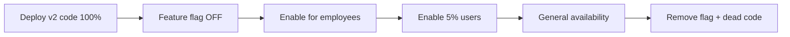
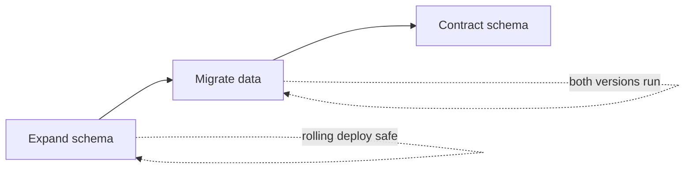
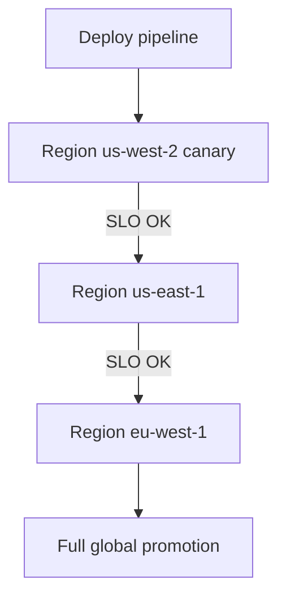
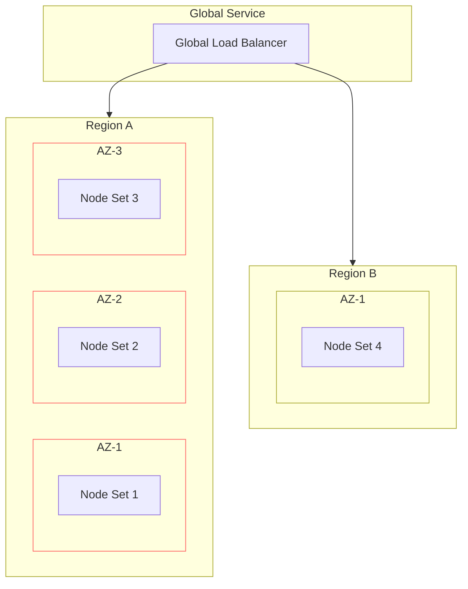

# What Is a Distributed System?

## 1. Executive Summary

A **distributed system** is a collection of autonomous computing elements—processes running on separate machines connected by a network—that cooperate to achieve a shared goal while presenting, to users or other systems, the illusion of a single coherent service. The defining characteristic is not geographic spread or microservice count; it is **independent failure**: components can fail, slow down, or become unreachable while others continue operating. That property transforms every design decision.

Unlike a program on one machine, where failure is typically all-or-nothing, distributed systems must assume **partial failure** as the normal case. Messages can be lost, duplicated, or delayed without bound. Clocks on different machines do not agree. There is no shared memory unless you explicitly build it through replication, consensus, or transactional storage. Principal architects reason about distributed systems by separating **safety** (nothing bad happens—no corrupted state, no double charges) from **liveness** (something good eventually happens—requests complete, leaders are elected), stating assumptions about the environment (crash failures vs. Byzantine faults, synchronous vs. asynchronous timing), and choosing mechanisms—retries, idempotency, replication, partitioning—that trade consistency, availability, latency, and operational complexity.

This chapter establishes the vocabulary and mental model used throughout the Principal Architect Knowledge System. Every later topic—consistency models, replication, consensus, transactions, messaging—assumes you can articulate what makes distribution hard and why naive single-machine intuition fails at scale.

## 2. Why This Topic Matters

Principal and distinguished engineer interviews do not test whether you can name "CAP" or draw three boxes labeled "load balancer." They test whether you can reason under uncertainty: when a dependency is slow, when replicas disagree, when a region is isolated. Candidates who treat distributed systems as "a monolith with more servers" routinely underestimate failure modes, over-promise linearizability, and design systems that work in demos but fracture in production.

At the organizational level, architectural decisions about distribution affect hiring (SRE capacity), incident response (on-call complexity), capital expenditure (multi-region replication), and product velocity (deployment independence vs. coordination overhead). A principal architect must connect technical tradeoffs to business outcomes: a globally replicated database may improve availability during regional outages but increases write latency and engineering cost; sharding may unlock horizontal scale but complicates joins and migrations.

Understanding what a distributed system *is*—and what it is not—prevents category errors such as assuming a Kubernetes cluster is "one computer," or that a message queue guarantees exactly-once delivery without application-level design. It is the foundation for the [12-Week Learning Path](/docs/start-here/12-week-learning-path) weeks 1–2 focus on partial failure, safety, liveness, and system models.

## 3. Problems Being Solved

Organizations adopt distribution to solve problems that a single machine cannot solve economically or physically:

**Throughput and scale.** One server has finite CPU, memory, disk I/O, and network bandwidth. Partitioning work across many nodes increases aggregate capacity. A read-heavy API serving 50,000 requests per second (RPS) at 20 ms median latency cannot sustainably run on one process if each request requires 5 ms of CPU—the single core becomes the bottleneck long before network limits.

**Availability and fault isolation.** Running redundant replicas in separate failure domains (racks, availability zones, regions) allows the service to survive the loss of individual nodes. The goal is not zero failures—it is **graceful degradation** and **fast recovery** when components fail.

**Geographic proximity.** Users in Tokyo and São Paulo cannot both experience low round-trip time to a single data center in Virginia. Edge caches, regional deployments, and replicated data bring computation and data closer to clients.

**Independent evolution.** Teams ship features on separate deployment cadences. Microservices and service-oriented architectures trade operational complexity for organizational scalability—the ability of many teams to build and deploy without serializing through one release train.

**Durability and compliance.** Data replicated across zones or regions survives localized disasters and can satisfy residency requirements by pinning data to specific jurisdictions.

Every benefit carries a cost: coordination overhead, consistency challenges, observability gaps, and operational burden. Distribution is a tool, not a virtue.

## 4. Assumptions and System Model

Reasoning about distributed systems requires an explicit **system model**—assumptions about what can fail and how time behaves. Interview answers that skip the model are incomplete.

### 4.1 Process and Network Model

- **Processes** run on **nodes** (physical or virtual machines, containers, or serverless workers). Each process has local state and communicates only by sending messages over a network.
- The **network** is unreliable: messages may be lost, reordered, duplicated, or delayed arbitrarily long (in the asynchronous model).
- There is **no shared memory** across nodes unless implemented via remote procedure calls (RPC), databases, or distributed caches.

### 4.2 Failure Models

| Failure model | Assumption | Typical use |
|---------------|------------|-------------|
| **Crash-stop** | A node halts and never recovers; other nodes detect the failure eventually | Data stores, stateful services |
| **Crash-recovery** | A node may restart; durable storage survives | Databases with write-ahead logs |
| **Omission** | Messages or send/receive steps may fail | Network partition analysis |
| **Byzantine** | Nodes may behave arbitrarily (malicious or buggy) | Blockchain, adversarial environments |

Most production web and data systems assume **crash-recovery** for peers and **omission failures** for networks unless threat models require Byzantine tolerance.

### 4.3 Timing Models

- **Synchronous:** Bounded message delay and bounded processing speed. Useful for theoretical algorithms; rarely guaranteed in wide-area deployments.
- **Asynchronous:** No upper bound on delay or processing time. This is the realistic default for internet-scale systems.
- **Partial synchrony:** The system behaves asynchronously most of the time but eventually enters periods where delays are bounded—assumed by many practical consensus protocols (e.g., Raft).

### 4.4 The Eight Fallacies of Distributed Computing

Peter Deutsch and others at Sun Microsystems articulated assumptions that novice designers make incorrectly:

1. The network is reliable.
2. Latency is zero.
3. Bandwidth is infinite.
4. The network is secure.
5. Topology does not change.
6. There is one administrator.
7. Transport cost is zero.
8. The network is homogeneous.

Violating any of these in your mental model leads to fragile designs. Production systems assume unreliable networks, non-zero latency, and changing topology.

## 5. Essential Terminology

| Term | Definition |
|------|------------|
| **Node** | A machine or virtual instance hosting one or more processes. |
| **Replica** | A copy of data or service state on a distinct node. |
| **Partition (network)** | A split where some nodes cannot communicate with others, though each side may still serve clients. |
| **Quorum** | A minimum number of replicas that must participate in a read or write to ensure consistency properties. |
| **Idempotency** | Property where performing an operation multiple times has the same effect as once—essential for safe retries. |
| **Linearizability** | Strong consistency model: operations appear to execute atomically in some sequential order consistent with real-time ordering. |
| **Eventual consistency** | Replicas converge given no new writes; reads may return stale data temporarily. |
| **Safety** | Invariant that bad states never occur (e.g., no lost committed writes). |
| **Liveness** | Guarantee that progress eventually occurs (e.g., every request eventually gets a response). |
| **CAP theorem** | In the presence of a network partition, a system must choose between linearizability (Consistency in Gilbert & Lynch's formulation) and Availability for every request. |
| **Shared-nothing** | Architecture where nodes do not share disks or memory; coordination is explicit. |

Define acronyms at first use in conversation; in documentation, the table above serves as the canonical reference for this chapter.

## 6. Core Mechanism

At the highest level, every distributed system implements the same abstract pattern: **decompose state and computation, coordinate through messages, and mask failures behind redundancy and well-defined interfaces.**

### 6.1 Decomposition

Work is split by **function** (microservices), **data** (sharding/partitioning), or **geography** (multi-region). Each partition owns a subset of keys or responsibilities. A routing layer—DNS, load balancer, consistent hashing ring, or metadata service—directs requests to the correct partition.

### 6.2 Communication

Processes exchange messages via **RPC**, **HTTP/REST**, **gRPC**, or **asynchronous messaging** (queues, logs). Synchronous calls simplify reasoning but create **cascading failure** chains when dependencies slow down. Asynchronous messaging decouples producers and consumers but introduces **delivery semantics** (at-most-once, at-least-once, effectively-once with idempotent consumers) and **ordering** challenges.

### 6.3 State Management

Distributed state requires explicit protocols:

- **Replication** for durability and read scale.
- **Consensus** (Raft, Paxos, Zab) for agreeing on a single order of operations across replicas.
- **Transactions** (two-phase commit, Percolator-style layering) for atomicity across partitions—when the problem domain justifies the cost.

### 6.4 Failure Masking

Clients should not need to know which replica served a read or which node crashed mid-request. **Load balancers** reroute traffic. **Leader election** designates a primary for writes. **Retries with backoff** handle transient failures. **Circuit breakers** stop hammering unhealthy dependencies. **Health checks** remove bad instances from rotation—but health checks themselves can lie during gray failures.

### Diagram: Logical Architecture of a Distributed Service

**Title: Three-Tier Distributed Web Service — Component View**

**Explanation:** Clients reach a CDN for static assets, then a regional load balancer distributes dynamic requests across **stateless** application instances. App servers read through a distributed cache and write to a **primary database**, which replicates to secondaries asynchronously. The dashed replication arrows represent a **failure boundary**: if replication lags, reads from replicas may be stale. The load balancer masks individual app instance failures; it does not mask database primary failure without failover automation. This diagram is representative—not a prescription for every workload.

## 7. Step-by-Step Walkthrough

Consider a user updating their profile name through a mobile app. Tracing this request illustrates distributed mechanisms end to end.

**Step 1 — Client initiation.** The app sends `PATCH /users/123` with a new display name. The client may retry on timeout; therefore the server should treat duplicate updates idempotently (same name applied twice is harmless).

**Step 2 — DNS and TLS.** DNS resolves the API hostname to an anycast or geo-DNS target. TLS terminates at the edge or load balancer. *Assumption violated if you believed "topology doesn't change":* DNS TTL and routing may shift during deploys or incidents.

**Step 3 — Load balancing.** The load balancer selects an app instance using round-robin, least connections, or consistent hashing. The instance is stateless; session data lives in a token or server-side store.

**Step 4 — Application logic.** The app validates input, checks authorization (possibly calling a separate **identity service**—another network hop), and issues a database write.

**Step 5 — Cache interaction.** The app invalidates or updates the cache entry for `user:123`. Cache invalidation races are a classic distributed bug: a stale cache read after write if invalidation is asynchronous.

**Step 6 — Database write.** The primary accepts the write, appends to a replication log, and acknowledges the app. Replication to secondaries may lag milliseconds to seconds.

**Step 7 — Response path.** Success returns `200 OK`. If the client immediately reads from a replica via a read path that bypasses the primary, it might observe the old name—an **consistency** tradeoff made visible to the user.

### Diagram: Request Path Sequence

**Title: Profile Update — Happy Path and Retry**

**Explanation:** The sequence shows seven network hops on the happy path. The retry note highlights that the second attempt may hit a **different app instance**—there is no guarantee of stickiness unless configured. Idempotent writes prevent duplicate side effects. Auth service unavailability blocks the entire request unless the app caches token validation results (a freshness tradeoff).

## 8. Invariants and Guarantees

Distributed systems advertise guarantees along several axes. Be precise—**guarantees hold only within stated assumptions.**

### 8.1 Safety Invariants (Examples)

- **No lost acknowledged writes:** If the API returns success, the update survives a single node failure (requires durable commit on primary or quorum write).
- **Authorization invariant:** A user cannot modify another user's profile (must hold even during partition—may require rejecting requests when token validation cannot complete).
- **Unique constraint:** At most one row with a given email (enforced per partition or globally via consensus).

### 8.2 Liveness Properties (Examples)

- **Request completion:** Every well-formed request eventually receives a response (may be an error)—not guaranteed under unbounded overload or deadlock.
- **Leader election:** A single leader emerges in finite time after crash failures—guaranteed in partial synchrony for Raft; not guaranteed in pure asynchrony (FLP impossibility).

### 8.3 FLP Impossibility

Fischer, Lynch, and Paterson proved that in an **asynchronous** system with even one crash failure, no deterministic consensus algorithm can guarantee both **safety** and **liveness**. Practical systems escape this by assuming partial synchrony, using randomization, or accepting that liveness may fail during prolonged partitions.

### 8.4 CAP and PACELC

During a **network partition**, a linearizable system must sacrifice **availability** (some requests rejected) or **consistency** (stale reads). Gilbert and Lynch formalized this tradeoff. **PACELC** extends the framing: *else* (even without partition), there is a latency vs. consistency tradeoff—e.g., synchronous cross-region replication increases write latency.

Guarantees are not universal—they are **design choices** documented in SLAs and runbooks.

## 9. Failure Scenarios

### Failure Scenario 1: Network Partition Between App Tier and Database Primary

**Trigger:** A misconfigured switch or availability zone networking fault isolates all app instances from the database primary. Secondaries remain reachable from a subset of apps but cannot accept writes if promoted without quorum coordination.

**Symptoms:** Applications time out on writes. Read-only traffic may succeed against replicas with stale data. Connection pools exhaust threads waiting on blocked sockets. Error rates spike; retries amplify load (**retry storm**).

**Mechanism breakdown:** TCP connections appear hung until timeout. Without **split-brain protection**, an operator might promote a secondary while the old primary still accepts writes from a minority partition—divergent histories.

**Mitigation:** Fencing (STONITH), quorum-based failover (etcd, Consul), **circuit breakers** on DB clients, bounded connection pools, clear **fail-closed** vs. **fail-open** policy for reads. Runbooks document manual promotion with checklist steps.

**Safety vs. liveness:** Favor **safety**—reject writes rather than accept divergent writes on two primaries.

### Failure Scenario 2: Slow Replica — Gray Failure

**Trigger:** One database replica develops disk contention; it responds to health checks in 50 ms but queries take 8 seconds. The load balancer or connection pool still routes occasional read traffic to it.

**Symptoms:** P99 latency spikes disproportionate to mean latency—a pattern Jeff Dean and Luiz André Barroso documented as **tail latency** amplification in large-scale systems. Mean latency looks healthy; users experience sporadic timeouts.

**Mechanism breakdown:** Health checks measure process up, not query latency. A single slow replica in a pool of 10 can disproportionately affect tail if requests are assigned randomly—roughly 10% of reads hit the slow node.

**Mitigation:** Latency-aware load balancing, **hedged reads** (send duplicate read after delay—use carefully), outlier detection, per-replica latency metrics. Set aggressive **timeouts** aligned with SLA (e.g., 300 ms client timeout vs. 200 ms SLO).

**Principal insight:** Gray failures are harder than crash failures because the system appears partially healthy. Observability must measure **end-to-end** latency, not just component pings.

### Failure Scenario 3: Cascading Failure from Auth Service Overload

**Trigger:** A marketing event doubles login traffic. The central auth service saturates CPU. Every API request validates tokens synchronously.

**Symptoms:** Auth latency rises from 5 ms to 2 seconds. App thread pools fill waiting on auth. The API returns 503 even though app CPU is low. Downstream databases see reduced load—a misleading signal.

**Mechanism breakdown:** **Synchronous dependency chains** multiply latency and couple availability. Retries on 503 from clients multiply auth load further.

**Mitigation:** JWT validation locally with short-lived tokens and key rotation, **bulkheads** (separate thread pools per dependency), **rate limiting** at edge, cached validation with TTL, async auth for non-critical paths. **Load shedding** returns 429 early.

**Organizational angle:** A principal architect identifies **fan-out** and **critical path** dependencies in architecture reviews before launch events.

### Failure Scenario 4: Split Brain in Leader Election (Brief)

**Trigger:** GC pause on the leader exceeds lease TTL; a second node assumes leadership. Both process writes briefly.

**Symptoms:** Duplicate order IDs, conflicting state merges, data corruption in non-commutative updates.

**Mitigation:** **Fencing tokens** passed to storage; storage rejects writes with stale tokens. Lease duration tuned to worst-case pause plus margin. Consensus-based leadership (Raft) rather than naive heartbeats alone.

## 10. Performance Characteristics

Distributed systems performance is dominated by **network round trips**, **serialization**, **coordination**, and **tail latency**—not local CPU alone.

### Quantitative Illustration: Read-Heavy API Sizing

**Assumptions (illustrative, not benchmark claims):**

- Peak traffic: **10,000 RPS** read, **500 RPS** write.
- Each read: 1 app hop + 1 cache lookup; cache hit ratio **90%**.
- Cache miss: additional DB read, **5 ms** median DB latency.
- Cache hit latency: **2 ms** end-to-end.
- Cache miss latency: **12 ms** end-to-end (network + DB).
- App tier: **8** stateless instances, each capable of **1,500 RPS** before CPU saturation at this workload mix.

**Weighted mean read latency:**

`0.9 × 2 ms + 0.1 × 12 ms = 1.8 ms + 1.2 ms = 3.0 ms`

**Capacity check:** 10,000 RPS ÷ 8 instances = **1,250 RPS** per instance—within the 1,500 RPS headroom (83% utilization). Losing one instance redistributes **1,429 RPS** per remaining node—**95% utilization**, leaving little burst margin. A second failure pushes per-node load to **1,667 RPS**, exceeding capacity and causing queueing.

**Lesson:** Horizontal scale adds aggregate throughput but **redundancy for failure** requires **idle headroom**. N+2 app capacity may be necessary during rolling deploys if N+1 is the failure target.

**Coordination cost:** If every write required **synchronous quorum** across 3 DB nodes in 3 zones with **1 ms** inter-zone RTT each, write path adds multiple round trips—often **10–30 ms** before application logic—illustrating why strong consistency has a latency tax.

## 11. Scalability Limits

Distribution does not eliminate limits—it shifts them.

**Amdahl's Law:** Parallelizing a fraction of work yields diminishing returns. A request that must touch a single leader for ordering cannot scale writes beyond that leader's capacity.

**Metadata and coordination:** Shard maps, service discovery, and consensus clusters become bottlenecks. etcd and ZooKeeper are not infinite-throughput registries.

**Hot partitions:** Skewed keys (celebrity user, viral post) overload individual shards despite average load appearing healthy.

**Operational scale:** More nodes mean more certificates, kernel versions, failure modes, and on-call pages. **Human scalability** is often the binding constraint.

**Consistency ceiling:** Stronger guarantees typically reduce theoretical throughput on writes. This is a design ceiling, not a moral judgment—choose the weakest model that satisfies requirements.

## 12. Operational Considerations

Operating distributed systems requires practices uncommon in single-node deployments:

- **Observability triad:** Metrics (RED/USE), distributed tracing (correlate cross-service request IDs), structured logs. Without tracing, "which dependency slowed down?" is guesswork.
- **Deploy strategies:** Rolling, blue-green, canary—each affects failure blast radius during the window when **multiple versions coexist**. See [section 12.1](#121-deployment-strategies-in-distributed-systems) for detailed patterns with production examples.
- **Chaos engineering:** Inject faults (latency, packet loss, instance termination) in staging or controlled production to validate assumptions.
- **Runbooks:** Document failover, backup restore, partition response—not just "restart the service."
- **Capacity planning:** Load test to **2× expected peak**; validate autoscaling lag (cold start times for serverless or new VMs).
- **Version skew:** Multiple binary versions coexist during deploys; APIs must be backward compatible.

**Incident command:** During outages, explicitly identify whether the failure is **correlated** (shared dependency) or **uncorrelated** (many independent failures suggest cascading overload).

### 12.1 Deployment Strategies in Distributed Systems

A deployment is not a single event—it is a **distributed state transition**. During every rollout, your cluster temporarily runs **two (or more) versions** of code, configuration, and sometimes schema. Clients, load balancers, caches, and downstream services may route to either version. That is partial failure and version skew by design. Principal architects treat deploy strategy as a **safety and liveness** decision: how much risk you accept during the transition, and how quickly you can roll back.

#### Why deployment is a distributed-systems problem

| Property | Single machine | Distributed rollout |
|----------|----------------|---------------------|
| **Version count** | One binary at a time | N replicas × mixed versions |
| **Failure mode** | All-or-nothing restart | Some instances new, some old |
| **Dependencies** | Local | Cross-service RPC with version skew |
| **State** | In-process | Shared DB, caches, message queues |
| **Rollback** | Revert binary | Drain traffic, revert fleet, invalidate caches |

During a deploy, you are running a **live experiment** on production traffic. The experiment succeeds when: (1) health checks reflect real readiness, (2) APIs are backward compatible, (3) database changes are backward compatible, and (4) observability detects regression before full promotion.

*Figure: Version skew — v1 and v2 share stateful dependencies. Schema and API compatibility are mandatory.*

#### Strategy 1: Rolling deployment

**Mechanism:** Replace instances incrementally—terminate old, start new—until the fleet is fully updated. Kubernetes `RollingUpdate`, AWS Auto Scaling group instance refresh, and ECS rolling deploys all implement this pattern.

| Pros | Cons |
|------|------|
| No extra infrastructure | Long window of version skew |
| Gradual capacity shift | Bug affects growing % of traffic |
| Standard in K8s / ASG | Rollback = another rolling deploy |

**Real-world example — Netflix on AWS:** Netflix runs thousands of EC2 instances per service. Rolling deploys use **red/black** (their term for fast rollback) with automated canary analysis via their Spinnaker pipeline. A bad build that passes health checks but increases error rate is caught by **automated rollback** on SLO burn—not by instance `UP/DOWN` alone. Lesson: rolling deploy + **metrics-based gates** beats rolling deploy alone.

**Real-world example — Kubernetes:** `maxUnavailable: 1`, `maxSurge: 1` on a 10-replica Deployment means at least 9 pods serve traffic while one updates. If the new image fails readiness probes, the rollout **stalls**—but liveness probes that are too shallow (HTTP 200 on `/health` without checking dependencies) allow broken v2 pods to receive traffic. Principal signal: **readiness** must validate critical dependencies (DB pool, feature config).

**Capacity math:** With `N` replicas and `maxUnavailable: 1`, peak capacity during deploy is `(N-1)/N` of full fleet. At `N=8`, you lose **12.5%** headroom during the entire rollout window. If baseline utilization is 85%, post-drain nodes hit **97%**—queueing and tail latency spike. Size fleets for **deploy + one failure** (N+2), not just N+1.

#### Strategy 2: Blue-green deployment

**Mechanism:** Maintain two identical environments—**blue** (current) and **green** (new). Deploy to green, validate, then **atomically switch** traffic (DNS, load balancer target group, or service mesh route). Rollback = switch back to blue.

| Pros | Cons |
|------|------|
| Instant rollback (flip traffic) | 2× infrastructure cost during deploy |
| No version skew at cutover | Stateful apps need careful session handling |
| Clean validation window | Database migrations harder (shared DB) |

**Real-world example — AWS CodeDeploy blue/green:** CodeDeploy shifts ALB target groups from blue to green Auto Scaling groups. Hooks run **BeforeAllowTraffic** (smoke tests) and **AfterAllowTraffic** (synthetic checks). AWS documentation recommends blue/green when rollback time must be **seconds**, not minutes. Tradeoff: you pay for double capacity during the deploy window—often acceptable for payment or auth tiers.

**Real-world example — Shopify flash sales:** During high-traffic events, Shopify avoids risky deploys entirely (**deploy freeze**). When deploys are allowed, blue-green or fast canary with **feature flags off** ensures the binary is in production but behavior is dark until validated. Lesson: **deploy ≠ release**; decouple with flags (see below).

**Stateful caveat:** If sessions are sticky to blue instances, cutover logs users out unless sessions live in Redis or JWT. Shared database means **both** blue and green must run against a schema **compatible with both** code versions (expand/contract migrations).

#### Strategy 3: Canary deployment

**Mechanism:** Route a **small percentage** of traffic to the new version; compare golden signals (error rate, latency, business metrics); promote gradually (1% → 5% → 25% → 100%) or roll back automatically.

| Pros | Cons |
|------|------|
| Limits blast radius of bad builds | Requires traffic splitting infra |
| Validates on real production load | Canary too small may miss rare bugs |
| Automated promotion/rollback | Longer total deploy duration |

**Real-world example — Amazon:** Amazon's deployment culture (documented in public engineering talks and the *Amazon Builder* library patterns) emphasizes **small, frequent changes** with automated rollback. Teams use pipeline stages: alpha → beta → production canary → full. A one-box or one-AZ canary catches dependency version skew before fleet-wide promotion. Interview framing: "We don't ship Friday; we ship when error budget allows and canaries pass."

**Real-world example — Stripe API versioning:** Stripe runs API versions dated (`2023-10-16`). New behavior ships behind versions; merchants opt in. For internal services, canary deploys validate payment path latency—where **p99 regression of 50 ms** can mean millions in lost authorization revenue. Canary metrics include business KPIs (decline rate, idempotency replay rate), not only HTTP 5xx.

**Real-world example — Meta / Facebook:** Meta historically used **dark launches** and **ramp-up** (gradual percentage) for feed ranking changes. A bad ranking model affects engagement—so canary metrics include **session depth** and **ad click-through**, not error rate alone. Lesson: define **canary success criteria** per service type.

**Statistical note:** A 1% canary on 10,000 RPS sees ~100 RPS. Rare failures (1 in 10,000 requests) need hours to surface at canary volume. Combine small canary with **synthetic probes** and **shadow traffic** (duplicate requests to canary without returning responses) for tail-risk coverage.

#### Strategy 4: Feature flags (decouple deploy from release)

**Mechanism:** Deploy new code to **100% of instances** with the feature **disabled**. Enable for internal users, then canary %, then everyone—without a second binary deploy.

**Real-world example — LaunchDarkly / internal flag systems:** Companies at scale (LinkedIn, GitHub, many fintechs) use feature flags for **trunk-based development**. A principal architect insists flags are **short-lived** with owners and removal tickets—otherwise the codebase becomes an unmaintainable boolean maze.

**Safety property:** Flags fail **closed** for payments (deny new path) or **open** for UI experiments—document the default explicitly.

#### Strategy 5: Database schema and deploy coupling (expand/contract)

Deploy strategies fail when code and schema move in lockstep incorrectly. The **expand/contract** pattern maintains compatibility across rolling deploys:

| Phase | Schema | Code |
|-------|--------|------|
| **Expand** | Add nullable column `email_v2` | v1 ignores; v2 writes both |
| **Migrate** | Backfill `email_v2` | v2 reads `email_v2`, falls back |
| **Contract** | Drop old column | v2 only; v1 retired |

**Real-world example — Shopify / large Rails shops:** Shopify's engineering blog describes **online migrations** at scale—background jobs backfill while both code versions run. Skipping expand/contract causes rolling deploys to crash on `Unknown column` errors—classic **version skew** failure.

#### Strategy 6: Multi-region and cell-based deploy

**Mechanism:** Deploy to one **region** or **cell** (isolated failure domain) first; promote globally after validation.

**Real-world example — Google / Meta cell architecture:** Production is sharded into **cells** (user shards or regional stacks). A deploy hits one cell before others—limiting blast radius to a fraction of users. This is canary at **infrastructure geography**, not just percentage.

**Real-world example — This knowledge portal (AWS S3 + CloudFront):** Static site deploys are **atomic at the object level** (`aws s3 sync` + CloudFront invalidation). Users may briefly see mixed HTML/JS versions if caches are inconsistent—mitigated by **content-hashed asset filenames** (Docusaurus/webpack) so old HTML pointing to old JS still works. Lesson: **immutable assets + short TTL on HTML** is the static-site equivalent of blue-green.

#### Comparison matrix (interview reference)

| Strategy | Blast radius | Rollback speed | Cost | Version skew window | Best for |
|----------|--------------|----------------|------|---------------------|----------|
| **Rolling** | Medium (grows) | Minutes | Low | Long | Stateless APIs, K8s default |
| **Blue-green** | Low at cutover | Seconds | High (2× fleet) | Short | Payments, auth, critical paths |
| **Canary** | Low (initial %) | Seconds–minutes | Medium | Medium | High-traffic consumer services |
| **Feature flags** | Configurable | Instant (toggle) | Low (flag SaaS) | Code present, behavior off | UI, algorithms, A/B |
| **Regional/cell** | Geography-limited | Region rollback | Medium | Per region | Global products |

#### Principal architect checklist for deploy design

1. **What fails first?** Health checks, DB migration, cache poisoning, or downstream timeout?
2. **What metrics gate promotion?** Error rate, p99 latency, **and** business metrics (conversion, payment success).
3. **How do you roll back?** One-click? Automated on SLO burn? Revert schema?
4. **How long is version skew?** Enforce backward-compatible APIs for that window.
5. **Deploy freezes?** Black Friday, tax season, earnings—calendar is part of architecture.
6. **Who owns the flag / pipeline?** Platform team vs product team boundaries.

#### Common deploy failures (production stories)

| Symptom | Root cause | Mitigation |
|---------|------------|------------|
| 500s spike mid-rollout | New code, old schema (or reverse) | Expand/contract migrations |
| "Works in canary, fails at 100%" | Canary too small; cache cold on full fleet | Shadow traffic; soak time |
| Rollback doesn't fix | Forward-only DB migration | Reversible migrations only |
| Session logout storm | Blue-green cutover without shared session store | Redis sessions or stateless JWT |
| Retry storm after deploy | New version slower; callers retry | Circuit breakers; deploy during low traffic |

**Interview answer (60 seconds):** "For a stateless API on Kubernetes I'd default to **rolling deploy with maxUnavailable 1**, readiness probes that check the DB pool, and **automated rollback on error-rate SLO burn**. For payments I'd add a **1% canary** with business metrics and expand/contract schema changes. I'd decouple risky product behavior with **feature flags** so deploy is frequent but release is controlled. Rollback must be tested quarterly—an untested rollback path is fiction."

See also [Reliability and Resilience — SLOs](/docs/reliability-and-resilience/slo-sli-error-budgets), [Microservices — Resilience Patterns](/docs/microservices/resilience-patterns), and [AWS Deployment Guide](/docs/start-here/aws-deployment) for this portal's own static-site deploy pattern.

## 13. Security Considerations

Distribution expands the attack surface:

- **Network trust:** **Mutual TLS (mTLS)** between services, private networking, and zero-trust models replace assumptions that "the network is secure."
- **Identity propagation:** Service accounts, OAuth tokens, and SPIFFE IDs must flow across hops without confused deputy problems.
- **Partition and security:** During a partition, should a minority partition accept writes? Security-sensitive systems may **fail closed** (deny) to prevent unauthorized access when central policy engines are unreachable.
- **Byzantine threats:** Blockchains and multi-party systems assume malicious nodes; most internal systems do not—do not pay the complexity cost unless required.
- **Secrets management:** Distributed configs must not embed secrets in images; use vaults with rotation.

Security properties are **safety** properties—violations must not occur even under attack or partial failure.

## 14. Cost Considerations

Distribution has direct economic drivers:

- **Egress charges:** Cross-AZ and cross-region traffic incurs cloud provider fees—replication topology affects the monthly bill materially.
- **Replica count:** Three replicas triple storage and much write I/O; multi-region doubles or triples again.
- **Over-provisioning for HA:** N+1 or N+2 redundancy is idle capacity you pay for continuously.
- **Engineering cost:** Microservices increase headcount for platform, SRE, and developer experience teams.

A principal architect articulates **total cost of ownership (TCO)** alongside availability targets. Five nines (99.999%) is expensive and often unnecessary for non-critical paths.

## 15. Production Implementations

These implementations illustrate patterns—not endorsements of universal best practice:

| System | Role | Distributed characteristic |
|--------|------|---------------------------|
| **Amazon Dynamo** | Key-value store | Consistent hashing, quorum reads/writes, eventual consistency (paper: DeCandia et al., 2007) |
| **Google Spanner** | Globally distributed SQL | TrueTime + Paxos groups; external consistency with clock uncertainty bounds |
| **Apache Kafka** | Log-based messaging | Partitioned, replicated commit log; ordering per partition |
| **Kubernetes** | Orchestration | Declarative desired state; controllers reconcile actual vs. desired across nodes |
| **etcd / ZooKeeper** | Coordination | Consensus for configuration, locks, leader election |

Martin Kleppmann's *Designing Data-Intensive Applications* (O'Reilly) synthesizes how these systems make tradeoffs in replication, partitioning, and transaction models—recommended as companion reading.

Leslie Lamport's work on logical clocks, Paxos, and the "Time, Clocks, and the Ordering of Events" paper (1978) established foundational ordering concepts still used in debugging and design today.

## 16. Alternatives and Tradeoffs

| Approach | When to use | Tradeoff |
|----------|-------------|----------|
| **Monolith (single process)** | Early product, small team, low scale | Simple ops; vertical scale ceiling |
| **Modular monolith** | Medium scale, one deploy unit | Cleaner boundaries without network chop |
| **Microservices** | Large org, independent deploys | Operational complexity, distributed tracing required |
| **Serverless / FaaS** | Spiky, event-driven workloads | Cold starts, vendor coupling, debug difficulty |
| **Edge computing** | Latency-sensitive global users | Consistency and cache invalidation complexity |
| **Single-region multi-AZ** | Strong consistency, simpler model | Regional disaster risk |
| **Multi-region active-active** | High availability, geo proximity | Conflict resolution, write latency |

**Decision criteria:** team size, scale trajectory, consistency requirements, regulatory constraints, and acceptable blast radius—not industry fashion.

## 17. Common Misconceptions

1. **"Distributed = microservices."** You can distribute a monolith across replicas. Microservices are an organizational decomposition pattern.

2. **"More nodes = more reliable."** Without redundancy design, more nodes mean **more failure points**. Reliability comes from isolation and redundancy, not node count alone.

3. **"CAP means pick two of three."** CAP applies during **partition**; consistency and availability are not binary lifetime choices. PACELC captures normal-operation tradeoffs.

4. **"Message queues guarantee exactly-once."** Brokers typically offer at-least-once delivery; exactly-once **processing** requires idempotent consumers and often transactional outbox patterns.

5. **"Strong consistency is always better."** Strong consistency increases latency and reduces availability during partitions. Many UX patterns tolerate staleness.

6. **"Synchronous is simpler."** Synchronous call chains hide distributed failure until overload cascades. Async adds complexity but improves decoupling.

## 18. Principal Architect Perspective

A principal architect evaluates distributed designs by asking:

1. **What is the failure model?** Crash vs. Byzantine; what happens during partition?
2. **What are the safety and liveness requirements?** Can we lose money? Can we delay notifications?
3. **Where is the critical path?** Map synchronous fan-out; identify single points of failure.
4. **What consistency model do users actually need?** Not what engineers prefer.
5. **How does this fail in production?** Gray failures, retry storms, certificate expiry.
6. **Can the organization operate this?** On-call skill, runbook maturity, cost of incidents.
7. **What is the migration and rollback story?** Distribution is hard to bolt on retroactively.

Leadership means saying **no** to unnecessary distribution when a modular monolith meets requirements—and saying **yes** to investment in observability and idempotency when distribution is justified.

### Diagram: Failure Domains and Blast Radius

**Title: Multi-AZ Deployment — Failure Domain Hierarchy**

**Explanation:** Red borders mark **availability zones** as separate failure domains within a region. A zonal outage should not take down all replicas if replicas are placed **one per AZ**. Regional failure requires cross-region replicas—another order of magnitude in cost and consistency complexity. Architects document which failures the design survives at each level.

## 19. Architecture Review Exercise

**Scenario:** Your team proposes splitting a 50K-line monolith into 15 microservices before Black Friday. Current monolith handles 3,000 RPS peak with 40 ms P99 on 4 instances. No distributed tracing exists.

**Review prompts:**

1. Identify the **business driver** for decomposition—is it scale, team velocity, or resume-driven development?
2. Draw the **request fan-out** for the top three user journeys after split. How many network hops?
3. What **data ownership** boundaries prevent cross-service joins on every request?
4. What **SLO** will degrade during the migration, and how will you measure it?
5. What is the **rollback** plan if P99 exceeds 200 ms under load?

**Expected findings:** Without scale pressure, premature microservices increase tail latency and incident complexity. A phased **strangler fig** migration with tracing first is lower risk.

## 20. Whiteboard Explanation

**5-minute spoken outline for interviews:**

1. **Define:** Independent computers, messages, shared goal, partial failure.
2. **Why distribute:** Scale, availability, geography, team autonomy—state the problem first.
3. **Hard parts:** No global clock, unreliable network, concurrent failures.
4. **Mechanisms:** Replication, partitioning, consensus, retries, idempotency.
5. **Tradeoffs:** Safety vs. liveness; consistency vs. latency vs. availability.
6. **Example:** Walk one request; name one failure (partition, slow replica, cascade).
7. **Close:** "I'd choose [weaker consistency / fewer services] unless requirements demand otherwise because [specific user-visible invariant]."

Draw three boxes: client, stateless tier, replicated state. Draw a red X on one node; show load balancer rerouting. Interviewers reward clarity over buzzwords.

## 21. Interview Questions

1. **What is a distributed system? How is it different from a monolith on one server?**
   - *Signals:* Independent failure, message passing, no shared memory, partial failure.
   - *Red flags:* "It's when you use Kubernetes" without mechanism.

2. **Explain partial failure. Why is it fundamental?**
   - *Signals:* Components fail independently; system may be half-working; requires explicit handling.
   - *Follow-up:* How do retries interact with partial failure?

3. **What are safety and liveness? Give an example of each.**
   - *Signals:* Safety = nothing bad; liveness = something good eventually. Bank balance vs. request eventually completes.
   - *Red flags:* Conflating with CAP letters only.

4. **State the CAP theorem correctly. What does it not say?**
   - *Signals:* Partition forces C vs. A tradeoff; does not apply when no partition; does not cover latency.
   - *Scoring:* 4/5 if PACELC mentioned unprompted.

5. **What is the difference between crash-stop and Byzantine failures?**
   - *Signals:* Crash = halt; Byzantine = arbitrary behavior. Cost of Byzantine tolerance.

6. **Why can't you rely on wall-clock time across nodes?**
   - *Signals:* Clock skew, NTP jumps, leap seconds. Logical clocks for ordering.
   - *Reference:* Lamport clocks, happens-before.

7. **What makes exactly-once delivery hard?**
   - *Signals:* At-least-once + idempotency; or distributed transactions; end-to-end argument.

8. **Describe a network partition. How should a payment system vs. a social feed react?**
   - *Signals:* Payment favors consistency/ fail-closed; feed may favor availability with staleness.

9. **What is a gray failure? How would you detect it?**
   - *Signals:* Degraded not dead; tail latency; outlier detection; end-to-end probes.

10. **When would you NOT distribute a system?**
    - *Signals:* Team size, scale insufficient, consistency needs simple transactions, operational maturity low.

11. **Explain the FLP impossibility result in practical terms.**
    - *Signals:* No deterministic async consensus with crash failure; partial synchrony escape hatches.

12. **How do load balancers contribute to fault tolerance? What don't they fix?**
    - *Signals:* Mask instance failure; don't fix data plane split brain or state corruption.

## 22. Interview Follow-Ups

1. **You chose eventual consistency for read replicas. A user updates their password and immediately gets authenticated on a stale replica. What happened? Fixes?**
   - *Strong answer:* Read-your-writes violation; route session reads to primary, use token binding, or synchronous replica ack for security-sensitive reads.

2. **Your system uses at-least-once messaging. How do you prevent duplicate charges?**
   - *Strong answer:* Idempotency keys, deduplication store, compare-and-set on business key, outbox pattern.

3. **P99 latency doubled after microservices migration. How do you diagnose?**
   - *Strong answer:* Distributed tracing, critical path analysis, fan-out count, sync vs. async, compare per-hop latency to monolith baseline.

4. **During a partition, two regions both accept writes. How do you merge?**
   - *Strong answer:* Conflict-free replicated data types (CRDTs), last-writer-wins with version vectors, operational transform, or avoid—design for single writer per key.

5. **How many nines of availability can you promise? What does 99.99% mean in minutes per year?**
   - *Strong answer:* ~52.6 minutes downtime/year; dependency math multiplies (serial availability decreases); error budgets and SLOs.

6. **Is a single-leader database a distributed system?**
   - *Strong answer:* Yes—replication, failover, and client-to-DB are distributed even if app is monolith.

## 23. Strong Answer Example

**Question:** "What is a distributed system, and what is the hardest part about building one?"

**Strong answer outline:**

"A distributed system is multiple independent computers working together over a network toward a common goal, without shared memory. The hardest part is not scale—it's **partial failure**. On one machine, a crash usually kills the whole process. In distribution, your database might be fine while the cache is unreachable, or half the cluster elects a new leader while the old leader still thinks it's primary.

That forces you to decide **safety vs. liveness** explicitly. For payments, safety means never double-charging—even if that means rejecting requests during a partition. For a product catalog, you might accept stale prices briefly to stay available.

Mechanically, I rely on **idempotent operations**, **bounded retries**, **replication with clear consistency models**, and **observability** to trace requests across hops. I don't assume the network is reliable or clocks agree—Lamport's happens-before relation is how I reason about ordering when physical time lies.

The organizational side matters too: every network boundary is a team boundary. I'd only add one if the scale or autonomy benefit exceeds the operational cost of running distributed tracing, on-call rotation, and failure testing."

*Why strong:* Definition, core difficulty, tradeoff with example, mechanisms, theory reference, organizational awareness.

## 24. Weak Answer Example

**Question:** "What is a distributed system, and what is the hardest part about building one?"

**Weak answer:**

"A distributed system is when you have microservices in the cloud. The hardest part is choosing the right database. You should use Kafka and Kubernetes for scalability. CAP theorem says you can't have everything, so you pick availability. Strong consistency is always best for user trust."

*Why weak:* Conflates microservices with distribution; buzzword stack drop; misstates CAP (always pick availability); universal consistency claim; no partial failure, no safety/liveness, no operational realism.

## 25. Hands-On Exercise

**Lab: Partial Failure Simulation**

1. Run a simple 3-container compose stack: web API + Redis + PostgreSQL.
2. Use `tc netem` (Linux traffic control) or Docker network disconnect to drop 30% of packets between API and Redis for 60 seconds.
3. Observe: Do requests hang, fail fast, or return stale data? Measure error rate and latency with `curl` in a loop.
4. Implement **timeouts** (100 ms) and **circuit breaker** (open after 5 failures). Re-run the experiment.
5. Document: Which invariant broke (safety or liveness)? What guarantee did you choose?

**Extension:** Add a second API instance behind nginx; kill one container mid-request; verify retries succeed with idempotent `GET` but not naive `POST`.

**Success criteria:** Written summary of failure model, chosen guarantees, and metrics before/after mitigation.

## 26. Knowledge Check

1. True or false: A system is not distributed if all components run in one Kubernetes cluster.
2. Name two safety properties and two liveness properties for an online bookstore.
3. During a network partition, must a linearizable system reject some requests? Why?
4. Why are idempotent operations necessary with at-least-once delivery?
5. What is the difference between a crash-stop failure and a gray failure?
6. Calculate: 99.9% availability—approximately how many minutes of downtime per year?
7. In the 10,000 RPS example, why is losing two of eight app instances worse than losing one?
8. What assumption does the FLP impossibility result make about timing?
9. Name three of Deutsch's eight fallacies.
10. When is synchronous cross-region replication preferable to asynchronous?
11. During a rolling deploy on 8 replicas with `maxUnavailable: 1`, what happens to available capacity?
12. Name two differences between blue-green and canary deployment.
13. Why must database migrations use expand/contract for rolling deploys?

*Answers in section 28 (Cheat Sheet) for self-study.*

## 27. Flashcards

| # | Front | Back |
|---|-------|------|
| 1 | What defines a distributed system? | Autonomous nodes cooperating via messages; no shared memory; independent failure possible. |
| 2 | Partial failure | Some components fail while others continue; characteristic difficulty of distribution. |
| 3 | Safety | Bad things never happen (e.g., no double spend). |
| 4 | Liveness | Good things eventually happen (e.g., requests complete). |
| 5 | CAP theorem (during partition) | Choose between linearizability and availability for all requests. |
| 6 | FLP impossibility | No deterministic consensus in async system with one crash failure guarantees both safety and liveness. |
| 7 | Idempotency | Repeated operation same effect as once; enables safe retries. |
| 8 | Quorum | Minimum replicas participating to avoid split-brain reads/writes. |
| 9 | Eventual consistency | Replicas converge when writes stop; reads may be stale. |
| 10 | Gray failure | Node degraded (slow) but not dead; health checks pass. |
| 11 | Shared-nothing | Nodes share neither disk nor RAM; scale via partitioning. |
| 12 | Happens-before | Lamport relation defining causal ordering of events. |
| 13 | Tail latency | High-percentile latency (P99); affected by slowest sub-request. |
| 14 | Split brain | Two nodes believe they are primary; divergent writes. |
| 15 | At-least-once delivery | Messages may duplicate; never lost after ack to producer. |
| 16 | Rolling deploy | Replace instances incrementally; long version-skew window. |
| 17 | Blue-green deploy | Two environments; atomic traffic switch; fast rollback. |
| 18 | Canary deploy | Small traffic % to new version; promote on metrics. |
| 19 | Expand/contract migration | Schema changes safe across mixed code versions during rollout. |

## 28. Cheat Sheet

**Definition:** Nodes + messages + shared goal + partial failure.

**Hard problems:** Ordering, coordination, consensus, clock skew, delivery semantics.

**Mechanisms:** Replication, sharding, consensus, retries, idempotency, circuit breakers, bulkheads, rolling/canary/blue-green deploy.

**Deploy strategies:** Rolling (K8s default), blue-green (fast rollback), canary (limit blast radius), feature flags (decouple deploy/release), expand/contract (schema).

**CAP:** Partition → consistency OR availability (for linearizability definition).

**PACELC:** Else → latency vs. consistency.

**FLP:** Async + crash → no perfect consensus; use partial synchrony in practice.

**Availability math:** 99.9% ≈ 8.76 h/year; 99.99% ≈ 52.6 min/year; 99.999% ≈ 5.26 min/year.

**Knowledge check answers:** (1) False—K8s spans nodes with independent failure. (2) Safety: no double charge, valid inventory; Liveness: checkout completes, emails sent. (3) Yes, or sacrifice linearizability. (4) Duplicates otherwise cause double effects. (5) Crash-stop halts; gray is slow/degraded. (6) ~8.76 hours. (7) Per-node load exceeds capacity. (8) Asynchronous timing. (9) Any three fallacies from section 4.4. (10) When RPO requires minimal data loss and latency acceptable. (11) 7/8 capacity (12.5% loss) during each drain step. (12) Blue-green: atomic switch, 2× infra; canary: gradual %, metrics-gated. (13) v1 and v2 run simultaneously; incompatible schema breaks one version.

## 29. Related Concepts

- [Distributed Systems Foundations Overview](/docs/distributed-systems-foundations/overview) — domain map
- [Consistency](/docs/consistency/overview) — formal consistency models (upcoming chapters)
- [Replication](/docs/replication/overview) — how replicas synchronize
- [Consensus](/docs/consensus/overview) — agreeing on order under failure
- [Networking](/docs/networking/overview) — protocols and latency fundamentals
- [Reliability and Resilience](/docs/reliability-and-resilience/overview) — SLOs, chaos, incident response
- [AWS Deployment Guide](/docs/start-here/aws-deployment) — static site deploy on S3 + CloudFront
- [12-Week Learning Path](/docs/start-here/12-week-learning-path) — weeks 1–2 curriculum placement
- [Glossary](/docs/reference/glossary) — shared terminology

## 30. References

### Primary sources and formal results

- Lamport, L. (1978). "Time, Clocks, and the Ordering of Events in a Distributed System." *Communications of the ACM.* — logical clocks and happens-before.
- Fischer, M. J., Lynch, N. A., & Paterson, M. S. (1985). "Impossibility of Distributed Consensus with One Faulty Process." *Journal of the ACM* — FLP impossibility.
- Gilbert, S., & Lynch, N. (2002). "Brewer's Conjecture and the Feasibility of Consistent, Available, Partition-Tolerant Web Services." *ACM SIGACT News* — CAP formalization.
- DeCandia, G., et al. (2007). "Dynamo: Amazon's Highly Available Key-value Store." *SOSP* — production distributed storage design.

### Books and synthesis

- Kleppmann, M. *Designing Data-Intensive Applications* (O'Reilly). Chapters 1–9 cover replication, partitioning, consistency, and consensus with production context.
- Tanenbaum, A. S., & Van Steen, M. *Distributed Systems: Principles and Paradigms* (3rd ed.). — textbook system models and paradigms.
- Coulouris, G., Dollimore, J., Kindberg, T., & Blair, G. *Distributed Systems: Concepts and Design.*

### Operational and engineering practice

- Dean, J., & Barroso, L. A. (2013). "The Tail at Scale." *Communications of the ACM* — tail latency in large distributed systems.
- Deutsch, P. (1994). "Eight Fallacies of Distributed Computing." — assumptions that break in practice.
- Nygard, M. *Release It!* — stability patterns (circuit breaker, bulkhead, timeout).
- Humble, J., & Farley, D. *Continuous Delivery* — deployment pipelines, blue-green, database migrations.

### Distinction note

**Formal guarantees** (FLP, CAP proof) describe what is impossible or required under mathematical assumptions. **Implementation choices** (Dynamo quorums, Spanner TrueTime) are engineering responses within those constraints. **Operational experience** (gray failures, retry storms) comes from running systems at scale—patterns recur across organizations but specific incident details should be verified from primary postmortems when cited in case studies.

---

*Status: draft. Last reviewed 2026-07-24. Verify cloud-specific failover behaviors against current provider documentation before production decisions.*
