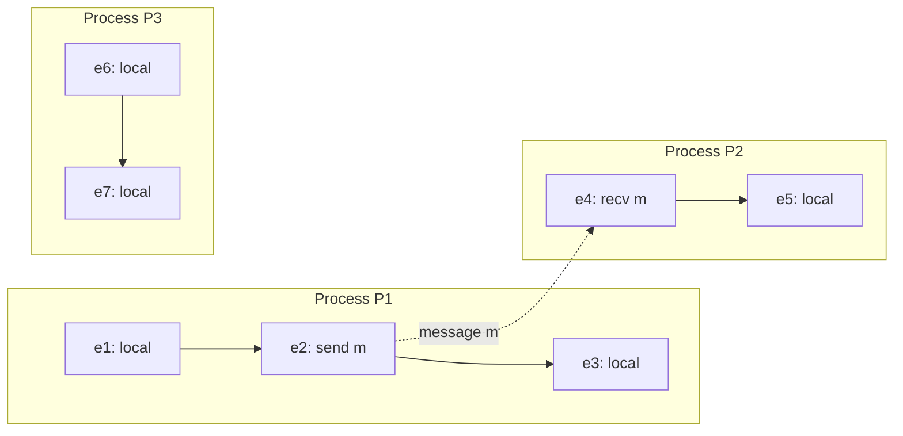
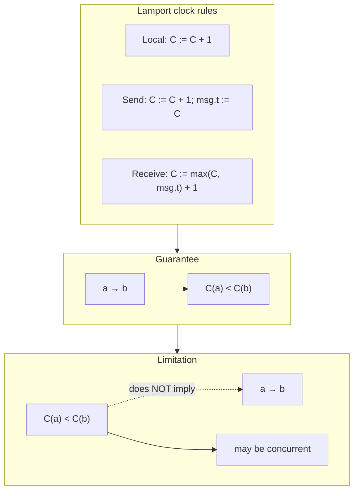

# Lamport Clocks

## 1. Executive Summary

In a distributed system, there is no global clock that all processes agree on. Physical timestamps from NTP-synchronized wall clocks can disagree by milliseconds—or jump backward after corrections—so you cannot reliably infer causal order from `time.now()` alone. Leslie Lamport's 1978 paper, ["Time, Clocks, and the Ordering of Events in a Distributed System"](https://lamport.azurewebsites.net/pubs/time-clocks.pdf), introduced a **logical clock** mechanism: each process maintains a monotonically increasing counter, updated by simple local rules, such that if event *a* **happens-before** event *b*, then *a*'s timestamp is strictly less than *b*'s.

The converse is false. If `C(a) < C(b)`, events *a* and *b* may be **concurrent**. Lamport clocks provide a necessary but not sufficient test for causality—lightweight, decentralized, and foundational for total-order broadcast and the original Lamport mutex. They do not detect concurrency; vector clocks extend the idea when full causal knowledge is required.

This chapter formalizes happens-before, states the clock rules, walks through executions, catalogs limitations, and prepares you for principal-level interviews.

## 2. Why This Topic Matters

Principal architects are asked to reason about **what order events actually occurred in** when there is no shared memory and no trustworthy global clock. Misunderstanding logical time leads to concrete failures:

- **Stale reads** treated as fresh because a replica's wall clock is ahead of the primary.
- **Conflict resolution** using "last timestamp wins" when two writes are concurrent, not ordered.
- **Distributed tracing** that sorts spans by host clock and shows impossible parent-child orderings.
- **Debugging** where log lines from different services appear out of causal sequence.

Lamport clocks are the first standard answer to ordering without synchronized physical time. Interviewers expect happens-before, the three update rules, and the one-way guarantee. Vector clocks, HLC, and TrueTime build on this foundation.

## 3. Problems Being Solved

| Problem | Why physical time fails | Lamport clock contribution |
|---------|-------------------------|----------------------------|
| Causal ordering across processes | Clock skew and drift between nodes | If *a* → *b*, then `C(a) < C(b)` |
| Total order for mutual exclusion | No shared memory to compare events | Extend partial order with `(C, process_id)` tie-break |
| Debugging distributed executions | Log timestamps not comparable | Consistent logical ordering of causally related events |
| Detecting concurrent writes | Wall clock "later" ≠ causally later | **Not solved** by Lamport alone—need vector clocks |
| Global snapshot / consistent cut | Need to know if events are concurrent | Lamport insufficient; vector clocks or synchronized clocks |

Lamport clocks solve consistent extension of causal precedence into numeric timestamps. They do not solve concurrency detection or bounded timestamp space.

## 4. Assumptions and System Model

Assume the standard **message-passing distributed system** from prerequisite material on physical and logical time:

| Assumption | Statement |
|------------|-----------|
| Processes | A fixed or slowly changing set of autonomous processes; each has local state |
| Events | Local computation steps, message **send**, and message **receive** (receive is distinct from send) |
| Communication | Asynchronous channels: messages may be delayed, reordered, or duplicated unless stated otherwise; no bound on delay |
| Failure | By default, **crash-stop** processes; clocks on surviving processes continue to advance |
| Physical clocks | Not required for correctness of Lamport's rules; may be used alongside for human-readable logs |
| Clock integrity | Processes execute the clock rules correctly; Byzantine processes can lie about timestamps |

**Not assumed:** synchronized wall clocks, FIFO channels, or reliable delivery. Lamport's clock condition holds even when messages are arbitrarily delayed.

**Important distinction:** Lamport clocks assign timestamps to **events**, not to processes. Each event gets one logical time when it occurs.

## 5. Essential Terminology

| Term | Definition |
|------|------------|
| **Event** | An instantaneous occurrence: a local step, a send, or a receive at one process |
| **Happens-before (→)** | Irreflexive partial order: same-process order, send-before-receive, plus transitivity |
| **Concurrent events** | *a* and *b* are concurrent if neither *a* → *b* nor *b* → *a* (written *a* ∥ *b*) |
| **Logical clock** | A function *C* mapping each event *e* to an integer *C(e)* |
| **Clock condition** | If *a* → *b*, then *C(a) < C(b)* |
| **Lamport timestamp** | The value *C(e)* assigned by a Lamport clock to event *e* |
| **Total order extension** | Order all events by `(C(e), process_id(e))` lexicographically to break ties among concurrent events |
| **Causal order** | The partial order →; respects true cause-and-effect chains |
| **Scalar clock** | Lamport clocks are scalar—one integer per event, not a vector per process |

**Mnemonic:** *Happens-before implies lower timestamp; lower timestamp does not imply happens-before.*

## 6. Core Mechanism

### The happens-before relation

Lamport defines → as the smallest relation satisfying:

1. **Same process:** If event *a* occurs before event *b* on the same process, then *a* → *b*.
2. **Message:** If *a* is the send of a message and *b* is the corresponding receive, then *a* → *b*.
3. **Transitivity:** If *a* → *b* and *b* → *c*, then *a* → *c*.

Define *a* → *b* to mean *a* happens-before *b*. The relation is a **strict partial order**: irreflexive and transitive, but not total—concurrent events exist.



*Figure 1: Happens-before edges. Solid arrows are same-process order; dashed arrow is send → receive. Events e3 and e6 are concurrent—no path between them.*

### Lamport clock rules

Each process *Pᵢ* maintains a local integer counter *Cᵢ*, initially 0. On each **event**, the process updates *Cᵢ* and assigns the result as the event's timestamp:

| Event type | Rule |
|------------|------|
| **Local event** | *Cᵢ* := *Cᵢ* + 1; timestamp the event with *Cᵢ* |
| **Send** message *m* | *Cᵢ* := *Cᵢ* + 1; attach timestamp *t* = *Cᵢ* to *m* |
| **Receive** message *m* with timestamp *t* | *Cᵢ* := max(*Cᵢ*, *t*) + 1; timestamp the receive with *Cᵢ* |

**Theorem (Lamport, 1978):** For any events *a* and *b*, if *a* → *b*, then *C(a) < *C(b)*.

**Proof sketch:** Induct on the definition of →. Same-process case: each step increments the counter. Send-receive: send increments before attaching *t*; receive sets counter to at least *t* + 1. Transitivity chains strict inequalities.

### What Lamport clocks do not guarantee

| Statement | True? |
|-----------|-------|
| *a* → *b* ⇒ *C(a) < C(b)* | **Yes** (clock condition) |
| *C(a) < C(b)* ⇒ *a* → *b* | **No** — may be concurrent |
| *C(a) = C(b)* ⇒ *a* and *b* concurrent | **No** — concurrent events can receive equal timestamps on different processes in some executions; equal timestamps do not characterize concurrency |
| Lamport clock detects concurrency | **No** — need vector clocks |

### Total ordering for coordination

To impose a **total order** on all events (required for distributed mutual exclusion in Lamport's paper), order events by the tuple `(C(e), i)` where *i* is the process identifier, using lexicographic comparison. This total order **extends** →: if *a* → *b*, then *a* precedes *b* in the total order. Concurrent events are ordered arbitrarily but consistently by process ID tie-break.

```mermaid
sequenceDiagram
    participant P1 as Process P1 (C=0)
    participant P2 as Process P2 (C=0)

    Note over P1: e1 local: C1=1
    P1->>P2: m1 (timestamp=2)
    Note over P1: e2 send: C1=2
    Note over P2: e3 recv m1: C2=max(0,2)+1=3
    Note over P2: e4 local: C2=4
    Note over P1: e5 local: C1=3

    Note over P1,P2: e1→e2→e3→e4 so C(e1)<C(e2)<C(e3)<C(e4). e5 (C=3) concurrent with e3,e4; C(e2)<C(e5) but e2↛e5
```

*Figure 2: Lamport timestamp assignment. Note e5 on P1 gets C=3 after e2's send; e3 on P2 also advances past 2. e2 and e5 are on the same process (e2→e5), but e2 and e3 are send-receive related while e5 may be concurrent with e3.*

## 7. Step-by-Step Walkthrough

### Walkthrough A: Three-process execution

Consider processes P1, P2, P3 with this execution:

1. **P1:** local event *a* → *C₁* = 1
2. **P1:** send message *m* to P2 → *C₁* = 2, *m.ts* = 2
3. **P2:** receive *m* → *C₂* = max(0, 2) + 1 = 3
4. **P2:** local event *b* → *C₂* = 4
5. **P3:** local event *c* → *C₃* = 1 (independent of P1/P2)
6. **P3:** local event *d* → *C₃* = 2

**Happens-before:**

- *a* → send(*m*) → recv(*m*) → *b*
- *c* → *d*
- No relation between \{*a*, send, recv, *b*\} and \{*c*, *d*\} — they are **concurrent**

**Timestamps:** *C(a)*=1, *C(send)*=2, *C(recv)*=3, *C(b)*=4, *C(c)*=1, *C(d)*=2.

Observe *C(c)*=1 < *C(recv)*=3 but *c* ↛ recv — **timestamp order does not imply causality**. This is the central interview trap.

### Walkthrough B: Receive merges causal knowledge

When P2 receives a message with timestamp 10 while *C₂* = 7:

- New *C₂* = max(7, 10) + 1 = **11**
- The receive event is stamped 11, strictly after both local history (7) and the sender's send (10)

This "max + 1" rule is why a receive always appears **after** the send in logical time, satisfying the clock condition for the message edge.

### Walkthrough C: Total order tie-break

Concurrent events *c* (P3, *C*=1) and *a* (P1, *C*=1): lexicographic order `(1, P1)` vs `(1, P3)` picks a total order (lower process ID first if P1 < P3). All processes must use the **same** tie-breaking rule to agree on total order—typically broadcast events with `(timestamp, process_id, event_id)`.

## 8. Invariants and Guarantees

| Property | Type | Statement |
|----------|------|-----------|
| Clock condition | Safety (ordering) | ∀*a*,*b*: *a* → *b* ⇒ *C(a) < C(b)* |
| Monotonicity (per process) | Local invariant | Between consecutive events on *Pᵢ*, timestamps strictly increase |
| No backward causality | Safety | No assignment where *a* → *b* but *C(a) ≥ C(b)* when rules followed |
| Concurrency detection | **Not guaranteed** | Cannot infer *a* ∥ *b* from timestamps alone |
| Bounded timestamps | **Not guaranteed** | Counters grow with event count; unbounded over system lifetime |

**Safety vs. liveness framing:** The clock condition is a **safety** property on the labeling of a fixed execution—wrong timestamps are detectable against →. **Liveness** of ordering protocols built on Lamport clocks (e.g., mutex) depends on separate assumptions: fair message delivery, no permanent process crash, or bounded bypass arguments in the full algorithm.

## 9. Failure Scenarios

| Failure | Effect on Lamport clocks | Mitigation |
|---------|--------------------------|------------|
| **Lost message** | Receive never occurs; no happens-before edge added; unrelated local events continue | Application-level retries; causal delivery layers |
| **Duplicate message** | Second receive may inflate counter; depends whether duplicate is treated as new event | Idempotent receive handling; deduplication keys |
| **Delayed message** | Clock condition still holds when message eventually arrives | Does not fix application timeouts based on wall clocks |
| **Process crash** | Counter lost unless persisted; restarted process may reuse low timestamps | Persist logical clock with state; use epoch or physical component in HLC |
| **Byzantine timestamp** | Malicious process sends false *t* on messages | Not addressed by Lamport; need authenticated protocols or ignore untrusted clocks |
| **Clock rule violation (bug)** | *C(a) ≥ C(b)* despite *a* → *b*; breaks downstream total-order assumptions | Tests, formal verification, single-library implementation |
| **Treating *C(a) < C(b)* as causal** | Incorrect merge, wrong conflict winner | Use vector clocks or explicit version vectors for concurrency detection |

**Gray failure:** A slow process does not violate Lamport rules, but total-order mutex may stall if that process holds the token—a liveness issue.

## 10. Performance Characteristics

| Dimension | Characteristic |
|-----------|----------------|
| **Space per process** | O(1) — one integer counter |
| **Time per event** | O(1) — increment, max, compare |
| **Message overhead** | One integer (or fixed-width timestamp) per message if piggybacked |
| **Comparison cost** | O(1) scalar compare vs. O(*n*) for vector clocks on *n* processes |
| **Scalability of counter** | Unbounded growth; in practice 64-bit integers suffice for most deployments |

Lamport clocks are **cheaper** than vector clocks and suitable when you only need to **respect** known causal chains (e.g., parent span before child in tracing when propagated explicitly), not discover unknown concurrency.

## 11. Scalability Limits

- **Counter size:** Theoretical event count is unbounded; after 2⁶⁴ events, wraparound would break monotonicity unless epochs are introduced.
- **Total-order broadcast:** Every event must be seen by all participants to apply the same total order—O(*n*) processes × message rate fan-out.
- **Concurrency blind spot:** As parallelism grows, more pairs are concurrent; scalar timestamps collapse many distinct causal histories into the same numeric range, increasing false "might-be-causal" inferences if misinterpreted.
- **Dynamic membership:** New processes need unique IDs for tie-breaking; renumbering breaks total-order consistency across epochs without a coordination round.

For large-scale systems, **Hybrid Logical Clocks** combine physical and logical components to bound timestamp magnitude while preserving causality when physical clocks are loosely synchronized.

## 12. Operational Considerations

- **Logging:** Attach Lamport or HLC timestamps to structured logs; sort by logical time for post-incident timelines—not by `log.timestamp` from unsynchronized hosts.
- **Persistence:** On restart, restore counter from checkpoint or initialize from max(received timestamps in replayed WAL) to avoid regressions.
- **Observability:** OpenTelemetry and similar systems increasingly use hybrid logical clocks; understand that naive host-time span ordering is wrong under load.
- **Debugging:** When two events have close logical times, do not assume causality—trace message IDs and span parent context.
- **Runbooks:** Document that "later timestamp" in application metadata using Lamport rules still does not prove "happened after" without a causal chain.

## 13. Security Considerations

Lamport clocks are **not** authentication mechanisms. An attacker can:

- Send messages with inflated timestamps, forcing receivers to jump forward (denial of service on ordering or resource exhaustion on comparison tables).
- Reorder or replay messages if the transport is not integrity-protected.

Use TLS on channels, authenticate senders, and treat logical timestamps as **hints** internal to trusted components—not as client-supplied conflict resolution authority unless combined with signed version vectors or server-assigned ordering.

## 14. Cost Considerations

| Approach | Cost |
|----------|------|
| Lamport scalar per message | Minimal CPU; 8 bytes per message typical |
| Vector clock per message | O(*n*) space per message; expensive at datacenter scale |
| Spanner TrueTime / GPS clocks | Hardware and operational cost of time synchronization |
| Wall clock only | Zero logical overhead; high incident cost when ordering bugs surface |

For most services, piggybacking a Lamport or HLC timestamp on internal RPC metadata is negligible versus network RTT.

## 15. Production Implementations

| System / pattern | How logical ordering appears |
|------------------|------------------------------|
| **Lamport's distributed mutex** (1978) | Total order via `(C, process_id)`; request queue ordered by timestamp |
| **Google Spanner** | TrueTime + two-phase commit; external consistency stronger than Lamport scalar |
| **CockroachDB** | Hybrid logical clocks (HLC) for causality-aware timestamps |
| **Dynamo-style LWW** | Often uses wall-clock or version; **risky** without vector clocks when concurrency is common |
| **Distributed tracing** | Trace context propagation establishes parent → child; child span logical time should exceed parent |
| **Kafka** | Per-partition total order by offset—not Lamport, but same coordination need |
| **Riak / Dynamo vector clocks** | Version vectors detect concurrent writes—successor concept to Lamport |

**Distinction:** Production databases rarely expose raw Lamport counters; they use HLC, MVCC versions, or leader-assigned sequence numbers. Map these mechanisms back to happens-before in reviews.

## 16. Alternatives and Tradeoffs

| Mechanism | Causal implication | Concurrency detection | Overhead |
|-----------|-------------------|----------------------|----------|
| **Lamport clock** | *a* → *b* ⇒ *C(a) < C(b)* | No | O(1) |
| **Vector clock** | Full characterization: *C(a) < C(b)* iff *a* → *b* (component-wise) | Yes | O(*n*) |
| **Version vector** | Same as vector clock for event comparison | Yes, per replica | O(replicas) |
| **Physical clock (NTP)** | None without sync bounds | No | Low |
| **HLC** | Causal + bounded timestamps with loose sync | No | O(1) |
| **Leader sequence** | Total order via single sequencer | No (total order hides concurrency) | Bottleneck on leader |

**Decision criteria:**

- Use **Lamport** when you need cheap causal **respect** and optional total order with tie-break.
- Use **vector clocks** when merge semantics require knowing if writes are concurrent.
- Use **leader sequence** when a single ordered log (Kafka, Raft) is acceptable.

## 17. Common Misconceptions

1. **"Later Lamport time means causally later."** False. Only the implication from → to < holds.
2. **"Equal timestamps mean concurrent events."** Not guaranteed; different processes may assign equal values to unrelated events.
3. **"Lamport clocks synchronize clocks across machines."** They do not; they assign ordered labels consistent with causality.
4. **"NTP fixes distributed ordering."** NTP reduces skew but does not provide causality; leap smear and VM freeze still break assumptions.
5. **"Lamport mutex is used everywhere today."** Historically foundational; production uses Raft, Paxos, or dedicated lock services with fencing.
6. **"One global Lamport clock exists."** Each process has its own counter; timestamps are comparable after the rules align them on message paths.

## 18. Principal Architect Perspective

When reviewing an architecture, ask:

1. **What is the happens-before relation** for user-visible operations? Draw send/receive and same-service order.
2. **Does the design need concurrency detection** (conflict merge) or only causal respect (tracing, session ordering)?
3. **What breaks if a process restarts with C=0?** Total order and mutex safety can fail without recovery rules.
4. **Are clients supplying timestamps?** Treat as untrusted unless signed and validated.
5. **What is the degraded mode** when ordering service (leader, sequencer) is partitioned?

**Organizational angle:** Teams often assume logs are time-ordered because they use Elasticsearch `@timestamp`. Cross-service incidents require explicit causal context (trace IDs, version vectors)—budget for platform-level observability, not per-team fixes.

**Business implication:** Wrong conflict resolution (LWW without concurrency detection) causes silent data loss in collaborative editing, inventory, and configuration—classify as safety risk.

## 19. Architecture Review Exercise

**Scenario:** A multi-region key-value store uses **last-write-wins** with the write's wall-clock timestamp at each region. Regions use NTP; typical skew is under 50 ms.

**Review tasks:**

1. Draw two writes to the same key from different regions with no happens-before relation. Can the "earlier" wall time win?
2. Would Lamport timestamps on replicated operations improve correctness? What still would be missing?
3. Propose a merge policy that detects concurrent writes.
4. Identify safety vs. liveness concerns during partition.

**Expected findings:** Wall-clock LWW violates intuitive safety when concurrent; Lamport gives consistent causal ordering but not concurrency detection; **version vectors** or CRDTs needed for principled merge; partition requires explicit CP/AP choice.

## 20. Whiteboard Explanation

**60-second version:**

> "Without a global clock, we define **happens-before**: same process order, send before receive, transitive closure. **Lamport clocks** are integers on each process: local event increments; send increments and stamps the message; receive sets counter to max(local, message timestamp) plus one. If *a* happens-before *b*, *a*'s timestamp is strictly less than *b*'s—that's the guarantee. The reverse is false: lower timestamp doesn't mean causal—events can be concurrent. To totally order events for mutex, break ties with process ID. Lamport doesn't detect concurrency; vector clocks do. Production uses HLCs, Raft log indices, or TrueTime depending on scale and guarantees."



*Figure 3: Rules imply the clock condition; comparing timestamps alone cannot recover full causality.*

## 21. Interview Questions

1. **Define the happens-before relation.**
   - *Signals:* Same process, send-receive, transitive closure.
   - *Red flags:* "Earlier wall clock time" only.

2. **State the three Lamport clock update rules.**
   - *Signals:* Local increment; send increment + attach; receive max+1.

3. **If *a* → *b*, what holds for *C(a)* and *C(b)*? Is the converse true?**
   - *Signals:* *C(a) < C(b)*; converse false; concurrent counterexample.

4. **Give an example of concurrent events *a* and *b* where *C(a) < C(b)*.**
   - *Signals:* Independent processes; no message chain; walk through rules.

5. **How do you obtain a total order from Lamport timestamps?**
   - *Signals:* Lexicographic `(C(e), process_id)`; consistent tie-break.

6. **Why can't Lamport clocks detect concurrency?**
   - *Signals:* Scalar collapse; need vector comparison for "one before other or concurrent."

7. **What breaks if a process restarts its Lamport counter at 0?**
   - *Signals:* New events may get timestamps less than past events; total order and mutex safety fail.

8. **Compare Lamport clocks and vector clocks.**
   - *Signals:* O(1) vs O(n); one-way vs full causal characterization.

9. **How do Lamport clocks relate to distributed tracing?**
   - *Signals:* Parent context propagates →; child timestamp should exceed parent on causal path.

10. **Would you use Lamport timestamps for conflict resolution in a collaborative document editor?**
    - *Signals:* No—need concurrency detection; OT, CRDT, or version vectors.

11. **Explain the clock condition and why the receive rule uses max(*C*, *t*) + 1.**
    - *Signals:* Ensures receive > send timestamp and > local prior events.

12. **How does Hybrid Logical Clock (HLC) improve on Lamport?**
    - *Signals:* Physical component bounds magnitude; preserves *a* → *b* ⇒ HLC(*a*) < HLC(*b*) under stated clock drift assumptions.

## 22. Interview Follow-Ups

1. **If messages are FIFO per channel, can you simplify the clock rules?**
   - *Tradeoff:* FIFO does not remove need for max on receive if multiple channels interleave.

2. **Can two events on different processes have the same Lamport timestamp?**
   - *Yes:* Concurrent local events on P1 and P2 can both increment from 0 to 1.

3. **How would you persist Lamport state across crashes?**
   - *Signals:* Store counter with snapshot; on recovery, max over stored and replayed messages.

4. **Does etcd's Raft log index provide the same guarantee as Lamport time?**
   - *Nuanced:* Total order on committed entries; different mechanism; leader assigns index.

5. **Your CEO wants global ordering using `Date.now()` on clients. Response?**
   - *Signals:* Untrusted, skewed, not causal; server-assigned ordering or logical clocks.

6. **When is Spanner's TrueTime worth the cost over Lamport/HLC?**
   - *Signals:* External consistency, global transactions; bounded clock uncertainty assumptions.

## 23. Strong Answer Example

**Question:** "Explain Lamport clocks and what guarantee they provide."

> "Lamport clocks solve ordering without synchronized physical time. We first define **happens-before**: events on one process are ordered; a send happens-before its receive; and we take transitive closure. Each process keeps an integer. On a local event, increment and stamp. On send, increment, stamp the message, and send. On receive, set the counter to the maximum of my counter and the message timestamp, plus one, and stamp the receive.
>
> The guarantee is the **clock condition**: if *a* happens-before *b*, then *a*'s timestamp is strictly less than *b*'s. That's one-way. If I see *C(a) < C(b)*, I cannot conclude *a* caused *b*—they might be concurrent in different parts of the system. That's why Dynamo-style systems use version vectors for conflict detection, not scalar Lamport time alone.
>
> If I need a total order—for example in the original Lamport mutex—I order by timestamp, then process ID. In practice I'd point to Raft log indices or HLC in Cockroach, but the interview foundation is this partial-order extension and its limits."

## 24. Weak Answer Example

**Question:** "Explain Lamport clocks and what guarantee they provide."

> "Lamport clocks sync time across servers using logical counters. If one timestamp is bigger, that event definitely happened first. We use them instead of NTP because NTP is slow. Vector clocks are the same thing but faster."

**Why weak:** Claims synchronization; reverses the implication; conflates Lamport and vector clocks; no mention of happens-before or concurrency.

## 25. Hands-On Exercise

**Exercise: Implement and test a Lamport clock**

1. Write a small simulator (Python, Go, or Java) with 3 processes and a scripted event list: locals, sends, receives.
2. Implement the three update rules; print `(process, event, C)` for each step.
3. Construct a pair of concurrent events *a*, *b* with *C(a) < C(b)*; verify neither → the other.
4. Construct a chain *a* → *b* → *c*; verify strict increase.
5. **Extension:** Add lexicographic total order and sort all events; verify if *a* → *b*, *a* sorts before *b*.
6. **Break it:** Reset one process counter to 0 mid-run; show a violated clock condition if downstream code assumed monotonic global history.

**Success criteria:** Written trace with happens-before edges drawn; one concurrent pair with numeric timestamps demonstrating the one-way implication.

## 26. Knowledge Check

1. What three rules define the happens-before relation?
2. State the Lamport clock condition formally.
3. Why is the receive rule *C* := max(*C*, *t*) + 1 rather than *C* := *t*?
4. Can Lamport clocks determine if two events are concurrent? Why?
5. How do you extend Lamport timestamps to a total order?
6. If *a* → *b*, can *C(a)* = *C(b)*?
7. What happens to mutex safety if a process reuses old timestamps after restart?
8. Name one production system pattern that replaces raw Lamport mutex.
9. Does message delay violate the clock condition when the message eventually arrives?
10. How do vector clocks differ in their comparison rule?

*Answers in section 28.*

## 27. Flashcards

| # | Front | Back |
|---|-------|------|
| 1 | What is happens-before? | Partial order: same-process order, send before receive, transitive closure. |
| 2 | Lamport local event rule | *C* := *C* + 1; assign to event. |
| 3 | Lamport send rule | *C* := *C* + 1; attach *C* to message. |
| 4 | Lamport receive rule | *C* := max(*C*, msg.t) + 1; assign to receive. |
| 5 | Clock condition | *a* → *b* implies *C(a) < C(b)*. |
| 6 | Converse of clock condition | False: *C(a) < C(b)* does not imply *a* → *b*. |
| 7 | Concurrent events | Neither *a* → *b* nor *b* → *a*. |
| 8 | Total order tie-break | Lexicographic `(C(e), process_id)`. |
| 9 | Lamport vs vector clock | Scalar O(1), one-way causal; vector O(n), detects concurrency. |
| 10 | Key 1978 paper | Lamport, "Time, Clocks, and the Ordering of Events in a Distributed System." |
| 11 | Per-process monotonicity | Timestamps strictly increase along each process's event sequence. |
| 12 | Restart hazard | Reset counter can produce *C(a) > C(b)* despite *a* → *b* in global history. |

## 28. Cheat Sheet

```
HAPPENS-BEFORE (→):
  1. Same process: earlier → later
  2. Send → receive
  3. Transitive

LAMPORT RULES:
  local:   C := C + 1
  send:    C := C + 1; msg.t := C
  receive: C := max(C, msg.t) + 1

GUARANTEE:  a → b  ⇒  C(a) < C(b)
NOT:        C(a) < C(b)  ⇏  a → b

TOTAL ORDER: sort by (C, process_id)

LIMITS:
  - no concurrency detection
  - unbounded counter
  - restart without recovery breaks ordering

USE WHEN: cheap causal respect, tracing, teaching, total-order mutex (theory)
USE VECTOR/HLC WHEN: merge, conflict detection, bounded timestamps

Knowledge check answers:
  (1) Same-process, send-receive, transitive.
  (2) ∀a,b: a→b ⇒ C(a)<C(b).
  (3) Ensures receive timestamp exceeds both local history and send.
  (4) No—scalar cannot distinguish concurrent from ordered-unrelated.
  (5) (C(e), process_id) lexicographic.
  (6) No—strict inequality required by clock condition.
  (7) Total order can place new events before old, breaking mutex.
  (8) Raft/Paxos leader log, etcd, Chubby-style locks with fencing.
  (9) No—delay only delays assignment; condition holds at receive.
  (10) Vector compare component-wise: ≤ and not equal vs incomparable.
```

## 29. Related Concepts

- [Physical and Logical Time](/docs/time-ordering-and-coordination/physical-and-logical-time) — prerequisite: why wall clocks fail
- [Vector Clocks](/docs/time-ordering-and-coordination/vector-clocks) — full causal characterization and concurrency detection
- [Ordering of Events](/docs/time-ordering-and-coordination/ordering-of-events) — delivery protocols respecting happens-before
- [Physical and Logical Time](/docs/time-ordering-and-coordination/physical-and-logical-time) — hybrid logical clocks preview
- [Partial Failure](/docs/distributed-systems-foundations/partial-failure) — system model for message passing
- [Safety and Liveness](/docs/distributed-systems-foundations/safety-and-liveness) — mutex and ordering protocol properties
- [Consistency](/docs/consistency/overview) — linearizability and session order
- [Consensus](/docs/consensus/overview) — total order via replicated log

## 30. References

### Primary sources

- Lamport, L. (1978). [Time, Clocks, and the Ordering of Events in a Distributed System](https://lamport.azurewebsites.net/pubs/time-clocks.pdf). *Communications of the ACM*, 21(7), 558–565. — Definitive introduction of happens-before, logical clocks, total order, and distributed mutual exclusion.

### Textbooks and synthesis

- Kleppmann, M. *Designing Data-Intensive Applications* (O'Reilly). Chapter 8 (version vectors) and Chapter 9 (ordering and consensus) connect Lamport clocks to production replication.
- Lynch, N. *Distributed Algorithms* (Morgan Kaufmann). Formal treatment of logical time and partial orders.
- Tanenbaum, A. S., & Van Steen, M. *Distributed Systems: Principles and Paradigms* (3rd ed.). Logical clocks chapter.

### Follow-on mechanisms

- Fidge, C. J. (1988). Timestamps in message-passing systems that preserve the partial ordering. — Vector clock lineage.
- Kulkarni, S. S., et al. (2014). Logical Physical Clocks and Consistent Snapshots in Globally Distributed Systems. — Hybrid Logical Clocks (HLC).

### Production documentation

- CockroachDB architecture (HLC): [https://www.cockroachlabs.com/docs/](https://www.cockroachlabs.com/docs/) — implementation choice for SQL timestamps.
- Google Spanner paper (TrueTime): [https://research.google/pubs/spanner/](https://research.google/pubs/spanner/) — stronger ordering via bounded physical clock uncertainty.

### Distinction

| Claim type | Source |
|------------|--------|
| Happens-before definition and clock condition | Lamport (1978) |
| Vector clock comparison theorem | Fidge; Mattern; Lynch textbook |
| HLC properties | Kulkarni et al. (2014); verify drift assumptions in deployment |
| etcd/Raft ordering | Ongaro & Ousterhout; etcd documentation |
| Operational logging guidance | Engineering interpretation—validate against your observability stack |

---

*Status: draft. Last reviewed 2026-07-24.*
