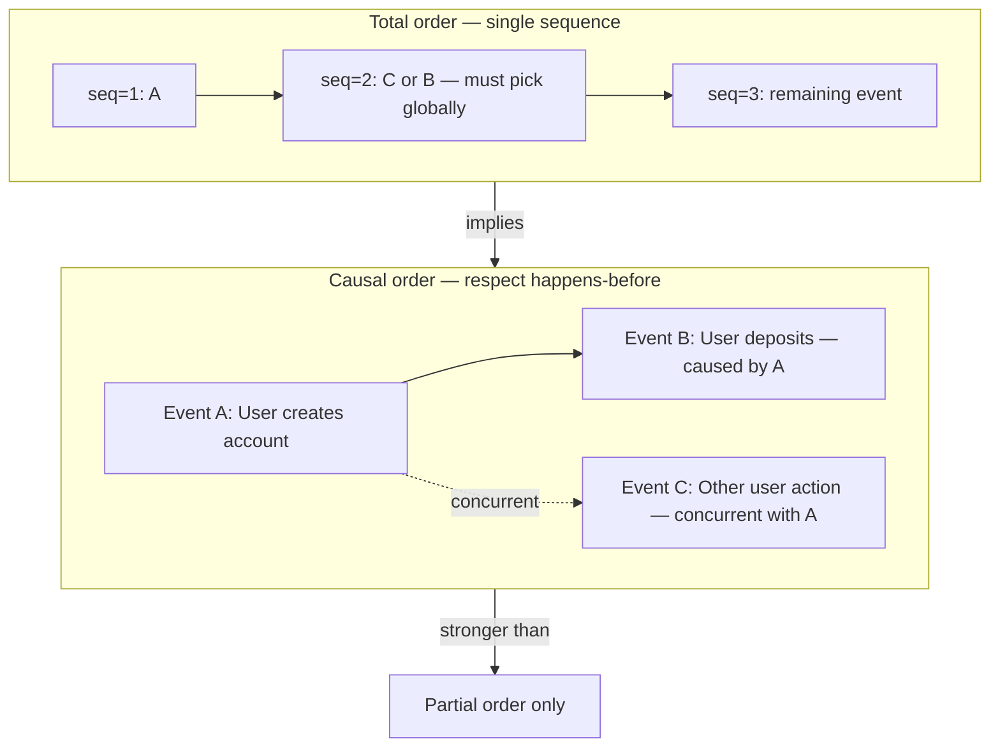
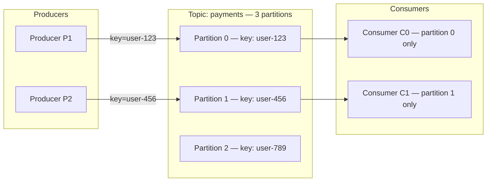
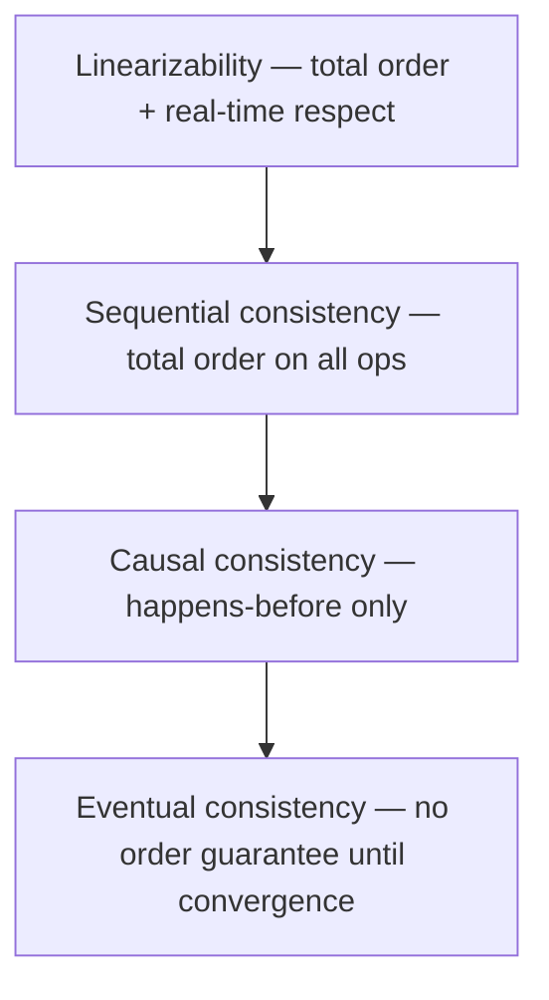

# Ordering of Events

## 1. Executive Summary

In a distributed system, there is no single shared clock that all processes agree on. Yet applications constantly need to answer: *Did event A happen before event B?* Should all observers see the same sequence of operations? Can we replay history deterministically?

**Event ordering** is the discipline of defining and enforcing relationships among events across processes. The literature and production systems distinguish several layers:

- **Happens-before** (causal ordering): If A causally influenced B—because A sent a message read by B, or both modified the same shared state in a defined order—then every correct observer must treat A as preceding B.
- **Total order**: Every pair of events can be placed in a single global sequence; no two events are incomparable. Consensus logs, single-partition Kafka topics, and primary-replica databases often expose total order within a scope.
- **Partial order**: Some events are concurrent (neither happened before the other); vector clocks capture this structure.

Choosing the wrong ordering guarantee wastes money (global coordination where causality suffices) or corrupts semantics (causal violations when consumers assume order that the broker does not provide). Principal architects must map business invariants—"user must see their own writes," "inventory decrement must follow reservation"—to explicit ordering scopes: per key, per partition, per session, or global.

This chapter formalizes causal vs. total ordering, explains global sequence numbers and their coordination cost, walks through Kafka partition ordering as a production case study, and connects ordering to consistency models, replication, and interview system-design questions.

## 2. Why This Topic Matters

Ordering is not an implementation detail buried in a message broker configuration. It is a **correctness contract** between producers, storage, and consumers.

Interviewers at principal level probe whether you can:

- Explain why **wall-clock timestamps do not define causality** across nodes.
- Distinguish **per-partition order** from **global order** and state what breaks when you scale partitions.
- Design a pipeline where **causal dependencies cross partition boundaries** without forcing a single global sequencer.
- Predict failure modes: duplicate delivery, reordering after failover, out-of-order reads after leader election.

In production, ordering mistakes surface as subtle bugs: a user creates an account then deposits funds, but the deposit event is processed first; two microservices observe contradictory sequences and reconcile incorrectly; a stream processor double-counts because retried messages appear before the original. These are safety issues disguised as "eventual consistency will fix it."

Organizations that treat Kafka "ordering guarantee" as universal often discover it applies only **within one partition**. Architects who understand ordering design **partition keys**, **idempotency**, **version vectors**, and **single-writer scopes** deliberately rather than accidentally.

## 3. Problems Being Solved

| Problem | Ordering need | Typical mistake |
|---------|---------------|-----------------|
| Ledger / balance updates | Causal or total order per account | Sharding by user without colocating dependent events |
| Inventory reservation → commit | Strict causal chain | Separate topics with no sequencing key |
| Stream processing joins | Aligned event time or partition colocation | Global sort by timestamp across shards |
| Audit and compliance replay | Total order in an audit log | Clock-based ordering across regions |
| Cache invalidation | Invalidate after write visible | Async replication with visible reordering |
| Session state ("read your writes") | Causal order per session | Sticky routing without version checks |

Without explicit ordering goals, teams debate "Kafka vs. RabbitMQ" without specifying **which events must be ordered relative to which others**.

## 4. Assumptions and System Model

Assume the **partial failure** model: processes crash, networks delay and reorder messages, and **physical clocks are not reliable** for establishing causality across nodes (clock skew and leap adjustments are routine).

We reason about **events**—message sends/receives, local computations, writes to storage—and the **happens-before** relation (Lamport, 1978):

- If events \(a\) and \(b\) occur in the same process and \(a\) occurs before \(b\) in that process, then \(a \rightarrow b\) (happens-before).
- If \(a\) is a send and \(b\) is the corresponding receive, then \(a \rightarrow b\).
- Happens-before is transitive.

Events not related by happens-before are **concurrent** (symbolically \(a \parallel b\)).

| Ordering scope | Coordinator | Failure impact |
|----------------|-------------|----------------|
| Per process | Local program order | Crash loses in-memory order unless logged |
| Per partition / shard | Partition leader or log | Failover may expose reordering windows unless carefully designed |
| Per key / entity | Routing + single writer | Mis-keyed events break colocation |
| Global | Consensus cluster or central sequencer | Throughput bottleneck; partition sensitivity |

**Important:** Ordering guarantees are always **scoped**. Claiming "our system is ordered" without naming the scope is incomplete for interviews and dangerous in design reviews.

## 5. Essential Terminology

| Term | Definition |
|------|------------|
| **Event** | An identifiable occurrence: send, receive, local step, or persistent write. |
| **Happens-before (\(\rightarrow\))** | Causal precedence relation; if \(a \rightarrow b\), observers must not act as if \(b\) preceded \(a\). |
| **Concurrent events (\(\parallel\))** | Neither \(a \rightarrow b\) nor \(b \rightarrow a\); no causal link. |
| **Causal order / causal consistency** | Operations respect happens-before; concurrent operations may be seen in different orders by different observers. |
| **Total order** | For any two events \(a, b\) in the scope, either \(a\) precedes \(b\) or \(b\) precedes \(a\) in the declared sequence. |
| **Partial order** | Some event pairs are ordered; others remain concurrent. |
| **Logical clock** | A counter or vector assigned to events such that if \(a \rightarrow b\) then \(\text\{clock\}(a) < \text\{clock\}(b)\) (Lamport); vector clocks strengthen this for concurrency detection. |
| **Global sequence number** | A monotonically increasing identifier assigned by a central or consensus-backed authority defining total order. |
| **Partition key** | Field used to route related events to the same ordered shard (e.g., Kafka partition). |
| **Per-partition ordering** | Broker preserves order of writes as observed by a single consumer reading one partition sequentially. |
| **Idempotent consumer** | Consumer that can safely process duplicate or reordered deliveries when combined with deduplication keys. |
| **Fencing / generation** | Token preventing stale leaders from appending out-of-order or duplicate entries after failover. |

**Mnemonic:** *Causal = respect cause; total = one line for everyone; partial = some pairs incomparable.*

## 6. Core Mechanism

### Causal ordering vs. total ordering

**Causal ordering** requires that if \(a \rightarrow b\), every process delivers or observes \(a\) before \(b\). It does **not** require agreeing on the order of concurrent events. Multiple replicas may permute concurrent writes differently while still satisfying causal consistency.

**Total ordering** requires a single sequence \(S\) such that all correct processes observe events consistent with \(S\). Implementations typically assign increasing sequence numbers via:

1. **Single leader append** (database primary, Kafka partition leader, Raft log index).
2. **Consensus round** per operation (expensive at high throughput).
3. **Central sequencer service** (simple logically; operational bottleneck).



*Figure 1: Causal ordering constrains only causally related pairs. Total ordering assigns every event a unique position; concurrent events must still be serialized globally.*

**Key implication:** Total order is **stronger** than causal order. You can implement causal delivery without a global sequencer by tracking dependencies (vector clocks, dependency metadata on messages). Forcing total order everywhere often caps throughput and widens failure blast radius.

### Global sequence numbers

A **global sequence number** (GSN) is a monotonic identifier—often 64-bit integer or (epoch, counter)—assigned at a coordination point:

| Approach | Mechanism | Ordering strength | Cost |
|----------|-----------|-------------------|------|
| Raft / Paxos log index | Leader appends; quorum replicates | Total order within log | Consensus RTT; leader capacity |
| Spanner TrueTime + transaction timestamp | External time + commit wait | Total order across transactions in scope | Clock uncertainty bounds; commit latency |
| Database auto-increment (single primary) | Primary assigns next ID | Total order for writes through primary | Primary bottleneck; failover complexity |
| Hybrid Logical Clock (HLC) | Physical + logical components | Approximate total order for observability | Not a correctness substitute for consensus |

GSNs enable **cheap comparisons**: `if seq_seen < seq_required then stale`. They underpin **log compaction**, **snapshot boundaries**, **change data capture (CDC) offsets**, and **optimistic concurrency** (`WHERE version = expected`).

**Safety vs. liveness:** Assigning the next sequence number is a **safety** problem (no duplicates, no gaps if you claim strict continuity). Progressing the sequencer under partition is **liveness** (minority partition may stall).

### Kafka partition ordering (production pattern)

Apache Kafka does **not** provide global order across a topic. It provides **order per partition**: consumers reading a single partition with one consumer instance per partition receive records in **offset order** as stored on the partition leader's log.



*Figure 2: Partition key routes related events to the same ordered log. Cross-partition events have no broker-level order relationship.*

**Producer settings (implementation choices from Kafka documentation):**

- `max.in.flight.requests.per.connection > 1` without idempotence can reorder batches after retries.
- **Idempotent producer** (`enable.idempotence=true`) assigns producer IDs and sequence numbers per partition, reducing duplicate and reorder risk from retries within a partition.
- **Transactions** extend ordering and atomicity across partitions for consume-transform-produce pipelines—but with coordination overhead.

**Consumer reality:** Multiple consumers in the same group divide partitions; each partition is consumed by one consumer at a time, preserving per-partition order. Rebalances move partitions—processing must handle **at-least-once** semantics with idempotent or transactional stores.

### Ordering hierarchy diagram



*Figure 3: Ordering strength correlates with consistency models. Stronger models impose more order; weaker models permit more concurrency.*

## 7. Step-by-Step Walkthrough

### Walkthrough A: Account creation and deposit (causal chain)

1. **Service A** (users API) writes `CREATE account-42` to the database; locally orders this before publishing.
2. **Service A** publishes `AccountCreated{account=42}` to Kafka topic `accounts`, key `account-42`, partition determined by hash(key).
3. **Service B** (ledger) consumes `AccountCreated`, then publishes `InitialBalance{account=42}` to topic `ledger`, key `account-42`.
4. **Causal dependency:** Ledger event depends on account event. If ledger used a **different partition key** (e.g., hash of `region` instead of `account-42`), **broker order would not align with causality**.
5. **Correct design:** Same keying function for all account-scoped events, or carry **causal metadata** (parent offset / vector clock) so downstream can buffer until dependencies arrive.

### Walkthrough B: Global audit log with consensus sequencer

1. **Audit service** submits each security-sensitive action to a **Raft cluster** (or single-region consensus log).
2. **Leader** assigns log index \(i\) as GSN; replicates to majority before acknowledging.
3. **Readers** tail the log in index order—total order cluster-wide for audit entries.
4. **Failover:** New leader continues from highest committed index; fencing prevents old leader from assigning conflicting indices after partition heals.
5. **Tradeoff:** Global audit ordering is correct but **not** suitable for every microservice event at firehose rates.

### Walkthrough C: Kafka consumer failover and ordering window

1. Consumer C reads partition 5 at offset 1000; processes message; **crashes before commit offset**.
2. Replacement consumer starts at last committed offset (e.g., 999)—**redelivers** message at 1000.
3. Ordering within partition is preserved; **at-least-once** semantics require idempotent side effects.
4. If producer retried without idempotence during a brief leader election, partition could contain **duplicate sequence gaps**—consumers must dedupe by business key + offset or producer sequence.

## 8. Invariants and Guarantees

| Guarantee | Type | Statement |
|-----------|------|-----------|
| Per-partition append order | Safety (broker) | Log offsets increase; each offset holds one record (per epoch) |
| Causal delivery | Safety | If \(a \rightarrow b\), no delivery of \(b\) before \(a\) |
| Total order | Safety | All observers agree on single sequence of events in scope |
| Monotonic GSN | Safety | Sequence numbers strictly increase for new events in scope |
| Consumer progress | Liveness | Eventually process or skip poison messages with policy |
| Cross-partition order | **Not guaranteed** by Kafka | Application must enforce if required |

When reviewing designs, write invariants as: *For all events \(e_1, e_2\) on key \(k\), if \(e_1 \rightarrow e_2\) then \(\text\{offset\}(e_1) < \text\{offset\}(e_2)\) on the partition for \(k\).*

## 9. Failure Scenarios

### Scenario 1: Partition key mismatch (causal violation)

**Setup:** User events keyed by `user_id`; billing events keyed by `billing_id` unrelated to user shard.

**Failure:** Deposit appears processed before account exists in billing consumer view.

**Property violated:** Causal order (safety of application semantics).

**Mitigation:** Unified keying, causal metadata buffers, or saga orchestration with explicit state machine.

### Scenario 2: Kafka leader election with non-idempotent producer

**Setup:** `max.in.flight.requests.per.connection=5`, retries enabled, idempotence off.

**Failure:** After broker failover, batch retry may reorder within partition; consumers see balance update before debit.

**Mitigation:** Enable idempotent producer; reduce in-flight requests; use transactions if needed.

### Scenario 3: Global sequencer partition (liveness stall)

**Setup:** Single-region Raft sequencer for all order IDs; network partition isolates minority.

**Failure:** Minority cannot allocate new GSNs—publishers block or fail.

**Mitigation:** Scope sequencers (per shard), hierarchical GSN (region + local counter), or accept causal-only ordering without global IDs.

### Scenario 4: Clock-based ordering across regions

**Setup:** Events sorted by `timestamp()` from producer wall clocks for global display feed.

**Failure:** Clock skew causes newer event in causality to sort earlier; users see inconsistent timelines.

**Mitigation:** Logical clocks, HLC for observability only, or centralized assignment at write path.

### Scenario 5: Multiple consumers per partition (misconfiguration)

**Setup:** Two consumer threads assigned same partition without coordination.

**Failure:** Interleaved processing breaks per-partition order assumption even though broker order is correct.

**Mitigation:** One in-flight consumer per partition; partition count ≥ consumer parallelism.

## 10. Performance Characteristics

Ordering strength trades with **latency and throughput**:

| Mechanism | Typical bottleneck | Qualitative effect |
|-----------|-------------------|-------------------|
| Per-partition Kafka append | Leader disk I/O and replication | High throughput; order scoped to partition |
| Global consensus per op | Round-trip to quorum | Low throughput; strong total order |
| Vector clock metadata | Message size \(O(n)\) processes | Bandwidth cost in wide systems |
| Causal delivery buffers | Memory until dependencies arrive | Latency tail under cross-partition causality |
| Synchronous replication | Slowest replica RTT | Extends visibility order delay |

Do not quote universal latency numbers—measure for your broker version, replication factor, and consumer pattern. Qualitatively: **each additional ordering scope merged into global order adds coordination on the critical path.**

## 11. Scalability Limits

- **Single partition throughput ceiling:** Kafka partition is append log—one leader handles writes; hot keys create hot partitions.
- **Global sequencer:** Throughput bounded by single leader or small consensus group; not sharded without splitting order scope.
- **Vector clocks:** State grows with number of participants in causal group; impractical for millions of independent sessions without per-session vectors.
- **Cross-partition causal chains:** Buffer memory grows with lag between dependent partitions.
- **Consumer parallelism:** Maximum useful consumers in a group ≤ partition count for ordered processing per key if keys map one-to-one with partitions.

## 12. Operational Considerations

- **Document ordering scope** in service catalogs: "Ordered per `account_id` within `payments` topic."
- **Monitor consumer lag per partition**—lag on one partition signals hot key or slow handler breaking effective timeliness of ordered pipelines.
- **Rebalance storms** pause consumption; ordering resumes but **duplicates** increase—alert on duplicate rate.
- **Compaction topics** retain last record per key; ordering of historical tombstones matters for CDC—validate compaction policies.
- **Upgrade testing:** Broker upgrades trigger leader movement; validate producer idempotence settings across client versions.

## 13. Security Considerations

Ordering attacks are subtle:

- **Byzantine or compromised producers** can inject events with crafted timestamps or keys to manipulate consumer state unless authenticated and authorized per topic.
- **Replay attacks** resend old messages; monotonic GSN or offset checks at consumers prevent stale replays affecting state.
- **Cross-tenant key collision** (weak hashing) could colocate unrelated tenants—ordering side effects become confidentiality issues.

Authenticate producers, enforce ACLs per topic, and validate **tenant id in key** alongside business id.

## 14. Cost Considerations

- **More partitions** increase parallelism but multiply storage metadata and consumer overhead; over-partitioning raises cost without fixing wrong key design.
- **Global ordering via consensus** often requires dedicated highly available clusters (multi-AZ etcd, Kafka with limited partition scaling, Spanner)—premium capacity.
- **Transactional Kafka** adds coordination latency—CPU on brokers and longer end-to-end pipeline time.
- **Incident cost of reorder bugs** exceeds broker savings: manual reconciliation, regulatory exposure for audit trails.

## 15. Production Implementations

### Apache Kafka

- **Guarantee:** Strict order per partition for consumers reading sequentially from one partition assignment.
- **Cross-partition:** No order guarantee; scale-out via partitions.
- **Idempotent producer:** Per-partition producer sequence deduplication (Kafka documentation, idempotent producer design).
- **Transactions:** Atomic write to multiple partitions with `transactional.id` fencing stale producers.

### PostgreSQL (single primary)

- **Total order** of committed transactions via WAL LSN and transaction ID—**one writer** primary model.
- **Read replicas** may observe stale order relative to primary—**not** global linearizable reads without routing or sync replication.

### Other systems (brief)

- **Kinesis / Pulsar / Redpanda:** Shard or partition model—order within shard; compare operational limits, not semantic differences.
- **Spanner:** TrueTime-backed external consistency for cross-shard transaction order—different cost model than append logs.
- **etcd / Raft:** Log index as total order for state changes; Kubernetes resourceVersion monotonicity within etcd's model.

## 16. Alternatives and Tradeoffs

| Approach | Ordering provided | When to use |
|----------|-------------------|-------------|
| Single partition topic | Total order for all events | Low volume control planes only |
| Key-partitioned logs | Total per key; partial globally | High volume entity-scoped workflows |
| Vector clocks on messages | Causal detection; partial | Multi-region CRDTs, collaborative editing |
| Database primary + CDC | Total order per shard via WAL | Systems already centralized on SQL |
| Distributed consensus per event | Global total order | Audit, financial ledger sequencing |
| Unordered queue + idempotent merge | Eventual | Analytics where order irrelevant |

**Decision criteria:** (1) Which event pairs must be comparable? (2) What is peak events/sec for that scope? (3) Can consumers buffer concurrent events? (4) What is the failure mode if order stalls?

## 17. Common Misconceptions

| Misconception | Reality |
|---------------|---------|
| "Kafka orders our entire topic" | Only per partition; partition count > 1 ⇒ no global order. |
| "Timestamps establish causality" | Wall clocks are not causality; use happens-before or logical clocks. |
| "More consumers = faster ordered processing" | Parallelism bounded by partitions; extra consumers idle. |
| "Causal consistency is free" | Cross-partition causality needs metadata or key design. |
| "Retries always safe with ordering" | Non-idempotent producers can reorder or duplicate within partition. |
| "Total order everywhere is best" | Caps scale; causal order often matches application deps. |

## 18. Principal Architect Perspective

Principal interviews expect you to **start from dependencies**, not technology:

1. Draw the **happens-before graph** for critical workflows (signup → verify → provision).
2. Name **ordering scope** explicitly on architecture diagrams ("order: per `order_id`").
3. Explain **failover behavior**—what duplicates and reorder windows exist.
4. Quantify **hot partition risk** from key selection.
5. Connect to **business SLAs**: is stale order a revenue bug or analytics noise?

Organizational signal: teams that lack ordering vocabulary ship "async everywhere" systems that require heroic reconciliation engineering. Architects who scope ordering pay coordination costs only where invariants demand it.

## 19. Architecture Review Exercise

**Scenario:** E-commerce checkout publishes `OrderPlaced`, `PaymentCaptured`, and `InventoryReserved` to three Kafka topics with keys: `order_id`, `payment_id`, and `sku_id` respectively. A fulfillment service consumes all three topics to assemble shipments.

**Review prompts:**

1. Which events are causally related? Is the broker likely to deliver them in causal order to fulfillment?
2. What happens when `PaymentCaptured` arrives before `OrderPlaced`?
3. Propose keying, topic consolidation, or buffering strategy with stated ordering guarantees.
4. How do idempotent producers and consumer offset commits affect duplicate handling during deploy?

**Expected findings:** Current design does not guarantee causal or total order across topics; fulfillment needs a **state machine per order_id**, **join buffer with timeouts**, or **single ordered changelog per order**.

## 20. Whiteboard Explanation

**60-second version:**

> "Distributed systems can't rely on wall clocks for global order. Lamport's happens-before captures causality: same process order, send before receive, transitivity. Causal ordering means everyone respects those edges but may disagree on concurrent events. Total ordering picks a global sequence for every event—usually via a leader log or consensus index. Kafka gives you total order **inside one partition** if you use one consumer per partition and idempotent producers; it does **not** order across partitions. So I design partition keys to colocate causally related events, use global sequence numbers only where the business truly needs a single timeline, and make consumers idempotent because ordering pairs with at-least-once delivery after failures."

## 21. Interview Questions

1. **Define happens-before. Give three ways the relation arises.**
   - *Signals:* Process order, message send/receive, transitivity.
   - *Red flags:* "Earlier timestamp" as definition.

2. **Causal vs. total ordering—which is stronger and why?**
   - *Signals:* Total implies causal for comparable pairs; total serializes concurrent events.

3. **How does Kafka provide ordering? What are the limits?**
   - *Signals:* Per partition, offset order; key determines partition; no cross-partition guarantee.

4. **Why can retries break ordering without idempotent producers?**
   - *Signals:* In-flight batches, reorder on retry, duplicate sequence numbers.

5. **Design partition keys for a user activity feed and a per-user settings service.**
   - *Signals:* `user_id` colocation; hot user risk; secondary indexing patterns.

6. **What is a global sequence number used for?**
   - *Signals:* Monotonic comparison, CDC, fencing, snapshot boundaries, optimistic locking.

7. **Can vector clocks provide total order?**
   - *Signals:* Detect concurrency; cannot totally order without extra rule (e.g., tie-break).

8. **How does Raft log index relate to total order?**
   - *Signals:* Leader assigns indices; committed prefix agreed; linearizable state machine apply order.

9. **User must see their own writes immediately after POST. What ordering/consistency do you need?**
   - *Signals:* Read-your-writes, session stickiness or monotonic reads, causal or stronger.

10. **Two partitions both emit events affecting the same aggregate—how do you merge order?**
    - *Signals:* Application-level merge, CRDT, saga, or single partition redesign.

11. **Is HLC a replacement for consensus sequencing?**
    - *Signals:* Observability and approximate ordering; correctness needs happens-before or consensus.

12. **Explain consumer rebalance impact on ordering and duplicates.**
    - *Signals:* Partition move, offset commit timing, at-least-once redelivery.

## 22. Interview Follow-Ups

1. **If we double partitions for throughput, what breaks for ordering?**
   - *Tradeoff:* Keys remap unless sticky assignment; cross-key order unchanged; rebalance risk.

2. **Exactly-once semantics—does that mean exactly-once order?**
   - *Nuanced:* Exactly-once processing with idempotence; order scope still partition-bound.

3. **How would Spanner differ from Kafka for this checkout workflow?**
   - *Signals:* Transactional cross-row order; cost and write latency; not a firehose log.

4. **When would you accept unordered delivery entirely?**
   - *Signals:* commutative updates, CRDT counters, batch analytics.

5. **How do you test ordering guarantees in CI?**
   - *Signals:* Jepsen-style workloads, partition injection, failover fuzz, assert invariants.

6. **Executive wants one global timeline for all user events at 1M events/sec.**
   - *Signals:* Impossible on single shard; hierarchical timelines; per-user views.

## 23. Strong Answer Example

**Question:** "We process payments on Kafka. How do you ensure payment always follows order creation?"

> "First I map causality: order creation must happen-before payment capture in the business workflow. Kafka only orders per partition, so I need order creation and payment events for the same purchase to land on the same partition—typically the same message key, `order_id`, on one topic or on multiple topics only if I implement a consumer-side buffer that waits for `OrderCreated` before applying `PaymentCaptured`. I'd enable idempotent producers to prevent retry reordering, use one consumer per partition for the payment processor, and store processed offsets with idempotent writes keyed by `order_id` plus offset. If payment and order must be atomic with inventory, I'd evaluate a transactional outbox to one changelog topic or a database transaction plus CDC where WAL order provides per-shard total order. I'd document that we guarantee causal order per `order_id`, not global order across all orders, and load-test hot `order_id` patterns if bulk importers exist."

## 24. Weak Answer Example

**Question:** "We process payments on Kafka. How do you ensure payment always follows order creation?"

> "Kafka is ordered, so we just publish to different topics and consume asynchronously. We'll use timestamps to sort if needed."

**Why weak:** Confuses topic-level with partition-level order; ignores cross-topic causality; timestamps don't fix causality; no idempotence, keying, or failure analysis.

## 25. Hands-On Exercise

**Exercise: Ordering invariant matrix**

1. Pick a workflow with three events (e.g., register → verify email → enable feature).
2. Draw happens-before graph.
3. Design Kafka topics, partition counts, and keys; fill table: causal order guaranteed? total order? duplicates after crash?
4. Change partition key on event 2 and repeat—note violations.
5. Optional: run local Kafka with idempotence on/off, kill producer mid-batch, observe consumer order.

**Success criteria:** Written invariant per key; explicit statement of cross-partition behavior; rebalance duplicate handling documented.

## 26. Knowledge Check

1. If \(a \parallel b\), does causal ordering determine whether \(a\) precedes \(b\)? *(No—concurrent events may be ordered arbitrarily.)*
2. Does total order across a Kafka topic with 12 partitions exist? *(Not globally—only within each partition.)*
3. Can Lamport timestamps detect concurrency? *(Not reliably—need vector clocks.)*
4. What breaks if `max.in.flight.requests > 1` without idempotence? *(Possible per-partition reorder on retry.)*
5. Is monotonic GSN assignment a safety or liveness concern? *(Primarily safety—no duplicates; progress is liveness.)*

## 27. Flashcards

| # | Front | Back |
|---|-------|------|
| 1 | Happens-before | Causal precedence; if \(a \rightarrow b\), observers must not treat \(b\) before \(a\). |
| 2 | Concurrent events | Neither happens-before the other; written \(a \parallel b\). |
| 3 | Causal ordering | Deliver/observe respecting all happens-before edges. |
| 4 | Total ordering | Single global sequence; every pair comparable. |
| 5 | Kafka ordering scope | Strict order per partition by offset; not across partitions. |
| 6 | Partition key purpose | Routes related events to same ordered log shard. |
| 7 | Idempotent producer | Deduplicates retries using producer id + per-partition sequence. |
| 8 | Global sequence number | Monotonic ID from coordinator; enables comparison and fencing. |
| 9 | Vector clock use | Track causal dependencies; detect concurrency (prerequisite chapter). |
| 10 | Wall-clock timestamps | Do not define distributed causality across nodes. |
| 11 | Consumer per partition | Required to preserve processing order matching log order. |
| 12 | Causal vs total strength | Total order is stronger; serializes concurrent events globally. |

## 28. Cheat Sheet

```
HAPPENS-BEFORE: process order | send→receive | transitive
CONCURRENT: neither a→b nor b→a

CAUSAL ORDER: respect → edges only
TOTAL ORDER: one sequence for all events in scope

KAFKA:
  ordered:  single partition, single consumer, sequential offsets
  not:      cross-partition | global topic with partitions > 1
  keys:     colocate causal chain on same partition
  retries:  enable.idempotence=true (per-partition seq)

GSN sources: Raft index | DB primary | consensus service
  use: offsets, CDC, versioning, stale detection

Review checklist:
  [ ] Draw happens-before for workflow
  [ ] Name ordering scope (per key / partition / global)
  [ ] Partition key covers causal deps
  [ ] Idempotent producer + consumer
  [ ] Failover duplicate/reorder window documented
```

## 29. Related Concepts

- [Vector Clocks](/docs/time-ordering-and-coordination/vector-clocks) — prerequisite; causal dependency tracking
- [Time, Ordering, and Coordination Overview](/docs/time-ordering-and-coordination/overview) — domain map
- [Consistency](/docs/consistency/overview) — consistency models built on ordering
- [Replication](/docs/replication/overview) — log order and replica lag
- [Messaging and Streaming](/docs/messaging-and-streaming/overview) — brokers and delivery semantics
- [Safety and Liveness](/docs/distributed-systems-foundations/safety-and-liveness) — ordering as safety invariant
- [Partial Failure](/docs/distributed-systems-foundations/partial-failure) — system model

## 30. References

### Primary sources

- Lamport, L. "Time, Clocks, and the Ordering of Events in a Distributed System." *Communications of the ACM*, 1978. Defines happens-before, logical clocks, and ordering of events.
- Lamport, L. "The Mutual Exclusion Problem." *Journal of the ACM*, 1986. Causal and total order in synchronization.
- Fidge, C. J.; Mattern, F. Vector clocks for detecting causality. (See also prerequisite vector clocks chapter.)
- Herlihy, M. P., Wing, J. M. "Linearizability: A Correctness Condition for Concurrent Objects." *ACM TOPLAS*, 1990. Total order with real-time constraints.
### Production documentation

- Apache Kafka documentation — [https://kafka.apache.org/documentation/](https://kafka.apache.org/documentation/) — partitions, ordering, idempotent producer, transactions.
- Confluent Kafka docs on message ordering and idempotence — implementation guidance for producers.
- PostgreSQL WAL and transaction ID documentation — [https://www.postgresql.org/docs/current/](https://www.postgresql.org/docs/current/) — single-primary ordering via log.
- Google Spanner: TrueTime and external consistency — [https://cloud.google.com/spanner/docs/](https://cloud.google.com/spanner/docs/) — globally ordered transactions at different cost model.
- etcd Raft documentation — [https://etcd.io/docs/](https://etcd.io/docs/) — log index as total order for state changes.

### Textbooks

- Martin Kleppmann, *Designing Data-Intensive Applications* (O'Reilly) — Chapters on unbundling databases, logs, and ordering; Kafka usage patterns.
- Nancy Lynch, *Distributed Algorithms* (Morgan Kaufmann) — formal partial and total order, broadcast protocols.

### Distinction

| Claim type | Source |
|------------|--------|
| Happens-before and logical clocks | Lamport (1978) |
| Kafka per-partition ordering | Apache Kafka official documentation |
| Idempotent producer semantics | Kafka documentation and design docs |
| Spanner external consistency | Google Spanner documentation and original Spanner paper |
| Operational tradeoffs in this chapter | Engineering interpretation—validate against your broker version and topology |
