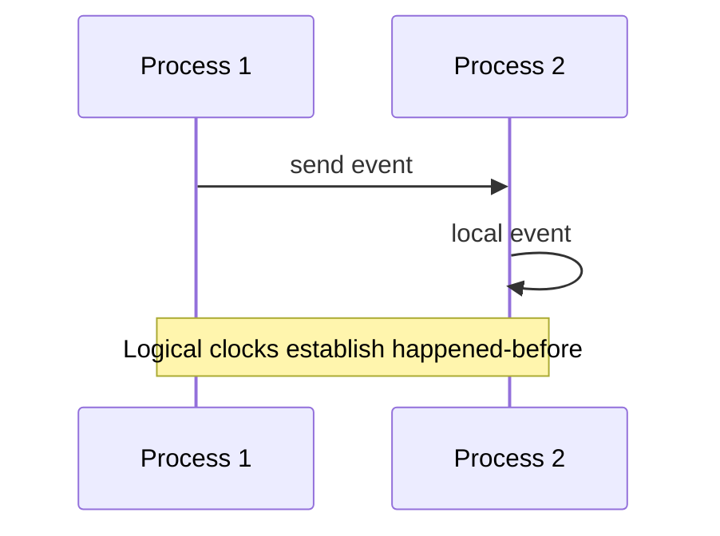

# Time, Ordering, and Coordination

Physical clocks, logical clocks, causal ordering, and why "happened-before" matters more than wall time.

*Figure: Event ordering across processes without a global clock.*

## What You'll Learn

Clocks in distributed systems are unreliable witnesses. This domain teaches how to order events without trusting NTP, how Lamport and vector clocks capture causality, and when physical time (TrueTime, HLC) is worth the cost.

## Chapters

| Chapter | Focus |
|---------|-------|
| [Physical and Logical Time](/docs/time-ordering-and-coordination/physical-and-logical-time) | NTP, clock skew, TrueTime, hybrid logical clocks |
| [Lamport Clocks](/docs/time-ordering-and-coordination/lamport-clocks) | Logical timestamps, happened-before relation |
| [Vector Clocks](/docs/time-ordering-and-coordination/vector-clocks) | Detecting concurrent events, causal ordering |
| [Ordering of Events](/docs/time-ordering-and-coordination/ordering-of-events) | Total vs partial order, coordination implications |

## Learning Path

1. **Physical and Logical Time** — understand why wall clocks fail at scale.
2. **Lamport Clocks** — the minimum ordering primitive every architect should know.
3. **Vector Clocks** — detect concurrency for conflict resolution and CRDTs.
4. **Ordering of Events** — connect clocks to system design decisions.

## Interview Prep

| Resource | Topic |
|----------|-------|
| [Google Spanner TrueTime](/docs/real-world-scenarios/google-spanner-global-consistency) | Global timestamps, commit-wait |
| [Dropbox Sync Conflicts](/docs/real-world-scenarios/dropbox-file-sync-conflicts) | Version vectors, conflict copies |
| Lab | [Vector clocks](/docs/time-ordering-and-coordination/vector-clocks#25-hands-on-exercise) on **`:8097`** — [engineer guide](/docs/time-ordering-and-coordination/vector-clocks#engineer-guide-how-the-local-stack-works) |

## Prerequisites

- [Distributed Systems Foundations](/docs/distributed-systems-foundations/overview)

## Next Domain

Continue to [Consistency Models](/docs/consistency/overview) and [Consensus](/docs/consensus/overview).

Return to the [Curriculum Overview](/docs/start-here/curriculum-overview) for the full learning path.
