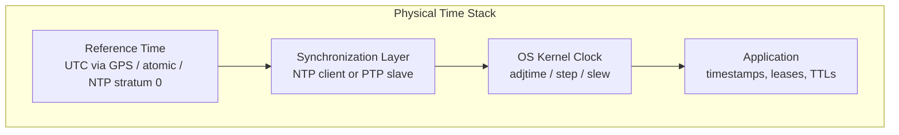
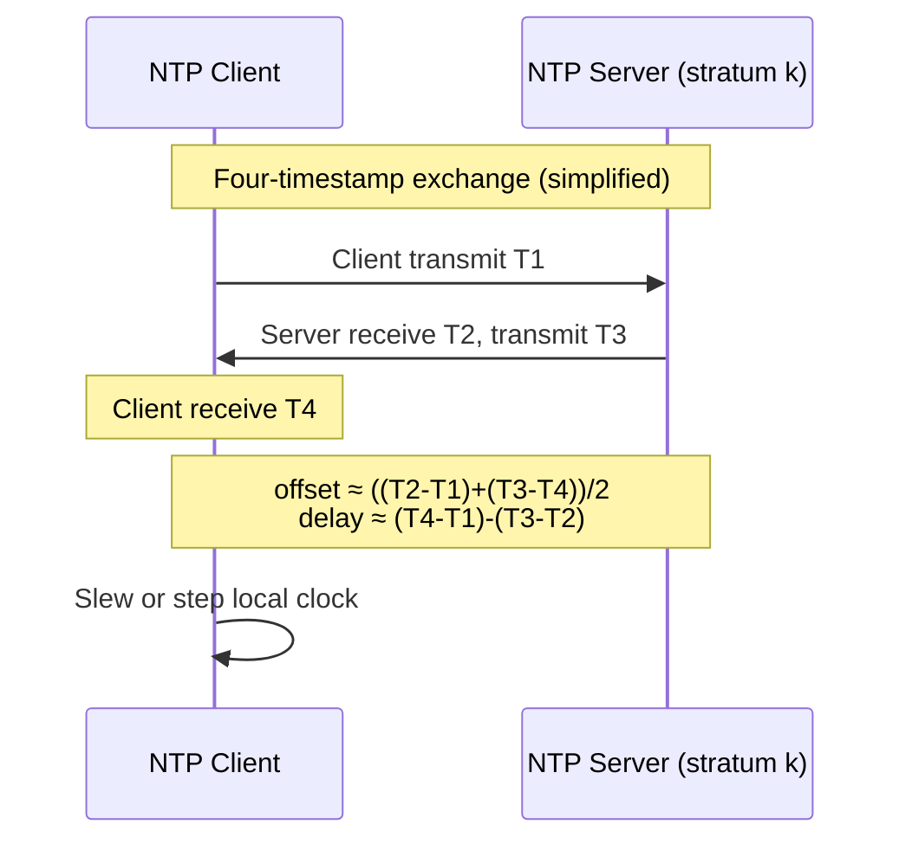
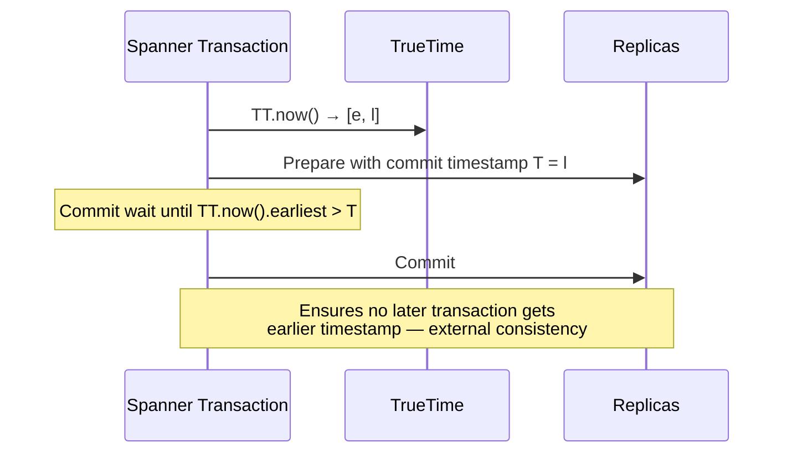

# Physical and Logical Time

## 1. Executive Summary

Distributed systems need a notion of **when** events happened. **Physical time**—wall-clock timestamps from real-time clocks—is intuitive and cheap to read, but it is **not a reliable primitive for correctness** across nodes. Clocks drift, synchronize imperfectly, and can jump backward during corrections or leap-second handling. **Logical time**—Lamport clocks, vector clocks, hybrid logical clocks—orders events by causality without trusting synchronized hardware.

This chapter establishes the physical-time foundation: how clocks work, how **NTP** (Network Time Protocol) and **PTP** (Precision Time Protocol, IEEE 1588) synchronize them, why **clock skew** breaks naive designs, and how **leap seconds** create operational surprises. It previews **TrueTime** (Google Spanner's clock abstraction) as a production pattern that turns bounded clock uncertainty into a coordination primitive rather than pretending clocks are perfect.

**Key takeaway for architects:** Use physical time for metrics, TTLs, and human correlation; use logical time (or bounded-uncertainty protocols like TrueTime) when ordering must reflect causality or consistency guarantees. Never assume `timestamp(A) < timestamp(B)` implies A happened before B.

## 2. Why This Topic Matters

Principal-level interviews probe whether you understand **why** systems fail when teams treat `now()` as ground truth. A senior engineer might say "we use NTP." A principal architect explains:

- What **assumption** NTP actually provides (and what it does not)
- How **skew** interacts with leases, session timeouts, and conflict resolution
- When to invest in **PTP** or specialized time infrastructure versus redesigning around logical ordering
- How **Spanner's TrueTime** changes the system model from pure asynchrony to **bounded clock uncertainty**

Time mistakes surface as subtle production bugs: duplicate primary keys after clock rollback, expired sessions that are still valid, "last write wins" picking the wrong write, and audit trails that violate apparent ordering. The [Distributed System Models](/docs/distributed-systems-foundations/distributed-system-models) chapter established that pure asynchronous models cannot use wall clocks for correctness; this chapter explains what happens when you *do* use them—and how to do so safely.

## 3. Problems Being Solved

| Problem | Why time matters |
|---------|------------------|
| **Event ordering** | Clients and operators need a consistent story of what happened when |
| **Lease expiration** | "Am I still the leader?" depends on comparing local clock to lease deadline |
| **TTL and session expiry** | Cache entries, auth tokens, and distributed locks expire by timestamp |
| **Conflict resolution** | LWW (last-write-wins) uses timestamps as the tie-breaker |
| **Snapshot isolation / MVCC** | Transaction visibility often keyed on commit timestamps |
| **Cross-region causality** | Users expect monotonic reads; clock skew violates that illusion |
| **Compliance and auditing** | Regulators expect append-only timelines—clock jumps complicate proofs |

Physical time solves **human-scale correlation** ("show me logs around 14:32 UTC"). Logical time solves **causal ordering** ("did event B observe event A?"). Production systems often need both—and must not confuse them.

## 4. Assumptions and System Model

This chapter assumes a **message-passing distributed system** without shared memory, consistent with the prerequisite on system models.

**Physical time assumptions (when used):**

- Each node has a **real-time clock** (RTC, often backed by a crystal oscillator) exposing UTC or local time via the OS.
- Clocks **drift** relative to a reference (typically UTC) at rates that depend on hardware and temperature.
- **Synchronization** (NTP, PTP, or proprietary) periodically estimates offset and optionally slews or steps the clock.
- Synchronization provides **accuracy and precision bounds** that are **statistical and environment-dependent**, not mathematical guarantees unless additional infrastructure (GPS, atomic clocks, dedicated hardware) is present.

**What we do *not* assume:**

- Perfectly synchronized clocks across nodes
- Monotonic wall clocks (NTP steps and leap-second policies can move time backward)
- That `time.time()` on two machines is comparable without an explicit uncertainty interval

**Logical time assumptions (preview):**

- Processes can exchange messages with **happens-before** relationships (Lamport, 1978).
- Logical clocks provide **consistent ordering of causally related events** without bounding physical skew.

**Relation to timing models:** Trusting synchronized physical clocks is an **additional assumption** beyond partial synchrony. It can enable stronger guarantees (e.g., Spanner external consistency) but introduces a **new failure mode**: clock uncertainty violation.

## 5. Essential Terminology

| Term | Definition |
|------|------------|
| **Physical time / wall-clock time** | Time from a real-time clock, usually mapped to UTC |
| **Logical time** | A counter or vector used to order events by causality, not by wall clock |
| **Clock drift** | The rate at which a clock diverges from true time (parts per million) |
| **Clock skew** | The instantaneous difference between two clocks at a moment in time |
| **Offset** | Estimated correction applied to align a clock with a reference |
| **NTP (Network Time Protocol)** | UDP-based protocol (RFC 5905) for synchronizing clocks over IP networks |
| **Stratum** | NTP hierarchy level; stratum 0 is reference clock, stratum 1 syncs to it, etc. |
| **PTP (Precision Time Protocol)** | IEEE 1588 protocol for high-precision synchronization, often sub-millisecond on LAN |
| **Leap second** | Occasional one-second adjustment to UTC to track Earth's rotation |
| **Smearing** | Gradually spreading a leap-second adjustment over hours to avoid backward steps |
| **TrueTime** | Spanner's API returning interval `[earliest, latest]` bounding actual time |
| **Uncertainty bound (ε)** | Maximum half-width of TrueTime interval; commit-wait uses multiples of ε |
| **Monotonic clock** | OS clock that never decreases (`CLOCK_MONOTONIC`); immune to NTP steps but not comparable across nodes |
| **Hybrid Logical Clock (HLC)** | Combines physical and logical components; used in CockroachDB and similar systems |

## 6. Core Mechanism

### 6.1 Physical clocks: drift, sync, and read paths

Every server reads time through the OS kernel. The path typically involves:

1. **Hardware oscillator** → ticks at a nominal frequency
2. **Kernel clock discipline** → applies NTP or PTP adjustments
3. **Application call** → `clock_gettime`, `System.currentTimeMillis`, etc.

Clocks are **continuously wrong** at small scales; synchronization reduces error but never eliminates it in general-purpose deployments.



**Drift** accumulates between synchronizations. If a crystal drifts at 20 ppm (parts per million)—a plausible order of magnitude for inexpensive hardware—a clock can diverge by roughly **1.7 seconds per day** if uncorrected. NTP and PTP exist to bound that divergence.

**Skew** between two nodes is the difference in their readings of "now." Even with NTP, transient skew of milliseconds to tens of milliseconds is common on WAN paths; larger skew appears during network congestion, VM migration, or misconfiguration.

### 6.2 NTP: how Internet clocks synchronize

**NTP** (RFC 5905) is the default clock synchronization mechanism for most servers and cloud VMs. Clients query upstream **time servers**, compute offset using round-trip delay estimation, and adjust local clocks via **slew** (gradual) or **step** (instant jump).



**Stratum hierarchy:** Stratum 0 devices (GPS receivers, atomic clocks) are not on the network as NTP servers; stratum 1 servers attach to them. Your laptop might sync at stratum 3–16 depending on path. Lower stratum is not automatically "better" for your workload, but it indicates distance from reference.

**What NTP provides in practice:**

- **Coarse global alignment** suitable for logs, certificate validity, and human operations
- **Statistical accuracy** that depends on network asymmetry, VM scheduling, and polling interval
- **Not** a linearizability primitive: two NTP-synchronized hosts can still observe events in an order inconsistent with wall-clock timestamps

**Operational modes that matter:**

| Mode | Behavior | Risk |
|------|----------|------|
| **Slew** | Adjust frequency gradually | Slower convergence; safer for apps assuming smooth time |
| **Step** | Jump clock instantly | Can break monotonic assumptions; duplicate or regressed timestamps |
| **Burst / iburst** | Fast initial sync on boot | Large step on fresh VMs |

Cloud providers typically run NTP infrastructure for guests, but **you should verify** the documented time source and leap-second policy for your provider rather than assuming datacenter-grade bounds.

### 6.3 PTP: when milliseconds are not enough

**PTP (IEEE 1588)** targets **high-precision** synchronization on local networks. It uses hardware timestamping at the NIC when available, a **master–slave** hierarchy (similar in spirit to NTP strata), and frequent sync messages.

**Typical use cases:**

- Financial trading and market data (regulatory timestamping)
- Telco 5G fronthaul
- Industrial control and audio/video sync
- Large-scale databases that want tighter bounds than NTP without full TrueTime infrastructure

PTP can achieve **sub-microsecond** skew on a well-engineered LAN with hardware support. On general cloud VMs without PTP hardware, you usually remain on NTP-class accuracy.

**Tradeoff:** PTP requires **network and hardware investment**—dedicated switches, boundary clocks, GPS antennas. NTP is "good enough" for most web services; PTP is for domains where timestamp error has direct monetary or safety cost.

### 6.4 Leap seconds: the one-second edge case

**UTC** includes **leap seconds** to align civil time with Earth's rotation. A leap second inserts an extra second (or historically, could remove one) at scheduled boundaries.

Computers struggle because:

- `23:59:60` is valid UTC but breaks parsers that assume 60-second minutes
- Stepping clocks **backward** repeats a second—two distinct events can share the same timestamp
- Different organizations **handle leaps differently**: step, smear (Google, Microsoft Azure documented smear strategies), or ignore until manual intervention

**Leap smearing** spreads the extra second over many hours so clocks never jump backward—preserving monotonicity of *smeared* time but temporarily diverging from civil UTC. Mixed environments (some nodes smear, some step) **increase skew** during the smear window.

For architects: **document your organization's leap-second policy** and test time-dependent subsystems (TLS, Kerberos, distributed locks, LWW stores) before each announced leap. IERS publishes leap-second announcements; treat scheduling as an operational event, not a surprise.

### 6.5 Logical time (preview)

When physical clocks are untrusted, systems use **logical clocks**:

- **Lamport clock:** A single integer per process; increments on local events and on send; receive takes `max(local, message) + 1`. Orders all events **consistently** but cannot detect **concurrent** events.
- **Vector clock:** Per-process vector; detects concurrency and causal precedence precisely—more metadata.
- **Hybrid Logical Clock (HLC):** Embeds physical time in high bits and logical counter in low bits; preserves causality while staying close to physical time for human debugging.

This chapter focuses on physical time; subsequent chapters in this domain develop logical clocks and causal ordering in depth. The design rule stands: **if correctness depends on ordering, do not use raw `Date.now()` alone.**

### 6.6 TrueTime preview: bounded uncertainty as a primitive

**TrueTime** (Corbett et al., 2012) is not "perfect clocks." It is an **API** that returns an interval `[earliest, latest]` such that actual UTC lies within the interval with high probability, maintained by GPS receivers and **atomic clocks** in Google datacenters, with redundancy across time masters.



**Commit-wait:** Before acknowledging a write, Spanner waits until `TT.now().earliest` exceeds the chosen commit timestamp. If uncertainty width is ε (so `latest - earliest ≈ 2ε` in the symmetric case), commit-wait adds on the order of **ε** to commit latency in the worst case—an explicit **consistency–latency tradeoff**.

**System model shift:** TrueTime adds **synchronized clocks with bounded uncertainty** to the model. Safety arguments rely on that bound holding; if GPS fails and uncertainty widens, Spanner **blocks commits** rather than violate external consistency—a **liveness** tradeoff for **safety**.

**Not portable by default:** TrueTime depends on proprietary infrastructure. CockroachDB uses **HLC** with NTP-synchronized clocks; other systems use **version vectors** or **centralized timestamp oracles**. The pattern—**make uncertainty explicit**—is portable even when TrueTime hardware is not.

## 7. Step-by-Step Walkthrough

**Scenario:** A three-node database cluster uses wall-clock timestamps for LWW conflict resolution. Nodes run default NTP against public pools.

### Step 1 — Establish baseline skew

Measure offset between nodes using `chronyc tracking`, `ntpq -p`, or your cloud provider's time diagnostics. Record **offset** and **jitter** over 24 hours. Expect variation; do not use a single snapshot as eternal truth.

### Step 2 — Define correctness requirements

| Requirement | Wall clock sufficient? |
|-------------|------------------------|
| Log correlation within ~100 ms | Usually yes with NTP |
| Global LWW without anomalies | **No** unless uncertainty is bounded and enforced |
| Lease-based leader election | Risky without fencing; skew can exceed lease margin |
| External consistency (Spanner-style) | Requires TrueTime-class bounds + commit-wait or logical ordering |

### Step 3 — Quantitative skew budget

Suppose measured **maximum skew** between any pair of nodes is **S** (from monitoring, not guesswork). A lease of duration **L** with no fencing is unsafe if a slow-clock node believes it holds the lease while a fast-clock node has already started a new epoch—effective overlap up to **S**.

**Rule of thumb:** Keep **L ≫ S** with margin for GC pauses and NTP steps. If `L = 10 s` and `S` can reach `250 ms` under stress, you have margin—but a **500 ms** GC pause plus **250 ms** skew can still produce duplicate primaries without **fencing tokens**.

### Step 4 — Quantitative TrueTime-style commit-wait

From the Spanner paper: TrueTime exposes an uncertainty interval. Let **ε** denote the bound such that `latest - earliest ≤ 2ε` (paper notation varies; think half-width ε). Commit-wait duration is chosen so that overlapping intervals cannot assign out-of-order commit timestamps.

**Illustrative calculation (not a benchmark):** If after a GPS glitch the system's ε grows from a typical datacenter value to **10 ms**, each commit waits until TrueTime's earliest edge advances past prior timestamps—adding up to on the order of **2ε ≈ 20 ms** extra tail latency for that window. Spanner prefers **blocking** over serving inconsistent reads. Your design should state what happens when ε exceeds policy: fail open (weak consistency) or fail closed (unavailability).

### Step 5 — Choose mitigation

- **Fencing tokens** for leases (see coordination chapters)
- **Logical timestamps** for ordering writes
- **Hybrid Logical Clocks** when you want physical-time-like IDs with causality
- **TrueTime / PTP** when business requires tight physical ordering and budget exists

## 8. Invariants and Guarantees

**Physical time alone provides no distributed invariant** comparable to quorum intersection. At best you get:

| Guarantee | Condition | Limitation |
|-----------|-----------|------------|
| **Bounded skew** | NTP/PTP healthy, defined ops policy | Violated by steps, leaps, partitions from time servers |
| **Monotonic reads (per client)** | Client uses one server or synchronized timestamps | Cross-client monotonicity needs stronger protocol |
| **External consistency** | TrueTime-style bound + commit-wait | Requires infrastructure; liveness risk when bound breaks |

**Logical time invariants (preview):**

- **Lamport:** If `A → B` (happens-before), then `L(A) < L(B)`
- **Vector:** `V(A) < V(B)` iff A causally precedes B; concurrent events incomparable

**Safety vs liveness with clocks:**

- **Safety:** Do not assign commit timestamps that violate real ordering of transactions—TrueTime commit-wait protects this.
- **Liveness:** NTP isolation must not block progress forever; Spanner may stall writes if uncertainty cannot be bounded.

## 9. Failure Scenarios

### 9.1 Clock step backward after NTP correction

**Trigger:** VM boots with clock far ahead; NTP **steps** backward by seconds.

**Symptom:** Primary keys or UUIDv1-style time-ordered IDs **collide** or regress; LWW picks older write as "newer"; audit log appears out of order.

**Mitigation:** Use `CLOCK_MONOTONIC` for durations; use logical or random IDs for uniqueness; avoid LWW on wall clock alone; detect backward jumps and refuse writes.

### 9.2 Leap second with mixed smear policies

**Trigger:** Half the cluster uses leap smear, half uses step; or kernel vs container time namespaces disagree.

**Symptom:** Transient **skew spike** of up to ~1 second; TLS handshakes fail; distributed cron runs twice or not at all.

**Mitigation:** Uniform policy per fleet; pre-leap game days; monitor offset dashboards; prefer smear with documented offset from civil UTC during window.

### 9.3 Lease overlap from clock skew (zombie primary)

**Trigger:** Old primary's clock is slow; new primary elected on fast clock; old primary resumes after long pause.

**Symptom:** **Split brain**—two writers believe they are primary; data corruption without fencing.

**Mitigation:** **Fencing tokens** tied to epoch, not wall clock; quorum commit before ack; do not trust lease expiry alone.

### 9.4 NTP partition from time servers

**Trigger:** Firewall blocks UDP 123; misconfigured `chrony` pool; hypervisor bug.

**Symptom:** Drift accumulates; skew grows unbounded over days; subtle ordering bugs emerge long after the root cause.

**Mitigation:** Alert on **lack of successful sync**, not just offset; multiple independent stratum sources; PTP or hardware clock where required.

### 9.5 TrueTime uncertainty blowout

**Trigger:** GPS antenna fault, datacenter time master outage, excessive `clockgen` load.

**Symptom:** Spanner-style systems **increase commit-wait** or **reject writes**; elevated latency; possible write unavailability.

**Mitigation:** Redundant time sources; monitor interval width; explicit runbook for operating in degraded mode (if policy allows weaker consistency—product decision).

### 9.6 PTP grandmaster failover

**Trigger:** Primary grandmaster fails; boundary clock promotes backup.

**Symptom:** Brief **phase jump**; trading systems see out-of-order ticks; databases see timestamp inversions.

**Mitigation:** Holdover oscillators; graceful failover testing; application tolerance for microsecond-scale reordering or use logical sequencing for correctness.

## 10. Performance Characteristics

Physical time mechanisms affect **latency and availability**, not throughput in the abstract:

| Mechanism | Typical cost | Benefit |
|-----------|--------------|---------|
| NTP polling | Negligible CPU; occasional UDP | Fleet-wide coarse sync |
| NTP step | Application-visible time discontinuity | Fast error correction |
| PTP | Dedicated network paths; HW timestamps | Microsecond-class sync |
| TrueTime commit-wait | Added commit latency ∝ ε | External consistency without centralized sequencer |
| Logical clocks | Metadata per message (vector) or integer (Lamport) | Causality without clock trust |

**Do not cite fake benchmarks.** Latency impact of commit-wait is **directly proportional** to uncertainty ε; measure ε in *your* environment or cite vendor-published distributions (Spanner paper discusses tail behavior qualitatively).

## 11. Scalability Limits

- **NTP server load:** Public pools punish misconfigured clients that poll too aggressively; use provider-local NTP or run stratum servers per region.
- **PTP domain size:** Master hierarchy scales by boundary clocks; single domain has practical limits on node count and topology.
- **TrueTime:** Designed for Google-scale datacenters with dedicated hardware—not something you "turn on" in a typical three-AZ Kubernetes cluster.
- **Vector clocks:** Per-event metadata grows with **number of processes**—limits logical-clock approaches at very large fan-out (why HLC and centralized timestamps exist).

## 12. Operational Considerations

- **Monitor clock offset and jitter** per host; alert on sustained drift or sync loss.
- **Standardize time source** across the fleet (same NTP pools or PTP domain).
- **Document leap-second playbook** before IERS announcements.
- **Run chaos tests:** block NTP, inject manual `date` changes in staging, measure lease and LWW behavior.
- **Separate monotonic vs wall clock** in code reviews: durations and timeouts should use monotonic clocks; cross-node ordering should not use raw wall clock without a protocol.
- **Container time:** Ensure containers inherit correct clock namespace; sidecars do not run divergent `chrony` configs.

## 13. Security Considerations

- **NTP is largely unauthenticated** in legacy deployments; **NTS (Network Time Security, RFC 8915)** mitigates spoofing—consider for high-assurance environments.
- **Attacker-induced skew** can extend leases on compromised nodes or break certificate validation windows.
- **PTP networks** must be isolated; a malicious master can distort timestamps for fraud.
- **Time-based replay:** Short-lived tokens help, but clock skew enlarges effective replay window—bind to logical session version where possible.

## 14. Cost Considerations

| Approach | Infra cost | Engineering cost |
|----------|------------|------------------|
| Default NTP | Low | Low until a clock bug costs an outage |
| Hardened NTP + monitoring | Low–medium | Medium |
| PTP hardware | High (NICs, switches, GPS) | High expertise |
| TrueTime-class infra | Very high | Proprietary; only at extreme scale |
| Logical clocks / HLC | Low extra hardware | Medium algorithmic complexity |

**Hidden cost:** Incidents from assumed synchrony—postmortem time, data repair, regulatory exposure in finance—often exceed preventative investment.

## 15. Production Implementations

| System | Time approach | Notes |
|--------|---------------|-------|
| **Google Spanner** | TrueTime (GPS + atomic clocks) | Commit-wait; external consistency |
| **CockroachDB** | HLC + NTP | Assumes bounded skew; different tradeoffs than Spanner |
| **Cassandra** | Client or server timestamps for LWW | Known anomalies under skew—documented limitation |
| **etcd / ZooKeeper** | Leases use TTL + protocol ordering | Wall clock for session timeout; **epochs** for ordering correctness |
| **Kafka** | Log offset ordering | Physical time for retention, not for log order |
| **AWS / Azure / GCP** | Provider NTP endpoints | Check docs for leap-second smear policy |
| **Financial exchanges** | PTP, often custom | Regulatory timestamp requirements |

Distinction: **Ordering mechanism** (log offset, consensus term, HLC) vs **physical timestamp** (metrics, retention, human UI) should be separable in architecture discussions.

## 16. Alternatives and Tradeoffs

| Need | Option | Tradeoff |
|------|--------|----------|
| Causal ordering | Lamport / vector clocks | Vector size; no physical interpretability |
| Human-readable global IDs | HLC | Requires skew bounds for tight physical alignment |
| Strongest global consistency | TrueTime + commit-wait | Latency, infra, liveness under clock faults |
| Good-enough sync | NTP | Simple; not a correctness primitive |
| Microsecond sync | PTP | Hardware and ops burden |
| No clock trust | Centralized sequencer (TiDB TSO-style) | Single-component scaling limits |
| CRDTs | No global time | Semantics restricted to mergeable data types |

## 17. Common Misconceptions

1. **"NTP synchronized means transactions are ordered."** NTP bounds offset statistically; it does not provide linearizability.
2. **"Monotonic clock fixes distributed ordering."** `CLOCK_MONOTONIC` is per-node only; it is not comparable across machines.
3. **"Leap seconds never matter anymore."** Policies differ; mixed fleets still risk skew spikes.
4. **"PTP is just better NTP."** Different layer-2 assumptions, hardware, and ops model—not a drop-in upgrade on vanilla cloud VMs.
5. **"TrueTime eliminates the need for consensus."** Spanner still uses **Paxos**; TrueTime orders commits across groups—it does not replace replication.
6. **"LWW with timestamps is always simple."** Simple until skew makes the wrong write win.

## 18. Principal Architect Perspective

Principal architects **govern time assumptions** the way they govern failure models:

- **Require explicit skew budgets** in designs using leases or LWW.
- **Block designs** that use cross-node wall-clock comparison for correctness without uncertainty analysis.
- **Align finance and platform teams** on PTP vs NTP vs logical ordering before regulatory deadlines.
- **Treat leap seconds as change management**, not kernel trivia.
- **Educate product owners** that TrueTime-class consistency has **latency and availability** costs—not "free strong consistency."

In architecture review, ask: *"What breaks if two nodes disagree on now by 500 ms?"* If the answer is "data corruption," the design is not production-ready.

## 19. Architecture Review Exercise

**System:** Global user profile store with multi-master replication and `updated_at` LWW merge.

**Review prompts:**

1. What is the measured maximum clock skew between regions?
2. Does NTP use step or slew on your base images?
3. What happens on leap-second day?
4. Can two regions update the same profile during partition—who wins?
5. Would HLC or a central timestamp service simplify correctness?
6. What monitoring proves clocks are healthy?

**Deliverable:** ADR section on **Time and Ordering Assumptions** with skew budget, failure mode (fail open vs closed), and chosen conflict resolution primitive.

## 20. Whiteboard Explanation

**Draw two parallel tracks:**

```
Physical time (UTC)          Logical time (Lamport/HLC)
─────────────────────        ───────────────────────────
NTP / PTP sync               happens-before edges
drift + skew                 counters / vectors
leap seconds                 no leap problem
good for humans              good for correctness
```

**90-second narration:** "Wall clocks are useful but lie. Nodes drift, NTP corrects with slew or step, leap seconds scramble assumptions. Never infer causality from timestamps alone. Logical clocks order by message flow; hybrid clocks blend both. Spanner's TrueTime is different—it admits uncertainty and waits out the ε window so commit times respect real order. For most of us, NTP plus logical ordering plus fencing beats pretending clocks are global truth."

## 21. Interview Questions

1. **Why can't you use wall-clock timestamps for distributed ordering?**
   - *Signals:* skew, drift, steps, leap seconds; happens-before vs timestamp order.

2. **Explain NTP at a high level. What does stratum mean?**
   - *Signals:* offset/delay estimation; hierarchy; slew vs step.

3. **What is clock skew vs clock drift?**
   - *Signals:* instantaneous difference vs rate of divergence.

4. **How do leap seconds affect distributed systems?**
   - *Signals:* backward step, smear, mixed policies, parser bugs.

5. **When would you choose PTP over NTP?**
   - *Signals:* microsecond needs, hardware, trading/telco; cost.

6. **What does TrueTime return, and why is commit-wait necessary?**
   - *Signals:* interval `[earliest, latest]`; external consistency; ε.

7. **A lease expires at T. Can two nodes both think they hold the lease?**
   - *Signals:* skew; need fencing; quorum; not wall clock alone.

8. **Difference between `CLOCK_REALTIME` and `CLOCK_MONOTONIC`?**
   - *Signals:* NTP adjustments; monotonic not comparable across nodes.

9. **How does HLC differ from Lamport clocks?**
   - *Signals:* physical component; bounded size; used in CockroachDB.

10. **What happens in Spanner if TrueTime uncertainty increases?**
    - *Signals:* longer commit-wait or unavailability; safety preserved.

11. **Design: ordered event log across 10k nodes without central sequencer—options?**
    - *Signals:* logical clocks, HLC, partition into smaller groups, tradeoffs.

12. **Is NTP a security risk?**
    - *Signals:* spoofing; NTS; impact on TLS and auth.

## 22. Interview Follow-Ups

1. **Can you get external consistency without specialized hardware?** — HLC with bounded NTP skew assumptions; or centralized TSO; compare failure modes.

2. **How would you test clock-related bugs?** — Chaos: block NTP, skew injection tools, leap-second simulation.

3. **Does Spanner violate FLP?** — Uses additional clock assumption + Paxos under partial synchrony; not pure async.

4. **Why not use vector clocks everywhere?** — Space complexity; fan-out limits.

5. **How do cloud load balancers affect NTP?** — They don't fix guest clocks; need instance-level sync monitoring.

6. **What's the relationship between TrueTime and linearizability?** — External consistency across transactions; related but not identical to single-object linearizability.

## 23. Strong Answer Example

**Question:** "Your service uses last-write-wins with `updated_at` timestamps. Is that safe?"

**Strong answer outline:**

"Only if we define what 'last' means. Wall-clock `updated_at` from different nodes is unsafe without bounded skew and a policy for ties. NTP reduces drift but does not guarantee that a write with a lower timestamp happened before one with a higher timestamp—clock steps and regional skew can invert order. I would measure maximum skew in production, compare it to our write rate and conflict rate, and likely move to either hybrid logical clocks, a centralized timestamp oracle, or version vectors for conflict detection. If we keep LWW, we need fencing on any lease-based writers and monitoring for clock sync loss. For a principal-level system, I'd document the skew budget in an ADR and add alerts on NTP offset so we fail closed before corrupting data."

## 24. Weak Answer Example

**Weak answer:** "We use NTP, so all servers have the same time. LWW just works."

**Red flags:** Treats NTP as exact; ignores leap seconds and steps; no skew budget; no mention of partitions or fencing; conflates synchronization with ordering.

## 25. Hands-On Exercise

**Lab: Skew and LWW**

1. Deploy three VMs or containers with a trivial key-value API storing `{value, updated_at}`.
2. Configure one node to run `chrony` with an intentional offset (lab only—use `chronyc` manual adjustment or libfaketime).
3. Write concurrently from two nodes to the same key; observe **wrong winner** when skew exceeds inter-write delay.
4. Repeat with **Lamport timestamp** or **HLC** library added to the write path; verify causally ordered writes never lose.
5. Block NTP on one node for 48 hours in staging; graph skew vs conflict rate.
6. Write a one-page postmortem-style report: root cause, mitigation, monitoring.

**Success criteria:** Demonstrate at least one LWW inversion from skew and one mitigation that restores causal ordering.

## 26. Knowledge Check

1. What problem does NTP solve, and what does it *not* solve?
2. Define clock skew and drift.
3. Why can leap seconds cause duplicate timestamps?
4. What is smearing?
5. What interval does TrueTime return?
6. Why does Spanner use commit-wait?
7. Name one advantage of `CLOCK_MONOTONIC` over wall clock for timeouts.
8. When is PTP justified over NTP?
9. State the Lamport happens-before ordering guarantee.
10. What should happen when TrueTime uncertainty exceeds policy threshold?

## 27. Flashcards

| Front | Back |
|-------|------|
| Physical time | Wall-clock UTC from real-time clocks; drift and skew |
| Logical time | Ordering by causality (Lamport, vector, HLC) |
| Clock drift | Rate clock diverges from true time (ppm) |
| Clock skew | Difference between two clocks at one instant |
| NTP | RFC 5905 UDP protocol for clock sync; stratum hierarchy |
| Slew vs step | Gradual frequency adjust vs instant jump |
| Leap second | UTC adjustment; can repeat or skip seconds |
| Leap smear | Spread leap adjustment to avoid backward jump |
| PTP (IEEE 1588) | High-precision LAN sync; often needs HW timestamping |
| TrueTime | Interval `[earliest, latest]` bounding actual time |
| Commit-wait | Delay until `earliest` passes commit timestamp |
| Uncertainty ε | Half-width of TrueTime interval; drives wait latency |
| HLC | Hybrid Logical Clock; physical + logical components |
| Monotonic clock | Never decreases; per-node only |
| Stratum | NTP distance from reference clock |

## 28. Cheat Sheet

```
PHYSICAL TIME                         LOGICAL TIME
  NTP: coarse sync, Internet-scale      Lamport: total order, no concurrency
  PTP: LAN, μs with HW                  Vector: detects concurrency
  Drift: ppm, accumulates daily           HLC: practical middle ground
  Skew: Δ between nodes

NEVER
  infer causality from wall clock alone
  use LWW without skew budget + monitoring

TRUETIME PATTERN
  TT.now() → [e, l]; commit ts ≤ l; wait until e > ts
  safety when bound holds; liveness risk when it doesn't

OPS
  monitor offset/jitter; unify leap policy; fence leases
```

## 29. Related Concepts

- [Distributed System Models](/docs/distributed-systems-foundations/distributed-system-models) — timing models and why pure async cannot trust clocks
- [Safety and Liveness](/docs/distributed-systems-foundations/safety-and-liveness) — commit-wait trades liveness for safety
- [Partial Failure](/docs/distributed-systems-foundations/partial-failure) — clock sync loss as partial failure mode
- [Time, Ordering, and Coordination Overview](/docs/time-ordering-and-coordination/overview) — domain map
- [Consensus](/docs/consensus/overview) — ordering via agreed log, not clocks alone
- [Consistency](/docs/consistency/overview) — external consistency and linearizability

## 30. References

### Primary sources (formal and protocol specifications)

- Mills, D. L. (2010). *Computer Network Time Synchronization: The Network Time Protocol.* RFC 5905. [NTP version 4]
- IEEE Std 1588-2019. *IEEE Standard for a Precision Clock Synchronization Protocol for Networked Measurement and Control Systems.* [PTP]
- Lamport, L. (1978). *Time, Clocks, and the Ordering of Events in a Distributed System.* Communications of the ACM. [Logical clocks, happens-before]
- Corbett, J. C., et al. (2012). *Spanner: Google's Globally-Distributed Database.* OSDI. [TrueTime, commit-wait, external consistency]
- Kulkarni, S., et al. (2014). *Logical Physical Clocks and Consistent Snapshots in Globally Distributed Databases.* [Hybrid Logical Clocks]

### Leap seconds and operational policy

- International Earth Rotation and Reference Systems Service (IERS). Leap second announcements. [Civil time adjustments]
- Google Cloud Documentation. *Leap seconds in Google Compute Engine.* [Smear policy example—verify current docs for your environment]
- RFC 8915. *Network Time Security for the Network Time Protocol.* [Authenticated NTP]

### Books (synthesis)

- Kleppmann, M. (2017). *Designing Data-Intensive Applications.* O'Reilly. [Chapters on ordering, timestamps, and clock problems]
- Lynch, N. A. (1996). *Distributed Algorithms.* Morgan Kaufmann. [Timing assumptions]

### Distinction

- **Formal guarantees** (happens-before, TrueTime external consistency proof) come from peer-reviewed papers and hold only under stated assumptions.
- **Implementation choices** (chrony vs ntpd, smear length, cloud NTP endpoints) vary by vendor—verify in primary documentation.
- **Operational experience** (leap-second incidents, skew-related split brain) is widely reported but environment-specific; measure in your fleet rather than assuming industry-wide numbers.
