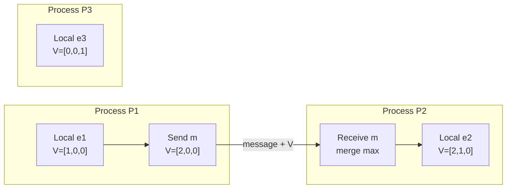
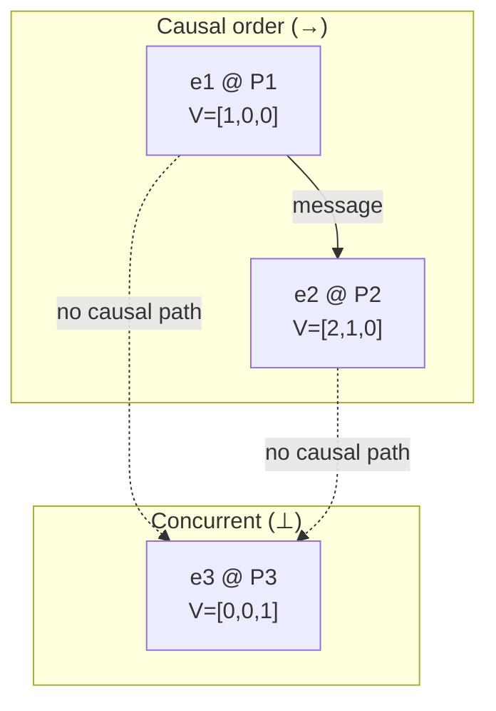
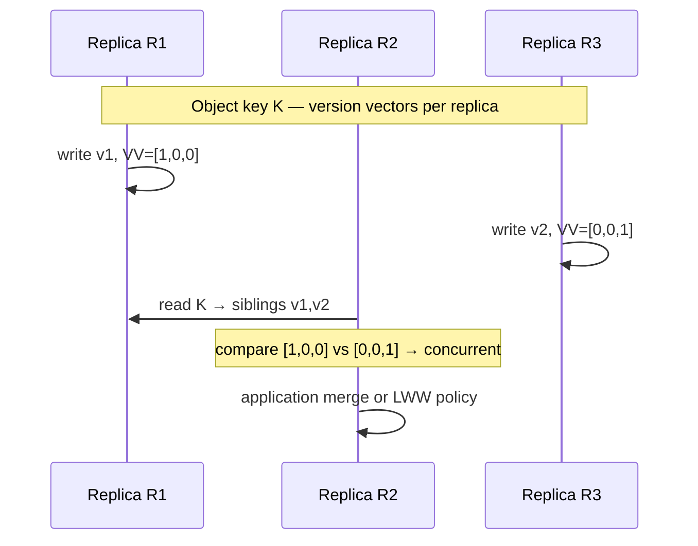

# Vector Clocks

## 1. Executive Summary

**Vector clocks** extend Lamport's logical clocks to capture **causal ordering** among events in a distributed system. Where a Lamport timestamp gives a single integer that respects happens-before but cannot distinguish concurrent events, a vector clock maintains one counter per process. Comparing two vectors yields one of three outcomes: one event **happened-before** the other, the events are **concurrent** (neither caused the other), or the vectors are **equal** (same causal knowledge in the modeled system).

Vector clocks are a **safety** mechanism for causal metadata: if \(e \rightarrow f\) (event \(e\) happens-before \(f\)), then \(V(e) < V(f)\) under the standard domination order. They do not provide **liveness** guarantees by themselves—clocks grow with events, and stalled processes leave stale components that complicate comparison—but they enable correct conflict detection, causal delivery, and debugging of distributed traces.

This chapter covers the vector comparison relation, detecting concurrent writes, scalability limits of full vectors, operational costs, and a preview of **version vectors** (per-replica counters attached to data, as in Dynamo-style systems). Principal architects use this material when choosing between Lamport timestamps, vector clocks, version vectors, and hybrid logical clocks in replication, messaging, and observability pipelines.

## 2. Why This Topic Matters

Interviewers and architecture reviewers test whether you understand **causality**, not just **time**:

- **Lamport clocks** give a total order compatible with causality but **over-order** concurrent events—you cannot tell independence from dependence from timestamps alone.
- **Vector clocks** expose concurrency explicitly—the foundation for **conflict resolution** in multi-master replication and for **causal consistency** in pub/sub systems.
- **Version vectors** (a related structure) power **anti-entropy**, **read repair**, and **sibling detection** in eventually consistent stores.

Confusing these structures leads to production bugs: treating concurrent writes as ordered (lost updates), shipping oversized metadata on every message, or comparing version vectors as if they were process vector clocks. At principal level, you must state **which partial order** a design preserves and **what breaks** when process membership changes or vectors are truncated.

## 3. Problems Being Solved

| Problem | Without vector clocks | With vector clocks |
|---------|----------------------|-------------------|
| Detect concurrent updates | Lamport timestamps may impose arbitrary order | `concurrent(V1, V2)` is decidable |
| Causal message delivery | Subscribers may see effects before causes | Buffer/deliver respecting `→` |
| Distributed debugging | Logs sorted by wall clock mislead | Merge causal traces across services |
| Conflict resolution in AP stores | Last-writer-wins hides conflicts | Concurrent siblings surfaced for merge |
| Snapshot / checkpoint consistency | Unclear which events are visible | Cut detection via vector comparison |

Vector clocks do **not** solve: global total ordering at low cost, Byzantine causality, or automatic merge of conflicting values—they provide **metadata** for systems that implement delivery, storage, and application merge policies.

## 4. Assumptions and System Model

Assume the standard message-passing model from [partial failure](/docs/distributed-systems-foundations/partial-failure):

- A fixed set of **n processes** \(\\{P_1, \ldots, P_n\\}\) with unique identifiers (unless dynamic membership is explicitly discussed).
- Events are either **local** (computation at \(P_i\)) or **send/receive** on channels between processes.
- **Happens-before** (\(\rightarrow\)) is the transitive closure of: (1) program order within a process, (2) send \(\rightarrow\) receive on the same message.
- Processes are **crash-stop** unless stated otherwise; vector clock rules assume honest increment and merge.
- No bound on message delay (asynchronous network); vector clocks do not require synchronized physical clocks.

**Critical assumption:** Vector indices align with process IDs. Renumbering, elastic scaling, or dynamic membership without a reconfiguration protocol invalidates historical vectors unless you add **version epochs**, **dot clocks**, or **bounded** approximations.

## 5. Essential Terminology

| Term | Definition |
|------|------------|
| **Vector clock** | Tuple \(V = [v_1, \ldots, v_n]\) where \(v_i\) counts events at \(P_i\) that are causally known at the current event. |
| **Domination / less-than** | \(V_1 \leq V_2\) iff \(\forall i: v_\{1i\} \leq v_\{2i\}\) and \(\exists j: v_\{1j\} < v_\{2j\}\). Denotes strict causal precedence in consistent comparisons. |
| **Concurrent events** | \(V_1 \parallel V_2\) iff neither \(V_1 \leq V_2\) nor \(V_2 \leq V_1\) (and \(V_1 \neq V_2\)). |
| **Equal vectors** | \(V_1 = V_2\) component-wise—same causal frontiers in the modeled system. |
| **Causal delivery** | Deliver message \(m\) only after all messages causally preceding \(m\) have been delivered. |
| **Version vector** | Per-**replica** (or per-node) counters attached to a **data object**, tracking which versions from each replica have been observed—used for replica divergence, not global event order. |
| **Dot clock** | Compressed vector clock using dotted version numbers; reduces size for sparse causality. |
| **Matrix clock** | Records knowledge of other processes' knowledge; stronger but \(O(n^2)\) space. |

**Mnemonic:** Lamport = one number, causal order only; vector = one number **per process**, concurrency visible.

## 6. Core Mechanism

### Data structure

Each process \(P_i\) maintains vector \(V\) of length \(n\). Intuitively, \(V[j]\) is the latest event count at \(P_j\) that \(P_i\) has **causally observed**.

### Update rules

On **local event** at \(P_i\):

1. \(V[i] \leftarrow V[i] + 1\).

On **send** at \(P_i\):

1. Apply local event rule (increment \(V[i]\)).
2. Attach current \(V\) to the message.

On **receive** of message with vector \(V_m\) at \(P_i\):

1. For all \(k\): \(V[k] \leftarrow \max(V[k], V_m[k])\).
2. \(V[i] \leftarrow V[i] + 1\) (receive counts as an event at \(P_i\)).



*Figure 1: Vector clock propagation. P1 sends its vector with the message; P2 merges component-wise max, then increments its own index on receive.*

### Vector comparison (the heart of the mechanism)

Given vectors \(A\) and \(B\) of equal length \(n\):

| Relation | Condition | Meaning |
|----------|-----------|---------|
| \(A = B\) | \(\forall i: A[i] = B[i]\) | Same causal knowledge frontier |
| \(A < B\) (dominated) | \(\forall i: A[i] \leq B[i]\) and \(\exists j: A[j] < B[j]\) | \(A\)'s event happened-before \(B\)'s event |
| \(A \parallel B\) (concurrent) | Neither \(A < B\) nor \(B < A\) | Independent branches of computation |
| Incomparable due to **error** | Vectors from different epochs or mismatched \(n\) | Implementation bug or membership change |

**Algorithm (compare):**

```
function compare(A, B):
  a_le_b = all(A[i] <= B[i] for i in 0..n-1)
  b_le_a = all(B[i] <= A[i] for i in 0..n-1)
  if a_le_b and b_le_a:
    return EQUAL
  if a_le_b and not b_le_a:
    return A_BEFORE_B   // strict domination
  if b_le_a and not a_le_b:
    return B_BEFORE_A
  return CONCURRENT
```

This is **not** lexicographic comparison and **not** element-wise equality testing alone—both appear in buggy implementations.

### Concurrent events: example

Three processes; events \(e_1\) at P1 and \(e_3\) at P3 with no message path between them:

- After \(e_1\): \(V(e_1) = [1, 0, 0]\)
- After \(e_3\): \(V(e_3) = [0, 0, 1]\)

Compare: \(1 \not\leq 0\) at index 0 and \(0 \not\leq 1\) at index 2 → **concurrent**. A Lamport clock might assign \(L(e_1)=1, L(e_3)=1\) or \(1\) and \(2\) depending on interleaving—either way, **concurrency is not decidable** from scalars alone.



*Figure 2: Causal chain (solid) vs. concurrent events (dashed). Vector comparison classifies `(e1,e3)` and `(e2,e3)` as concurrent.*

## 7. Step-by-Step Walkthrough

**Scenario:** Shopping cart replicated at P1 (US) and P3 (EU); P2 is a coordinator logging merges.

| Step | Location | Action | Vector after |
|------|----------|--------|--------------|
| 1 | P1 | Add item A (local) | `[1,0,0]` |
| 2 | P1 | Send update to P2 | attach `[1,0,0]` |
| 3 | P2 | Receive from P1 | `[1,0,0]` → merge → `[1,1,0]` |
| 4 | P3 | Add item B (local, no contact with P1) | `[0,0,1]` |
| 5 | P2 | Receive from P3 | merge → `[1,1,1]` |
| 6 | P2 | Compare cart versions | P1-update `[1,0,0]` vs P3-update `[0,0,1]` → **concurrent** |

**Decision point:** The coordinator must not silently pick a winner without policy. Options: application merge (union cart), prompt user, or escalate to CRDT semantics. Vector clocks **surface** the conflict; they do not resolve it.

**Causal delivery walkthrough:** Subscriber S holds delivered-set frontier \(V_S\). Message \(m\) with \(V_m\) is deliverable when \(V_m\) is **not** concurrent with undelivered predecessors—typically implemented with a buffer and per-sender queues (e.g., TCP-like ordering per source combined with vector checks for cross-source causality).

## 8. Invariants and Guarantees

| Property | Type | Statement |
|----------|------|-----------|
| **Causal consistency of `<`** | Safety | If \(e \rightarrow f\) then \(V(e) < V(f)\) (under correct rules and static membership) |
| **Converse on concurrency** | Safety (partial) | If \(V(e) \parallel V(f)\) then \(e \not\rightarrow f\) and \(f \not\rightarrow e\) |
| **No false concurrency** | Safety | If \(V(e) < V(f)\), events were not concurrent |
| **Monotonic knowledge** | Safety | Each component \(V[i]\) at a process never decreases between events |
| **Termination of compare** | Liveness (local) | `compare(A,B)` completes in \(O(n)\) time |

**Not guaranteed:** A total order over all events; bounded vector size; correct comparison across membership changes; detection of **fake** causality under Byzantine behavior.

**Note on converse:** \(V(e) \parallel V(f)\) does not always imply true concurrency in systems with **pruned** or **approximate** vectors—operational approximations can mislabel pairs; distinguish **formal guarantee** (full vectors, static processes) from **heuristic** (bounded structures).

## 9. Failure Scenarios

### Scenario 1: Lost message breaks causal delivery buffer

**Setup:** Causal delivery layer buffers \(m_2\) until \(m_1\) arrives; \(m_1\) is dropped.

**Effect:** **Liveness** failure—\(m_2\) never delivers; buffer grows. Safety of "never deliver out of causal order" holds.

**Mitigation:** Timeouts, sequence numbers per sender, application-level recovery, or move to weaker ordering (per-partition FIFO).

### Scenario 2: Process crash with stale vector component

**Setup:** P2 crashes; after restart it forgets vector state and resets to `[0,0,0]`.

**Effect:** **Safety** violation—new events may appear concurrent with pre-crash events that should be ordered after them; merges may lose conflicts.

**Mitigation:** Persist vectors with checkpoints; use epoch numbers; treat restart as new process ID.

### Scenario 3: Dynamic membership without reconfiguration

**Setup:** Cluster scales from 3 to 4 nodes; old messages carry length-3 vectors compared to length-4 state.

**Effect:** Undefined comparisons, silent corruption, or rejected writes.

**Mitigation:** Membership epochs (bump generation on change), dot clocks, or centralized version service.

### Scenario 4: Vector truncation / gossip aggregation

**Setup:** Monitoring system keeps only top-k entries in vectors to save space.

**Effect:** False concurrency or false precedence—**safety** of causal metadata degrades by design.

**Mitigation:** Document as approximate; use for heuristics only, not conflict resolution.

### Scenario 5: Clock not attached to send

**Setup:** RPC layer forgets to propagate metadata on async retry.

**Effect:** Downstream sees concurrent updates that were causally ordered—merge bugs.

**Mitigation:** Context propagation in tracing (OpenTelemetry baggage), middleware enforcement, contract tests.

## 10. Performance Characteristics

| Operation | Time | Space per event/message |
|-----------|------|-------------------------|
| Local update | \(O(1)\) amortized | — |
| Receive merge | \(O(n)\) | — |
| Compare two vectors | \(O(n)\) | — |
| Attach to message | — | \(O(n)\) integers |
| Causal delivery buffer | Varies with parallelism | Buffered messages × vector size |

**Network:** Every message pays **\(n \times word\_size\)** overhead. For \(n=100\) processes and 64-bit counters, 800 bytes per message before payload—acceptable in control planes, painful in high-QPS fanout.

**Hot path:** Compare dominates conflict detection in storage engines when sibling lists grow—optimize with **version vectors** scoped to replicas actually touching an object.

Qualitatively: vector clocks trade **precision of concurrency detection** for **metadata linear in process count**. Do not quote universal latency numbers; profile your fanout and serialization format.

## 11. Scalability Limits

### Size limits (process count)

Full vector clocks scale **\(O(n)\)** per message and **\(O(n)\)** per compare. Limits appear in practice:

| Scale | Typical approach |
|-------|------------------|
| \(n \lesssim 10\) | Full vector clocks in research prototypes, small clusters |
| \(n \sim 10\text\{–\}100\) | Version vectors per object; sparse dot clocks |
| \(n \gg 100\) | Hybrid Logical Clocks (HLC), Lamport + tie-break, partition-scoped clocks |
| Elastic microservices | Trace IDs + partial order from spans; not full vectors per RPC |

**Growth over time:** Components monotonically increase; no automatic compaction without **garbage collection** tied to stable snapshots (knowing no process will emit lower counts for retired IDs).

### Dynamic membership

Adding/removing processes changes vector dimension. Standard practice:

- **Epoch / generation counter** prepended: vectors from different epochs are incomparable.
- **Dot clocks** (Fidge, 2000s literature): encode sparse updates as \((i, v_i)\) pairs.
- **Plum trees** and **Tree clocks** reduce redundancy for tree-shaped communication.

### Version vectors preview (per-object, not per-process events)

**Version vectors** attach to **replicas** or **nodes** for a **specific key**:

- \(VV = [c_1, c_2, \ldots, c_r]\) where \(c_j\) is the highest version known from replica \(r_j\).
- Compare like vector clocks: concurrent versions → siblings requiring merge.
- Used in Dynamo, Riak, Cassandra lightweight transactions context (with caveats), and anti-entropy.

**Distinction (interview-critical):**

| | Vector clock | Version vector |
|---|--------------|----------------|
| Tracks | Events at **processes** | Versions from **replicas** for **one object** |
| Length | Number of processes in system | Number of replicas touching the object |
| Typical use | Causal delivery, debugging | Conflict detection in replicated storage |
| Attached to | Messages / events | Data values / tombstones |

A single write may increment one replica's component in the version vector while the process vector clock increments the writer's process index—they answer different questions.



*Figure 3: Version vectors on a data object detect concurrent writes from R1 and R3. A coordinator or read repair merges or surfaces siblings.*

## 12. Operational Considerations

- **Propagate metadata in the same layer that retries:** Async retries without vector attachment create ghost concurrency.
- **Persist with the write:** Ephemeral vector state on crash equals Scenario 2.
- **Monitor vector size and serialization cost** in RPC metrics; spikes correlate with cluster growth.
- **Runbooks for "sibling explosion":** Many concurrent writers → merge policy, CRDT migration, or partition keys to reduce conflicts.
- **Testing:** Property-based tests that `compare` is antisymmetric on valid pairs and respects synthetic happens-before graphs.

## 13. Security Considerations

Vector and version metadata is **integrity-sensitive** but not **authentic** by default:

- A malicious client could forge low vectors to fake concurrency or precedence.
- **Safety** of merge decisions depends on trusted replicas or signed metadata.
- Do not use client-supplied version vectors as authorization; pair with authentication, replica identity, and quorum validation.

In zero-trust designs, treat metadata like any other untrusted field unless cryptographically bound to a replicated log entry.

## 14. Cost Considerations

- **Bandwidth tax:** \(n\) integers × message rate × fanout—dominates for small payloads (feature flags, metrics).
- **Storage:** Storing full vectors per row in wide-column stores multiplies disk; prefer version vectors scoped to conflicting keys only.
- **Engineering cost:** Causal delivery buffers and merge UX are harder than last-writer-wins (LWW).
- **Incident cost:** False concurrency from bugs causes duplicate business actions; false ordering causes lost updates—both expensive, different failure modes.

Decision criterion: pay vector cost when **conflict visibility** or **causal delivery** has measurable product value; otherwise Lamport/HLC + application idempotency may suffice.

## 15. Production Implementations

### Amazon Dynamo (2007)

Dynamo uses **vector clocks** (version vectors per object) to track conflicting writes during read repair and hinted handoff. Concurrent versions become **siblings**; application resolves at read time. This is an **implementation choice** for availability during partition—not a universal DynamoDB behavior today (managed DynamoDB evolved different consistency models).

### Riak / Basho

Riak exposed vector clocks on buckets/objects for sibling creation and conflict handling—operational experience showed sibling proliferation when clocks grew unbounded; pruning and dotted version vectors became necessary **operational** responses.

### Apache Cassandra

Cassandra uses timestamps (physical or logical) for LWW column resolution by default; lightweight transactions use Paxos—not full per-client vector clocks on every cell. Understand **which layer** provides ordering.

### Causal messaging (Kafka, RabbitMQ, custom)

Most mainstream brokers provide **partition ordering**, not cross-partition causality. Causal delivery typically requires **application-level** vector metadata or single-partition key design—not broker magic.

### Distributed tracing

OpenTelemetry traces approximate causality via span parent links—not full vector clocks—but the **problem** (understand partial order) is the same. Vector clocks remain the textbook solution when you need decidable concurrency without a central coordinator.

## 16. Alternatives and Tradeoffs

| Mechanism | Concurrency detection | Size | Centralization |
|-----------|----------------------|------|----------------|
| Lamport clock | No | \(O(1)\) | No |
| Vector clock | Yes | \(O(n)\) | No |
| Version vector | Per-object replica conflicts | \(O(r)\) replicas | No |
| Hybrid Logical Clock (HLC) | Approximate; bounded | \(O(1)\) | No |
| TrueTime (Spanner) | Strong ordering via time bounds | \(O(1)\) | Yes (time infra) |
| Single leader log | Total order; no write-write concurrency at log level | \(O(1)\) per entry | Yes |
| CRDT | Algebraic merge; metadata varies | Type-dependent | No |

**When to choose vector clocks:** Multi-master or peer replication without a leader, need to **detect** concurrent updates, \(n\) or \(r\) modest, merge logic exists.

**When to avoid:** High process churn, thousands of writers per key, or when LWW + idempotency is provably sufficient.

## 17. Common Misconceptions

| Misconception | Reality |
|---------------|---------|
| "Higher Lamport time means later" | Concurrent events can share Lamport times; vectors disambiguate. |
| "Vector clocks resolve conflicts" | They **detect** concurrency; merge policy is separate. |
| "Version vector = vector clock" | Different attachment point (object vs. event) and dimension (replicas vs. processes). |
| "Compare with `<` on first component" | Must use domination on **all** components. |
| "Concurrent means simultaneous in wall clock" | Causal independence, not physical time. |
| "Vectors work across elastic scale without epochs" | Membership change requires protocol support. |

## 18. Principal Architect Perspective

Principal-level evaluation connects causality to **business and organizational** outcomes:

1. **State the partial order** your product needs: causal consistency for social feeds differs from financial ledger linearizability.
2. **Quantify metadata cost** before mandating vectors on every RPC—FinOps and latency teams will push back at scale.
3. **Own the merge story:** Detecting siblings without UX or automated merge floods support tickets.
4. **Plan membership changes** in multi-region expansions—retrofitting epochs hurts.
5. **Align with observability:** If you cannot debug causality in incidents, vector metadata in storage is harder to trust.

Interview signal: candidates who map Dynamo siblings → vector compare → product conflict policy demonstrate **end-to-end** thinking, not algorithm memorization.

## 19. Architecture Review Exercise

**Scenario:** A global document editor runs on 50 edge nodes (one process ID each). Every keystroke RPC carries a full 50-element vector clock. Conflicts use automatic LWW on wall-clock skew.

**Review prompts:**

1. Is vector metadata necessary for every keystroke? What structure fits **per-document** replica versions?
2. What breaks when two edges edit offline and reconnect—compare vectors, then what?
3. Estimate bandwidth overhead vs. payload size for 200-byte ops.
4. Wall-clock LWW contradicts which guarantees vector clocks provide?
5. Propose redesign: CRDT character map, partition by document, or leader per doc.

**Expected findings:** Process-scoped vectors are wrong granularity; LWW ignores detected concurrency; consider per-document version vectors, epoch per editing session, or CRDT with bounded metadata.

## 20. Whiteboard Explanation

**90-second version:**

> "Lamport clocks give one integer that respects causality but can't tell if two events were independent. A vector clock has one counter per process. On a local event I increment my slot. On receive I merge max with the message vector, then increment my slot. To compare, A is before B if every component of A is less than or equal to B's and at least one is strictly less—domination. If neither dominates, they're concurrent—that's the key interview result. Full vectors don't scale to thousands of processes; production uses version vectors on objects, dot clocks, or hybrid logical clocks. Vector clocks don't merge data—they tell you when you must merge. Dynamo used that for sibling versions."

## 21. Interview Questions

1. **How do vector clocks differ from Lamport clocks?**
   - *Signals:* Per-process components; decidable concurrency; same causal precedence guarantee.
   - *Red flags:* "Vectors are more accurate timestamps" without concurrency.

2. **Define the compare relation for vectors A and B.**
   - *Signals:* Component-wise ≤; strict < in at least one index; else concurrent.
   - *Red flags:* Lexicographic or scalar comparison.

3. **Given V1=[2,0,1] and V2=[1,1,1], what is the relation?**
   - *Signals:* Neither dominates (index 0: 2>1; index 1: 0<1) → concurrent.

4. **If e → f, what holds for V(e) and V(f)?**
   - *Signals:* V(e) < V(f); contrapositive for detecting not-before.

5. **Why are concurrent events a problem in replicated storage?**
   - *Signals:* Conflicting writes; need merge, siblings, or escalation—not silent LWW.

6. **What is the space cost of vector clocks with n processes?**
   - *Signals:* O(n) per message and per stored stamp; compare O(n).

7. **Explain version vectors vs. vector clocks.**
   - *Signals:* Replica/object scope vs. process event scope; same compare algebra.

8. **What breaks vector clocks when a new process joins?**
   - *Signals:* Dimension mismatch; need epoch, resize, or new ID space.

9. **How does causal delivery use vector clocks?**
   - *Signals:* Buffer until all predecessors delivered; merge on receive.

10. **When would you choose HLC over vector clocks?**
    - *Signals:* Large n; need bounded metadata; tolerate approximate ordering.

11. **Does Dynamo's use of vector clocks imply strong consistency?**
    - *Signals:* No—eventual consistency with conflict detection; AP tradeoff.

12. **How do you detect false concurrency from pruned vectors?**
    - *Signals:* Document approximation; testing; epoch boundaries; avoid prune on conflict path.

13. **Design conflict detection for a shopping cart across three regions.**
    - *Signals:* Per-cart version vector; concurrent add detection; merge policy.

14. **Is compare transitive?**
    - *Signals:* Yes for `<` on valid vectors; concurrent is not transitive (e1 ∥ e2 and e2 ∥ e3 does not imply e1 ∥ e3).

## 22. Interview Follow-Ups

1. **If only two processes ever communicate, can you use length-2 vectors always?**
   - *Tradeoff:* Only if membership fixed and no global events matter elsewhere.

2. **How would you serialize vectors in protobuf efficiently?**
   - *Signals:* Sparse encoding, dot format, delta from parent.

3. **Can vector clocks implement total order?**
   - *Signals:* Combine with process ID tie-break only for concurrent pairs—becomes a total order extension, not native.

4. **What happens under Byzantine replicas forging vectors?**
   - *Signals:* Breaks safety; need signed logs, quorum, or BFT.

5. **How does Kafka partition ordering interact with cross-topic causality?**
   - *Signals:* Per-partition order only; vectors or routing keys needed for cross-topic causal fanout.

6. **Executive wants zero conflicts visible to users—what do you recommend?**
   - *Signals:* Leader per entity, CRDT, or strong consistency—not vectors alone.

## 23. Strong Answer Example

**Question:** "Two users edited the same JSON document in different regions. How do you detect and handle it?"

> "I'd attach a **version vector** to the document keyed by replica or region writer—same domination compare as vector clocks but scoped to the object. On write, increment the writer's component and persist the vector with the blob. On read or sync, compare incoming VV with stored VV: if one dominates, take the newer; if concurrent, we have a real conflict independent in causal terms—surface siblings or run application merge, not blind LWW unless business accepts loss. I'd measure sibling rate; if high, partition editors by document shard or move to a CRDT. For transport, propagate VV on every replication message and after partition heal run anti-entropy comparing vectors, not just timestamps. Membership changes get an epoch prefix so old vectors never compare against new dimensions."

## 24. Weak Answer Example

**Question:** "Two users edited the same JSON document in different regions. How do you detect and handle it?"

> "Use vector clocks and pick the higher timestamp. Or store two copies and let the user choose sometimes."

**Why weak:** Conflates vector/version vectors with timestamps; LWW ignores concurrency semantics; no domination compare, no replica-scoped metadata, no epoch or merge policy, hand-wavy UX.

## 25. Hands-On Exercise

**Lab:** `labs/lab-002-vector-clocks/` — vector clock simulator on **`:8097`**

```bash
cd labs/lab-002-vector-clocks
python3 -m venv .venv && source .venv/bin/activate
pip install -r requirements.txt
pytest tests/ -v
docker compose -p lab002 -f docker/docker-compose.yml up --build -d
chmod +x scripts/demo_clocks.sh && ./scripts/demo_clocks.sh
```

| Step | Endpoint | What happens |
|------|----------|--------------|
| 1 | `POST /v1/events/local` | Local event increments process clock |
| 2 | `POST /v1/messages/send` | Send bumps sender; receiver merges on delivery |
| 3 | `GET /v1/mailbox/delivered` | Causal mailbox delivers in dependency order |
| 4 | `POST /v1/clocks/compare` | Classify pair as before / after / concurrent |
| 5 | `GET /v1/processes` | Inspect per-process vector state |

**Swagger:** http://localhost:8097/docs

### Engineer guide: how the local stack works

1. **Three simulated processes** — each maintains a vector clock `V[0..n-1]` updated on local, send, and receive.
2. **Causal mailbox** — out-of-order messages buffer until their causal dependencies are satisfied.
3. **Compare API** — domination test returns `before`, `after`, `equal`, or `concurrent` (the interview-critical case).
4. **Version vectors** — optional KV layer attaches per-replica counters for sibling detection.
5. **Lamport vs vector** — demo scripts show events concurrent under vector clocks that a Lamport clock would totally order.

Pairs with [Dropbox Sync Conflicts](/docs/real-world-scenarios/dropbox-file-sync-conflicts) and [Lab 005 eventual consistency](/docs/consistency/eventual-consistency#25-hands-on-exercise).

### Build-from-scratch exercise (optional)

1. Implement three processes with arrays of length 3; script local, send, receive (with merge).
2. Implement `compare(A,B)` returning `{before, after, equal, concurrent}`.
3. Replay: P1 local, P1→P2 send/receive, P3 local; verify P1 and P3 events concurrent.
4. Extend: attach version vector to a `Cart` object with 3 replicas; simulate concurrent adds and list siblings.
5. Optional: measure message size growth as \(n\) increases.

**Success criteria:** Correct concurrency classification on test cases; written explanation of one scenario where Lamport clock misorders but vector does not.

## 26. Knowledge Check

1. What update rule applies on receive at \(P_i\)? *(Merge max with message vector, then increment \(V[i]\).)*
2. Are [2,1,0] and [1,2,0] concurrent? *(Yes—neither dominates.)*
3. Can equal vectors at different events imply same event? *(Not necessarily—depends on system; equal means same causal frontier, events may differ if same frontier reached different ways in some models—clarify: usually different events can share vector in specific executions; interview: equal vectors mean same knowledge of all processes' counts.)*
4. What is O(n) for vector clocks? *(Message size and compare time.)*
5. Version vectors track events at processes or versions from replicas? *(Replicas per object.)*
6. Does causal delivery sacrifice safety or liveness on message loss? *(Liveness—stall; safety of ordering preserved.)*

## 27. Flashcards

| # | Front | Back |
|---|-------|------|
| 1 | Vector clock structure | \(n\) counters; \(V[i]\) = latest known count at process \(i\). |
| 2 | Local event rule | Increment \(V[i]\) at process \(P_i\). |
| 3 | Receive rule | \(V[k] \leftarrow \max(V[k], V_m[k])\); then increment \(V[i]\). |
| 4 | Domination (A before B) | All \(A[k] \leq B[k]\), some strict inequality. |
| 5 | Concurrent vectors | Neither dominates the other (and not equal). |
| 6 | Lamport vs vector | Lamport: scalar, no concurrency detection; vector: decidable \(\parallel\). |
| 7 | Version vector | Per-replica counters on a **data object** for conflict detection. |
| 8 | Size limit | \(O(n)\) per message; problematic at large \(n\). |
| 9 | Causal delivery | Deliver only after all \(\rightarrow\) predecessors delivered. |
| 10 | Membership change | Requires epoch or resize; raw vectors incomparable across naive join. |
| 11 | Dynamo siblings | Concurrent versions from vector compare; app merges at read. |
| 12 | Safety guarantee | If \(e \rightarrow f\) then \(V(e) < V(f)\) (full static model). |

## 28. Cheat Sheet

```
VECTOR CLOCK (process events)
  Local:     V[i]++
  Receive:   V = max(V, V_msg); V[i]++

COMPARE(A,B):
  all A[k]<=B[k] and some <:  A before B
  all B[k]<=A[k] and some <:  B before A
  all equal:                  equal
  else:                       concurrent

VERSION VECTOR (object replicas)
  Same compare algebra; length = replicas touching object
  Used: conflict detect, siblings, anti-entropy

LIMITS: O(n) space/message; membership needs epochs
ALT: Lamport (O(1)), HLC (bounded), leader log (total order)

INTERVIEW: concurrent ≠ same wall time; vectors detect, don't merge
```

## 29. Related Concepts

- [Lamport Clocks](/docs/time-ordering-and-coordination/lamport-clocks) — prerequisite scalar logical clocks
- [Time, Ordering, and Coordination overview](/docs/time-ordering-and-coordination/overview) — domain map
- [Partial Failure](/docs/distributed-systems-foundations/partial-failure) — system model
- [Safety and Liveness](/docs/distributed-systems-foundations/safety-and-liveness) — correctness framing
- [Consistency](/docs/consistency/overview) — causal consistency and stronger models
- [Replication](/docs/replication/overview) — multi-master and quorum designs
- [Distributed Databases](/docs/distributed-databases/overview) — Dynamo-style systems

## 30. References

### Primary sources

- Lamport, L. (1978). ["Time, Clocks, and the Ordering of Events in a Distributed System."](https://lamport.azurewebsites.net/pubs/time-clocks.pdf) *Communications of the ACM* — happens-before and Lamport clocks (prerequisite).
- Fidge, C. J. (1988). "Timestamps in Message-Passing Systems That Preserve the Partial Ordering." *Proceedings of the Eleventh Australian Computer Science Conference* — vector clock formulation.
- Mattern, F. (1989). "Virtual Time and Global States of Distributed Systems." *Parallel and Distributed Algorithms* — independent development of vector clocks.
- Mattern, F. (2000). "Virtual Time and Global States of Distributed Systems." (Survey context for dot clocks and ordering)—see also subsequent work on dot-style compression. *TODO: verify exact citation for dot clock primary source in your bibliography.*

### Production and engineering

- DeCandia, G., et al. (2007). ["Dynamo: Amazon's Highly Available Key-value Store."](https://www.allthingsdistributed.com/files/amazon-dynamo-sosp2007.pdf) *SOSP* — vector clocks for versioning and conflict handling (implementation choice; not all later AWS services identical).
- Kulkarni, S., et al. (2014). ["Logical Physical Clocks and Consistent Snapshots in Globally Distributed Systems."](https://www.ics.uci.edu/~baldoni/papers/2014/2014-opodis-hybrid.pdf) — Hybrid Logical Clocks as alternative.

### Textbooks

- Martin Kleppmann, *Designing Data-Intensive Applications* (O'Reilly) — Chapters on causality, version vectors, and conflict resolution.
- Nancy Lynch, *Distributed Algorithms* (Morgan Kaufmann) — partial orders and clock systems.

### Distinction

| Claim type | Source |
|------------|--------|
| Happens-before definition | Lamport (1978) |
| Vector compare and concurrency | Fidge; Mattern |
| Dynamo sibling versioning | DeCandia et al. (2007) |
| HLC tradeoffs | Kulkarni et al. (2014) |
| Operational limits in this chapter | Engineering interpretation—validate for your cluster size and membership model |
