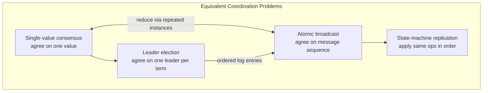
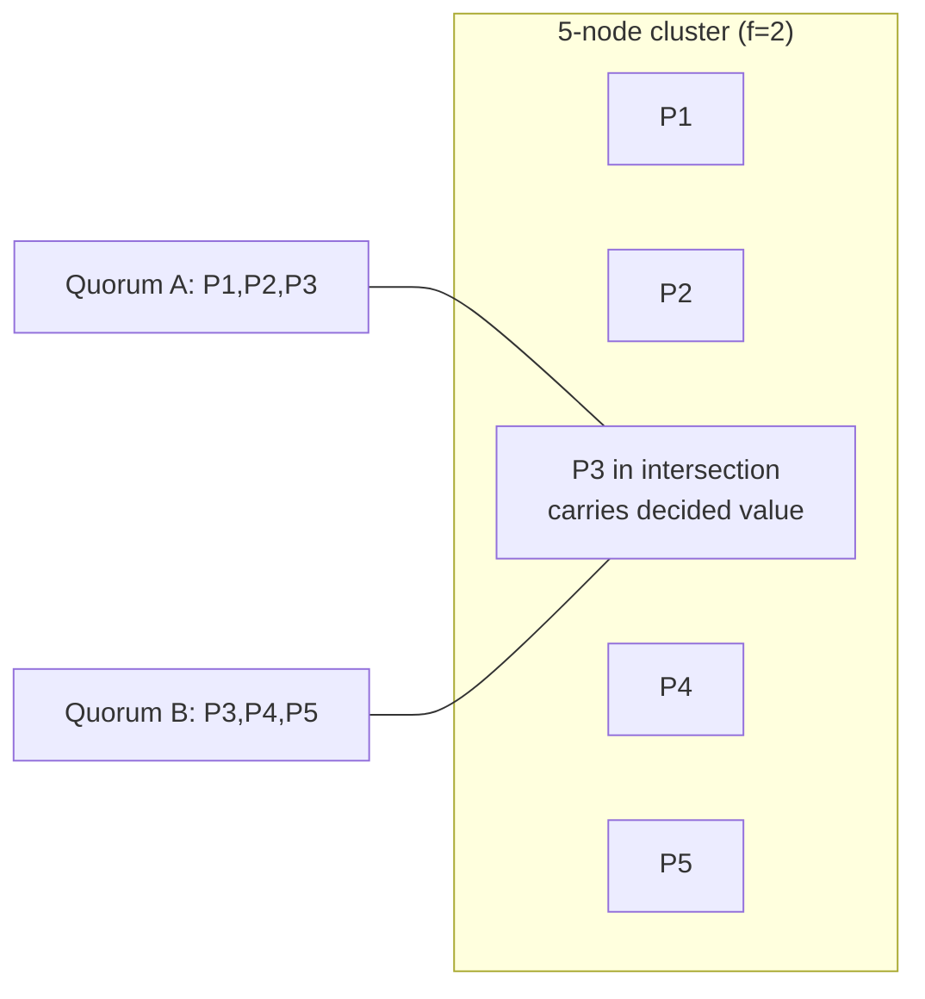
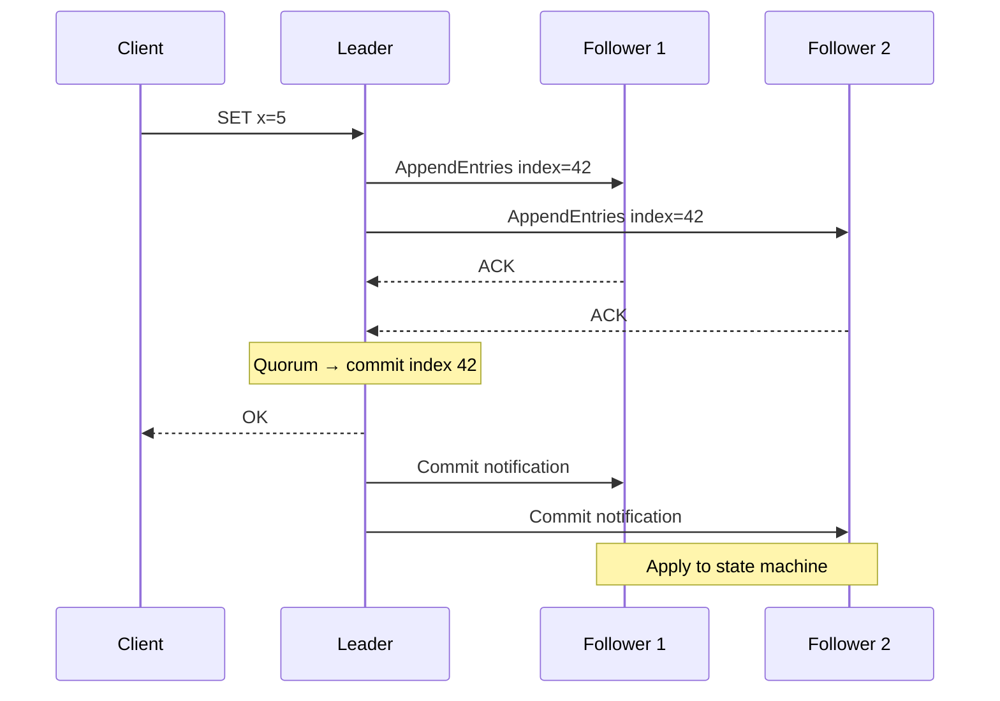

# The Consensus Problem

## 1. Executive Summary

**Consensus** is the fundamental coordination problem in distributed systems: a set of processes, each holding a proposed value, must **agree** on a single output despite crashes, message loss, and unpredictable delays. The problem appears wherever independent nodes must pick one authoritative decision—who is the leader, whether a transaction commits, which configuration is active, or which operation belongs next in a replicated log.

The classical specification combines four properties: **agreement** (no two correct processes decide differently), **validity** (only proposed values are decided), **integrity** (at most one decision per process), and **termination** (every correct process eventually decides). Agreement, validity, and integrity are **safety** properties; termination is **liveness**. Under the fully asynchronous failure model, the Fischer–Lynch–Patterson (FLP) impossibility result proves that no deterministic algorithm can guarantee both safety and termination when even one process may crash—production systems therefore assume partial synchrony, failure detectors, or randomized termination.

This chapter defines consensus precisely, relates it to atomic broadcast and state-machine replication, maps it to production systems (etcd, ZooKeeper, Raft-based databases), and equips you to reason about when consensus is necessary versus when weaker coordination suffices.

## 2. Why This Topic Matters

Consensus is the **coordination bottleneck** behind most strongly consistent distributed infrastructure. Principal architects are expected to:

- Distinguish consensus from "eventual agreement" or gossip convergence.
- Name which consensus properties a design requires and which it relaxes.
- Explain why a three-node quorum is not optional whimsy but a safety mechanism.
- Connect consensus to organizational decisions: who may write, who may commit, what happens during partition.

Interviewers use consensus to test whether you understand **mechanism**, not buzzwords. Saying "we use Raft" without explaining agreement and termination signals mid-level depth. Explaining how a committed log entry survives leader failure signals principal-level reasoning.

In production, misunderstanding consensus causes split-brain writes, lost commits, and configuration drift. Teams that treat coordination services as "just another database" often discover too late that their application assumed properties the store never promised.

## 3. Problems Being Solved

| Problem | Consensus role |
|---------|----------------|
| **Leader election** | Processes agree on one leader per epoch |
| **Atomic broadcast / total order** | Processes agree on the same sequence of messages |
| **State-machine replication** | Replicas agree on operation order to apply deterministically |
| **Distributed transaction commit** | Participants agree commit or abort |
| **Configuration management** | Cluster agrees on membership and settings |
| **Distributed locking (strong)** | Often implemented via consensus on lock holder |

Without consensus (or a strictly weaker substitute with explicit semantics), independent nodes make **incompatible decisions** that cannot be merged without application-level conflict resolution.

## 4. Assumptions and System Model

Consensus algorithms are proved relative to explicit assumptions:

| Dimension | Typical assumption | Effect |
|-----------|-------------------|--------|
| **Processes** | Crash-stop (fail-stop) by default | Failed processes stop; Byzantine consensus requires different algorithms |
| **Network** | Asynchronous or partially synchronous | FLP applies in pure async; Raft assumes eventual bounds |
| **Channels** | Reliable but possibly delayed, duplicated, reordered | Algorithms use unique IDs, terms, and deduplication |
| **Membership** | Static set of n processes, or dynamic with joint consensus | Quorum sizes depend on n and failure bound f |
| **Failure bound** | At most f crash failures, n > 2f for synchronous case | Majority quorums require n ≥ 2f + 1 |

**Partial synchrony** (Dwork, Lynch, Stockmeyer, 1988): there exists an unknown time after which message delays are bounded. Real systems approximate this with timeouts—an **implementation choice**, not a theorem of the network.

**Failure detectors** (Chandra & Toueg, 1996): modules that suspect crashed processes. Consensus becomes solvable in ◇P (eventually perfect failure detector) even in async systems—again separating **formal model** from **engineering heuristic**.

## 5. Essential Terminology

| Term | Definition |
|------|------------|
| **Consensus** | Each process proposes a value; all correct processes decide the same value, only proposed values are decided, each decides at most once, and all correct processes eventually decide |
| **Agreement** | No two correct processes decide different values (safety) |
| **Validity** | If a process decides v, then v was proposed by some process (safety) |
| **Integrity / unanimity** | A process decides at most once (safety) |
| **Termination** | Every correct process eventually decides (liveness) |
| **Uniform consensus** | All correct processes decide the same value; incorrect processes may decide arbitrarily or not at all—common in crash-stop literature |
| **Non-uniform consensus** | Correct processes agree; faulty processes are unconstrained |
| **Atomic broadcast** | Deliver the same messages in the same order to all correct processes; equivalent to consensus under certain reductions |
| **Total order broadcast** | Atomic broadcast with agreement on message sequence |
| **State-machine replication** | Replicas execute the same ordered commands on deterministic state machines |
| **Quorum** | A set of processes whose intersection with any two quorums is non-empty—enables safety via overlap |
| **Proposal** | A value a process offers for decision |
| **Decision** | The irrevocable output of the consensus instance |

## 6. Core Mechanism

### 6.1 The consensus specification

For a single consensus instance with value domain V:

1. **Agreement:** If correct process p decides v and correct process q decides w, then v = w.
2. **Validity:** If correct process p decides v, then v was proposed by some process.
3. **Integrity:** No correct process decides more than once.
4. **Termination:** Every correct process eventually decides.

Properties 1–3 are **prefix-closed safety** properties. Property 4 is **liveness**.

### 6.2 Relationship to atomic broadcast

**Atomic broadcast** requires:

- **Agreement:** No two correct processes deliver different messages at the same position.
- **Integrity:** No duplicate delivery at a position; only broadcast messages are delivered.
- **Validity:** If a correct process broadcasts m, then every correct process eventually delivers m.
- **Total order:** If m is delivered before m' at one correct process, the same order holds everywhere.

Consensus and atomic broadcast are **reducible** to each other in the crash-stop model: consensus on the next message implements broadcast; broadcast of decide messages implements multi-value consensus. Production systems (Raft, Multi-Paxos) implement **replicated log** = repeated consensus on the next entry.



*Figure 1: Consensus, atomic broadcast, state-machine replication, and leader election form a family of mutually reducible coordination problems in the standard crash-stop model.*

### 6.3 Quorum overlap as safety backbone

For n = 2f + 1 processes tolerating f crashes, a **majority quorum** (⌊n/2⌋ + 1) ensures any two quorums intersect in at least one correct process (if at most f have crashed). That intersection carries the **decided value** forward—no new decision can contradict an earlier one without violating agreement.



*Figure 2: Quorum intersection guarantees that any two majorities share at least one node, enabling safe value propagation.*

### 6.4 Why n > 2f matters

With n = 2f processes, two disjoint sets of size f can each believe they hold a majority after f crashes—**split brain**. The inequality n > 2f is not a performance preference; it is a **safety prerequisite** for majority quorums under f crash failures.

## 7. Step-by-Step Walkthrough

### Walkthrough A: Single-shot consensus (conceptual)

Three processes P1, P2, P3 each propose values. A simplified synchronous round:

1. **Propose:** Each process sends its proposal to all.
2. **Collect:** Each process gathers proposals from a quorum (e.g., 2 of 3).
3. **Decide:** If a quorum reports the same value v, decide v; else adopt a default rule (e.g., lowest proposed value) and re-round.

In **asynchronous** reality, step 2 may never complete within a bounded time—motivating FLP and partial synchrony assumptions.

### Walkthrough B: From consensus to replicated state machine

1. Client sends `SET x=5` to the leader.
2. Leader proposes log entry `op=SET x=5` at index 42 via consensus.
3. Quorum acknowledges append; leader commits index 42.
4. All followers apply entry 42 to their state machines in order.
5. Leader fails; new leader must have entry 42 if it was committed (log-matching in Raft; learned in later chapter).



*Figure 3: One consensus instance per log entry implements ordered state-machine replication.*

## 8. Invariants and Guarantees

| Property | Type | Guarantee |
|----------|------|-----------|
| Agreement | Safety | No divergent decisions among correct processes |
| Validity | Safety | Decided values originate from proposals |
| Integrity | Safety | Single decision per process |
| Termination | Liveness | Eventual decision under stated model assumptions |
| Quorum intersection | Safety (derived) | Any two majorities overlap in ≥ 1 node when n > 2f |

**What consensus does not guarantee:** Byzantine correctness, bounded latency, availability during minority partition (CP systems may block), or automatic resolution of application-level conflicts in the proposed values themselves.

## 9. Failure Scenarios

| Failure | Effect on consensus | Mitigation |
|---------|---------------------|------------|
| **Leader crash** | Liveness stall until new leader | Election + log catch-up |
| **Network partition** | Minority cannot form quorum; liveness loss on minority | Majority continues (CP); minority refuses writes |
| **Message loss** | Retries, duplicate detection via terms/indices | Reliable channels assumed; idempotent handlers |
| **Slow process** | Does not violate safety; may delay termination | Timeouts, failure suspicion |
| **Clock skew** | Not required in async consensus | Terms and logical indices, not wall clocks |
| **Byzantine leader** | Violates agreement without BFT algorithm | Crash-stop default; use PBFT/Zab variants for Byzantine |

**Split brain:** Two partitions each elect a leader and accept writes—violates consensus safety unless only one partition has quorum. This is an operational manifestation of choosing availability over consistency on both sides.

## 10. Performance Characteristics

Consensus is **expensive** relative to single-node writes:

| Cost driver | Typical impact |
|-------------|----------------|
| Round trips | 1–2 RTTs per commit in optimized leader-based protocols |
| Fan-out | Leader contacts all followers per entry |
| Durability | Disk fsync per entry in strongly durable systems |
| Throughput ceiling | Often leader-bound; batching amortizes cost |

**Rule of thumb (implementation-dependent):** expect orders-of-magnitude lower write throughput than an unreplicated database on the same hardware. Measure; do not cite universal benchmarks.

Paxos optimizations (Multi-Paxos, batching, pipelining) and Raft's steady-state leader pipeline target production throughput, but the **fundamental quorum cost** remains.

## 11. Scalability Limits

- **Vertical:** Larger state machines and bigger log entries increase catch-up time after failures.
- **Horizontal membership:** More nodes increase election and replication fan-out; common production clusters are 3 or 5 nodes (sometimes 7 for higher fault tolerance).
- **Geographic stretch:** WAN RTT dominates latency; multi-region consensus often uses separate regional clusters with async replication rather than one global quorum.
- **Multi-tenant:** etcd and ZooKeeper scale coordination metadata, not application data volumes—architects separate **control plane** consensus from **data plane** partitioning.

## 12. Operational Considerations

- **Cluster size:** Odd numbers (3, 5) for clear majorities; avoid even counts without careful tie-breaking.
- **Rolling restarts:** Maintain quorum availability; never take down a majority simultaneously.
- **Snapshot and compaction:** Unbounded logs are operationally fatal; snapshot state and truncate logs.
- **Monitoring:** Leader changes, commit latency, proposal failures, disk usage, election storms.
- **Defensive timeouts:** Tuned for partial synchrony; too aggressive causes flapping; too slow extends outages.
- **Runbooks:** Document minority-partition behavior (read-only? errors?) for client teams.

## 13. Security Considerations

Crash-stop consensus does not authenticate participants by default. Production deployments require:

- **mTLS** between peers (etcd, Consul).
- **RBAC** on client APIs.
- **Network isolation** for control-plane traffic.
- **Byzantine** threat model if adversarial nodes are plausible—standard Raft/Paxos insufficient.

Consensus logs may contain sensitive configuration; encrypt at rest and restrict backup access.

## 14. Cost Considerations

- **Infrastructure:** 3+ dedicated nodes with SSD for WAL; cross-AZ traffic charges.
- **Latency tax:** Strong consistency via consensus adds RTT to every coordinated write—product and revenue impact for global services.
- **Operational headcount:** Running self-managed etcd/ZooKeeper vs. managed coordination (cloud vendor) trades dollars for engineering time.
- **Opportunity cost:** Using consensus where a CRDT or primary-secondary async replication suffices over-pays for coordination.

## 15. Production Implementations

| System | Algorithm family | Typical use |
|--------|-----------------|-------------|
| **etcd** | Raft | Kubernetes control plane, service discovery |
| **Apache ZooKeeper** | Zab (Paxos-like) | Legacy coordination, Kafka metadata (older) |
| **Consul** | Raft | Service mesh, KV, sessions |
| **CockroachDB / TiKV** | Raft per range | Distributed SQL storage |
| **Google Chubby** | Paxos | Internal lock service (described in literature) |
| **BookKeeper** | Ledger + external coordination | Durable log segments |

Implementation choices differ in API (KV vs. log), performance tuning, and membership change handling—even when the underlying consensus family is similar.

## 16. Alternatives and Tradeoffs

| Approach | When to use | Tradeoff |
|----------|-------------|----------|
| **Consensus (Raft/Paxos)** | Strong ordering, linearizable metadata, leader authority | Latency, operational complexity |
| **Primary-backup async replication** | High throughput, RPO > 0 acceptable | Failover may lose data |
| **Leaderless quorum (Dynamo-style)** | High availability, tunable R/W quorums | Not total order; conflict resolution needed |
| **Gossip / epidemic protocols** | Membership, soft state, AP caches | No strong agreement |
| **External transaction coordinator** | Cross-service 2PC with human-defined boundaries | Availability and coupling risks |
| **CRDTs** | Commutative replicated state | No total order; semantic constraints |

Choose consensus when **order and agreement** are irreducible requirements—not when "we want reliability" in the abstract.

## 17. Common Misconceptions

| Misconception | Reality |
|---------------|---------|
| "Consensus means strong consistency for all data" | Consensus orders operations; application semantics still matter |
| "More nodes = faster" | More nodes often mean more replication overhead |
| "Raft and Paxos are totally different problems" | Both solve consensus; differ in decomposition and presentation |
| "FLP means consensus is impossible" | FLP blocks deterministic termination in pure async; production assumes partial synchrony |
| "ZooKeeper is a database" | It is a coordination service with size and latency limits |
| "Two nodes is fine for HA" | Even n=2 cannot tolerate one failure with majority quorums safely |

## 18. Principal Architect Perspective

Frame consensus decisions for leadership audiences:

1. **Name the irreducible invariant:** "We need one authoritative order for shard placement."
2. **Quantify the cost:** "Every metadata change pays one cross-AZ quorum round trip."
3. **Define partition behavior:** "Minority zone returns errors, not stale writes."
4. **Separate planes:** "Application data shards do not go through etcd; only topology does."
5. **Plan membership changes:** "Adding a node requires joint consensus or maintenance windows."

Principal architects also govern **when not to centralize**: excessive coupling on one coordination cluster becomes an organizational scalability bottleneck.

## 19. Architecture Review Exercise

**Scenario:** A fintech startup stores account balances in PostgreSQL and proposes using a 3-node etcd cluster so "all services agree on the latest balance" by writing balances to etcd on every transaction.

**Review questions:**

1. Is consensus the right abstraction, or is a transactional database sufficient?
2. What throughput and size limits does etcd impose?
3. What happens during a partition to the etcd minority?
4. How would fencing tokens interact with database writes?

**Expected finding:** Misapplied consensus—balances belong in the database with proper transaction isolation; etcd should hold locks, leaders, or config only.

## 20. Whiteboard Explanation

**90-second version:**

"Consensus means a group of nodes picks one value even if some crash and messages are delayed. Safety says we never pick two different values; liveness says we eventually pick one. In practice we run an odd number of nodes, require a majority to decide, and elect a leader who proposes an ordered log. Every committed entry survives leader failure because any new leader's majority overlaps the old commit quorum. FLP tells us we cannot have guaranteed termination in a fully asynchronous world, so real systems use timeouts that eventually work when the network stabilizes."

## 21. Interview Questions

1. **Define consensus and list its four standard properties.** — Agreement, validity, integrity, termination; classify safety vs liveness.
2. **How does consensus relate to atomic broadcast?** — Reducible; replicated log = repeated consensus.
3. **Why must n > 2f for majority quorums?** — Disjoint halves would split brain.
4. **What is uniform vs non-uniform consensus?** — Faulty processes' behavior constraints.
5. **When would you not use consensus?** — AP caches, commutative CRDTs, async replication acceptable.
6. **Explain quorum intersection informally.** — Two majorities share a node; carries decision.
7. **What failures does crash-stop consensus tolerate?** — Up to f crashes, not Byzantine.
8. **How does state-machine replication use consensus?** — Total order of deterministic ops.
9. **What is the CP behavior during partition?** — Majority proceeds; minority blocked.
10. **Difference between proposal and decision?** — Proposal is input; decision is irrevocable output.
11. **Why is consensus a control-plane tool?** — Low volume, high correctness requirement.
12. **How does partial synchrony help?** — Eventually bounded delays enable progress proofs.

## 22. Interview Follow-Ups

1. **Reduce leader election to consensus.** — Processes propose their ID; agreed value elects leader.
2. **What if validity is removed?** — Trivial protocols could decide arbitrary fixed values—why validity matters.
3. **Compare etcd vs application database for locks.** — Fencing, TTL, linearizable semantics.
4. **Design metadata service for 10k clusters.** — Sharding control plane, not one global etcd.
5. **What changes for Byzantine failures?** — n > 3f, different algorithms, crypto overhead.

## 23. Strong Answer Example

**Question:** "What problem does consensus solve, and where would you use it in a microservices platform?"

**Strong outline:** "Consensus solves agreement on a single value or sequence among processes that may crash and communicate over unreliable networks. The standard properties are agreement, validity, integrity, and termination. I would use it for low-volume, high-stakes metadata: service registry leadership, feature flag coordination, shard map updates, and distributed locks with fencing—not for per-request application data. In Kubernetes, etcd provides consensus for cluster state; application services read cached views and tolerate brief staleness where safe. During partition, only the majority quorum accepts writes; the minority fails closed to preserve safety. That is a deliberate CP tradeoff for control-plane correctness."

## 24. Weak Answer Example

**Weak:** "Consensus keeps all nodes in sync using Raft. We need it for microservices so everything is consistent."

**Red flags:** No properties named; conflates sync with consensus; no scope limits; no partition behavior; no safety/liveness vocabulary.

## 25. Hands-On Exercise

**Lab: Observe consensus semantics with etcd**

1. Deploy a 3-node etcd cluster locally (Docker Compose or kind's embedded etcd).
2. Write a key; read from each member; verify same value.
3. Stop the leader; observe election; verify writes resume on majority.
4. Stop two nodes; attempt write; document error (quorum lost).
5. Restart nodes; verify cluster heals.

**Deliverable:** One-page ADR stating which consensus properties etcd provides and your application's assumptions.

## 26. Knowledge Check

1. Name the four classical consensus properties and classify each as safety or liveness.
2. What is the relationship between atomic broadcast and consensus?
3. Why does quorum intersection imply safety for majority protocols?
4. What failure bound f is tolerated with n = 5 and majority quorums?
5. What does validity prevent?
6. Why is termination a liveness property?
7. Name two production systems that implement consensus.
8. What is state-machine replication?
9. Why is consensus typically unsuitable for high-volume application data?
10. What system model assumption does FLP use that production systems relax?
11. What happens to write liveness on the minority side of a partition in a CP design?
12. Distinguish proposal from decision in one sentence.

## 27. Flashcards

| Front | Back |
|-------|------|
| Consensus agreement | No two correct processes decide different values (safety) |
| Consensus validity | Only proposed values can be decided (safety) |
| Consensus integrity | Each process decides at most once (safety) |
| Consensus termination | Every correct process eventually decides (liveness) |
| Atomic broadcast | Deliver same messages in same order to all correct processes |
| State-machine replication | Deterministic replicas apply same ordered operations |
| Quorum intersection | Two majorities overlap in ≥1 node when n > 2f |
| n > 2f requirement | Prevents disjoint "majorities" after f crashes |
| FLP implication | No deterministic async consensus with guaranteed termination |
| Partial synchrony | Eventually unknown bound on message delay—enables real algorithms |
| CP during partition | Majority writable; minority blocked for safety |
| Control plane use | Low-volume metadata: leaders, config, membership |

## 28. Cheat Sheet

```
CONSENSUS PROPERTIES
  Agreement   — same decision (safety)
  Validity    — proposed values only (safety)
  Integrity   — decide once (safety)
  Termination — eventually decide (liveness)

EQUIVALENCES
  consensus ↔ atomic broadcast ↔ SMR (crash-stop)

QUORUM
  n = 2f+1, majority = n/2+1, tolerate f crashes

FLP
  pure async + 1 crash → no deterministic consensus + termination

PRODUCTION
  etcd, Consul (Raft); ZK (Zab); Cockroach (Raft/shard)

USE FOR
  leaders, config, locks, metadata — NOT bulk app data
```

## 29. Related Concepts

- [Safety and Liveness](/docs/distributed-systems-foundations/safety-and-liveness) — property classification for consensus
- [Distributed System Models](/docs/distributed-systems-foundations/distributed-system-models) — async vs partial sync
- [FLP Impossibility](/docs/consensus/flp-impossibility) — limits of async consensus
- [Leader Election](/docs/consensus/leader-election) — common consensus application
- [Raft](/docs/consensus/raft) — understandable consensus implementation
- [CAP Theorem](/docs/consistency/cap-theorem) — partition tradeoffs for replicated stores
- [Replication](/docs/replication/overview) — broader replication patterns

## 30. References

### Primary sources (formal guarantees)

- Fischer, M. J., Lynch, N. A., & Patterson, M. S. (1985). *Impossibility of Distributed Consensus with One Faulty Process.* Journal of the ACM, 32(2). [FLP impossibility]
- Chandra, T. D., & Toueg, S. (1996). *Unreliable Failure Detectors for Reliable Distributed Systems.* Journal of the ACM. [Consensus with ◇P failure detector]
- Dwork, C., Lynch, N., & Stockmeyer, L. (1988). *Consensus in the Presence of Partial Synchrony.* Journal of the ACM. [Partial synchrony model]
- Lamport, L. (1998). *The Part-Time Parliament.* ACM TOCS. [Paxos]
- Ongaro, D., & Ousterhout, J. (2014). *In Search of an Understandable Consensus Algorithm (Extended Version).* USENIX ATC. [Raft]

### Books and synthesis

- Lynch, N. A. (1996). *Distributed Algorithms.* Morgan Kaufmann.
- Kleppmann, M. (2017). *Designing Data-Intensive Applications.* O'Reilly. [Chapters 8–9]

### Implementation-oriented (engineering practice)

- etcd Raft documentation: https://etcd.io/docs/
- Apache ZooKeeper documentation: https://zookeeper.apache.org/

### Distinction

- **Formal guarantees** — Agreement, validity, integrity, termination under stated models.
- **Implementation choices** — Timeout values, batching, snapshot policies in etcd/Raft deployments.
- **Operational experience** — Partition drills; verify behavior in your environment.
