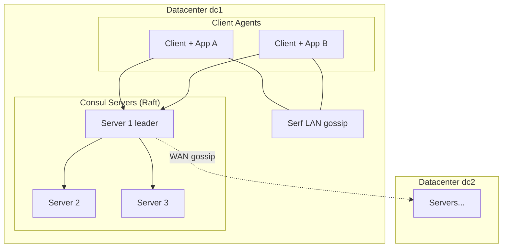
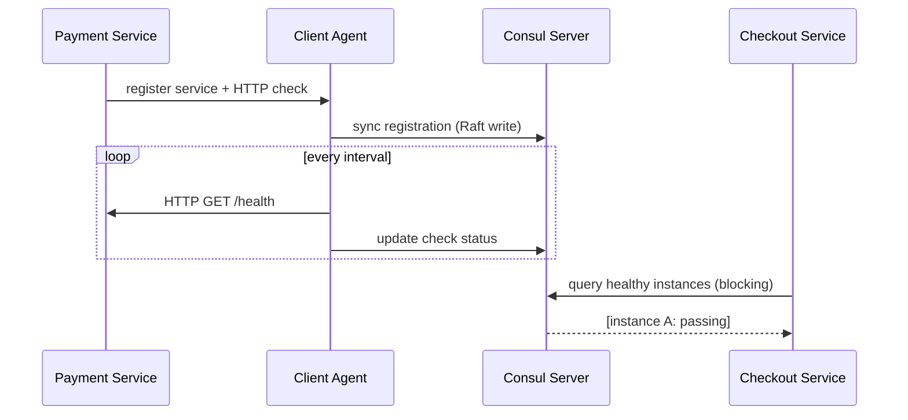
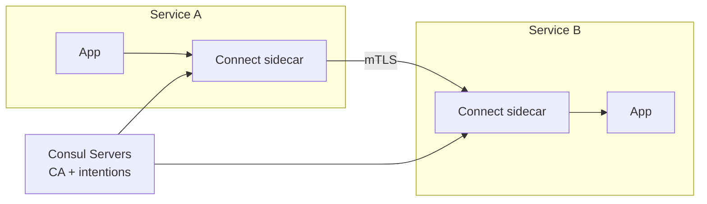

# HashiCorp Consul

## 1. Executive Summary

**HashiCorp Consul** is a multi-capability platform for **service networking**: **service discovery**, **health checking**, **KV configuration**, **multi-datacenter federation**, and **service mesh (Consul Connect)** with **mutual TLS**. Its **server agents** form a **Raft consensus cluster** that stores the **catalog** and **KV state**; **client agents** run on every node, forwarding queries and executing health checks locally.

Consul combines **strongly consistent** server state (Raft) with **gossip-based (Serf)** membership and failure detection for clients and WAN federation. This hybrid design lets architects deploy **CP catalog metadata** while scaling **health check execution** across the fleet. Understanding Consul is essential for principal interviews covering **microservice discovery**, **split between data plane and control plane**, **WAN vs LAN semantics**, and comparison with **etcd**, **Kubernetes DNS**, and **Istio**.

This chapter explains Consul's architecture, Raft usage, gossip layer, DNS and HTTP APIs, sessions and locks, Connect sidecars, failure modes, security, operations, and interview depth.

## 2. Why This Topic Matters

Consul appears in **HashiCorp stacks** (Nomad, Vault integration patterns), **multi-cloud service meshes**, and enterprises avoiding Kubernetes-only discovery. Interviewers test:

- **Server vs client agent** responsibilities.
- **Raft quorum** requirements for writes.
- **Serf gossip** vs **Raft** division of labor.
- **Health checks** driving **passing** vs **critical** service state.
- **Blocking queries** for long-poll service updates.
- **Connect** mTLS vs traditional edge TLS.

Principal architects evaluate Consul when designing **multi-datacenter** discovery, **VM + container** hybrid estates, and **zero-trust east-west** networking. They must also know when Consul is **overkill** relative to cloud load balancers and K8s Services.

## 3. Problems Being Solved

| Problem | Consul mechanism |
|---------|------------------|
| **Dynamic service discovery** | Catalog + DNS/HTTP API |
| **Health-aware routing** | Checks mark instances passing/critical |
| **Distributed configuration** | KV store on servers (Raft) |
| **Leader election / locks** | Sessions + KV lock paths |
| **Multi-datacenter awareness** | WAN gossip + prepared queries |
| **Service-to-service security** | Connect mTLS and intentions |
| **Network observability** | Mesh telemetry (with stack integration) |

Consul does **not** replace a full observability platform, container orchestrator, or general-purpose OLTP database.

## 4. Assumptions and System Model

| Assumption | Consul treatment |
|------------|-------------------|
| **Crash-stop servers** | Raft majority for consistency |
| **Client agents best-effort** | Local checks; server catalog authoritative |
| **LAN gossip within datacenter** | Serf membership |
| **WAN links between DCs** | Higher latency; eventual cross-DC catalog |
| **Non-Byzantine** | Standard commercial deployment model |

**Client model:** Applications use DNS (`service.consul`), HTTP API, or Connect sidecar proxy; blocking queries wait for state changes.

**Not assumed:** Global linearizable reads across WAN; automatic Byzantine tolerance.

## 5. Essential Terminology

| Term | Definition |
|------|------------|
| **Server agent** | Raft peer; stores state |
| **Client agent** | Lightweight; runs checks; caches |
| **Catalog** | Registered services and nodes |
| **Service** | Named logical service with instances |
| **Check** | Health probe (HTTP, TCP, TTL, script) |
| **Serf** | Gossip protocol for membership |
| **Raft** | Consensus for server state |
| **Datacenter (DC)** | Consul isolation/federation unit |
| **ACL** | Token-based authorization |
| **Session** | Lock/ephemeral binding with TTL |
| **Connect** | Service mesh with sidecar proxies |
| **Intention** | Allow/deny policy between services |
| **Prepared query** | Geo-failover / routing template |
| **Blocking query** | Long-poll with index for changes |
| **Gossip encryption** | Symmetric key for Serf traffic |

## 6. Core Mechanism

### 6.1 Architecture



*Figure 1: Servers replicate catalog/KV via Raft; clients gossip locally; WAN links federate datacenters.*

### 6.2 Service registration and discovery

1. Service starts; registers with **local client agent** (HTTP API or auto-register).
2. Client forwards registration to **servers**.
3. **Health check** associated (HTTP `/health`, TTL heartbeat, etc.).
4. Check **passing** → instance in DNS/API responses; **critical** → removed from healthy set.
5. Consumers query `payments.service.consul` or HTTP `/v1/health/service/payments`.



*Figure 2: Health checks drive discovery—unhealthy instances excluded from routing.*

### 6.3 Raft on servers

- **Writes** (register, deregister, KV put, ACL changes) go through **leader**.
- **Reads** often served from **leader or followers** with **stale** modes possible—use **consistent** mode when required (implementation: `consistent` query param).
- **Quorum:** typically **3 or 5 servers per DC**; clients do not vote.

**Comparison to etcd:** Both Raft-backed; Consul adds catalog semantics, DNS, mesh, multi-DC federation.

### 6.4 Serf gossip

- **LAN Serf:** membership, failure detection between agents in DC.
- **WAN Serf:** server coordination across DCs (limited bandwidth design).
- **Not consensus:** gossip is **eventually consistent** for membership hints; **catalog truth** is on Raft servers.

### 6.5 Sessions and distributed locks

1. Create **session** with TTL and behavior (`delete`, `release`).
2. Acquire KV lock with session binding.
3. Session lost on agent failure → lock released (similar to ZK ephemeral semantics at coordination layer).
4. **Application must fence** external resources—Consul does not fence databases automatically.

### 6.6 Consul Connect (service mesh)

- Each service gets **identity** (SPIFFE-like).
- **Sidecar proxy** (Envoy) terminates mTLS between services.
- **Intentions** define L4/L7 allow/deny between source and destination identities.
- **Control plane** distributes certs from servers; **data plane** is proxy traffic.



*Figure 3: Connect sidecars enforce mTLS; Consul servers issue certs and policies.*

### 6.7 DNS interface

- **Ready-only** records: `service-name.service.consul`
- **Tags** in query: `payments.primary.dc1.consul`
- **TTL** short; clients cache briefly—combine with retries for failover.

## 7. Step-by-Step Walkthrough

### Walkthrough A: Nomad job registers with Consul

1. Nomad allocates task; local Consul client registers service.
2. Check probes task port.
3. Traefik or Fabio reads Consul catalog for upstreams.
4. Instance fails check → deregistered from healthy pool.

### Walkthrough B: KV configuration rollout

1. Admin writes `config/app/feature` via `consul kv put`.
2. Raft commits; revision index increments.
3. Apps use **blocking queries** on KV with `index` wait for change notification.
4. Apps reload config without polling loops.

### Walkthrough C: Multi-DC failover with prepared query

1. Prepared query defines **nearest N DCs** for `api` service.
2. Primary DC outage; WAN gossip marks servers unavailable.
3. Query returns healthy instances in secondary DC per policy.

### Walkthrough D: Session lock for cron leader

1. Cron job creates session TTL 15s.
2. `kv acquire` on `cron/nightly` with session.
3. Holder renews session; standby blocks on lock path.
4. Holder dies; session expires; lock released; standby runs.

### Walkthrough E: Connect intention deny

1. Service `billing` should not call `admin` API.
2. Intention: `billing` → `admin` deny.
3. Sidecar proxies reject mTLS connection attempt.

### Walkthrough F: ACL policy rollout

1. Bootstrap ACL system once; save initial management token securely.
2. Define policies: `service-write`, `kv-read`, `dns-read` per team.
3. Issue **node tokens** for agents and **service tokens** for registration—least privilege.
4. Policy changes replicate via Raft; agents pick up new rules on refresh interval.

### Walkthrough G: Snapshot disaster recovery

1. `consul snapshot save backup.snap` on healthy cluster.
2. Catastrophic DC loss; provision new servers.
3. `consul snapshot restore` per HashiCorp DR guide for target version.
4. Rejoin clients; verify catalog and KV; **never** restore stale snapshot over live newer state without explicit break-glass procedure.

### Nomad integration pattern

Nomad schedules workloads; each task group registers services with tags (`http`, `rpc`) and checks tied to allocation ports. Fabio, Traefik, or internal gateways query Consul for **passing** instances only. Architects document **tag conventions** so discovery queries remain stable across teams—untagged sprawl breaks prepared queries and traffic routers.

## 8. Invariants and Guarantees

### 8.1 Safety (server Raft)

| Property | Statement |
|----------|-----------|
| **Consistent catalog writes** | Committed registrations linearizable within DC |
| **KV durability** | Quorum-persisted on servers |
| **ACL changes** | Replicated like other writes |

### 8.2 Liveness

- **Client agent failure** → local checks stop; server marks checks failed after timeout.
- **Loss of server quorum** → writes fail; discovery may serve stale reads.
- **WAN partition** → cross-DC views degrade per federation rules.

### 8.3 Health semantics

Only **passing** checks guarantee instance appears in **default** healthy queries—architects must define **grace periods** and **deregister critical** behavior.

### 8.4 Connect security

**mTLS** provides **authentication** and **encryption** between services; **intentions** provide **authorization**—both required for zero-trust story.

## 9. Failure Scenarios

| Failure | Behavior |
|---------|----------|
| **Server quorum loss** | No catalog/KV writes; cluster degraded |
| **Leader election** | Brief write unavailability |
| **Flapping health check** | Thundering herd on catalog churn |
| **WAN split** | Split-brain across DCs mitigated by design—verify prepared query behavior |
| **Stale cache on client** | DNS TTL may route to bad instance briefly |
| **ACL token leak** | Broad compromise—rotate tokens, audit |
| **Connect CA compromise** | Critical—HSM/Vault integration recommended |
| **Agent RAM exhaustion** | Thousands of checks on one client—shard agents |
| **Bootstrap token reuse** | Security incident—never reuse bootstrap secrets |

### Incident pattern: "All services critical"

Misconfigured HTTP check path (404 after deploy) marks every instance critical—effectively **total outage** for discovery consumers. Canary deploys should validate check endpoints; use **TTL checks** with app heartbeats when HTTP surface changes frequently.

## 10. Performance Characteristics

| Aspect | Typical behavior |
|--------|------------------|
| Catalog write rate | Moderate—not etcd/K8s churn levels at extreme |
| DNS queries | Very high read volume possible—cache locally |
| Blocking queries | Efficient change notification vs poll |
| Gossip overhead | Low per node; scales to thousands of clients per DC |
| Connect proxy | Added latency hop—measure p99 |

Exact benchmarks depend on version and hardware—load test before SLAs.

## 11. Scalability Limits

- **Servers:** 3–5 per DC typical; more servers ≠ linear write scale.
- **Clients:** thousands per DC documented in HashiCorp reference architectures—validate for your checks/sec.
- **WAN federation:** not for fine-grained synchronous coordination.
- **KV size:** keep values small; not blob store.

## 12. Operational Considerations

- **Bootstrap:** `bootstrap_expect` for initial quorum; never bootstrap twice.
- **Upgrades:** rolling server upgrades one at a time.
- **Snapshots:** `consul snapshot` for backup; automate and test restore.
- **Autopilot:** (feature) server health monitoring and remediation—verify version.
- **TLS:** enable for RPC, gossip, and Connect.
- **ACL bootstrap** once; manage policies as code.
- **Avoid server agents on every node**—only 3–5 servers; rest are clients.

### Anti-patterns

- Running **server agents on container workers** at scale—wastes Raft resources.
- **Script checks** with long runtime—blocks agent.
- **Huge KV values**—use object store.

### Enterprise vs OSS boundary (verify current licensing)

HashiCorp product packaging evolves—architects verify which features (advanced multi-tenancy, scale-read replicas beyond observers in some stacks, etc.) require Enterprise in their contract version. OSS Consul already provides Raft, DNS, KV, Connect, and multi-DC federation sufficient for many designs; **do not assume** Enterprise features without reading current docs.

## 13. Security Considerations

- **ACL tokens** with least privilege per service.
- **Gossip encryption** keys rotated carefully.
- **Connect CA:** protect root; consider Vault integration.
- **Intentions default deny** for sensitive environments.
- **Audit logging** on servers for compliance.

## 14. Cost Considerations

- Dedicated server instances per DC (3 minimum).
- Sidecar mesh: CPU/memory per pod/VM.
- HashiCorp Enterprise features (if used) vs OSS.
- Operational headcount vs managed cloud discovery (Cloud Map, etc.).

## 15. Production Implementations

| System | Consul usage |
|--------|--------------|
| **HashiCorp Nomad** | Service registration and discovery |
| **Vault** | Storage backend option (historical); integration patterns |
| **Multi-cloud microservices** | VM + container discovery |
| **Service mesh deployments** | Connect with Envoy |
| **Legacy Netflix stack alternatives** | Eureka comparison in interviews |

## 16. Alternatives and Tradeoffs

| Alternative | When |
|-------------|------|
| **Kubernetes Services + DNS** | K8s-native estates |
| **etcd** | Coordination without discovery/mesh |
| **Istio + K8s** | K8s-centric mesh |
| **AWS Cloud Map / ALB** | Managed AWS-only |
| **ZooKeeper** | Legacy coordination |
| **Linkerd** | Lighter mesh |

Consul fits **HashiCorp ecosystem**, **multi-DC VM+container**, and **integrated discovery+mesh**.

## 17. Common Misconceptions

| Misconception | Reality |
|---------------|---------|
| "Every node is a Raft peer" | Only **servers**; clients are lightweight |
| "Gossip is consensus" | Serf is membership; Raft is truth for catalog |
| "DNS is strongly consistent" | Cache TTL; use HTTP consistent reads if needed |
| "Consul locks fence databases" | Coordination only—fencing at resource |
| "Connect replaces API gateway" | East-west mTLS; north-south often still needs gateway |

## 18. Principal Architect Perspective

- **Pick server count per DC** for fault tolerance, not client count.
- **Health check design** is discovery correctness—flapping is an architecture bug.
- **Multi-DC:** embrace **async** cross-DC; use prepared queries for failover stories.
- **Mesh adoption:** weigh sidecar tax vs security requirements.
- **Exit strategy:** catalog API coupling makes migration planning necessary.

### Team topology and ownership

Consul often spans **networking**, **platform**, and **application** teams. Architects define RACI: who owns server upgrades, who authors ACL policies, who debugs Connect certificate expiry. Without clear ownership, incidents stall across silos. **Service naming conventions** (`team.service.env.dc`) should be enforced at registration time—organic sprawl breaks prepared queries and intention policies.

### Cost-benefit framing for leadership

Present Consul TCO as: server infrastructure + agent overhead + mesh sidecar CPU + operational training, weighed against **incident reduction** from health-aware routing and **auditability** from intentions. For Kubernetes-only estates, quantify **simpler alternatives** before mandating Consul org-wide.

## 19. Architecture Review Exercise

**Scenario:** 8 Consul servers in one DC "for HA"; 10k microservices; TTL checks every 5s; global DNS TTL 30s.

**Findings:** Even server count risks split quorum math; Raft write pressure; stale DNS routes. **Recommend:** 3 or 5 servers; increase check interval where safe; shorten critical path TTL or use Envoy/Connect; rate-limit registrations.

**Follow-up discussion points:** How do prepared queries interact with WAN latency? Should mesh be mandatory for PCI scope services only? What is the client agent CPU budget per node at 10k services? How do you test snapshot restore without contaminating production catalog state?

### Additional consul selection criteria

| Criterion | Favor Consul | Favor alternative |
|-----------|--------------|-------------------|
| Workload mix | VMs + Nomad + multi-DC | K8s-only |
| East-west security | Connect intentions required | Already have Istio/Linkerd |
| Discovery protocol | DNS + HTTP blocking queries | Cloud Map / K8s DNS sufficient |
| Team skills | HashiCorp stack invested | etcd/K8s platform team |

**Red flags in candidate designs:** Deploying Consul servers on every worker node; relying on DNS alone for security; omitting ACL bootstrap planning; running WAN federation without measuring cross-DC write latency impact on catalog convergence.

## 20. Whiteboard Explanation

"Consul has two layers: server agents run Raft and hold the catalog and KV; client agents on every node run health checks and cache queries. Services register locally; checks determine if they're passing. Discovery is DNS or HTTP with blocking queries. Serf gossip handles membership and WAN federation hints but isn't the source of truth—Raft is. Connect adds sidecar proxies for mTLS between services with intention policies. It's CP within a datacenter for writes; you lose quorum, you lose updates."

## 21. Interview Questions

1. **Server vs client agent?** — Servers Raft; clients checks/cache.
2. **Raft in Consul?** — Replicates catalog, KV, ACLs.
3. **Serf purpose?** — Gossip membership/failure detection.
4. **How health affects discovery?** — Critical checks exclude instance.
5. **Blocking query?** — Long-poll until index changes.
6. **Session locks?** — TTL-bound; release on failure.
7. **Connect vs traditional TLS?** — Identity per service; mTLS east-west.
8. **Multi-DC model?** — Per-DC Raft; WAN federation.
9. **Quorum servers for 5-node?** — 3 to write.
10. **Consul vs etcd?** — Discovery, DNS, mesh vs raw KV coordination.
11. **Prepared query purpose?** — Geo-failover routing template.
12. **Does Consul fence databases?** — No; sessions coordinate only.

### Scoring rubric (principal loop)

| Signal | Strong | Weak |
|--------|--------|------|
| Architecture | Server vs client; Raft vs Serf | "Consul is a mesh" |
| Health | Passing/critical drives routing | ignores check design |
| Multi-DC | Async federation, prepared queries | single global Raft fantasy |
| Security | ACL + Connect intentions | DNS alone is secure |

## 22. Interview Follow-Ups

1. **Design multi-DC active-active read.** — Prepared queries; stale bounds; avoid single Raft across WAN.
2. **Migrate off Consul to K8s.** — Registration adapters; gradual DNS cutover.
3. **Secure gossip and RPC.** — TLS, encryption keys, ACLs.
4. **Flapping check mitigation.** — Grace periods, deregister delays, stabilization.
5. **Fencing with Consul sessions?** — Token at DB layer; session is coordination only.

## 23. Strong Answer Example

**Question:** "When would you choose Consul over Kubernetes service discovery?"

**Strong outline:** "I'd choose Consul when workloads span VMs and containers outside a single Kubernetes cluster, or when I need integrated multi-datacenter discovery with health checks and optional Connect mesh without adopting Istio. Nomad deployments often pair naturally with Consul. If I'm all-in on Kubernetes, Services, EndpointSlices, and CoreDNS are simpler and reduce moving parts. Consul's Raft servers are a coordination tax—I'd deploy 3–5 servers per DC, not per node. I'd also compare managed cloud discovery if we're single-cloud. The decision hinges on hybrid footprint, mesh requirements, and whether teams already run HashiCorp stack."

## 24. Weak Answer Example

**Weak:** "Consul is a service mesh that's better than Kubernetes."

**Red flags:** Conflates discovery with orchestration; ignores K8s-native options; no server/client distinction; no multi-DC nuance.

## 25. Hands-On Exercise

1. Run Consul dev agent or Docker Compose 3-server cluster.
2. Register a service with HTTP health check; query DNS and HTTP API.
3. Put KV; watch with blocking query from two terminals.
4. Create session; acquire lock; kill holder; observe release.
5. (Optional) Enable Connect demo; send traffic through sidecars; add deny intention.

## 26. Knowledge Check

1. Which agents participate in Raft?
2. Serf vs Raft division?
3. Passing vs critical check?
4. Blocking query index purpose?
5. Bootstrap_expect meaning?
6. Connect component issuing certs?
7. WAN vs LAN gossip scope?
8. Prepared query use case?
9. ACL default after bootstrap?
10. Client agent on every node?
11. Consul fences PostgreSQL?
12. Typical server count per DC?

## 27. Flashcards

| Front | Back |
|-------|------|
| Server agent | Raft peer; authoritative state |
| Client agent | Checks, cache, local registration |
| Serf | Gossip membership protocol |
| Catalog | Services and nodes registry |
| Blocking query | Long-poll on Raft index |
| Session | Lock TTL binding |
| Connect | mTLS service mesh |
| Intention | Service-to-service authz rule |
| Prepared query | Failover/geo routing template |
| Datacenter | Consul federation boundary |
| ACL token | AuthZ credential |
| Critical check | Instance unhealthy state |

## 28. Cheat Sheet

```
TOPOLOGY
  3-5 servers/DC (Raft)
  client agent on each node

WRITE PATH: server leader → Raft quorum

DISCOVERY: DNS | HTTP /health/service | blocking queries

HEALTH: passing → routable; critical → excluded

GOSSIP: Serf LAN/WAN (not consensus)

CONNECT: sidecar mTLS + intentions

OPS: snapshot backup, TLS everywhere, ACL policies

VS ETCD: catalog + DNS + mesh vs raw KV

LOCKS: sessions + KV → fence externally
```

## 29. Related Concepts

- [Raft Consensus](/docs/consensus/raft) — server consensus algorithm
- [etcd](/docs/consensus/etcd) — Raft coordination alternative
- [ZooKeeper](/docs/consensus/zookeeper) — lock and coordination comparison
- [Fencing Tokens](/docs/consensus/fencing-tokens) — required for safe external writes
- [Leader Election](/docs/consensus/leader-election) — session lock patterns
- [Microservices](/docs/microservices/overview) — discovery in service architecture

## 30. References

### Primary sources (formal guarantees)

- HashiCorp Consul documentation: https://developer.hashicorp.com/consul/docs
- Raft as used in Consul server architecture (HashiCorp engineering blogs and docs)
- Serf protocol documentation: https://developer.hashicorp.com/consul/docs/architecture/gossip

### Implementation-oriented

- Consul Connect architecture: https://developer.hashicorp.com/consul/docs/connect
- Consul ACL system and security models
- HashiCorp reference architectures for multi-datacenter deployments

### Books and talks

- Kleppmann, M. (2017). *Designing Data-Intensive Applications.* O'Reilly. [Service discovery context]
- HashiCorp Nomad + Consul integration guides

### Distinction

- **Formal guarantees** — Raft linearizable writes within DC for server state (per Consul architecture docs).
- **Implementation choices** — Connect vs external mesh; DNS TTL; check types.
- **Operational experience** — Flapping checks, WAN federation limits; validate in your deployment.
