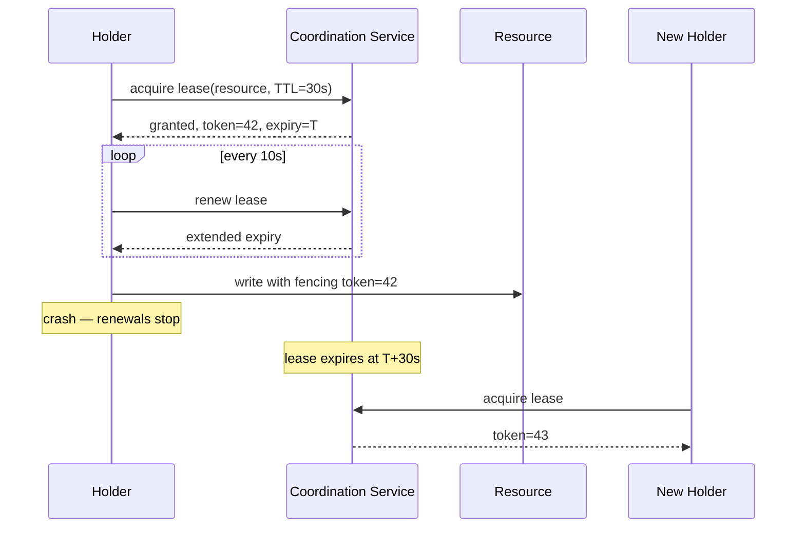
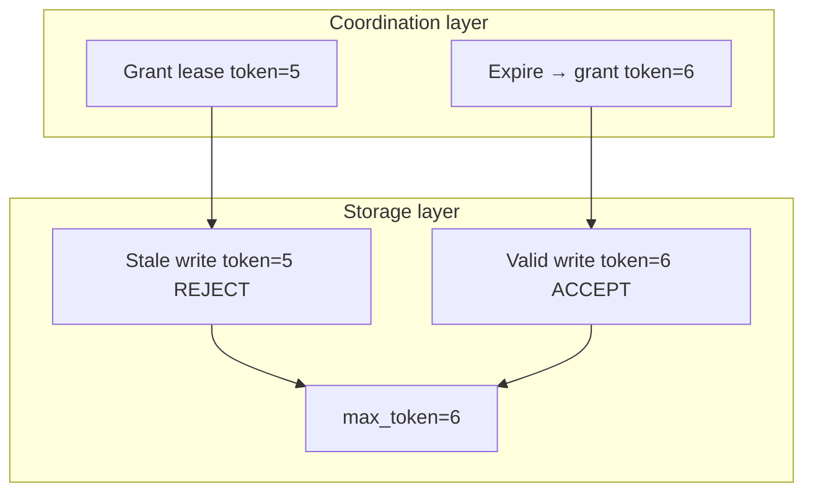
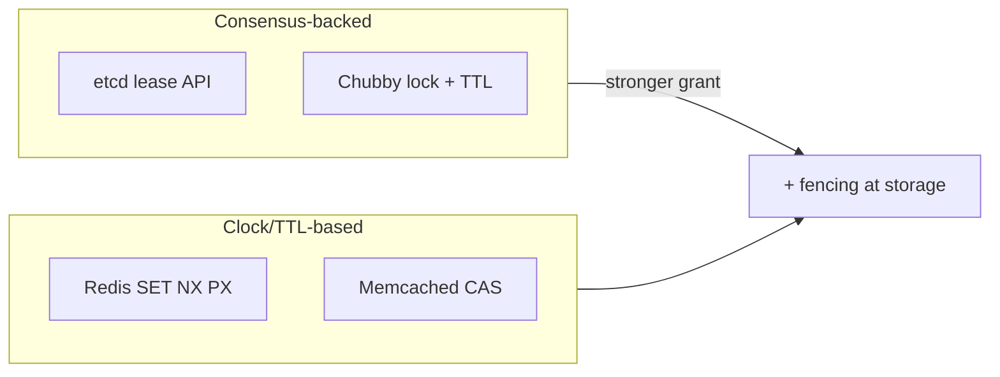

# Distributed Leases

## 1. Executive Summary

A **distributed lease** grants a holder **time-limited, exclusive rights** to a resource—a lock, a shard, write authority, or leadership—across processes that do not share memory or clocks. Leases decouple **liveness** from **safety**: if the holder stops renewing (crash, partition, GC pause), the lease **expires** and another participant may acquire the resource. Unlike pure consensus locks, leases trade **strict mutual exclusion under all delays** for **availability** and **automatic recovery** from failed holders.

Production leases almost always sit atop **consensus or coordination services** (Chubby, ZooKeeper, etcd, DynamoDB conditional writes) or **wall-clock TTL** with **fencing tokens** to protect storage from stale holders. **Safety** requires that expired lease holders cannot corrupt shared state; **liveness** requires renewal before timeout under normal conditions. **Fencing tokens**—monotonic numbers passed to downstream storage—are the standard defense against **delayed writes** from former lease holders.

This chapter covers lease semantics, renewal, fencing, comparison to consensus locks, failure modes, Chubby/etcd patterns, and principal-level design for lease-based systems.

## 2. Why This Topic Matters

Distributed leases appear everywhere:

- **Leader election** (Kubernetes controller leases, database primary).
- **Shard ownership** in distributed storage.
- **Maintenance windows** and **migration gates**.
- **Rate limiting** and **exclusive workers**.

Architects must explain:

- Why **lease duration** vs **renewal interval** matters (GC pause tolerance).
- Why **lease alone is insufficient** without fencing for storage writes.
- Difference between **ephemeral ZK nodes** and **explicit lease APIs**.
- **Clock skew** assumptions in TTL-based leases.

Interview failures: treating leases as magic locks; ignoring stale primary problem; conflating lease with consensus commit.

### Cost of getting leases wrong

Incidents from missing fencing often exceed years of coordination-service cost—data corruption remediation, customer trust loss, and forensic engineering. The **ROI of fencing** is asymmetric: modest development effort on storage preconditions versus catastrophic tail risk. Principal architects should fund fencing integration before scaling shard leases to production traffic.

## 3. Problems Being Solved

| Problem | Lease mechanism |
|---------|-----------------|
| **Exclusive access with crash recovery** | TTL + expiration |
| **Leader election without permanent lock** | Lease on coordination key |
| **Prevent stale writer** | Fencing tokens |
| **Partition tolerance** | Holder stops renewing; loser stops writing |
| **Load shedding** | Short leases rotate work |
| **Graceful handoff** | Release lease before expiry |

## 4. Assumptions and System Model

| Assumption | Lease treatment |
|------------|-----------------|
| **Clocks** | TTL leases assume bounded skew OR use logical renewal via consensus |
| **Network** | Renewal messages may delay; must fit within TTL margin |
| **Crash-stop holder** | Stops renewing; lease expires |
| **Storage layer** | Must honor fencing tokens if used |
| **Coordination service** | Often consensus-backed for grant/renew atomicity |
| **Not Byzantine by default** | Malicious holders need extra controls |

**Partial synchrony:** Renewal succeeds if messages arrive within `(TTL - safety_margin)` under healthy conditions.

## 5. Essential Terminology

| Term | Definition |
|------|------------|
| **Lease** | Time-bounded grant of exclusive right |
| **TTL (time-to-live)** | Duration until lease expires without renewal |
| **Renewal / keepalive** | Extend lease before expiry |
| **Lease holder / grantee** | Process with current valid lease |
| **Fencing token** | Monotonic ID issued with lease; storage rejects stale tokens |
| **Stale lease holder** | Process believing it holds lease after expiration |
| **Grace period** | Optional buffer before re-grant |
| **Ephemeral znode** | ZooKeeper session-bound node (lease-like) |
| **Lease revocation** | Administrative early termination |
| **Split brain (lease context)** | Two holders believe exclusivity—must prevent at storage |
| **Safety margin** | TTL minus renewal interval minus max pause |

## 6. Core Mechanism

### 6.1 Basic lease lifecycle

1. **Grant:** Coordination service issues lease `(resource, holder, expiry)` or `(resource, holder, ttl)`.
2. **Use:** Holder performs privileged operations while valid.
3. **Renew:** Holder periodically extends expiry before TTL elapses.
4. **Expire:** If renewal fails, lease void; others may acquire.
5. **Release:** Holder voluntarily ends lease early (optional).



*Figure 1: Lease grant, renewal loop, expiration enables re-acquisition with new fencing token.*

### 6.2 Fencing tokens (Martin & Stone 2005 pattern)

**Problem:** Stale holder, after partition heals, writes to storage unaware lease expired.

**Solution:** Coordination service increments **fencing token** on each grant. Storage (e.g., GFS chunkserver, block store) rejects writes with token < highest seen.



*Figure 2: Fencing—storage enforces monotonic tokens independent of lease holder belief.*

### 6.3 Consensus-backed vs clock-based leases

| Type | Grant mechanism | Clock dependency |
|------|-----------------|------------------|
| **Consensus lease** | Replicated log entry (Chubby, etcd lease) | Low for validity; TTL may use logical time |
| **TTL key** | `SET key PX ttl NX` (Redis) | Higher clock sensitivity |
| **Ephemeral session** | ZK session + ephemeral node | Session timeout driven |



*Figure 3: Lease grant paths—consensus vs TTL; both need fencing for storage safety.*

### 6.4 Renewal timing inequality

Let:
- `TTL` = lease duration
- `R` = renewal period
- `P_max` = maximum process pause (GC, scheduling)

**Safe operation** requires: `R + P_max < TTL` (often `R ≤ TTL/3` rule of thumb).

Violations cause **false expiration** or **false confidence** if holder continues without valid lease.

## 7. Step-by-Step Walkthrough

### Walkthrough A: etcd leader election lease

1. Controller calls `Lease.Grant(TTL=15s)`.
2. `KeepAlive` stream renews every 5s.
3. `Txn` puts leader key bound to lease ID.
4. Controller crashes; keepalive stops; key deleted after TTL.
5. Standby acquires new lease and key.

### Walkthrough B: Stale primary without fencing (failure)

1. Primary holds lease; partition isolates it from coordinator.
2. Coordinator expires lease; secondary becomes primary (token 2).
3. Primary rejoins; writes to database without token check.
4. **Split brain writes**—data corruption.

**Fix:** Database or storage layer checks fencing token on every write.

### Walkthrough C: Chubby advisory lock

1. Client acquires Chubby lock file with lease.
2. Lock is **advisory**—must enforce at application/storage.
3. Client maintains `CheckSequencer` or equivalent for storage writes.

### Walkthrough D: Graceful release

1. Holder completes work; calls `Revoke` lease.
2. Standby immediately competes—faster failover than waiting TTL.

### Walkthrough E: ZooKeeper ephemeral node

1. Session established with timeout 30s.
2. Create ephemeral `/leader` znode.
3. Heartbeats maintain session.
4. Client GC pause > 30s → session lost → node deleted → new leader.

### Walkthrough F: DynamoDB conditional write as implicit fence

Shard owner writes `PutItem` with condition `attribute_not_exists(epoch) OR epoch < :new_epoch`. New owner uses higher epoch after lease grant. No separate coordination service fencing token—**version attribute** plays the same role. Pattern generalizes: any storage supporting compare-and-swap can fence if epoch is monotonic and checked atomically with the write.

### Walkthrough G: Lease duration sizing worksheet

| Factor | Example value |
|--------|---------------|
| P99 GC pause | 4s |
| P99 network jitter | 1s |
| Renewal interval | 5s |
| Minimum TTL | ≥ 3 × 5s = 15s (rule of thumb) |
| Safety-adjusted TTL | 15s + 4s + 1s = 20s recommended |

Document these numbers in service SLO docs; revisit after JVM upgrades or kernel changes.

### Walkthrough H: Graceful shutdown with lease handoff

Holder calls `Revoke`, waits for coordinator ACK, then shuts down. Standby acquires immediately. Without revoke, standby waits full TTL—acceptable for batch jobs, unacceptable for user-facing failover targets under 5s. Product requirements drive TTL choice, not only infrastructure defaults.

## 8. Invariants and Guarantees

### 8.1 Mutual exclusion (best effort)

At most one **valid** lease holder per resource at coordination service—if service correct and clocks/consensus sound.

### 8.2 Safety with fencing

Storage accepts writes only from holder with **current** fencing token → **no stale writes** even if holder misbehaves.

### 8.3 Liveness

If holder crashes, lease expires within TTL; another can acquire.

### 8.4 Non-guarantees

Lease does **not** guarantee holder stops immediately on partition—only that coordination service will eventually allow new holder.

### 8.5 Combining leases with consensus leadership

Raft leaders implicitly hold **leadership** until higher term. Some systems add explicit **leader lease** (Raft lease read optimization) where followers trust leader for wall-clock window. This blends clock assumptions with consensus—document clearly when linearizability depends on bounded clock skew versus pure log ordering.

| Property | Without fencing | With fencing |
|----------|-----------------|--------------|
| Exclusive grant at coordinator | Yes | Yes |
| Stale writer prevention at storage | No | Yes |
| Automatic failover | After TTL | After TTL |

## 9. Failure Scenarios

| Failure | Behavior |
|---------|----------|
| **Holder crash** | Lease expires; re-acquire |
| **Coordinator partition** | Depends on quorum; may pause grants |
| **Renewal storm** | Backoff; risk expiry if overloaded |
| **GC pause > TTL** | False loss of lease; duplicate holders without fencing |
| **Clock skew forward** | Premature expiry |
| **Clock skew backward** | Delayed expiry; longer stale holder window |
| **Forgot fencing** | Stale primary corruption risk |
| **Lease too long** | Slow failover |
| **Lease too short** | Churn, false failovers |

## 10. Performance Characteristics

| Aspect | Behavior |
|--------|----------|
| **Acquire latency** | 1 RTT to coordinator + consensus if replicated |
| **Renewal overhead** | Periodic load on coordinator |
| **Failover time** | Up to TTL (unless revoke) |
| **Throughput** | High for advisory; storage fencing adds check cost |
| **Renewal fan-out** | N holders × (1/R) renewals per second |
| **Coordinator CPU** | Lease keepalive streams dominate at scale |

For N concurrent lease holders each renewing every R seconds, coordination service sees N/R renewal operations per second independent of business transaction rate. A cluster with 5,000 shard leases at R=5s generates ~1,000 renewals/s—size etcd or ZooKeeper clusters accordingly, or aggregate leases hierarchically.

## 11. Scalability Limits

- Coordinator hot spot for popular lease keys.
- Renewal traffic scales with holder count.
- Long TTL reduces renewal load but slows failover.
- Shard lease responsibility by resource prefix.

## 12. Operational Considerations

- Set `TTL ≥ 3 × renewal_interval`.
- Account for **GC**, **container freeze**, **VM migration** pauses.
- Monitor lease expiration events and renewal failures.
- **Runbooks** for manual revoke during stuck holder.
- Document **fencing** support in downstream systems.
- Kubernetes **Lease** objects: `leaseDurationSeconds` vs controller resync.

### etcd lease specifics

- Leases are **first-class objects** with IDs.
- Keys attached to lease deleted on expiry.
- `KeepAlive` requires active gRPC stream.

### Chubby lessons (from Google)

- Keepalive RPCs; **advisory** locks.
- **Sequencer** for storage fencing.
- Don't use Chubby as generic lock service without discipline.

Burrows' Chubby paper emphasizes that developers initially treated Chubby as a **name service** and only gradually learned lock discipline. The **sequencer** returned to clients monotonically increases on lock acquire and must be passed to GFS chunkservers. Principal takeaway: coordination and storage teams must **jointly** design fencing contracts—neither side alone delivers end-to-end safety.

### Lease hierarchy and dependency

Complex systems nest leases: cluster leader holds a coarse lease; shard owners hold finer leases. **Dependency rules** must ensure child leases expire when parent expires—otherwise a demoted cluster leader might still hold shard leases until TTL. Patterns include binding child keys to parent lease IDs in etcd or embedding cluster epoch in shard token validation.

### Comparison to database row locks

Single-database `SELECT FOR UPDATE` provides strong mutual exclusion within one partition but not across AZ failure. Distributed leases add **partition tolerance** at the cost of **eventual** exclusivity enforcement at the data plane without fencing. Interviewers may ask when to stay with DB locks—answer: single-region, single-primary DB with failover controlled by consensus or managed service, not ad hoc TTL keys.

## 13. Security Considerations

- Authenticate lease acquire/renew APIs.
- Fencing tokens must not be guessable if security boundary depends on them.
- Deny lease grant to unauthorized principals.
- Audit lease grants on sensitive resources (shard ownership).

## 14. Cost Considerations

- Renewal traffic to coordination cluster (etcd/Chubby costs).
- Short TTL → more renewals → more CPU/network.
- Long TTL → longer outage detection window → business cost.
- Engineering cost of fencing integration in storage layer.

## 15. Production Implementations

| System | Lease pattern |
|--------|---------------|
| **Google Chubby** | Locks + sequencers + keepalive |
| **etcd** | Lease API + transactional keys |
| **ZooKeeper** | Ephemeral nodes + session timeout |
| **Kubernetes** | `coordination.k8s.io/Lease` for leader election |
| **Redis** | `SET key value NX PX ttl` (requires fencing elsewhere) |
| **DynamoDB** | Conditional writes with version attributes |

## 16. Alternatives and Tradeoffs

| Alternative | When |
|-------------|------|
| **Consensus lock (no TTL)** | Need strong exclusion; tolerate manual unlock |
| **Database advisory lock** | Single DB; not distributed partition tolerant |
| **Raft leader** | Implicit lease via leadership; no separate TTL |
| **CRDT ownership** | Partition-tolerant weak ownership |

Leases when **automatic expiry** and **crash recovery** matter more than instant strict exclusion.

## 17. Common Misconceptions

| Misconception | Reality |
|---------------|---------|
| "Lease = distributed lock with safety" | Need fencing for storage safety |
| "Renewal always succeeds" | Network/partition can fail renewals |
| "Ephemeral ZK node fences storage" | Only coordination; app must enforce |
| "Short TTL always better" | Causes false failovers |
| "Lease prevents split brain" | Only with quorum coordinator + fencing |
| "Redis lock is production-ready alone" | Redlock debates; fencing still required |

## 18. Principal Architect Perspective

- **Every lease design document** must state fencing story.
- **Size TTL** from measured P99 pause, not hope.
- **Prefer consensus leases** for control plane; clock leases for best-effort caches.
- **Test partition** with `iptables`—watch stale holder behavior.
- **Advisory vs mandatory** locks—align team on enforcement layer.

## 19. Architecture Review Exercise

**Scenario:** Sharded service uses 10s etcd lease for shard ownership; writes go directly to object store without token; JVM heaps cause occasional 8s GC pauses; overlapping shard writers reported.

**Fix:** Increase TTL margin (`TTL ≥ 3× renewal + P99 GC`); add monotonic shard epoch to object store conditional writes; metric on lease loss. **Reject** only shortening TTL.

**Object store conditioning example:** S3 conditional PUT on `If-Match: "epoch-42"` while new holder uses `epoch-43`. Document that eventual consistency stores without strong compare-and-swap may **not** fence—choose storage with linearizable conditional operations or layer a strongly consistent metadata service in front.

## 20. Whiteboard Explanation

"A distributed lease gives one process exclusive rights to a resource for a limited time. It acquires the lease from a coordination service with a TTL and must renew before expiry. If the process crashes or can't renew, the lease expires and someone else can take over. The subtlety is that an expired holder might still try to write after a partition heals, so we issue monotonic fencing tokens with each lease grant and teach the storage layer to reject writes with old tokens. Leases trade immediate strong exclusion for automatic recovery and must be sized for renewal traffic, GC pauses, and clock skew."

## 21. Interview Questions

1. **What is a distributed lease?** — Time-bounded exclusive grant.
2. **Why renew leases?** — Extend validity while holder healthy.
3. **What is a fencing token?** — Monotonic ID; storage rejects stale.
4. **Stale lease holder problem?** — Expired holder still writes.
5. **TTL vs renewal interval?** — Renewal must fit inside TTL with margin.
6. **Chubby lock advisory?** — Yes; enforce at storage/app.
7. **ZK ephemeral vs etcd lease?** — Session node vs lease object API.
8. **Lease without consensus?** — Clock TTL possible; weaker grant guarantees.
9. **Failover time bound?** — Up to TTL after last successful renew.
10. **GC pause impact?** — Can miss renew; duplicate holder risk.
11. **Why not infinite lease?** — Crashed holder blocks forever.
12. **K8s Lease resource purpose?** — Controller leader election.

## 22. Interview Follow-Ups

1. **Design shard leader with etcd.** — Grant, keepalive, txn put, fencing on store.
2. **Redlock critique awareness.** — Clock assumptions; fencing still needed.
3. **Compare lease to Raft leadership.** — Leadership is lease-like but log-scoped.
4. **Revoke vs wait TTL.** — Revoke faster; must handle races.
5. **Metrics for lease health?** — Renew latency, expiration rate, fencing rejects.

## 23. Strong Answer Example

**Question:** "Why are fencing tokens necessary if we already have distributed leases?"

**Strong outline:** "The coordination service can correctly expire a lease when the holder stops renewing, but the former holder may not know immediately—it could be partitioned, then rejoin and attempt writes believing it still owns the shard. The lease at the coordinator and the storage layer are separate systems. Fencing tokens fix this by giving each lease generation a monotonic number the storage layer remembers. Any write must carry the current token; stale holders present old tokens and get rejected even if they're late messages. Leases handle liveness of ownership transfer; fencing handles safety at the data plane."

## 24. Weak Answer Example

**Weak:** "Leases expire after TTL so only one node writes. etcd handles exclusivity."

**Red flags:** No stale holder scenario; no fencing; conflates coordinator with storage.

## 25. Hands-On Exercise

**Lab:** `labs/lab-007-distributed-locks/` — leases + fencing on **`:8100`**

```bash
cd labs/lab-007-distributed-locks
go test ./... -v
docker compose -p lab007 -f docker/docker-compose.yml up --build -d
chmod +x scripts/demo_locks.sh && ./scripts/demo_locks.sh
```

| Step | Endpoint | What happens |
|------|----------|--------------|
| 1 | `POST /v1/locks/acquire` | Lease grant with TTL + lock token |
| 2 | `POST /v1/fencing/issue` | Monotonic fence token for resource |
| 3 | `POST /v1/resource/write` | Storage accepts write when `fence > max_fence` |
| 4 | `POST /v1/locks/release` | Explicit release before TTL expiry |
| 5 | `POST /v1/resource/write` | Stale fence rejected after re-acquire |

**Swagger:** http://localhost:8100/docs

### Engineer guide: how the local stack works

1. **Coordination plane** — lock service simulates etcd/Redis lease acquire, renew, release.
2. **Fencing service** — issues strictly increasing tokens per resource (Kleppmann pattern).
3. **Data plane** — resource API enforces `fence_id > last_fence` — not advisory-only.
4. **Stale holder demo** — release + re-acquire shows old fence rejected even if lock "felt" held.
5. **TTL semantics** — short TTL + missed renewals allow second acquirer; fencing prevents corruption.

See also [Fencing Tokens](/docs/consensus/fencing-tokens#25-hands-on-exercise) chapter for theory; this lab is the runnable stack.

### Build-from-scratch exercise (optional)

1. Implement etcd lease lock with `concurrency` package or clientv3 lease API.
2. Simulate holder pause > TTL; observe second acquirer.
3. Add mock storage checking `token > maxToken`.
4. Demonstrate stale write rejection after re-acquire.
5. Tune TTL/renewal; graph false failover vs failover delay.

## 26. Knowledge Check

1. Lease lifecycle stages?
2. Fencing token purpose?
3. Safe renewal inequality components?
4. Advisory lock meaning?
5. etcd KeepAlive role?
6. ZK session timeout effect?
7. Failover time bound?
8. Split brain without fencing?
9. Why TTL not too short?
10. Consensus vs clock lease?
11. Chubby sequencer role?
12. K8s Lease vs Endpoints legacy?

## 27. Flashcards

| Front | Back |
|-------|------|
| Distributed lease | Time-limited exclusive resource grant |
| TTL | Duration until expiry without renewal |
| Renewal / keepalive | Extend lease before timeout |
| Fencing token | Monotonic ID; storage rejects lower tokens |
| Stale holder | Thinks lease valid after coordinator expired it |
| Safety margin | TTL − renewal − max pause |
| Advisory lock | Coordinator tracks; app/storage must enforce |
| Ephemeral znode | ZK session-bound; deleted on session expire |
| etcd Lease API | First-class lease ID + KeepAlive stream |
| Failover bound | ≤ TTL after last successful renew |
| GC pause risk | Missed renew → false expiry / dual holder |
| Fencing vs lease | Lease transfers ownership; fencing protects storage |

## 28. Cheat Sheet

```
LEASE LIFECYCLE: grant → renew loop → expire/release

TIMING: renewal_period + max_pause < TTL (often TTL/3 renew)

STALE HOLDER: partition → expire → rejoin → writes anyway
FIX: fencing tokens at storage

FENCING: coordinator increments token; storage max(token) check

PATTERNS
  etcd: Lease + KeepAlive + Txn attach key
  ZK: ephemeral znode + session timeout
  Chubby: lock + sequencer for storage
  K8s: coordination.k8s.io/Lease

OPS: monitor renew failures, size TTL for GC, test partitions
```

## 29. Related Concepts

- [Leader Election](/docs/consensus/leader-election) — leases implement election
- [Raft Consensus](/docs/consensus/raft) — leadership as implicit lease
- [Zab](/docs/consensus/zab) — sessions and ephemerals
- [The Consensus Problem](/docs/consensus/consensus-problem) — coordination foundation
- [Partial Failure](/docs/distributed-systems-foundations/partial-failure) — partition behavior
- [Idempotency](/docs/distributed-systems-foundations/idempotency) — stale writer mitigation complement

## 30. References

### Primary sources (formal guarantees)

- Gray, C., & Cheriton, D. (1989). *Leases: An Efficient Fault-Tolerant Mechanism for Distributed File Cache Consistency.* SOSP. [Original lease concept]
- Burrows, M. (2006). *The Chubby lock service for loosely-coupled distributed systems.* OSDI. [Production leases + fencing sequencers]

### Implementation-oriented

- Martin, K., & Stone, J. (2005). *Fencing off stale leaders* — blog/pattern widely cited [fencing token pattern]
- etcd leases documentation: https://etcd.io/docs/latest/learning/api/#lease
- Kubernetes Lease API: coordination.k8s.io/v1

### Related debate

- Sanfilippo, S. — Redlock critiques and responses [clock-based lock limitations—verify current arguments before citing in interviews]

### Books

- Kleppmann, M. (2017). *Designing Data-Intensive Applications.* [Chubby, fencing discussion]

### Distinction

- **Formal guarantees** — Lease validity at coordinator when protocol correct.
- **Implementation choices** — TTL values, renewal transport, fencing integration.
- **Operational experience** — GC pause incidents; measure P99 pause in your runtime.
