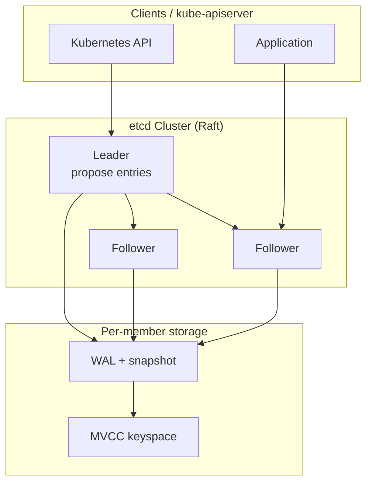
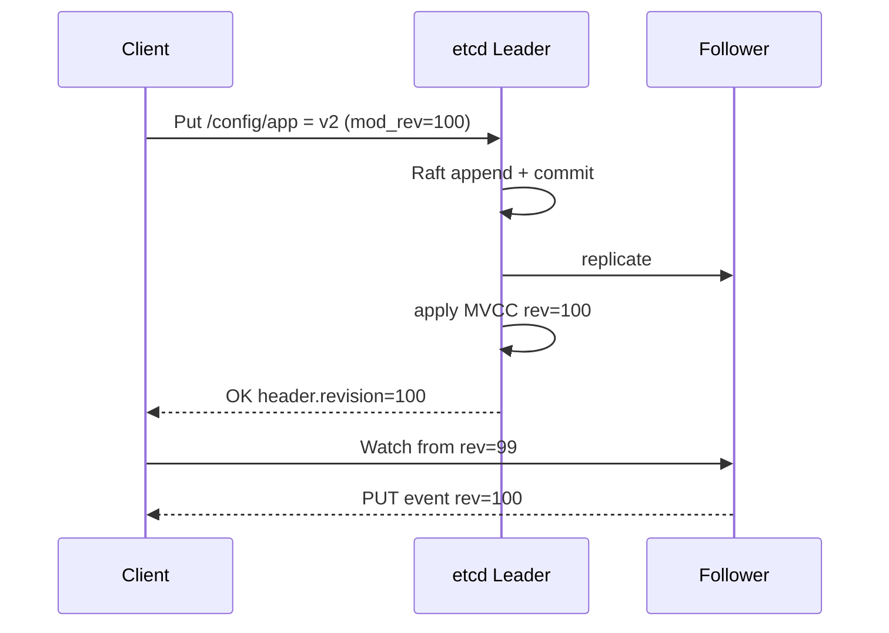
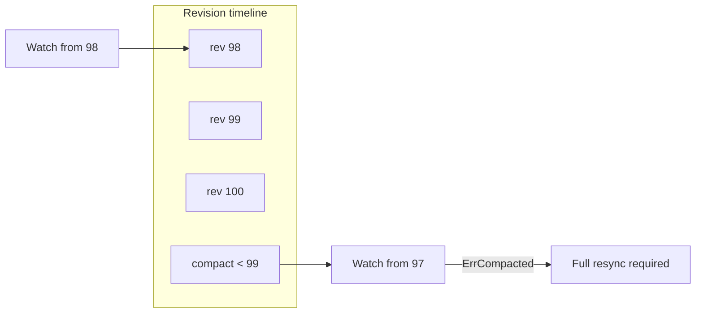

# etcd

## 1. Executive Summary

**etcd** is an open-source, **strongly consistent**, distributed key-value store used as the **coordination and configuration backbone** for Kubernetes and many cloud-native systems. It exposes a gRPC **v3 API** with multi-version concurrency control (**MVCC**), **leases**, **transactions**, **watch streams**, and **concurrency primitives** built on a replicated log maintained by the **Raft** consensus algorithm.

etcd optimizes for **reliability**, **predictable consistency**, and **watch-based reactivity** over raw throughput. Writes traverse Raft quorum; reads can be **linearizable** (quorum read or serializable with constraints) or **cheaper serializable** from local state depending on API options. The Kubernetes control plane stores all cluster state in etcd—making etcd operations, backup, and upgrade strategy a **principal-level** concern for platform architects.

This chapter covers etcd's architecture, Raft integration, data model, leases and locks, watch semantics, failure modes, Kubernetes coupling, performance tuning, and interview framing.

## 2. Why This Topic Matters

etcd is the **reference production Raft deployment** millions of clusters depend on. Senior and principal interviews expect:

- How **Kubernetes** uses etcd (objects, resourceVersion, watches).
- **Raft quorum** implications for control-plane availability.
- **Compaction, defragmentation, and quota** operations.
- **Lease-based leader election** and **transaction** patterns.
- Failure stories: **etcd data loss**, **split upgrades**, **high watch churn**.

Platform architects own **RTO/RPO** for control plane, **member add/remove**, and **disaster recovery** from snapshots. Application teams using etcd directly must understand **linearizability costs** and **key space design**.

## 3. Problems Being Solved

| Problem | etcd mechanism |
|---------|----------------|
| **Strongly consistent metadata** | Raft-replicated MVCC store |
| **Configuration and service discovery** | Key-value with watch |
| **Distributed locking / election** | Leases + concurrency session API |
| **Atomic multi-key updates** | Compare-and-swap transactions |
| **Time-to-live keys** | Leases attach to keys |
| **Kubernetes API backing store** | All K8s objects persisted |

etcd does **not** replace application databases, blob storage, or high-QPS caching layers.

## 4. Assumptions and System Model

| Assumption | etcd treatment |
|------------|----------------|
| **Crash-stop, non-Byzantine** | Standard Raft model |
| **Majority quorum** | Typically 3 or 5 members |
| **Partial synchrony** | Election timeouts for liveness |
| **Small values** | Default request size limit (verify version; often ~1.5 MB) |
| **Deterministic state machine** | MVCC apply order from Raft log |

**Client model:** gRPC v3 client with optional gRPC keepalives; may load-balance reads across endpoints with correct consistency flags.

**Not assumed:** Multi-region single cluster with low latency; automatic application-level fencing without custom logic.

## 5. Essential Terminology

| Term | Definition |
|------|------------|
| **Member** | etcd Raft peer |
| **Leader** | Sole Raft writer for log entries |
| **Revision** | Cluster-wide MVCC version counter |
| **Mod revision** | Revision when key was last modified |
| **Create revision** | Revision when key was created |
| **Lease** | TTL grant; keys bound to lease expire together |
| **Compaction** | Drop historical MVCC versions before revision |
| **Defragmentation** | Reclaim disk after compaction |
| **Snapshot** | Point-in-time state for new members / recovery |
| **Watch** | Stream of events from revision onward |
| **Txn** | Multi-op compare-and-swap transaction |
| **BoltDB / bbolt** | Embedded storage engine (implementation detail) |
| **Quota backend bytes** | Storage size limit per member |

## 6. Core Mechanism

### 6.1 Architecture



*Figure 1: Clients propose writes to leader; Raft replicates; each member applies to local MVCC store.*

### 6.2 Write path (Raft)

1. Client sends **Txn** or **Put** to any member.
2. If not leader, **forward** or return `ErrLeaderChanged`.
3. Leader appends to Raft log; replicates to followers.
4. On **majority match**, entry **committed**.
5. Apply to MVCC state machine; increment revision; respond.

**Latency:** ~1–2 RTT within LAN for commit (deployment-dependent).

### 6.3 MVCC data model

- Keys are byte strings; values are bytes; metadata includes **mod_revision**, **create_revision**, **version** (per-key modification count).
- **Delete** creates a tombstone revision; still visible in history until compaction.
- **Range queries** with prefix; **pagination** for large lists.



*Figure 2: Write commits through Raft; watchers receive ordered events by revision.*

### 6.4 Reads and linearizability

| Read mode | Behavior |
|-----------|----------|
| **Serializable (default local)** | Read local state; may be stale |
| **Linearizable** | Quorum read confirms leadership / sync (implementation via `WithSerializable(false)` patterns—verify client API) |

Kubernetes **list/watch** relies on **resourceVersion** mapped to etcd revision—consistency semantics documented in Kubernetes API machinery.

### 6.5 Leases and TTL keys

1. Grant lease with TTL (e.g., 60s).
2. Attach keys to lease.
3. Keepalive stream renews lease.
4. On lease expiry, keys **deleted automatically**—similar to ZK ephemeral semantics.

Used for **leader election**, **liveness keys**, **distributed locks** (with concurrency package).

### 6.6 Transactions

**Txn** supports multiple `compare` clauses (mod revision, version, value) and `success`/`failure` op lists—atomic compare-and-swap at Raft granularity.

Example pattern: update key only if `mod_revision == expected`.

### 6.7 Watch streams

- Client specifies **start revision**; receives stream of changes ≥ that revision.
- **Compacted revision** error if history garbage-collected—clients must resync (Kubernetes relists).
- High watch counts stress etcd—capacity planning required.



*Figure 3: Compaction drops history—watches starting before compact revision must resync.*

## 7. Step-by-Step Walkthrough

### Walkthrough A: Kubernetes pod creation

1. API server validates Pod; encodes to etcd key `/registry/pods/default/my-pod`.
2. etcd Raft commits put; revision N returned.
3. Scheduler watch receives event at revision N.
4. Scheduler binds node; another etcd write at N+1.
5. Kubelet watch updates pod spec.

### Walkthrough B: Leader election with lease

1. Candidate grants lease L; creates key `/leader` with lease L.
2. Winner runs keepalive goroutine.
3. On crash, keepalive stops; lease expires; key deleted.
4. Standby watch fires; new candidate competes via txn `CreateRevision==0`.

### Walkthrough C: Member replacement

1. `member add` new node; generates join URL.
2. New member catches up via **Raft snapshot + log**.
3. `member remove` old ID after new member healthy.
4. Maintain odd quorum throughout.

### Walkthrough D: Disaster recovery from snapshot

1. Stop corrupted cluster; restore snapshot to new data dir.
2. **Critical:** snapshot revision must match cluster ID expectations.
3. Re-bootstrap or member re-add per runbook—**verify official docs** for version-specific procedure.

### Walkthrough E: Compaction and defrag

1. MVCC history grows; set auto-compaction retention (e.g., 5 minutes or N revisions).
2. `compact` drops old versions; tombstones remain until defrag.
3. `defrag` reclaims BoltDB space offline per member.

### Walkthrough F: Linearizable read path

When an application requires **read-your-writes** or **linearizable** visibility after a write:

1. Client completes `Put` on leader; receives `header.revision`.
2. Client issues `Get` with linearizable option (or routes to leader with quorum read semantics per client library).
3. Returned value reflects all commits through the read barrier.

Kubernetes API server handles this internally; custom etcd clients must explicitly choose read consistency—**default serializable reads are a common bug source**.

### Walkthrough G: Alarm and quota recovery

1. Cluster hits `NO SPACE` or quota alarm; writes rejected.
2. Operator runs compaction if history is bloated; defrag each member serially.
3. If insufficient, **expand disk** or restore from snapshot to larger volume.
4. Post-incident: enable proactive `etcd_mvcc_db_total_size_in_bytes` alerting at 70% quota.

### etcd vs Kubernetes API layering

The API server is a **caching, validating, admission-controlled** facade over etcd. Not every API read hits etcd directly—**watch cache** and **informers** reduce load. Platform architects distinguish **etcd SLOs** from **apiserver SLOs**; optimizing one without the other fails during controller storms.

## 8. Invariants and Guarantees

### 8.1 Safety (from Raft + MVCC apply)

| Property | Statement |
|----------|-----------|
| **Linearizable writes** | Committed writes totally ordered |
| **Consistent reads (when requested)** | Quorum/linearizable read paths |
| **Watch ordering** | Events in non-decreasing revision order per watcher |
| **Txn atomicity** | Compare-and-ops applied atomically at apply time |

### 8.2 Liveness

- **Leader election** when majority available.
- **Watch delivery** requires member stability; client must handle disconnects.
- **Quota exceeded** blocks writes until compaction/defrag—liveness failure.

### 8.3 Kubernetes-specific invariant

API objects must have **consistent resourceVersion** semantics—etcd revision underpins optimistic concurrency on updates.

## 9. Failure Scenarios

| Failure | Behavior |
|---------|----------|
| **Loss of quorum** | Cluster read-only or unavailable; K8s API degrades |
| **Leader loss** | Brief unavailability until re-election |
| **Disk full / quota** | Writes fail; cluster emergency |
| **Split-brain (misconfig)** | Prevented by Raft if correct member list |
| **Restore old snapshot to live cluster** | **Catastrophic** inconsistency—follow DR runbooks |
| **High watch/memory** | OOM risk; throttle watches |
| **Version skew during upgrade** | Follow supported skew matrix |
| **Defrag on all members simultaneously** | Temporary read/write issues—serialize defrag |
| **Client endpoint list stale** | Apps cannot reach leader; use load-balanced endpoints |

### Incident pattern: Kubernetes "too many requests"

When etcd is overloaded, API server returns **429** or timeouts; controllers retry aggressively, worsening load. Break the loop by reducing controller QPS, temporarily pausing non-critical operators, compacting/defragging, or scaling control plane nodes—**after** confirming etcd metrics, not by blindly restarting API servers.

## 10. Performance Characteristics

| Aspect | Typical behavior |
|--------|------------------|
| Write throughput | Hundreds to low thousands ops/sec (hardware-dependent) |
| Read throughput | Higher with serializable local reads |
| Latency | Low ms LAN; cross-AZ adds RTT to quorum |
| Watch fan-out | Major scalability driver for K8s |
| DB size | Monitor `etcd_mvcc_db_total_size_in_bytes` |

**Benchmark:** Use `etcdctl check perf` and official tuning guides—do not invent numbers for production SLAs.

## 11. Scalability Limits

- Single Raft group—no native sharding.
- Kubernetes scales by **object count**, **watch count**, **event churn**—not just QPS.
- Large values hurt performance—keep objects lean.
- Regional clusters: **separate etcd per region**, not one global etcd.

## 12. Operational Considerations

- **3 or 5 members** for production; spread across failure domains.
- **Hardware:** fast SSD, low latency network; avoid sharing disks with heavy workloads.
- **Backup:** snapshot on schedule; test restore quarterly.
- **Metrics:** Prometheus metrics for leader changes, fsync latency, db size.
- **Upgrades:** rolling member upgrade per supported version ladder.
- **Defrag:** periodic maintenance window per member.
- **Auto-compaction:** enable to prevent unbounded history.

### Kubernetes control plane coupling

- API server `--etcd-servers` points to all endpoints.
- **Encryption at rest** for secrets in etcd (K8s feature).
- **etcd events** correlate with API watch latency.

### Member operations discipline

HashiCorp and etcd documentation converge on the same rule: **one membership change at a time**. Adding two members concurrently or removing a member during another change risks **Raft joint configuration** edge cases and quorum loss. Runbooks should script: `member add` → wait healthy → `member remove` → verify `endpoint status` on all peers before proceeding.

## 13. Security Considerations

- **mTLS** for peer and client communication (required production practice).
- **RBAC** in Kubernetes limits who triggers etcd writes indirectly.
- **Encryption at rest** (etcd or K8s layer) for sensitive values.
- **Snapshot protection**—snapshots contain all cluster secrets.

## 14. Cost Considerations

- Dedicated control-plane nodes for large clusters.
- Cross-AZ etcd: latency tax on every write.
- Managed Kubernetes shifts etcd ops to provider—still understand SLAs.

## 15. Production Implementations

| System | etcd usage |
|--------|------------|
| **Kubernetes** | All control plane state |
| **CoreDNS / custom operators** | Configuration via K8s (backed by etcd) |
| **OpenShift, EKS, GKE, AKS** | Managed or self-managed etcd |
| **Patroni / some HA stacks** | DCS via etcd (verify deployment) |
| **CNCF projects** | Coordination patterns vary |

## 16. Alternatives and Tradeoffs

| Alternative | When |
|-------------|------|
| **Consul** | Service mesh + discovery integrated |
| **ZooKeeper** | Legacy Hadoop stacks |
| **SQL for config** | Weaker watch model; not K8s default |
| **Embedded DB per service** | No shared coordination |

etcd wins for **Kubernetes** and **Raft-native** greenfield coordination.

## 17. Common Misconceptions

| Misconception | Reality |
|---------------|---------|
| "etcd is Kubernetes-only" | General coordination store |
| "Reads always linearizable" | Default local read may be stale |
| "Compaction deletes current keys" | Drops old revisions; current keys remain |
| "More members = more capacity" | More members = more write latency |
| "Watch is free" | High churn costs CPU/memory/network |

## 18. Principal Architect Perspective

- **Control plane SLO** is etcd SLO for Kubernetes.
- **Churn reduction:** fewer object updates, efficient controllers, avoid excessive annotations.
- **DR drills:** snapshot restore is non-trivial—practice.
- **Version alignment:** kube-apiserver, etcd, Raft library versions interdependent.
- **Do not store application data** in etcd via CRDs at scale without analysis.

### Platform team responsibilities

Kubernetes platform engineering owns **etcd backup verification**, **upgrade windows**, and **capacity reviews** tied to API object growth. Application teams indirectly drive etcd load through controller design—architects facilitate **governance**: limit status update frequency, avoid giant ConfigMaps, prefer external stores for blobs. **SLI examples:** etcd disk fsync duration p99, leader election count per day, database size growth rate week-over-week.

### Hybrid and edge considerations

Edge clusters with intermittent connectivity should not stretch a single etcd quorum across unreliable links—**regional control planes** with separate etcd clusters and federation at application layer are more robust than one global etcd attempting CP semantics over high-loss networks.

## 19. Architecture Review Exercise

**Scenario:** 5k-node cluster, controllers rewriting status every second; etcd quota alarms.

**Findings:** Write amplification from status updates; watch load. **Recommend:** reduce status patch frequency, use `--event-ttl`, shard with multiple clusters, tune compaction, consider API server watch cache settings (K8s-specific).

**Follow-up discussion points for principal panel:** What is acceptable RPO for control plane backup? Should status be a separate etcd instance (generally no—operational complexity)? How do you detect which controller causes hottest keys (`etcdctl get --prefix` with metrics labels)? When is multi-cluster federation preferable to single massive etcd?

**Red flags in candidate designs:** Storing large blobs in etcd; running even-sized member counts; skipping backup restore drills; assuming follower reads are linearizable for security-critical admission decisions; defragmenting all members simultaneously during peak hours.

### etcd API evolution note

Modern deployments use **gRPC v3** exclusively; v2 API is removed in current supported versions. Architects reviewing legacy automation should audit scripts for `etcdctl` v2 commands (`set`, `get` without API version) and migrate to v3 `put`, `get`, `txn`, and `watch` semantics before upgrade windows. Verify target etcd release notes for deprecated flags and minimum Kubernetes version pairings in the official compatibility matrix.

## 20. Whiteboard Explanation

"etcd is a replicated key-value store using Raft. The leader accepts writes, appends to a log, replicates to a majority, then applies to an MVCC tree where each change gets a monotonic revision. Clients can watch from a revision for a stream of changes—Kubernetes uses this for its entire object model. Leases give TTL keys for liveness. Transactions do atomic compare-and-swap. It's CP: lose quorum, lose writes. Operations focus on compaction, defrag, snapshots, and quorum member management."

## 21. Interview Questions

1. **Why is etcd in Kubernetes?** — Consistent store for all API objects.
2. **Raft role in etcd?** — Replicated log for all mutations.
3. **What is a revision?** — Cluster-wide MVCC version.
4. **Lease use cases?** — TTL keys, leader election, locks.
5. **Compaction vs defrag?** — History drop vs disk reclaim.
6. **Quorum size for 3 members?** — 2 for majority.
7. **Watch compacted error?** — Client must full resync.
8. **Linearizable read cost?** — Extra quorum/leader confirmation.
9. **Member add/remove cautions?** — One at a time; maintain quorum.
10. **resourceVersion in K8s?** — Maps to etcd mod revision for OCC.
11. **Txn use case?** — Atomic compare-and-multi-op updates.
12. **Default read consistency?** — Serializable from local member—may be stale.

### Scoring rubric (principal loop)

| Signal | Strong | Weak |
|--------|--------|------|
| K8s coupling | resourceVersion, watch cache awareness | "etcd is just a DB" |
| Raft ops | One member change at a time, snapshot DR | "restart cluster" |
| MVCC | revision vs mod_revision vs compaction | conflates with Raft index |
| Capacity | churn, quota, defrag discipline | ignores watch load |

## 22. Interview Follow-Ups

1. **Design HA etcd on 3 AZs.** — Member per AZ; latency vs fault tolerance.
2. **Restore after total loss?** — Snapshot + bootstrap procedure; RPO from backup cadence.
3. **Compare etcd vs Consul for locks.** — Both Raft; API and ecosystem differ.
4. **Prevent etcd overload?** — Reduce churn, limit watches, right-size cluster.
5. **Fencing with etcd?** — Use revision/lease in txn; enforce at resource.

## 23. Strong Answer Example

**Question:** "Our Kubernetes API is slow during etcd leader elections. What do you investigate?"

**Strong outline:** "Leader election implies Raft disruption—check etcd metrics: leader changes, disk fsync latency, network RTT between members, and whether quorum is maintained. Correlate with API server request latency and watch reconnect storms. I'd inspect etcd database size and whether compaction/defrag is overdue, and whether controllers are causing write amplification. I'd verify members are in three failure domains and not CPU-starved. Mitigations: tune election timeouts only per docs, reduce object churn, scale control plane nodes, ensure SSD performance, and schedule defrag. For recurring elections, trace network partitions or flaky members. Long-term, consider cluster segmentation if object count exceeds single etcd design limits."

## 24. Weak Answer Example

**Weak:** "Restart etcd and scale to more nodes for speed."

**Red flags:** No quorum analysis; adding members increases write cost; restart without DR plan; no churn investigation.

## 25. Hands-On Exercise

1. Run single-node etcd with `etcdctl`.
2. Put keys; observe revisions; watch in second terminal.
3. Compact old revision; trigger compacted watch error.
4. Grant lease; attach key; stop keepalive; observe deletion.
5. If available: mini Kubernetes kind cluster; `etcdctl get --prefix /registry` (read-only).

## 26. Knowledge Check

1. Consensus algorithm used?
2. API version in modern deployments?
3. Revision vs mod_revision?
4. Lease purpose?
5. Txn compare fields?
6. Why defrag?
7. Quorum for n=5?
8. Watch start revision behavior?
9. Kubernetes object storage path prefix pattern?
10. Serializable vs linearizable read?
11. Snapshot use case?
12. ErrLeaderChanged meaning?

## 27. Flashcards

| Front | Back |
|-------|------|
| Raft in etcd | Replicated log for all writes |
| Revision | Global MVCC counter |
| Lease | TTL grant for keys |
| Compaction | Remove old MVCC history |
| Defrag | Reclaim disk space post-compaction |
| Watch | Event stream from revision |
| Txn | Atomic compare-and-multiple-ops |
| Member | Raft peer in cluster |
| Quorum | Majority for commit |
| resourceVersion | K8s OCC tied to etcd revision |
| BoltDB/bbolt | Embedded persistence engine |
| Quota backend bytes | Storage limit alarm |

## 28. Cheat Sheet

```
ARCH: Raft + MVCC key-value (gRPC v3)

WRITE: leader → quorum commit → apply → revision++

READ:  serializable (local) | linearizable (stronger)

LEASE: grant + keepalive → keys auto-delete

WATCH: from revision; handle compacted → resync

OPS
  3/5 members, SSD, mTLS
  auto-compaction + periodic defrag
  snapshot backup + tested restore
  monitor: leader changes, db size, fsync

K8s: all API objects; resourceVersion = mod revision

LIMITS: not app DB; watch/churn sensitive
```

## 29. Related Concepts

- [Raft Consensus](/docs/consensus/raft) — prerequisite algorithm
- [Fencing Tokens](/docs/consensus/fencing-tokens) — storage safety with etcd leases
- [Leader Election](/docs/consensus/leader-election) — patterns using etcd
- [ZooKeeper](/docs/consensus/zookeeper) — alternative coordination service
- [Consul](/docs/consensus/consul) — Raft-based peer system
- [Kubernetes and Platform Engineering](/docs/kubernetes-and-platform-engineering/overview) — primary consumer

## 30. References

### Primary sources (formal guarantees)

- Ongaro, D., & Ousterhout, J. (2014). *In Search of an Understandable Consensus Algorithm.* USENIX ATC. [Raft guarantees underlying etcd]
- etcd documentation: https://etcd.io/docs/
- Kubernetes etcd FAQ and cluster administration guides (implementation coupling)

### Implementation-oriented

- etcd Raft library: https://github.com/etcd-io/raft
- etcd v3 API and concurrency package documentation
- CNCF etcd project maintenance and upgrade guides

### Books

- Kleppmann, M. (2017). *Designing Data-Intensive Applications.* O'Reilly. [Coordination and consensus context]
- Burns, B., Beda, J., & Hightower, K. *Kubernetes: Up and Running* (etcd operations chapters)

### Distinction

- **Formal guarantees** — Raft safety/liveness; linearizable writes on commit path.
- **Implementation choices** — BoltDB, compaction policy, defrag scheduling, client read modes.
- **Operational experience** — Kubernetes churn and quota incidents; measure in your environment.
