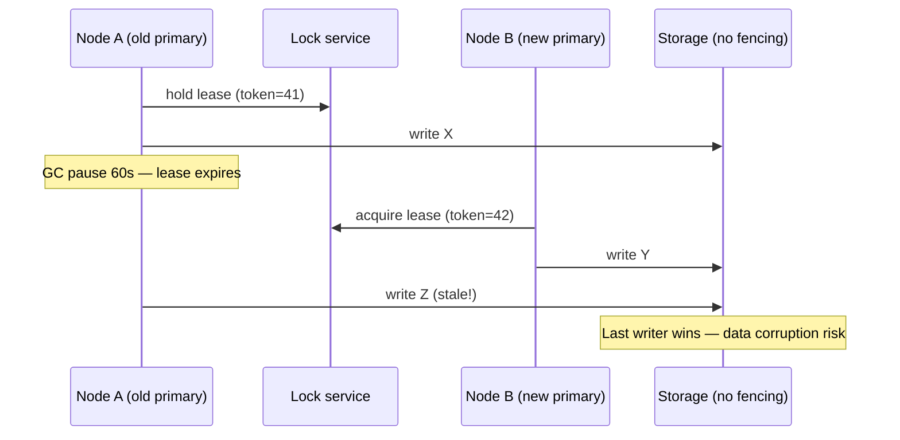
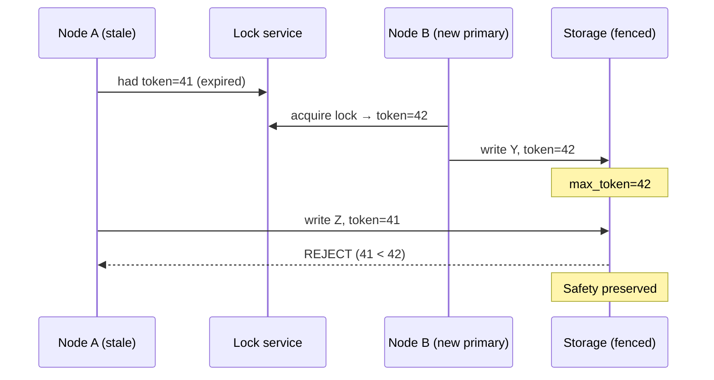
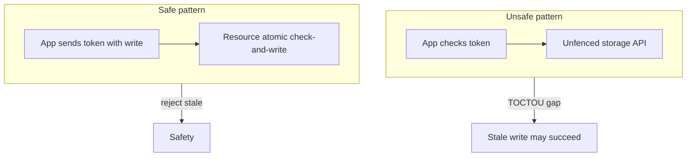

# Fencing Tokens

## 1. Executive Summary

**Fencing tokens** are monotonically increasing numbers (or comparable epoch identifiers) issued by a **lock service** or **consensus-backed coordinator** when a client acquires exclusive authority—typically a **distributed lease** or leadership lock. Every subsequent write to a protected resource must carry the current token; the **resource** (database, block device, object store gateway) **rejects** operations whose token is less than the highest token it has already accepted.

Fencing closes a critical safety gap: a **stale leader** or **expired lease holder** can remain alive after failover and issue destructive writes unless the storage layer can distinguish fresh authority from stale authority. Leases alone provide **liveness-oriented** time bounds; fencing tokens provide **safety-oriented** rejection of stale actors at the resource boundary.

This chapter explains the split-brain problem that motivates fencing, formal safety properties, integration patterns with etcd, ZooKeeper, and Consul, failure scenarios including GC pauses and clock skew, and principal-level interview framing. Fencing is not a consensus algorithm—it is a **defense-in-depth** mechanism that makes lease-based leadership safe when paired with cooperative storage.

## 2. Why This Topic Matters

Distributed leases appear everywhere: Kubernetes leader election sidecars, database HA orchestration, job schedulers, and storage primaries. Interviewers and architecture reviewers probe whether candidates understand that **"I hold the lock" is insufficient** when the lock service and the data plane are separate systems.

Principal architects must articulate:

- Why **lease expiry does not stop** a paused process from writing.
- How **fencing tokens** differ from **generation numbers**, **terms**, and **MVCC versions**.
- Where fencing must be enforced (storage layer) versus where it is useless (application-only checks).
- Tradeoffs when the resource **cannot** enforce tokens (legacy databases, NFS, some object stores).

Production incidents from missing fencing include dual-primary databases, duplicate payment processing, and corrupted shared filesystems after failover. Kleppmann (*Designing Data-Intensive Applications*, Chapter 9) and operational postmortems from split-brain HA clusters are essential background.

## 3. Problems Being Solved

| Problem | Fencing mechanism |
|---------|-------------------|
| **Stale leader writes after failover** | Resource rejects writes with token < max seen |
| **GC pause longer than lease TTL** | Expired holder's writes fail at storage |
| **Network partition with lease holder isolated** | New leader gets higher token; old writes fenced |
| **Delayed messages from prior epoch** | Monotonic token invalidates stale operations |
| **Application believes it is still primary** | Storage is source of truth for accepted token |

Fencing does **not** solve Byzantine faults, application-level idempotency without tokens, or resources that ignore fencing entirely.

## 4. Assumptions and System Model

| Assumption | Fencing treatment |
|------------|-------------------|
| **Crash-stop or fail-stop processes** | Stale process may resume; fencing handles delayed writes |
| **Lock service provides monotonic tokens** | Typically via consensus (Raft term, ZK sequential znode) |
| **Resource enforces token check atomically with write** | Required for safety; check-then-act at app layer is insufficient |
| **Single-writer resource semantics** | Fencing targets exclusive writers (block device, primary DB) |
| **Not Byzantine** | Malicious clients forging tokens breaks model |

**Client model:** Lock holder obtains token T from coordinator; each write includes T; resource updates `max_token` on accept and rejects `T' < max_token`.

**Not assumed:** Universal support in all storage systems; automatic fencing without application integration; fencing across multi-leader databases without additional coordination.

## 5. Essential Terminology

| Term | Definition |
|------|------------|
| **Fencing token** | Monotonic identifier proving freshness of write authority |
| **Lock service** | Coordinator issuing tokens (etcd, ZooKeeper, Consul) |
| **Resource / storage layer** | System that must reject stale tokens |
| **Stale leader** | Node that lost authority but has not yet stopped writing |
| **Split brain** | Two nodes both believing they have write authority |
| **Lease** | Time-bounded lock; often paired with fencing |
| **Generation number** | Similar concept in GFS, HDFS block generations |
| **Epoch / term** | Consensus logical clock; can serve as fencing epoch |
| **Check-and-set** | Compare token before write; must be atomic with write |
| **Fail-closed** | Reject ambiguous writes rather than accept |
| **Lock delay** | Intentional wait before new primary writes (weak substitute) |
| **STONITH** | Shoot The Other Node In The Head—hardware fencing alternative |

**Distinction:** A **lease** tells the holder when to stop; a **fencing token** tells the **resource** which holder to accept.

## 6. Core Mechanism

### 6.1 The stale lease holder problem

A process holds a lease on a coordination service. Before the lease expires, it experiences a long **stop-the-world GC pause** or **VM freeze**. The lease expires; a new primary acquires a higher token and begins writing. The old process resumes, still believing it holds the lease, and writes to the database—**without** checking the coordinator on every write path.



*Figure 1: Without fencing, a stale primary can corrupt state after lease transfer.*

### 6.2 Fencing token flow

1. Client requests lock; coordinator returns **token T** (monotonic).
2. Client includes **T** on every write to the resource.
3. Resource maintains `max_accepted_token`.
4. If `T < max_accepted_token`, **reject** write (fail closed).
5. If `T >= max_accepted_token`, apply write and set `max_accepted_token = T`.



*Figure 2: Storage rejects stale token—fencing contains the failure.*

### 6.3 Where tokens come from

| Source | Token shape | Notes |
|--------|-------------|-------|
| **etcd lease + revision** | MVCC revision or custom counter | Linearizable grant path |
| **ZooKeeper sequential node** | Sequence number in znode name | `lock-0000000042` |
| **Raft term + index** | Composite epoch | Used in consensus-native systems |
| **Consul session + KV** | Session lock with monotonic session ID | Pair with app-side enforcement |
| **Dedicated token service** | Central counter | Must itself be highly available |

The token must increase **every time** exclusive authority transfers, including after crash recovery of the coordinator (consensus-backed counters survive restarts).

### 6.4 Enforcement location

**Correct:** Storage engine, SAN controller, distributed filesystem metadata server, or database extension that atomically compares token with write.

**Insufficient:** Application checks token in memory before calling an unfenced API; race between check and write.



*Figure 3: Fencing must be enforced at the resource boundary, not only in application logic.*

## 7. Step-by-Step Walkthrough

### Walkthrough A: Normal failover with fencing

1. Primary P1 holds lock, token **100**. Storage `max_token=100`.
2. P1 writes `{data: v1, token: 100}` → accepted.
3. P1 fails health checks; lease expires.
4. P2 acquires lock, token **101**.
5. P2 writes `{data: v2, token: 101}` → accepted; `max_token=101`.
6. P1 recovers (was partitioned), attempts `{data: v3, token: 100}` → **rejected**.

### Walkthrough B: GC pause without fencing (failure)

1. P1 holds lease, writes successfully.
2. 90-second GC pause; lease TTL 30 seconds.
3. P2 becomes primary, writes new state.
4. P1 resumes, writes without re-validating lock → **split brain** if storage unfenced.

### Walkthrough C: etcd lease + custom token column

1. Application uses etcd **concurrency API** or lease on a key.
2. On leadership grant, read **revision** or maintain counter in etcd via atomic transaction.
3. PostgreSQL table includes `fencing_token BIGINT`; trigger rejects `NEW.token < current_max`.

### Walkthrough D: Block storage (iSCSI / SAN)

1. Cluster manager issues **reservation key** or **persistent reservation** generation.
2. Only holder with current key may issue SCSI writes.
3. Failover increments reservation generation; old host I/O fails at array.

### Walkthrough E: When fencing is impossible

Legacy MySQL async replication without shared-storage fencing: operators use **VIP drain**, **iptables**, **STONITH**, or **manual promotion** with **lock delay**—weaker than token enforcement. Document residual risk.

### Walkthrough F: Token scope across microservices

In a sharded system, each **shard primary** may hold a separate lock path (`/locks/shard/7`). The coordinator issues **independent token sequences per shard** or a **global counter** depending on design:

- **Per-shard tokens:** Shard 7's storage tracks `max_token` only for shard 7; failover on shard 7 does not affect shard 12.
- **Global tokens:** Simpler reasoning for shared storage arrays; higher coordination contention on lock acquisition.

Architects document token scope in ADRs so on-call engineers know which resource rejects which token stream during incident response.

### Walkthrough G: Read-only stale primary

Fencing primarily protects **writes**. A stale primary may still serve **reads** from local cache after losing the lease—dangerous if reads drive billing or inventory decisions. Mitigations: **read from leader only**, **version checks**, or **terminate** stale instance via orchestrator health checks tied to lease validity.

## 8. Invariants and Guarantees

### 8.1 Safety property

**Property (Fencing Safety):** If resource R has accepted a write with token T, then R will reject all subsequent writes with token T' < T, regardless of which client issues them.

**Type:** Safety (nothing bad happens—no stale overwrite after higher token accepted).

**Requires:** Atomic compare-and-write at R; monotonic token issuance at coordinator.

### 8.2 Liveness

Fencing does **not** guarantee progress. A legitimate primary with a **lower** token than a rogue writer that obtained a higher token incorrectly could be blocked—hence token issuance must be tied to **valid lock acquisition**.

### 8.3 Relationship to leases

| Mechanism | Guarantees |
|-----------|------------|
| Lease alone | Holder should stop after TTL; **no enforcement** at resource |
| Lease + heartbeat | Faster detection; still stale writer risk |
| Lease + fencing token | Resource rejects stale writers |
| Consensus election (Raft) | Term acts as epoch; still need resource enforcement for external stores |

### 8.4 Comparison to other epoch schemes

| Scheme | Scope |
|--------|-------|
| **Fencing token** | Per lock domain; storage-enforced |
| **Raft term** | Per Raft group; internal to replicated log |
| **HDFS generation stamp** | Per block; Namenode-enforced |
| **Dynamo vector clock** | Conflict detection, not exclusive fencing |

## 9. Failure Scenarios

| Failure | Behavior |
|---------|----------|
| **Coordinator partition** | Minority cannot issue higher tokens; majority side continues |
| **Token counter reset on coordinator bug** | **Catastrophic** if R resets max_token—must persist monotonic counter |
| **Resource does not persist max_token** | Restart loses fence state—unsafe |
| **Application forgets to send token** | Resource cannot fence—operational bug |
| **Read path without token** | Stale reads possible; fencing protects writes primarily |
| **Multiple resources** | Each must track tokens or share logical clock |
| **Clock-based lease only** | Clock skew causes premature or delayed failover |

## 10. Performance Characteristics

| Aspect | Impact |
|--------|--------|
| Per-write overhead | One integer compare at storage—typically negligible |
| Coordinator round-trip | Lock acquisition dominates; not per-write if token reused |
| Hot failover | Immediate reject of stale writes vs lock-delay wait |
| Throughput | No leader bottleneck beyond lock holder |

Fencing adds minimal steady-state cost when token travels with existing write RPCs.

## 11. Scalability Limits

- Single lock domain → single writer resource model; scale **read replicas** separately.
- Global fencing counter can be sharded per **resource partition** (per shard, per volume).
- Coordinator (etcd/ZK) is not on every write path—only on leadership transition.

## 12. Operational Considerations

- **Runbooks:** Failover steps must include verifying new token propagated before traffic shift.
- **Monitoring:** Alert on fencing rejections (indicates stale writer attempts).
- **Testing:** Chaos—pause primary with `SIGSTOP`, force failover, verify old primary cannot write.
- **Documentation:** List which storage layers enforce tokens vs rely on STONITH.
- **Lease TTL tuning:** Too short → false failovers; too long → long stale write window without fencing.

### Integration checklist

1. Monotonic token source (consensus-backed).
2. Token included on every mutating operation.
3. Storage persists `max_token` across restarts.
4. Metrics and alerts on rejections.
5. Chaos tests in staging.

### Runbook excerpt (principal-level)

During failover, operators should verify: (1) new primary obtained token strictly greater than any acknowledged write in the last hour; (2) storage `max_token` metric matches coordinator issuance logs; (3) old primary process is **stopped** or receives fencing rejections in logs—not merely "lost Redis flag." Escalate if rejections spike after failover completes—that indicates a zombie writer still active.

### Comparison table: coordination + storage pairs

| Pattern | Coordinator | Storage enforcement | Residual risk |
|---------|-------------|---------------------|---------------|
| etcd lease + PG trigger | etcd | `fencing_token` column | Trigger bugs |
| ZK sequential lock + GFS | ZooKeeper | Generation stamp | App forgets stamp |
| Consul session + SAN | Consul | SCSI reservation | Misconfigured LUN |
| Raft-internal only | TiKV/Cockroach | Internal term | N/A for external DB |
| Lease only | Any | None | **High** split-brain |

## 13. Security Considerations

- Tokens are not secrets; they are **ordering witnesses**, not authentication.
- Combine with **mTLS** and **authZ**—a malicious client with network access but no lock should not obtain valid tokens.
- Compromised coordinator could issue arbitrary high tokens—protect coordinator with RBAC and audit logs.

## 14. Cost Considerations

- Coordination service cost (etcd cluster) is fixed overhead for HA workloads.
- Cheaper than data corruption incident; cheaper than extended **lock delay** RTO penalties.
- Managed HA (RDS Multi-AZ, cloud block storage fencing) shifts cost to vendor—verify fencing semantics in SLA.

## 15. Production Implementations

| System | Fencing approach |
|--------|------------------|
| **Google File System (GFS)** | Chunk version numbers at chunkserver |
| **HDFS** | Generation stamps on blocks |
| **etcd** | Revision/lease; apps implement token column |
| **ZooKeeper** | Sequential lock recipes (Curator `InterProcessMutex`) |
| **Consul** | Sessions + KV; application must enforce at DB |
| **VMware / SAN** | SCSI persistent reservations |
| **Kubernetes** | Lease API for controllers; app must fence external state |

**Note:** Kubernetes **Lease** objects coordinate in-cluster leaders; they do **not** automatically fence external databases—application responsibility.

## 16. Alternatives and Tradeoffs

| Alternative | Tradeoff |
|-------------|----------|
| **STONITH / power off old node** | Strong; hardware-dependent; cloud-unfriendly |
| **Lock delay (sleep before write)** | Simple; increases RTO; not provably safe under all timings |
| **Synchronous replication only** | Reduces split-brain window; does not replace fencing for shared disk |
| **Quorum writes on data plane** | Strong; higher latency; different architecture |
| **Consensus on data (Raft DB)** | Term internalized; no external fence needed for log |

Prefer **fencing** when architecture is **lease-based primary** + **external shared storage or DB**.

## 17. Common Misconceptions

| Misconception | Reality |
|---------------|---------|
| "Lease expiry stops the old primary" | Process may be paused, not dead |
| "Checking lock before each write is enough" | TOCTOU without atomic storage check |
| "Raft term fences my PostgreSQL" | External DB needs its own token enforcement |
| "Fencing tokens encrypt or authenticate" | They order authority, not identity |
| "One token for whole datacenter" | Usually per resource or shard |

## 18. Principal Architect Perspective

- **Separate concerns:** Consensus for **who leads**; fencing for **what storage accepts**.
- **ADR requirement:** Any HA design with leases must state fencing enforcement point or accepted risk.
- **Legacy systems:** If storage cannot fence, mandate **STONITH** or **async only** with conflict repair—document RPO/RTO honestly.
- **Observability:** Fencing rejections are high-signal incidents-in-waiting.
- **Interview signal:** Candidates who mention GC pauses demonstrate production awareness.

## 19. Architecture Review Exercise

**Scenario:** Active-passive API tier with Redis `SETNX` leader flag and shared PostgreSQL. No token on writes.

**Findings:** Redis lock is not quorum-backed under partition; PostgreSQL accepts both primaries. **Recommend:** etcd election with monotonic token column + DB trigger, or managed HA with documented fencing.

**Follow-up questions:** What is RTO? Chaos test results? Read path during failover?

## 20. Whiteboard Explanation

"When you use a distributed lease for leader election, the lease tells the holder when to give up—but a paused JVM doesn't know time passed. After failover, two nodes might write. Fencing tokens fix this: the lock service hands out increasing numbers. Every write to the database carries the token. The database keeps the highest token it's seen and rejects anything lower. Even if the old primary wakes up and tries to write, its stale token loses. The critical part is enforcement at the storage layer, not just in the app."

## 21. Interview Questions

1. **What problem do fencing tokens solve?** — Stale lease holder / split brain writes.
2. **Where must fencing be enforced?** — Storage/resource layer, atomically with write.
3. **Lease vs fencing token?** — Lease guides holder; token constrains resource.
4. **GC pause scenario?** — Lease expires during pause; new primary; old writes fenced.
5. **Can application-only checks suffice?** — No; TOCTOU race.
6. **What makes a valid token source?** — Monotonic, consensus-persisted counter.
7. **Fencing and reads?** — Primarily write safety; reads need separate consistency model.
8. **STONITH vs fencing token?** — Hardware kill vs logical reject.
9. **etcd/ZK role?** — Issue tokens; do not fence PostgreSQL automatically.
10. **Safety vs liveness for fencing?** — Safety at resource; liveness from failover speed.

## 22. Interview Follow-Ups

1. **Design fencing for shared NFS primary.** — Hard; NFS lacks token model; use exclusive mount or block storage reservations.
2. **Token persisted where?** — Resource must persist max; coordinator persists issuance counter.
3. **What if coordinator issues duplicate token?** — Violates monotonicity; safety breaks—requires bug fix.
4. **Compare to Raft term.** — Term fences Raft log; external systems need explicit bridge.
5. **Multi-resource transaction?** — Single token per transaction or per-shard tokens; define scope.

## 23. Strong Answer Example

**Question:** "Your service uses etcd leases for leader election and writes to MySQL. Is that safe?"

**Strong outline:** "Not by itself. The etcd lease ensures only one node believes it's leader at the coordination layer, but a stale leader can still write after a long GC pause if MySQL doesn't know about leadership changes. I'd add a monotonic fencing token obtained when acquiring the lease—etcd's revision or a dedicated counter via transaction—and include it on every write. MySQL would store the highest accepted token, rejecting lower ones in the same atomic statement as the update. I'd chaos-test with SIGSTOP on the primary. If MySQL can't enforce tokens, I'd use synchronous replication with clear promotion rules or a managed HA solution, and document residual split-brain risk."

## 24. Weak Answer Example

**Weak:** "We use etcd leases so only one leader exists. We check the lease before writing."

**Red flags:** No storage enforcement; ignores GC pause; no monotonic token; check-then-act race.

## 25. Hands-On Exercise

**Lab:** `labs/lab-007-distributed-locks/` — fencing token enforcement on **`:8100`**

```bash
cd labs/lab-007-distributed-locks
go test ./... -v
docker compose -p lab007 -f docker/docker-compose.yml up --build -d
chmod +x scripts/demo_locks.sh && ./scripts/demo_locks.sh
```

| Step | Endpoint | What happens |
|------|----------|--------------|
| 1 | `POST /v1/locks/acquire` | Lease-based lock (coordination plane) |
| 2 | `POST /v1/fencing/issue` | Monotonic fence token |
| 3 | `POST /v1/resource/write` | Valid fence accepted by storage |
| 4 | Re-acquire after release | New holder gets higher fence |
| 5 | Stale `fence_id` write | Rejected — demonstrates fencing without trusting the lock |

**Swagger:** http://localhost:8100/docs

### Engineer guide: how the local stack works

1. **Lock ≠ safety** — lease expiry can leave a paused process thinking it still holds the lock.
2. **Fencing tokens** — storage tracks `max_fence`; writes must present strictly greater token.
3. **Demo flow** — second acquirer gets fence 2; first holder's fence 1 write fails after resume.
4. **Separation of concerns** — coordination (etcd/Redis) vs data plane enforcement (blob metadata, DB row).
5. **Interview pattern** — always ask "who rejects stale writes?" — answer must be the storage layer.

Full lease lifecycle: [Distributed Leases](/docs/consensus/distributed-leases#25-hands-on-exercise).

### Build-from-scratch exercise (optional)

1. Deploy 3-node etcd; implement minimal leader election with lease.
2. Add a mock storage service with `max_token` and reject stale writes.
3. Run primary; `kill -STOP` primary; force lease expiry; elect new primary; write.
4. `kill -CONT` old primary; attempt write; verify rejection.
5. Repeat **without** fencing to demonstrate corruption scenario in test DB.

## 26. Knowledge Check

1. Define fencing token.
2. Why leases alone are insufficient?
3. Where is enforcement required?
4. Describe GC pause failure mode.
5. Monotonicity requirement?
6. Difference from Raft term?
7. STONITH alternative?
8. etcd's role vs MySQL's role?
9. Safety property of fencing?
10. What happens on token rejection?
11. Can reads be stale with fencing?
12. Lock delay weakness?

## 27. Flashcards

| Front | Back |
|-------|------|
| Fencing token | Monotonic ID proving write authority freshness |
| Stale leader | Lost lock but still attempts writes |
| Enforcement point | Storage layer, atomic with write |
| Lease | Time-bound lock; does not stop paused process |
| Split brain | Two writers believe they are primary |
| Monotonicity | Each new lock must get higher token |
| GC pause risk | Lease expires while process frozen |
| STONITH | Hardware fence—power off peer |
| Generation stamp | HDFS/GFS analog to fencing |
| Fail closed | Reject stale token writes |
| TOCTOU | Check-then-act race without atomic fence |
| Coordinator | Issues tokens; does not fence DB alone |

## 28. Cheat Sheet

```
PROBLEM: stale lease holder writes after failover

MECHANISM
  lock service → monotonic token T
  each write → (data, T)
  resource: if T < max_token → REJECT
             else apply, max_token = T

REQUIREMENTS
  - monotonic issuance (consensus-backed)
  - atomic check at resource
  - persist max_token on resource

FAILURE MODE WITHOUT FENCING
  GC pause > lease TTL → two writers

ALTERNATIVES
  STONITH, lock delay (weak), quorum on data plane

OPS
  chaos: SIGSTOP primary, failover, verify reject
```

## 29. Related Concepts

- [Distributed Leases](/docs/consensus/distributed-leases) — prerequisite; time-bounded authority
- [Leader Election](/docs/consensus/leader-election) — quorum-backed leadership
- [Raft Consensus](/docs/consensus/raft) — terms as internal fencing epochs
- [Primary-Secondary Replication](/docs/replication/primary-secondary-replication) — failover context
- [Quorum Systems](/docs/consistency/quorum-systems) — alternative safety approach
- [Safety and Liveness](/docs/distributed-systems-foundations/safety-and-liveness) — property framing

## 30. References

### Primary sources (formal and pedagogical)

- Kleppmann, M. (2017). *Designing Data-Intensive Applications.* O'Reilly. [Chapter 9: Consistency and Consensus—fencing tokens, lease problems]
- Junqueira, F. P., Reed, B. C., & Serafini, M. (2011). *ZooKeeper: Wait-free coordination for Internet-scale systems.* USENIX ATC. [Lock recipes motivating fencing patterns]
- Ghemawat, S., Gobioff, H., & Leung, S.-T. (2003). *The Google File System.* SOSP. [Generation numbers at chunkservers]

### Implementation-oriented

- etcd concurrency API: https://etcd.io/docs/latest/learning/api/#concurrency-session
- Apache Curator recipes: https://curator.apache.org/docs/recipes-locks.html
- Linux SCSI persistent reservations (implementation choice for block storage)

### Distinction

- **Formal guarantees** — Fencing safety requires monotonic tokens + atomic resource enforcement (engineering consensus from DDIA and distributed systems literature).
- **Implementation choices** — etcd revision vs custom column; SAN reservations vs DB triggers.
- **Operational experience** — Chaos testing with process pause; verify in your stack before claiming safety.
