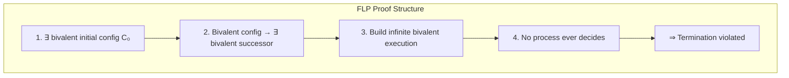
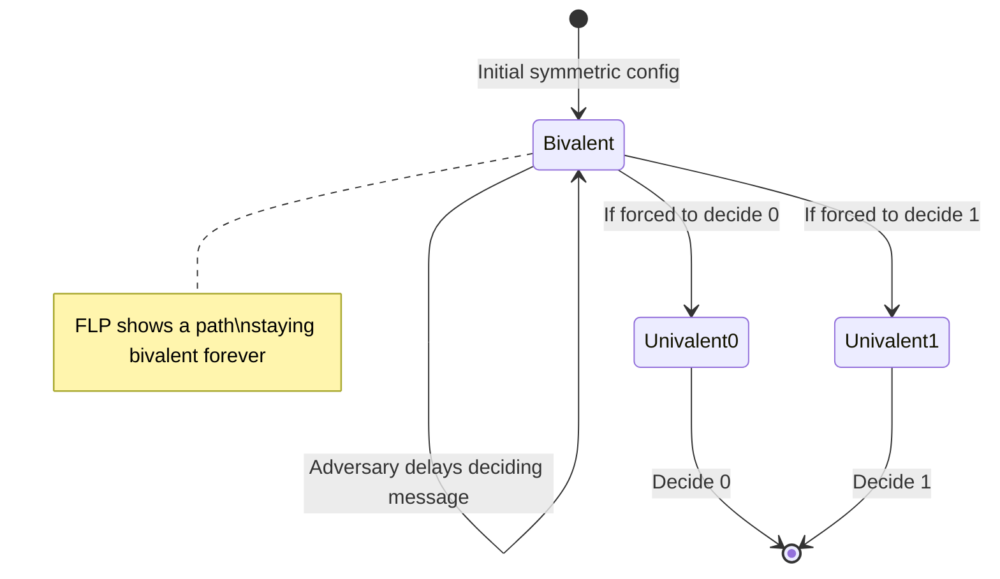
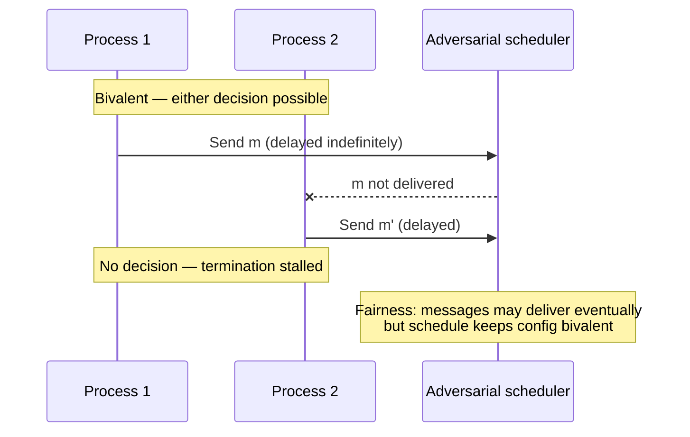

# FLP Impossibility

## 1. Executive Summary

The **Fischer–Lynch–Patterson (FLP) impossibility result** (1985) is a foundational theorem in distributed computing: in a **fully asynchronous** message-passing system where even **one process** may crash, there is **no deterministic consensus algorithm** that guarantees both **agreement** (safety) and **termination** (liveness) in all executions.

The proof uses a **bivalency** argument: if the system can start in a state where either 0 or 1 is still possible, an adversarial scheduler can forever delay messages so that no process decides without risking violation of agreement. FLP does **not** claim consensus is impossible in practice—it delineates the **assumptions** under which deterministic termination cannot be proved. Production systems escape via **partial synchrony** (eventual message bounds), **failure detectors**, **randomized** algorithms, or **sacrificing liveness** during faults.

This chapter presents the system model, the theorem statement, a walkthrough of the proof structure, implications for system design, and how principal architects explain FLP without hand-waving or over-claiming.

## 2. Why This Topic Matters

FLP separates engineers who **memorize "consensus is hard"** from those who **reason about models**:

- Interviewers ask: "Why do we need timeouts in Raft if consensus is 'solved'?" — FLP explains timeouts are not optional embellishments; they embody partial synchrony assumptions.
- Architects who ignore FLP design systems that **hang forever** during network stalls while believing safety algorithms guarantee progress.
- Misreading FLP leads to opposite errors: claiming "distributed consensus is impossible" (false in partial sync) or "FLP is irrelevant" (false for async proofs).

Principal-level answers connect FLP to **operational choices**: election timeouts, `○` vs `◇` failure detectors, and when to fail closed versus retry indefinitely.

## 3. Problems Being Solved

| Question | FLP answer |
|----------|------------|
| Can we prove termination in pure async? | **No** (deterministic, crash-stop, consensus) |
| Must we choose safety or liveness in async? | Cannot have both **guaranteed** for consensus |
| Why do real systems use timeouts? | Approximate partial synchrony; escape FLP |
| Are randomized algorithms allowed? | FLP applies to **deterministic** algorithms |
| Does FLP apply to Byzantine faults? | Different results; FLP is crash-stop |

FLP **does not** solve consensus—it **bounds** what proofs are possible, guiding which assumptions to add.

## 4. Assumptions and System Model

FLP assumes the **asynchronous distributed system** model:

| Assumption | Meaning |
|------------|---------|
| **Asynchronous network** | No upper bound on message delay; messages may be delayed arbitrarily |
| **Reliable channels** | Messages are not lost or corrupted (if sent, eventually deliverable—adversary chooses when) |
| **Crash-stop failures** | A failed process stops; non-failing processes continue correctly |
| **Deterministic algorithm** | Process next step and message contents determined by state and input |
| **Consensus problem** | Agreement, validity, integrity, termination (standard definition) |
| **At least one failure** | f ≥ 1 crash failure must be tolerated |

**Not assumed:** clocks, timeouts, probability, failure detection accuracy, or bounded delay.

**Critical subtlety:** The adversary controls **message scheduling** (delivery order and timing) but not algorithm randomness—because there is none.

## 5. Essential Terminology

| Term | Definition |
|------|------------|
| **Asynchronous system** | No global clock; no bound on time between steps |
| **Bivalent configuration** | A global configuration where both 0 and 1 remain possible decision outcomes |
| **Univalent configuration** | Only one decision value is still reachable |
| **Admissible run** | A fair execution where every sent message is eventually delivered if the sender never crashes |
| **Valency** | The set of decision values still possible from a configuration |
| **Deterministic algorithm** | No coin flips; same state + input → same next step |
| **Termination** | Every correct process eventually decides |
| **FLP theorem** | No deterministic async consensus tolerating one crash |
| **Partial synchrony** | Eventually, unknown bound on message delays |
| **◇P (eventually perfect failure detector)** | Eventually accurate crash detection—makes consensus solvable in async model |
| **Non-blocking vs blocking** | FLP: cannot be non-blocking (terminate) in worst case without extra assumptions |

## 6. Core Mechanism

### 6.1 Theorem statement

> **Theorem (Fischer, Lynch, Patterson, 1985):** There is no deterministic algorithm for solving consensus in an asynchronous distributed system if even one process may fail by stopping.

Equivalently: any deterministic crash-tolerant consensus protocol in the async model must sacrifice **termination** in some admissible execution (while preserving agreement in correct runs), or violate agreement if forced to decide.

### 6.2 Proof strategy overview

The proof proceeds by contradiction:

1. **Exist bivalent initial configuration:** Some initial configuration C₀ is bivalent (both 0 and 1 possible).
2. **Bivalent → bivalent transition:** From any bivalent configuration, there exists a step (message delivery or local step) leading to another bivalent configuration.
3. **Infinite bivalent chain:** Construct an infinite admissible run staying bivalent forever.
4. **No decision:** In a forever-bivalent run, no process decides—violates termination.

The technical heart is step 2: showing the adversary can always avoid forcing univalence without breaking agreement.



*Figure 1: High-level structure of the FLP impossibility proof—an infinite bivalent execution prevents termination.*

### 6.3 Bivalency intuition

Imagine two symmetric processes with no messages yet delivered. Either decision 0 or 1 might still win depending on future scheduling. The **adversary** (scheduler) delays the message that would force a decision until the system remains in limbo.

If an algorithm tried to force a decision in such a state, a different scheduling could have led to the opposite value—violating **agreement**.



*Figure 2: Bivalent configurations can persist indefinitely under adversarial scheduling—termination cannot be guaranteed.*

### 6.4 What FLP does not say

| Claim | True? |
|-------|-------|
| Consensus impossible in practice | **False** — partial sync, randomization |
| Safety impossible in async | **False** — agreement can be preserved by not deciding |
| Timeouts violate theory | **False** — they model partial synchrony |
| FLP applies to Raft | **Misleading** — Raft assumes eventual progress via timeouts |
| One failure is special | **True for theorem** — if 0 failures, trivial consensus exists |

## 7. Step-by-Step Walkthrough

### Walkthrough A: Two-process sketch (informal)

Processes A and B start with proposals. No messages delivered yet:

1. **State:** Both configurations where 0 or 1 could still win—bivalent.
2. **Adversary:** Delay all messages from A to B.
3. **A's local step:** If A could decide alone, B might later decide differently when messages arrive—unsafe.
4. **Therefore:** Safe algorithms wait; adversary keeps delaying.
5. **Result:** Infinite wait—no termination guarantee.

This sketch omits the full n-process valency argument but captures the scheduling tension.

### Walkthrough B: Connecting to production timeouts

1. **Pure async model:** No timeout can be proved sufficient for decision.
2. **Engineering:** Operators set `election_timeout` in Raft assuming messages eventually arrive within unknown T.
3. **If assumption false forever:** System does not elect leader—liveness failure, not safety violation.
4. **If assumption eventually true:** Partial synchrony proofs (DLS, Chandra-Toueg) show consensus solvable.

### Walkthrough C: Valency case analysis (proof detail)

Consider a bivalent configuration C and a step e (delivering one message or one local step) leading to configuration C'.

**Case 1 — C' is bivalent:** Adversary continues the infinite chain; done.

**Case 2 — C' is 0-univalent:** Because C was bivalent, there exists another step e' from C leading to 1-univalent C''. The proof shows (via a **valency argument** on applicable steps) that one can construct a **bivalent successor** of C by choosing the right order of steps—contradicting the assumption that all paths lead to decision.

**Case 3 — Symmetric to Case 2** for 1-univalent.

The full paper formalizes this with **critical steps** and inductive reasoning over configurations. The interview-level takeaway: the adversary never allows the system to cross from "both outcomes possible" to "exactly one outcome forced" without either stalling forever or risking disagreement under an alternate schedule.

### Walkthrough D: Randomized consensus (Ben-Or sketch)

Ben-Or's protocol uses **coin flips** at decision points:

1. Processes exchange proposals in asynchronous rounds.
2. If a round does not converge, processes flip coins to decide whether to adopt a value.
3. Termination occurs with **probability 1**, but not deterministically.

Because FLP requires **determinism**, randomized algorithms are outside the theorem's scope. They illustrate that **probability** is another escape hatch—useful theoretically, less common in production metadata stores than partial synchrony.



*Figure 3: Adversarial scheduling delays critical messages, maintaining bivalency and preventing decision.*

## 8. Invariants and Guarantees

| Under FLP assumptions | Guaranteed | Not guaranteed |
|----------------------|------------|----------------|
| Deterministic async consensus | Agreement if processes decide carefully | Termination in all runs |
| Crash tolerance f ≥ 1 | — | Non-trivial deterministic consensus with termination |

**Safety preservation strategy:** Never decide in uncertain (bivalent) states—but then liveness fails.

**Liveness preservation strategy (unsafe):** Decide anyway—risks agreement under alternate schedules.

## 9. Failure Scenarios

| Scenario | FLP lens | Production manifestation |
|----------|----------|-------------------------|
| **Indefinite message delay** | Core FLP scenario | Network partition, misconfigured firewall |
| **Process pause (GC)** | Equivalent to slow async | False leader suspicion |
| **All nodes healthy but no progress** | Liveness failure | etcd election storm without quorum |
| **Forced decision under uncertainty** | Would break agreement | Split brain if both sides "decide" |
| **Clock not needed** | Async model | Engineers still use clocks heuristically |

FLP predicts that **without synchrony assumptions**, you cannot prove progress—only hope for it.

## 10. Performance Characteristics

FLP is about **correctness bounds**, not throughput. Indirect performance implications:

- Algorithms that **wait for quorums** may stall longer under async adversary—timeouts trade false suspicions for progress.
- **Randomized** consensus (Ben-Or, Rabin) achieves termination with probability 1 but has variable rounds.
- **Failure detector** delays affect time to elect leader—tunable but not provable in pure async.

## 11. Scalability Limits

FLP applies regardless of n: even **n = 2** with one failure suffices for impossibility. Scaling membership does not remove the async termination barrier—it changes quorum arithmetic separately.

## 12. Operational Considerations

- **Document synchrony assumptions:** "We assume cross-AZ RTT < 500ms eventually."
- **Monitor liveness:** Alert on prolonged leader absence—not just error rates.
- **Avoid infinite retries without bounds:** Client and operator exhaustion.
- **Partition drills:** Validate minority behavior matches CP intent.
- **Do not cite FLP to excuse bugs:** Implementation errors ≠ theoretical impossibility.

## 13. Security Considerations

FLP addresses crash failures, not adversarial Byzantine scheduling. A malicious network that delays messages is within the async model; cryptographic authentication does not restore termination without synchrony or randomization.

Denial-of-service that induces perpetual bivalency is a **liveness attack**—mitigate with redundancy, network policy, and operator intervention, not stronger consensus proofs alone.

## 14. Cost Considerations

- **Over-provisioned timeouts:** Faster failover vs. more false elections—operational tuning cost.
- **Managed coordination services:** Pay vendor to operate partial-sync assumptions reliably.
- **Engineering time:** Teams misunderstanding FLP may over-build custom coordination or under-invest in failure detection.

## 15. Production Implementations

How production systems relate to FLP:

| Mechanism | FLP escape hatch |
|-----------|------------------|
| **Raft election timeouts** | Partial synchrony heuristic |
| **Chandra-Toueg ◇P** | Failure detectors |
| **Randomized Byzantine protocols** | Non-deterministic termination |
| **Ben-Or / Rabin** | Probabilistic termination |
| **Blocking minority partition** | Sacrifice liveness for safety |

etcd, Consul, and CockroachDB use **Raft with timeouts**—engineers should articulate that progress depends on eventual deliverability, not FLP-defying magic.

### Mapping FLP to incident categories

| Incident symptom | Safety status | Liveness status | FLP lens |
|------------------|---------------|-----------------|----------|
| Minority partition cannot write | Preserved | Lost on minority | Expected CP behavior |
| Majority partition, no leader | Preserved if no split commit | Lost | Partial sync assumption violated |
| Two leaders same term | **Violated** | — | Implementation bug, not FLP |
| Indefinite client retry storm | May be preserved | Client-side liveness issue | Not consensus layer alone |

Distinguishing **theoretical impossibility** from **implementation defects** is essential in postmortems. FLP explains why coordination may stall; it does not excuse algorithms that violate agreement.

## 16. Alternatives and Tradeoffs

| Escape route | Tradeoff |
|--------------|----------|
| **Partial synchrony (DLS)** | Unknown bound T—timeouts may be wrong temporarily |
| **Failure detectors** | Imperfect; false positives/negatives |
| **Randomization** | Probabilistic termination; harder to reason |
| **Synchronous model** | Unrealistic strict bounds |
| **Non-termination acceptance** | Human operator resolves stuck state |
| **Weaker problem** | e.g., eventual gossip—not consensus |

## 17. Common Misconceptions

| Misconception | Correction |
|---------------|------------|
| "FLP means Raft is wrong" | Raft assumes partial sync; FLP bounds pure async |
| "Add more nodes to beat FLP" | Does not help termination in async |
| "FLP is outdated" | Still foundational for model clarity |
| "Timeouts disprove FLP" | Timeouts are extra assumptions |
| "Consensus is impossible" | Impossible without extra assumptions in async |
| "FLP applies to read replicas" | Different problem unless formalized as consensus |

## 18. Principal Architect Perspective

Communicate FLP to executives and product:

- **"We cannot guarantee both instant progress and zero wrong decisions during arbitrary network delays."**
- **"Our SLA assumes the network eventually stabilizes; otherwise we fail safe, not fast."**
- **"Incident playbooks for 'stuck' clusters are liveness recovery, not safety bugs."**

Architects choose **explicit degradation**: read-only mode, error responses, operator failover—rather than silent inconsistency.

### Board-level framing

FLP is not academic obstructionism—it justifies **investment in coordination infrastructure** and **realistic SLAs**:

1. **Availability math:** 99.99% application uptime cannot compensate for a coordination layer that lacks quorum during regional isolation.
2. **Cost of "always writable":** AP behavior during partition implies merge complexity downstream—product and engineering must own conflict resolution.
3. **Testing budget:** Chaos experiments that delay packets validate liveness assumptions; they do not disprove FLP but verify partial synchrony holds in practice.

When stakeholders demand "zero downtime leader failover," architects translate to measurable **RTO bounds** contingent on network stabilization—not magic instantaneous election.

## 19. Architecture Review Exercise

**Scenario:** A team proposes a consensus layer with **no timeouts** because "timeouts are hacks that FLP shows don't help."

**Review:**

1. Identify the misunderstanding of FLP.
2. Explain what happens during indefinite delay.
3. Recommend partial synchrony documentation and bounded client retries.

**Finding:** Reject—without timeouts or equivalent progress mechanisms, liveness has no engineering path.

## 20. Whiteboard Explanation

"FLP proves that in a fully asynchronous network, if messages can be delayed forever and even one node can crash, no deterministic algorithm can solve consensus with guaranteed termination. The proof builds an infinite execution where the system stays 'bivalent'—either outcome still possible—so deciding risks disagreement. Real systems add assumptions: eventually messages arrive within some unknown bound, or we use failure detectors, or we accept probabilistic termination. That's why Raft has election timeouts—they're not a bug, they're an explicit partial synchrony bet."

## 21. Interview Questions

1. **State the FLP theorem precisely.** — Async, deterministic, ≥1 crash, no consensus with termination.
2. **What is bivalency?** — Configuration where both 0 and 1 remain possible.
3. **Why does FLP not forbid safe agreement?** — Can preserve safety by not deciding.
4. **How do failure detectors change the result?** — ◇P makes consensus solvable in async.
5. **Role of partial synchrony?** — Eventually bounded delay enables DLS-style protocols.
6. **Does randomization violate FLP assumptions?** — Yes—determinism required.
7. **Why are Raft timeouts not a contradiction?** — Model assumption change.
8. **FLP vs CAP?** — FLP: async + crash; CAP: partition + C vs A.
9. **What is an admissible run?** — Fair delivery of pending messages.
10. **Minimum failures for FLP?** — One crash suffices.
11. **Can two-node systems escape FLP?** — FLP applies; trivial if no failures tolerated.
12. **Liveness attack under FLP?** — Delay messages indefinitely.

## 22. Interview Follow-Ups

1. **Sketch the bivalent → bivalent step.** — Case analysis on valency of successors.
2. **Compare Ben-Or randomized consensus.** — Probability 1 termination.
3. **What if channels can lose messages?** — Different model; still need careful reasoning.
4. **How does ◇P differ from ○P?** — Eventually perfect vs always perfect detection.
5. **Relate FLP to two-generals problem.** — Both impossibility in async settings.

## 23. Strong Answer Example

**Question:** "What does FLP impossibility mean for our etcd-based platform?"

**Strong outline:** "FLP tells us we cannot prove that a deterministic consensus algorithm terminates in a fully asynchronous model with crashes. etcd uses Raft, which relies on election timeouts—an engineering embodiment of partial synchrony: we assume that eventually, messages arrive within some unknown bound. If the network never stabilizes, we may not elect a leader, but we should not commit conflicting states. Our incident runbooks treat prolonged leader loss as a liveness problem. We document that minority partitions fail writes to preserve safety. FLP is why we don't promise infinite availability during arbitrary delays—we promise agreement when decisions occur."

## 24. Weak Answer Example

**Weak:** "FLP says consensus is impossible so we use Raft which solves it."

**Red flags:** Contradiction; no model distinction; no mention of timeouts/partial sync; hand-waves.

## 25. Hands-On Exercise

**Thought experiment + lab:**

1. Read Fischer, Lynch, Patterson (1985) abstract and proof outline.
2. Run etcd with artificially delayed packets (`tc netem`) between nodes.
3. Observe election delays and possible lack of leader.
4. Document: safety preserved? liveness impacted?
5. Write one paragraph mapping observations to FLP vs partial synchrony.

## 26. Knowledge Check

1. What three authors and year define FLP?
2. What system model does FLP assume?
3. Define bivalent configuration.
4. Which consensus property does FLP block?
5. Name three ways production systems escape FLP.
6. Does FLP apply to deterministic algorithms only?
7. What is partial synchrony?
8. What is ◇P in failure detector hierarchy?
9. Can agreement be preserved while violating termination?
10. How many crash failures does FLP require?
11. Why are election timeouts not a proof error in Raft?
12. Distinguish FLP from CAP in one sentence.

## 27. Flashcards

| Front | Back |
|-------|------|
| FLP theorem | No deterministic async consensus with ≥1 crash and guaranteed termination |
| Asynchronous model | No bound on message delay |
| Bivalent | Both 0 and 1 still possible as decisions |
| Univalent | Only one decision value still reachable |
| FLP proof technique | Infinite bivalent execution |
| Termination blocked | Cannot force decide without risking agreement |
| Partial synchrony escape | Eventually unknown delay bound |
| Failure detector escape | ◇P enables consensus in async |
| Randomization escape | Non-deterministic algorithms outside FLP scope |
| FLP ≠ practice impossible | Real systems add synchrony assumptions |
| Adversarial scheduler | Controls message delivery order/timing |
| Liveness vs safety under FLP | Safety can hold; liveness cannot be guaranteed |

## 28. Cheat Sheet

```
FLP (1985)
  Model: async, reliable channels, crash-stop, deterministic
  Result: no consensus with guaranteed termination (f ≥ 1)

PROOF IDEA
  bivalent config exists → stay bivalent forever → never decide

ESCAPES
  partial synchrony (timeouts)
  failure detectors (◇P)
  randomization (prob. termination)
  sacrifice liveness (don't decide)

PRODUCTION
  Raft timeouts = partial sync bet
  stuck cluster = liveness, not safety bug

INTERVIEW
  state theorem + bivalency + one escape route
```

## 29. Related Concepts

- [The Consensus Problem](/docs/consensus/consensus-problem) — prerequisite definitions
- [Safety and Liveness](/docs/distributed-systems-foundations/safety-and-liveness) — termination as liveness
- [Distributed System Models](/docs/distributed-systems-foundations/distributed-system-models) — async vs partial sync
- [Failure Detectors](/docs/distributed-systems-foundations/failure-detectors) — ◇P and consensus
- [Leader Election](/docs/consensus/leader-election) — progress mechanisms
- [Raft](/docs/consensus/raft) — partial synchrony in practice
- [CAP Theorem](/docs/consistency/cap-theorem) — related impossibility flavor

## 30. References

### Primary sources (formal guarantees)

- Fischer, M. J., Lynch, N. A., & Patterson, M. S. (1985). *Impossibility of Distributed Consensus with One Faulty Process.* Journal of the ACM, 32(2). [FLP theorem and bivalency proof]
- Dwork, C., Lynch, N., & Stockmeyer, L. (1988). *Consensus in the Presence of Partial Synchrony.* Journal of the ACM. [Escape via partial synchrony]
- Chandra, T. D., & Toueg, S. (1996). *Unreliable Failure Detectors for Reliable Distributed Systems.* Journal of the ACM. [◇P and consensus solvability]
- Ben-Or, M. (1983). *Another Advantage of Free Choice: Completely Asynchronous Agreement Protocols.* PODC. [Randomized escape]

### Books and synthesis

- Lynch, N. A. (1996). *Distributed Algorithms.* Morgan Kaufmann. [Chapter on impossibility results]
- Herlihy, M., & Shavit, N. (2012). *The Art of Multiprocessor Programming.* [Intuition for distributed impossibility]

### Distinction

- **Formal guarantees** — FLP theorem under stated async model.
- **Implementation choices** — Timeout tuning in Raft/etcd.
- **Operational experience** — Network partition drills; environment-specific.
