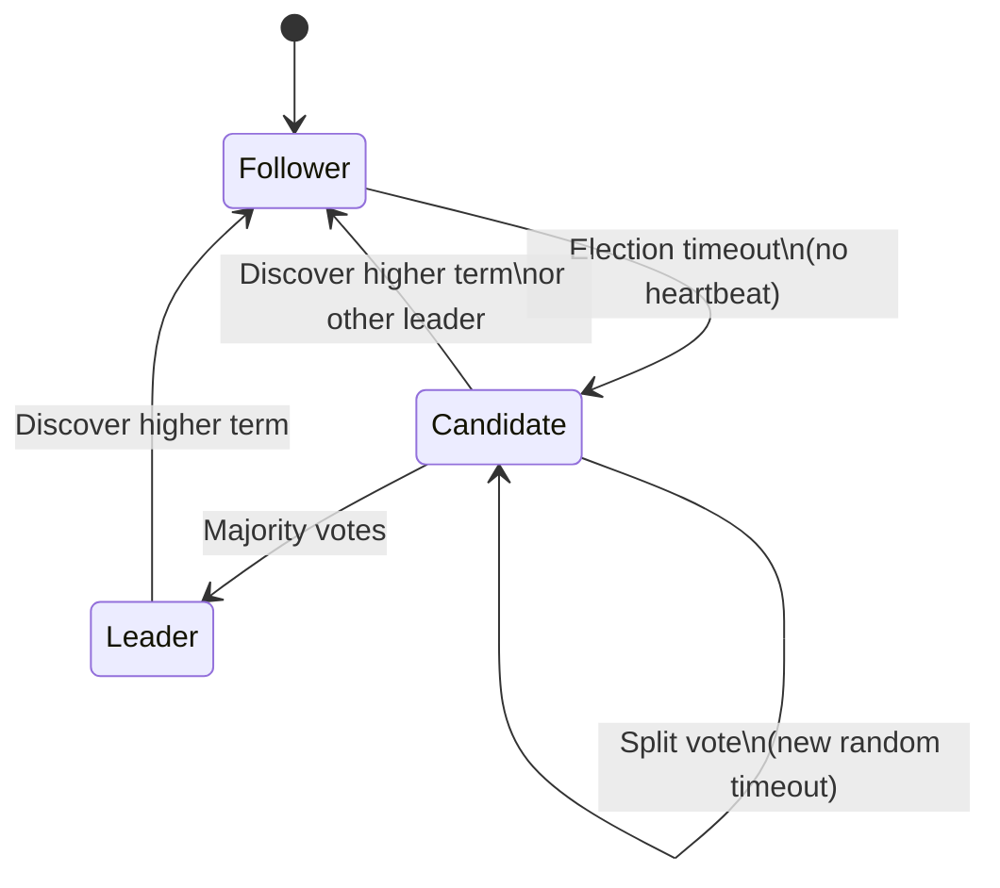
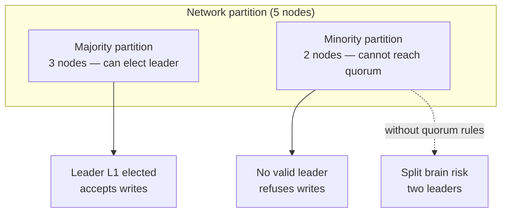
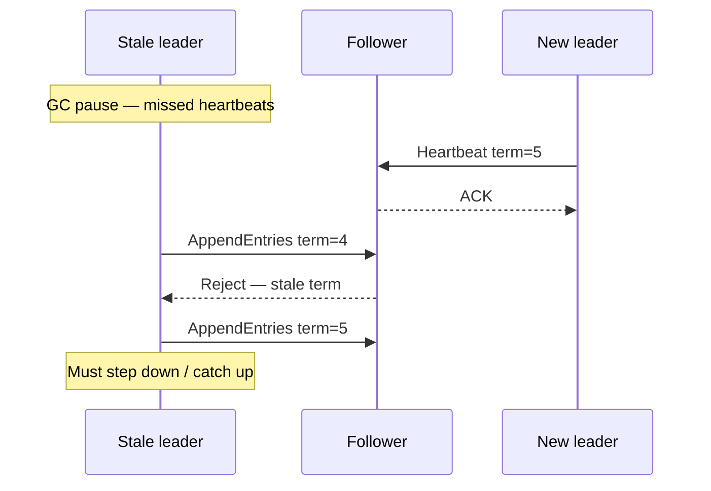

# Leader Election

## 1. Executive Summary

**Leader election** is the problem of choosing exactly one coordinator process among a group of peers, then maintaining that choice until the leader fails or is superseded. In distributed systems, election is rarely an isolated ceremony—it is the **gateway to ordered replication**: the leader serializes client writes, proposes log entries, and drives commit decisions while followers replicate.

Correct leader election must satisfy **safety** (at most one leader per epoch or term with overlapping quorums) and **liveness** (eventually a leader when a majority is connected and stable). Naive approaches—highest ID wins, heartbeats without quorum, or lease-based locks without fencing—produce **split brain** when networks partition or processes pause. Production systems embed election inside consensus protocols (Raft, Zab) or dedicated coordination services (etcd, Consul) that use quorum-backed voting.

This chapter covers election specifications, classic algorithms, failure-detector dependencies, split-brain prevention, and how election connects to the Raft chapter's **election restriction** property.

## 2. Why This Topic Matters

Every strongly consistent replicated system needs a **single writer** at a time—or an equivalent total-order mechanism. Interviewers probe:

- Difference between **leader election** and **consensus** (reducible but not identical operationally).
- Why **two nodes cannot safely elect** with one failure tolerance.
- How **terms, epochs, and fencing tokens** prevent stale leaders from corrupting state.
- What happens to **writes during leader transition**.

Principal architects own **split-brain runbooks**: minority partitions must not serve authoritative writes. Misconfigured election timeouts have caused production data corruption in systems that assumed "the leader is always correct."

## 3. Problems Being Solved

| Problem | Election role |
|---------|---------------|
| **Write serialization** | One leader orders mutations |
| **Log replication** | Leader appends and replicates entries |
| **Failover** | New leader after crash |
| **Configuration changes** | Leader coordinates membership updates |
| **Distributed cron / job ownership** | One executor per task shard |
| **Metadata shard primary** | One writable primary per shard |

Without election (or alternative ordering), replicas diverge and clients observe incompatible histories.

## 4. Assumptions and System Model

| Dimension | Typical assumption |
|-----------|-------------------|
| **Failures** | Crash-stop; Byzantine requires different election |
| **Network** | Partially synchronous for progress; async for safety proofs |
| **Failure detection** | Imperfect: suspect crashes via timeouts (Raft) or dedicated detectors |
| **Membership** | Known static set or reconfiguration protocol |
| **Identity** | Unique server IDs; tie-break rules |
| **Quorum** | Majority of n nodes for vote grant |

**FLP reminder:** Pure async deterministic election with guaranteed termination faces the same barriers as consensus—timeouts and failure detectors are engineering assumptions.

## 5. Essential Terminology

| Term | Definition |
|------|------------|
| **Leader / primary** | Designated coordinator for an epoch |
| **Follower / replica** | Non-leader that replicates leader's log |
| **Candidate** | Process seeking votes in an election |
| **Term / epoch / view** | Monotonic logical period; new leader ⇒ new term |
| **Vote grant** | Quorum member acknowledges candidacy |
| **Split brain** | Two leaders believed simultaneously—safety violation |
| **Fencing** | Reject stale leader's operations via monotonic tokens |
| **Bully algorithm** | Highest-ID live process becomes leader |
| **Ring algorithm** | Election message circulates token |
| **Epoch number** | ZooKeeper zxid epoch component; Raft term analog |
| **Leader lease** | Time-bound authority without per-operation quorum (requires clock/sync care) |
| **Election restriction** | (Raft) Candidate votes only if candidate's log is at least as up-to-date |

## 6. Core Mechanism

### 6.1 Election safety specification

For each term τ:

1. **At most one leader:** No two processes in the same term are both leaders granted by a quorum.
2. **Leader completeness (derived from log):** Committed entries from prior terms appear in new leader's log (Raft-specific formalization).
3. **Liveness:** If majority is reachable and stable, eventually some leader is elected.

### 6.2 Bully algorithm (synchronous flavor)

1. Process P notices leader failure (timeout).
2. P sends **ELECTION** to higher-ID processes.
3. If no higher process responds, P becomes leader and announces **COORDINATOR**.
4. If a higher process responds, it takes over election.

**Limitation:** Requires reliable failure detection and does not handle partitions with quorum discipline—educational, not production metadata store.

**When bully is acceptable:** Small, tightly coupled clusters on a low-latency LAN with symmetric connectivity and no partition risk—rare in cloud deployments. The algorithm assumes that "higher ID wins" correlates with suitability for leadership, which is **not** true for stateful replication where log currency matters.

### 6.2b Ring algorithm

In the ring variant, processes are arranged in a logical ring. When a process detects leader failure:

1. It creates an **ELECTION** message with its ID.
2. The message circulates clockwise; each process appends its ID if greater.
3. When the message returns to the initiator, the highest ID in the list becomes leader.
4. A **COORDINATOR** announcement circulates to inform all processes.

Ring election avoids the O(n²) message burst of naive bully implementations but still lacks **quorum safety** during partitions. A disconnected segment may elect a local "leader" with no overlap to the majority segment.

### 6.3 Quorum-backed election (Raft-style)

1. Follower times out without leader heartbeat → becomes **candidate**, increments **term**.
2. Candidate requests votes from all peers with `(term, lastLogIndex, lastLogTerm)`.
3. Peer grants vote if: has not voted in this term, candidate log is ≥ peer's log (**election restriction**).
4. Candidate with majority votes becomes **leader**, sends heartbeats.



*Figure 1: Raft node states during leader election—followers become candidates on timeout; quorum grants leadership.*

### 6.4 Split-brain prevention



*Figure 2: Majority quorum prevents two simultaneous leaders; minority must not grant itself authority.*

### 6.5 Stale leader and fencing

A paused ex-leader may wake and accept client writes. Mitigations:

- **Term comparison:** Followers reject AppendEntries from old term.
- **Fencing tokens:** Storage rejects writes with stale epoch/token.
- **Lease expiry:** Leader authority bounded in time (clock assumptions).



*Figure 3: Monotonic terms reject stale leader replication attempts.*

## 7. Step-by-Step Walkthrough

### Walkthrough A: Raft election with log comparison

Cluster: S1 (log end: term=2, index=5), S2 (term=3, index=4), S3 (term=2, index=5). S2 times out:

1. S2 → candidate, term=4, requests votes.
2. S1 compares: S2's lastLogTerm=3 > S1's term=2 at end → **grants vote** (election restriction).
3. S3 grants similarly.
4. S2 wins; must replicate any committed entries from prior leaders before accepting new client writes (commit index rules in Raft chapter).

If S1 had higher log, S1 would win or S2 would be denied votes.

### Walkthrough B: Split vote recovery

1. Three candidates simultaneously start term 5.
2. Each gets one vote (including self)—no majority.
3. All revert to follower; **randomized election timeouts** desynchronize retries.
4. Eventually one candidate wins term 5 or 6.

### Walkthrough C: Lease-based election without quorum (anti-pattern)

A team stores `leader=node-A` in Redis with a 30-second TTL, renewed every 10 seconds:

1. Node A holds lease; processes writes.
2. Node A experiences a 45-second GC pause—lease expires.
3. Node B acquires lease; begins writes.
4. Node A resumes, still believes it is leader (has not checked lease).
5. Both write to PostgreSQL without fencing—**split brain at the data layer**.

**Lesson:** Lease renewal requires the holder to verify authority before each critical action, or use quorum-backed election with monotonic terms. If leases are used, pair them with **fencing tokens** checked by the storage layer.

### Walkthrough D: ZooKeeper fast leader election (conceptual)

ZooKeeper's Zab protocol uses epochs (analogous to Raft terms) and a **fast leader election** protocol:

1. Peers exchange `(epoch, zxid)` proposals; higher zxid indicates more recent state.
2. Peers vote for the peer with the highest zxid among reachable nodes.
3. Quorum of votes establishes the leader for the epoch.
4. Leader synchronizes followers before accepting new transactions.

The pattern mirrors Raft's election restriction: **state currency** (zxid / log position) determines eligibility, not merely process liveness or highest numeric ID.

### Walkthrough E: Pre-vote extension (engineering practice)

**Pre-vote** (common in etcd and other Raft implementations) reduces disruption from flaky nodes:

1. Before incrementing term and becoming candidate, a node sends **PreVote** RPCs (without term bump).
2. If it would not win a real election (no quorum support), it does **not** increment term.
3. This prevents a partitioned or lagging node from repeatedly bumping the cluster term and causing unnecessary leader step-downs.

Pre-vote is an **implementation extension** beyond the original Raft paper but widely adopted because it improves liveness without weakening safety.

## 8. Invariants and Guarantees

| Invariant | Type | Statement |
|-----------|------|-----------|
| One vote per term per server | Safety | Prevents duplicate quorum from one node |
| Term monotonicity | Safety | Processes update to higher terms when seen |
| Leader quorum | Safety | Leader elected only with majority grants |
| Election restriction | Safety | Votes only to logs at least as up-to-date |
| Eventual leader (stable majority) | Liveness | Under partial sync + randomization |

## 9. Failure Scenarios

| Failure | Symptom | Mitigation |
|---------|---------|------------|
| **Leader crash** | Write stall until election | Faster detection vs false positives |
| **Partition (minority)** | No leader / read-only | Quorum requirement |
| **Partition (two majorities)** | Impossible with correct n>2f | Misconfigured n or asymmetric routing |
| **Election storm** | Repeated terms, no stability | Increase timeout, fix network |
| **Slow follower** | Cannot win election; catches up later | Log replication, not election bug |
| **Clock skew (lease-based)** | Premature lease expiry or extension | Use consensus terms instead of wall clock where possible |

## 10. Performance Characteristics

| Factor | Effect |
|--------|--------|
| Election timeout | Default ~150–300ms in etcd; trades failover speed vs stability |
| RTT | Vote RPCs across AZs add latency to failover |
| Split votes | Extra election rounds |
| Log catch-up | New leader must replicate before serving (implementation-dependent) |

Failover is typically **seconds**, not milliseconds, for quorum systems—plan client retries and idempotency.

### Quantitative planning (implementation-dependent)

Election duration is roughly:

\[
T_\{\text\{failover\}\} \approx T_\{\text\{detect\}\} + T_\{\text\{vote\}\} + T_\{\text\{catch-up\}\}
\]

where \(T_\{\text\{detect\}\}\) is election timeout (often 1–5× heartbeat interval), \(T_\{\text\{vote\}\}\) is one or more RTT rounds across AZs, and \(T_\{\text\{catch-up\}\}\) depends on unreplicated log size. **Do not cite universal benchmarks**—measure in your environment.

| Cluster size | Election RPC fan-out | Notes |
|--------------|---------------------|-------|
| 3 nodes | 2 votes needed | Common for Kubernetes etcd |
| 5 nodes | 3 votes needed | Higher fault tolerance; slower elections |
| 7 nodes | 4 votes needed | Rare; operational overhead increases |

**Election storms** occur when timeouts are too aggressive relative to network jitter: nodes repeatedly become candidates, increment terms, and prevent stable leadership. Remediation: increase `election-timeout`, fix asymmetric routing, or deploy pre-vote extensions.

## 11. Scalability Limits

- Election fan-out is O(n) per candidate—large clusters elect slowly.
- **Multi-Raft** (shard per range) distributes leaders but multiplies election events.
- Global clusters: prefer **regional leaders** with async cross-region replication rather than one global election domain.

## 12. Operational Considerations

- Tune `election_timeout > heartbeat_interval` (Raft: typically 10×).
- **Randomize** timeouts to avoid perpetual split votes.
- Monitor: `leader_changes`, `election_failures`, term spikes.
- **Maintenance:** Step down leader gracefully before shutdown.
- Document client behavior when `no leader` errors occur.

## 13. Security Considerations

- Authenticate vote RPCs (mTLS).
- Prevent rogue nodes from joining cluster without secure bootstrap/join flow.
- RBAC on coordination API; compromised client cannot force arbitrary elections but could spam proposals.

## 14. Cost Considerations

- Cross-AZ leader election traffic is small but failover drives **replication catch-up** cost.
- Aggressive timeouts increase CPU and RPC churn—real dollar cost at scale.
- Managed etcd vs self-hosted: operational labor vs subscription.

## 15. Production Implementations

| System | Election approach |
|--------|-------------------|
| **etcd / Kubernetes** | Raft integrated election |
| **Consul** | Raft |
| **ZooKeeper** | Fast leader election (Zab) |
| **Kafka** | Controller election (metadata; evolved across versions) |
| **MongoDB replica set** | Raft-like election in modern versions |
| **HBase** | ZooKeeper-backed active master |

Always verify version-specific behavior in official docs.

## 16. Alternatives and Tradeoffs

| Approach | Tradeoff |
|----------|----------|
| **Quorum election (Raft)** | Strong safety; failover latency |
| **Bully / ring** | Simple; weak partition behavior |
| **External lock service** | Coupling; single service dependency |
| **Lease + DB advisory lock** | Clock/fencing risks without tokens |
| **Leaderless Dynamo** | No election; no total order |
| **Manual failover** | Human error; faster in skilled ops |

## 17. Common Misconceptions

| Misconception | Reality |
|---------------|---------|
| "Any node can be leader anytime" | Election restriction ties leadership to log currency |
| "Heartbeat = failure detector proof" | Heuristic; imperfect |
| "Two-node HA cluster" | Cannot tolerate one failure with majority |
| "New leader immediately serves all writes" | May need log sync first |
| "Election solves consensus alone" | Election is one phase; replication completes consensus |

## 18. Principal Architect Perspective

- **Define RTO/RPO** in terms of election + replication, not marketing HA labels.
- **Coordinate with clients:** retries, idempotency, `no leader` handling.
- **Avoid dual-active** across regions without explicit conflict design.
- **Test failover quarterly:** measure actual election duration.

### Decision framework for election mechanisms

| Criterion | Quorum election (Raft/etcd) | Lease + external store | Manual failover |
|-----------|----------------------------|------------------------|-----------------|
| Partition safety | Strong (majority required) | Weak without fencing | Depends on operator |
| Failover automation | Yes | Yes | No |
| Operational complexity | Medium–high | Medium (hidden coupling) | Low initial, high incident cost |
| Suitable scale | Control plane metadata | Low-stakes coordination | Legacy databases |

### Organizational implications

Leader election outages are **coordination outages**, not application bugs—yet application teams experience them as mysterious write failures. Principal architects establish:

1. **Shared on-call runbooks** linking `no leader` client errors to coordination cluster health.
2. **SLO separation:** etcd availability SLO distinct from application API SLO.
3. **Change management:** cluster membership changes require joint consensus procedures, not ad-hoc node removal.
4. **Client library standards:** exponential backoff, leader redirect handling, and idempotency keys for retried writes.

When multiple services embed independent election logic (each using Redis SETNX), the organization accumulates **hidden split-brain risk**. Centralizing on a quorum-backed coordination service with documented client patterns reduces incident surface area.

## 19. Architecture Review Exercise

**Scenario:** Active-passive PostgreSQL with manual failover plus a homegrown "leader flag" in Redis without fencing.

**Findings:** Redis flag is not quorum-backed; split brain writes both databases. Recommend etcd lease + fencing token on storage or managed HA solution.

## 20. Whiteboard Explanation

"Leader election picks one node to coordinate writes for an epoch. We use monotonic terms so stale leaders are ignored. A node becomes candidate when it doesn't hear from a leader, increments the term, and asks for votes. Peers grant at most one vote per term and only if the candidate's log is at least as current—the election restriction. Majority votes win. During partition, only the side with quorum can elect; the other side must not accept writes. That prevents split brain."

## 21. Interview Questions

1. **Why leader election?** — Serialize writes; drive replication.
2. **Define split brain.** — Two leaders serving conflicting writes.
3. **How does quorum prevent split brain?** — Two majorities intersect.
4. **What is election restriction in Raft?** — Vote only if candidate log ≥ voter log.
5. **Bully algorithm steps?** — Higher ID takes precedence.
6. **Why randomize election timeouts?** — Reduce split votes.
7. **Difference term vs index?** — Term is epoch; index is log position.
8. **Stale leader problem?** — Paused leader; terms/fencing fix.
9. **Can minority elect leader?** — No, in correct Raft.
10. **Relation to consensus?** — Election chooses proposer; replication decides entries.
11. **FLP and election?** — Pure async needs extra assumptions for progress.
12. **Two-node cluster safe?** — No for one-failure tolerance with majority.

## 22. Interview Follow-Ups

1. **Design election for 3 AZs with asymmetric partition.** — Quorum math, witness nodes.
2. **Compare lease-based leader vs Raft.** — Clock assumptions.
3. **What if voter grants two candidates same term?** — Bug; breaks safety.
4. **Graceful leadership transfer.** — Raft prevote, controlled step-down.
5. **Observability for election storms.** — Metrics and alerts.

## 23. Strong Answer Example

**Question:** "How do you prevent split brain during leader election?"

**Strong outline:** "Split brain means two nodes both believing they are leader and accepting writes. I prevent it with quorum-backed election: a leader must receive votes from a majority in the same term. During partition, only one side can have majority; the minority cannot elect a valid leader and must reject or error on writes. Monotonic terms ensure a stale leader's messages are ignored after a new term begins. For external resources like databases, I add fencing tokens so even a delayed ex-leader cannot corrupt storage. I tune election timeouts above heartbeat intervals with randomization to avoid vote splits, and I test failover to measure real RTO."

## 24. Weak Answer Example

**Weak:** "We use Redis SETNX for leader election and the highest IP wins."

**Red flags:** No quorum; no fencing; partition unsafe; confuses lock with consensus.

## 25. Hands-On Exercise

1. Run 3-node etcd; identify leader with `etcdctl endpoint status`.
2. Stop leader container; time until new leader.
3. Partition minority node with network rules; verify it cannot become leader.
4. Optional: trigger split vote by simultaneous restarts; observe term increments.

## 26. Knowledge Check

1. What safety property does quorum election enforce?
2. Define election restriction.
3. Why randomize timeouts in Raft?
4. How do terms defeat stale leaders?
5. What is split brain?
6. Bully algorithm limitation in partitions?
7. Minimum cluster size for one failure tolerance?
8. Difference between candidate and leader?
9. What triggers election in Raft followers?
10. Why fencing tokens at storage layer?
11. Relation between leader election and consensus?
12. What is a split vote?

## 27. Flashcards

| Front | Back |
|-------|------|
| Leader election goal | Exactly one coordinator per epoch among peers |
| Split brain | Two leaders accepting conflicting writes |
| Quorum majority | Prevents two disjoint electable majorities when n > 2f |
| Raft term | Monotonic epoch; stale leaders rejected |
| Election restriction | Grant vote only if candidate log is ≥ voter log |
| Candidate state | Seeking votes after election timeout |
| Split vote | No majority; retry with randomized timeout |
| Bully algorithm | Highest-ID live process becomes leader |
| Stale leader | Ex-leader alive but superseded by new term |
| Fencing token | Monotonic value storage checks to reject stale writers |
| Heartbeat | Leader liveness signal to prevent unnecessary elections |
| Minority partition | Cannot elect leader or commit in CP design |

## 28. Cheat Sheet

```
ELECTION SAFETY
  one leader per term + quorum votes
  minority cannot win

RAFT ELECTION
  timeout → candidate → term++
  vote if: not voted this term AND log up-to-date
  majority → leader → heartbeats

SPLIT BRAIN PREVENTION
  quorum + monotonic terms + fencing at resources

TUNING
  election_timeout >> heartbeat
  randomize timeouts

NOT PRODUCTION
  bully/ring without quorum discipline
```

## 29. Related Concepts

- [The Consensus Problem](/docs/consensus/consensus-problem) — agreement foundation
- [Failure Detectors](/docs/distributed-systems-foundations/failure-detectors) — suspicion and ◇P
- [FLP Impossibility](/docs/consensus/flp-impossibility) — async progress limits
- [Raft](/docs/consensus/raft) — full protocol with election restriction
- [Safety and Liveness](/docs/distributed-systems-foundations/safety-and-liveness) — split-brain as safety violation
- [Partial Failure](/docs/distributed-systems-foundations/partial-failure) — partition context

## 30. References

### Primary sources (formal guarantees)

- Ongaro, D., & Ousterhout, J. (2014). *In Search of an Understandable Consensus Algorithm.* USENIX ATC. [Raft leader election]
- Garcia-Molina, H. (1982). *Elections in a Distributed Computing System.* IEEE TC. [Bully and ring algorithms]
- Chandra, T. D., & Toueg, S. (1996). *Unreliable Failure Detectors.* JACM. [Election and consensus with ◇P]

### Implementation-oriented

- etcd tuning guide: https://etcd.io/docs/
- ZooKeeper leader election documentation

### Books

- Kleppmann, M. (2017). *Designing Data-Intensive Applications.* O'Reilly. [Chapter 8 — fault-tolerant replication]

### Distinction

- **Formal guarantees** — Quorum intersection, term monotonicity in Raft spec.
- **Implementation choices** — Timeout values, prevote extensions.
- **Operational experience** — Failover drills; environment-specific.
