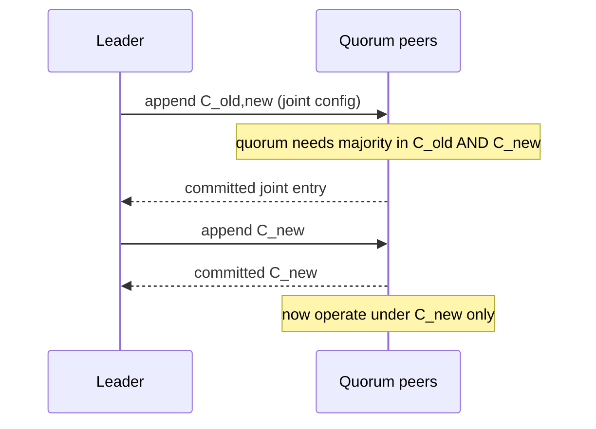
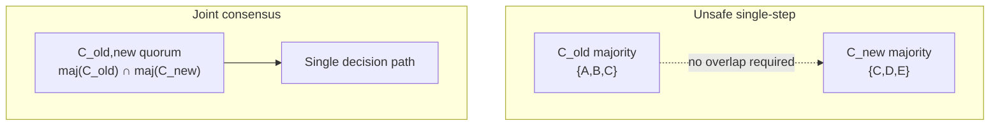
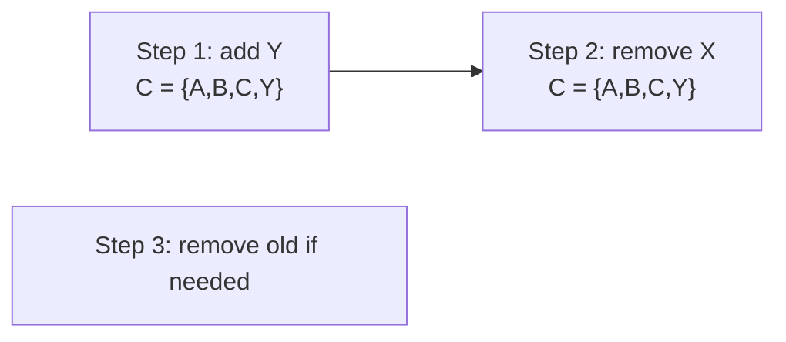

# Membership Changes in Consensus

## 1. Executive Summary

**Membership changes**—adding, removing, or replacing nodes in a consensus cluster—are among the most **error-prone** operations in distributed systems. Naive reconfiguration (switching atomically from configuration **C_old** to **C_new**) can create **two disjoint majorities**, each believing it has quorum, enabling **split-brain** writes and irreversible data corruption. Safe reconfiguration requires **overlapping quorums** during transition so no decision can be made without knowledge spanning both old and new configurations.

**Joint consensus** (Raft §6) is the standard solution: introduce intermediate configuration **C_old,new** where quorums must be majorities in **both** C_old and C_new simultaneously. Only after C_old,new is committed does the cluster adopt C_new alone. Alternatives include **single-server changes** (Raft optimization), **Lamport's reconfiguration Paxos**, and operational patterns (replace-in-place, blue/green clusters). **Safety** preserves all prior committed entries; **liveness** may stall during misconfigured transitions.

This chapter covers joint consensus mechanics, Raft and Paxos reconfiguration, operational runbooks, failure scenarios, and principal-level architecture review for production cluster changes.

## 2. Why This Topic Matters

Production incidents from bad membership changes include:

- **Accidental quorum loss** (remove two of five nodes simultaneously).
- **Split brain** during concurrent config updates.
- **Stuck clusters** unable to elect leader after partial reconfiguration.
- **Automation bugs** that apply new peer lists without joint phase.

Principal architects must own **reconfiguration runbooks**, **automation safety**, and **rollback limits** (often none without overlap). Interviewers test whether you know **why joint consensus exists**, not merely that "Raft supports membership changes."

### Compliance and change management

Membership changes are **high-risk changes** in regulated environments. Change advisory boards should require: quorum health proof before/after, named rollback owner (often "forward fix only"), and staged execution in non-production with chaos injection (simulate slow catch-up). Treat peer list edits with the same rigor as database schema migrations affecting primary keys.

## 3. Problems Being Solved

| Problem | Mechanism |
|---------|-----------|
| **Add replica** | Joint consensus then expand quorum |
| **Remove replica** | Joint consensus; avoid dropping below tolerance |
| **Replace failed node** | Add new + remove old (often one-step add) |
| **Prevent dual majorities** | Overlapping quorum requirement |
| **Preserve committed log** | Reconfiguration as log entry |
| **Rolling upgrades** | Version skew tolerance per implementation |

## 4. Assumptions and System Model

| Assumption | Treatment |
|------------|-----------|
| **Crash-stop** | Standard consensus model |
| **Static config between changes** | Changes are rare, controlled events |
| **Administrative control** | Human or automation initiates change |
| **Majority quorums in each config** | C_old and C_new each satisfy n > 2f |
| **Reconfiguration is serialized** | One membership change at a time (typically) |

**Byzantine membership** requires different protocols; this chapter focuses on crash-stop Raft/Paxos family.

## 5. Essential Terminology

| Term | Definition |
|------|------------|
| **Configuration / membership** | Set of voting servers and their identities |
| **C_old** | Current configuration before change |
| **C_new** | Target configuration after change |
| **C_old,new** | Joint configuration requiring quorums in both |
| **Joint consensus** | Overlapping quorum reconfiguration protocol |
| **Reconfiguration entry** | Log command encoding membership change |
| **Cold standby** | Node not in quorum until added |
| **Quorum intersection** | Property enabling safety within one config |
| **Overlap quorum** | Votes needed from both configs during joint phase |
| **Single-server change** | Raft optimization adding/removing one peer at a time |
| **Replace member** | Remove old ID, add new ID (two steps or joint) |
| **Configuration index** | Log position where config takes effect |

Membership changes interact with **horizontal scaling**: adding read replicas (observers in ZK, learners in some Raft stacks) differs from adding **voters**—only voters change quorum math and fault tolerance. Principal reviews should label each proposed node as voter or non-voter before approving capacity requests.

Document the **minimum quorum size** after each planned change in the change ticket; if the math shows zero fault tolerance during migration, schedule the change in a maintenance window with write traffic throttled.

## 6. Core Mechanism

### 6.1 The dual-majority trap

Cluster \{A, B, C, D, E\}. Remove D, E in one step → C_new = \{A, B, C\}.

If transition is instantaneous:
- Partition could leave \{A, B\} thinking old majority of 3 (false—only 2 of 3).
- Meanwhile \{D, E\} might still accept writes under old config.

Even subtle timing bugs cause **two leaders** or **lost commits**.

### 6.2 Joint consensus (Raft)

1. Leader receives reconfiguration proposal (e.g., add F).
2. Leader appends entry with **joint config** C_old,new = (C_old ∪ C_new) with special quorum rule: **majority of C_old AND majority of C_new**.
3. After entry committed, cluster operates under joint rules.
4. Leader appends **C_new** alone.
5. After C_new committed, C_old discarded.



*Figure 1: Raft joint consensus—two-phase config change via overlapping quorums.*

### 6.3 Overlap argument

**Theorem sketch:** Any quorum Q under C_old,new intersects any quorum Q_old of C_old and any quorum Q_new of C_new (under majority definitions with careful counting). Therefore no decision made under C_old alone after joint entry commits without also satisfying C_new constraints—preventing independent C_old and C_new majorities from diverging.



*Figure 2: Joint consensus forces decisions through overlapping majorities.*

### 6.4 Single-server changes (Raft optimization)

If membership changes **one server at a time** (add one node, or remove one node), Raft paper proves simpler rules suffice because C_old and C_new differ by one server—overlap is guaranteed between any majority of C_old and majority of C_new.

**Operational pattern:** To replace dead node X with Y: **add Y**, then **remove X**—two single-server steps.



*Figure 3: Replace-by-add-then-remove avoids dual-majority without full joint in many cases.*

### 6.5 Paxos reconfiguration

Lamport describes reconfiguration via **ballot** and **configuration change** as a special value decided through Paxos, with constraints ensuring acceptors track current config. Conceptually same problem: **never two independent majorities**.

## 7. Step-by-Step Walkthrough

### Walkthrough A: Add one follower (Raft single-server)

C_old = \{1,2,3\}. Add server 4.

1. Leader proposes C_new = \{1,2,3,4\} as joint or single-server per implementation.
2. Replicate and commit config entry.
3. Server 4 catches up; participates in quorum.

### Walkthrough B: Remove one follower

C_old = \{1,2,3,4\}. Remove 4 safely:

1. Ensure 4 is not sole holder of data (catch-up others).
2. Joint or single-server remove to C_new = \{1,2,3\}.
3. Server 4 shut down after commit.

### Walkthrough C: Unsafe simultaneous remove (anti-pattern)

Five nodes \{1..5\}. Operator removes 3 and 4 at once without joint:

1. Risk: only \{1,2\} left might incorrectly proceed or cluster loses quorum permanently.
2. **Never do this** without automated joint protocol.

### Walkthrough D: etcd member replace

1. `etcdctl member add` new peer.
2. Start new member with correct `--initial-cluster-state=existing`.
3. `member remove` old ID after sync.
4. Verify `etcdctl endpoint health`.

### Walkthrough E: Stuck in joint config

1. Joint entry committed; C_new proposal lost when leader dies.
2. New leader must complete C_new transition.
3. Automation must handle **finish reconfiguration** path.

### Walkthrough F: Kubernetes etcd member replace (conceptual)

1. `etcdctl member list` — note member ID of failed node.
2. `etcdctl member add new-node --peer-urls=https://10.0.0.5:2380` — outputs `ETCD_INITIAL_CLUSTER` env for new member.
3. Start `etcd` on new-node with `initial-cluster-state=existing` (not `new`).
4. Wait until `etcdctl endpoint status` shows comparable `RAFT INDEX` on new member.
5. `etcdctl member remove <old-id>`.
6. Update load balancer / API server `--etcd-servers` list.

Skipping step 2 API call and only editing static config strands the new node—classic production footgun.

### Walkthrough G: Counting overlap for interview proof

C_old has 5 nodes; C_new has 3 nodes. Joint quorum needs ≥3 from C_old AND ≥2 from C_new. Any set of 3 from \{1..5\} that also contains 2 of \{1,2,3\} must include at least one node from \{1,2,3\} that was in the old majority—sketch this on a whiteboard when asked to **prove** joint consensus prevents dual majorities without hand-waving.

### Walkthrough H: When blue/green beats joint

If downtime window allows, stand up a fresh 3-node cluster C_green, migrate data via snapshot restore or application-level backfill, switch clients, decommission C_blue. You avoid joint consensus complexity entirely at the cost of **migration engineering** and **double infrastructure** temporarily. Principal architects choose blue/green when data size or team risk tolerance favors clean cutover over in-place surgery.

## 8. Invariants and Guarantees

### 8.1 Safety

Committed log entries before reconfiguration remain committed after, if protocol followed.

### 8.2 No dual active majorities

Joint phase prevents independent decisions in C_old and C_new.

### 8.3 Configuration monotonicity

Servers apply config changes in log order at defined indices.

### 8.4 Liveness

Misconfigured membership can **permanently lose quorum**—operational, not algorithmic fix.

### 8.5 Configuration as first-class replicated state

Treating membership as ordinary log entries means reconfiguration benefits from the same durability guarantees as application data—a committed joint config survives leader crash the same way a committed `PUT` survives. Operators sometimes forget this and attempt "out of band" peer list edits that fight the log. **The log wins**; always reconcile desired state through consensus APIs.

| Property | Type |
|----------|------|
| Committed entry preservation | Safety |
| No split brain across configs | Safety |
| Complete reconfiguration | Liveness (if majority exists) |

## 9. Failure Scenarios

| Failure | Behavior |
|---------|----------|
| **Remove too many nodes** | Quorum loss; manual recovery |
| **Leader dies mid-joint** | New leader completes transition |
| **New node wrong cluster ID** | Isolated; fails to join |
| **Concurrent reconfig proposals** | Leader serializes; one at a time |
| **Partition during joint** | Need quorum satisfying joint rule |
| **Bootstrap new cluster with wrong peers** | Split cluster formation |

## 10. Performance Characteristics

| Aspect | Behavior |
|--------|----------|
| **Reconfiguration duration** | Log replication + catch-up |
| **Joint phase overhead** | Stricter quorum → higher write latency |
| **Catch-up time** | Proportional to log/snapshot size |
| **Frequency** | Rare; amortized cost low |
| **Client impact** | Writes may stall during joint quorum |
| **Snapshot transfer** | Bandwidth-bound for large state |

During joint consensus, some implementations require acknowledgments from servers in **both** old and new configurations, effectively increasing the number of required ACKs. Plan maintenance windows accordingly—"add one node" is not zero-downtime if the joint phase coincides with peak traffic unless you throttle client writes or shift traffic temporarily.

## 11. Scalability Limits

- Reconfiguration not designed for frequent churn.
- Large membership increases quorum RTT.
- Each add/remove may need snapshot transfer.

## 12. Operational Considerations

- **Always read implementation docs** (etcd, Consul, Kafka KRaft differ).
- **One change at a time** unless automation proves joint handling.
- **Verify quorum** before and after (`member list`, health endpoints).
- **Never force-remove** majority of nodes.
- **Backup** before membership surgery.
- **initial-cluster** vs **existing** bootstrap flags—common footgun.

### etcd checklist

1. Check cluster health and leader.
2. Add new member via API (not config file alone).
3. Start new process with generated env.
4. Wait catch-up (`isLearner` false, raft index aligned).
5. Remove old member if replacing.
6. Verify all endpoints.

### Rollback reality

Once C_new committed, **rollback to C_old** requires another forward reconfiguration—you cannot silently revert. Disaster recovery drills should practice **rebuilding a lost quorum** from snapshot + retained WAL on surviving nodes rather than assuming peer list edits alone resurrect the cluster. Bootstrap flags (`--initial-cluster` vs `--initial-cluster-state=existing` in etcd) exist precisely because first-time formation and membership change are different safety domains—conflating them causes split clusters on day one.

### Learner and non-voting members

Some systems distinguish **voting** members (count toward quorum) from **learners** (catch up without vote). Adding a learner before promoting to voter is a common pattern: let the node sync without affecting quorum math, then run a single-server promotion through joint or optimized path. This reduces risk during cross-region replica add when catch-up may take minutes.

### Automation guardrails (principal checklist)

| Guardrail | Rationale |
|-----------|-----------|
| Pre-flight quorum count | Ensure n - removals ≥ ⌊n/2⌋ + 1 |
| One mutation per workflow | Avoid parallel add/remove |
| Idempotent member IDs | Re-running add must not duplicate |
| Wait for `healthy` before remove | Old node still serving confuses clients |
| Alert on joint config stuck | Incomplete C_new blocks clean state |
| Integration test on 3-node docker | Catch script bugs before prod |

## 13. Security Considerations

- Reconfiguration APIs are **high privilege**—mTLS + RBAC.
- Compromised admin can remove quorum nodes (availability attack).
- Validate peer identities when adding members.
- Audit logs for membership API calls.

## 14. Cost Considerations

- Temporary over-provisioning during add-before-remove replacement.
- Joint phase latency may affect SLAs during maintenance windows.
- Engineering time for safe automation exceeds naive scripts.

## 15. Production Implementations

| System | Approach |
|--------|----------|
| **etcd / Raft** | Joint consensus; `member add/remove` API |
| **Consul** | Raft reconfiguration via server join/leave |
| **Apache Kafka KRaft** | Quorum reconfiguration (implementation-specific) |
| **ZooKeeper** | Dynamic reconfiguration (limited; restart-heavy history) |

## 16. Alternatives and Tradeoffs

| Alternative | When |
|-------------|------|
| **Blue/green cluster** | New cluster + migrate data; avoid in-place reconfig |
| **Single-server Raft steps** | Simpler when changing one peer |
| **Static membership** | Never change; replace whole cluster |
| **Managed service** | Cloud handles membership |

Joint consensus when **in-place** membership change required.

## 17. Common Misconceptions

| Misconception | Reality |
|---------------|---------|
| "Edit config file and restart" | Unsafe without going through consensus log |
| "Remove failed node instantly" | May drop below quorum tolerance |
| "Joint consensus is optional" | Required for arbitrary multi-node changes |
| "New node joins on boot automatically" | Must be added through consensus first |
| "Even number clusters OK" | Prefer odd; even complicates majorities |

## 18. Principal Architect Perspective

- **Automate with guardrails:** max one removal per operation; pre-flight quorum math.
- **Runbooks in human time** before automating.
- **Game days** for member replace under load.
- **Document bootstrap** for disaster rebuild vs membership change.
- **Align K8s etcd** operations with etcdctl—not kubectl alone.

## 19. Architecture Review Exercise

**Scenario:** CI pipeline removes failed Kubernetes control-plane etcd member and adds replacement in one Terraform apply without joint consensus sequencing.

**Risk:** Split brain or quorum loss during rolling apply.

**Fix:** Serialize add → verify catch-up → remove; use etcd APIs; integration test on staging. **Reject** parallel member mutations.

**Terraform-specific guidance:** Model member add and remove as separate `apply` stages with explicit `depends_on` health checks, or use a dedicated operator (etcdadm, cluster-api bootstrap providers) that encodes safe sequencing. Infrastructure-as-code speed must not bypass consensus safety—the state file records desired peers, but **etcd's Raft log** is the authority on actual membership.

## 20. Whiteboard Explanation

"Changing consensus membership is dangerous because old and new quorums might not overlap, letting two different majorities commit conflicting decisions. Joint consensus fixes this by first committing a joint configuration where a quorum must include majorities of both old and new sets—forcing overlap. After that entry commits, we commit the new configuration alone. Raft also allows one-server-at-a-time changes because any two majorities in configs differing by one node must intersect. Reconfiguration is stored as log entries applied in order, same as application commands."

**Mnemonic:** "Joint before alone"—C_old,new before C_new. Write it on the whiteboard header so you do not forget mid-derivation under interview pressure.

## 21. Interview Questions

1. **Why is membership change hard?** — Dual majority risk.
2. **What is joint consensus?** — Quorum in C_old AND C_new.
3. **Raft single-server change rule?** — One peer diff simplifies overlap.
4. **Replace failed node safely?** — Add new, remove old (two steps).
5. **What happens if you lose quorum?** — Cluster unavailable; manual intervention.
6. **Is reconfiguration a log entry?** — Yes, replicated like commands.
7. **Can two reconfigs run in parallel?** — Must serialize.
8. **etcd add member workflow?** — API add → start peer → verify → remove old.
9. **Rollback after C_new?** — Forward config change only.
10. **Joint phase performance impact?** — Stricter quorum, higher latency.
11. **Why odd cluster sizes?** — Clear majorities; fault tolerance math.
12. **Compare to blue/green cluster.** — Avoid in-place overlap problem entirely.

## 22. Interview Follow-Ups

1. **Prove overlap for joint majority.** — Counting argument on |C_old| and |C_new|.
2. **Leader dies after joint commit, before C_new.** — Successor completes C_new entry.
3. **Adding two nodes at once safe?** — Needs joint; not two single-server adds in parallel without care.
4. **Kafka vs etcd reconfiguration.** — Implementation-specific; same principles.
5. **Bootstrap vs reconfiguration.** — Initial cluster formation separate rules.

## 23. Strong Answer Example

**Question:** "Why can't we atomically switch a five-node Raft cluster to three nodes by editing the peer list?"

**Strong outline:** "If we instantaneously switch from five to three nodes, there can be a moment where two different subsets each believe they have a majority under different configurations. For example, removing two nodes without overlap enforcement might leave a partition of old members still accepting writes while a new trio also elects a leader. Joint consensus prevents this by first committing an intermediate configuration where any decision requires a majority of the old five and a majority of the new three simultaneously—that intersection guarantees any committed entry is known to both worlds. Only then do we commit the three-node configuration alone."

## 24. Weak Answer Example

**Weak:** "You update the config and restart nodes. Raft handles membership automatically."

**Red flags:** No dual-majority problem; no joint consensus; ignores log-ordered reconfiguration.

## 25. Hands-On Exercise

1. Lab: 3-node etcd/docker Raft cluster.
2. Add fourth member; observe joint/single-server in logs.
3. Safe remove; verify quorum.
4. Attempt unsafe double-remove in sandbox; document failure mode.
5. Write runbook with pre/post checks.

## 26. Knowledge Check

1. Define C_old,new.
2. Dual-majority risk in one sentence?
3. Raft single-server change benefit?
4. Order of joint then C_new?
5. Replace node two-step pattern?
6. Is membership change reversible trivially?
7. What if quorum lost mid-change?
8. etcd member add before start?
9. Why serialize reconfigurations?
10. Joint quorum rule?
11. Relation to split brain?
12. Blue/green alternative tradeoff?

## 27. Flashcards

| Front | Back |
|-------|------|
| Joint consensus | Quorum must be majority in C_old AND C_new |
| C_old,new | Intermediate joint configuration |
| Dual-majority trap | Disjoint majorities under old and new configs |
| Single-server change | Raft: one peer diff guarantees overlap |
| Reconfiguration entry | Membership change in replicated log |
| Safe node replace | Add new member, then remove old |
| Quorum loss | Too many removals → cluster unavailable |
| etcd member add | API first, then start new process |
| Rollback | Forward reconfig only; not silent revert |
| Overlap argument | Joint quorums intersect old and new decisions |
| Split brain link | Bad membership change can enable dual leaders |
| Blue/green cluster | New ensemble; migrate; avoid in-place joint |

## 28. Cheat Sheet

```
MEMBERSHIP CHANGE RISK
  instant C_old → C_new can create two majorities

JOINT CONSENSUS (Raft)
  1. commit C_old,new (quorum in BOTH)
  2. commit C_new alone

SINGLE-SERVER (Raft)
  change one peer at a time
  replace: ADD new → REMOVE old

OPS
  never remove majority at once
  verify health after each step
  reconfig = log entry (implementation API)

FAILURE: quorum loss → manual recovery (no magic)
```

## 29. Related Concepts

- [Raft Consensus](/docs/consensus/raft) — prerequisite; §6 joint consensus
- [Quorum Systems](/docs/consistency/quorum-systems) — intersection theory
- [The Consensus Problem](/docs/consensus/consensus-problem) — specification
- [Leader Election](/docs/consensus/leader-election) — during reconfig
- [Partial Failure](/docs/distributed-systems-foundations/partial-failure) — operational context
- [Reliability and Resilience](/docs/reliability-and-resilience/overview) — runbooks

## 30. References

### Primary sources (formal guarantees)

- Ongaro & Ousterhout (2014). *Raft.* USENIX ATC. [Section 6: Cluster membership changes]
- Lamport, L. *Paxos reconfiguration* discussions in Part-Time Parliament and later notes [Paxos config change]

### Implementation-oriented

- etcd cluster reconfiguration: https://etcd.io/docs/latest/op-guide/runtime-configuration/
- Consul server join/leave documentation
- Kafka KRaft quorum reconfiguration docs (version-specific)

### Books

- Kleppmann, M. (2017). *Designing Data-Intensive Applications.* [Membership change overview]

### Distinction

- **Formal guarantees** — Raft joint consensus safety argument.
- **Implementation choices** — etcd member API, single-server optimization.
- **Operational experience** — Quorum loss postmortems; verify procedures per product.
