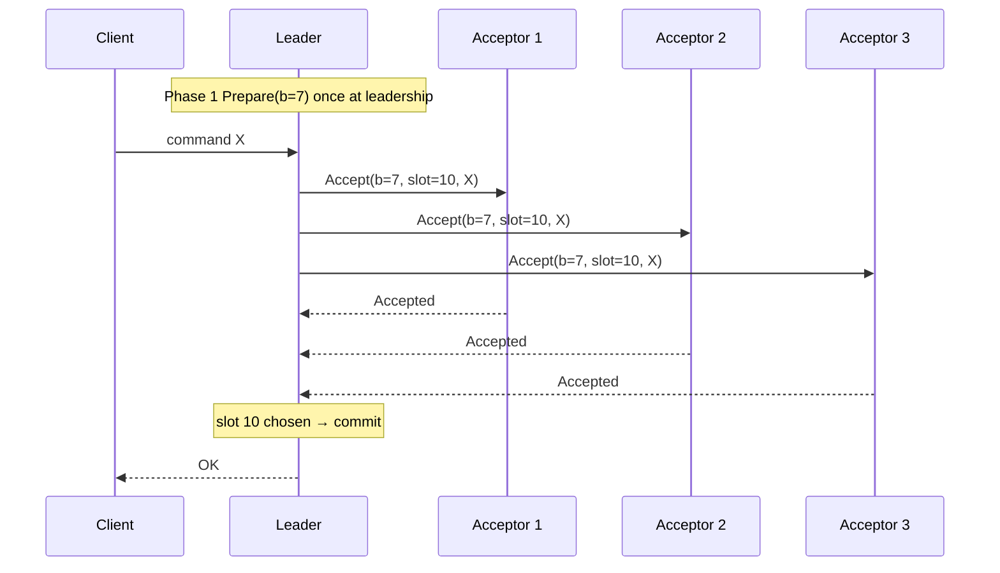
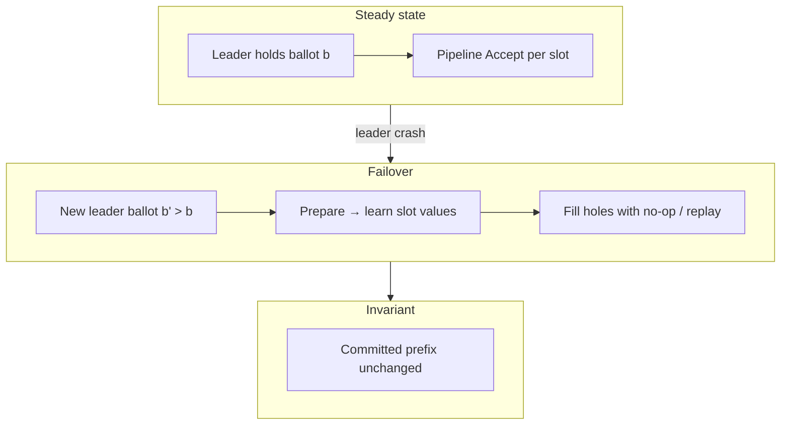
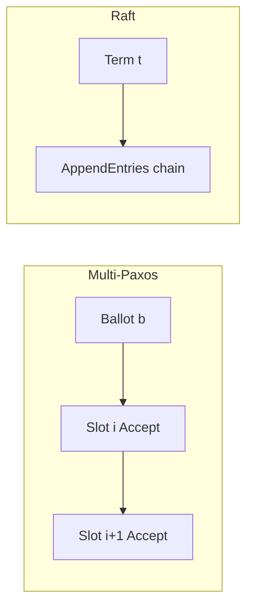

# Multi-Paxos

## 1. Executive Summary

**Multi-Paxos** extends Basic Paxos from deciding a **single value** to maintaining a **replicated log** of indefinitely many commands— the standard pattern for **state-machine replication**. The key optimization is a **stable leader** (distinguished proposer) that executes **Phase 1 (Prepare)** once per leadership epoch, then **pipelines Phase 2 (Accept)** for each log slot without repeating Prepare. Each slot index is an independent Paxos instance sharing the same acceptor set and ballot number.

Multi-Paxos provides the same safety properties as running Basic Paxos per slot: **agreement** on each log entry, **validity** of commands, and **integrity** of the log prefix. **Log matching** emerges from ballot ordering and acceptor rejection of stale leaders. Production systems (Chubby, Spanner, early ZooKeeper discussions) use Multi-Paxos or close variants; Raft can be viewed as a **re-engineered Multi-Paxos** with explicit leader election and log consistency checks.

This chapter covers leader-based operation, slot numbering, catch-up, failure recovery, comparison to Raft, and principal-level reasoning about when Multi-Paxos remains the right abstraction.

## 2. Why This Topic Matters

Multi-Paxos is the **production form** of Paxos—not the single-value classroom protocol. Architects operating Paxos-backed systems must understand:

- Why **one Prepare per term** suffices when the leader is stable.
- How **holes** in the log are filled and why **no-op** commands appear.
- Relationship between **ballot numbers** and **log positions**.
- Why Chubby/Spanner documentation references Paxos groups, not Basic Paxos.

Interviewers testing principal depth ask you to **derive Multi-Paxos from Basic Paxos**, compare to Raft's AppendEntries, and explain **leader crash recovery** without losing committed entries.

## 3. Problems Being Solved

| Problem | Multi-Paxos mechanism |
|---------|----------------------|
| **Replicated command log** | One Paxos instance per log index |
| **High throughput** | Pipeline Accepts; skip Prepare after leadership |
| **Leader failure** | Higher ballot leader re-runs Prepare, fills gaps |
| **Log consistency** | Ballot + slot acceptance; reject stale leaders |
| **State-machine replication** | Apply log in order after commit |
| **Catch-up** | New leader copies missing entries from acceptors |

## 4. Assumptions and System Model

| Assumption | Multi-Paxos treatment |
|------------|----------------------|
| **Crash-stop** | Same as Basic Paxos |
| **Stable leader periods** | Amortizes Phase 1 cost |
| **Unique ballot per leader epoch** | Monotonic across failovers |
| **Deterministic state machines** | Commands applied in log order |
| **Majority quorums** | Per-slot decisions |
| **Static or carefully changed membership** | See membership-changes chapter |

**Partial synchrony** assumed for liveness via leader election timeouts or external coordinator.

## 5. Essential Terminology

| Term | Definition |
|------|------------|
| **Slot / index** | Position in replicated log; separate Paxos instance |
| **Leader** | Distinguished proposer holding current highest ballot |
| **Follower** | Acceptor + learner applying leader's log |
| **Ballot / view** | Leadership epoch identifier for all slots in term |
| **No-op** | Empty command to fill gaps and advance commit |
| **In-flight Accept** | Phase 2 for slot not yet chosen |
| **Chosen slot** | Majority accepted value at index i |
| **Commit index** | Highest slot known chosen and safe to apply |
| **Log hole** | Unchosen slot below higher chosen slot |
| **Prepare once** | Leader optimization: Phase 1 only on takeover |
| **Pipeline** | Multiple Accepts outstanding before prior slots chosen |

## 6. Core Mechanism

### 6.1 Leadership acquisition

1. Node proposes itself as leader with ballot `b` (higher than any known).
2. **Prepare(b)** to majority acceptors for **all slots** (or implicit global promise).
3. Acceptors promise; return per-slot `(accepted_ballot, accepted_value)` metadata.
4. Leader learns highest accepted value per slot; fills gaps with no-ops or client commands.
5. Leader is **active** until higher ballot observed.

### 6.2 Normal replication

For each new client command at index `i`:

1. Leader sends **Accept(b, command)** for slot `i` (Phase 2 only).
2. Acceptors accept if `b >= promised_ballot`.
3. Majority → slot `i` chosen; leader advances commit index.
4. Leader notifies replicas to apply through commit index.



*Figure 1: Multi-Paxos steady state—Phase 2 Accept per slot after single Prepare.*

### 6.3 Leader failover

1. New leader with ballot `b' > b` runs Prepare.
2. For each slot, adoption rule picks value from acceptor responses.
3. Leader issues Accept for unchosen slots (may be no-ops).
4. Leader resumes client commands at next free index.



*Figure 2: Failover re-runs Prepare once, then restores log prefix safety.*

### 6.4 No-ops and holes

If slots 5–7 unchosen but slot 8 chosen (unusual without bugs), leader must **fill** lower slots before committing higher client commands. **No-op** commands advance the log without state change—an implementation technique preserving contiguous commit prefix.

### 6.5 Comparison to Raft log replication

| Aspect | Multi-Paxos | Raft |
|--------|-------------|------|
| Epoch | Ballot | Term |
| Consistency check | Per-slot accept + ballot | prevLogIndex/prevLogTerm |
| Leader change | Prepare all slots | Election + AppendEntries |
| Commit rule | Majority per slot | Majority + current-term rule |



*Figure 3: Both amortize leadership epoch; differ in log conflict handling.*

## 7. Step-by-Step Walkthrough

### Walkthrough A: Steady-state replication

Leader L ballot 5, next slot 20. Client sends `PUT`.

1. L Accept(5, slot=20, PUT) to majority.
2. Majority accepts → slot 20 chosen.
3. L applies slots ≤20 to state machine; responds OK.

### Walkthrough B: Leader crash mid-pipeline

1. L accepted slots 10–12 on majority; crashes before 13.
2. Slots 10–12 chosen; 13 not.
3. New leader L' ballot 6: Prepare learns 10–12 values.
4. L' Accept(6, slot=13, ...) for new commands.

### Walkthrough C: Competing leaders

1. L ballot 5 partially Accept slot 8.
2. L' ballot 6 Prepare → majority promises.
3. L's Accept(5, slot=8) rejected.
4. L' completes slot 8 with adopted value.

### Walkthrough D: Slow follower catch-up

Follower missed slots 15–18. Leader (or new leader) sends Accept or dedicated catch-up RPCs until follower matches commit index.

### Walkthrough E: No-op after election

New leader finds no client commands pending; issues no-op at next index to confirm leadership and advance commit (Chubby pattern).

### Walkthrough F: Amortizing Prepare across 10,000 slots

Leader L holds ballot 12 for 30 minutes, accepting slots 1–10,000 with only the initial Prepare(12). Throughput approaches one RTT per slot (plus fsync batching). Leader crashes; L' runs Prepare(13), learns accepted values for slots 9900–10000 in flight, completes them, resumes at 10001. **Failover cost** is O(conflict window), not O(entire log)—why stable leadership matters economically, not just for liveness.

### Walkthrough G: Multi-Paxos vs application batching

Application batches 100 user keys into one state-machine command at slot k. Multi-Paxos still runs one Paxos instance for slot k—the batching is **semantic**, not protocol-level. Contrast with running 100 separate Basic Paxos instances each with Prepare+Accept: 200 phases vs 1 Prepare + 100 Accepts. Interviewers may conflate these; clarify whether batching is at **consensus slot** or **application command** layer.

### Walkthrough H: Empty slot no-op after partition

After partition heals, new leader finds slot 7 unchosen but clients already received responses for slots 1–6. Leader issues no-op at slot 7 to **seal** the prefix before slot 8 client traffic. Clients never see the no-op; state machine applies it as identity operation. Skipping no-ops and jumping to slot 8 can leave ambiguity about whether slot 7 was lost or merely delayed—no-ops document leadership completeness.

## 8. Invariants and Guarantees

### 8.1 Per-slot safety

Each slot is independent Basic Paxos → **at most one value chosen per index**.

### 8.2 Log prefix consistency

If slot `i` chosen with value `v`, any future leader's Prepare at majority intersects acceptors that adopted `v` for slot `i` → **same value re-chosen**.

### 8.3 State-machine safety

Replicas apply chosen slots in order → **deterministic replicated state** if commands deterministic.

### 8.4 Liveness

With stable leader and majority available, slots eventually chosen. Leader election required after crash.

### 8.5 Mapping Multi-Paxos safety to state-machine replication

State-machine replication requires **total order** and **agreement** on each command. Multi-Paxos provides total order by slot index monotonicity and agreement by per-slot Paxos. **Validity** requires that only client-proposed commands appear—leaders must not invent arbitrary payloads except no-ops used for protocol progress. Application architects still must ensure commands are **deterministic**: consensus orders them identically, but divergent application code on different replicas still produces divergent state—a class of bugs consensus cannot fix.

| Property | Type |
|----------|------|
| Per-slot agreement | Safety |
| Prefix consistency | Safety |
| State-machine safety | Safety |
| Slot completion | Liveness (partial sync) |

## 9. Failure Scenarios

| Failure | Behavior |
|---------|----------|
| **Leader crash** | New leader with higher ballot; Prepare + fill |
| **Acceptor crash** | Majority continues |
| **Network partition** | Majority side progresses |
| **Stale leader writes** | Rejected by acceptors |
| **Duplicate Accept** | Idempotent at acceptors |
| **Disk loss on acceptor** | May break safety if rejoins—must not |
| **Unbounded log** | Snapshot/compaction required |
| **Leader flapping** | Repeated Prepare storms; tune election; use pre-vote patterns where available |
| **Clock skew on ballot** | Use logical (epoch, id) tuples—not wall clock |
| **Hot key on single group** | Shard into multiple Paxos groups |

### Deep dive: acceptor disk loss

If an acceptor loses disk and rejoins with empty state, it may accept stale Accept messages unless `promised_ballot` is restored or the node is permanently removed from config. **Never** wipe acceptor data directories without removing the member through reconfiguration. This failure mode has caused real incidents in homelab-to-production migrations where operators cloned VM images with duplicate acceptor identities.

## 10. Performance Characteristics

| Aspect | Behavior |
|--------|----------|
| **Steady-state latency** | ~1 RTT per slot (Accept only) |
| **Failover cost** | One Prepare + hole filling |
| **Throughput** | Pipelining hides latency |
| **Disk** | fsync per accepted slot (batching helps) |
| **Leader bottleneck** | Same as Raft |

## 11. Scalability Limits

- Single leader per Paxos group.
- Horizontal scale via **many Paxos groups** (sharding).
- Log growth requires compaction.
- WAN quorums: latency bound on commit.

## 12. Operational Considerations

- **Leader stickiness:** Avoid unnecessary elections (Chubby master lease).
- **Ballot persistence:** Survive restarts without reusing ballots.
- **Monitoring:** Slots chosen/sec, Prepare rate (failover indicator).
- **Compaction:** Snapshot applied state; truncate old slots.
- **Read path:** Leader reads or lease-based linearizable reads.

### Distinguished proposer discipline

Only one node should actively propose per ballot. Violations cause contention, not safety bugs—but liveness suffers.

### Batch commit

Group multiple slots in one Accept round where protocol variant allows (careful with formal guarantees). Batching amortizes disk fsync and network overhead but increases the blast radius of a partial failure: if a batched Accept message is lost, all slots in the batch may need retry. Leaders should size batches to target latency SLOs—often 1–10 ms windows for metadata stores, larger for throughput-oriented logs.

### Catch-up and snapshot integration

When a follower rejoins after a long absence, replaying every Accept from slot 1 is impractical. Multi-Paxos deployments pair the log with **periodic snapshots** of the state machine at slot S. The lagging replica receives a snapshot covering indices ≤ S, then catches up from S+1 forward. The leader must not truncate slots that are not yet covered by a snapshot installed on a quorum—snapshot lag directly bounds recovery time and should appear on dashboards next to `last_applied_index` and `commit_index`.

### Witness and flexible quorums

Some hyperscale systems use **witness nodes** that vote in Paxos but store minimal state, reducing storage cost per fault domain. Flexible Paxos and related quorum constructions generalize intersection requirements beyond simple majorities. These are **implementation choices** with formal prerequisites; do not deploy ad hoc quorum math without a proof or published construction. When interviewers ask about "3-of-5 across 3 regions," clarify whether you mean majority of full replicas or a engineered quorum system with proven intersection.

## 13. Security Considerations

- Authenticate leaders; rogue proposer with high ballot can disrupt liveness.
- Encrypt client commands in log if sensitive.
- Byzantine acceptors require different protocol.

## 14. Cost Considerations

- Leader hot spot: CPU and network on leader.
- Cross-region Paxos: commit latency pricing.
- Storage: full log until compaction.
- Engineering cost: Multi-Paxos harder to teach than Raft.

## 15. Production Implementations

| System | Notes |
|--------|-------|
| **Google Chubby** | Multi-Paxos lock service; "Paxos Made Live" |
| **Google Spanner** | Paxos per tablet |
| **LogDevice** | Flexible quorums; Paxos-inspired |
| **Various storage engines** | Often migrated to Raft for clarity |

## 16. Alternatives and Tradeoffs

| Alternative | When |
|-------------|------|
| **Raft** | Understandability; large library ecosystem |
| **EPaxos** | Leaderless command ordering |
| **Zab** | ZooKeeper-specific ordering |
| **Chain replication** | Throughput; different failure model |

Multi-Paxos when team already invested in Paxos infrastructure and tooling.

## 17. Common Misconceptions

| Misconception | Reality |
|---------------|---------|
| "Multi-Paxos is different algorithm" | Basic Paxos per slot + optimization |
| "Prepare per command" | Only per leadership (normally) |
| "Any slot order OK" | State machine applies in index order |
| "Raft is not Paxos" | Conceptually equivalent power; different presentation |
| "Holes are safe to ignore" | Must fill before relying on prefix |

## 18. Principal Architect Perspective

- Document **failover time** dominated by Prepare + election.
- **Test ballot monotonicity** across restarts.
- **Shard** before single group hits CPU/disk limits.
- Prefer **Raft** for new greenfield unless org standard is Paxos.
- **Read-your-writes** requires client leader stickiness or sync reads.
- When auditing a Paxos deployment, ask for **metrics on Prepare rate**: spikes indicate leadership churn or dueling proposers—often the first sign of misconfigured failover or load balancer health checks killing leaders.
- **Capacity planning** for acceptor disk IOPS separately from application replicas; Multi-Paxos acceptors are on the critical path for every committed slot.

## 19. Architecture Review Exercise

**Scenario:** Spanner-like system with Multi-Paxos per 100MB tablet; leader failover takes 8 seconds (Prepare + catch-up); SLO requires 500ms metadata updates.

**Options:** Smaller tablets (more groups, faster catch-up); parallel catch-up streams; hybrid RAM+log; regional leaders with sync boundaries. **Reject** ignoring Prepare cost in failover SLO.

**Follow-up questions for the review board:** (1) What is P99 acceptor fsync latency? (2) Is Prepare merged with leader election in your stack? (3) Can read-only replicas serve consistent reads without participating in Accept quorums? Document answers—these separate a Spanner-class design from a misconfigured etcd cluster with large values.

## 20. Whiteboard Explanation

"Multi-Paxos runs Basic Paxos independently on each log index. A stable leader runs Prepare once to acquire ballot b, learning any prior accepted values. Then for each client command it only sends Accept for the next slot—pipelining for throughput. A slot is committed when a majority accepts. If the leader dies, a new leader with a higher ballot runs Prepare again, adopts existing values, fills gaps with no-ops, and continues. Safety is per-slot Paxos agreement; the log gives total order for state-machine replication."

## 21. Interview Questions

1. **How does Multi-Paxos differ from Basic Paxos?** — Log of slots; leader skips repeated Prepare.
2. **When is Prepare run?** — Leader acquisition and after failover.
3. **Purpose of no-op?** — Fill holes; confirm leadership.
4. **Per-slot or global ballot?** — Typically one ballot per leader epoch for all slots.
5. **How is slot chosen?** — Majority Accept for (ballot, slot, value).
6. **Leader crash effect?** — New ballot; replay Prepare responses.
7. **Compare Multi-Paxos to Raft.** — Equivalent role; Raft explicit log matching.
8. **What is pipelining?** — Multiple in-flight Accepts.
9. **Why distinguished proposer?** — Avoid dueling; liveness.
10. **Log hole handling?** — Leader fills with no-op or adopted value.
11. **Chubby connection?** — Production Multi-Paxos reference.
12. **Scale beyond one group?** — Partition data; Paxos per shard.

## 22. Interview Follow-Ups

1. **Derive why committed entries survive failover.** — Per-slot Paxos adoption + quorum overlap.
2. **When would you choose Raft over Multi-Paxos?** — Team skill, libraries, ops tooling.
3. **Explain fast Paxos briefly.** — Extra acceptors; one-phase under conditions [Lamport 2005].
4. **Client sees duplicate commands?** — Idempotency at application layer.
5. **Read from follower linearizably?** — Lease or sync with leader.

## 23. Strong Answer Example

**Question:** "Explain the Multi-Paxos optimization over Basic Paxos."

**Strong outline:** "Basic Paxos runs two phases per value. In a replicated log that would mean Prepare before every command—doubling latency. Multi-Paxos elects a stable leader that runs Prepare once per ballot to lock acceptors and learn prior slot values. While leadership holds, the leader only sends Accept for each new slot, pipelining commands at roughly one RTT each. On failover, the new leader increments the ballot, runs Prepare once to discover the accepted prefix, fills any gaps, then resumes. Each slot still satisfies Paxos agreement independently; the optimization is amortizing Phase 1, not changing safety."

## 24. Weak Answer Example

**Weak:** "Multi-Paxos is Paxos for many values. The leader writes to followers like Raft."

**Red flags:** No Prepare-once optimization; no per-slot independence; conflates with primary-backup replication.

## 25. Hands-On Exercise

1. Extend Basic Paxos simulator with slot indices and leader stickiness.
2. Measure throughput: Basic Paxos per slot vs Multi-Paxos pipelined.
3. Kill leader mid-pipeline; verify slot adoption on recovery.
4. Compare behavior to etcd/Raft lab for same workload.
5. Document failover steps in a runbook draft.

## 26. Knowledge Check

1. What problem does Multi-Paxos solve beyond Basic Paxos?
2. When does leader run Prepare?
3. Define log hole.
4. Why use no-op commands?
5. How does ballot relate to Raft term?
6. What makes a slot chosen?
7. Effect of pipelining on safety?
8. How many phases per command in steady state?
9. Name two production Multi-Paxos systems.
10. What happens on stale leader Accept?
11. Why shard Paxos groups?
12. State per-slot safety invariant.

## 27. Flashcards

| Front | Back |
|-------|------|
| Multi-Paxos | Basic Paxos per log slot with leader optimization |
| Prepare once | Phase 1 only on leadership acquisition |
| Steady-state phase | Accept only per new slot |
| Slot / index | Independent Paxos instance position |
| Distinguished leader | Single active proposer per ballot |
| No-op command | Fills gap; advances commit without SM change |
| Log hole | Unchosen index below committed prefix |
| Pipelining | Multiple in-flight Accepts |
| Failover | Higher ballot + Prepare + gap fill |
| Chosen slot | Majority accepted (ballot, index, value) |
| vs Raft | Same power; Paxos ballot vs Raft term/decomposition |
| Scale pattern | Many Paxos groups (sharding) |

## 28. Cheat Sheet

```
MULTI-PAXOS = Paxos instance per log index

LEADER TAKEOVER
  Prepare(b) → learn accepted slots
  fill holes (no-op)
  resume Accept(b, slot, cmd)

STEADY STATE
  Accept only (pipelined)
  majority → slot chosen → apply SM

FAILOVER
  new ballot b' > b
  Prepare once → adopt prefix → continue

SAFETY: per-slot Paxos agreement
LIVENESS: stable leader + majority

OPS: snapshots, distinguished proposer, shard groups
```

## 29. Related Concepts

- [Paxos](/docs/consensus/paxos) — prerequisite single-value protocol
- [Raft Consensus](/docs/consensus/raft) — alternative presentation
- [The Consensus Problem](/docs/consensus/consensus-problem) — specification
- [Membership Changes](/docs/consensus/membership-changes) — reconfiguration
- [Primary-Secondary Replication](/docs/replication/primary-secondary-replication) — weaker patterns
- [Quorum Systems](/docs/consistency/quorum-systems) — intersection math

## 30. References

### Primary sources (formal guarantees)

- Lamport, L. (1998). *The Part-Time Parliament.* ACM TOCS. [Multi-decree parliament = Multi-Paxos]
- Lamport, L. (2001). *Paxos Made Simple.* [Slot instances]
- Chandra, T., Griesemer, R., & Redstone, J. (2007). *Paxos Made Live.* PODC. [Chubby engineering]

### Implementation-oriented

- Corbett, J., et al. (2012). *Spanner.* OSDI. [Paxos groups per tablet]
- Ongaro & Ousterhout (2014). *Raft.* [Compare decomposition]

### Books

- Kleppmann, M. (2017). *Designing Data-Intensive Applications.* [§9.4 Multi-Paxos summary]

### Distinction

- **Formal guarantees** — Per-slot Paxos safety from Lamport.
- **Implementation choices** — No-op policy, pipelining depth, batching.
- **Operational experience** — Chubby failover timings; verify per deployment.
