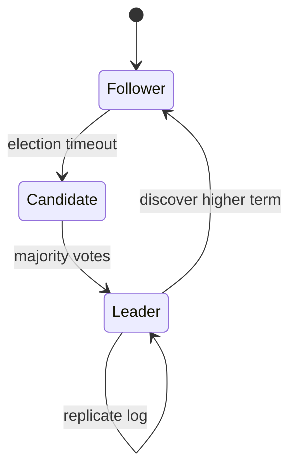

# Consensus

Paxos, Raft, leader election, membership changes, and production coordination services.

*Figure: Raft leader election and replication states.*

## What You'll Learn

Consensus is how distributed systems agree on a single ordered log despite failures. You will understand the consensus problem, why FLP makes pure async consensus impossible, how Raft and Paxos work, and how etcd, ZooKeeper, and Consul apply these ideas in production.

## Chapters

### Core Theory

| Chapter | Focus |
|---------|-------|
| [The Consensus Problem](/docs/consensus/consensus-problem) | Agreement, validity, termination |
| [FLP Impossibility](/docs/consensus/flp-impossibility) | Why consensus requires failure detectors or timing |
| [Paxos](/docs/consensus/paxos) | Single-decree and multi-decree Paxos |
| [Multi-Paxos](/docs/consensus/multi-paxos) | Log-based Paxos, leader optimization |
| [Raft Consensus](/docs/consensus/raft) | Leader election, log replication, safety |
| [Viewstamped Replication](/docs/consensus/viewstamped-replication) | Alternative formulation of replicated state machines |

### Operations and Production

| Chapter | Focus |
|---------|-------|
| [Leader Election](/docs/consensus/leader-election) | Bully, ring, Raft election details |
| [Membership Changes](/docs/consensus/membership-changes) | Joint consensus, safe reconfiguration |
| [Distributed Leases](/docs/consensus/distributed-leases) | Time-bounded locks with TTL |
| [Fencing Tokens](/docs/consensus/fencing-tokens) | Preventing stale primary writes |
| [ZooKeeper Atomic Broadcast (Zab)](/docs/consensus/zab) | ZooKeeper's consensus protocol |

### Production Systems

| Chapter | Focus |
|---------|-------|
| [Apache ZooKeeper](/docs/consensus/zookeeper) | Coordination service, znodes, watches |
| [etcd](/docs/consensus/etcd) | Kubernetes control plane, Raft-backed KV |
| [HashiCorp Consul](/docs/consensus/consul) | Service mesh coordination, Raft |

## Learning Path

1. **Consensus Problem** and **FLP** — know the limits before the algorithms.
2. **Raft** — whiteboard this for interviews; then read **Paxos** for historical depth.
3. **Leader Election**, **Membership Changes**, **Fencing Tokens** — production concerns.
4. Study **etcd** or **ZooKeeper** as a concrete system you have likely operated.

## Interview Prep

| Resource | Topic |
|----------|-------|
| [Google Spanner](/docs/real-world-scenarios/google-spanner-global-consistency) | Paxos groups, TrueTime |
| [Lab 003 Raft](/docs/consensus/raft#25-hands-on-exercise) | Raft simulation on **`:8098`** — [engineer guide](/docs/consensus/raft#engineer-guide-how-the-local-stack-works) |
| [Lab 004 KV](/docs/consistency/quorum-systems#25-hands-on-exercise) | Quorum replication on **`:8095`** — [engineer guide](/docs/consistency/quorum-systems#engineer-guide-how-the-local-stack-works) |
| [Lab 007 locks](/docs/consensus/distributed-leases#25-hands-on-exercise) | Distributed locks on **`:8100`** — [engineer guide](/docs/consensus/distributed-leases#engineer-guide-how-the-local-stack-works) |

## Prerequisites

- [Distributed Systems Foundations](/docs/distributed-systems-foundations/overview)
- [Replication](/docs/replication/overview) — helpful context for log replication

## Next Domain

Continue to [Replication](/docs/replication/overview) and [Transactions](/docs/transactions/overview).

Return to the [Curriculum Overview](/docs/start-here/curriculum-overview) for the full learning path.
