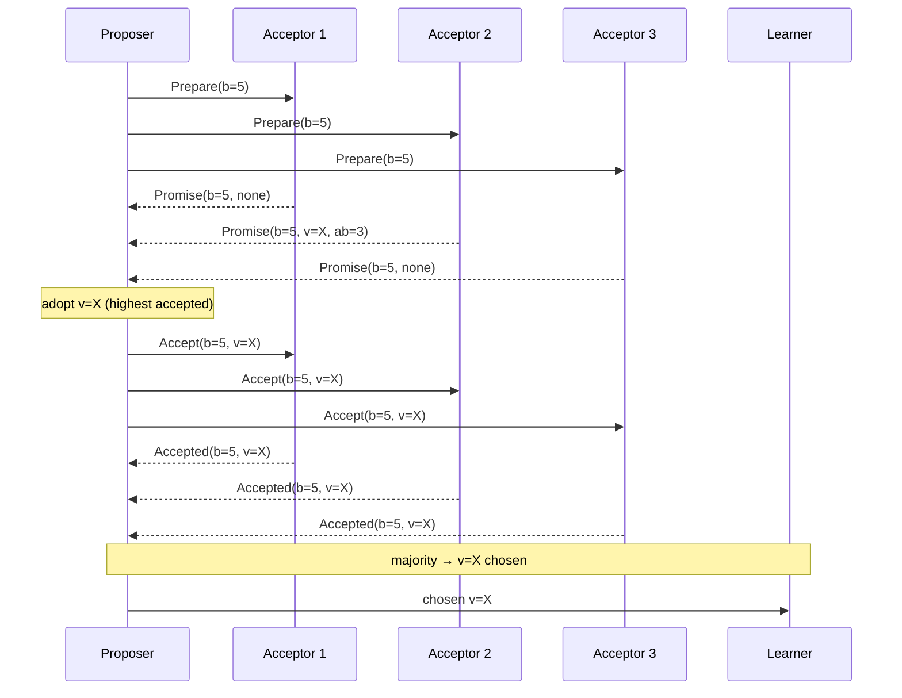
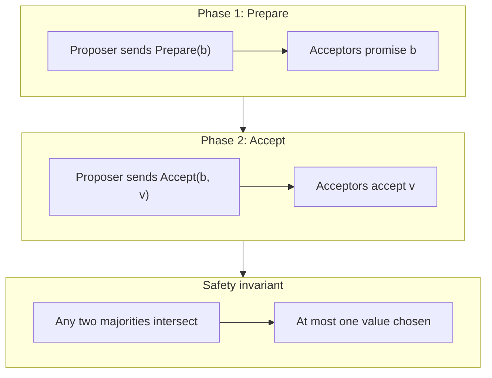
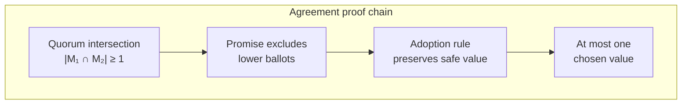

# Paxos

## 1. Executive Summary

**Paxos** is the foundational consensus algorithm introduced by Leslie Lamport in *The Part-Time Parliament* (1998) and refined in *Paxos Made Simple* (2001). It solves **single-value consensus** among distributed processes despite crash failures and unreliable communication. Paxos decomposes participants into three roles—**proposers**, **acceptors**, and **learners**—and drives agreement through two phases: **Prepare** (promise not to accept lower-numbered proposals) and **Accept** (propose a value once a quorum of acceptors agrees).

The algorithm's power rests on **quorum intersection**: any two majorities overlap in at least one acceptor, so conflicting values cannot both be chosen. **Ballot numbers** (proposal numbers) impose a total order on proposer attempts; acceptors promise to reject stale proposals and to accept only values that survive prior rounds. **Safety** (agreement, validity, integrity) holds even under arbitrary delays; **liveness** requires eventual progress—typically via leader election, unique proposer IDs, or partial synchrony assumptions.

This chapter covers Basic Paxos mechanics, formal safety reasoning, Multi-Paxos context, failure behavior, and principal-level interview depth—including whiteboard derivations that distinguish Paxos from Raft and from ad hoc quorum schemes.

## 2. Why This Topic Matters

Paxos is the **theoretical and historical backbone** of distributed consensus. Every modern algorithm—Raft, Multi-Paxos, Viewstamped Replication, Zab—either reduces to Paxos or explicitly contrasts with it. Principal architects encounter Paxos when:

- Evaluating consensus libraries (Chubby, Spanner's Paxos groups, etcd's Raft alternative).
- Debugging "split brain" or duplicate leader incidents in Paxos-derived systems.
- Explaining why a two-node cluster cannot provide safe consensus.
- Interviewing at companies where Paxos literacy signals distributed-systems depth.

Interviewers at senior and principal levels expect you to derive **why quorums intersect**, explain **the two-phase protocol**, and articulate **what Paxos does not solve** (membership changes, Byzantine faults, client semantics). Memorizing steps without the overlap argument is a red flag.

## 3. Problems Being Solved

| Problem | Paxos mechanism |
|---------|-----------------|
| **Single-value agreement** | Prepare + Accept with majority quorums |
| **Concurrent proposers** | Ballot numbers break ties; higher ballot wins |
| **Acceptor crashes** | Majority quorum tolerates minority failures |
| **Proposer crashes** | New proposer with higher ballot retries |
| **Value selection after partial rounds** | Acceptors return highest accepted value in Prepare response |
| **Learning the chosen value** | Learners query acceptors or receive notifications |

Paxos solves **crash-stop consensus for one slot**; replicated logs require **Multi-Paxos** or an equivalent extension.

## 4. Assumptions and System Model

| Assumption | Paxos treatment |
|------------|-----------------|
| **Crash-stop failures** | Failed nodes stop; no Byzantine behavior |
| **Asynchronous network** | Messages may delay, duplicate, reorder indefinitely |
| **Reliable channels** | Messages eventually delivered if sender/receiver correct |
| **Majority quorums** | n acceptors; any two majorities intersect |
| **Unique ballot numbers** | Proposers choose monotonically increasing proposal numbers |
| **Static membership** | n fixed; dynamic membership requires extensions |

**Liveness note:** Pure Paxos can stall indefinitely under perpetual contention (FLP). Production systems add **distinguished proposer**, **leader election**, or **timeouts**—implementation choices outside the core safety proof.

## 5. Essential Terminology

| Term | Definition |
|------|------------|
| **Proposer** | Initiates consensus by sending Prepare and Accept requests |
| **Acceptor** | Votes on proposals; persists promises and accepted values |
| **Learner** | Learns the chosen value once quorum accepts |
| **Ballot / proposal number** | Unique, monotonically increasing identifier for a proposal attempt |
| **Prepare (Phase 1a)** | Proposer asks acceptors to promise not to accept lower ballots |
| **Promise (Phase 1b)** | Acceptor responds with promise and highest accepted value (if any) |
| **Accept (Phase 2a)** | Proposer requests acceptors to accept a specific value |
| **Accepted (Phase 2b)** | Acceptor records the accepted value for the ballot |
| **Chosen value** | Value accepted by a majority of acceptors for some ballot |
| **Quorum** | Set of acceptors sufficient for decision; typically majority |
| **Intersection property** | Any two majorities share at least one acceptor |
| **Safe value** | A value that may still be chosen; returned in Promise responses |

## 6. Core Mechanism

### 6.1 Roles and state

**Acceptor persistent state:**
- `promised_ballot` — highest ballot number promised
- `accepted_ballot` — ballot of accepted value (optional until accept)
- `accepted_value` — value accepted (optional)

**Proposer state (per attempt):**
- `ballot` — unique proposal number
- `value` — proposed value (possibly adopted from acceptor responses)

### 6.2 Phase 1: Prepare and Promise

1. Proposer selects ballot `b` higher than any known ballot.
2. Proposer sends **Prepare(b)** to a majority of acceptors.
3. Each acceptor: if `b > promised_ballot`, set `promised_ballot = b`, respond **Promise(b, accepted_ballot, accepted_value)**; else reject.
4. Proposer waits for majority Promises.

**Value adoption rule:** If any Promise carries an accepted value, proposer must propose the value with the **highest accepted_ballot** among responses (ties broken by proposer policy). Otherwise, proposer may propose its own initial value.

### 6.3 Phase 2: Accept and Accepted

1. Proposer sends **Accept(b, v)** to majority, where `v` follows adoption rule.
2. Acceptor: if `b >= promised_ballot`, set `accepted_ballot = b`, `accepted_value = v`, respond **Accepted(b, v)**; else reject.
3. If majority accepts, value `v` is **chosen**.
4. Proposer notifies learners (or learners poll acceptors).



*Figure 1: Basic Paxos—Prepare quorum returns prior accepted value; Accept phase chooses it.*

### 6.4 Why two phases are necessary

A single-phase "accept my value" protocol fails when two proposers concurrently convince disjoint majorities. Phase 1 **locks out** lower ballots and surfaces any value that might still be chosen, preventing a new proposer from introducing a conflicting value after partial progress.



*Figure 2: Two-phase structure enforces quorum intersection before value commitment.*

### 6.5 Learners

Learners discover chosen values by:
- **Polling acceptors** for majority with same accepted value.
- **Notification** from proposer after Accept quorum (requires reliable proposer).
- **Separate learner protocol** (Paxos Made Simple discusses optimization).

Learners do not affect safety; they affect **when** clients observe the decision.

## 7. Step-by-Step Walkthrough

### Walkthrough A: First proposal succeeds

Three acceptors A1, A2, A3. Proposer P1 with ballot 1, value `red`.

1. P1 Prepare(1) → all promise (no prior accepts).
2. P1 Accept(1, red) → all accept.
3. Majority \{A1,A2,A3\} accepted `red` → **chosen**.

### Walkthrough B: Competing proposers

1. P1 Prepare(1) → A1, A2 promise; P1 crashes before Accept.
2. P2 Prepare(2) → A1, A2, A3 promise (higher ballot).
3. P2 Accept(2, blue) → majority accepts → `blue` chosen.
4. P1 wakes, sends Accept(1, red) → rejected (promised 2).

### Walkthrough C: Value adoption

1. P1 Accept(1, red) on A1 only; crashes.
2. P2 Prepare(2) → A1 returns Promise(2, accepted=red, ab=1); A2, A3 empty.
3. P2 **must** propose `red` in Accept(2, red) — cannot choose `blue`.
4. Majority accepts `red` → `red` chosen (was already inevitable).

### Walkthrough D: Dueling proposers (liveness failure)

1. P1 Prepare(1) → majority promises.
2. P2 Prepare(2) → majority promises before P1 Accept completes.
3. P1 Accept(1) rejected; P2 Prepare blocked by P1 retrying Prepare(3).
4. Repeat indefinitely — **safe but not live**. Distinguished proposer fixes this.

### Walkthrough E: Acceptor minority failure

Five acceptors; two crashed. Proposer needs any 3 for quorum. Prepare and Accept proceed on remaining majority; tolerate f = 2 failures with n = 5.

### Walkthrough F: Phase-skipping attempt (why it fails)

A team proposes "skip Prepare if acceptors have no prior state" for cold start. Two proposers boot concurrently, each sending Accept with different values to disjoint majorities of a five-acceptor cluster. Both values appear chosen—**agreement violated**. Phase 1 is not an optimization luxury; it is the gate that serializes competing attempts through ballot promises. Any production shortcut that bypasses Prepare on empty state must prove intersection under concurrency, which Basic Paxos already provides through the standard two-phase flow.

### Walkthrough G: Mapping to interview whiteboard

When asked to "implement consensus," start with **one acceptor** (trivial), **two acceptors** (impossible for safe majority—explain why), then **three acceptors** with full two phases. Draw the intersection of \{A,B\} and \{B,C\} as the shared acceptor B blocking conflicting values. This progression demonstrates you understand **quorum math** before reciting message names.

## 8. Invariants and Guarantees

### 8.1 Safety theorem

**Theorem (Paxos Agreement):** At most one value is chosen.

**Proof sketch:**

1. Value `v` chosen at ballot `b` ⇒ majority M accepted `(b, v)`.
2. Any proposer attempting ballot `b' > b` completes Prepare on majority M'.
3. ∃ A ∈ M ∩ M' (quorum intersection). A promised `b'` and previously accepted at most `(b, v)` with `b` highest among Promises.
4. Adoption rule forces proposer to propose `v` (or another value with same accepted ballot chain).
5. No conflicting value `w ≠ v` can reach Accept majority without violating promise.

**Validity:** Only proposed values appear in Accept requests (proposer constraint).

**Integrity:** Acceptors accept at most one value per ballot; chosen defined per ballot majority.

### 8.2 Liveness

Paxos does not guarantee termination under async model (FLP). **Progress** requires:
- Eventually one proposer runs uninterrupted through both phases.
- Ballot numbers increase so stale proposers fail.
- Distinguished proposer or Multi-Paxos leader reduces contention.



*Figure 3: Quorum intersection plus promise/adoption rules yield agreement.*

### 8.3 Property summary

| Property | Type | Paxos |
|----------|------|-------|
| Agreement | Safety | Guaranteed |
| Validity | Safety | Guaranteed |
| Integrity | Safety | Guaranteed |
| Termination | Liveness | Not guaranteed in pure async |

## 9. Failure Scenarios

| Failure | Behavior |
|---------|----------|
| **Proposer crash after Prepare** | Higher-ballot proposer completes; adopted value preserved |
| **Proposer crash after Accept quorum** | Value chosen; learners may need to query acceptors |
| **Acceptor crash** | Remaining majority suffices if > n/2 alive |
| **Minority partition** | Cannot form quorum; no new decisions (safe stall) |
| **Majority partition** | May choose values; minority cannot |
| **Duplicate Prepare messages** | Idempotent if ballot same; harmless |
| **Stale Accept** | Rejected due to higher promised_ballot |
| **Lost Accepted responses** | Proposer retries Accept; idempotent on acceptors |

## 10. Performance Characteristics

| Aspect | Behavior |
|--------|----------|
| **Message complexity** | 2 phases × majority messages per decision |
| **Latency** | ~2 RTT minimum for one value (Prepare + Accept) |
| **Persistence** | Acceptors must fsync promises/accepts for crash safety |
| **Contention cost** | Dueling proposers multiply failed rounds |
| **Throughput** | Low for Basic Paxos; Multi-Paxos amortizes Prepare |

Batching, pipelining, and leader-based Multi-Paxos dramatically improve throughput in production.

## 11. Scalability Limits

- Basic Paxos decides **one value** per full protocol run.
- Acceptors are stateful; scaling requires fixed quorum sets or hierarchical Paxos.
- Wide-area quorums increase latency; witness acceptors trade cost for fault domains.
- Learner fan-out can bottleneck notification.

## 12. Operational Considerations

- **Ballot number allocation:** Use `(round, proposer_id)` tuples for global uniqueness.
- **Distinguished proposer:** Run one active proposer per group to avoid livelock.
- **Disk fsync:** Acceptors without durable storage break safety on restart.
- **Monitoring:** Track rejected Prepare/Accept rates (contention signal).
- **Recovery:** Crashed acceptor rejoins with persisted `promised_ballot` and `accepted_*`.

### Ballot numbering scheme

A common pattern: `ballot = (epoch << 32) | proposer_id`. Epoch increments on each new leadership term; proposer_id breaks ties. This mirrors Raft terms conceptually. The proposer_id must be unique per process in the cluster so two proposers never generate identical ballots after independent restarts. Operational runbooks should document the mapping from server identity to proposer_id and forbid reuse after node replacement unless acceptor state is wiped—a rare disaster-recovery scenario with its own safety implications.

### Acceptor deployment

Co-locate acceptors with replicas in Spanner/Chubby-style systems, or run dedicated acceptor sets. **Odd counts** (3, 5) simplify majority math. When acceptors share hosts with application replicas, isolate their persistent volumes: an application bug that fills disk must not silently corrupt acceptor promises. Monitoring `promised_ballot` regression (should never decrease on a given acceptor) catches storage bugs early.

### Learner fan-out strategies

Large deployments rarely have every client poll acceptors directly. **Distinguished learners** aggregate chosen values and publish to subscribers—Chubby-style master notifications. The learner path is an availability concern: if no learner discovers a chosen value, the system is safe but clients block. Production designs pair acceptor majorities with at-least-one learner delivery path and client-side retry with exponential backoff.

## 13. Security Considerations

- Paxos assumes **benign failures**; malicious acceptors break agreement (Byzantine Paxos requires different protocol).
- **mTLS** between proposers and acceptors prevents impersonation.
- **Authorization** at application layer—chosen value is only as trustworthy as proposers allowed to run.
- Ballot hijacking if proposer IDs not authenticated.

## 14. Cost Considerations

- **Write amplification:** Two phases × quorum disk writes per slot.
- **Cross-region quorums:** Latency and egress costs dominate.
- **Operational expertise:** Paxos debugging is expensive; Raft's teachability reduces training cost.
- **Hardware:** SSD/NVMe for acceptor logs; majority fsync latency sets commit bound.

## 15. Production Implementations

| System | Paxos usage |
|--------|-------------|
| **Google Chubby** | Multi-Paxos for lock service |
| **Google Spanner** | Paxos groups per tablet |
| **Cassandra (LWT)** | Paxos-inspired lightweight transactions per partition |
| **libpaxos / ePaxos** | Research and specialized deployments |

Many new systems choose **Raft** for operational clarity; Paxos remains foundational in hyperscale stores.

## 16. Alternatives and Tradeoffs

| Alternative | When |
|-------------|------|
| **Raft** | Team needs understandable decomposition |
| **Multi-Paxos** | High throughput replicated log with Paxos theory |
| **EPaxos** | Leaderless WAN optimization |
| **2PC** | Single coordinator; blocking on coordinator failure |
| **Primary-backup** | Higher throughput, weaker failover guarantees |

Paxos wins when **minimal round complexity** with proven correctness matters and team has Paxos expertise.

## 17. Common Misconceptions

| Misconception | Reality |
|---------------|---------|
| "Paxos elects a leader" | Basic Paxos has no leader; Multi-Paxos adds one |
| "Prepare chooses the value" | Prepare only gathers promises; Accept chooses |
| "Any quorum works" | Quorums must pairwise intersect |
| "Paxos is always slow" | Leader-based Multi-Paxos pipelines Accepts |
| "Learners vote" | Only acceptors vote; learners observe |
| "Two nodes suffice" | Cannot form intersecting majorities with n=2 |

## 18. Principal Architect Perspective

- **Separate safety proof from deployment pattern:** Basic Paxos ≠ your production log.
- **Ballot exhaustion** and **proposer identity** belong in runbooks.
- **Test acceptor crash recovery** with wiped disk—team must understand lost safety.
- **Prefer Multi-Paxos or Raft** for replicated state machines; Basic Paxos for pedagogy and lock slots.
- **Document liveness mechanism** (distinguished proposer, backoff) explicitly.

## 19. Architecture Review Exercise

**Scenario:** Team runs Basic Paxos with three acceptors and three independent proposer services (no coordination), seeing 40% Prepare rejections and no stable progress for minutes during traffic spikes.

**Analysis:** Classic dueling proposers livelock. **Options:** (1) elect distinguished proposer via separate lease/consensus; (2) migrate to Multi-Paxos with single leader; (3) exponential backoff with jitter on proposer IDs. **Reject** adding acceptors without fixing proposer contention.

## 20. Whiteboard Explanation

"Paxos chooses one value using acceptors that vote in two phases. In Prepare, a proposer asks a majority to promise not to accept lower-numbered proposals. Acceptors return any value they already accepted. In Accept, the proposer sends a value—if any prior accept exists, it must reuse the highest one—asking the majority to accept. A value is chosen when a majority accepts the same ballot-value pair. Safety comes from quorum intersection: any two majorities share an acceptor, so two different values cannot both get majority acceptance. Ballot numbers order competing proposers. Liveness needs eventually one proposer to finish without interruption."

## 21. Interview Questions

1. **What are the three roles in Paxos?** — Proposer, acceptor, learner.
2. **What does Phase 1 accomplish?** — Promises; discovers possibly chosen value.
3. **When must a proposer adopt another value?** — When Promise returns prior accepted value.
4. **Why are two phases needed?** — Prevent two values on disjoint majorities.
5. **Define chosen value.** — Majority accepted same (ballot, value).
6. **Quorum intersection argument.** — Two majorities overlap; shared acceptor blocks conflict.
7. **What happens if proposer crashes after Prepare?** — Higher ballot proposer continues; adoption preserves safety.
8. **Does Paxos guarantee termination?** — No under pure async (FLP).
9. **Difference ballot vs value?** — Ballot orders attempts; value is payload decided.
10. **How many failures with 5 acceptors?** — Tolerate 2 (need 3 for majority).
11. **Can acceptor reject Accept after Promise?** — Only if higher ballot promised meanwhile.
12. **Basic Paxos vs Multi-Paxos?** — Single slot vs log of slots with leader optimization.

## 22. Interview Follow-Ups

1. **Prove agreement informally.** — Intersection + adoption prevents second value.
2. **Design ballot numbering.** — (epoch, proposer_id) monotonic tuple.
3. **What if acceptor forgets state on restart?** — Safety violated; must persist.
4. **Compare Prepare to Raft RequestVote.** — Different purposes; both use epochs/ballots.
5. **How do learners learn without proposer?** — Query acceptors for majority match.

## 23. Strong Answer Example

**Question:** "Why can't we use one phase where proposers directly ask acceptors to accept a value?"

**Strong outline:** "Two proposers could concurrently send different values to disjoint majorities—each getting three of five acceptors, for example, and both values would appear chosen. Phase 1 forces acceptors to promise not to accept lower ballots, serializing decisions. When a new proposer enters, it learns any value that might already be locked in via prior partial Accepts. The adoption rule ensures it propagates that value rather than introducing a conflict. Quorum intersection then guarantees at most one value can ever reach majority acceptance."

## 24. Weak Answer Example

**Weak:** "Paxos uses voting and majorities so everyone agrees. The leader sends prepare and accept messages."

**Red flags:** Calls proposer "leader" without distinction; no intersection argument; no adoption rule; no two-phase rationale.

## 25. Hands-On Exercise

1. Implement Basic Paxos simulation (3 acceptors, 2 proposers) or use Paxos lecture tools.
2. Run dueling proposers without backoff; observe livelock.
3. Add distinguished proposer; measure completion time.
4. Crash acceptor after Promise; verify recovery requires disk state.
5. Draw quorum intersection for n=5 on whiteboard.

## 26. Knowledge Check

1. Name Paxos phases and messages.
2. What state must acceptors persist?
3. When is a value chosen?
4. State the adoption rule.
5. Why does FLP matter for Paxos liveness?
6. How many acceptors for f=1 fault tolerance?
7. What rejects a stale Accept?
8. Role of learners in safety?
9. Difference promised_ballot and accepted_ballot?
10. Why can't two-node Paxos be safe?
11. What causes dueling proposers?
12. How does Multi-Paxos improve throughput?

## 27. Flashcards

| Front | Back |
|-------|------|
| Paxos roles | Proposer, acceptor, learner |
| Phase 1 | Prepare → Promise (lock ballot, return prior accept) |
| Phase 2 | Accept → Accepted (majority chooses value) |
| Chosen value | Majority accepted same (ballot, value) |
| Adoption rule | Propose highest previously accepted value from Promises |
| Quorum intersection | Any two majorities share ≥1 acceptor |
| promised_ballot | Highest ballot acceptor will not go below |
| Basic Paxos scope | Single consensus instance (one slot) |
| Dueling proposers | Livelock from competing Prepare rounds |
| Distinguished proposer | Liveness mechanism; one active proposer |
| Paxos safety | Agreement, validity, integrity proven |
| Paxos liveness | Requires partial sync or leader discipline |

## 28. Cheat Sheet

```
PAXOS ROLES: proposer | acceptor | learner

PHASE 1 — Prepare(b)
  acceptor: if b > promised → promise, return prior accept
  proposer: majority Promises → pick value (adoption rule)

PHASE 2 — Accept(b, v)
  acceptor: if b >= promised → accept (b,v)
  proposer: majority Accepted → CHOSEN

SAFETY
  two majorities intersect
  → at most one value chosen
  adoption rule preserves safe value

LIVENESS
  not guaranteed (FLP)
  fix: distinguished proposer, Multi-Paxos leader, backoff

OPS
  persist acceptor state, unique ballots, odd acceptor count
```

## 29. Related Concepts

- [The Consensus Problem](/docs/consensus/consensus-problem) — prerequisite specification
- [Multi-Paxos](/docs/consensus/multi-paxos) — replicated log extension
- [Raft Consensus](/docs/consensus/raft) — alternative decomposition
- [FLP Impossibility](/docs/consensus/flp-impossibility) — liveness limits
- [Quorum Systems](/docs/consistency/quorum-systems) — intersection theory
- [Safety and Liveness](/docs/distributed-systems-foundations/safety-and-liveness) — property framing

## 30. References

### Primary sources (formal guarantees)

- Lamport, L. (1998). *The Part-Time Parliament.* ACM TOCS. [Original Paxos; Greek parliament metaphor]
- Lamport, L. (2001). *Paxos Made Simple.* ACM SIGACT News. [Simplified presentation; standard teaching reference]
- Lamport, L. (2005). *Fast Paxos.* DISC. [Phase reduction with extra acceptors]

### Implementation-oriented

- Chandra, T., Griesemer, R., & Redstone, J. (2007). *Paxos Made Live: An Engineering Perspective.* PODC. [Google Chubby operational lessons]
- Bolosky, W., et al. — PacificA / Azure storage Paxos variants [implementation choices]

### Books

- Lynch, N. A. (1996). *Distributed Algorithms.* [Formal quorum intersection proofs]
- Kleppmann, M. (2017). *Designing Data-Intensive Applications.* O'Reilly. [Chapter 9 consensus overview]

### Distinction

- **Formal guarantees** — Agreement proof from Lamport papers via quorum intersection.
- **Implementation choices** — Ballot encoding, distinguished proposer, fsync policy.
- **Operational experience** — Chubby "Paxos Made Live" anecdotes; verify in your deployment.
