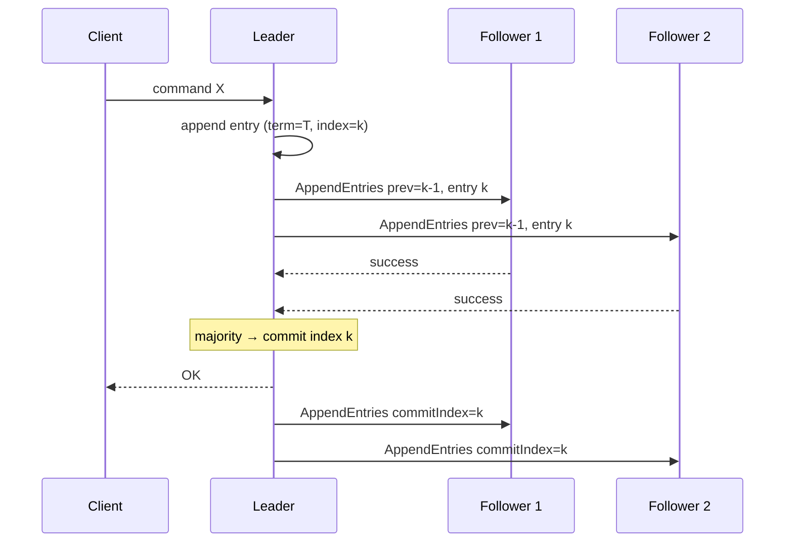
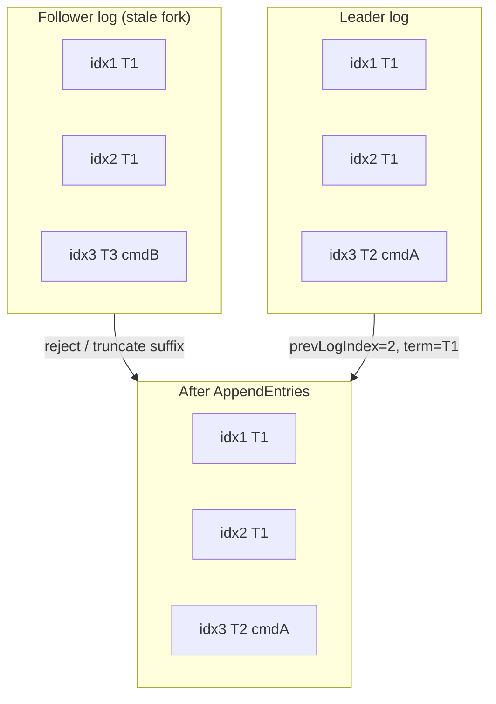
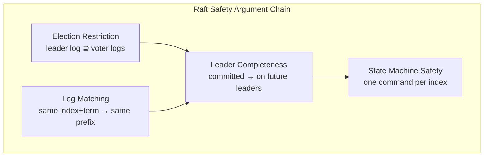

# Raft Consensus

## 1. Executive Summary

**Raft** is a consensus algorithm designed for **understandability** without sacrificing correctness (Ongaro & Ousterhout, 2014). It decomposes consensus into three relatively independent subproblems: **leader election**, **log replication**, and **safety**. A cluster elects at most one leader per **term**; the leader accepts client commands, appends them to its **replicated log**, and commits entries once replicated on a **majority**. Followers apply committed entries to deterministic **state machines** in log order.

Raft's safety rests on two pivotal properties: the **Election Restriction** (a candidate can win only if its log is at least as up-to-date as any voter's) and the **Log Matching Property** (if two logs contain an entry with the same index and term, they are identical in all preceding entries). Together with leader completeness, these yield the **Safety Argument**: if a leader commits an entry in a given term, that entry appears in the logs of all future leaders.

This chapter presents Raft's mechanism, formal safety reasoning, failure behavior, operational tuning, and interview depth—including whiteboard derivations principal candidates are expected to deliver.

## 2. Why This Topic Matters

Raft is the **default teaching and implementation** consensus algorithm in modern infrastructure: etcd, Consul, TiKV, CockroachDB, and numerous cloud control planes. Interviewers at senior and principal levels expect:

- State machine explanation (follower, candidate, leader).
- How **commit index** advances and what clients observe.
- Why the **election restriction** prevents overwriting committed entries.
- **Log matching** and conflict resolution on AppendEntries.
- Limitations: membership changes, read linearizability, performance.

Architects choosing or operating Raft-based systems must separate **Raft's guarantees** from **application semantics** and from **implementation extensions** (prevote, lease reads, etc.).

## 3. Problems Being Solved

| Problem | Raft mechanism |
|---------|----------------|
| **Total order of operations** | Single leader appends in one log |
| **Durability across crashes** | Quorum persistence before commit |
| **Leader failure** | Election + log catch-up |
| **Follower lag** | AppendEntries consistency check |
| **Configuration changes** | Joint consensus (Raft paper §6) |
| **Client interaction** | Linearizable writes via leader (with caveats for reads) |

Raft solves **crash-stop consensus** for replicated logs; it does not automatically solve sharding, Byzantine faults, or application-level idempotency.

## 4. Assumptions and System Model

| Assumption | Raft treatment |
|------------|----------------|
| **Crash-stop failures** | Failed nodes stop; no Byzantine behavior |
| **Partial synchrony** | Election timeouts eventually exceed RTT for progress |
| **Reliable RPC** | Retries; duplicate detection via terms and indices |
| **Static membership** | Extended by joint consensus for changes |
| **Deterministic state machines** | All replicas apply same commands with same results |
| **n > 2f, majority quorums** | Tolerate f crashes with n = 2f + 1 |

**Client model:** Clients typically contact the leader; followers redirect or clients retry on wrong leader errors.

## 5. Essential Terminology

| Term | Definition |
|------|------------|
| **Term** | Monotonic logical clock for elections; stored in persistent state |
| **Log entry** | `(term, command)` at index i |
| **Commit index** | Highest log index known committed (replicated on majority) |
| **Leader** | Sole proposer for new entries in its term |
| **Follower** | Passive; responds to RPCs |
| **Candidate** | Seeking votes in current term |
| **AppendEntries RPC** | Leader replication heartbeat + entries |
| **RequestVote RPC** | Candidate solicits votes |
| **Election restriction** | Voter grants vote only if candidate's log is at least as up-to-date |
| **Log matching property** | Same index + term ⇒ identical prefixes |
| **Leader completeness** | Committed entry from prior term present on future leaders |
| **State machine application** | Apply committed entries in index order |
| **Joint consensus** | Overlapping majorities during membership change |

**Up-to-date comparison:** Compare last log term first; higher term wins; if equal, longer index wins.

## 6. Core Mechanism

### 6.1 Persistent and volatile state

**Persistent (survive crash):**
- `currentTerm`
- `votedFor` (candidate ID in current term, if any)
- `log[]` entries

**Volatile (leader):**
- `commitIndex`, `lastApplied`
- `nextIndex[]`, `matchIndex[]` per follower

### 6.2 Leader election (summary)

Detailed in [Leader Election](/docs/consensus/leader-election). Key Raft-specific rules:

1. Increment term on candidacy.
2. Request votes with `(lastLogIndex, lastLogTerm)`.
3. **Election restriction:** Deny vote if candidate log is stale.
4. Majority → leader; send initial heartbeat.

### 6.3 Log replication

1. Client sends command to leader.
2. Leader appends to local log (current term).
3. Leader sends **AppendEntries** with `prevLogIndex`, `prevLogTerm`, new entries.
4. Follower accepts if log matches at `prevLogIndex`; else **reject** with hint for decrement.
5. Leader advances `matchIndex`/`nextIndex`; when entry on majority, update `commitIndex`.
6. Leader applies committed entries; notifies followers via subsequent AppendEntries.



*Figure 1: Raft log replication—quorum acknowledgment advances commit index before client acknowledgment.*

### 6.4 Log matching property

**Property (Log Matching):** If two different logs contain an entry with the same index and term, then the logs are identical in all entries up through that index.

**Mechanism:** Leader creates at most one entry per index per term; AppendEntries consistency check rejects forks:

- Follower accepts append only if `log[prevLogIndex].term == prevLogTerm`.
- On conflict, follower deletes conflicting suffix and appends leader's entries.



*Figure 2: Log matching—conflicting suffixes are replaced to match the leader's log at matching index and term.*

### 6.5 Election restriction

**Property (Election Restriction):** A candidate cannot win an election unless its log contains all committed entries.

**Rule:** Voter grants vote only if candidate's `(lastLogTerm, lastLogIndex)` is ≥ voter's.

**Intuition:** A committed entry must be on a majority. Any new leader's majority overlaps that majority; if the candidate's log is at least as up-to-date as every voter it convinces, it inherits all committed entries.

### 6.6 Commitment rule

Raft commits entries from the **current leader term** once majority-replicated. Entries from **previous terms** are committed indirectly: once a later entry in the current term is committed, all prior entries are committed (Raft paper commit rule).

This detail matters for safety proofs—leaders do not count stale-term entries as committed until the current-term entry secures them.

## 7. Step-by-Step Walkthrough

### Walkthrough A: Normal operation

Cluster of 3: S1 leader term 3, empty logs.

1. Client `SET a=1` → S1 appends index 1 term 3.
2. S1 replicates to S2, S3; both ACK.
3. S1 sets `commitIndex=1`, applies `SET a=1`, responds OK.
4. Next heartbeat propagates `commitIndex=1` to followers.

### Walkthrough B: Leader failure after commit

1. Entry at index 5 committed on S1 (leader), S2, S3.
2. S1 crashes.
3. S4 and S5 (hypothetical 5-node) may have index 5 uncommitted—irrelevant if not on majority.
4. S2 or S3 with index 5 wins election (election restriction).
5. New leader cannot overwrite index 5; clients see committed state.

### Walkthrough C: Log conflict resolution

Follower missing index 4; leader sends AppendEntries with `prevLogIndex=4`. Follower rejects. Leader decrements `nextIndex` until match found, then streams missing entries.

### Walkthrough D: Joint consensus membership change

**Problem:** Single-step "remove node 3" from \{1,2,3,4,5\} could leave \{1,2\} and \{4,5\} each thinking they have majority.

**Raft solution (joint consensus):**

1. Leader proposes **joint configuration** C_old,new where quorums require majorities in **both** C_old and C_new.
2. Cluster commits the joint config entry.
3. Leader proposes C_new alone.
4. After C_new commits, old config is discarded.

During joint consensus, no decision can be made by C_old alone or C_new alone—only by overlapping quorums spanning both. This preserves **election safety** across topology changes.

### Walkthrough E: Client protocol and duplicate detection

1. Client sends command to leader; network times out before response.
2. Client retries on same or new leader.
3. Without deduplication, command may execute twice.

**Raft extension (session semantics):** Assign each client a **unique ID** and **monotonic sequence number**; leader deduplicates `(clientID, seqNum)` before appending. This is an **implementation extension** for linearizable client semantics—not part of core safety proof but essential operationally.

## 8. Invariants and Guarantees

### 8.1 Safety argument (committed entry preservation)

**Theorem (Raft Safety):** If a log entry is committed in a given term, that entry will be present in the logs of all leaders for all higher terms.

**Proof sketch:**

1. Entry E committed at term T in index i ⇒ E on majority M.
2. Any future leader L at term T' > T must win votes from majority M'.
3. |M ∩ M'| ≥ 1; voter V in intersection.
4. **Election restriction:** L's log is ≥ V's log ⇒ L has E at index i.
5. **Log matching:** Same index i and term at E ⇒ identical prefix including E.

**Corollary (State Machine Safety):** If any server applies a command at index i, no other server applies a different command at i.

### 8.3 Inductive proof of log matching (sketch)

**Base case:** Empty logs trivially match.

**Inductive step:** Leader appends entry (term T, index k) only after follower confirms `log[k-1].term = prevLogTerm`. By induction, logs match through k-1. Leader creates at most one entry per (term, index) pair. Therefore logs match through k.

**Conflict resolution:** When follower has divergent suffix at k, it truncates from k onward before appending leader's entries—restoring the invariant.

### 8.4 Leader completeness lemma

**Lemma:** If entry E is committed in term T, then every leader for term T' > T has E in its log.

**Proof:** E on majority M at commit. Leader L for term T' wins votes from majority M'. ∃ V ∈ M ∩ M'. V granted vote only if L's log ≥ V's log (election restriction). V has E. Therefore L has E. ∎

This lemma is the bridge between **election restriction** and **committed entry preservation**.



*Figure 3: Election restriction and log matching jointly prove leader completeness and state-machine safety.*

### 8.2 Liveness (informal)

Under partial synchrony and stable majority, eventually a leader is elected and replicates client commands. FLP limits formal guarantees in pure async; Raft assumes timeouts eventually suffice.

### 8.3 Property summary

| Property | Type |
|----------|------|
| Election safety | At most one leader per term |
| Log matching | Safety |
| Leader completeness | Safety |
| State machine safety | Safety |
| Leader election liveness | Liveness (partial sync) |
| Log replication liveness | Liveness |

## 9. Failure Scenarios

| Failure | Behavior |
|---------|----------|
| **Leader crash before commit** | Entry may be lost; client retries |
| **Leader crash after commit** | Entry survives on majority; new leader continues |
| **Follower crash** | Leader retries AppendEntries; catch-up on recovery |
| **Network partition** | Majority side elects; minority stalls (CP) |
| **Stale leader** | Higher term forces step-down |
| **Disk loss on minority node** | Rejoins; leader overwrites with consistent log |
| **Membership misconfiguration** | Possible loss of quorum—operational, not algorithm bug |

## 10. Performance Characteristics

| Aspect | Typical behavior |
|--------|------------------|
| Steady-state throughput | One leader; batching improves throughput |
| Latency | ~1–2 RTT per commit (implementation-dependent) |
| Disk | fsync per entry unless batching/group commit |
| Read paths | Leader reads simple; follower reads need lease or read index for linearizability |

Raft trades **simplicity** for **leader bottleneck**—acceptable for metadata; shard for data plane scale.

## 11. Scalability Limits

- Single leader per Raft group—horizontal scale via **sharding** (many Raft groups).
- Large logs slow catch-up—**snapshotting** required.
- Wide-area: high commit latency if quorum spans regions.

## 12. Operational Considerations

- **3 or 5 nodes** common; avoid even counts.
- Tune election/heartbeat timeouts for environment RTT.
- **Snapshots + compaction** prevent unbounded disk growth.
- **Defragmentation** (etcd) and quota monitoring.
- **Graceful leader transfer** before maintenance.
- **Joint consensus** for membership changes—never single-step remove quorum nodes.

### Snapshotting and log compaction

Unbounded logs exhaust disk and slow new-node catch-up. Raft supports **snapshots**:

1. Leader or follower compacts applied state into a snapshot covering indices 1..S.
2. Log entries ≤ S are discarded from memory/disk (retain snapshot metadata).
3. New follower receives **InstallSnapshot** RPC instead of replaying entire history.

**Operational cautions:**

- Snapshot frequency trades disk I/O vs. catch-up time.
- Restore from corrupt snapshot loses safety—verify checksums and backup procedures.
- Applications must support deterministic replay from snapshot + subsequent log.

### Read linearizability options

| Method | Mechanism | Cost |
|--------|-----------|------|
| Leader reads | Read from leader only | Simple; leader load |
| Read index | Leader confirms it is still leader at commit index | Extra RPC |
| Lease read | Leader assumes leadership for lease duration | Clock/sync assumptions |
| Follower read (stale) | Read local state without check | Fast; not linearizable |

Principal architects document which read path each service uses—**silent stale reads** from followers have caused production incidents.

## 13. Security Considerations

- mTLS between peers; secure bootstrap tokens.
- Raft does not encrypt log data—application responsibility.
- Compromised leader can propose malicious commands—authZ at API layer.

## 14. Cost Considerations

- Quorum replication multiplies write I/O.
- Cross-AZ etcd for Kubernetes: latency + infra cost vs. control-plane reliability.
- Operational expertise for upgrades and backup/restore of Raft data dirs.

## 15. Production Implementations

| System | Notes |
|--------|-------|
| **etcd** | Reference Raft implementation; Kubernetes |
| **Consul** | Raft for catalog and KV |
| **TiKV / CockroachDB** | Multi-Raft per range |
| **Hashicorp Nomad** | Raft for scheduling state |
| **Dragonboat** | Go Raft library |

Extensions in the wild: **pre-vote** (reduces disruption), **async replication** variants (weaken guarantees—document clearly).

## 16. Alternatives and Tradeoffs

| Alternative | When |
|-------------|------|
| **Multi-Paxos** | Equivalent power; often considered harder to teach |
| **Zab (ZooKeeper)** | Mature; different API |
| **EPaxos** | Leaderless for WAN latency—complexity |
| **Primary-backup async** | Higher throughput, weaker durability |
| **Chain replication** | Throughput; different failure modes |

Raft wins when **team understandability** and **library ecosystem** matter.

## 17. Common Misconceptions

| Misconception | Reality |
|---------------|---------|
| "Committed on leader = committed globally" | Need majority replication + commit rules |
| "Any follower can serve linearizable reads" | Need read index or lease |
| "Remove node instantly" | Risk quorum loss; use joint consensus |
| "Raft solves sharding" | One log per group; shard at application layer |
| "Terms are wall-clock epochs" | Logical counters |

## 18. Principal Architect Perspective

- **Shard the data plane; Raft the control plane.**
- **Document client retry and idempotency** for duplicate command indices.
- **Capacity plan** for watch streams and large values—not Raft's sweet spot.
- **Upgrade strategy:** version skew tolerance per implementation docs.
- **Disaster recovery:** restore from snapshot + retained WAL; verify cluster ID.

## 19. Architecture Review Exercise

**Scenario:** Geo-distributed 5-node Raft with nodes in US, EU, AP; p99 commit latency 400ms unacceptable for metadata.

**Options:** Regional etcd clusters with async federation; witness nodes; separate consensus domains per region. **Reject** single global quorum for latency-sensitive path without accepting delay.

## 20. Whiteboard Explanation

"Raft elects a leader for each term using majority votes. Voters only support candidates whose logs are at least as complete—the election restriction. The leader appends client commands and replicates with AppendEntries. Followers accept only if the previous log entry matches in index and term—the log matching property. When a majority has an entry, the leader commits it. Safety proof: any committed entry was on a majority; any future leader overlaps that majority and must have at least as fresh a log, so the entry survives. Followers apply committed entries in order to deterministic state machines."

## 21. Interview Questions

1. **Raft subproblems?** — Election, replication, safety.
2. **State election restriction.** — Up-to-date log comparison for votes.
3. **State log matching property.** — Same index+term ⇒ identical prefixes.
4. **When is entry committed?** — Majority replicated; current-term rule for prior-term entries.
5. **Stale leader handling?** — Higher term in RPC responses.
6. **Conflict resolution?** — Decrement nextIndex; truncate follower suffix.
7. **Why odd cluster sizes?** — Clear majorities.
8. **Sketch safety argument.** — Committed on majority → election restriction → future leader has entry.
9. **FLP and Raft?** — Timeouts assume partial synchrony.
10. **Linearizable reads from follower?** — Read index / lease / not by default.
11. **Membership change pitfall?** — Joint consensus prevents two majorities.
12. **Difference commitIndex vs lastApplied?** — Committed vs applied to SM.

## 22. Interview Follow-Ups

1. **Prove log matching inductively.** — AppendEntries consistency + leader uniqueness per index/term.
2. **Client duplicate requests.** — Idempotent commands or session sequence numbers.
3. **Pre-vote extension purpose.** — Avoid term spikes on flaky nodes.
4. **Compare to Multi-Paxos.** — Similar guarantees; decomposition differs.
5. **5-node cluster tolerates how many failures?** — 2.

## 23. Strong Answer Example

**Question:** "Explain how Raft prevents a new leader from overwriting committed entries."

**Strong outline:** "Committed means replicated on a majority in some term. The election restriction says a candidate only receives a vote if its log is at least as up-to-date as the voter's, comparing last term then index. Any new leader must contact a majority, which overlaps the old commit majority, so at least one voter had the committed entry. The winning candidate's log is at least as fresh as that voter's, so it contains the entry. The log matching property ensures that if two logs have the same index and term, all prior entries match, so no fork can overwrite it. AppendEntries only extends or truncates to converge; it cannot silently change a committed prefix because that prefix is shared by all majorities the leader must respect."

## 24. Weak Answer Example

**Weak:** "Raft uses heartbeats and majority votes so only one leader writes. Committed entries are saved."

**Red flags:** No election restriction; no log matching; no overlap argument; vague "saved."

## 25. Hands-On Exercise

**Lab:** `labs/lab-003-raft-simulation/` — Raft RSM on **`:8098`**

```bash
cd labs/lab-003-raft-simulation
go test ./... -v
docker compose -p lab003 -f docker/docker-compose.yml up --build -d
chmod +x scripts/demo_raft.sh && ./scripts/demo_raft.sh
```

| Step | Endpoint | What happens |
|------|----------|--------------|
| 1 | `POST /v1/cluster/elect-leader` | Leader election in new term |
| 2 | `GET /v1/peers` | Term, role, commit index per peer |
| 3 | `POST /v1/log/append` | Client command replicated to majority |
| 4 | `POST /v1/cluster/elect-leader` | Re-election — committed entries survive |
| 5 | `GET /v1/peers` | `commit_index` reflects replicated log |

**Swagger:** http://localhost:8098/docs

### Engineer guide: how the local stack works

1. **3-node in-process cluster** — each peer runs Raft core + deterministic KV state machine.
2. **Leader election** — RequestVote RPC with term and log up-to-dateness check.
3. **Log replication** — AppendEntries carries `(term, index, command)`; commit after majority ack.
4. **Safety** — committed entries from prior terms survive leader change (election restriction).
5. **HTTP façade** — `/v1/log/append` maps to client commands; inspect peers for interview whiteboard replay.

Pairs with [Lab 004 quorum KV](/docs/consistency/quorum-systems#25-hands-on-exercise) — production shards use Raft per partition instead of hand-rolled quorums.

### Build-from-scratch exercise (optional)

1. Run `etcd` or RaftScope alongside this lab; compare observability.
2. Submit writes; kill leader after commit; verify survival.
3. Partition minority; verify write failures.
4. Induce log divergence on follower; observe convergence on heal.
5. Draw safety argument chain from your observations.

## 26. Knowledge Check

1. Name Raft's three subproblems.
2. Define election restriction formally.
3. Define log matching property.
4. How does Raft compare log up-to-dateness?
5. What RPC carries replication?
6. When may follower truncate its log?
7. State the safety theorem for committed entries.
8. Why joint consensus for membership changes?
9. What triggers candidate state?
10. How does Raft achieve partial synchrony?
11. Difference between term and index?
12. Can two leaders exist in same term with correct Raft?

## 27. Flashcards

| Front | Back |
|-------|------|
| Raft decomposition | Leader election, log replication, safety |
| Election restriction | Vote only if candidate log ≥ voter log (term, then index) |
| Log matching property | Same index and term → identical preceding logs |
| Leader completeness | Committed entries appear on all future leaders |
| State machine safety | At most one command applied per log index |
| AppendEntries | Replicate entries; consistency via prevLogIndex/term |
| RequestVote | Candidate solicits votes with log metadata |
| Commit index | Highest index known committed on majority |
| Term | Monotonic epoch for elections and log entries |
| Safety proof overlap | New leader majority ∩ old commit majority ≠ ∅ |
| Joint consensus | Overlapping majorities during config change |
| Partial synchrony | Election timeouts eventually exceed RTT |

## 28. Cheat Sheet

```
RAFT STATES: follower | candidate | leader

ELECTION RESTRICTION
  grant vote iff candidate (lastLogTerm, lastLogIndex) ≥ voter

LOG MATCHING
  same (index, term) → identical prefix
  conflict → truncate follower suffix, append leader entries

COMMIT
  majority replicated → advance commitIndex
  apply in order to state machine

SAFETY PROOF
  committed @ majority
  → election restriction + overlap
  → future leader has entry
  → log matching → no overwrite

OPS
  3/5 nodes, snapshots, joint consensus for membership
```

## 29. Related Concepts

- [Leader Election](/docs/consensus/leader-election) — prerequisite
- [The Consensus Problem](/docs/consensus/consensus-problem) — specification
- [FLP Impossibility](/docs/consensus/flp-impossibility) — why timeouts exist
- [Safety and Liveness](/docs/distributed-systems-foundations/safety-and-liveness) — property framing
- [Replication](/docs/replication/overview) — broader replication patterns
- [Distributed Databases](/docs/distributed-databases/overview) — multi-Raft storage

## 30. References

### Primary sources (formal guarantees)

- Ongaro, D., & Ousterhout, J. (2014). *In Search of an Understandable Consensus Algorithm (Extended Version).* USENIX ATC. [Raft specification, safety proof, election restriction, log matching]
- Ongaro, D. (2014). *Consensus: Bridging Theory and Practice.* PhD thesis, Stanford. [Extended correctness arguments]
- Lamport, L. (1998). *The Part-Time Parliament.* ACM TOCS. [Paxos—for comparison]

### Implementation-oriented

- etcd Raft implementation: https://github.com/etcd-io/raft
- Raft user-facing site: https://raft.github.io/

### Books

- Kleppmann, M. (2017). *Designing Data-Intensive Applications.* O'Reilly. [Chapter 9]
- Lynch, N. A. (1996). *Distributed Algorithms.*

### Distinction

- **Formal guarantees** — Election restriction, log matching, leader completeness from Raft paper.
- **Implementation choices** — Pre-vote, batching, lease reads in etcd/TiKV.
- **Operational experience** — Timeout tuning; verify in your deployment.
