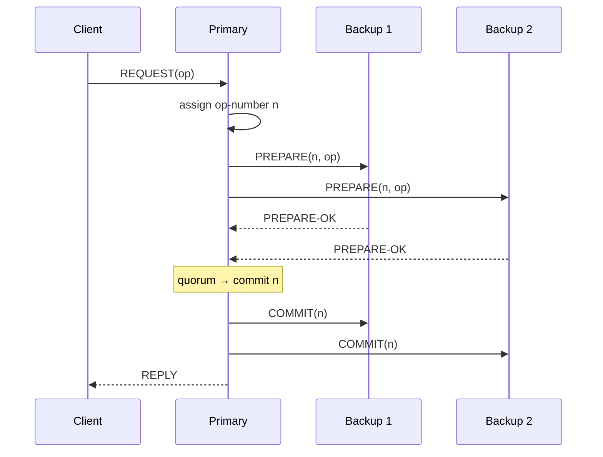
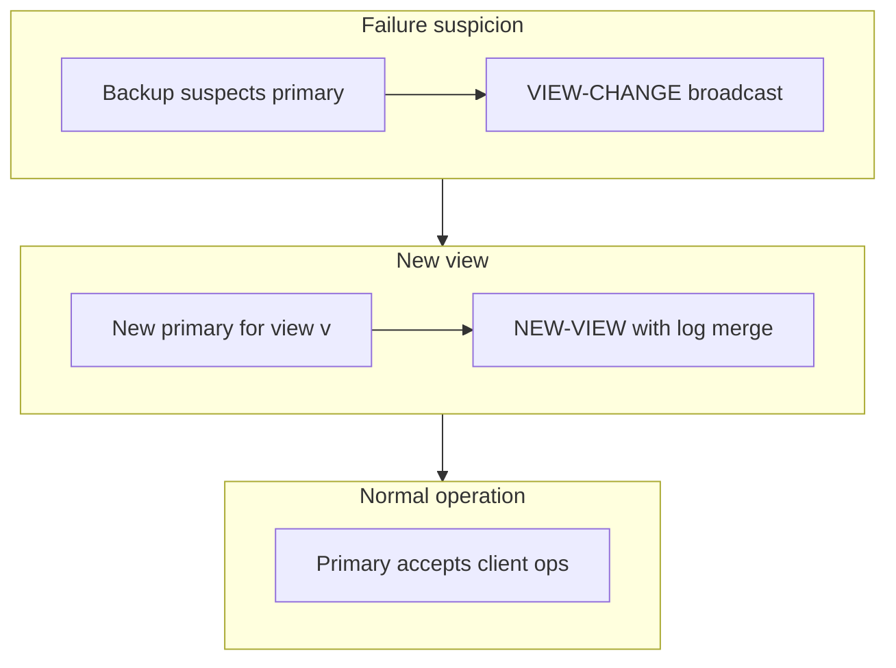
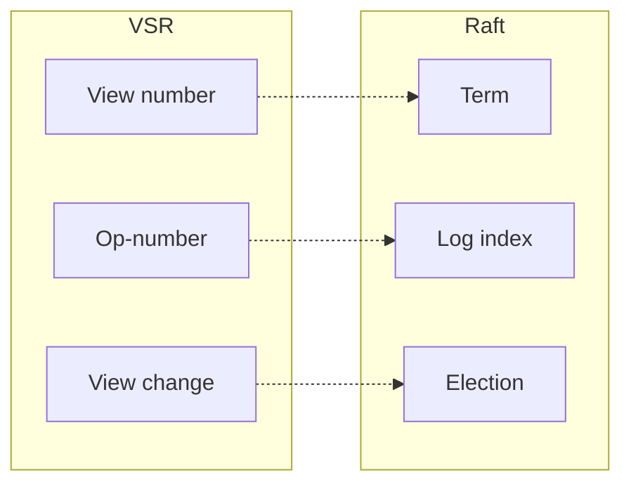

# Viewstamped Replication

## 1. Executive Summary

**Viewstamped Replication (VSR)** is a consensus protocol developed by Barbara Liskov and colleagues (1988–2012) for **replicated state machines** using a **primary-backup** model organized by **views**. Each view has a unique **view number** and designates one **primary** replica; backups accept client operations only through the primary and participate in **view changes** when the primary is suspected failed. VSR predates Raft and Multi-Paxos popularization and influenced modern replicated-log designs.

VSR's core ideas: **normal operation** (primary orders requests with monotonic **op-numbers**), **view changes** (backups elect new primary with higher view number, collecting **prepared** logs), and **recovery** (bringing lagging replicas up to date). **Safety** ensures that committed operations survive primary failure; **liveness** requires eventually correct failure detection and quorum participation.

This chapter presents VSR mechanisms, comparison to Raft/Paxos, view-change protocol depth, and interview reasoning for architects evaluating primary-backup consensus alternatives.

## 2. Why This Topic Matters

VSR appears in:

- Academic lineage of consensus (before "understandable" Raft).
- Systems courses and textbooks (Liskov & Cowling 2012 revision).
- Interviews testing whether candidates know **more than Raft**.
- Understanding **view-change** complexity that Raft simplified.

Principal architects benefit from VSR when reading historical papers, comparing primary-backup protocols, or designing systems where **explicit view management** maps to operational "epochs."

Interviewers at companies with long-running distributed systems heritage may prefer VSR vocabulary over Raft. Demonstrating fluency in **both** signals principal breadth. Teams maintaining primary-backup databases often think in "promote replica" language—mapping that instinct to formal view change prevents shortcuts that violate committed-prefix assumptions VSR makes explicit.

## 3. Problems Being Solved

| Problem | VSR mechanism |
|---------|---------------|
| **Total order of operations** | Primary assigns op-numbers |
| **Primary failure** | View change elevates backup |
| **Backup failure** | Primary continues with quorum acks |
| **Log consistency** | Prepared/commit rules across views |
| **Client redirection** | Retry to new primary after view change |
| **State transfer** | Catch-up for lagging replicas |

## 4. Assumptions and System Model

| Assumption | VSR treatment |
|------------|---------------|
| **Crash-stop failures** | Benign replicas |
| **Partial synchrony** | For progress after view change |
| **Majority quorum** | n = 2f+1 tolerates f failures |
| **Deterministic state machines** | Same op order → same state |
| **Point-to-point reliable messages** | Retries, deduplication |
| **Failure detector** | Suspect primary → initiate view change |

## 5. Essential Terminology

| Term | Definition |
|------|------------|
| **View** | Epoch with unique view number and designated primary |
| **View number** | Monotonic integer identifying current configuration epoch |
| **Primary** | Leader replica for current view |
| **Backup** | Non-primary replica |
| **Op-number** | Monotonic sequence assigned by primary to each operation |
| **Commit-number** | Highest op-number known committed (replicated on quorum) |
| **Prepared** | Operation received and logged by replica (may not be committed) |
| **View change** | Transition to new view with new primary |
| **VIEW-CHANGE message** | Backup announces readiness for new view with log summary |
| **NEW-VIEW message** | New primary consolidates logs and starts view |
| **Checkpoint** | Stable snapshot for garbage collection |
| **State transfer** | Copy state to lagging replica |

VSR terminology deliberately mirrors **database replication** (primary, backup, log) more closely than Paxos (proposer, acceptor)—useful when explaining consensus to teams familiar with PostgreSQL streaming replication but not Greek parliaments.

The 2012 VSR revision by Liskov and Cowling remains the best single reference for interview preparation in this protocol family; allocate one study session to comparing its view-change section side-by-side with Raft paper §5.

## 6. Core Mechanism

### 6.1 Normal operation

1. Client sends **REQUEST** to primary (or backup forwards).
2. Primary assigns **op-number**, logs operation, sends **PREPARE** to backups.
3. Backup logs and acknowledges **PREPARE-OK**.
4. When primary receives f+1 acknowledgments (including self), operation is **committed**.
5. Primary sends **COMMIT**; backups apply; primary replies to client.



*Figure 1: VSR normal case—primary orders, quorum of PREPARE-OK commits.*

### 6.2 View change

When backup suspects primary failed:

1. Backup increments view number, broadcasts **VIEW-CHANGE(v, log summary)**.
2. When new primary for view v collects VIEW-CHANGE from majority, it sends **NEW-VIEW(v, consolidated log)**.
3. Backups adopt NEW-VIEW, update primary identity, resume normal operation.



*Figure 2: View change—suspect, collect VIEW-CHANGE quorum, NEW-VIEW consolidates.*

### 6.3 Log consolidation in NEW-VIEW

New primary must choose for each op-number the **highest view** prepared operation known from VIEW-CHANGE messages, ensuring:

- No committed operation lost.
- Uncommitted operations may be discarded or re-proposed.

This mirrors Raft's log matching and Multi-Paxos adoption—different message names, same safety tension.

### 6.4 Comparison snapshot



*Figure 3: VSR concepts map closely to Raft equivalents.*

### 6.5 Checkpointing and garbage collection

VSR replicas periodically take **checkpoints**—stable snapshots of the state machine at op-number c. Log entries ≤ c can be discarded once all backups acknowledge the checkpoint. During view change, backups present their highest checkpoint and subsequent prepared ops in VIEW-CHANGE messages, bounding message size. Without checkpointing, a long-lived primary could accumulate millions of op-numbers, making view-change merge messages unwieldy and slowing failover to minutes.

### 6.6 Client protocol and at-most-once semantics

Clients attach **unique request identifiers** to REQUEST messages. The primary deduplicates retransmissions before assigning new op-numbers—mirroring Raft client session extensions. Without deduplication, a client timeout retry after successful commit could execute the same operation twice on the state machine. Principal architects treat **idempotent state machine commands** as the ultimate safety net even when the replication protocol deduplicates.

## 7. Step-by-Step Walkthrough

### Walkthrough A: Three-replica happy path

Replicas R1 (primary, view 1), R2, R3. Client write W.

1. R1 PREPARE op 5=W to R2, R3.
2. R2, R3 PREPARE-OK.
3. R1 commits, COMMIT to R2, R3, replies client.

### Walkthrough B: Primary failure after commit

1. Op 10 committed on R1, R2; R3 lagging.
2. R1 crashes.
3. R2 initiates view change to view 2; becomes primary.
4. NEW-VIEW includes op 10; R3 catches up.

### Walkthrough C: Uncommitted operation lost

1. R1 prepared op 11 on R1 only; crashes.
2. New primary R2 never saw op 11; not in any quorum prepare.
3. Client retries; op 11 re-executed with new op-number.

### Walkthrough D: Concurrent view changes

1. R2 and R3 both start view change.
2. Higher view number wins; lower view aborted.
3. Single new primary emerges from quorum VIEW-CHANGE set.

### Walkthrough E: State transfer

R4 joins far behind. Primary sends checkpoint + recent log, or full state transfer, before participating in quorum.

### Walkthrough F: Client connects to backup during view change

Client sends REQUEST to backup B while view change in progress. B may respond `RETRY_LATER` or forward to suspected primary. After NEW-VIEW completes, client must retry with updated view number. Client libraries that cache primary address without view metadata cause **flapping errors** during failover—mirror this in your service mesh or SDK design.

### Walkthrough G: Comparing commit latency to Raft

Both VSR and Raft require quorum acknowledgment before commit. VSR's explicit COMMIT message after PREPARE-OK parallels Raft's separate commitIndex notification in AppendEntries. Latency difference in practice comes from implementation batching and fsync policy, not inherent protocol superiority. Benchmark claims should name **hardware, disk, and network** assumptions.

### Walkthrough H: Historical context for interviews

VSR (1988) predates widespread Paxos deployment in industry. When interviewers ask "why Raft over VSR," cite **understandability** (Ongaro thesis), **open-source ecosystem**, and **unified election+log narrative**—not a claim that VSR is unsafe. Conversely, when reading PBFT or early Google papers, VSR vocabulary accelerates comprehension.

## 8. Invariants and Guarantees

### 8.1 Commit rule

Operation committed when prepared on **majority** (including primary in VSR counting).

### 8.2 Safety

If op committed in view v, any operation at same op-number in view v' > v must be same operation (or view change preserves committed prefix).

### 8.3 View-change safety

NEW-VIEW primary selects log entries consistent with any quorum of prior prepared ops—**committed ops survive**.

### 8.4 Liveness

With eventually correct failure detection and majority alive, view change completes and processing resumes.

### 8.5 Inductive sketch: committed op survives view change

**Base:** First committed op in view 1 is on majority M. **Step:** View changes to v+1; new primary collects VIEW-CHANGE from majority M'. ∃ replica r ∈ M ∩ M'. r reports op in its log summary; NEW-VIEW includes op at same op-number. **Conclusion:** committed prefix preserved. This parallels Raft leader completeness lemma with different message names—useful in interviews when asked to prove failover safety without citing Raft directly.

| Property | Type |
|----------|------|
| Agreement on commit order | Safety |
| Validity | Safety |
| Progress | Liveness (partial sync) |

## 9. Failure Scenarios

| Failure | Behavior |
|---------|----------|
| **Primary crash** | View change |
| **Backup crash** | Primary continues if quorum remains |
| **Network partition** | Majority partition elects new primary |
| **False suspicion** | Unnecessary view change; safety preserved |
| **Slow backup** | State transfer or log replay |
| **Client talks to old primary** | Rejected; retry with higher view |
| **Concurrent view changes** | Higher view wins |
| **Checkpoint during view change** | Must not truncate log needed for merge |
| **Primary network isolate** | Backups elect; isolated primary must stop serving |

### Deep dive: false primary suspicion

A backup that falsely suspects the primary initiates view change while the primary is healthy. Both may briefly accept client writes if the application ignores view numbers—**safety at VSR layer does not automatically protect a misconfigured client**. Applications must tag responses with view numbers and reject stale views. This is analogous to Raft's `term` checking on every RPC response.

## 10. Performance Characteristics

| Aspect | Behavior |
|--------|----------|
| **Normal path** | 2 RTT (prepare quorum + commit notify) |
| **View change** | Expensive; multiple rounds |
| **Throughput** | Primary bottleneck |
| **Disk** | Log each prepared op |

Comparable to Raft/Multi-Paxos steady state.

## 11. Scalability Limits

- Single primary per view.
- View-change storm if failure detection flaky.
- Shard for data plane scale.

## 12. Operational Considerations

- Tune failure detector to balance **false positives** vs **failover time**.
- Monitor view-change frequency.
- Checkpoint regularly to bound recovery time.
- Client libraries must handle **primary redirect** and view number in replies.

### Failure detector tuning

Too aggressive → flapping views. Too slow → outage duration. Correlated with Raft election timeout tradeoffs. Measure **false suspicion rate** in staging by injecting latency between primary and backups without crashing the primary. A healthy VSR deployment should see view changes only on real failures or planned maintenance—not during routine GC or network jitter.

### Operational metrics dashboard

| Metric | Healthy signal | Alert threshold (example) |
|--------|----------------|----------------------------|
| View changes / hour | Near zero steady-state | > 2 unexplained |
| Op-number lag (backup) | Low seconds | > 30s sustained |
| PREPARE-OK latency P99 | Stable ms | 2× baseline |
| State transfer bytes | Rare spikes | Continuous high |

Customize thresholds per workload; the table structures what principal on-call runbooks should contain.

### Primary selection determinism

For view number v, the primary is typically `replica[(v mod n)]` or the backup with highest log completeness—exact rule is in the VSR specification. Determinism prevents two backups from both believing they are primary in the same view. Client libraries cache `(view_number, primary_id)` and refresh on `WRONG_PRIMARY` responses; architects should expose this metadata in service discovery to avoid hard-coded primary addresses.

### Relationship to Byzantine fault tolerance

PBFT (Practical Byzantine Fault Tolerance) extends the view-change pattern to tolerate malicious replicas with 3f+1 nodes. Understanding VSR clarifies PBFT's **view-change certificate** collection—same structural problem (merge logs after suspected primary failure) with stronger evidence requirements. Principal interviews sometimes pivot from VSR to "what changes under Byzantine assumptions?"—answer: quorum size, cryptographic signatures, and prepared certificates.

## 13. Security Considerations

- Authenticate replicas; rogue primary can order bogus ops.
- mTLS on replica channels.
- Client auth independent of replication protocol.

## 14. Cost Considerations

- View changes waste capacity during transitions.
- State transfer bandwidth for large replicas.
- N+1 replicas for f=1 tolerance.

## 15. Production Implementations

| System | Notes |
|--------|-------|
| **BFT variants** | PBFT extends similar view model for Byzantine |
| **Academic prototypes** | VSR reference implementations |
| **Influence** | Raft paper cites VSR lineage |

Few production systems brand themselves "VSR" today; concepts persist in primary-backup consensus.

## 16. Alternatives and Tradeoffs

| Alternative | When |
|-------------|------|
| **Raft** | Simpler view-change narrative |
| **Multi-Paxos** | Ballot-based; similar power |
| **Zab** | ZooKeeper-specific |
| **Chain replication** | Different ordering chain |

VSR valuable for **historical completeness** and **academic rigor**.

### When VSR still matters in practice

You may not deploy VSR by name, but its vocabulary appears in **PBFT view changes**, **Raft thesis related work**, and **primary-backup database failover** designs. Understanding VIEW-CHANGE/NEW-VIEW merge prepares you to evaluate whether a vendor's "automatic failover" actually preserves committed transactions or merely promotes a replica with a heuristic. Ask for the **formal commit rule** and **merge algorithm**—if the vendor cannot articulate them, assume gap.

## 17. Common Misconceptions

| Misconception | Reality |
|---------------|---------|
| "VSR is outdated/unsafe" | Proven safe; less popular operationally |
| "View = configuration only" | View includes primary role |
| "PREPARE = 2PC prepare" | Different protocol; VSR prepare is replication |
| "Any backup becomes primary" | Deterministic primary per view number |
| "Committed = client replied" | Commit is quorum prepare, not reply |

## 18. Principal Architect Perspective

- Know VSR to **read papers** and **compare to Raft** credibly.
- View-change complexity is why Raft emphasized **understandability**.
- Failure detector is **operational load**—document tuning.
- State transfer planning mandatory for large state machines.
- When mentoring engineers, use VSR as a **stepping stone**: once they understand VIEW-CHANGE/NEW-VIEW log merge, Raft's election restriction feels like the same safety idea with cleaner naming.
- Legacy systems marketed as "primary-backup replication" without formal view management should trigger an architecture review—informal failover often lacks committed-prefix guarantees.

## 19. Architecture Review Exercise

**Scenario:** VSR-based prototype shows view change every 90 seconds due to GC pauses on primary triggering false failure suspicion.

**Fix:** Increase suspicion timeout; isolate replication to dedicated threads; use GC tuning; add **primary lease** acknowledgment. **Reject** disabling view change.

**Extended analysis:** Plot GC pause histogram against current failure-detector timeout. If P99 pause exceeds 50% of timeout, false suspicions are mathematically likely under load spikes. Consider **generational ZGC/Shenandoah** evaluation (verify against your JVM LTS support matrix) or move primary to a node pool with stricter CPU isolation—not merely "increase timeout" without bound, which slows real failure detection.

## 20. Whiteboard Explanation

"VSR runs a primary that assigns monotonic op-numbers to client requests and replicates them to backups with PREPARE. When a quorum acknowledges, the op commits and backups apply it. Each epoch is a view with a view number and fixed primary. If the primary fails, backups run view change: they exchange VIEW-CHANGE messages with their logs, a new primary publishes NEW-VIEW merging the highest prepared ops per position, and normal operation resumes. Safety: committed ops were on a majority, so any new primary's quorum overlaps and preserves them."

**Timing tip for interviews:** Spend 60 seconds on normal path, 90 seconds on view change, 30 seconds on safety overlap—interviewers often interrupt if you linger on message names without reaching the quorum intersection argument.

## 21. Interview Questions

1. **What is a view in VSR?** — Epoch with view number and primary.
2. **Normal operation message flow?** — REQUEST → PREPARE → PREPARE-OK → COMMIT.
3. **When is operation committed?** — Prepared on majority.
4. **What triggers view change?** — Primary failure suspicion.
5. **VIEW-CHANGE vs NEW-VIEW?** — Backup announcement vs primary consolidation.
6. **Compare VSR primary to Raft leader.** — Similar ordering role.
7. **What happens to uncommitted ops?** — May be lost; client retries.
8. **Why op-numbers?** — Total order for state machine.
9. **VSR vs Paxos?** — Primary-backup vs acceptor voting presentation.
10. **Failure detector role?** — Liveness; triggers view change.
11. **State transfer purpose?** — Catch up lagging replica.
12. **Who authors VSR?** — Liskov et al.

## 22. Interview Follow-Ups

1. **How does NEW-VIEW preserve commits?** — Quorum overlap on prepared set.
2. **Map VSR to Raft concepts.** — View→term, op-number→index, view change→election.
3. **False failure suspicion impact?** — Availability hit; safety OK.
4. **Why fewer production VSR deployments?** — Raft/Paxos tooling; complexity.
5. **Checkpoint interaction with view change.** — Truncate log; transfer snapshot.

## 23. Strong Answer Example

**Question:** "Explain VSR view change at a high level."

**Strong outline:** "When backups suspect the primary failed, they increment the view number and multicast VIEW-CHANGE containing their view history and prepared log. The backup designated primary for the new view waits for a majority of VIEW-CHANGE messages, then computes a consolidated log— for each op-number taking the highest-view prepared entry. It sends NEW-VIEW to adopt this log and resume as primary. Committed operations survive because any commit required a majority prepare in the old view, and the new primary's majority overlaps that set, so committed entries appear in the consolidation."

## 24. Weak Answer Example

**Weak:** "VSR uses views instead of leaders. When the primary dies, backups vote for a new one."

**Red flags:** No VIEW-CHANGE/NEW-VIEW; no log consolidation; no commit/quorum rule.

## 25. Hands-On Exercise

1. Read Liskov & Cowling 2012 VSR paper sections 1–4.
2. Draw message diagram for normal op and for view change.
3. Map each VSR message to closest Raft RPC.
4. Simulate false primary suspicion; count wasted view changes.
5. Write comparison table VSR vs Raft for interview prep.

## 26. Knowledge Check

1. Define view number.
2. Messages in normal operation?
3. Commit condition?
4. Purpose of NEW-VIEW?
5. What is prepared but not committed?
6. How many failures with n=5?
7. Client retry behavior after view change?
8. Relation to state-machine replication?
9. VSR primary assignment rule?
10. Why checkpoints?
11. Compare op-number to Raft index.
12. Safety vs liveness in view change?

## 27. Flashcards

| Front | Back |
|-------|------|
| VSR | Viewstamped Replication; primary-backup consensus |
| View | Epoch with view number and designated primary |
| Op-number | Primary-assigned monotonic operation sequence |
| PREPARE / PREPARE-OK | Primary replicates; backup acknowledges log |
| Commit | Operation prepared on majority |
| VIEW-CHANGE | Backup initiates new view with log summary |
| NEW-VIEW | New primary consolidates logs for view |
| View change trigger | Primary failure suspicion |
| State transfer | Catch up lagging replica |
| vs Raft | View≈term, op-number≈index, similar safety goals |
| Uncommitted op on crash | Lost; client must retry |
| Authors | Liskov, Cowling et al. |

## 28. Cheat Sheet

```
VSR NORMAL PATH
  client → primary → PREPARE → f+1 PREPARE-OK → COMMIT → reply

VIEW CHANGE
  suspect primary → VIEW-CHANGE(v) majority
  → new primary NEW-VIEW(merged log) → resume

COMMIT: prepared on majority
SAFETY: committed survives via quorum overlap in merge
LIVENESS: failure detector + majority

MAP TO RAFT: view≈term, op-num≈index, view-change≈election
```

## 29. Related Concepts

- [Raft Consensus](/docs/consensus/raft) — simplified successor narrative
- [Paxos](/docs/consensus/paxos) — alternative formulation
- [Leader Election](/docs/consensus/leader-election) — failure detection
- [The Consensus Problem](/docs/consensus/consensus-problem) — specification
- [Primary-Secondary Replication](/docs/replication/primary-secondary-replication) — weaker replication
- [Safety and Liveness](/docs/distributed-systems-foundations/safety-and-liveness) — properties

## 30. References

### Primary sources (formal guarantees)

- Oki, B. M., & Liskov, B. (1988). *Viewstamped Replication: A New Primary Copy Method to Support Highly-Available Distributed Systems.* MIT technical report.
- Liskov, B., & Cowling, J. (2012). *Viewstamped Replication Revisited.* MIT-CSAIL-TR-2012-021. [Modern readable specification]

### Related

- Ongaro & Ousterhout (2014). *Raft.* [Cites VSR influence]
- Castro & Liskov (1999). *PBFT.* [Byzantine view-change lineage]

### Books

- Lynch, N. A. (1996). *Distributed Algorithms.*

### Distinction

- **Formal guarantees** — VSR 2012 revision safety arguments.
- **Implementation choices** — Failure detector parameters, checkpoint interval.
- **Operational experience** — Limited branded VSR deployments; concepts live in Raft ops.
