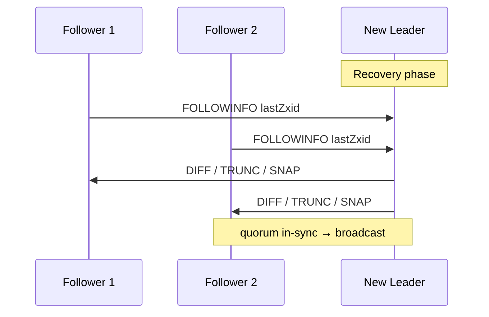
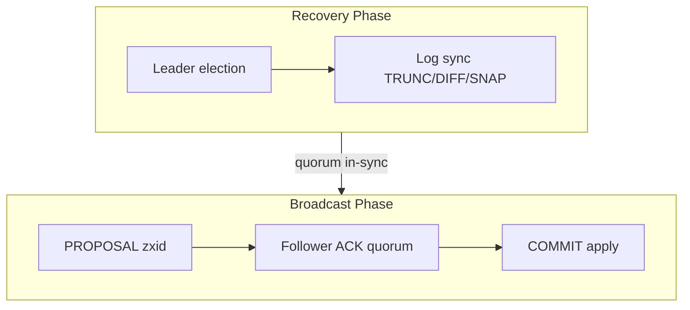
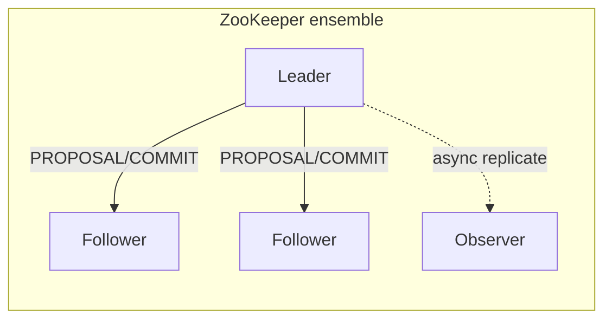

# ZooKeeper Atomic Broadcast (Zab)

## 1. Executive Summary

**Zab (ZooKeeper Atomic Broadcast)** is the consensus protocol powering **Apache ZooKeeper**—a coordination service for distributed systems (configuration, naming, locking, leader election). Zab provides **atomic broadcast**: a total order of transactions delivered identically to all servers, with **primary-backup** semantics organized by **epochs** and **transaction IDs (zxid)**. Unlike presenting as generic replicated log consensus, Zab is optimized for ZooKeeper's **in-memory data tree**, **session model**, and **watcher** API.

Zab operates in two modes: **recovery** (leader election and log synchronization after failure) and **broadcast** (steady-state transaction replication). **Safety** ensures that committed transactions persist across leader failovers; **liveness** requires a quorum of followers connected to a leader. Zab influenced industry understanding of coordination services but differs in details from Raft and Multi-Paxos—architects operating ZooKeeper must understand **Zab semantics**, not assume Raft equivalence.

This chapter covers Zab phases, zxid structure, recovery protocol, comparison to Raft/Paxos, operational implications, and principal-level interview depth.

## 2. Why This Topic Matters

ZooKeeper remains embedded in:

- **Kafka** (older versions), **HBase**, **Solr**, **NiFi** metadata.
- **Kubernetes** historical etcd migration stories (understand legacy).
- **Curator** recipes: locks, barriers, leader election.

Interviewers and architecture reviews ask:

- How **ephemeral nodes** interact with sessions and Zab ordering.
- Whether ZooKeeper provides **linearizable reads** (often not by default).
- **Recovery time** during leader election.
- Zab vs Raft when choosing coordination backend.

Misunderstanding Zab causes **split-brain assumptions**, **stale reads**, and **herd effects** on session expiration.

### Migration and coexistence

Organizations migrating from ZooKeeper to etcd or Consul should plan for **recipe rewrites** (Curator → clientv3 concurrency), different session semantics, and changed watch delivery models. A lift-and-shift of znode paths without behavioral testing has caused production regressions when ephemeral semantics differ subtly from lease TTL behavior.

## 3. Problems Being Solved

| Problem | Zab mechanism |
|---------|---------------|
| **Total order of updates** | Leader assigns zxids; FIFO to followers |
| **Leader failure** | Recovery phase elects leader, syncs logs |
| **Consistent ZooKeeper tree** | Apply transactions in zxid order |
| **Session liveness** | Session timeouts + ephemeral node cleanup |
| **Durability** | Quorum disk persistence before ack |
| **Atomic broadcast equivalence** | Agreement + validity + order |

Beyond the table, Zab must also support **high read fan-out** via watchers without violating write ordering—a coordination concern absent from pure log-replication specs. Watch notifications are **ordered per client** but decoupled from global delivery, which shapes how architects design config propagation and leader election recipes on top of ZK.

Apache Curator's recipes (leader latch, path children cache, distributed barrier) encode decades of Zab operational lessons—prefer them over hand-rolled ZK clients in production services.

When documenting ZK dependencies in architecture decision records, cite **read consistency path** and **session timeout values** explicitly—these are implementation choices with direct outage blast radius during leader failover.

## 4. Assumptions and System Model

| Assumption | Zab treatment |
|------------|---------------|
| **Crash-stop servers** | Non-Byzantine |
| **Majority quorum** | 2f+1 ensemble |
| **Partial synchrony** | Election completes eventually |
| **FIFO channels** | Leader-follower order preserved per link |
| **Deterministic transaction application** | Data tree updates deterministic |
| **Client sessions** | First-class in protocol semantics |

## 5. Essential Terminology

| Term | Definition |
|------|------------|
| **Zab** | ZooKeeper Atomic Broadcast protocol |
| **zxid** | 64-bit transaction ID: epoch (high 32) + counter (low 32) |
| **Epoch** | Leadership era; increments on new leader election |
| **Leader** | Primary proposing transactions |
| **Follower** | Receives and acks proposals |
| **Observer** | Receives commits; does not vote in quorum |
| **Recovery phase** | Leader election + log sync before accepting writes |
| **Broadcast phase** | Steady-state transaction replication |
| **Proposal** | Leader's transaction package to followers |
| **COMMIT** | Leader notifies followers transaction committed |
| **In-sync set** | Followers caught up enough to form quorum |
| **Data tree** | In-memory hierarchical znode namespace |
| **Session** | Client connection state with timeout |

## 6. Core Mechanism

### 6.1 zxid structure

`zxid = (epoch << 32) | counter`

- **Epoch** bumps when new leader elected.
- **Counter** increments per leader-proposed transaction within epoch.
- Total order: compare zxids lexicographically as 64-bit integers.

### 6.2 Recovery phase

Triggered on startup or leader failure:

1. **Leader election** (Fast Leader Election algorithm—separate but coupled).
2. Elected leader must have **highest zxid** among quorum participants (or equivalent safety rule).
3. **Discovery:** followers send last zxid to leader.
4. **Synchronization:** leader diffs logs; **TRUNC**, **DIFF**, or **SNAP** to align followers.
5. Transition to **broadcast** when quorum in-sync.



*Figure 1: Zab recovery—leader synchronizes follower logs before accepting writes.*

### 6.3 Broadcast phase

1. Leader receives client write (or internal txn).
2. Leader assigns zxid, writes to txn log, sends **PROPOSAL** to followers.
3. Followers persist and send **ACK**.
4. Leader receives quorum ACKs, sends **COMMIT**.
5. Followers apply to data tree; leader responds client.



*Figure 2: Zab modes—recovery must complete before broadcast accepts new transactions.*

### 6.4 Fast Leader Election (overview)

Servers exchange **votes** (sid, zxid, epoch). Majority with highest zxid wins. Not identical to Raft RequestVote but serves same purpose. **Implementation detail** in ZooKeeper; safety depends on Zab recovery rules.

### 6.5 Transaction types in the ZooKeeper log

Not every zxid corresponds to a client `setData`. Internal transactions include **createSession**, **closeSession**, **deleteContainer**, and **multi** operations batched atomically. Session close transactions drive ephemeral node deletion—architects relying on ephemerals for leader election must understand that session expiry is itself an ordered transaction, not a side channel. **Multi** transactions apply several tree updates under one zxid, useful for atomic barrier or queue recipes in Curator.

### 6.6 Looking state and client behavior

When a ZooKeeper server cannot find a leader, it enters **LOOKING** state and rejects client writes. Reads may also fail depending on server mode and connection. Client libraries should retry with backoff and rotate connections across ensemble members. Applications that treat ZK unavailability as fatal should distinguish **session expired** (reconnect + ephemeral lost) from **temporary looking** (brief retry suffices).



*Figure 3: Leader replicates to voting followers; observers scale read fan-out without quorum votes.*

## 7. Step-by-Step Walkthrough

### Walkthrough A: Client create znode

1. Client session connected to follower; write forwarded to leader.
2. Leader PROPOSAL zxid=0x100000005; followers ACK.
3. Leader COMMIT; tree updated; client receives response.
4. Watchers notified (ordering relative to zxid).

### Walkthrough B: Leader crash

1. Leader had committed through zxid 0x200000010.
2. Followers detect session timeout; FLE elects new leader.
3. Recovery: new leader epoch 3; sync lagging followers.
4. Broadcast resumes at zxid 0x300000001.

### Walkthrough C: TRUNC vs DIFF

- Follower ahead of elected leader (partition artifact): **TRUNC** truncate suffix.
- Follower behind: **DIFF** send missing txn log entries.
- Far behind: **SNAP** snapshot + recent log.

### Walkthrough D: Ephemeral node session expire

1. Client session times out (no heartbeat).
2. Leader processes **session close** transaction in order.
3. Ephemeral nodes deleted atomically in zxid order.

### Walkthrough E: Observer read

Observer applies committed txns but doesn't vote. **Local read** may be stale vs leader—document for architects.

### Walkthrough F: Watcher delivery vs zxid order

Client C sets watch on `/config`. Leader commits txn zxid 0x2000000A (update `/config`) then 0x2000000B (update `/other`). C receives watch notification after applying A. Another client D reading `/other` first may observe B before C observes A—**per-client order** of watch events does not define global cross-client linearizability. Architects document this when using ZK for feature flags affecting multiple keys.

### Walkthrough G: Rolling restart of ensemble

Operators restart followers one at a time during upgrade. Each restart triggers brief follower lag; leader continues if quorum ACKs persist. Restarting **leader last** minimizes election churn. If majority followers restart simultaneously (bad automation), ensemble enters looking state—writes block until FLE completes. Runbooks should enforce **maxUnavailable=1** for voting members.

### Walkthrough H: zxid comparison pitfall

Developers compare zxids as strings (`"0x10000002" > "0x0fffffff"`) and get wrong ordering. Always compare as **unsigned 64-bit integers**. Epoch dominates: any txn in epoch 2 exceeds all txns in epoch 1 regardless of counter. Unit tests for zxid comparison have prevented production bugs in custom ZK clients.

## 8. Invariants and Guarantees

### 8.1 Total order

All servers deliver same transactions in same zxid order.

### 8.2 Agreement

No two servers commit different transactions at same zxid.

### 8.3 Validity

Only proposed (leader-initiated) transactions committed.

### 8.4 Integrity

Committed prefix stable; recovery never rolls back committed txn.

### 8.5 Session guarantees

Session events ordered with other transactions—enables ephemeral semantics.

### 8.6 Atomic broadcast equivalence

Zab's total-order delivery with agreement and integrity satisfies **atomic broadcast** when every correct server delivers the same transactions in the same order. This is the bridge between ZooKeeper's coordination API and formal distributed-systems vocabulary—useful when comparing ZK to Kafka log ordering or Raft replicated logs in architecture documents.

| Property | Type |
|----------|------|
| Total order | Safety |
| Agreement | Safety |
| Prefix integrity | Safety |
| Progress | Liveness (majority + leader) |

## 9. Failure Scenarios

| Failure | Behavior |
|---------|----------|
| **Leader crash** | Recovery; election delay |
| **Follower crash** | Leader continues; sync on rejoin |
| **Minority partition** | Cannot elect leader / commit |
| **Client partition** | Session may expire; ephemeral cleanup |
| **Disk full on follower** | Drops from quorum; risk if majority affected |
| **Observer lag** | Stale reads if served locally |

## 10. Performance Characteristics

| Aspect | Behavior |
|--------|----------|
| **Write latency** | 1 RTT + quorum fsync |
| **Read latency** | Local read fast; sync read needs leader |
| **Throughput** | Thousands ops/sec typical (workload dependent) |
| **Election** | Seconds possible under default tuning |
| **Snapshot I/O** | Periodic; affects recovery |
| **Watch fan-out** | Leader notifies watchers; hot znode risk |
| **Transaction size** | Large znodes hurt fsync and replication |

**TODO:** Verify current ZooKeeper benchmark claims for your version before citing numbers in interviews.

### Tuning knobs affecting Zab performance

`snapCount` controls how many transactions before snapshot; lower values increase snapshot frequency (faster recovery, more I/O). `tickTime` and `initLimit`/`syncLimit` govern session and follower sync timeouts—aggressive values improve failure detection speed but increase false positives. JVM heap and GC algorithm directly affect session survival; G1GC with adequate headroom is common in production guides (verify against your ZK version documentation).

## 11. Scalability Limits

- Single leader write path.
- In-memory tree size bounded by RAM.
- Watch storm on popular znodes.
- Observers scale reads, not writes.
- 3 or 5 node ensembles common; more nodes = slower writes.

## 12. Operational Considerations

- **Never run even-sized ensembles** without understanding tie-break (still prefer odd).
- **JVM heap** sizing for data tree + watches.
- **txnLog** and **snapDir** on separate disks.
- **4lw commands** restricted in production (`ruok`, `stat`).
- **Upgrade rolling** requires quorum availability planning.
- **Session timeout** tuning: too low → false expirations.

### Read staleness

`sync()` before read if linearizability needed (ZooKeeper sync API). Default local read from follower may lag.

### Observer deployment

Use for read-heavy workloads; not for quorum. Know they add replication load. Observers consume leader bandwidth proportional to transaction rate; adding observers does not improve write availability during leader failure. Capacity planning should treat observers as read replicas with **eventual** apply lag unless clients explicitly sync.

### Four-letter words and debugging

ZooKeeper's **four-letter words** (`mntr`, `stat`, `srvr`, `cons`) expose mode (leader/follower/observer), zxid, and approximate lag. Restrict these admin ports in production firewalls; expose only to ops tooling. During incident response, comparing `zk_synced` and `zk_looking_count` across ensemble members quickly distinguishes election storms from application-level slowness.

### Data model constraints driving Zab

The in-memory **data tree** limits (default 1MB per znode in many configs—verify your version) shape what Zab replicates: small coordination metadata, not large blobs. Architects who store sizable JSON in znodes force large PROPOSAL payloads, increasing fsync cost and watch fan-out. Zab's design assumes **many small ordered transactions**; violating that assumption shows up as GC pressure and election timeouts long before Zab itself is "wrong."

## 13. Security Considerations

- **ACLs** on znodes (digest, SASL, cert).
- Enable **TLS** and authentication (SASL).
- Protect election ports from untrusted networks.
- Zab does not encrypt data—TLS at transport layer.

## 14. Cost Considerations

- Dedicated ensemble VMs; avoid colocating with heavy Kafka brokers on same nodes.
- Cross-AZ latency hits write path.
- Operational expertise for JVM tuning and snapshot management.
- Migration to **etcd** has engineering cost but simpler Raft mental model.

## 15. Production Implementations

| System | Notes |
|--------|-------|
| **Apache ZooKeeper** | Reference Zab implementation |
| **Curator** | Client recipes atop ZK |
| **BookKeeper** | Related Apache project; different log abstraction |

## 16. Alternatives and Tradeoffs

| Alternative | When |
|-------------|------|
| **etcd (Raft)** | Kubernetes-native; gRPC API |
| **Consul** | Service mesh + Raft |
| **Chubby / Spanner** | Hyperscale managed |
| **Embedded Raft library** | Custom coordination |

Choose ZooKeeper when mature recipes, existing ecosystem, or HBase/Kafka dependency mandates.

## 17. Common Misconceptions

| Misconception | Reality |
|---------------|---------|
| "ZooKeeper is a database" | Coordination service; not bulk storage |
| "Zab = Raft" | Similar goals; different recovery/broadcast split |
| "Follower read is linearizable" | Use sync() or read from leader |
| "Observers vote" | No quorum participation |
| "Ephemeral nodes are instant delete" | Deleted via ordered txn on session expire |
| "More ZooKeeper nodes = faster" | Writes slower with larger voting ensemble |

## 18. Principal Architect Perspective

- **Coordination, not data plane**—keep payloads small.
- **Herds:** sequential nodes + watch storms need recipe design (Curator patterns).
- **Plan session timeouts** vs GC pauses on clients.
- **Document read consistency** path per service using ZK.
- **Deprecation trends:** evaluate etcd/Consul for greenfield.
- Before approving new ZooKeeper dependencies in 2026, ask whether the team needs **watches + ephemeral semantics** specifically or only key-value with linearizable writes—etcd with leases may reduce operational surface area while preserving needed guarantees.
- **Ensemble sizing:** three nodes tolerate one failure; five tolerate two but add write latency—match fault domain count (AZs) to voter placement, not arbitrary "more is safer" scaling.

## 19. Architecture Review Exercise

**Scenario:** Service uses ZooKeeper follower reads for feature flags; during leader failover, flags flip twice causing bad deployments.

**Fix:** Use `sync()` before read, or read from leader, or cache with version; tolerate leader election unavailability. **Reject** assuming follower read equals linearizable.

**Deployment hardening:** Cache feature flags locally with zxid version; reject stale cache when `sync()` returns higher zxid. During ZK outage, fail **closed** (keep last known good) or **open** (documented business risk)—never alternate silently between random follower states. Include ZK ensemble health in deployment pipeline gates.

## 20. Whiteboard Explanation

"Zab is ZooKeeper's atomic broadcast protocol. A leader assigns monotonically increasing zxids combining epoch and counter. In broadcast phase, the leader proposes transactions, waits for quorum ACKs on disk, then commits; followers apply in order to the data tree. After leader failure, Zab enters recovery: elect leader with latest history, synchronize followers via diff, trunc, or snapshot, then resume broadcast. Sessions and ephemeral nodes are implemented as ordered transactions. Observers replicate without voting to scale reads."

**Contrast one-liner:** If asked "ZK vs etcd," say Zab emphasizes recovery/broadcast phases and session-bound ephemerals; Raft in etcd emphasizes unified log replication with first-class lease API—choose based on ecosystem, not raw protocol elegance.

## 21. Interview Questions

1. **What does Zab stand for?** — ZooKeeper Atomic Broadcast.
2. **zxid structure?** — Epoch (high 32) + counter (low 32).
3. **Zab phases?** — Recovery and broadcast.
4. **When can leader accept writes?** — After recovery syncs quorum.
5. **PROPOSAL vs COMMIT?** — Replicate vs notify committed.
6. **Observer role?** — Replicate; no vote.
7. **TRUNC vs DIFF?** — Truncate ahead follower vs send missing log.
8. **Ephemeral node deletion?** — Session expire transaction.
9. **Zab vs Raft?** — Recovery/broadcast split; zxid vs term/index.
10. **Linearizable read from follower?** — Not by default; use sync.
11. **Typical ensemble size?** — 3 or 5.
12. **Fast Leader Election purpose?** — Choose leader with latest log.

## 22. Interview Follow-Ups

1. **Why epoch in zxid?** — Distinguish leader generations; ordering across failovers.
2. **Session timeout too aggressive?** — False ephemeral deletes; thundering herd.
3. **Can ZooKeeper replace a database?** — No; size, throughput, API mismatch.
4. **Watch ordering guarantees?** — Per-client order; not global delivery order to clients.
5. **Migrate ZK to etcd?** — API rewrite; different consistency primitives.

## 23. Strong Answer Example

**Question:** "Explain Zab recovery after leader failure."

**Strong outline:** "When the leader fails, followers run Fast Leader Election to pick a server with sufficiently up-to-date history—typically highest zxid among voters. The elected leader enters recovery: each follower sends its last zxid, and the leader chooses TRUNC if follower is ahead of consensus log, DIFF to send missing transactions, or SNAP for large lag. Once a quorum is in-sync with the leader's history, Zab transitions to broadcast phase where new transactions receive new epoch/counter zxids. Committed prefix is preserved because only servers with overlapping quorum history become leaders, similar in spirit to Raft's election restriction."

## 24. Weak Answer Example

**Weak:** "Zab uses a leader like Raft. Followers replicate the log. ZooKeeper stores key-value data."

**Red flags:** No recovery/broadcast distinction; no zxid; no quorum ACK persistence; ignores sessions.

## 25. Hands-On Exercise

1. Run local ZooKeeper ensemble (3 nodes).
2. Create znodes; kill leader; observe election in logs.
3. Compare `stat` output zxids across followers.
4. Test `sync()` + read vs raw follower read under failover.
5. Use Curator leader election recipe; trace zxid progression.

## 26. Knowledge Check

1. Components of zxid?
2. Name Zab phases.
3. What is an observer?
4. When is TRUNC used?
5. How are ephemeral nodes removed?
6. Quorum size for 3-node ensemble?
7. Difference PROPOSAL and COMMIT?
8. Is Zab Byzantine-safe?
9. API for stronger read consistency?
10. Relation to atomic broadcast?
11. What is in-sync set?
12. Why separate recovery and broadcast?

## 27. Flashcards

| Front | Back |
|-------|------|
| Zab | ZooKeeper Atomic Broadcast protocol |
| zxid | 64-bit ID: epoch (high) + counter (low) |
| Recovery phase | Election + log sync before writes |
| Broadcast phase | Steady-state PROPOSAL/COMMIT |
| PROPOSAL | Leader replicates txn to followers |
| COMMIT | Leader signals quorum-persisted txn |
| Observer | Non-voting replica for read scaling |
| TRUNC / DIFF / SNAP | Follower sync mechanisms |
| Fast Leader Election | ZooKeeper leader election algorithm |
| Session | Client connection with timeout; drives ephemerals |
| sync() API | Barrier for linearizable read (with caveats) |
| vs Raft | Similar role; Zab splits recovery/broadcast explicitly |

## 28. Cheat Sheet

```
ZAB PHASES: recovery → broadcast

ZXID = (epoch << 32) | counter

BROADCAST
  leader PROPOSAL → quorum ACK (disk) → COMMIT → apply tree

RECOVERY
  FLE elect leader → FOLLOWINFO → TRUNC|DIFF|SNAP → in-sync quorum

OBSERVER: replicate, no vote

READS: follower local may be stale → sync() or leader

OPS: odd ensemble, JVM heap, txnLog disk, session timeouts
```

## 29. Related Concepts

- [Raft Consensus](/docs/consensus/raft) — comparison baseline
- [Multi-Paxos](/docs/consensus/multi-paxos) — similar ordering role
- [Leader Election](/docs/consensus/leader-election) — FLE connection
- [The Consensus Problem](/docs/consensus/consensus-problem) — atomic broadcast
- [Distributed Leases](/docs/consensus/distributed-leases) — ZK ephemeral/lease patterns
- [Session Guarantees](/docs/consistency/session-guarantees) — client semantics

## 30. References

### Primary sources (formal guarantees)

- Junqueira, F. P., Reed, B. C., & Serafini, M. (2011). *Zab: High-performance broadcast for primary-backup systems.* IEEE DSN. [Zab protocol description]
- ZooKeeper official documentation: https://zookeeper.apache.org/doc/current/zookeeperInternals.html [Implementation-oriented]

### Implementation-oriented

- Hunt, P., et al. (2010). *ZooKeeper: Wait-free coordination for Internet-scale systems.* USENIX ATC.
- Apache ZooKeeper source: recovery and broadcast classes in `org.apache.zookeeper.server.quorum`

### Books

- Kleppmann, M. (2017). *Designing Data-Intensive Applications.* [ZooKeeper coordination chapter]

### Distinction

- **Formal guarantees** — Zab paper and ZK internals doc (verify against your ZK version).
- **Implementation choices** — FLE tuning, observer deployment, snapCount.
- **Operational experience** — Session timeout incidents; verify in production configs.
