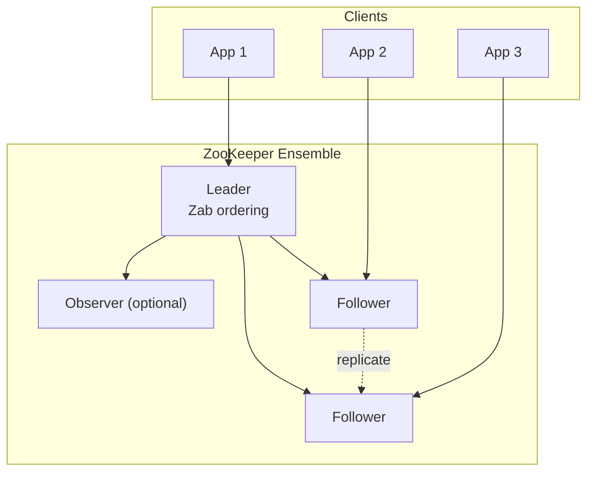
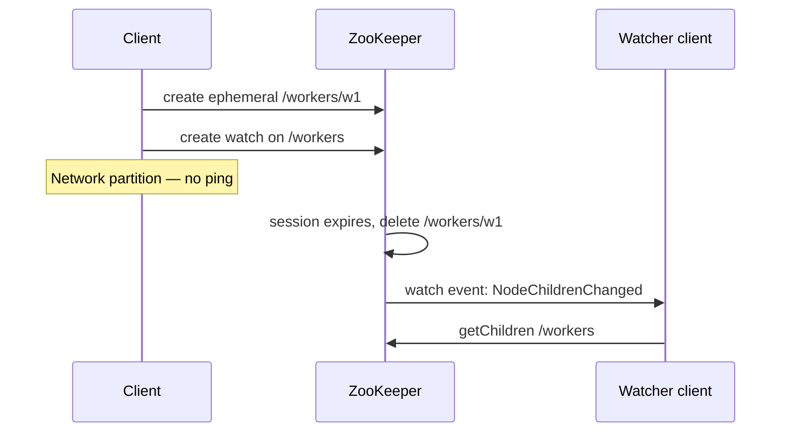
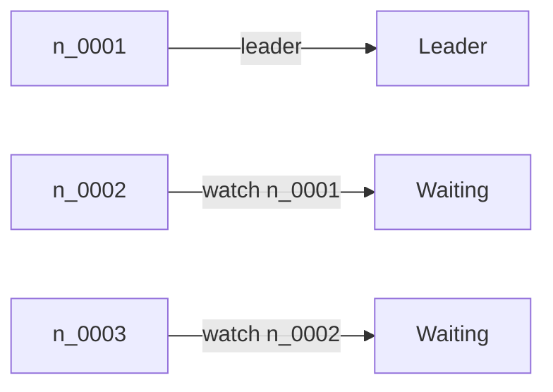

# Apache ZooKeeper

## 1. Executive Summary

**Apache ZooKeeper** is a distributed coordination service designed for **low-volume, high-value metadata**: configuration, naming, group membership, leader election, and distributed locks. Clients interact with a **hierarchical namespace** of **znodes** (data nodes) through a simple API—create, read, update, delete, and **watch** for changes. ZooKeeper's correctness rests on **Zab (ZooKeeper Atomic Broadcast)**, a consensus protocol specialized for **primary-backup atomic broadcast** of state transitions, closely related to Paxos but optimized for ZooKeeper's write-ahead log and in-memory data tree.

ZooKeeper optimizes for **strong consistency**, **sequential ordering** of updates, and **wait-free reads** from local replica state after sync—not for large payloads or high write throughput. It has been the coordination backbone for Hadoop, Kafka (legacy), HBase, Solr, and countless custom distributed systems. Understanding ZooKeeper is essential for principal architects evaluating **coordination vs. data plane** separation, **watch-driven reactive architectures**, and migration paths to etcd and Consul.

This chapter covers the data model, session semantics, Zab's role, recipes (locks, leader election), failure behavior, operational limits, and interview depth.

## 2. Why This Topic Matters

ZooKeeper embodies the **coordination service** pattern: a small, strongly consistent cluster holds metadata while data systems scale horizontally. Interviewers probe:

- **Znodes, ephemeral nodes, sequential nodes** and their failure-detection semantics.
- **Watches** (one-time, latency, herd effects).
- **Session expiration** vs **connection loss**.
- How **Zab** differs from **Raft** (historical and practical).
- When ZooKeeper is the wrong tool (large values, high QPS, multi-datacenter latency).

Architects maintaining legacy stacks or designing Kafka/Hadoop ecosystems must know ZooKeeper's guarantees and limits. Greenfield designs often choose **etcd** or **Consul**, but ZooKeeper concepts (ephemeral sequential locks) persist in libraries and interview questions.

## 3. Problems Being Solved

| Problem | ZooKeeper mechanism |
|---------|---------------------|
| **Distributed configuration** | Persistent znodes; watches notify changes |
| **Service discovery (basic)** | Ephemeral registration znodes |
| **Leader election** | Ephemeral sequential nodes; lowest sequence wins |
| **Distributed locks** | Sequential ephemeral + watch predecessor |
| **Group membership** | Ephemeral children under group path |
| **Barrier / queue** | Sequential nodes + watch patterns |

ZooKeeper does **not** solve bulk storage, transactional multi-key updates across arbitrary keys at scale, or Byzantine coordination.

## 4. Assumptions and System Model

| Assumption | ZooKeeper treatment |
|------------|---------------------|
| **Crash-stop failures** | Standard model; no Byzantine |
| **Majority quorum (Zab)** | Typically 3 or 5 servers (ensemble) |
| **Partial synchrony** | Timeouts for session expiration and leader election |
| **Small data** | Znode size limit (default 1 MB—verify deployment config) |
| **Ordered writes** | Total order of state changes via Zab |
| **Client sessions** | Heartbeats maintain session; ephemeral nodes tied to session |

**Client model:** Clients connect to one server; follow redirects; maintain session with periodic pings. Reads may be served locally after **sync**; writes go through **leader**.

**Not assumed:** Linearizable reads by default without `sync()`; automatic sharding; geo-replication with single ensemble.

## 5. Essential Terminology

| Term | Definition |
|------|------------|
| **Ensemble** | ZooKeeper cluster (usually odd size) |
| **Znode** | Node in hierarchical namespace (like filesystem path) |
| **Persistent znode** | Survives client disconnect |
| **Ephemeral znode** | Deleted when session expires |
| **Sequential znode** | Name suffixed with monotonic sequence |
| **Session** | Client connection state with timeout |
| **Watch** | One-time notification on znode change |
| **Zab** | ZooKeeper Atomic Broadcast protocol |
| **Leader / Follower** | Zab roles; leader orders writes |
| **Observer** | Replicates without voting (scale reads) |
| **ACL** | Per-znode access control |
| **Data tree** | In-memory hierarchy + persistent snapshot/log |
| **zxid** | ZooKeeper transaction id (64-bit: epoch + counter) |

**zxid structure:** High 32 bits epoch (leader era); low 32 bits transaction counter—serves as logical timestamp for ordering.

## 6. Core Mechanism

### 6.1 Architecture overview



*Figure 1: Clients talk to any server; writes flow to leader; Zab replicates state machine transitions.*

### 6.2 Data model and API

- Namespace is tree-structured: `/app/config`, `/services/db`.
- Each znode has **data**, **ACL**, **version** (for optimistic concurrency), **children**.
- **Sequential create:** `/lock/lock-` → `/lock/lock-0000000003`.
- **Ephemeral:** removed on session end—critical for failure detection.

**Version checks:** `setData(path, data, version)` fails with `BADVERSION` if stale—optimistic locking primitive.

### 6.3 Sessions and ephemeral nodes

1. Client connects; negotiates session timeout.
2. Client sends **ping** before timeout elapses.
3. On prolonged disconnect, session **expires**; ephemeral nodes deleted.
4. Other clients' watches fire—trigger failover, lock release, membership update.



*Figure 2: Session expiration removes ephemeral nodes and delivers one-time watches.*

### 6.4 Zab and write path

Writes proceed through **leader**:

1. Client sends write to any server; forwarded to leader if needed.
2. Leader assigns **zxid**, appends to transaction log, applies to memory tree.
3. Zab broadcasts to followers; **quorum ACK** before acknowledging client.
4. Leader responds success.

Reads on follower may be **stale** unless client calls **`sync()`** before read to ensure linearizable read (at cost of RTT to leader).

**Relationship to Raft:** Both provide ordered replicated log; Zab predates Raft's popularization; ZooKeeper 3.x documentation describes Zab as primary-backup atomic broadcast. See [Zab](/docs/consensus/zab) prerequisite chapter.

### 6.5 Watches

- **One-time:** watch triggers once; must re-register.
- **Latency:** notification after change committed—not a real-time stream guarantee.
- **Herd effect:** many clients watching same node all wake on change—use **sequential lock** pattern to serialize.

### 6.6 Leader election recipe (conceptual)

1. Create **ephemeral sequential** `/election/n_`.
2. List children of `/election`; if self is **lowest sequence**, become leader.
3. Else **watch** immediate predecessor (not all nodes—avoids herd).
4. On predecessor deletion, re-evaluate.



*Figure 3: Sequential ephemeral election—lowest sequence leads; others watch predecessor only.*

## 7. Step-by-Step Walkthrough

### Walkthrough A: Configuration update

1. Admin writes `/app/feature_flag` = `on` via leader path.
2. Quorum persists; zxid advances.
3. Clients with watches receive `NodeDataChanged`.
4. Clients re-read znode and re-register watch.

### Walkthrough B: Worker registration

1. Worker creates ephemeral `/workers/host-42`.
2. Scheduler lists `/workers` for live workers.
3. Worker JVM killed; no heartbeat; session expires.
4. Ephemeral node removed; scheduler watch fires; work reassigned.

### Walkthrough C: Distributed lock (Curator pattern)

1. Client creates `/locks/lock-0007` sequential ephemeral.
2. Lists `/locks`; sees `lock-0003` is lowest—holder is another client.
3. Watches `lock-0006` (immediate predecessor).
4. Holder releases (session end or delete); `0007` becomes lowest; acquires lock.

### Walkthrough D: Split brain prevention

Zab ensures **one leader** ordering writes at a time per ensemble. Clients must not assume two ensembles without **fencing** across them—**never run two independent ensembles** for same logical cluster.

### Walkthrough E: Read staleness

1. Client reads flag from follower immediately after another client writes.
2. Without `sync()`, may see old value.
3. Client calls `sync()` then `getData()` for linearizable read.

### Walkthrough F: Multi-transaction batch (multi API)

ZooKeeper supports **multi** operations that execute atomically when all compare clauses succeed:

1. Client sends `multi` with `check /config/version == 5` and `setData /config ... version 5`.
2. Leader assigns single zxid to entire batch.
3. Either all ops apply or none—useful for consistent config updates without race between readers.

Verify ZooKeeper version for exact `multi` semantics and limits on operation count.

### Walkthrough G: Observer read scaling

1. Deploy observers in a read-heavy analytics cluster that lists znodes frequently.
2. Observers receive transaction stream without voting.
3. **Caution:** observers may lag; do not use for linearizable reads without `sync()` to a voting follower or leader.

### Capacity planning notes

ZooKeeper performance degrades when **outstanding requests**, **large child lists**, or **watch count** grow unbounded. Principal architects set **guardrails**: maximum children per znode (shard lock paths), maximum watch registrations per service instance, and alerting on `approximate_data_size` and `latency` four-letter stats (admin access only).

## 8. Invariants and Guarantees

### 8.1 Safety (from Zab and design)

| Property | Statement |
|----------|-----------|
| **Linearizable writes** | All updates totally ordered by zxid |
| **Atomicity** | Each zxid is all-or-nothing state transition |
| **Durability** | Committed transactions survive on quorum |
| **Sequential consistency of client ops** | Per-client order preserved |

### 8.2 Liveness

- **Session maintenance** requires timely pings—GC pauses can cause session loss.
- **Leader election** completes when quorum available (partial synchrony).
- **Watches** do not guarantee delivery if client slow—session may expire first.

### 8.3 Ephemeral node invariant

When session S expires, all ephemeral znodes created by S are removed **atomically** from the tree (from clients' perspective, in order relative to subsequent events).

### 8.4 What ZooKeeper does not guarantee

- **Size or throughput** SLAs for large payloads.
- **Multi-op transactions** across unrelated keys before multi-compare (ZK supports **multi** transaction API for related ops—verify version).
- **Automatic fencing** of external databases—recipes provide locks; apps enforce at resource.

## 9. Failure Scenarios

| Failure | Behavior |
|---------|----------|
| **Leader crash** | Followers elect new leader; brief write unavailability |
| **Minority partition** | Cannot form quorum; writes fail (CP) |
| **Client GC pause > session timeout** | Session expires; ephemeral nodes lost; false failure detection |
| **Watch storm** | Many clients react to same event—throttle with sequential pattern |
| **Disk full on leader** | Cluster unhealthy; ops emergency |
| **Rolling restart without quorum plan** | Risk ensemble unavailability |
| **Observer lag** | Stale reads if reading from observer without care |
| **Misconfigured tickTime** | Session timeouts cluster-wide; cascading false failures |
| **ACL misconfiguration** | Clients denied; appears as "cluster down" to apps |

### Incident pattern: "ZK session expired" storm

When many clients lose sessions simultaneously (ensemble restart, network blip, tickTime change), ephemeral nodes vanish in bulk—triggering **mass worker re-registration**, **lock re-acquisition storms**, and **cascading load**. Mitigation: rolling restarts maintaining quorum; staged config changes; client backoff with jitter on reconnect.

## 10. Performance Characteristics

| Aspect | Typical behavior |
|--------|------------------|
| Write throughput | Thousands/sec per ensemble (deployment-dependent) |
| Read throughput | Higher on followers; observers scale reads |
| Latency | ~1–10 ms LAN per write (implementation-dependent) |
| Payload size | Keep znodes small (kilobytes) |
| Watch fan-out | Leader processes watch deliveries—can bottleneck |

**Rule of thumb:** coordination traffic only—not a database.

## 11. Scalability Limits

- **Vertical:** single ensemble handles limited write rate.
- **Observers:** add read capacity without vote weight.
- **No native sharding:** multiple ensembles for separate domains.
- **Geographic stretch:** high latency on writes; not designed for WAN quorum.

## 12. Operational Considerations

- **Ensemble size:** 3 or 5 nodes; avoid even counts.
- **Dedicated disks:** transaction log and snapshots on separate SSD paths.
- **JVM heap:** tune carefully; avoid large heaps (long GC → session timeout).
- **sessionTimeout:** balance failure detection vs false positives (often 2–4× tick time).
- **Four-letter words:** `mntr`, `stat` for health—secure in production (firewall/admin only).
- **Upgrades:** rolling restarts maintaining quorum.
- **Backup:** snapshot + txn log; test restore.

### Kafka migration note

Modern Kafka uses **KRaft** (Raft) instead of ZooKeeper. Legacy operations still encounter ZK—plan migration timelines. Verify current Kafka version docs.

### JVM and session tuning (expanded)

Long **GC pauses** are the most common cause of **false session expiration** in production ZooKeeper clients. Mitigations used in mature deployments:

- Keep JVM heaps **moderate** (often 4–8 GB range—environment-specific); avoid massive heaps that trigger multi-second collections.
- Set `sessionTimeout` to at least **2–4×** measured p99 GC pause plus network jitter.
- Use **JMX** and GC logs to correlate session loss events with pause times.
- Prefer **dedicated** ensemble hardware; noisy neighbors on shared VMs inflate tail latency.

These are **implementation and operational choices**—not formal ZK guarantees—but they separate stable ensembles from flaky ones in principal interviews.

## 13. Security Considerations

- **ACLs:** `world`, `auth`, `digest`, `ip` schemes; restrict znode paths.
- **TLS/SASL:** enable for client-server and quorum communication in production.
- **No encryption at rest** by default—sensitive config should be encrypted at application layer.
- **Four-letter commands:** disable or restrict (`4lw.commands.whitelist`).

## 14. Cost Considerations

- Three dedicated ZK nodes (VMs or instances) per ensemble.
- Operational expertise for JVM tuning and upgrade choreography.
- Migration to managed coordination (cloud vendor) vs self-hosted TCO.

## 15. Production Implementations

| System | ZooKeeper usage |
|--------|-----------------|
| **Apache Kafka (legacy)** | Controller election, metadata |
| **Hadoop HDFS** | NameNode HA (with journal nodes) |
| **HBase** | Master coordination |
| **SolrCloud** | Cluster state |
| **Apache Curator** | Client recipes library |
| **Accumulo, Druid (historical)** | Coordination patterns vary—verify version |

## 16. Alternatives and Tradeoffs

| Alternative | When |
|-------------|------|
| **etcd** | Kubernetes-native; gRPC; Raft |
| **Consul** | Service discovery + mesh integration |
| **Database advisory locks** | Simple; not partition-safe alone |
| **Embedded Raft (KRaft)** | Remove ZK dependency |
| **Cloud vendor coordination** | AWS, GCP managed offerings |

Choose ZooKeeper when **mature Hadoop ecosystem** integration matters; prefer etcd/Consul for **new cloud-native** stacks.

## 17. Common Misconceptions

| Misconception | Reality |
|---------------|---------|
| "ZK is a database" | Coordination; small data, low write rate |
| "Watches are persistent subscriptions" | One-time; must reset |
| "Reads are always linearizable" | Follower reads may be stale without sync |
| "Ephemeral nodes instant on crash" | Session timeout delay |
| "More ZK nodes = more write scale" | Writes go through leader; observers help reads |

## 18. Principal Architect Perspective

- **Coordination plane vs data plane:** never store application payloads in ZK.
- **Session timeout vs GC:** size JVM and timeouts together; chaos test pauses.
- **Recipe libraries:** use Curator rather than homegrown lock logic.
- **Deprecation awareness:** plan ZK exit for Kafka and other migrations.
- **Fencing:** ZK lock ≠ fenced storage—bridge with tokens at DB layer.

### Organizational implications

Teams operating ZooKeeper ensembles need **dedicated platform ownership**—not ad-hoc JVM tuning by application squads. Runbooks for **rolling restart**, **snapshot restore**, and **ensemble expansion** should be tested quarterly. Incident response must distinguish **ZK unavailability** (coordination down) from **downstream service failure** (workers not registering)—different escalation paths and customer impact.

### When to migrate off ZooKeeper

Greenfield systems rarely choose ZK unless bound to Hadoop-era dependencies. Migration triggers include: Kafka KRaft cutover deadlines, difficulty hiring ZK expertise, multi-cloud footprint favoring etcd/gRPC, or recurring session-timeout incidents from GC. Migration plans must address **dual-write**, **cutover windows**, and **recipe equivalence** in target system.

## 19. Architecture Review Exercise

**Scenario:** Team stores 500 KB JSON configs in ZK; 10k updates/sec; watches on parent znode for every microservice.

**Findings:** Violates ZK sweet spot; watch storm; leader bottleneck. **Recommend:** config service with polling/CDN, or etcd with compaction strategy; keep ZK for true coordination only.

## 20. Whiteboard Explanation

"ZooKeeper is a replicated coordination service. Clients see a file-like tree of znodes. Writes go through a leader and are totally ordered by Zab into zxids. Ephemeral nodes disappear when a client's session expires—that's how we detect worker death. Sequential nodes give us ordered lock queues. Watches are one-time notifications so services react to config changes. It's CP: minority partition can't write. It's not for big data or high write rates—it's for locks, leader election, and metadata."

## 21. Interview Questions

1. **What is ZooKeeper used for?** — Coordination: config, locks, membership, election.
2. **Ephemeral vs persistent znodes?** — Ephemeral tied to session.
3. **How does leader election recipe work?** — Sequential ephemeral; lowest wins; watch predecessor.
4. **Watch semantics?** — One-time; re-register after event.
5. **Zab vs Raft?** — Both ordered broadcast; different history/API.
6. **Linearizable reads?** — Use sync() before read from follower.
7. **Session expiration cause?** — Missed heartbeats, GC pause, partition.
8. **Why odd ensemble size?** — Majority quorums.
9. **Observer role?** — Replicate without voting; scale reads.
10. **Herd effect?** — All watch same node; fix with sequential watch pattern.
11. **What is zxid?** — 64-bit transaction id combining epoch and counter.
12. **Can ZK replace a database?** — No; coordination only, small payloads.

### Scoring rubric (principal loop)

| Signal | Strong | Weak |
|--------|--------|------|
| Session model | Explains heartbeat + expiry + ephemeral cleanup | Vague "connection" |
| Lock recipe | Sequential + watch predecessor | create/delete race |
| Consistency | Distinguishes write order vs stale read | "always consistent" |
| Ops | JVM/GC, quorum rolling restart | "just add nodes" |

## 22. Interview Follow-Ups

1. **Design service discovery on ZK.** — Ephemeral registrants + watchers; handle stale sessions.
2. **GC pause killing session?** — Tune heap, timeout, or use less sensitive coordination.
3. **Compare etcd watches.** — etcd MVCC watch stream vs ZK one-time watches.
4. **Kafka without ZK?** — KRaft metadata quorum.
5. **Multi-datacenter ZK?** — Generally avoid single ensemble across WAN.

## 23. Strong Answer Example

**Question:** "How would you implement a distributed lock with ZooKeeper?"

**Strong outline:** "I'd use an ephemeral sequential node under a lock path. Each contender creates `/locks/lock-` with sequential and ephemeral flags. I list children, sort by sequence. If my node has the lowest sequence, I hold the lock. Otherwise I set a watch only on the node immediately before mine—not on the parent—to avoid herd effects. When the predecessor disappears, I recheck. The lock is automatically released if my session dies because ephemeral nodes are removed. For writing to a shared database I'd still pair this with fencing tokens at the storage layer because ZK only coordinates; it doesn't fence PostgreSQL."

## 24. Weak Answer Example

**Weak:** "Create a znode and delete it when done. Everyone checks if it exists."

**Red flags:** No ephemeral/sequential; race on create; no watch; no session failure handling; not herd-safe.

## 25. Hands-On Exercise

1. Start local 3-node ZK ensemble (Docker or zkServer.sh).
2. Create ephemeral sequential nodes; simulate leader election.
3. Register watch; change znode from another client; observe one-time delivery.
4. `kill -STOP` a client; wait for session timeout; verify ephemeral deletion.
5. Use Curator `LeaderSelector` or `InterProcessMutex` and trace znode paths.

## 26. Knowledge Check

1. What is a znode?
2. Purpose of zxid?
3. Ephemeral node lifecycle?
4. When is watch delivered?
5. Write path through which server role?
6. Observer vs follower?
7. sync() purpose?
8. Sequential node naming?
9. Default znode size limit order of magnitude?
10. CP or AP under partition?
11. Curator's value?
12. Session vs connection?

## 27. Flashcards

| Front | Back |
|-------|------|
| Ensemble | ZK cluster, usually 3 or 5 |
| Ephemeral znode | Deleted on session expiry |
| Sequential znode | Name + monotonic suffix |
| zxid | Transaction id: epoch + counter |
| Zab | Atomic broadcast protocol |
| Watch | One-time change notification |
| sync() | Linearizable read barrier |
| Observer | Non-voting replica for reads |
| Herd effect | Many watchers wake together |
| Leader election recipe | Lowest sequential ephemeral wins |
| Session timeout | Missed pings → expiry |
| Curator | Java recipes for ZK patterns |

## 28. Cheat Sheet

```
DATA MODEL: tree of znodes, small payloads

NODE TYPES
  persistent | ephemeral | sequential (combinable)

WRITE PATH: client → leader → Zab quorum → ack

READS: follower local (may be stale); sync() for linearizable

SESSION: heartbeats; expiry deletes ephemeral nodes

LOCK RECIPE
  EPHEMERAL_SEQUENTIAL create
  lowest seq = holder
  else watch predecessor only

OPS: odd ensemble, JVM/GC tuning, secure 4lw

NOT FOR: bulk data, high write QPS, WAN quorum
```

## 29. Related Concepts

- [Zab](/docs/consensus/zab) — prerequisite; broadcast protocol
- [Raft Consensus](/docs/consensus/raft) — modern comparison
- [Leader Election](/docs/consensus/leader-election) — recipes and theory
- [Fencing Tokens](/docs/consensus/fencing-tokens) — storage safety with ZK locks
- [etcd](/docs/consensus/etcd) — alternative coordination service
- [Consensus Problem](/docs/consensus/consensus-problem) — specification background

## 30. References

### Primary sources (formal guarantees)

- Junqueira, F. P., Reed, B. C., & Serafini, M. (2011). *ZooKeeper: Wait-free coordination for Internet-scale systems.* USENIX ATC. [Zab, data model, sessions]
- Hunt, P., et al. (2010). *ZooKeeper: Wait-free coordination for Internet-scale systems* (original Yahoo! design). [Coordination primitives]
- Apache ZooKeeper documentation: https://zookeeper.apache.org/doc/current/

### Implementation-oriented

- Apache Curator: https://curator.apache.org/
- ZooKeeper Programmer's Guide (recipes: locks, leader election)

### Books

- Kleppmann, M. (2017). *Designing Data-Intensive Applications.* O'Reilly. [Chapter 9 coordination services]

### Distinction

- **Formal guarantees** — Total order of writes, durability on quorum from Zab documentation and paper.
- **Implementation choices** — Observer nodes, ACL schemes, tickTime/sessionTimeout tuning.
- **Operational experience** — GC/session incidents; verify JVM and timeout settings in production.
