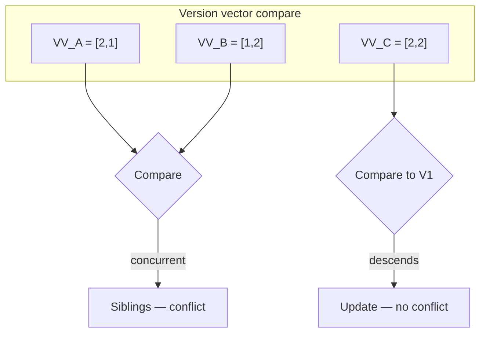
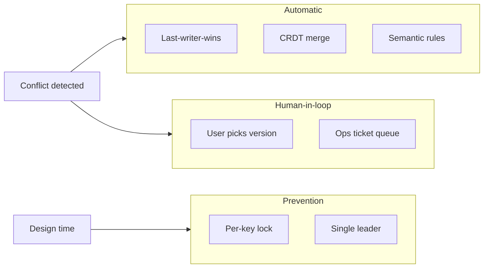
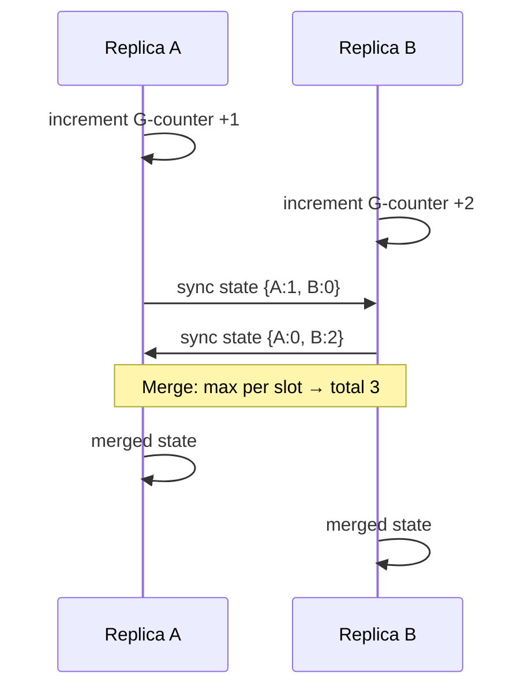

# Conflict Resolution

## 1. Executive Summary

**Conflict resolution** is the set of policies and mechanisms that determine how a replicated system converges when **concurrent or divergent writes** produce incompatible versions of the same data. In primary-secondary replication, conflicts are avoided by serializing writes at a single leader; in **multi-leader** and **leaderless** systems, conflicts are **expected**. Resolution strategies span the spectrum from **automatic** (last-writer-wins, CRDT merge) to **manual** (user chooses in UI) to **application-specific** (merge functions, business rules). Kleppmann (*DDIA*, Chapters 5 and 9) argues that **the application must own merge semantics** for anything beyond trivial datatypes—infrastructure can detect concurrency but cannot guess business meaning.

This chapter covers conflict **detection** (version vectors, revision trees, hybrid logical clocks), **resolution policies** (LWW, multi-value register, custom merge), **CRDTs** (state-based vs operation-based), operational and product implications, and principal-level criteria for choosing automatic vs escalated resolution. Understanding conflict resolution connects replication topology to **data integrity**, **user experience**, and **compliance**.

## 2. Why This Topic Matters

Conflict resolution is where **distributed systems theory meets product design**. Principal architects who propose multi-leader or leaderless replication without a conflict strategy are outsourcing failure to support teams. Interviewers probe:

- Difference between **detection** and **resolution**.
- Why **LWW with wall clocks** causes silent data loss.
- When **CRDTs** apply vs when they do not (registers vs inventory).
- **Idempotent** merge and **commutative** operations.
- Organizational ownership: who writes the merge function?

Production incidents from poor conflict handling include: calendar double-bookings, inventory oversell, merged documents losing paragraphs, and audit trails that cannot explain which write "won." Kleppmann and Shapiro et al. (CRDT paper) are essential references; Herlihy & Wing's linearizability provides the contrast—**avoid conflicts** vs **resolve conflicts**.

Conflict resolution is also where **product and legal** stakeholders enter architecture: GDPR right-to-erasure may require tombstones that CRDT sets accumulate; financial auditors may reject LWW without retained history. Principal architects facilitate these conversations early—merge policy is not purely an engineering optimization problem.

The replication trilogy—[primary-secondary](/docs/replication/primary-secondary-replication), [multi-leader](/docs/replication/multi-leader-replication), [leaderless](/docs/replication/leaderless-replication)—each implies a different conflict frequency; this chapter is the mandatory companion when conflicts are possible.

For interview preparation, practice drawing the **detection vs resolution** pipeline on a whiteboard in under 60 seconds—version vector compare on the left, policy spectrum (LWW, CRDT, manual) on the right. Interviewers use this to separate candidates who memorized buzzwords from those who can design merge ownership.

## 3. Problems Being Solved

| Problem | Resolution approach |
|---------|---------------------|
| Concurrent multi-leader writes | Detect + merge policy |
| Leaderless sibling reads | Return siblings or auto-merge |
| Offline client sync | Queue replay + conflict on reconnect |
| Partition heal divergence | Anti-entropy + merge |
| Human-edited shared state | UI merge (Google Docs OT/CRDT) |
| Counter and set aggregation | CRDT counters, OR-sets |
| Regulatory audit | Preserve history; avoid silent LWW |

Conflict resolution does **not** replace **preventing conflicts** where possible (single leader, locking, reservations).

## 4. Assumptions and System Model

Assume replicas may hold **multiple versions** until convergence:

- **Concurrency** defined by version metadata—not wall clock alone.
- **Merge function** must be **deterministic** across replicas for automatic convergence (CRDT: associative, commutative, idempotent where required).
- **Application invariants** (balance ≥ 0) may be **violated** by automatic merge—requires domain logic.
- **Quiescence** after merge yields single resolved value per policy.

**Safety:** No permanent unresolved divergence if repair and merge complete (eventual consistency safety).

**Liveness:** System continues accepting writes; conflicts may accumulate until resolved—**backlog risk**.

**Not assumed:** CRDTs solve all datatypes; LWW is conflict-free; users accept silent merges.

## 5. Essential Terminology

| Term | Definition |
|------|------------|
| **Conflict** | Incompatible concurrent versions of same logical object. |
| **Sibling** | Coexisting versions not ordered by happens-before. |
| **Version vector** | Per-replica counters detecting concurrency. |
| **Revision tree** | CouchDB-style branching `_rev` history. |
| **LWW (last-writer-wins)** | Pick version with highest timestamp. |
| **MVR (multi-value register)** | Return all concurrent values to application. |
| **CRDT** | Conflict-free replicated data type—algebraic merge. |
| **State-based CRDT** | Merge full states (G-counter, G-set). |
| **Op-based CRDT** | Replay commutative operations. |
| **Semantic merge** | Domain function (union cart, max inventory). |
| **Tombstone** | Deletion marker in CRDT sets—garbage collection issue. |
| **Hybrid logical clock (HLC)** | Wall time + logical counter for ordering. |

**Mnemonic:** **Detect first, resolve with policy**—never assume infra knows business rules.

## 6. Core Mechanism

### Detection pipeline

1. Write carries version metadata (vector, HLC, or `_rev`).
2. On replicate or read, compare incoming vs local version.
3. If one **descends** the other → replace (not a conflict).
4. If **concurrent** → conflict; invoke resolution policy.
5. Persist merged result; propagate to peers.

### Version vector comparison



*Figure 1: Concurrent vectors produce siblings; strict descendant replaces without conflict.*

### Resolution policy spectrum



*Figure 2: Resolution ranges from automatic merge to prevention via single writer.*

### CRDT merge convergence



*Figure 3: G-counter CRDT merges by per-replica max—deterministic convergence without conflict UI.*

## 7. Step-by-Step Walkthrough

**Scenario:** Shared shopping cart; leaderless; vector clocks; three items \{A,B,C\}.

| Step | Event | Resolution |
|------|-------|--------------|
| 1 | US client adds item A | VV=[1,0,0] |
| 2 | EU client adds item B concurrently | VV=[0,1,0] |
| 3 | Read returns siblings | App policy: **union** cart |
| 4 | US removes A while EU adds C | Concurrent again |
| 5 | Naive LWW on whole cart | **Loses** A removal or C add |
| 6 | Field-level CRDT set (OR-set) | Items merge correctly |
| 7 | Checkout reads QUORUM | Final merged cart charged |

**Insight:** Cart union is a **semantic** policy—vector clocks only detect that merge is needed.

## 8. Invariants and Guarantees

| Policy | Safety (convergence) | Data loss risk | Invariant preservation |
|--------|------------------------|----------------|------------------------|
| LWW (wall clock) | Converges | **High** | Poor |
| LWW (HLC) | Converges | Medium | Poor for rich types |
| Version vector + app merge | Converges if merge deterministic | Low if merge correct | App-dependent |
| CRDT (correct type) | Converges | Low for supported ops | Type-specific |
| Manual UI | Converges when user acts | Low visibility | User-dependent |
| Single leader | No write conflicts | N/A | Strongest prevention |

**Safety:** Deterministic merge → all replicas agree after sync. **Liveness:** Manual queues can block if users don't resolve.

Formal CRDT guarantees: **strong eventual consistency**—all replicas converge to same state without coordination if merge is applied (Shapiro et al.).

## 9. Failure Scenarios

### Scenario 1: Silent LWW data loss

**Setup:** Two editors; EU clock ahead; both edit title.

**Effect:** One edit vanishes—no audit trail.

**Mitigation:** MVR + UI; CRDT text; never wall-clock LWW on content.

### Scenario 2: Wrong CRDT for datatype

**Setup:** G-counter used for bank balance allowing decrement.

**Effect:** CRDT math wrong—**invariant violated**.

**Mitigation:** PN-counter with bounds; or don't use CRDT for signed balance.

### Scenario 3: Tombstone accumulation

**Setup:** OR-set removals leave tombstones forever.

**Effect:** Storage bloat; slow merges.

**Mitigation:** Garbage collection with causal stability window.

### Scenario 4: Non-deterministic merge

**Setup:** Merge uses `random()` or local timezone.

**Effect:** Replicas diverge permanently—**safety violation**.

**Mitigation:** Pure functions; test merge across all pairs.

### Scenario 5: Conflict queue overload

**Setup:** 10k siblings; no auto-merge.

**Effect:** Product unusable; ops drowning.

**Mitigation:** Auto-merge safe fields; partition keys; rate limits.

### Scenario 6: Merge policy change in production

**Setup:** Deploy changes cart merge from union to LWW without migration.

**Effect:** Historical siblings resolved differently on old vs new replicas until full repair—**temporary divergence** of business semantics.

**Mitigation:** Version merge policies; replay merge on all replicas; feature flag with backfill job.

## 10. Performance Characteristics

| Approach | CPU on merge | Storage metadata | Client complexity |
|----------|--------------|------------------|-------------------|
| LWW | O(1) | Timestamp | Low |
| Vector clock | O(replicas) compare | O(replicas) per object | Medium |
| CRDT state | O(state size) | Can be large (tombstones) | Medium-high |
| OT (collaborative) | O(ops) transform | Op log | High |
| Manual | Human time | Full history helpful | UX heavy |

Hot keys with frequent conflicts: merge cost dominates—**prevention** cheaper than resolution at scale.

**Latency of resolution on read path:** Returning siblings to the client and waiting for application merge increases read latency versus a single-version response. Systems that hide conflicts behind automatic LWW appear faster but externalize data loss to support tickets. Principal tradeoff: pay latency for MVR + merge upfront, or pay incident cost for silent LWW later.

**Testing concurrent histories:** Kleppmann recommends simulating random interleavings of operations across replicas—Jepsen-style tests for merge functions. A merge that works for two siblings may fail for three-way concurrency if associativity was assumed without proof. Budget engineering time for **linearization checking** on critical merge paths before shipping multi-leader features to production.

## 11. Scalability Limits

- **Sibling count:** Unbounded without pruning—reads degrade.
- **Vector clock size:** Grows with replica count—cap or use dotted version vectors.
- **CRDT state:** Some types don't compact (tombstones, OR-sets).
- **Human merge:** Doesn't scale past small teams.
- **Semantic merge complexity:** Arbitrary merge functions hard to test combinatorially.

**Rule of thumb:** Minimize conflict **surface** (partition data) before optimizing merge **speed**.

## 12. Operational Considerations

- **Metrics:** Conflict rate, sibling count p99, unresolved queue depth, merge latency.
- **Alerting:** Spike in conflicts after deploy—schema or routing bug.
- **Runbooks:** Escalate unmergeable conflicts; replay from event log.
- **Testing:** Property-based tests for merge associativity/commutativity.
- **Documentation:** Per-entity merge policy in architecture decision record.
- **Postmortems:** Capture lost writes from LWW with user impact quantification.

## 13. Security Considerations

- **Attacker chooses winning LWW** with forged timestamp—use signed versions or logical clocks.
- **Merge injection:** Malicious replica sends crafted CRDT state—validate schema and bounds.
- **Conflict UI social engineering:** "Pick version" dialogs may trick users—show diff clearly.
- **Audit:** Regulatory environments may **forbid** silent auto-merge—immutable event log required.

## 14. Cost Considerations

- **Engineering:** CRDT/OT expertise expensive; LWW cheap until incident cost.
- **Storage:** Keeping full version history for audit multiplies storage.
- **Support:** User-visible conflicts drive tickets—invisible in cloud bill.
- **Compute:** Anti-entropy + merge on hot keys increases CPU.

**Decision criterion:** Invest in CRDT/semantic merge when conflict rate × business impact exceeds prevention cost (e.g., sharding, single leader).

## 15. Production Implementations

### CouchDB / Cloudant

Explicit `_conflicts` array; application must resolve—**honest conflict model**.

### Amazon Dynamo (paper)

Vector clocks; siblings returned to client; **application merge** required.

### Riak

Vector clocks with sibling proliferation lessons—motivated simpler datatypes.

### Automerge / Yjs (collaborative text)

CRDT/OT libraries for real-time docs—production in Notion-like products (verify per product).

### Redis CRDT module (historical)

Module provided CRDT types—check current Redis offering; may differ.

### Salesforce / mobile sync platforms

Field-level last-modified and server-side merge rules—**implementation-specific**.

**Distinction:** Formal CRDT guarantees apply to **specified types**—not to arbitrary JSON blobs without design.

## 16. Alternatives and Tradeoffs

| Strategy | Pros | Cons |
|----------|------|------|
| Prevention (single leader) | No conflicts | Latency, availability |
| LWW | Simple | Silent loss |
| MVR + app merge | Flexible | App burden |
| CRDT | Auto convergence | Limited types, metadata |
| OT | Rich text | Complexity, central server sometimes |
| Event sourcing | Full audit | Replay merge logic needed |
| Pessimistic lock | No concurrent write | Availability, partition fragility |

Kleppmann: **custom code conflict resolution** is valid when domain rules are clear (shopping cart union).

## 17. Common Misconceptions

| Misconception | Reality |
|---------------|---------|
| "CRDTs fix everything" | Only for designed datatypes. |
| "LWW is eventual consistency" | It converges but may lose data. |
| "Database resolves conflicts" | Usually detects or LWW—app owns semantics. |
| "Conflicts mean bugs" | Normal in multi-leader/leaderless. |
| "Bigger vector clock always better" | Metadata cost; dotted vectors exist. |
| "Merge once at read" | Must persist merge for convergence. |

## 18. Principal Architect Perspective

1. **Entity-level policy matrix**—document per data type, not one global rule.
2. **Never wall-clock LWW** on user content across regions.
3. **Test merges** like you test payment logic—property tests + chaos histories.
4. **Product must see conflicts** when auto-merge isn't safe—silent loss is worse than a dialog.
5. **Prefer prevention** for money, inventory, uniqueness; **CRDT** for counters/likes; **OT/CRDT** for text.

Shapiro et al.: CRDTs give **strong eventual consistency**—stronger than plain eventual, weaker than linearizable.

**Event sourcing angle:** Store immutable events; derive state by deterministic fold—conflicts become ordering problems with clear audit trail.

**Field-level vs document-level resolution:** Applying LWW to an entire JSON document when only one field conflicted destroys concurrent edits on non-conflicting fields—a classic multi-leader footgun. Field-level version vectors or embedded CRDTs per attribute allow independent merge of `title` and `tags` while detecting concurrency only where needed. The storage and API complexity rises, but so does correctness for collaborative products.

**Operational visibility:** Conflicts that resolve silently via LWW leave no artifact for support teams. Architectures that care about explainability should log merge decisions (inputs, policy, output hash) to an immutable audit stream—especially in regulated industries where "the database picked a winner" is not an acceptable incident narrative. CouchDB's explicit `_conflicts` array trades UX friction for honesty; that trade is often correct for B2B workflows with compliance requirements.

## 19. Architecture Review Exercise

**Scenario:** Multi-region task manager; tasks have title, assignee, due date, comment thread.

**Review prompts:**

1. Which fields can LWW? Which cannot?
2. Assignee uniqueness—one person or many?
3. Comment thread merge strategy?
4. Offline edit on mobile?
5. Compliance: retain deleted task history?

**Expected findings:** Title LWW risky; assignee needs OR-set or single-value with lock; comments append-only CRDT; deleted tasks tombstone with retention policy.

## 20. Whiteboard Explanation

**90-second version:**

> "When replicas diverge with concurrent writes, you first detect conflict using version vectors or revision trees—if neither version descends the other, they're siblings. Then you resolve: last-writer-wins is easy but loses data with clock skew. Multi-value register returns all versions to the app, which merges—like unioning a shopping cart. CRDTs are datatypes designed so merge is automatic and deterministic—counters, sets, registers—with strong eventual consistency. For collaborative text you use OT or CRDT libraries like Yjs. Kleppmann says the database can't know how to merge a calendar versus a cart—the application owns semantic merge. Principal architects document per-entity policies, measure conflict rate, and use prevention—single leader or locks—when automatic merge can't preserve invariants."

## 21. Interview Questions

1. **What is a replication conflict?**
   - *Signals:* Concurrent incompatible versions.

2. **How detect conflicts?**
   - *Signals:* Version vectors, revision trees, HLC compare.

3. **LWW dangers?**
   - *Signals:* Clock skew, silent data loss.

4. **What is a sibling?**
   - *Signals:* Concurrent versions from vector compare.

5. **CRDT definition?**
   - *Signals:* Type with associative/commutative/idempotent merge; SEC.

6. **State vs op-based CRDT?**
   - *Signals:* Merge states vs replay ops.

7. **Shopping cart merge policy?**
   - *Signals:* Union items—semantic, not LWW whole doc.

8. **When not use CRDT?**
   - *Signals:* Arbitrary constraints, inventory, uniqueness.

9. **MVR purpose?**
   - *Signals:* Expose all concurrent values to app.

10. **Deterministic merge why?**
    - *Signals:* All replicas must converge same result.

11. **CouchDB conflict UX?**
    - *Signals:* `_conflicts` array; app resolves.

12. **Prevent vs resolve?**
    - *Signals:* Single leader avoids; multi-leader must resolve.

13. **Tombstone problem?**
    - *Signals:* CRDT set deletions grow state.

14. **Strong eventual consistency?**
    - *Signals:* CRDT convergence without coordination.

## 22. Interview Follow-Ups

1. **Design merge for bank transfer?**
   - *Signals:* Don't CRDT balance; use ledger events + single writer or consensus.

2. **Test merge function?**
   - *Signals:* Associativity, commutativity, property-based random histories.

3. **HLC vs vector clock?**
   - *Signals:* HLC compact; vectors precise concurrency.

4. **Google Docs vs CouchDB?**
   - *Signals:* OT/CRDT real-time vs document siblings.

5. **Conflict rate SLO?**
   - *Signals:* Measure siblings per read; alert thresholds.

## 23. Strong Answer Example

**Question:** "How would you handle conflicts in a multi-region notes app?"

> "Personal notes are single-user keyed—partition by user ID so conflicts are rare; single home region leader with async replica reads is simplest. Shared notebooks need field-level strategy: title and body use Automerge or Yjs CRDT for text; tags use OR-set CRDT; last-edited metadata uses HLC for display only, not authoritative merge. Detect concurrency with version vectors on the document envelope. On sibling read, auto-merge where CRDT types apply; escalate to UI diff for binary attachments. Never wall-clock LWW on body text. Monitor sibling rate per notebook; above 5% concurrent edits, recommend splitting notebook or live session with single editor lock. Audit log stores ops for compliance. Kleppmann's point: cart union doesn't apply to prose—pick the right datatype per field."

## 24. Weak Answer Example

**Question:** "How would you handle conflicts in a multi-region notes app?"

> "Use eventual consistency. Timestamps decide the winner. Conflicts won't happen much."

**Why weak:** Ignores shared notebooks, LWW data loss, no CRDT/OT for text, no metrics, conflicts dismissed.

## 25. Hands-On Exercise

**Exercise: Merge property tester**

1. Implement version vector compare (dominates / concurrent).
2. Implement LWW and union-merge for a JSON cart object.
3. Generate random operation histories on two replicas; sync both ways.
4. Verify union merge converges; show LWW loses an item.
5. Add property test: merge(A,B) == merge(B,A) for union policy.

**Success criteria:** Prove non-commutative LWW fails convergence test; document one field needing CRDT.

## 26. Knowledge Check

1. Detection vs resolution? *(Detect=concurrent; resolve=pick/merge policy.)*
2. CRDT SEC means? *(Strong eventual consistency—all replicas agree.)*
3. Why deterministic merge? *(Convergence across replicas.)*
4. Sibling in CouchDB? *(Conflicting `_rev` branches.)*
5. OR-set use case? *(Tag set with add/remove merge.)*
6. When prevention beats resolution? *(Financial invariants, inventory.)*

## 27. Flashcards

| # | Front | Back |
|---|-------|------|
| 1 | Write conflict | Concurrent incompatible versions. |
| 2 | Version vector | Per-replica counters for concurrency. |
| 3 | Sibling | Concurrent versions—not ordered. |
| 4 | LWW | Highest timestamp wins—loss risk. |
| 5 | MVR | Return all concurrent values to app. |
| 6 | CRDT | Datatype with deterministic merge. |
| 7 | SEC | Strong eventual consistency (CRDTs). |
| 8 | Semantic merge | Domain rule—e.g., cart union. |
| 9 | Tombstone | Deletion marker in CRDT sets. |
| 10 | HLC | Hybrid logical clock for ordering. |
| 11 | Deterministic merge | Required for replica convergence. |
| 12 | App owns merge | Kleppmann—infra can't guess semantics. |

## 28. Cheat Sheet

```
DETECT
  - Version vector / _rev tree / HLC
  - Concurrent if neither descends

RESOLVE
  - LWW (risky), MVR + app, CRDT, manual UI
  - Must be deterministic for auto

CRDT TYPES
  - G-counter, PN-counter, OR-set, LWW-register
  - SEC without coordination

PREVENT
  - Single leader, lock, reservation service

DON'T
  - Wall-clock LWW on content
  - CRDT for arbitrary constraints
  - Assume DB merges business logic

TEST
  - merge(a,b)==merge(b,a)
  - Random history simulation
```

## 29. Related Concepts

- [Multi-Leader Replication](/docs/replication/multi-leader-replication) — primary conflict source
- [Leaderless Replication](/docs/replication/leaderless-replication) — siblings on read
- [Eventual Consistency](/docs/consistency/eventual-consistency) — convergence context
- [Vector Clocks](/docs/time-ordering-and-coordination/vector-clocks) — detection metadata
- [Idempotency](/docs/distributed-systems-foundations/idempotency) — safe retry with merges
- [Causal Consistency](/docs/consistency/causal-consistency) — stronger ordering alternative

## 30. References

### Primary sources

- Martin Kleppmann, *Designing Data-Intensive Applications* (O'Reilly), Chapters 5 and 9 — conflict detection, resolution, version vectors.
- Shapiro, M., et al. (2011). ["Conflict-Free Replicated Data Types."](https://arxiv.org/abs/1106.4630) — CRDT foundations, SEC.
- Shapiro, M., et al. (2018). ["Conflict-Free Replicated Data Types: An Overview."](https://arxiv.org/abs/1805.06358) — survey update.

### Production and papers

- DeCandia, G., et al. (2007). Dynamo paper — vector clocks, sibling reads.
- Apache CouchDB Documentation: ["Replication and Conflicts."](https://docs.couchdb.org/en/stable/replication/conflicts.html) — `_conflicts` handling.
- Kulkarni, S., et al. (2014). ["Logical Physical Clocks and Consistent Snapshots in Globally Distributed Databases."](https://www.microsoft.com/en-us/research/publication/logical-physical-clocks-and-consistent-snapshots-in-globally-distributed-databases/) — HLC.

### Textbooks

- Herlihy, M., & Shavit, N. (2020). *The Art of Multiprocessor Programming* — concurrent objects context.

### Distinction

| Claim type | Source |
|------------|--------|
| CRDT SEC guarantees | Shapiro et al. (2011, 2018) |
| Application-owned merge | Kleppmann (*DDIA*) |
| CouchDB conflict model | CouchDB official docs |
| LWW data loss risk | Distributed systems practice; Kleppmann exposition |
