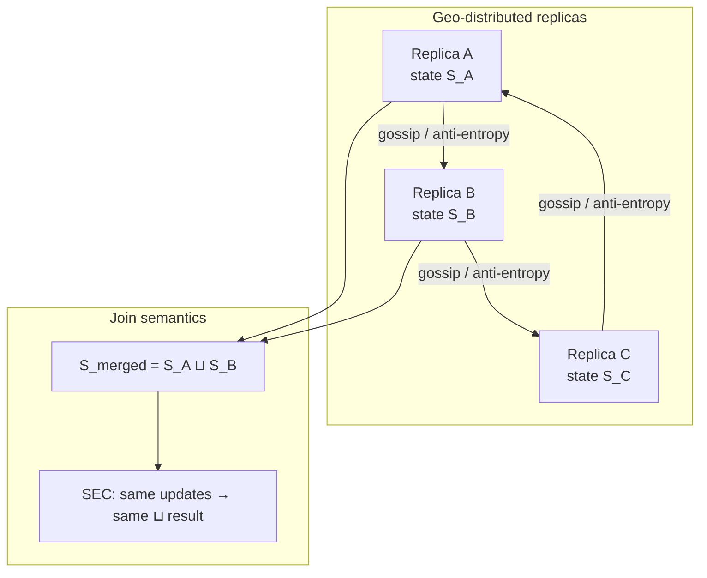
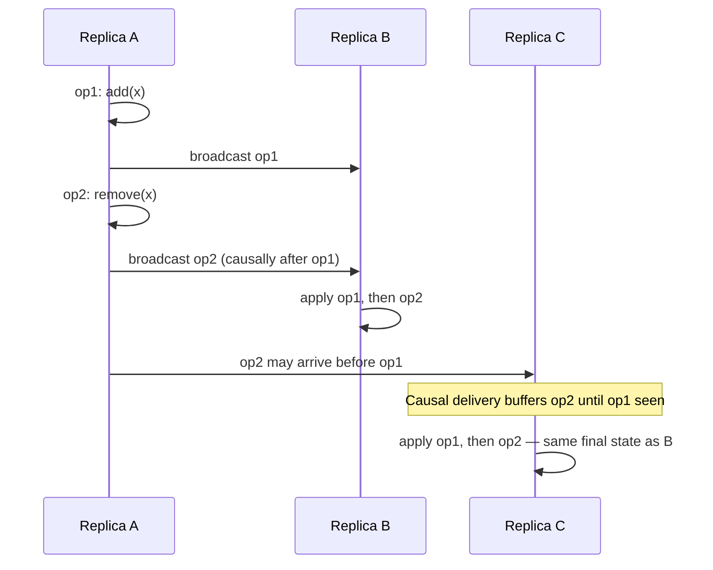
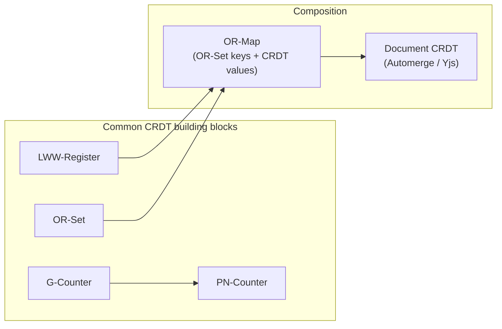

# Conflict-Free Replicated Data Types

## 1. Executive Summary

**Conflict-Free Replicated Data Types (CRDTs)** are replicated data structures whose states converge to the same value without coordination, provided replicas eventually receive each other's updates. The guarantee is formal: all replicas that have observed the same set of updates arrive at **identical** merged state—a **strong eventual consistency (SEC)** property stronger than generic eventual consistency, which only promises convergence without specifying the merged value.

CRDTs split into two families defined by Shapiro et al. (2011): **state-based CRDTs (CvRDTs)**, where replicas exchange and merge full states using a commutative, associative, idempotent join function; and **operation-based CRDTs (CmRDTs)**, where replicas apply the same operations in causal order after **reliable causal broadcast**. Both families eliminate ad-hoc conflict resolution for supported datatypes—counters, registers, sets, maps, and composed structures—at the cost of restricted semantics and metadata overhead.

This chapter covers the problem CRDTs solve atop [eventual consistency](/docs/consistency/eventual-consistency), the lattice-theoretic foundation, detailed walkthroughs of **G-Counter**, **PN-Counter**, **LWW-Register**, and **OR-Set**, state-based vs. operation-based tradeoffs, failure modes, production systems (Riak DT, Redis CRDT modules, Automerge, Yjs), and principal-level interview guidance. The canonical reference remains Shapiro, Preguiça, Baquero, and Zawirski's comprehensive study.

## 2. Why This Topic Matters

Multi-master replication, offline-first mobile clients, and geo-distributed collaboration all produce **concurrent writes** that generic eventual consistency cannot merge safely. Application-level last-writer-wins (LWW) loses data; version vectors detect conflicts but do not resolve them. CRDTs push merge semantics into the **datatype**, giving architects a principled alternative when:

- **Availability during partition** is required (AP systems).
- **Conflict resolution** must be automatic and deterministic.
- **Convergence** must be provable, not hope-based.

Principal architects choose CRDTs when the data model fits (counters, sets, collaborative text with OT/CRDT hybrids)—and reject them when invariants require global coordination (unique constraints, account balances without reservation). Interview depth expects lattice intuition, concrete datatype examples, and honest limits (metadata growth, causal delivery requirements for CmRDTs, semantic restrictions).

## 3. Problems Being Solved

| Problem | Naive replication pain | CRDT approach |
|---------|------------------------|---------------|
| Concurrent increments | Lost updates with LWW | G-Counter / PN-Counter sum per-replica counts |
| Concurrent set add/remove | Remove resurrected by late add | OR-Set with unique tags per add |
| Register conflicts | Arbitrary LWW data loss | LWW-Register with tie-breaker |
| Ad-hoc merge logic | Buggy, untested per feature | Algebraically specified join |
| Offline edits | Queue replay creates conflicts | Deterministic merge on sync |
| Sibling explosion | Vector-clock siblings grow | CRDT state replaces sibling lists |

CRDTs solve **deterministic convergence for restricted datatypes**. They do **not** solve arbitrary JSON merge, global uniqueness, or transactional invariants across keys without additional protocols.

## 4. Assumptions and System Model

Assume **partial failure**, **asynchronous network**, and **crash-stop** replicas unless noted:

- **Replicas** hold CRDT state; updates are applied locally and propagated.
- **Delivery:** State-based CRDTs require **at-least-once** state dissemination; operation-based CRDTs require **reliable causal delivery** of operations (Shapiro et al.).
- **No central coordinator** for merge—peers are symmetric.
- **Quiescence:** When all updates are delivered and merged, all replicas hold identical state (**SEC**).

**Safety property:** Strong eventual consistency—replicas with the same set of updates have equal state; merge is deterministic.

**Liveness property:** If updates cease and dissemination continues, replicas converge (assuming fair delivery and no permanent partition without repair).

**Not assumed:** Bounded metadata (OR-Set tags grow); semantic correctness for all business rules; linearizability.

## 5. Essential Terminology

| Term | Definition |
|------|------------|
| **CRDT** | Replicated datatype with conflict-free merge semantics. |
| **CvRDT (state-based)** | Merge full states via join function ⊔. |
| **CmRDT (operation-based)** | Apply operations; requires causal delivery. |
| **Join-semilattice** | Partial order with least upper bound (join) that is commutative, associative, idempotent. |
| **SEC** | Strong eventual consistency—same updates → same state. |
| **G-Counter** | Grow-only counter; one component per replica. |
| **PN-Counter** | Positive minus negative G-Counters. |
| **LWW-Register** | Last-writer-wins register with (value, timestamp, replica id). |
| **OR-Set** | Observed-removed set; add tagged; remove tombstones tags. |
| **Dot context** | Metadata tracking unique operation identifiers (OR-Set, OR-Map). |
| **Anti-entropy** | Background state exchange driving CvRDT convergence. |

**Mnemonic:** CRDT = **C**onverge **R**eplicas **D**eterministically via **T**ype algebra.

## 6. Core Mechanism

### State-based vs. operation-based

| Dimension | State-based (CvRDT) | Operation-based (CmRDT) |
|-----------|---------------------|-------------------------|
| Unit exchanged | Full or delta state | Individual operations |
| Merge | Join ⊔ on states | Apply op if not seen |
| Delivery need | At-least-once gossip | Reliable **causal** broadcast |
| Bandwidth | Can be large (full state) | Smaller per op |
| Implementation | Simpler transport | Requires op log + dedup |
| Delta-state variant | Send state diffs | N/A |

Both achieve SEC when preconditions hold. Shapiro et al. prove equivalence constructions between families for many types.

### CvRDT convergence model



*Figure 1: State-based CRDTs propagate state; merge ⊔ is commutative, associative, idempotent—order of receipt does not change final state.*

### CmRDT causal delivery



*Figure 2: Operation-based CRDTs require causal delivery so concurrent replicas apply operations in consistent order relative to happens-before.*

### Datatype composition



*Figure 3: Production document CRDTs compose registers, counters, and sets into maps and trees.*

### G-Counter (grow-only counter)

Each replica `i` maintains a non-negative integer `P[i]`. Local increment: `P[i] += 1`. **Value:** `val = Σ P[i]`. **Merge:** pointwise max: `P'[i] = max(P_A[i], P_B[i])`.

**Example:** Three replicas A, B, C. A increments twice locally → `P = [2,0,0]`. B increments once → `[0,1,0]`. After merge: `[2,1,0]`, `val = 3`. No lost increments—unlike LWW on a single integer.

**Limit:** Cannot decrement.

### PN-Counter (positive-negative counter)

Two G-Counters: `P` (increments) and `N` (decrements). **Value:** `val = Σ P[i] - Σ N[i]`. Increment: grow `P` at local index; decrement: grow `N` at local index. **Merge:** pointwise max on both vectors.

**Example:** A: +3 → `P=[3,0], N=[0,0]`. B: -1 → `P=[0,0], N=[0,1]`. Merged value: 3 - 1 = 2.

### LWW-Register (last-writer-wins)

State: triple `(value, timestamp, replica_id)`. **Write:** set to `(v, ts, id)` where `ts` is logical or physical time with tie-breaker on `replica_id`. **Merge:** take register with greater `(timestamp, replica_id)` lexicographically.

**Example:** A writes `(red, 10, A)`; B writes `(blue, 12, B)`. Merge → `(blue, 12, B)`. If B writes `(green, 10, B)` concurrent with A's write, compare timestamps; equal timestamps break ties on replica id—**implementation choice** documented in Shapiro et al.

**Limit:** Concurrent writes lose one value—acceptable for single-writer-per-field semantics, dangerous for multi-writer registers without user merge.

### OR-Set (observed-remove set)

Each add generates unique tag `(element, uuid)`. Set contains pairs `(e, t)`. **Add(e):** insert `(e, new_uuid)`. **Remove(e):** tombstone all tags **currently observed** for `e`. **Merge:** union of adds minus union of tombstones; OR-Set keeps adds whose tags are not tombstoned.

**Example:** A adds `x` → `{(x,u1)}`. B adds `x` → `{(x,u1), (x,u2)}` after sync. A removes `x` (observed `u1`) → tombstone `{u1}`. B still has `(x,u2)`—**x remains** (correct: B's add was concurrent with A's remove observation). If B had only `u1`, remove eliminates `x` on merge.

**Limit:** Metadata grows with adds; compaction requires garbage collection policies.

## 7. Step-by-Step Walkthrough

**Scenario:** Collaborative shopping list with OR-Set items and PN-Counter for quantity adjustment across two offline-capable clients.

| Step | Event | OR-Set state (simplified) | PN-Counter (item "milk") |
|------|-------|----------------------------|--------------------------|
| 1 | A online: add "milk", increment qty | \{(milk, u1)\} | P=[1,0], N=[0,0] → 1 |
| 2 | B offline: add "eggs" | B: \{(eggs, u2)\} | B: unchanged |
| 3 | A: add "bread" | \{(milk,u1), (bread,u3)\} | 1 |
| 4 | B comes online; sync states | Merge unions tags | Merge max vectors |
| 5 | A removes "milk" (saw u1) | tombstone u1 | — |
| 6 | B increments milk (still has u1 if not synced) | concurrent paths | P=[1,1] after merge → 2 |
| 7 | Full merge | milk present iff untombstoned tag exists | val = 2 |

**Insight:** OR-Set remove is **observed-remove**, not global delete—architects must explain UX ("remove" means remove what I saw, not erase all concurrent adds). PN-Counter handles concurrent inc/dec without lost updates.

## 8. Invariants and Guarantees

| Property | Type | Statement |
|----------|------|-----------|
| **SEC** | Safety | Same delivered updates → identical replica state |
| **Commutative merge** | Safety | `a ⊔ b = b ⊔ a` (CvRDT) |
| **Associative merge** | Safety | `(a ⊔ b) ⊔ c = a ⊔ (b ⊔ c)` |
| **Idempotent merge** | Safety | `a ⊔ a = a` |
| **Linearizability** | **Not** guaranteed | CRDTs are typically AP |
| **Semantic invariants** | Application | e.g., "set size only grows" for G-Counter only |
| **Bounded metadata** | **Not** inherent | OR-Set, OR-Map need GC |

**Safety vs liveness:** SEC is a **safety** property about converged states. **Delivery liveness** (gossip progresses) is required for convergence—permanent partition leaves replicas divergent until heal, as with any eventual system.

## 9. Failure Scenarios

### Scenario 1: CmRDT without causal delivery

**Setup:** Remove delivered before add on a replica.

**Effect:** **Safety** violation—removed element reappears or wrong final set.

**Mitigation:** Causal broadcast, version vectors on op log, or use CvRDT state merge instead.

### Scenario 2: LWW clock skew across regions

**Setup:** EU clock ahead; all US writes lose.

**Effect:** Systematic bias toward one region—**semantic** data loss.

**Mitigation:** Logical clocks, hybrid logical clocks, or avoid LWW for multi-writer registers.

### Scenario 3: OR-Set metadata explosion

**Setup:** High churn add/remove on hot element.

**Effect:** State size grows unbounded; sync latency degrades.

**Mitigation:** Periodic compaction, max-tag policies, redesign hot keys.

### Scenario 4: Applying CRDT to wrong datatype

**Setup:** PN-Counter used for bank balance allowing overdraft.

**Effect:** Negative values possible; business invariant violated.

**Mitigation:** Use constrained types, reservation service, or CP ledger for money.

### Scenario 5: Stale CvRDT delta

**Setup:** Delta-state CRDT sends partial merge missing concurrent component.

**Effect:** Incorrect join if delta not computed against correct base—**implementation bug**.

**Mitigation:** Correct delta algorithms (Shapiro et al.); test concurrent histories.

## 10. Performance Characteristics

| Dimension | CvRDT (full state) | CvRDT (delta) | CmRDT |
|-----------|-------------------|---------------|-------|
| Sync bandwidth | O(state size) | O(changes) | O(ops) |
| CPU per update | Merge cost | Merge + delta | Apply op |
| Memory | Metadata per type | Same | Op log + state |
| Latency | Local immediate | Local immediate | Depends on broadcast |
| Hot keys | OR-Set tag blowup | Same | Op log contention |

Qualitative: CRDTs optimize **correct convergence under concurrency**; pay **metadata and education** cost. Benchmarks are workload-specific—do not cite universal merge latencies without measurement.

## 11. Scalability Limits

- **Replica count:** G-Counter/PN-Counter state O(replicas)—large clusters need keyed counters or hierarchical aggregation.
- **Set churn:** OR-Set tags accumulate—sublinear user growth does not imply sublinear metadata.
- **Document size:** JSON CRDTs (Automerge) grow with edit history unless squashed.
- **Cross-datatype transactions:** No native multi-key atomicity—application sagas required.

**When CRDTs scale well:** Per-user or per-document shards, append-heavy counters, collaborative editing with bounded participants.

**When they struggle:** Global aggregates, strict uniqueness, fine-grained financial invariants.

## 12. Operational Considerations

- **Choose CvRDT vs CmRDT** based on transport: gossip favors deltas; Kafka log favors CmRDT ops.
- **Monitor:** State size per object, merge latency p99, sync lag, tag count for OR-Sets.
- **GC policies:** Document when tombstones compact; test restore after compaction.
- **Schema evolution:** Adding fields to composed CRDTs needs versioned merge rules.
- **Testing:** Property-based tests over random operation histories (Jepsen-style).

## 13. Security Considerations

- **Unauthenticated merges:** Malicious replica injects inflated G-Counter components—authenticate sync peers.
- **Op replay:** CmRDT dedup must use unforgeable op ids.
- **LWW poisoning:** Attacker with skewed clock wins—use signed logical timestamps or cap trust.
- **Availability:** CRDT systems stay available under partition—rate limit writes to prevent state blowup DoS.

CRDTs do not replace **authorization**—they constrain **how** authorized writes combine.

## 14. Cost Considerations

- **Bandwidth:** Delta-state reduces cross-region bills vs full state gossip.
- **Storage:** Metadata overhead vs sibling lists in Dynamo-style systems—measure for workload.
- **Engineering:** Upfront datatype design cheaper than production incident from LWW cart loss.
- **Compute:** Merge on read paths shifts CPU to application—cache merged views where safe.

**Decision criterion:** CRDT cost justified when conflict rate × incident cost exceeds metadata and complexity tax.

## 15. Production Implementations

### Riak DT (Basho)

Integrated CRDT types (G-Counter, PN-Counter, OR-Set, OR-Map, etc.) in Riak KV—state-based, anti-entropy sync. Operational lessons informed later libraries.

### Redis CRDT / Redis Enterprise

Geo-distributed CRDT-backed types for active-active replication—**product-specific** guarantees; consult Redis documentation for current type list and consistency claims.

### Automerge & Yjs

JavaScript CRDT libraries for collaborative documents—composed maps/lists/text. Yjs uses optimized binary encoding; widely deployed in editors. **Implementation choice**, not formal SEC proof for every composed path—verify library semantics.

### Akka DT / Antidote

Research-to-production paths for CRDT stores—geo-replication with transactional extensions in some designs.

### Figma / Notion (hybrid)

Production collaborative systems often combine OT, CRDTs, or central sequencing—**public details limited**; treat as anecdotal unless documented.

**Distinction:** Library SEC guarantees hold per datatype spec; composed application state may violate business invariants if architects compose incorrectly.

## 16. Alternatives and Tradeoffs

| Approach | Convergence | Semantics | Coordination |
|----------|-------------|-----------|--------------|
| CRDT | Deterministic SEC | Restricted types | None for merge |
| LWW + version vector | Deterministic but lossy | Last timestamp wins | None |
| Operational Transform | Convergent for text | Edit sequences | Often central server |
| Single-leader replication | Linearizable | General | Leader election |
| Consensus per key | Strong | General | Paxos/Raft cost |
| Application merge | Custom | Flexible | Human rules |

**vs [eventual consistency](/docs/consistency/eventual-consistency):** CRDTs are a **mechanism** achieving SEC, not a weaker consistency model.

**vs [conflict resolution](/docs/replication/conflict-resolution):** CRDTs embed resolution in the type; generic conflict resolution handles arbitrary payloads.

## 17. Common Misconceptions

| Misconception | Reality |
|---------------|---------|
| "CRDTs fix all conflicts" | Only for supported algebraic types. |
| "CRDT = linearizable" | Typically AP; SEC not linearizability. |
| "OR-Set remove deletes globally" | Observed-remove—concurrent adds survive. |
| "G-Counter can decrement" | Need PN-Counter or different type. |
| "State-based needs no ordering" | Still needs delivery; merge handles concurrent state. |
| "CmRDT works over plain UDP" | Needs reliable causal delivery. |
| "No metadata overhead" | OR-Sets and counters carry per-replica state. |

## 18. Principal Architect Perspective

1. **Match datatype to invariant:** Counters and sets yes; unique email no.
2. **Shard by CRDT document:** One CRDT per user/session limits blast radius.
3. **Expose merge semantics to product:** OR-Set remove behavior affects UX copy.
4. **Plan GC:** Metadata growth is operational debt, not theoretical.
5. **Hybrid architectures:** CP metadata + CRDT payload is valid—state each layer's guarantee.

Executives hear "conflict-free" as magic. Translate to **restricted data models with proofs** and **explicit non-goals**.

**Composition discipline:** When teams nest LWW registers inside OR-Maps, concurrent updates at different levels interact subtly—document which fields are multi-writer and which are single-writer. Shapiro et al. provide compositional frameworks, but production bugs often come from **schema drift** (adding a non-CRDT field) or **bridging** CRDT state to relational stores without idempotent upsert keys.

## 19. Architecture Review Exercise

**Scenario:** Global real-time analytics dashboard—per-region event counters, per-user filter sets, per-dashboard title string edited by admins.

**Review prompts:**

1. Which fields are CRDT-suitable vs need consensus?
2. G-Counter vs PN-Counter for "events processed" if replays can decrement?
3. OR-Set for user filters—what happens when user removes filter while region adds default?
4. LWW-Register for title—acceptable for concurrent admin edits?
5. How to expose counter values read path—merge on read vs periodic snapshot?

**Expected findings:** Counters and filter sets map to PN-Counter and OR-Set; title may need human merge or single-leader; dashboard totals may need periodic CP aggregation for billing-grade accuracy.

## 20. Whiteboard Explanation

**90-second version:**

> "CRDTs are replicated datatypes that merge without coordination. Shapiro's paper defines state-based and operation-based forms. State-based sends full state and merges with a join that's commutative, associative, and idempotent—like taking the max per position in a grow-only counter. Operation-based sends ops but needs causal delivery. Examples: G-Counter for increments only—each replica has a slot, value is the sum, merge is pointwise max. PN-Counter adds negative counts for decrement. LWW-Register picks the write with the highest timestamp and replica id tie-break. OR-Set tags each add with a UUID; remove tombstones only tags you've seen, so concurrent adds aren't lost. You get strong eventual consistency—same updates, same final state—not linearizability. Use when AP and your data fits; don't use for uniqueness or arbitrary JSON."

## 21. Interview Questions

1. **What is a CRDT?**
   - *Signals:* Conflict-free merge, SEC, replicated datatype.

2. **State-based vs operation-based CRDTs?**
   - *Signals:* Merge state vs apply ops; causal delivery for CmRDT.

3. **How does G-Counter merge?**
   - *Signals:* Per-replica max, sum for value.

4. **PN-Counter structure?**
   - *Signals:* Two G-Counters, P minus N.

5. **LWW-Register tie-break?**
   - *Signals:* Timestamp then replica id.

6. **OR-Set vs remove-set?**
   - *Signals:* Observed-remove, unique add tags.

7. **What is SEC?**
   - *Signals:* Same updates → same state; stronger than eventual.

8. **Do CRDTs need a leader?**
   - *Signals:* No for merge; optional for other reasons.

9. **CRDTs under CAP?**
   - *Signals:* AP-friendly; no linearizability during partition.

10. **When not to use CRDTs?**
    - *Signals:* Unique constraints, general transactions, unbounded JSON.

11. **Metadata growth concern?**
    - *Signals:* OR-Set tags, counter vector size.

12. **CvRDT delivery requirements?**
    - *Signals:* At-least-once state dissemination; anti-entropy.

## 22. Interview Follow-Ups

1. **Design collaborative todo list with offline support.**
   - *Signals:* OR-Set tasks, LWW for title optional, per-device sync.

2. **Convert Dynamo siblings to CRDTs?**
   - *Signals:* Migration path, per-key type selection, dual-write period.

3. **Bank balance with CRDT?**
   - *Signals:* Reject or PN-Counter + reservation CP service.

4. **Garbage-collect OR-Set tags safely?**
   - *Signals:* Causal stability, epoch, only drop after all replicas ack.

5. **Test CRDT implementation?**
   - *Signals:* Randomized histories, merge commutativity properties.

## 23. Strong Answer Example

**Question:** "Design a geo-replicated like counter for social posts."

> "I'd shard a **PN-Counter** per post id—likes increment local G-Counter component, unlike decrements rare but handle unlikes via N counter. State-based delta sync between regions on gossip interval; merge is pointwise max so concurrent likes never lost. Reads sum components—cache merged sum with TTL for hot posts. I won't use LWW on an integer—that loses counts. If we need fraud detection, add async CP audit pipeline comparing approximate count to event log, but user-facing count stays AP CRDT. Monitor vector size if replica count grows; for >100 writers consider hierarchical counter per region. Reference Shapiro G-Counter SEC proof and Dynamo lessons on why application merge failed for counters."

## 24. Weak Answer Example

**Question:** "Design a geo-replicated like counter for social posts."

> "Store likes in Cassandra with eventual consistency. CRDTs are conflict-free so we're fine. Use Redis INCR for speed."

**Why weak:** No datatype named, INCR is not partition-safe without CRDT semantics, ignores merge rules, no hot-key or metadata discussion, conflates cache with source of truth.

## 25. Hands-On Exercise

**Exercise: CRDT counter and set simulator**

1. Implement in-memory G-Counter and OR-Set with merge.
2. Simulate two replicas exchanging states in random order—verify identical final state.
3. Replay PN-Counter concurrent inc/dec from three replicas.
4. Demonstrate OR-Set: add on A, remove on B before sync, add on B—observe element presence.
5. Break CmRDT ordering: apply remove before add without causal buffer—show incorrect state.

**Success criteria:** Randomized 1000-operation histories converge; document one OR-Set case where remove does not delete concurrent add.

## 26. Knowledge Check

1. G-Counter merge operation? *(Pointwise max per replica index.)*
2. CmRDT delivery requirement? *(Reliable causal broadcast.)*
3. PN-Counter value formula? *(Sum P minus sum N.)*
4. OR-Set remove semantics? *(Tombstone observed add tags only.)*
5. SEC meaning? *(Replicas with same updates have equal state.)*
6. Can LWW-Register lose concurrent writes? *(Yes—by design.)*

## 27. Flashcards

| # | Front | Back |
|---|-------|------|
| 1 | CRDT | Replicated type with deterministic conflict-free merge. |
| 2 | CvRDT | State-based; merge via join ⊔. |
| 3 | CmRDT | Op-based; needs causal delivery. |
| 4 | SEC | Same updates → identical state. |
| 5 | G-Counter | Grow-only; per-replica max merge. |
| 6 | PN-Counter | P counter minus N counter. |
| 7 | LWW-Register | Max (timestamp, replica id) wins. |
| 8 | OR-Set | Add with unique tag; observed remove. |
| 9 | Join properties | Commutative, associative, idempotent. |
| 10 | Not guaranteed | Linearizability, bounded metadata. |
| 11 | Shapiro et al. | Canonical CRDT reference (2011). |
| 12 | AP fit | Available under partition; merge without leader. |

## 28. Cheat Sheet

```
CRDT FAMILIES
  CvRDT: exchange state, merge ⊔ (commutative/associative/idempotent)
  CmRDT: exchange ops, reliable CAUSAL delivery

EXAMPLES
  G-Counter:  val = Σ P[i]; merge = max per i
  PN-Counter: val = Σ P[i] - Σ N[i]
  LWW-Reg:    max (ts, replica_id)
  OR-Set:     add (e, uuid); remove tombstones observed tags

GUARANTEE
  SEC — not linearizability

USE WHEN
  AP + datatype fits (counters, sets, CRDT docs)

AVOID WHEN
  Unique keys, arbitrary merge, strict financial invariants

OPS
  Monitor state/tag growth; GC tombstones; property-test merges
```

## 29. Related Concepts

- [Conflict Resolution](/docs/replication/conflict-resolution) — prerequisite; ad-hoc merge policies CRDTs replace
- [Eventual Consistency](/docs/consistency/eventual-consistency) — weaker convergence guarantee
- [Vector Clocks](/docs/time-ordering-and-coordination/vector-clocks) — causal metadata for CmRDTs and conflict detection
- [Replication Overview](/docs/replication/overview) — multi-master replication context
- [CAP Theorem](/docs/consistency/cap-theorem) — AP placement for CRDT systems
- [Idempotency](/docs/distributed-systems-foundations/idempotency) — related at-least-once delivery concerns

## 30. References

### Primary sources

- Shapiro, M., Preguiça, N., Baquero, C., & Zawirski, M. (2011). ["Conflict-free Replicated Data Types."](https://hal.science/hal-00609329v1/document) *SSS 2011* — defines CvRDTs and CmRDTs, SEC, G-Counter, PN-Counter, LWW-Register, OR-Set, lattice foundation.
- Shapiro, M., Preguiça, N., Baquero, C., & Zawirski, M. (2011). ["A Comprehensive Study of Convergent and Commutative Replicated Data Types."](https://hal.inria.fr/inria-00555588/document) INRIA Research Report RR-7506 — full catalog and proofs.

### Production and engineering

- Basho. Riak DT documentation — state-based CRDT integration in Riak KV (historical product; verify current vendor docs).
- Kleppmann, M. *Designing Data-Intensive Applications* (O'Reilly) — Chapter 5 replication, conflict resolution context.
- DeCandia, G., et al. (2007). Dynamo — motivates conflict detection; CRDTs as evolution for typed merges.

### Textbooks and surveys

- Shapiro, M., et al. (2011). SSS tutorial slides and RR-7506 — authoritative datatype catalog.
- Herlihy, M., & Shavit, N. (2020). *The Art of Multiprocessor Programming* — concurrent object theory adjacent to CRDT merge.

### Distinction

| Claim type | Source |
|------------|--------|
| SEC formal definition | Shapiro et al. (2011) |
| Join-semilattice properties | Shapiro et al. RR-7506 |
| CmRDT causal delivery requirement | Shapiro et al. (2011) |
| Production CRDT behavior | Per-product documentation |
| Collaborative editor internals | Often undisclosed—anecdotal |
