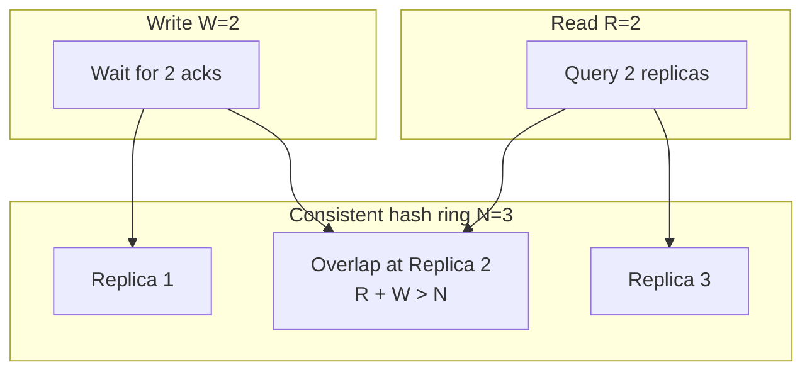
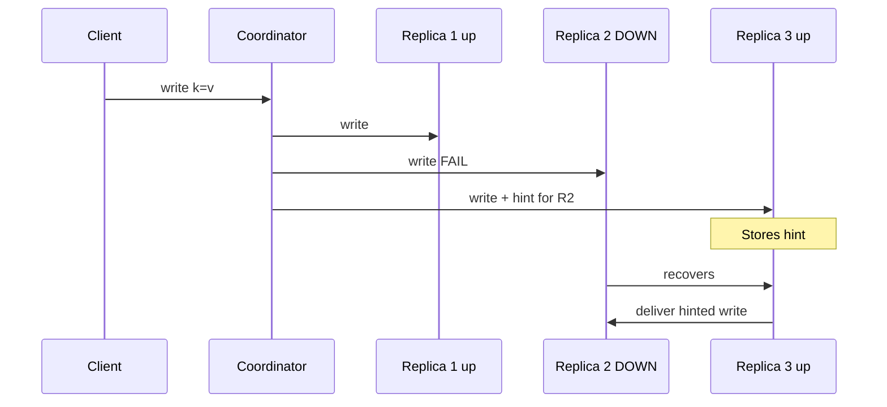
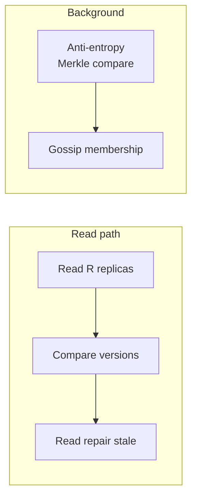

# Leaderless Replication

## 1. Executive Summary

**Leaderless replication** (Dynamo-style) has **no fixed leader node**: clients send writes and reads to **multiple replicas** in parallel; the system uses **quorums** to determine durability and visibility. A write succeeds when **W replicas** acknowledge; a read consults **R replicas** and returns the **latest version** (by version number or vector clock). When **R + W > N** (for N replicas), reads and writes overlap on at least one node—providing a **quorum consistency** guarantee under stable conditions. Kleppmann (*DDIA*, Chapter 5) presents this model as the foundation of highly available key-value stores at scale.

Leaderless systems embrace **eventual consistency** by default: replicas not in the write quorum may be stale until **read repair** or **anti-entropy** converges them. **Hinted handoff** and **sloppy quorums** improve availability during replica failure at the cost of stricter quorum guarantees. Amazon Dynamo (DeCandia et al., 2007), Apache Cassandra, Riak, and Voldemort exemplify variants of this design—tunable via N, R, W and consistency levels per operation.

This chapter covers quorum math, version detection, repair mechanisms, failure behavior, and when leaderless beats leader-based replication for partition tolerance and write availability.

## 2. Why This Topic Matters

Leaderless replication powers many **"AP"** systems in CAP terminology. Principal architects must explain:

- **Quorum intersection** and when it fails (sloppy quorum, partial failures).
- **R + W > N** intuition—not magic, but overlap argument.
- **Sibling reads** and version vectors when writes are concurrent.
- **Hinted handoff** vs **anti-entropy** roles in convergence.
- Tradeoffs of **W=1, R=1** (fast, fragile) vs **QUORUM** (slower, safer).

Interview traps: claiming quorums provide linearizability without version checks; ignoring **sloppy quorum** weakening guarantees; confusing Cassandra consistency levels with Dynamo quorums without noting replication scope (LOCAL vs EACH_QUORUM). DynamoDB and modern Cassandra features evolved—verify current product semantics against papers.

Principal interviews often present a **tuning scenario**: given N=3 and latency SLO, pick R and W for reads vs writes. The correct answer walks through R+W>N math, durability of W=1, and when to escalate to lightweight transactions or an external lock service for hot keys—not a single magic consistency level.

Leaderless replication also appears in **edge and CDN** designs conceptually—multiple nodes hold copies, reads hit nearest, writes propagate asynchronously—though those systems rarely expose N,R,W knobs explicitly. The mental model still applies when reasoning about cache invalidation lag as a form of eventual convergence.

When documenting architecture decisions, include a **quorum matrix** table: for each entity type, list N, R, W, expected staleness, and failure behavior. This single artifact prevents microservices from composing incompatible consistency assumptions across shared data. Review the matrix whenever replication factor or datacenter topology changes. Kleppmann's Dynamo exposition remains the canonical interview reference for this topology and quorum tuning tradeoffs in practice today.

## 3. Problems Being Solved

| Problem | Leaderless approach |
|---------|---------------------|
| Leader as bottleneck | Any replica can accept writes (coordinator forwards) |
| Leader failover complexity | No election for write path |
| Node failure during write | Hinted handoff buffers for down replica |
| Stale replicas | Read repair + anti-entropy |
| Tunable consistency/latency | Per-request R, W |
| Partition tolerance | Continue with available replica subset |

Leaderless does **not** simplify **conflict resolution** or **global secondary indexes** at scale—those remain hard.

## 4. Assumptions and System Model

Assume **partial failure**, **asynchronous network**, **crash-stop** replicas:

- **N** replicas per key (via consistent hashing partition).
- Client or **coordinator** sends operations to replica set.
- Replicas store **multiple versions** when concurrency detected.
- **Quorum** parameters R, W configurable per operation.

**Safety (quorum read):** If R+W>N and strict quorums, read sees latest committed write (single-version case).

**Liveness:** Operations complete if W (or R) reachable replicas exist—**availability** prioritized.

**Not assumed:** Linearizability without additional mechanisms (LWT/Paxos in Cassandra); automatic merge of concurrent versions.

## 5. Essential Terminology

| Term | Definition |
|------|------------|
| **N** | Replication factor—replicas per key. |
| **W** | Write quorum—acks required for write success. |
| **R** | Read quorum—replicas consulted on read. |
| **Quorum intersection** | R + W > N ensures overlap. |
| **Coordinator** | Node routing client request to replicas. |
| **Consistent hashing** | Partition keys across ring. |
| **Hinted handoff** | Store write for temporarily down replica. |
| **Sloppy quorum** | Write to fallback nodes outside preference list. |
| **Read repair** | Update stale replicas during read. |
| **Anti-entropy** | Background Merkle-tree sync between replicas. |
| **Sibling** | Concurrent versions returned together. |
| **Version vector** | Per-replica version metadata for concurrency. |

**Mnemonic:** **N, R, W**—tune the overlap between read and write sets.

## 6. Core Mechanism

### Write path

1. Client sends write to coordinator for key K.
2. Coordinator determines N preference list replicas.
3. Parallel write to N nodes; wait for W acks.
4. If W unreachable, fail or sloppy quorum per policy.
5. Return success; remaining replicas updated asynchronously.

### Read path

1. Client read to coordinator.
2. Query R replicas in parallel.
3. Merge versions—return highest; detect siblings if concurrent.
4. Optional read repair: write latest back to stale nodes.

### Quorum overlap



*Figure 1: With N=3, R=2, W=2, any read and write share at least one replica.*

### Hinted handoff



*Figure 2: Hinted handoff preserves write availability when a preference-list node is down.*

### Read repair and anti-entropy



*Figure 3: Read repair fixes on demand; anti-entropy fixes systematically in background.*

## 7. Step-by-Step Walkthrough

**Scenario:** Cassandra-style; N=3; W=1; R=1; shopping cart key.

| Step | Event | Observation |
|------|-------|-------------|
| 1 | Write cart to coordinator | One replica acks—fast |
| 2 | Read from different replica | **Stale**—empty cart |
| 3 | Read repair triggers | Stale replica updated |
| 4 | Second read | Cart visible |
| 5 | Replica down during write | Hinted handoff to neighbor |
| 6 | Replica recovers | Hint replayed |
| 7 | Concurrent writes both W=1 | Siblings on read—merge needed |

**Insight:** W=1,R=1 maximizes availability; application must tolerate staleness and siblings unless tightened.

## 8. Invariants and Guarantees

| Configuration | Guarantee (stable network) |
|---------------|---------------------------|
| R+W > N, strict quorum | Read sees latest write (single version) |
| W=1 | Fast write; durability if that node fails before replicate |
| R=1 | Fast read; stale possible |
| Sloppy quorum | **Weaker**—writes may land outside preference list |
| Concurrent W=1 writes | Siblings—**not** single value |

**Safety:** Quorum intersection prevents stale read of committed write **when assumptions hold**. **Liveness:** Operations succeed with available nodes.

Herlihy & Wing linearizability is **stronger**—leaderless quorums alone don't provide it under all interleavings without extra sync.

## 9. Failure Scenarios

### Scenario 1: W=1 node dies before replicate

**Setup:** Write acked from single node; node lost permanently.

**Effect:** **Write lost**—durability failure.

**Mitigation:** W=QUORUM or TWO; hinted handoff + replication factor replacement.

### Scenario 2: Sloppy quorum during partition

**Setup:** Preference list unreachable; writes go to fallback nodes.

**Effect:** R+W>N argument breaks for **true** replica set—stale reads possible after heal.

**Mitigation:** Understand sloppy quorum as **availability trade**; tighten during recovery.

### Scenario 3: Sibling explosion

**Setup:** High concurrent writes; vector clocks grow.

**Effect:** Reads return many siblings; latency/storage grow.

**Mitigation:** CRDT migration, reduce conflict domain, higher coordination for hot keys.

### Scenario 4: Read repair storm

**Setup:** Hot key; every read repairs.

**Effect:** Cross-replica traffic spike; tail latency.

**Mitigation:** Probabilistic read repair; dedicated anti-entropy.

### Scenario 5: Merkle anti-entropy lag

**Setup:** Petabyte cluster; infrequent full compare.

**Effect:** Chronic staleness on cold keys.

**Mitigation:** Incremental repair scheduling; raise R for critical reads.

### Scenario 6: Consistency level mismatch across microservices

**Setup:** Service A writes at `QUORUM`; Service B reads at `ONE` immediately after.

**Effect:** B observes stale state and makes incorrect downstream decisions—**distributed systems composition bug**.

**Mitigation:** Document required CL per workflow; enforce via client libraries; integration tests across service boundaries.

## 10. Performance Characteristics

| Dimension | Leaderless (tuned low) | Leaderless (QUORUM) |
|-----------|------------------------|---------------------|
| Write latency | Parallel to W nodes—often low | Wait for slowest of W |
| Read latency | Parallel R—local if R=1 | Higher tail |
| Throughput | High; no leader bottleneck | Quorum coordination cost |
| Hot keys | Still bottleneck—all replicas write |
| Partition | Degraded quorum; sloppy helps liveness | May reject ops |

Qualitative: excels at **horizontal write spread** across keys; struggles on **single hot key** without external coordination.

**Latency vs durability trade space:** Lowering W reduces write latency linearly in the best case but moves the durability frontier—incident reviews of Dynamo-family outages often trace to W=1 on critical paths combined with simultaneous node failures during deploys. Principal architects should map each API endpoint to an explicit (N,R,W) tuple in the architecture decision record, not rely on cluster defaults.

**Comparison with consensus per key:** Cassandra lightweight transactions and newer systems that embed Raft per shard are hybrid designs—they preserve leaderless ergonomics at the API while paying coordination cost for operations that need it. Interview answers should distinguish **default leaderless behavior** from **optional strong primitives** that change latency and availability profiles.

## 11. Scalability Limits

- **Hot partitions:** All N replicas serve one key—write rate capped.
- **Vector clock size:** Grows with replica count and concurrency.
- **Gossip overhead:** Membership at thousands of nodes needs hierarchical gossip.
- **Repair bandwidth:** Anti-entropy doesn't scale naively to exabyte without partitioning repairs.
- **Tunable consistency confusion:** Per-query CL mistakes cause production bugs—organizational limit.

## 12. Operational Considerations

- **Monitor:** Per-node repair rate, hinted handoff queue, sibling rate, compaction lag.
- **Consistency levels:** Document defaults per API; forbid W=1 for money paths.
- **Replace failed nodes:** Bootstrap + repair before removing old token.
- **Compaction:** Leaderless stores (LSM) couple replication with compaction debt.
- **Chaos:** Kill nodes during W=1 traffic; measure loss rate empirically.

## 13. Security Considerations

- **Coordinator trust:** Malicious coordinator could read/write subset—authenticate all replica RPCs.
- **Hinted handoff poisoning:** Validate hints cryptographically; expire stale hints.
- **Read repair amplification as DoS:** Rate-limit repair from untrusted read paths.
- **Cross-tenant ring:** Ensure partition isolation in multi-tenant managed offerings.

## 14. Cost Considerations

- **N replicas:** Storage × N; cross-AZ replication egress.
- **Repair traffic:** Hidden cost at scale—budget 10–20% bandwidth [operational rule of thumb; verify per deployment].
- **Over-provisioning:** Low W,R reduce latency but increase incident cost when nodes fail.
- **LWT/Paxos features:** Stronger consistency in Cassandra costs ~4× latency—engineering trade.

## 15. Production Implementations

### Amazon Dynamo (2007 paper)

N, R, W; vector clocks; consistent hashing; hinted handoff; read repair—**canonical reference**. Modern DynamoDB differs significantly—read AWS docs.

### Apache Cassandra

Consistency levels (`ONE`, `QUORUM`, `LOCAL_QUORUM`, etc.); tunable per query; lightweight transactions (Paxos) for compare-and-set—**add-on CP mechanism**.

### Riak

Vector clocks and siblings; operational lessons informed later Dynamo-family designs.

### Voldemort (LinkedIn)

Dynamo-inspired; used for certain high-throughput caches—historical reference.

### ScyllaDB

Cassandra-compatible with shard-per-core architecture—leaderless quorum semantics preserved at API level.

**Distinction:** Paper Dynamo vs product DynamoDB vs Cassandra—**do not conflate** without reading current guarantees.

## 16. Alternatives and Tradeoffs

| Model | Write availability | Consistency knob | Conflict handling |
|-------|-------------------|------------------|-------------------|
| Leaderless quorum | High | R, W, N | Siblings + merge |
| Primary-secondary | Leader down blocks writes | Sync/async | None on writes |
| Multi-leader | High local | Eventual | Conflicts expected |
| Consensus (Raft) | Leader required | Strong | None |

Choose leaderless for **massive partition tolerance** and **per-operation tuning**; avoid when team needs **simple mental model** or strong default consistency.

## 17. Common Misconceptions

| Misconception | Reality |
|---------------|---------|
| "Quorum = strong consistency" | Overlap argument; not linearizability alone. |
| "No leader ever" | Coordinator often acts as ephemeral leader per request. |
| "R+W>N always safe" | Broken by sloppy quorum, failures, concurrent writes. |
| "Dynamo = DynamoDB" | Different systems; verify product docs. |
| "Read repair is synchronous always" | Often probabilistic/async. |
| "N=3 fixes everything" | W=1 still loses writes on node death. |

## 18. Principal Architect Perspective

1. **Default QUORUM** for anything user-visible; relax explicitly per field.
2. **Measure sibling rate**—leading indicator of design stress.
3. **Hot key plan** before leaderless—external lock or queue.
4. **Sloppy quorum** is a feature with documented weaker guarantees.
5. **Pair with conflict resolution** chapter policies—infra won't merge business logic.

Kleppmann notes leaderless shines when **availability during failure** matters more than simplest consistency story.

**Token awareness:** In Cassandra, `LOCAL_QUORUM` scopes quorums to local DC—critical for multi-DC latency; misunderstanding scope causes subtle consistency bugs.

**Coordinator failure mid-request:** The coordinator is not a durable leader—if it crashes after writing to W replicas but before client ack, the client retries and may create duplicate logical writes unless operations are idempotent. Leaderless designs push idempotency and client-side token generation to the foreground. Dynamo's use of client-generated version numbers partially addresses this; modern clients should use deterministic idempotency keys per logical operation.

** vnode and repair:** Cassandra virtual nodes spread token ranges across physical hosts—reducing hotspot risk when nodes join or leave. Repair (full or incremental) is how leaderless systems eventually align replicas that missed writes during outages. Under-provisioned repair schedules mean replicas can remain divergent for days on cold partitions while hot keys get read-repair attention—**two-tier staleness** that violates intuitive "QUORUM means fresh" assumptions for rarely-read keys.

## 19. Architecture Review Exercise

**Scenario:** IoT telemetry; 10k writes/sec per device shard; N=3; W=1; R=1; 30-day TTL.

**Review prompts:**

1. Acceptable to lose single write on node failure?
2. Read latest aggregate from one replica?
3. When promote to LOCAL_QUORUM?
4. Hot device ID overwhelming one partition?
5. Hinted handoff disk pressure on dense nodes?

**Expected findings:** W=1 may be OK for telemetry; aggregates need higher R or pre-aggregation; monitor partition skew.

## 20. Whiteboard Explanation

**90-second version:**

> "Leaderless replication means no fixed master—clients write to several replicas and succeed when W of N ack. Reads fetch R replicas and pick the newest version. If R plus W is greater than N, read and write sets overlap so you should see your write—unless nodes failed or you used sloppy quorum. Dynamo pioneered this with consistent hashing, version vectors for concurrent writes, hinted handoff when a replica is down, and read repair plus anti-entropy to converge stale nodes. Cassandra tunable consistency per query—ONE is fast but stale, QUORUM is safer. It's an AP design: stay available during partition, handle siblings and merge at application layer. Hot keys still hurt because all replicas for that key get every write."

## 21. Interview Questions

1. **Explain leaderless replication.**
   - *Signals:* No fixed leader; N,R,W quorums.

2. **What does R+W>N guarantee?**
   - *Signals:* Overlap; see latest committed in single-version case.

3. **Hinted handoff purpose?**
   - *Signals:* Write availability when preference node down.

4. **Sloppy quorum?**
   - *Signals:* Fallback nodes; weaker intersection guarantee.

5. **Read repair vs anti-entropy?**
   - *Signals:* On-read fix vs background Merkle sync.

6. **W=1 risk?**
   - *Signals:* Durability loss if node dies before replicate.

7. **What is a sibling?**
   - *Signals:* Concurrent versions from vector clock.

8. **Coordinator role?**
   - *Signals:* Routes to replica set; not persistent leader.

9. **Cassandra LOCAL_QUORUM?**
   - *Signals:* Quorum in local datacenter only.

10. **Leaderless vs primary-secondary?**
    - *Signals:* Failover, bottleneck, consistency tuning.

11. **Consistent hashing why?**
    - *Signals:* Partition keys; minimal reshuffle on node add.

12. **Linearizable leaderless?**
    - *Signals:* Needs extra protocol (Paxos LWT); not default.

13. **Dynamo vector clocks for?**
    - *Signals:* Detect concurrent writes—not total order.

14. **Hot key mitigation?**
    - *Signals:* Separate counter service, queue, cache layer.

## 22. Interview Follow-Ups

1. **Pick N,R,W for user sessions?**
   - *Signals:* QUORUM/LOCAL_QUORUM; not ONE for auth.

2. **Prove overlap with N=5,R=2,W=2?**
   - *Signals:* 2+2=4<5—**no** guarantee; need R+W>5.

3. **DynamoDB vs Cassandra consistency?**
   - *Signals:* Product-specific; avoid paper-only claims.

4. **Design anti-entropy at PB scale?**
   - *Signals:* Incremental Merkle, rate limits, prioritize hot ranges.

5. **When sloppy quorum acceptable?**
   - *Signals:* Short node outage; not during long partition without repair plan.

## 23. Strong Answer Example

**Question:** "Configure Cassandra for a session store."

> "Replication factor 3 per DC, `NetworkTopologyStrategy` with two DCs. Writes and reads use `LOCAL_QUORUM` in the client's DC—R+W>N locally (2+2>3) so sessions see recent writes without cross-DC RTT on every op. TTL on session keys. For login token rotation, use lightweight transactions or a small strongly consistent metadata service—don't rely on LWW at `ONE`. Monitor hinted handoff and repair; alert on sibling reads above threshold. Hot session keys get random suffix sharding. This follows Dynamo quorum thinking with Cassandra's per-DC scope—Kleppmann's overlap rule applied per locality."

## 24. Weak Answer Example

**Question:** "Configure Cassandra for a session store."

> "Use Cassandra with replication 3. It's distributed so it's consistent. Set consistency to ONE for speed."

**Why weak:** No LOCAL_QUORUM, no R+W analysis, ignores session security, no hot key or repair mention.

## 25. Hands-On Exercise

**Exercise: Quorum calculator and stale read**

1. Implement coordinator sim: N=3, configurable R,W.
2. Inject random replica delays and one node down.
3. Demonstrate stale read with W=1,R=1; fix with W=2,R=2.
4. Add concurrent writes at two nodes; return siblings.
5. Implement probabilistic read repair (10% of reads).

**Success criteria:** Show case where R+W≤N fails overlap; document sibling merge requirement.

## 26. Knowledge Check

1. Write succeeds when? *(W replicas ack.)*
2. R+W>N ensures? *(Replica overlap between read and write.)*
3. Hinted handoff stores? *(Writes for down preference-list node.)*
4. Sibling cause? *(Concurrent writes with vector clock conflict.)*
5. Sloppy quorum weakens? *(Strict intersection guarantee.)*
6. Anti-entropy uses? *(Often Merkle trees for divergence detection.)*

## 27. Flashcards

| # | Front | Back |
|---|-------|------|
| 1 | Leaderless | No fixed leader; quorum-based ops. |
| 2 | N | Replication factor per key. |
| 3 | W | Write quorum ack count. |
| 4 | R | Read quorum replica count. |
| 5 | R+W>N | Quorum overlap condition. |
| 6 | Hinted handoff | Buffer write for down replica. |
| 7 | Sloppy quorum | Write to fallback nodes. |
| 8 | Read repair | Fix stale replicas on read. |
| 9 | Anti-entropy | Background replica sync. |
| 10 | Sibling | Concurrent conflicting versions. |
| 11 | Coordinator | Routes request to replicas. |
| 12 | Dynamo paper | N,R,W, vector clocks, 2007. |

## 28. Cheat Sheet

```
LEADERLESS (Dynamo-style)
  - Client → coordinator → N replicas
  - Write: wait W acks
  - Read: query R, merge versions

QUORUM
  - R + W > N → overlap (strict case)
  - W=1,R=1: fast, stale, fragile

REPAIR
  - Read repair (on-demand)
  - Anti-entropy (Merkle background)
  - Hinted handoff (node down)

CONFLICTS
  - Vector clocks → siblings
  - App merge / CRDT

CASSANDRA CL
  - ONE, QUORUM, LOCAL_QUORUM, EACH_QUORUM
  - LWT = Paxos add-on
```

## 29. Related Concepts

- [Primary-Secondary Replication](/docs/replication/primary-secondary-replication) — leader-based contrast
- [Multi-Leader Replication](/docs/replication/multi-leader-replication) — another AP write model
- [Conflict Resolution](/docs/replication/conflict-resolution) — sibling and merge policies
- [Eventual Consistency](/docs/consistency/eventual-consistency) — default leaderless semantics
- [CAP Theorem](/docs/consistency/cap-theorem) — AP partition behavior
- [Vector Clocks](/docs/time-ordering-and-coordination/vector-clocks) — version metadata

## 30. References

### Primary sources

- DeCandia, G., et al. (2007). ["Dynamo: Amazon's Highly Available Key-value Store."](https://www.allthingsdistributed.com/files/amazon-dynamo-sosp2007.pdf) *SOSP* — leaderless quorums, hinted handoff, vector clocks.
- Martin Kleppmann, *Designing Data-Intensive Applications* (O'Reilly), Chapter 5 — quorum replication, sloppy quorums, read repair.

### Production documentation

- Apache Cassandra Documentation: ["How data is distributed."](https://cassandra.apache.org/doc/latest/cassandra/architecture/dynamo.html) — ring, replication, consistency levels.
- Apache Cassandra Documentation: ["Hints."](https://cassandra.apache.org/doc/latest/cassandra/managing/operating/hints.html) — hinted handoff implementation.

### Papers

- Karger, D., et al. (1997). ["Consistent Hashing and Random Trees."](https://www.akamai.com/us/en/multimedia/documents/technical-publication/consistent-hashing-and-random-trees-distributed-shared-data.pdf) — partitioning foundation.
- Merkle, R. C. (1988). ["A Digital Signature Based on a Conventional Encryption Function."](https://people.eecs.berkeley.edu/~raluca/cs294-fa16/papers/merkle.pdf) — Merkle tree basis for anti-entropy.

### Distinction

| Claim type | Source |
|------------|--------|
| N,R,W quorum model | DeCandia et al. (2007) |
| R+W>N overlap | Standard quorum literature; Kleppmann exposition |
| Cassandra CL semantics | Apache Cassandra docs—version-specific |
| DynamoDB behavior | AWS documentation—not identical to 2007 paper |
