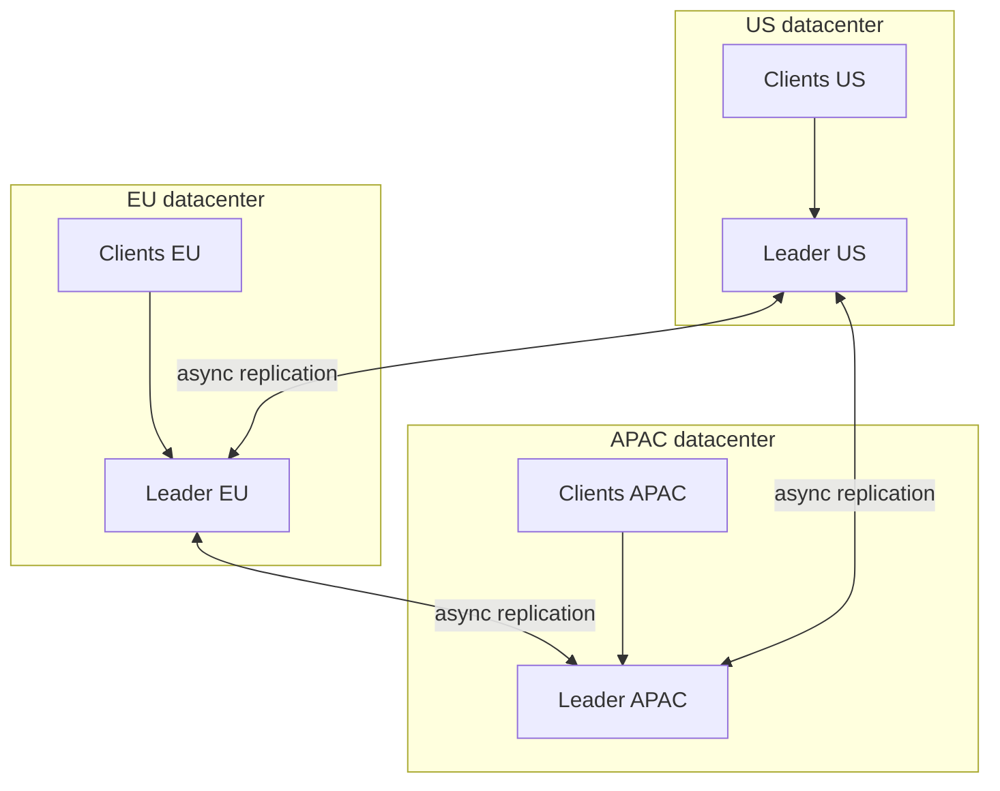
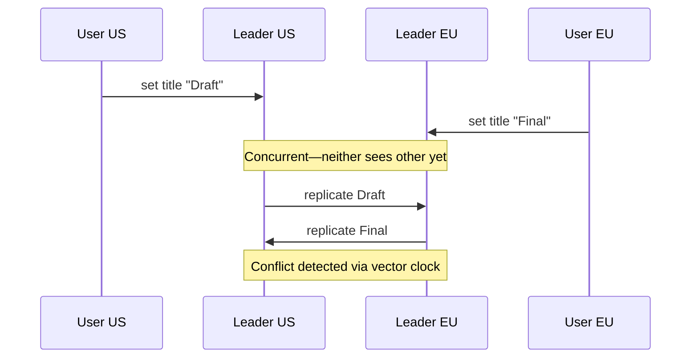
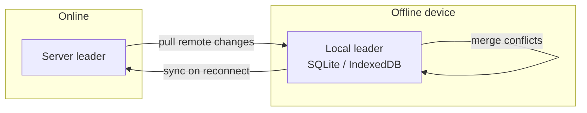

# Multi-Leader Replication

## 1. Executive Summary

**Multi-leader replication** (multi-master, active-active) allows **more than one node to accept writes** independently. Each leader processes local writes and **replicates changes to other leaders** asynchronously (typically). The model targets **multi-datacenter deployments**, **offline-first clients**, and **write locality**—users write to the nearest leader without cross-region RTT to a single primary. Kleppmann (*DDIA*, Chapter 5) identifies multi-leader as powerful but **conflict-prone**: concurrent writes to the same data item on different leaders produce **write conflicts** that require detection and resolution.

Unlike primary-secondary, there is no single global serialization point at write time. Leaders may diverge during network partitions; convergence depends on **replication topology**, **conflict detection** (version vectors, revision trees), and **resolution policy** (last-writer-wins, application merge, CRDTs). Production examples include CouchDB/Cloudant replication, Oracle GoldenGate bidirectional replication, LinkedIn's multi-region active-active patterns (with careful conflict design), and mobile sync backends where each device acts as a leader.

This chapter explains topologies (all-to-all, circular, star), conflict causes, async replication lag between leaders, operational complexity, and when multi-leader is justified versus sharded single-leader or leaderless quorums.

## 2. Why This Topic Matters

Multi-leader replication is seductive in architecture reviews—"write locally everywhere"—but it is the **highest-complexity** common replication topology. Principal architects must articulate:

- **Why conflicts are inevitable** under concurrent multi-leader writes, not edge cases.
- How **write skew** and **lost updates** differ from single-leader anomalies.
- **Circular replication** pitfalls (infinite loops, ordering) and topology design.
- **Offline clients** as logically multi-leader—same conflict math.

Interview failures: proposing multi-master for a workload with global uniqueness constraints; assuming LWW is sufficient; ignoring **causal ordering** across leaders; or unable to describe conflict resolution ownership (infra vs application). Real outages often trace to **misconfigured bidirectional replication** or **clock-based LWW** across regions.

At principal level, interviewers expect you to quantify **conflict rate** as a design input—not discover it in production. A workload with 0.01% conflicting writes on shared keys may tolerate manual merge; 5% concurrent edits on the same document requires CRDT or single-leader redesign. Multi-leader is as much an **organizational** commitment (merge UX, support runbooks, schema governance) as a technical topology.

Link multi-leader decisions to the [Conflict Resolution](/docs/replication/conflict-resolution) chapter early in design reviews—topology without merge policy is an incomplete architecture.

## 3. Problems Being Solved

| Problem | Multi-leader approach |
|---------|----------------------|
| Cross-region write latency | Local leader accepts writes |
| Datacenter outage | Other leaders continue writes |
| Offline mobile editing | Device queues writes; syncs as leader |
| Active-active DR | Both sites writable during normal ops |
| Regulatory data locality | Writes stay in-region; replicate out |

Multi-leader does **not** eliminate need for coordination on **global invariants** (unique email, inventory)—those require additional protocols or acceptance of risk.

## 4. Assumptions and System Model

Assume **partial failure**, **asynchronous inter-leader links**, **crash-stop** leaders:

- **Multiple leaders** each accept writes from local clients.
- **Replication** between leaders is typically async—leaders do not wait for global commit.
- **Conflicts** occur when concurrent updates to same logical object replicate to each other.
- **Convergence** requires deterministic resolution or application intervention.

**Safety (goal):** After quiescence and full replication, all leaders agree per resolution policy—not necessarily on intermediate states.

**Liveness:** Each leader remains writable during partition from peers (availability)—**AP** tendency during inter-leader partition.

**Not assumed:** Automatic conflict-free semantics; linearizability without extra coordination.

## 5. Essential Terminology

| Term | Definition |
|------|------------|
| **Multi-leader / multi-master** | Multiple nodes accept writes. |
| **Active-active** | All sites writable in normal operation. |
| **Write conflict** | Concurrent incompatible updates to same item. |
| **Replication topology** | Graph of leader-to-leader sync paths. |
| **All-to-all** | Every leader replicates to every other. |
| **Circular topology** | A→B→C→A chain—ordering hazards. |
| **Revision tree** | CouchDB-style branching history per document. |
| **Vector clock** | Detects concurrency across leaders. |
| **LWW** | Last-writer-wins—timestamp resolution. |
| **Offline-first** | Client as temporary leader. |
| **Anti-entropy** | Background sync between leaders. |
| **Split-brain (multi-leader)** | Divergent concurrent histories—not always fatal if merge exists. |

**Mnemonic:** Many writers, async mesh, **conflicts are normal**—design for them.

## 6. Core Mechanism

### Write and replicate loop

1. Client writes to local leader L1.
2. L1 commits locally; returns ack (fast).
3. L1 pushes change to peers \{L2, L3, ...\} asynchronously.
4. Concurrent write on L2 to same key creates conflict when records meet.
5. Resolution policy produces converged state (or surfaces conflict to user).

### Multi-datacenter topology



*Figure 1: Each region has a writable leader; mesh replication propagates changes.*

### Conflict detection



*Figure 2: Concurrent regional writes become conflicts when replication crosses.*

### Offline client as leader



*Figure 3: Mobile offline editing is multi-leader with the device as temporary write leader.*

## 7. Step-by-Step Walkthrough

**Scenario:** Collaborative calendar; US and EU leaders; async replication; LWW on `updated_at`.

| Step | Event | State |
|------|-------|-------|
| 1 | US user moves meeting to 3pm | US leader has v1 |
| 2 | EU user moves same meeting to 4pm | EU leader has v2 |
| 3 | Replication crosses | Conflict—two versions |
| 4 | LWW with EU clock ahead | EU wins—US change **lost** |
| 5 | US user sees 4pm without notice | **Silent data loss** |
| 6 | Better: detect siblings | UI prompts merge |
| 7 | Quiescence | Both leaders converge to merged or chosen value |

**Insight:** Multi-leader without conflict UX is a product failure, not merely a technical edge case.

## 8. Invariants and Guarantees

| Property | Multi-leader typical |
|----------|---------------------|
| **Local write availability** | High—local leader accepts |
| **Global write order** | **Not** total at commit time |
| **Conflict freedom** | **Not** guaranteed |
| **Eventual convergence** | Yes, with resolution policy |
| **Linearizability** | **Not** without coordination |
| **Uniqueness constraints** | **Not** without global protocol |

**Safety:** Convergence after quiescence per policy. **Liveness:** Leaders accept writes during inter-leader partition—divergence grows until heal.

Distinguish **formal guarantee** (eventual convergence) from **implementation choice** (LWW vs CRDT).

## 9. Failure Scenarios

### Scenario 1: LWW across regions with clock skew

**Setup:** NTP drift; EU clock fast.

**Effect:** EU always wins conflicts—systematic bias.

**Mitigation:** Logical clocks, version vectors, avoid wall-clock LWW globally.

### Scenario 2: Circular replication loop

**Setup:** A→B→C→A only; update re-applied infinitely or out of order.

**Effect:** Duplicate application, corrupted state.

**Mitigation:** All-to-all with unique operation IDs, or star hub; idempotent apply.

### Scenario 3: Partition between leader pairs

**Setup:** US-EU link down; both accept conflicting inventory decrements.

**Effect:** Oversell when merged—**application invariant** violated.

**Mitigation:** CRDT counters with bounds, reservation service, or CP metadata for inventory.

### Scenario 4: Schema drift between leaders

**Setup:** US migrates column; EU old schema receives new records.

**Effect:** Replication failure or silent truncation.

**Mitigation:** Coordinated schema migration, compatibility windows.

### Scenario 5: Conflict queue explosion

**Setup:** High concurrent edit rate; no auto-merge.

**Effect:** Human merge backlog; **liveness** of product features stalls.

**Mitigation:** Field-level CRDTs, automatic merge for safe fields.

### Scenario 6: Regulatory data residency violation

**Setup:** EU leader replicates PII to US leader after user withdraws consent in EU.

**Effect:** Compliance breach independent of technical conflict resolution.

**Mitigation:** Region-scoped replication filters, legal holds on delete propagation, architecture review before enabling cross-border multi-leader.

## 10. Performance Characteristics

| Dimension | Multi-leader |
|-----------|--------------|
| Local write latency | Low—no cross-region wait |
| Global visibility latency | Replication RTT between leaders |
| Write throughput | Sum of leaders (partitioned keys) |
| Hot key conflicts | Serialization still required per key |
| Replication bandwidth | O(leaders²) in full mesh |

Qualitative: wins on **geo write latency**; loses on **conflict handling cost** and **debuggability**. Hot keys remain a bottleneck—multi-leader does not shard a single key across writers safely without coordination.

**Write amplification across leaders:** A single logical write may be re-applied at each leader that receives the replication stream. For large payloads (media metadata, rich documents), inter-leader bandwidth becomes a hidden cost center—especially in full mesh topologies where each update traverses O(N) links. Compression and delta replication (sending only changed fields) are implementation optimizations that principal reviews should ask about explicitly.

**Comparison to PACELC:** Without partition, multi-leader still chooses between **latency** (local ack immediately) and **consistency** (wait for cross-leader visibility). Abadi's PACELC framing applies to the steady state—not only during failures. A multi-leader deployment that never measures inter-leader lag is optimizing for L in PACELC while assuming C emerges for free.

## 11. Scalability Limits

- **Conflict rate:** Scales poorly with concurrent editors on same object.
- **Mesh replication:** N leaders → N(N-1) streams—hub topology reduces at cost of SPOF.
- **Metadata per object:** Version vectors grow with leader count.
- **Operational headcount:** Runbooks for conflict triage don't scale linearly.
- **Global constraints:** Unique indexes require cross-leader coordination—limits applicability.

**When it scales:** Partitioned data (per-user documents), low overlap, mergeable datatypes.

## 12. Operational Considerations

- **Monitor:** Inter-leader lag, conflict rate, sibling count, replication errors.
- **Topology documentation:** Draw replication graph—onboarding depends on it.
- **Conflict dashboards:** Unresolved conflicts are incidents waiting to happen.
- **Clock discipline:** If using LWW, monitor skew—prefer logical versioning.
- **Schema governance:** Single migration pipeline for all leaders.
- **Game days:** Partition between two leaders; measure divergence duration.

## 13. Security Considerations

- **Conflict poisoning:** Malicious client writes on partitioned leader; merge must not privilege attacker (unsigned timestamps).
- **Cross-leader auth:** Revoked credentials may still write on offline leader until sync.
- **Replication TLS:** Inter-leader channels are high-value targets.
- **Data residency:** Leaders in-region may replicate PII out—policy violation if unchecked.

Security and compliance often **push back** on multi-leader—document data flows explicitly.

## 14. Cost Considerations

- **Infrastructure:** Multiple writable regions; mesh bandwidth.
- **Engineering:** Conflict UX, CRDT design, testing concurrent histories—high.
- **Support:** Users confused by merge dialogs—invisible in infra budget.
- **Incident cost:** Bidirectional replication misconfigurations are hard to unwind.

**Decision criterion:** Multi-leader when **write locality ROI** exceeds **conflict engineering cost**—not when single-leader + cache would suffice.

## 15. Production Implementations

### CouchDB / IBM Cloudant

Document replication between nodes; revision trees (`_rev`); conflicts stored as siblings until resolved—**explicit conflict model**.

### Couchbase Cross-Datacenter Replication (XDCR)

Active-active buckets with conflict resolution policies—verify current docs for consistency levels.

### Oracle GoldenGate / SQL Server bidirectional replication

Database-level multi-master for enterprises—schema and key design critical to avoid conflicts.

### Firebase / Firestore offline

Client-side writes with server merge—mobile multi-leader pattern.

### MySQL Group Replication (multi-primary mode)

Consensus within group—**different** from naive async multi-leader; conflicts reduced by group coordination at cost of latency.

### Riak (legacy reference)

Multi-datacenter replication informed Dynamo-family thinking—historical lessons on sibling proliferation.

**Distinction:** "Multi-primary" in marketing may mean **consensus-coordinated** (safer) vs **async mesh** (more conflicts)—read the fine print.

## 16. Alternatives and Tradeoffs

| Approach | Write locality | Conflicts | Complexity |
|----------|---------------|-----------|------------|
| Multi-leader async | Excellent | Frequent | High |
| Single leader + regional caches | Poor for writes | None on writes | Medium |
| Sharded single-leader per region | Good if shard-local | Cross-shard coord | Medium |
| Leaderless quorums | Good | Yes | Medium-high |
| CRDT-only stack | Good | Algebraic merge | Datatype-limited |

Kleppmann: consider **single leader per user** (user home region) as middle ground.

## 17. Common Misconceptions

| Misconception | Reality |
|---------------|---------|
| "Multi-master = 2× throughput" | Hot keys still serialize; conflicts add cost. |
| "Conflicts are rare" | Normal under concurrent edit + partition. |
| "LWW is good enough" | Clock skew causes silent loss. |
| "Same as primary-secondary with two primaries" | Missing conflict and ordering analysis. |
| "Offline sync is simpler" | It is multi-leader on one device. |
| "Active-active means zero downtime" | Failover easier; conflicts harder. |

## 18. Principal Architect Perspective

1. **Default away from multi-leader** until write locality proof exists.
2. **Own merge semantics** per entity—calendar ≠ inventory ≠ profile bio.
3. **Partition keys** to minimize cross-leader conflicts (user-scoped documents).
4. **Never LWW globally** on wall clocks—use vectors or CRDTs.
5. **Educate legal/compliance** on cross-border replication from multiple writers.

Executives want "active-active." Translate to **conflict budget** and **engineering headcount**.

**User-scoped sharding:** Often the winning compromise—each user's data has a home leader; cross-user operations use async workflows. This preserves most multi-leader benefits with fewer cross-key conflicts.

**Replication lag between leaders is not symmetric:** Inter-leader links may be slower US→EU than EU→US depending on peering and congestion. Conflict detection timing depends on which direction replication completes first—two users in different regions may both believe they won before siblings appear. Product copy should not promise "instant global visibility" without measuring inter-leader p99 lag.

**Bidirectional database replication pitfalls:** Enterprise DBAs sometimes enable bidirectional GoldenGate without application idempotency keys. Updates that bounce between regions can amplify into update storms or violate foreign-key ordering if child rows replicate before parents. Schema compatibility windows—where one leader runs new schema and another old—are a frequent source of silent row drops. Treat bidirectional replication as a **distributed system** project, not a checkbox feature.

## 19. Architecture Review Exercise

**Scenario:** Global note-taking app; multi-leader per region; rich text documents; shared notebooks across regions.

**Review prompts:**

1. Conflict rate on shared notebook vs personal notes?
2. CRDT for text (Yjs) vs LWW vs operational transform?
3. Unique notebook URL slug across regions?
4. Offline edit on plane then land in different region?
5. Audit trail when LWW drops an edit?

**Expected findings:** Personal notes fine multi-leader; shared notebooks need CRDT or single leader per notebook; global slug needs consensus service.

## 20. Whiteboard Explanation

**90-second version:**

> "Multi-leader means multiple nodes accept writes—usually one per datacenter or per offline client. Each leader commits locally fast and asynchronously replicates to peers. The hard part is conflicts: two users in different regions edit the same record concurrently, and both writes are valid locally until replication crosses—then you need detection with version vectors or revision trees and resolution via LWW, application merge, or CRDTs. LWW with wall clocks is dangerous across regions. Kleppmann recommends multi-leader for multi-datacenter write locality and offline clients, but says conflicts are the default case, not the exception. Operationally you need conflict metrics, topology clarity, and product UX for merges. If you need global uniqueness or inventory correctness, multi-leader alone isn't enough."

## 21. Interview Questions

1. **What is multi-leader replication?**
   - *Signals:* Multiple write nodes; async inter-leader sync.

2. **Why do write conflicts occur?**
   - *Signals:* Concurrent updates; no single serializer at write time.

3. **How detect conflicts?**
   - *Signals:* Vector clocks, revision trees, version metadata.

4. **LWW risks in multi-leader?**
   - *Signals:* Clock skew, silent data loss.

5. **Offline mobile as replication model?**
   - *Signals:* Device is leader; sync on reconnect.

6. **Multi-leader vs sharded single-leader?**
   - *Signals:* Shard = one writer per key; multi-leader = many per key possible.

7. **Circular replication topology problem?**
   - *Signals:* Ordering, loops, need unique op IDs.

8. **Can you enforce unique email multi-leader?**
   - *Signals:* Needs global coordination or accepted risk.

9. **CouchDB conflict handling?**
   - *Signals:* Siblings stored; app resolves.

10. **CAP behavior inter-leader partition?**
    - *Signals:* Both sides writable—AP; diverge until heal.

11. **When avoid multi-leader?**
    - *Signals:* High conflict, global constraints, team unprepared.

12. **CRDT role?**
    - *Signals:* Automatic merge for compatible datatypes.

13. **Active-active DR tradeoff?**
    - *Signals:* Availability vs conflict complexity.

14. **MySQL Group Replication multi-primary?**
    - *Signals:* Consensus within group—not naive async mesh.

## 22. Interview Follow-Ups

1. **Design shared document editor multi-region?**
   - *Signals:* OT/CRDT; not LWW on whole doc.

2. **Measure conflict rate before launch?**
   - *Signals:* Load test concurrent edits; pilot metrics.

3. **Rollback bidirectional replication mistake?**
   - *Signals:* Point-in-time restore, conflict audit, freeze writes.

4. **Hub vs mesh topology?**
   - *Signals:* Hub reduces streams; hub failure blast radius.

5. **Compare Firebase offline to CouchDB?**
   - *Signals:* Server merge rules vs explicit siblings.

## 23. Strong Answer Example

**Question:** "Should we go multi-master for our global CRM?"

> "I'd challenge the requirement. CRM writes are often per-account with occasional shared opportunities—I'd first model **home region per account** with single-leader per shard and async read replicas elsewhere. True multi-leader only where we prove cross-region write latency blocks revenue and conflicts are mergeable. For contact notes, CRDT or field-level LWW with vector clocks is fine. For opportunity amount and stage, I'd keep a **single writer** or use consensus per opportunity ID—financial fields can't LWW. We'd monitor inter-leader lag and conflict rate SLOs, build merge UX for sales reps, and never use wall-clock LWW across regions. If conflict rate projects above 1% of edits on shared objects, I'd reject naive multi-master. Kleppmann's guidance: multi-leader for offline and multi-DC locality, not as default."

## 24. Weak Answer Example

**Question:** "Should we go multi-master for our global CRM?"

> "Yes, multi-master gives better performance and HA. We'll use timestamps to resolve conflicts."

**Why weak:** No workload analysis, wall-clock LWW dismissed risks, no shared entity strategy, no uniqueness/inventory discussion.

## 25. Hands-On Exercise

**Exercise: Two-leader conflict lab**

1. Run two CouchDB instances (or minimal doc stores with `_rev`).
2. Create same doc ID on both while disconnected from each other.
3. Replicate bidirectionally; observe sibling conflicts.
4. Resolve with manual merge; retry with LWW and document data loss.
5. Implement per-user doc IDs only; show conflict rate drops to zero.

**Success criteria:** Produce sibling conflict artifact; explain one business field that cannot use LWW.

## 26. Knowledge Check

1. Core multi-leader tradeoff? *(Write locality vs conflicts.)*
2. Conflict detection tool? *(Vector clock / revision tree.)*
3. Why offline mobile is multi-leader? *(Local writes without central leader.)*
4. LWW failure mode? *(Clock skew data loss.)*
5. Hot key under multi-leader? *(Still contended—needs per-key strategy.)*
6. Eventual convergence requires? *(Resolution policy + replication.)*

## 27. Flashcards

| # | Front | Back |
|---|-------|------|
| 1 | Multi-leader | Multiple nodes accept writes. |
| 2 | Write conflict | Concurrent incompatible updates. |
| 3 | Active-active | All sites writable normally. |
| 4 | Vector clock | Detects concurrent writes across leaders. |
| 5 | Revision tree | CouchDB branching doc history. |
| 6 | LWW risk | Wall-clock skew loses writes. |
| 7 | Offline-first | Device as temporary leader. |
| 8 | Mesh topology | Each leader replicates to all. |
| 9 | Convergence | Requires merge policy after replication. |
| 10 | Not guaranteed | Global order, conflict freedom. |
| 11 | Hub topology | Fewer streams; hub is critical path. |
| 12 | Kleppmann caution | Conflicts are expected, not rare. |

## 28. Cheat Sheet

```
MULTI-LEADER
  - N writable leaders
  - Async inter-leader replication
  - Local fast writes

CONFLICTS
  - Concurrent same-key writes
  - Detect: vector clock / _rev tree
  - Resolve: LWW (risky), app merge, CRDT

TOPOLOGIES
  - All-to-all, hub, circular (careful)

GOOD FOR
  - Multi-DC write locality
  - Offline clients
  - Low-overlap partitioned data

AVOID WHEN
  - Global uniqueness, inventory
  - High shared-key contention
  - Team can't own merge UX
```

## 29. Related Concepts

- [Primary-Secondary Replication](/docs/replication/primary-secondary-replication) — single-writer baseline
- [Conflict Resolution](/docs/replication/conflict-resolution) — merge policies and CRDTs
- [Leaderless Replication](/docs/replication/leaderless-replication) — alternative AP write model
- [Vector Clocks](/docs/time-ordering-and-coordination/vector-clocks) — concurrency detection
- [Eventual Consistency](/docs/consistency/eventual-consistency) — convergence semantics
- [Idempotency](/docs/distributed-systems-foundations/idempotency) — safe retry on sync

## 30. References

### Primary sources

- Martin Kleppmann, *Designing Data-Intensive Applications* (O'Reilly), Chapter 5 — multi-leader replication, conflicts, topologies.
- Anderson, E., et al. (2010). ["Conflict Resolution for Offline Synchronization."](https://www.usenix.org/legacy/event/atc10/tech/full_papers/anderson.pdf) *USENIX ATC* — mobile sync context (verify applicability).

### Production documentation

- Apache CouchDB Documentation: ["Replication."](https://docs.couchdb.org/en/stable/replication/intro.html) — multi-master, conflicts, `_rev`.
- IBM Cloudant Documentation: ["Replication Guide."](https://cloud.ibm.com/docs/Cloudant) — conflict handling in managed CouchDB.

### Papers and blogs

- DeCandia, G., et al. (2007). Dynamo paper — contrasts with leaderless; multi-DC lessons.
- Shapiro, M., et al. (2011). ["Conflict-Free Replicated Data Types."](https://arxiv.org/abs/1106.4630) — mergeable datatypes for multi-leader.

### Distinction

| Claim type | Source |
|------------|--------|
| Multi-leader conflict inevitability | Kleppmann (*DDIA* Ch. 5) |
| CouchDB sibling model | CouchDB official docs |
| CRDT semantics | Shapiro et al. (2011) |
| Specific product multi-primary behavior | Vendor docs—verify current |
