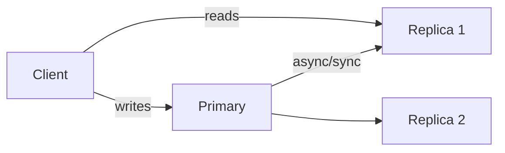

# Replication

Primary-secondary, multi-leader, leaderless replication, quorums, and conflict resolution.

*Figure: Primary-secondary replication with read/write paths.*

## What You'll Learn

Replication trades availability and latency against consistency. This domain covers replication topologies, read/write quorums, failover, conflict detection, and CRDTs as an alternative to last-write-wins.

## Chapters

| Chapter | Focus |
|---------|-------|
| [Primary-Secondary Replication](/docs/replication/primary-secondary-replication) | Leader-based replication, sync vs async |
| [Multi-Leader Replication](/docs/replication/multi-leader-replication) | Active-active, write conflicts |
| [Leaderless Replication](/docs/replication/leaderless-replication) | Dynamo-style quorums, sloppy quorums |
| [Conflict Resolution](/docs/replication/conflict-resolution) | LWW, version vectors, application-level merge |
| [Conflict-Free Replicated Data Types](/docs/replication/crdts) | Eventually consistent data structures |

## Learning Path

1. **Primary-Secondary** — the default mental model for databases.
2. **Leaderless** and **Quorum Systems** (in [Consistency](/docs/consistency/quorum-systems)) — Dynamo/Cassandra intuition.
3. **Multi-Leader** — multi-region active-active tradeoffs.
4. **Conflict Resolution** and **CRDTs** — when replicas diverge by design.

## Interview Prep

| Resource | Topic |
|----------|-------|
| [Amazon DynamoDB Consistency](/docs/real-world-scenarios/amazon-dynamodb-eventual-consistency) | Quorums, session guarantees |
| [Dropbox Sync Conflicts](/docs/real-world-scenarios/dropbox-file-sync-conflicts) | Conflict copies |
| Lab | [Eventual consistency](/docs/consistency/eventual-consistency#25-hands-on-exercise) on **`:8099`** — [engineer guide](/docs/consistency/eventual-consistency#engineer-guide-how-the-local-stack-works) |

## Prerequisites

- [Distributed Systems Foundations](/docs/distributed-systems-foundations/overview)
- [Consistency Models](/docs/consistency/overview)

## Next Domain

Continue to [Storage Engines](/docs/storage-engines/overview) and [Distributed Databases](/docs/distributed-databases/overview).

Return to the [Curriculum Overview](/docs/start-here/curriculum-overview) for the full learning path.
