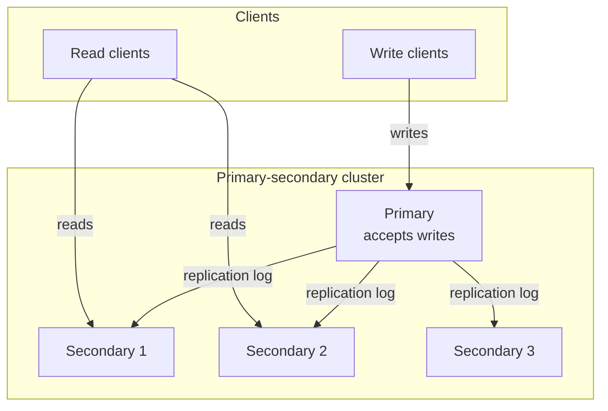
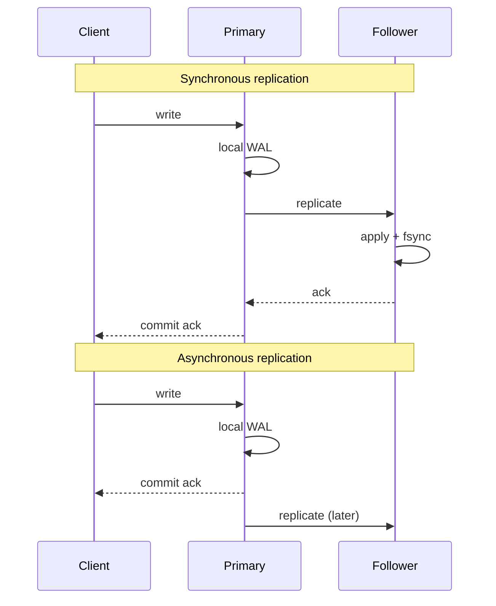
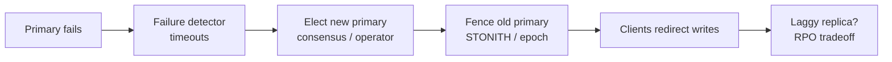

# Primary-Secondary Replication

## 1. Executive Summary

**Primary-secondary replication** (also called **leader-follower** or **master-replica**) is the dominant replication topology in production databases: one **primary** (leader) accepts all writes; **secondaries** (followers) receive a **log** of changes and apply them locally. Clients may read from secondaries for scale and locality, but write ordering is centralized at the primary. Kleppmann (*DDIA*, Chapter 5) treats this as the default replication model because it avoids write conflicts while providing a clear serialization point.

The model trades **write scalability** (single leader bottleneck) for **simplicity of consistency**: if replication is synchronous, followers reflect committed writes before the client receives acknowledgment; if asynchronous, the primary can acknowledge before all followers catch up—improving latency and availability at the cost of **replication lag** and **data loss risk** on failover. Production systems—PostgreSQL streaming replication, MySQL binlog replication, MongoDB replica sets (single writable primary), and cloud RDS read replicas—are variations on this theme with different failover, quorum, and consistency mechanisms.

This chapter covers the replication log, sync vs async tradeoffs, read-your-writes and monotonic reads, failover pitfalls (split-brain, lost writes), and principal-level design criteria for when primary-secondary is the right foundation versus multi-leader or leaderless alternatives.

## 2. Why This Topic Matters

Primary-secondary replication is the **baseline mental model** for distributed data at principal-architect interviews. Most engineers have operated a database with a primary and replicas; fewer can explain:

- What **exactly** is replicated (statement-based vs row-based vs logical log).
- Whether a read from a replica is **linearizable**, **monotonic**, or arbitrarily stale.
- What happens to **in-flight writes** when the primary fails.
- How **failover** interacts with **fencing**, **epoch numbers**, and **split-brain**.

Interview failures include: assuming replicas are always consistent with the primary; ignoring replication lag in UX; designing global writes on a single leader without latency analysis; or conflating "replica set" with multi-master. Principal architects must connect replication mode to **RPO/RTO**, **CAP behavior during partition** (typically CP for the write path), and operational runbooks.

## 3. Problems Being Solved

| Problem | Primary-secondary approach |
|---------|---------------------------|
| Durability beyond one machine | Replicate write-ahead log to followers |
| Read scalability | Serve reads from many secondaries |
| Geographic read locality | Regional read replicas |
| Maintenance without downtime | Promote replica; demote primary |
| Backup and analytics | Snapshot from secondary without load on primary |
| Disaster recovery | Cross-region replica for RPO |

Primary-secondary does **not** solve global low-latency writes (single leader RTT), write-heavy horizontal scale without partitioning, or availability during primary loss without failover complexity.

## 4. Assumptions and System Model

Assume **partial failure**, **asynchronous network** unless sync replication configured, and **crash-stop** nodes (may restart with disk):

- **Single writable primary** at a time (invariant for this topology).
- **Total order of writes** established at primary (via log sequence).
- **Followers** are passive for writes; apply log in order.
- **Failover** may promote a follower; requires external coordination or consensus to avoid dual primaries.

**Safety property (typical goal):** No two primaries accept conflicting writes simultaneously (split-brain prevention).

**Liveness property:** System continues serving reads; writes resume after failover completes.

**Not assumed:** Automatic zero-data-loss failover without sync replication or quorum; linearizable reads from async replicas without additional protocol.

## 5. Essential Terminology

| Term | Definition |
|------|------------|
| **Primary / leader** | Node accepting writes; appends to replication log. |
| **Secondary / follower / replica** | Node applying log; may serve reads. |
| **Replication log** | Ordered stream of changes (WAL, binlog, oplog). |
| **Synchronous replication** | Primary waits for follower ack before commit ack to client. |
| **Asynchronous replication** | Primary acks after local commit; followers catch up later. |
| **Replication lag** | Delay between primary commit and follower application. |
| **Failover** | Promote follower to primary after primary failure. |
| **Split-brain** | Two nodes both believe they are primary—**safety violation**. |
| **Read replica** | Secondary used for read scaling. |
| **Hot standby** | Follower ready for immediate promotion. |
| **Semi-sync** | Wait for at least one follower (MySQL semi-sync, etc.). |
| **Catch-up replication** | New follower copies full snapshot then tails log. |

**Mnemonic:** One writer, many readers, ordered log—the **single serialization point**.

## 6. Core Mechanism

### Write path

1. Client sends write to primary.
2. Primary writes to local WAL/log, assigns **log position** (LSN, binlog offset).
3. Replication stream ships log records to followers (streaming).
4. Followers apply in order; update local state.
5. Primary responds to client per sync policy (after local only, or after N followers).

### Topology



*Figure 1: Single primary fans out ordered log to secondaries; reads may bypass primary.*

### Sync vs async commit



*Figure 2: Sync waits for follower; async acks before follower durable—lower latency, higher loss risk.*

### Failover sequence



*Figure 3: Failover requires detection, election, fencing, and explicit RPO handling for lagging replicas.*

## 7. Step-by-Step Walkthrough

**Scenario:** E-commerce order table; PostgreSQL primary + 2 async replicas; read replica for reporting.

| Step | Event | Observation |
|------|-------|-------------|
| 1 | Customer places order; write to primary | Order visible on primary immediately |
| 2 | Replication streams to replicas | Lag ~50ms typical |
| 3 | Customer refreshes page; read hits replica | **Stale read possible**—order missing briefly |
| 4 | Reporting query on replica | Acceptable lag for analytics |
| 5 | Primary disk failure | Writes fail; failover initiated |
| 6 | Promote replica with least lag | Orders not yet replicated **lost** (async RPO > 0) |
| 7 | Old primary recovers | Must not accept writes—**fencing** |

**Insight:** Async replication is fast until failover exposes the durability gap. Product reads after write should route to primary or use **read-your-writes** session stickiness.

## 8. Invariants and Guarantees

| Property | Sync replication | Async replication |
|----------|------------------|-------------------|
| **Write ordering** | Total order at primary | Total order at primary |
| **Durability on primary fail** | Committed = on ≥1 follower | Committed may exist only on dead primary |
| **Read from follower** | Often fresh post-commit | **Stale** possible |
| **Linearizable reads** | Possible with routing | Not from lagging replica |
| **Single primary** | Required | Required—enforced by ops/consensus |

**Safety:** Prevent dual primaries (split-brain). **Liveness:** Failover completes in bounded time with external coordinator (etcd, Pacemaker, operator).

Kleppmann emphasizes: **consistency guarantees are properties of the whole system**, not the replication label—sync to one follower ≠ sync to all.

## 9. Failure Scenarios

### Scenario 1: Primary fails with async replication

**Setup:** Last 2 seconds of writes not replicated.

**Effect:** **RPO > 0**—data loss on promotion.

**Mitigation:** Semi-sync, synchronous replication for critical tables, or accept loss with business sign-off.

### Scenario 2: Split-brain after network partition

**Setup:** Primary isolated; replica promoted; old primary still accepts writes.

**Effect:** Divergent histories—merge extremely costly.

**Mitigation:** Fencing (disable old primary), epoch numbers (MongoDB, Raft), STONITH in HA clusters.

### Scenario 3: Replication lag thundering herd

**Setup:** Replica 30s behind; all post-login reads hit replica.

**Effect:** Users see missing data after actions—support tickets.

**Mitigation:** Read-your-writes routing, lag-aware load balancing, sync for session-critical reads.

### Scenario 4: Cascading replica failure

**Setup:** Primary overload replicating to many slow followers.

**Effect:** Primary replication slots fill; disk pressure; **liveness** degradation.

**Mitigation:** Limit replica count, parallel apply workers, drop lagging replicas from read pool.

### Scenario 5: Failover to lagging replica

**Setup:** Automated failover picks replica without lag check.

**Effect:** Mass apparent "rollback" of recent data.

**Mitigation:** Prefer most caught-up replica; manual approval for large lag.

### Scenario 6: Logical replication filter misconfiguration

**Setup:** PostgreSQL logical replication publishes subset of tables; application assumes full database consistency across subscriber.

**Effect:** Join queries on subscriber return incomplete results—**silent correctness bug** distinct from lag.

**Mitigation:** Integration tests on subscriber; document replication scope; monitor replication slot lag per publication.

## 10. Performance Characteristics

| Dimension | Primary-secondary |
|-----------|-------------------|
| Write throughput | Bounded by single primary |
| Write latency | +RTT per sync follower waited |
| Read throughput | Scales with replica count |
| Read latency | Local replica—low |
| Failover time | Seconds to minutes (detection + election) |
| Cross-region writes | High latency to single leader |

Qualitative: excellent for **read-heavy** workloads; **write-heavy** global apps need sharding or alternative topologies. Replication lag is **unbounded** under load unless monitored and capped by backpressure.

## 11. Scalability Limits

- **Primary CPU/IO:** All writes serialize—vertical scale ceiling.
- **Replication bandwidth:** Log volume × replica count—large blobs amplify.
- **Follower apply rate:** Single-threaded apply common—lag grows under write spikes.
- **Failover frequency:** Flapping primaries degrade trust—stabilize detection thresholds.
- **Global users:** Single-region primary imposes WAN RTT on every write.

**Sharding** partitions data across multiple primary-secondary groups—each shard retains single-leader semantics per key range.

## 12. Operational Considerations

- **Monitor:** Replication lag (bytes and seconds), replication slot disk usage, primary WAL retention.
- **Alert:** Lag exceeding SLO; replica disconnect; failover events.
- **Runbooks:** Documented promotion steps; verify fencing; client connection string updates.
- **Testing:** Game-day failover; measure actual RPO/RTO—not vendor claims.
- **Schema changes:** Online DDL coordination—replicas must apply compatible migrations.
- **Backup:** Base backup + WAL archiving; test restore independently of replication.

## 13. Security Considerations

- **Replication channel:** Authenticate replicas (TLS, certificates); prevent rogue follower injection.
- **Read replica exposure:** May lag behind permission revocations—**staleness in security state**.
- **Split-brain writes:** Attacker triggering partition could exploit dual-primary window—fencing is security-relevant.
- **Logical replication:** Row filters may leak sensitive data to less-trusted replica subscribers.

Replication does not replace **encryption at rest** or **access control**—it copies whatever the primary committed.

## 14. Cost Considerations

- **Replica instances:** Linear cost per read replica; cross-AZ/region egress for log shipping.
- **Sync replication:** Extra follower capacity for durability; write latency may require larger primary.
- **Failover infrastructure:** Consensus sidecar (etcd), HA proxy, operator—operational tax.
- **Under-replication:** Async saves money until outage—**insurance vs premium** tradeoff.

**Decision criterion:** Async replicas for scale and DR with accepted RPO; sync when financial or inventory data loss is unacceptable.

## 15. Production Implementations

### PostgreSQL

Streaming replication from WAL; synchronous_standby_names for sync subset; hot standby reads. Failover via Patroni, repmgr, or cloud managed service. **Implementation choice:** quorum vs any sync standby.

### MySQL / MariaDB

Binlog replication (async default); semi-sync plugin waits for one ack; Group Replication provides consensus-based multi-primary option—**different topology** when enabled.

### MongoDB replica set

Single primary elected via Raft-like protocol; oplog tailing; read concern levels (`local`, `majority`) change observed consistency—**not** same as replication mode alone.

### Amazon RDS / Aurora

Aurora storage-layer replication (6 copies across AZs); read replicas share storage—lower lag than traditional binlog shipping for many workloads. Verify current AWS documentation for durability claims.

### Redis replication

Async by default; Redis Sentinel for failover; recent versions add partial sync—**in-memory** constraints differ from disk databases.

**Distinction:** Managed services hide failover but **do not eliminate** CAP and lag tradeoffs—read SLAs carefully.

## 16. Alternatives and Tradeoffs

| Topology | Write conflicts | Failover complexity | Read scale |
|----------|----------------|---------------------|------------|
| Primary-secondary | None | Moderate | High via replicas |
| Multi-leader | Yes | Higher | High |
| Leaderless (quorum) | Yes (concurrent) | Lower single-node role | High |
| Chain replication | None | Chain head failure | Sequential |

Choose primary-secondary when **conflict-free writes** and **clear ordering** matter; avoid when **multi-region write latency** dominates and conflicts are manageable.

## 17. Common Misconceptions

| Misconception | Reality |
|---------------|---------|
| "Replicas are always consistent" | Async lag always possible. |
| "Failover is instant" | Detection + election + DNS takes time. |
| "Sync means no data loss" | Sync to one follower still loses if both fail. |
| "Read replica offloads all load" | Replication and apply still cost primary. |
| "More replicas = more durable" | Durability depends on commit quorum policy. |
| "Primary-secondary = strongly consistent reads" | Only with correct routing and sync/majority reads. |

## 18. Principal Architect Perspective

1. **State RPO/RTO explicitly** for every tier—async is a business decision.
2. **Session consistency** for UX: route post-write reads to primary or tracked replica.
3. **Fencing is non-negotiable** for automated failover—budget STONITH or cloud API disable.
4. **Replication ≠ backup**—replicas propagate deletes and corruption.
5. **Plan shard growth** before primary hits write ceiling—migration is painful.

Kleppmann's framing: replication for **high availability** vs **disconnected operation** vs **latency**—primary-secondary excels at HA and read scale, not at multi-master write locality.

**Capacity planning:** Treat replication lag as a queue. If apply rate < write rate sustained, lag grows without bound—eventually reads are useless and failover RPO explodes. Principal reviews should include lag SLOs alongside CPU metrics.

**Log shipping formats matter:** Statement-based replication replays SQL on followers—non-deterministic functions (`NOW()`, `UUID()`) break correctness unless handled. Row-based replication ships row changes—safer for determinism but higher volume. Logical decoding (PostgreSQL) enables selective replication to analytics subscribers but adds operational surface area. Architecture reviews should state which format is in use and whether triggers and cascading deletes replicate as expected.

**Read scaling caveats:** Followers reduce read load on the primary only when queries are actually routed away. Connection poolers, ORM defaults, and sticky sessions often accidentally send most traffic to the primary—negating replica investment. Lag-aware routing requires measuring per-replica lag and excluding outliers from the read pool. For reporting workloads, snapshot isolation on a delayed replica is acceptable; for authorization checks after password change, it is not.

## 19. Architecture Review Exercise

**Scenario:** Global SaaS; single US primary; EU read replicas; async replication; users edit documents then share links immediately.

**Review prompts:**

1. Can EU user A see EU user B's edit instantly via replica?
2. What happens if US primary fails during peak EU morning?
3. Should document open-after-save read from primary?
4. Cross-region write latency acceptable for all features?
5. Failover automation vs manual for RPO > 0?

**Expected findings:** Stale reads break share flows; need read-your-writes or regional primary for write-heavy EU; document RPO in status page playbook.

## 20. Whiteboard Explanation

**90-second version:**

> "Primary-secondary means one leader takes all writes and ships an ordered log to followers. Followers can serve reads but may lag. Sync replication waits for follower ack before telling the client commit—that reduces data loss on failover but adds latency. Async is faster but you can lose the last seconds of writes when the primary dies. Failover promotes a replica, but you must fence the old primary to avoid split-brain. For interviews, always mention replication lag: users who write then read from a replica might not see their data. PostgreSQL and MySQL are classic examples; MongoDB uses the same idea with Raft election. It's the default because you avoid write conflicts—at the cost of a write bottleneck on one node."

## 21. Interview Questions

1. **Explain primary-secondary replication.**
   - *Signals:* Single writer, log shipping, followers apply in order.

2. **Sync vs async replication tradeoffs?**
   - *Signals:* Latency vs durability/RPO; follower ack timing.

3. **What is replication lag?**
   - *Signals:* Delay primary→follower; stale reads.

4. **How prevent split-brain?**
   - *Signals:* Fencing, epoch, consensus, STONITH.

5. **Read-your-writes with replicas?**
   - *Signals:* Route to primary, version check, session stickiness.

6. **RPO with async failover?**
   - *Signals:* Unreplicated commits lost; quantify lag window.

7. **Can followers accept writes?**
   - *Signals:* No in pure model; split-brain if yes without coordination.

8. **Statement vs row-based replication?**
   - *Signals:* Determinism, trigger side effects, correctness.

9. **Why single leader?**
   - *Signals:* Avoid write conflicts; total order.

10. **MongoDB read concern `majority`?**
    - *Signals:* Wait for replicated oplog entries—not same as sync writes.

11. **Chain replication vs primary-fanout?**
    - *Signals:* Chain reduces primary fanout; head failure sensitivity.

12. **When not use primary-secondary?**
    - *Signals:* Global write latency, write scale beyond one node.

13. **Replication vs backup?**
    - *Signals:* Replica mirrors live state including mistakes.

14. **Semi-sync replication purpose?**
    - *Signals:* Balance latency and durability—one follower ack.

## 22. Interview Follow-Ups

1. **Design failover for zero RPO?**
   - *Signals:* Sync quorum, consensus (Paxos/Raft), accept write latency.

2. **User sees stale profile after update—debug?**
   - *Signals:* Read replica routing, lag metrics, cache layers.

3. **Promote replica with 5min lag—impact?**
   - *Signals:* Rollback appearance; client retries; incident comms.

4. **Compare Aurora to Postgres streaming.**
   - *Signals:* Storage vs log shipping; shared storage replicas.

5. **Shard vs bigger primary?**
   - *Signals:* Write ceiling, operational complexity, cross-shard queries.

## 23. Strong Answer Example

**Question:** "Design HA for a payment ledger with strict durability."

> "I'd use primary-secondary with **synchronous replication to a quorum** of followers in the same region—PostgreSQL synchronous_commit on with quorum standbys, or a consensus layer. Writes ack only after durable on majority, so failover to a caught-up replica gives RPO≈0 for committed transactions. Reads for balance checks use primary or `majority` read concern—never stale replica for authorization. Automated failover via Patroni with **fencing** through cloud API disable of old primary. Async cross-region replica for disaster recovery only—not promoted without manual break-glass with explicit RPO acceptance. Monitor replication lag and slot bloat; game-day failover quarterly. This is Kleppmann's leader-based model optimized for **safety** on the write path, accepting latency cost."

## 24. Weak Answer Example

**Question:** "Design HA for a payment ledger with strict durability."

> "Set up a read replica in another AZ. If primary fails, failover happens automatically. RDS handles it."

**Why weak:** No sync/quorum discussion, no split-brain/fencing, no read staleness on balance checks, assumes managed failover implies zero RPO.

## 25. Hands-On Exercise

**Exercise: Lag and failover simulator**

1. Deploy PostgreSQL primary + async replica (Docker or local).
2. Generate continuous writes; measure lag with `pg_stat_replication`.
3. Kill primary mid-write burst; promote replica; count missing rows vs primary WAL if recoverable.
4. Implement application routing: post-write reads to primary for 2s.
5. Repeat with synchronous_standby_names enabled; compare RPO and p99 write latency.

**Success criteria:** Quantify RPO difference async vs sync; document one stale-read user scenario.

## 26. Knowledge Check

1. Who accepts writes in primary-secondary? *(Primary only.)*
2. Async replication RPO on failover? *(>0 if unreplicated commits exist.)*
3. Split-brain cause? *(Two primaries without fencing.)*
4. Purpose of replication log? *(Ordered change stream for followers.)*
5. Read replica stale read cause? *(Replication lag.)*
6. Sync replication latency cost? *(Follower RTT + fsync.)*

## 27. Flashcards

| # | Front | Back |
|---|-------|------|
| 1 | Primary-secondary | One writer; followers replicate log. |
| 2 | Replication lag | Delay before follower matches primary. |
| 3 | Sync replication | Commit ack after follower durable. |
| 4 | Async replication | Commit ack before follower catch-up. |
| 5 | Split-brain | Two primaries—safety violation. |
| 6 | Fencing | Prevent old primary accepting writes. |
| 7 | RPO | Data loss window on failover. |
| 8 | Read-your-writes | Client sees own writes—needs routing. |
| 9 | Hot standby | Replica ready for promotion. |
| 10 | WAL/binlog | Ordered log shipped to followers. |
| 11 | Semi-sync | Wait for one follower ack. |
| 12 | Replication ≠ backup | Replicas copy errors and deletes. |

## 28. Cheat Sheet

```
PRIMARY-SECONDARY
  - 1 writer, N followers, ordered log
  - Writes: primary only
  - Reads: primary or replicas (may lag)

SYNC vs ASYNC
  - Sync: lower RPO, higher write latency
  - Async: faster, stale reads + loss risk

FAILOVER
  - Detect → elect → fence old primary
  - Check lag before promote

CONSISTENCY
  - Not automatic on replicas
  - read-your-writes: route or version

SYSTEMS
  - Postgres WAL, MySQL binlog, Mongo oplog

WHEN
  - Read scale, conflict-free writes
  - Not: global write latency, write bottleneck
```

## 29. Related Concepts

- [Multi-Leader Replication](/docs/replication/multi-leader-replication) — multiple write leaders; conflicts
- [Leaderless Replication](/docs/replication/leaderless-replication) — quorum writes without fixed leader
- [Conflict Resolution](/docs/replication/conflict-resolution) — when concurrent writes occur
- [Eventual Consistency](/docs/consistency/eventual-consistency) — follower staleness semantics
- [Linearizability](/docs/consistency/linearizability) — strong read consistency target
- [Partial Failure](/docs/distributed-systems-foundations/partial-failure) — why replication exists

## 30. References

### Primary sources

- Martin Kleppmann, *Designing Data-Intensive Applications* (O'Reilly), Chapter 5 — leader-based replication, sync/async, failover.
- Corbett, J. C., et al. (2012). ["Spanner: Google's Globally-Distributed Database."](https://research.google/pubs/pub39966/) *OSDI* — evolution beyond single-leader with TrueTime (contrast case).

### Production documentation

- PostgreSQL Documentation: ["High Availability, Load Balancing, and Replication."](https://www.postgresql.org/docs/current/high-availability.html) — streaming replication, sync standbys.
- MySQL Reference Manual: ["Replication."](https://dev.mysql.com/doc/refman/8.0/en/replication.html) — async, semi-sync, Group Replication.
- MongoDB Manual: ["Replica Set Elections."](https://www.mongodb.com/docs/manual/core/replica-set-elections/) — primary election, read concerns.

### Textbooks and papers

- Tanenbaum & Van Steen, *Distributed Systems* — state machine replication, primary-backup.
- Van Renesse, F., & Schneider, F. B. (2004). ["Chain Replication for Supporting High Throughput and Availability."](https://www.cs.cornell.edu/home/rvr/papers/osdi04.pdf) *OSDI* — alternative topology.

### Distinction

| Claim type | Source |
|------------|--------|
| Leader-follower model | Kleppmann (*DDIA* Ch. 5) |
| Postgres/MySQL behavior | Official documentation |
| RPO on async failover | General distributed systems principle |
| Aurora replication details | AWS documentation—verify current |
