# CAP Theorem

## 1. Executive Summary

The **CAP theorem** formalizes a constraint on replicated data stores in distributed systems: when the network **partitions** so that nodes cannot communicate, a system cannot simultaneously provide **linearizable consistency** (Gilbert and Lynch's *C*) and **availability** (their *A*) for every request. **Partition tolerance** (*P*) is not an optional third knob—it reflects the reality that networks fail; the meaningful choice during a partition is between sacrificing strong consistency or sacrificing full availability.

Eric Brewer introduced the idea as a conjecture at PODC 2000; Gilbert and Lynch (2002) proved it for asynchronous networks with atomic read/write registers. This chapter presents the **formal definitions**, a **proof sketch**, production interpretations, common misreadings, and how CAP relates to safety/liveness and system models from the prerequisite chapter on [Distributed System Models](/docs/distributed-systems-foundations/distributed-system-models).

CAP is a **forcing function** for architecture reviews, not a catalog of database labels. Principal architects use it to ask: *During a partition, which invariant do we refuse to violate, and how do we detect, bound, and recover from that choice?*

## 2. Why This Topic Matters

CAP appears in nearly every senior system-design interview, yet it is one of the most **misquoted** results in distributed computing. Interviewers at principal level are not checking whether you can recite "pick two of three." They are checking whether you can:

- State **Gilbert and Lynch's definitions** precisely (linearizability vs. other "consistency" meanings).
- Distinguish **partition-time behavior** from steady-state design.
- Connect CAP to **safety and liveness**: consistency as a safety property; availability as a liveness property under failure.
- Explain why **P is not optional** for any system that spans multiple failure domains.
- Avoid marketing labels ("AP database") as substitutes for explicit client guarantees.

Misunderstanding CAP leads to expensive mistakes: promising linearizable reads from a multi-region deployment without quorum coordination; assuming "we chose AP" excuses duplicate writes; or designing incident response without a defined partition behavior. This chapter gives you vocabulary that survives whiteboard scrutiny and production postmortems.

## 3. Problems Being Solved

| Problem | How CAP frames it |
|---------|-------------------|
| **Split-brain writes** | Under partition, two sides may accept writes unless one side refuses requests (CP) or exposes divergent state (AP). |
| **Stale reads after failover** | Availability on both sides during partition implies reads may not reflect latest committed write. |
| **Regional isolation** | WAN partition is not rare at scale; CAP asks what clients observe when links fail. |
| **Technology selection** | Forces explicit guarantees instead of assuming "the database handles it." |
| **Incident communication** | Gives precise language: "We are CP for metadata; AP for read replicas with bounded staleness." |

CAP does **not** solve partition recovery, conflict resolution, or client retry semantics—it **bounds** what is possible without additional mechanisms (fencing, version vectors, external coordination).

## 4. Assumptions and System Model

Gilbert and Lynch's proof assumes:

| Dimension | Assumption |
|-----------|------------|
| **Network** | Asynchronous: no upper bound on message delay; messages may be lost or delayed arbitrarily. |
| **Processes** | Crash-stop is not the focus; nodes that receive requests are **non-failing** for the availability definition. |
| **Data object** | A **single atomic read/write register** (linearizable semantics). |
| **Partition** | The network divides nodes into two or more groups with **no messages delivered** between groups for some period. |
| **Client model** | Clients may contact any node; requests must complete at non-failing nodes if the system is available. |

This aligns with the **asynchronous message-passing** model from [Distributed System Models](/docs/distributed-systems-foundations/distributed-system-models). CAP is **not** a theorem about Byzantine faults, transactional isolation across multiple keys, or multi-object serializability unless you extend definitions explicitly.

**Production caveat:** Real systems are often **partially synchronous** (eventual bounds after stabilization). CAP's impossibility still guides **worst-case partition behavior**; partial synchrony helps **recovery and liveness after** the partition heals, not the simultaneous satisfaction of C and A **during** the partition.

## 5. Essential Terminology

| Term | Gilbert & Lynch (2002) definition |
|------|-----------------------------------|
| **Consistency (C)** | All operations appear to execute **atomically** at a single instant, consistent with a sequential read/write register (equivalent to **linearizability** for the single-register case). |
| **Availability (A)** | Every request received by a **non-failing** node must result in a **non-error response** within a finite time, without the node knowing whether other nodes agree. |
| **Partition tolerance (P)** | The system continues to operate despite **arbitrary message loss** between nodes (network partitions are a manifestation). |
| **Network partition** | A period when messages between some pairs of nodes are not delivered. |
| **CP (during partition)** | Sacrifice availability: some requests fail or time out rather than violate linearizability. |
| **AP (during partition)** | Sacrifice linearizability: both sides may respond, possibly with divergent or stale data. |
| **Brewer's conjecture (2000)** | Informal claim that consistency, availability, and partition tolerance cannot all hold in the large-scale distributed systems setting. |
| **CAP theorem (proved)** | In an asynchronous network, a replicated read/write register cannot be C, A, and P simultaneously when a partition occurs. |

**Not in Gilbert & Lynch:** "eventual consistency," "BASE," "strong consistency" without definition, or multi-key ACID—these are separate layers.

## 6. Core Mechanism

### 6.1 The theorem (statement)

> **Theorem (Gilbert & Lynch, 2002):** In an asynchronous network, it is impossible to implement a read/write data store that provides all three of:
> 1. **Consistency** (linearizable atomicity),
> 2. **Availability** (every non-failing node responds successfully to every request),
> 3. **Partition tolerance** (system operates despite lost messages between nodes),
>
> when a network partition separates the nodes.

### 6.2 Proof sketch (two-node case)

Consider two nodes **D1** and **D2** that replicate a register, and clients that may send reads/writes to either node.

1. **Setup:** Suppose the system is linearizable, available, and partition tolerant.
2. **Partition:** The network drops all messages between D1 and D2. Clients C1 and C2 can still reach D1 and D2 respectively (each side is non-failing and reachable).
3. **Write:** C1 writes `v1` to D1. Because the system is available, D1 must acknowledge success without coordinating with D2 (messages are dropped).
4. **Read:** C2 reads from D2. Because the system is available, D2 must return some value `v` in finite time, again without coordinating with D1.
5. **Contradiction:** Linearizability requires that if the write of `v1` completed before the read began, the read must return `v1`. D2 never received `v1`; if it returns a stale value, linearizability is violated. If it blocks or errors, **availability** is violated.

Therefore, during a partition, **C and A cannot both hold** for all requests.

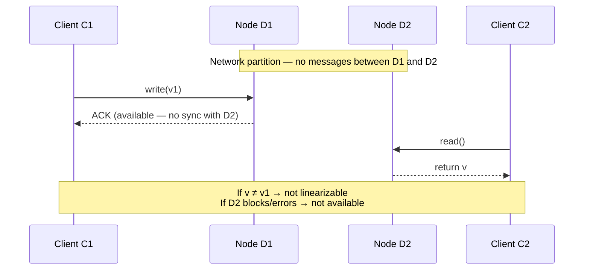

*Figure 1: CAP impossibility core — write on one side of a partition forces read on the other side to violate C or A.*

### 6.3 Why P is not a "choice"

In any distributed system spanning multiple nodes or failure domains, **partitions can happen**. Gilbert and Lynch treat partition tolerance as the ability to continue despite message loss. You do not "choose" to be partition intolerant in production—you choose what to sacrifice **when** a partition occurs.

The popular "pick two of three" triangle is **misleading**: the real decision is **CP vs AP during partition**, with P as a given constraint of distribution.

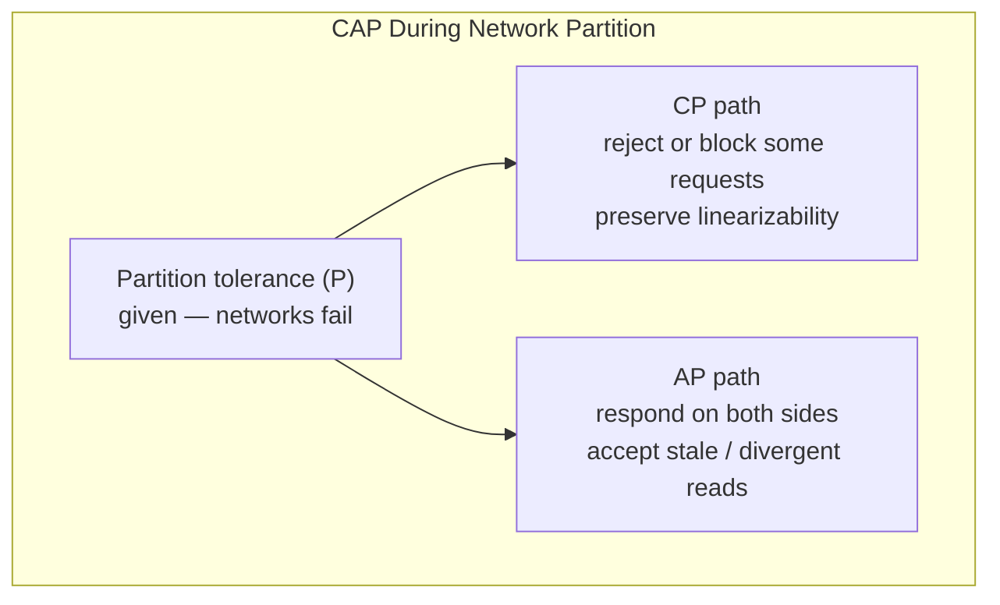

*Figure 2: Partition tolerance is not optional; architects choose CP or AP behavior during isolation.*

### 6.4 Mapping to safety and liveness

| CAP letter | Property family | Intuition |
|------------|-----------------|-----------|
| **C (linearizability)** | **Safety** | Clients never observe an impossible sequential history. |
| **A (always respond)** | **Liveness** (under partition) | Non-failing nodes must make progress on requests even when isolated. |
| **Partition** | **Failure model** | Messages between groups are lost—partial failure at the network layer. |

Under partition, demanding both safety (linearizability) and liveness (responses without coordination) is impossible in the async model—an instance of the broader tension covered in [Safety and Liveness](/docs/distributed-systems-foundations/safety-and-liveness).

## 7. Step-by-Step Walkthrough

**Scenario:** A global user profile service with two replicas (US-East, EU-West) and a load balancer directing clients to the nearest replica.

1. **Normal operation:** Writes go to a leader or require a quorum; reads may be local or quorum-based. System is linearizable if clients use quorum reads/writes or a single leader with synchronous replication.
2. **Partition:** Transatlantic link fails. US and EU replicas cannot exchange heartbeats or replication messages.
3. **CP choice:** EU replica stops accepting writes (or all writes) and returns errors/timeouts until it can rejoin a quorum. Reads may also fail if they cannot verify freshness. **Availability** on the minority side is sacrificed; **consistency** is preserved for operations that succeed.
4. **AP choice:** Both sides accept reads and writes. Clients in EU may read stale profiles; concurrent updates create **conflicts** requiring resolution (last-write-wins, version vectors, CRDTs). **Availability** is preserved; **linearizability** is not.
5. **Healing:** When the partition ends, replicas reconcile. CP systems catch up logs and reject divergent epochs; AP systems merge or surface conflicts to applications.

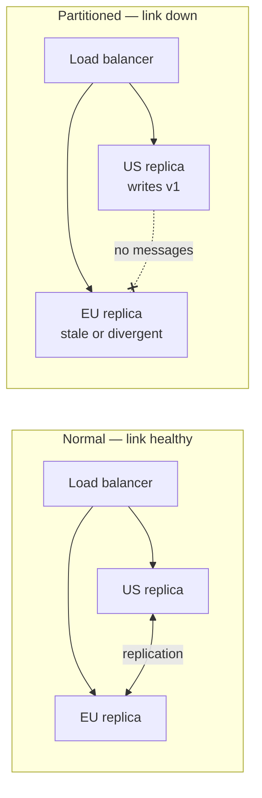

*Figure 3: Same topology before and during partition — behavior depends on CP vs AP policy, not on diagram shape.*

---

## 7.1 Real-World Scenarios at Production Granularity

The following scenarios specify **what clients observe**, **which CAP letter is sacrificed**, and **what operators do** — minute by minute where useful. Use them to move beyond "we picked AP."

### Scenario A: Amazon Dynamo shopping cart — classic AP under partition

**Context:** DeCandia et al. (2007) describe Dynamo for Amazon's shopping cart: **high availability** prioritized; **eventual consistency** with merge semantics acceptable. This is the canonical **AP during partition** production case.

| Event | Client observation | CAP choice |
|-------|-------------------|------------|
| Normal | Add item to cart; read cart from local replica | Tunable quorum; often `QUORUM` for writes |
| AZ partition | Cart still accepts adds in isolated AZ | **A** — responds locally |
| Concurrent adds on both sides | Cart may show merged or LWW-resolved items | **Not C** — not linearizable globally |
| Partition heals | Vector clocks / reconciliation merge divergent carts | Convergence (post-CAP) |

**Granular user flow:**

1. **T+0:** User in US-East adds "Kindle" to cart. Write goes to nodes N1, N2, N3 with `W=2` quorum in East.
2. **T+30s:** Transatlantic partition isolates US-East from EU-West replicas.
3. **T+31s:** Same user travels (or VPN flips); request hits EU-West load balancer.
4. **T+32s:** EU replica may **not** show Kindle yet — **stale read** (AP sacrifice of linearizability).
5. **T+33s:** User adds "Case" in EU — write succeeds locally (**A** preserved).
6. **T+10min:** Partition heals; anti-entropy merges — cart shows both items.

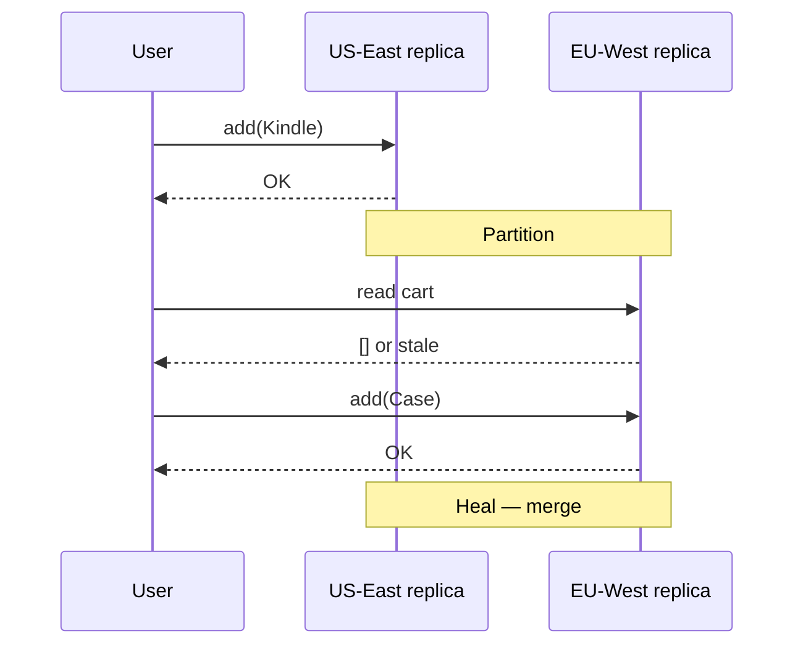

**Principal signal:** Shopping cart tolerates **temporary divergence**; payment capture is a **separate CP object** (see Stripe scenario). **Never** label the whole company "AP" — per-operation CAP choice.

See: [Amazon DynamoDB Consistency scenario](/docs/real-world-scenarios/amazon-dynamodb-eventual-consistency).

---

### Scenario B: Stripe payment authorization — CP for money movement

**Context:** Card authorization must not double-charge or show inconsistent balance. During partition, Stripe and issuers **fail closed** rather than guess.

| Phase | CAP posture | Behavior |
|-------|-------------|----------|
| Auth request | **CP lean** | Quorum / leader coordination before ACK |
| Network timeout to issuer | Client sees `502`/`503` | **Sacrifice A** (no fake success) |
| Regional isolation | Route to healthy region OR reject | No split-brain auth without quorum |

**Granular timeline — issuer timeout during partition:**

| Time | Event |
|------|-------|
| T+0 | `POST /charges` hits US-East API |
| T+50ms | API begins auth; issuer connection routed via US-East |
| T+200ms | Partial partition: issuer reachable from US-West only |
| T+5s | US-East times out — returns **503** to merchant |
| T+5.1s | Merchant retries with idempotency key to US-West (if routed) |
| T+5.3s | US-West completes auth — **single linearizable outcome** via idempotency + issuer dedup |

**What AP would look like (unacceptable):** US-East returns `200` with "pending" while US-West also authorizes — duplicate hold or inconsistent state.

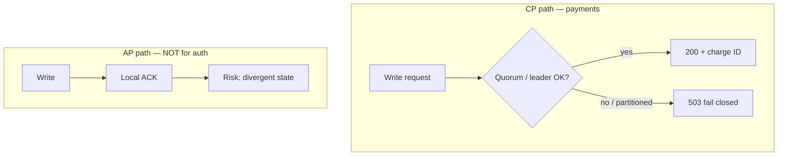

See: [Stripe Payment Idempotency](/docs/real-world-scenarios/stripe-payment-idempotency).

---

### Scenario C: Kubernetes control plane — etcd CP during AZ partition

**Context:** etcd stores cluster state (pods, services, secrets). **CP by design:** writes require **majority quorum**; minority partition **unavailable** for writes.

**3-node etcd across 3 AZs — AZ-a isolated:**

| Node | AZ | Partition role | Write `kubectl apply` |
|------|-----|----------------|----------------------|
| etcd-1 | AZ-a | Minority (alone) | **Fails** — no quorum |
| etcd-2 | AZ-b | Majority with etcd-3 | **Succeeds** |
| etcd-3 | AZ-c | Majority with etcd-2 | **Succeeds** |

**Client impact:**

- `kubectl` hitting API server backed by minority etcd → **503 / timeout** (**A** sacrificed on minority side).
- Scheduling in majority AZ continues — **C** preserved for successful operations.

**Operator mistake (AP drift):** Allowing split-brain etcd (two majorities) — **violates C** worse than sacrificing A. Always **fence** minority.

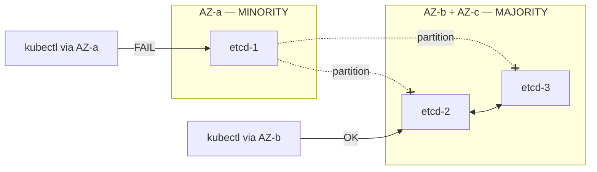

**Lesson:** CP does not mean "down" globally — it means **minority partition sacrifices availability** to preserve linearizability.

---

### Scenario D: Cassandra inventory — tunable CAP per request

**Context:** Cassandra exposes **consistency level (CL)** per query — architects choose C vs A **per operation**, not per cluster label.

**Flash sale — 100 units, 10,000 buyers:**

| CL | Write behavior during partition | CAP |
|----|--------------------------------|-----|
| `ONE` | Write to nearest replica | **AP** — fast; may oversell |
| `QUORUM` | W=2 of 3 replicas | **CP lean** — minority rejects |
| `ALL` | All replicas | **CP** — one down blocks all |

**Granular oversell scenario (`CL=ONE`, partition):**

1. Replica R1 (partition A) and R2 (partition B) isolated.
2. Buyer 1 writes `stock=99` to R1; Buyer 2 writes `stock=99` to R2 — both read `100` locally.
3. Both succeed — **200 OK** (**A** on both sides).
4. **98 units sold** but only 100 existed — **C** violated for inventory invariant.

**Mitigation:** `QUORUM` + lightweight transactions (LWT) for inventory; or **CP metadata** (reservation service) + AP catalog.

---

### Scenario E: Global DNS failover — routing vs data plane

**Context:** Route 53 health checks fail US-East; traffic shifts to EU-West. **CAP applies to data**, not DNS alone.

| Layer | Failover speed | CAP relevance |
|-------|----------------|---------------|
| **DNS / GSLB** | 30s–300s TTL | Routes clients — does not fix data |
| **Application** | Immediate | Must choose CP or AP for writes |
| **Database** | RPO-dependent | Async rep → stale reads in EU |

**Timeline — regional disaster:**

| Time | Event | CAP |
|------|-------|-----|
| T+0 | Earthquake isolates US-East region |
| T+1min | Route 53 marks US-East unhealthy | Traffic → EU |
| T+2min | EU app serves reads from local replica | May be **stale** (AP) or **rejected** (CP) |
| T+2min | User updates profile in EU | If AP: diverges from US; if CP: write fails without quorum |
| T+4h | US-East never returns | DR promotion decision |

**Principal mistake:** "DNS failed over so we're fine" — **routing failover ≠ consistency failover**.

---

### Scenario F: Social feed (Meta-style) — AP with bounded staleness

**Context:** News feed reads tolerate seconds of staleness; **AP during partition** keeps app usable.

| Operation | Typical CAP | User sees |
|-----------|-------------|-----------|
| Read feed | AP / EL | Slightly old posts |
| Post update | AP | May delay cross-region |
| Ad billing | CP | Separate pipeline |

**Partition:** US users see US posts; EU users see EU posts; fan-out queues backlog. **A** preserved; **C** not global linearizability.

See: [Meta News Feed scenario](/docs/real-world-scenarios/meta-news-feed-design).

---

### Real-world CAP posture summary

| System / use case | Partition posture | Mechanism | Sacrifice during partition |
|-------------------|-------------------|-----------|---------------------------|
| Amazon Dynamo cart | AP | Quorum + merge | Linearizability |
| Stripe / bank auth | CP | Quorum, fail closed | Availability |
| etcd / ZooKeeper | CP | Majority quorum | Minority availability |
| Cassandra (tunable) | Per CL | `ONE` vs `QUORUM` | Configurable |
| Spanner | CP | Paxos + TrueTime | Minority unavailable |
| CDN / feed reads | AP | Local replicas | Freshness |
| DNS failover | Routing only | Health checks | N/A — data separate |

---

## 7.2 CAP in Active-Passive, Active-Active, and Disaster Recovery

Failover topology determines **who answers during partition** and **whether two sides can both accept writes**. CAP is the lens for evaluating each choice.

### DR vocabulary mapped to CAP

| Term | CAP interpretation |
|------|-------------------|
| **RPO** | Max data loss — async replication ⇒ AP reads may miss recent **C** |
| **RTO** | Max downtime — longer RTO ⇒ longer window choosing CP or AP |
| **Active-passive** | One write primary — **single C authority**; standby sacrifices **A** until promotion |
| **Active-active** | Multiple write paths — **highest split-brain / AP risk** without global quorum |
| **Split brain** | Two primaries — **C destroyed** unless fenced |
| **Failback** | Returning to old primary — epoch/fencing prevents stale **CP** leader writes |

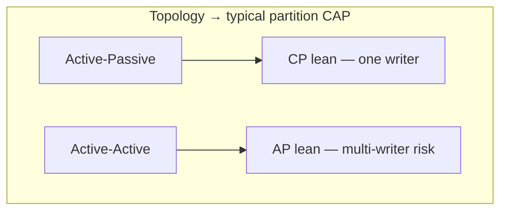

---

### Topology 1: Single-region active-passive (hot standby)

**Architecture:** Primary AZ serves all writes; standby AZ has synchronous or async replica. On primary failure, promote standby.

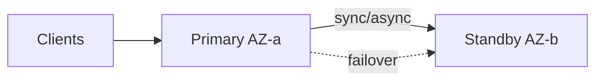

**Normal operation (no partition):**

- All writes to Primary — **linearizable** if sync replication.
- Reads from Primary or Standby (if sync: **C**; if async: standby may lag — **ELC** branch).

**Failover scenario — Primary AZ lost:**

| Step | CAP behavior |
|------|--------------|
| 1. Detect primary failure | Health checks fail |
| 2. **Fence** old primary (STONITH / revoke IAM) | Prevents split-brain **C** violation |
| 3. Promote standby | Standby becomes **single writer** |
| 4. Clients retry | **A** restored on new primary after promotion |

**Sync replication (RPO ≈ 0):**

- **CP during failover:** Brief write unavailability during election (sacrifice **A** for seconds).
- No lost commits — **C** preserved.

**Async replication (RPO = 30s):**

- Promotion at T+15s may **lose last 15s of writes** — not a CAP theorem issue but **data loss**.
- Clients who received ACK for lost writes see **C** violated from their perspective — reconciliation required.

**CAP interview answer:** "Single-region active-passive is **CP-lean**: one authoritative writer. Failover sacrifices **A** briefly; async replication sacrifices **C** for recent data even after heal."

---

### Topology 2: Multi-region active-passive (DR standby)

**Architecture:** US-East **active**; EU-West **warm/cold standby**. Cross-region async replication. DNS/Global Accelerator routes to active only.

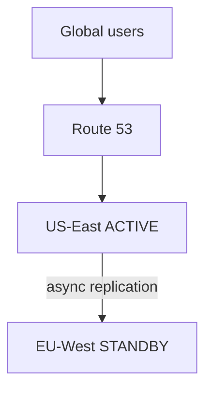

**Planned DR failover (region disaster):**

| Phase | Action | CAP |
|-------|--------|-----|
| **Detect** | US-East unreachable | — |
| **Isolate** | Prevent US-East from accepting writes if partially alive | **Fence** — protect **C** |
| **Promote** | EU-West DB promoted to primary | Single writer restored |
| **Redirect** | DNS → EU-West | **A** for EU; US users rerouted |
| **Operate** | EU serves all traffic | **CP** if single primary; **C** bounded by RPO |

**During partition before promotion (split period):**

- If US-East **still accepts writes** (misconfigured) AND EU promoted → **split brain** — **worst C failure**.
- Correct: US-East **fails closed** (CP) or is **fenced** before EU promotion.

**Client experience during 10-minute promotion:**

| User location | Before failover | During promotion | After failover |
|---------------|-----------------|------------------|----------------|
| US | US-East **A+C** (normal) | **503** / timeout (**A** down) | EU-West (**A** restored; possible stale read) |
| EU | Routed to US-East (latency) | **503** | EU-West local (**A**; lag per RPO) |

**RPO = 5 minutes example:**

- Writes in last 5 minutes before promotion may not exist in EU — reads show **stale/missing data** — users perceive **C** violation until reconciliation or accept loss.

**RPO = 0 (sync cross-region — rare):**

- Writes require both regions — **CP**; partition blocks writes globally — **A** sacrificed during partition (Spanner-like).

---

### Topology 3: Multi-region active-active

**Architecture:** US-East and EU-West both accept reads and writes. Bidirectional replication.

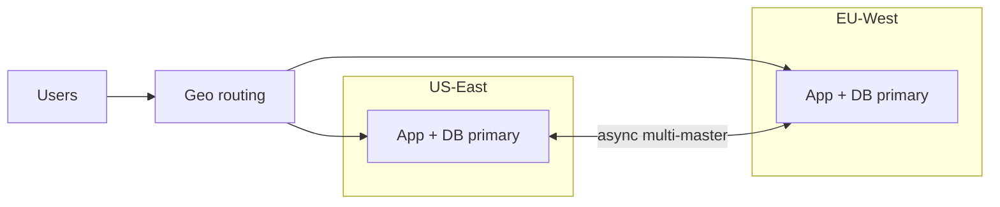

**Normal operation:**

- US user writes to East; EU user reads from West — **eventual consistency** (**EL** in PACELC).
- Cross-region read-your-writes **not** guaranteed without sync replication.

**Partition — transatlantic link down:**

| Side | AP choice | CP choice |
|------|-----------|-----------|
| **US-East** | Accept writes; local reads fast | Reject writes without quorum |
| **EU-West** | Accept writes; local reads fast | Reject writes without quorum |
| **Both AP** | Both sides keep serving — **divergent state** | — |
| **Both CP** | Both sides reject writes — **global unavailability** | **C** preserved |

**Granular split-brain example (AP misconfiguration):**

| Time | US-East | EU-West |
|------|---------|---------|
| T+0 | User A sets `balance=$100` | Replicated |
| T+1 | **Partition** | — |
| T+2 | User B withdraws $60 → `$40` | Not visible |
| T+3 | — | User C withdraws $60 → `$40` (stale read of $100) |
| T+4 | **Heal** | Two withdrawals; balance should be **-$20** or one must fail |

**Mitigations:**

| Strategy | CAP effect |
|----------|------------|
| **Global quorum (Spanner)** | **CP** — minority partition unavailable |
| **Per-user home region** | Reduces cross-partition writes |
| **CRDT / commutative ops** | AP with convergence — not for bank balance |
| **Leader per shard** | CP per key partition |
| **Fencing + epoch** | Stale primary cannot write after promotion |

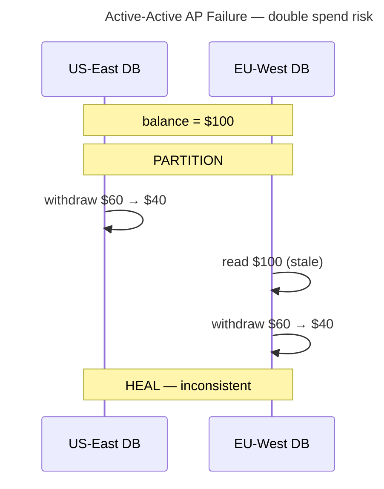

---

### Failover scenario matrix (CAP lens)

| Scenario | Topology | Risk | CAP response |
|----------|----------|------|--------------|
| **Single AZ failure** | Active-passive same region | Brief unavailability | CP: promote standby; sacrifice **A** seconds |
| **AZ partition (split)** | Misconfigured quorum | Split brain | **Fence** minority; CP |
| **Region disaster** | Active-passive DR | RPO data loss | Promote DR; document **C** bound = RPO |
| **DNS failover only** | Any | Stale route | Data plane unchanged — CAP at DB |
| **Active-active + partition** | Multi-region | Double writes | AP divergence OR CP global write stop |
| **Failback to old primary** | DR | Stale primary writes | **Fence** old region; epoch bump |
| **Cold DR restore from backup** | Backup | Hours of data loss | **C** violated for backup window |
| **Chaos: 50% packet loss** | Any | Gray failure | Timeouts → false failover → **C** or **A** thrashing |

---

### Active-passive vs active-active — CAP decision guide

| Requirement | Active-passive | Active-active |
|-------------|----------------|---------------|
| **Strict linearizability for writes** | ✓ Natural single primary | Needs global quorum (Spanner) |
| **Maximize write availability in partition** | ✗ Minority/standby down | AP possible — divergent |
| **Simplest mental model** | ✓ One writer | ✗ Conflict resolution |
| **Lowest cross-region write latency** | ✗ Single primary may be far | ✓ Local writes (AP) |
| **Financial correctness** | ✓ Preferred | Dangerous without CP layer |
| **RPO = 0** | Sync rep to standby | Very hard cross-region |

**Principal recommendation:**

| Data type | Topology | Partition CAP |
|-----------|----------|---------------|
| Money, inventory, leader election | Active-passive or CP quorum | **CP** — sacrifice **A** on minority |
| Feeds, carts, analytics | Active-active or AP replicas | **AP** — sacrifice **C**; merge |
| Config / service registry | CP coordination (etcd) | **CP** |
| Read-heavy catalog | AP replicas + CP inventory service | **Hybrid** |

---

### DR drill — CAP checklist

**Before failover drill:**

- [ ] Document per-API: CP or AP during partition
- [ ] Define RPO/RTO and map to max staleness (**C** bound)
- [ ] Verify fencing prevents stale primary writes
- [ ] Client retry policy aligned (idempotency for CP rejects)

**During drill:**

- [ ] Measure write **unavailability** window (**A** sacrifice) — target RTO
- [ ] Sample reads from promoted region — measure staleness vs RPO
- [ ] Confirm minority partition **rejects** writes (CP) not accepts (split brain)

**After drill:**

- [ ] Reconcile divergent rows if AP path was tested
- [ ] Failback only after epoch/fencing confirms old primary safe
- [ ] Update ADR with observed **C** and **A** metrics

See also: [Disaster Recovery and Multi-Region](/docs/reliability-and-resilience/disaster-recovery-and-multi-region), [AWS S3 Multi-Region DR](/docs/real-world-scenarios/aws-s3-multi-region-dr), [Google Spanner](/docs/real-world-scenarios/google-spanner-global-consistency), [PACELC](/docs/consistency/pacelc) for normal-case latency tradeoffs.

---

## 8. Invariants and Guarantees

**What CAP guarantees (formally):**

- In an **asynchronous** network, no algorithm for a linearizable replicated register can be both **fully available** on all non-failing nodes and **correct** during a **partition**.

**What CAP does not guarantee or forbid:**

- **Eventual consistency** after partition heals (liveness of convergence is a separate property).
- **Partial availability** (e.g., majority quorum available while minority is not)—Gilbert and Lynch's *A* is stricter: every non-failing node responds.
- **Session or monotonic reads** — weaker than linearizability.
- **Transactional multi-key atomicity** — CAP as proved is about a **single register**.

**Invariants architects should document:**

1. **Partition detection** — How long before a side declares itself isolated?
2. **Degradation mode** — Read-only? Leader step-down? Client retry to other region?
3. **Client contract** — What error codes, staleness bounds, or conflict behavior?

## 9. Failure Scenarios

| Scenario | CP behavior | AP behavior | Operational risk |
|----------|-------------|-------------|------------------|
| **WAN link flap** | Frequent leader elections; write unavailability | Duplicate writes; conflict storms | Misconfigured timeouts amplify flapping |
| **AZ isolation** | Minority partition unavailable | Majority and minority both serve | Split-brain if AP without conflict handling |
| **Misconfigured quorum** | False belief of CP while both sides accept writes | Data loss on heal | "Zombie" nodes after recovery |
| **Client retries to both sides** | Idempotent retries safe if one side rejects | Duplicate operations without idempotency keys | Double charges, duplicate messages |
| **Stale leader (not partition)** | CAP does not cover crash-recovery alone | Fencing tokens still required | Model mismatch with crash-recovery |

**Gray failure:** Partial partitions (high loss rate but not complete isolation) stress both CP and AP designs—timeouts may cause unnecessary failover (CP) or prolonged divergence (AP).

## 10. Performance Characteristics

CAP is a **correctness** result, not a latency benchmark. Do not cite CAP to predict millisecond-level performance.

**Qualitative effects during partition:**

| Path | Read latency | Write latency | Client-visible errors |
|------|--------------|---------------|------------------------|
| **CP** | May increase if quorum required; minority fails fast | Unavailable on minority side | Timeouts, `503`, redirect to healthy partition |
| **AP** | Low local reads | Low local writes | Fewer errors; semantic inconsistency instead |

**After heal:** CP systems may incur catch-up replication lag; AP systems incur merge/compaction and conflict resolution cost—often **application-dependent**, not fixed by the CAP label.

## 11. Scalability Limits

CAP does not set a replica count limit. It states that **no amount of replication** removes the C-vs-A tradeoff **during** partition if you insist on Gilbert and Lynch's definitions.

Scaling implications:

- **More regions** → higher probability of partition involving some pair; explicit per-region behavior required.
- **Quorum CP** → minority partitions scale in **unavailability**, not in violated linearizability.
- **AP with local replicas** → write scalability without cross-region sync, at consistency cost.

Sharding does not circumvent CAP: each shard faces the same tradeoff; global transactions across shards add **coordination** that often increases latency (see [PACELC](/docs/consistency/pacelc)).

## 12. Operational Considerations

1. **Runbooks must name partition behavior.** "Database down" is insufficient—is the minority partition rejecting writes by design?
2. **Health checks:** A node can be "healthy" locally but partitioned from peers; load balancers may route to inconsistent replicas in AP mode.
3. **Monitoring:** Track replication lag, leader epoch, fence generation, conflict rate, and `unavailable` error ratio during incidents.
4. **Chaos testing:** Inject network partition (`iptables`, `tc netem`, fault injection services) and verify documented CP/AP behavior.
5. **Client SDKs:** Retries, hedging, and read-your-writes semantics must align with server guarantees.

**SLO impact:** CP systems may trade availability SLO during partition for correctness; AP systems may meet availability SLO while violating strict consistency SLOs—define both.

## 13. Security Considerations

CAP addresses **benign** network failure, not adversarial partitions. Security interactions:

- **Split-brain with weak auth:** Two sides accepting writes may amplify forgery if clients can reach both.
- **Availability pressure:** Product pressure to stay "green" during partition can push teams toward AP without conflict controls—integrity risk.
- **CP with exposed minority:** Rejecting writes on minority is safer for consistency but may strand admin operations—ensure break-glass procedures are audited.

Byzantine tolerance requires different replica counts and protocols (`n > 3f`); CAP's single-register proof does not substitute for a threat model review.

## 14. Cost Considerations

| Choice | Cost driver |
|--------|-------------|
| **CP with cross-region quorum** | WAN replication latency; higher RPO/RTO investment; fewer but costlier regions active for writes |
| **AP with multi-master** | Application conflict resolution engineering; support cost for "wrong data" reports; possible revenue impact |
| **Over-provisioned redundancy** | Does not eliminate CAP tradeoff; may reduce partition duration probability only |

Finance and product should understand **consistency is not free**—either as unavailable windows (CP) or as reconciliation and trust costs (AP).

## 15. Production Implementations

Illustrative **implementation choices** (not formal CAP proofs):

| System | Documented partition posture | Mechanism (high level) |
|--------|------------------------------|------------------------|
| **etcd / Consul** | CP for coordination | Quorum writes; minority unavailable |
| **ZooKeeper** | CP | Majority quorum; Zab |
| **Amazon Dynamo (2007)** | AP for shopping cart use case | Quorum reads/writes tunable; conflict handling |
| **Cassandra** | Tunable (often AP-leaning) | `ONE`/`QUORUM`/`ALL` consistency levels |
| **Google Spanner** | CP (external consistency) | TrueTime + Paxos; unavailable without quorum |
| **MongoDB** | Configurable | Write concern + read concern determine behavior |

**Distinction:** Marketing "AP" does not mean "no consistency options." Always read **consistency level** and **failure behavior** docs for the specific version and deployment topology.

## 16. Alternatives and Tradeoffs

| Framework | What it adds beyond CAP |
|-----------|-------------------------|
| **[PACELC](/docs/consistency/pacelc)** | Latency vs consistency **without** partition |
| **Consistency models ladder** | Linearizability, sequential, causal, eventual—CAP uses only linearizability |
| **CRDTs / OT** | Convergence without linearizability |
| **Fencing + leases** | Safety when liveness heuristics fail (crash-recovery) |
| **Explicit SLAs** | Bounded staleness (`max_staleness=5s`) instead of binary CAP |

**When CP is appropriate:** Financial balances, inventory deduction, leader election, global uniqueness constraints, infrastructure metadata (service registry).

**When AP is appropriate:** Session carts, social feeds, metrics aggregation, features with natural merge semantics and tolerant users.

**Hybrid:** CP metadata plane + AP data plane is common and **not** a CAP violation—different objects, different guarantees.

## 17. Common Misconceptions

| Misconception | Correction |
|---------------|------------|
| "Pick two of three at design time" | P is given; you choose CP vs AP **when partitioned**. |
| "CAP means NoSQL vs SQL" | Storage model ≠ partition behavior; SQL clusters can be CP or AP depending on configuration. |
| "Consistency means ACID transactions" | Gilbert & Lynch: **linearizable single register**. |
| "Availability means uptime %" | G&L: every non-failing node responds to every request **during partition**. |
| "We run single-region so CAP doesn't apply" | Single region reduces partition **probability**, not multi-node failure modes (AZ partition). |
| "Eventual consistency violates CAP" | After partition, AP systems may be eventually consistent; CAP addresses **during** partition. |
| "CA systems exist in the cloud" | Without P, you are not distributed across failure domains—often a single node or shared fate. |

## 18. Principal Architect Perspective

Use CAP to **structure decisions**, not to win arguments:

1. **Name the object** — Per service, per API, per key: what is the register?
2. **Name the guarantee** — Linearizable? Causal? Bounded staleness?
3. **Name partition behavior** — Who fails closed? What do clients do?
4. **Name recovery** — Merge, log replay, human reconciliation?
5. **Align org incentives** — SRE availability metrics vs. data integrity requirements.

In architecture review, reject slides that say "we are AP" without stating **what inconsistency users will see** and **how conflicts are resolved**. Principal engineers are accountable for **client-visible contracts**, not triangle diagrams.

## 19. Architecture Review Exercise

**Prompt:** A fintech startup proposes dual-active PostgreSQL in US and EU with async replication, routing users to the nearest region for reads and writes. They claim "CA within each region."

**Review tasks:**

1. Identify the **CAP-relevant object** (account balance? transfer idempotency key?).
2. Classify behavior **during transatlantic partition** under Gilbert & Lynch definitions.
3. List three **failure scenarios** (split brain, duplicate transfer, stale balance).
4. Recommend **CP vs AP per operation type** and mechanisms (quorum, idempotency, outbox).
5. Draft **client-facing error semantics** for partition.

**Deliverable:** One-page ADR with explicit C/A/P definitions, partition mode, and monitoring plan.

## 20. Whiteboard Explanation

**Draw:**

```
        [Clients]
            |
     [Load balancer]
       /         \
   [US replica]   [EU replica]
       \         /
    ----X----  ← partition (link down)

Write v1 @ US  →  Read @ EU  →  ? 
```

**90-second script:** "CAP is a theorem about asynchronous networks and a single linearizable register. When the link between US and EU drops, if EU must answer every read without talking to US, it cannot return the latest write from US—that breaks linearizability. If EU blocks or errors, we broke Gilbert and Lynch availability. So during partition we choose CP—sacrifice availability on the minority—or AP—respond with possible staleness or conflicts. Partition tolerance isn't optional in a multi-site system. CAP doesn't say eventual consistency is bad; it says you can't have full linearizability and full availability on both sides at once. For money movement I'd CP with quorum; for a shopping cart Amazon famously chose AP with merge semantics."

## 21. Interview Questions

1. **State the CAP theorem using Gilbert and Lynch's definitions of C, A, and P.**
   - *Signals:* linearizable register; non-failing nodes respond; arbitrary message loss; impossibility during partition.

2. **Why is "pick two of three" misleading?**
   - *Signals:* P is not optional; choice is CP vs AP when partitioned.

3. **Walk through the two-node proof sketch.**
   - *Signals:* write one side, read other, contradiction.

4. **Does CAP apply to a single-leader database in one datacenter?**
   - *Signals:* AZ/partition still possible; reduced WAN partition probability; model matters.

5. **What is the difference between Brewer's conjecture and Gilbert & Lynch's theorem?**
   - *Signals:* informal vs proved; async network; atomic register.

6. **Is etcd CP or AP? Justify.**
   - *Signals:* quorum; minority unavailable; linearizable.

7. **How does CAP relate to safety and liveness?**
   - *Signals:* consistency safety; availability liveness; partition as failure model.

8. **Can a system be "CA"?**
   - *Signals:* not across partitions; single failure domain; marketing triangle artifact.

9. **What does availability mean in CAP vs "99.9% uptime"?**
   - *Signals:* every request gets response from non-failing node during partition.

10. **How would you design a dual-region service for CP writes and AP reads?**
    - *Signals:* separate guarantees; staleness bounds; not one global label.

11. **Does sharding avoid CAP?**
    - *Signals:* per-shard tradeoff; cross-shard coordination separate.

12. **What is NOT covered by the classic CAP proof?**
    - *Signals:* multi-key transactions, Byzantine, partial availability quorums as "available" under G&L.

13. **During active-active multi-region partition, how do you prevent double-spend?**
    - *Signals:* global quorum CP, fencing, per-shard leader, not AP for balances.

14. **Active-passive DR with 5-minute RPO — what CAP guarantee do clients lose after failover?**
    - *Signals:* recent writes may be missing; C bounded by RPO; not CAP theorem but data loss.

15. **Why doesn't DNS failover alone solve CAP?**
    - *Signals:* routing ≠ data plane; stale replicas; split brain if both regions write.

## 22. Interview Follow-Ups

1. **How does PACELC extend CAP?** — Normal-case latency vs consistency; see PACELC chapter.
2. **What consistency level would you use in Cassandra for inventory?** — Likely `QUORUM` or strong per-key; discuss LWT limitations.
3. **Spanner claims external consistency—is it CA?** — CP when partitioned; TrueTime does not remove partition tradeoff.
4. **How do conflict-free replicated data types (CRDTs) fit CAP?** — AP-friendly; convergence without linearizability.
5. **What happens to CAP under partial synchrony?** — Still applies during partition; recovery differs.
6. **Design idempotency for AP retries.** — Idempotency keys, dedup store, outbox pattern.
7. **Active-passive failover — CP or AP?** — CP-lean; brief A sacrifice; fence stale primary.
8. **Can active-active be CP?** — Only with global quorum (Spanner); else AP for writes or stop writes globally.

## 23. Strong Answer Example

**Question:** "Explain CAP to a product manager who wants 100% availability and always-fresh data globally."

**Strong answer outline:**

"Those two goals conflict when the network between regions fails—which eventually happens. The CAP theorem, proved by Gilbert and Lynch, says that for a linearizable data item—where every read reflects the latest write—if both sides of a partition keep answering every request, reads on one side cannot know about writes on the other, so users see stale data. That's sacrificing consistency. If we refuse stale reads, one side must block or return errors until we can coordinate—that's sacrificing availability during the outage, not forever. We don't choose partition tolerance; distributed systems have partitions. What we choose is behavior during isolation: for payments we fail closed on the minority partition—CP—and for a wish list we might allow divergent state and merge later—AP. We can also mix both in one product with different APIs. I'll draft which features need which guarantee and what users see in a regional outage."

## 24. Weak Answer Example

**Weak answer:** "CAP says you pick two: consistency, availability, or partition tolerance. We pick AP because we use Cassandra and need uptime. Strong consistency is too slow anyway."

**Red flags:** Triangle memorization; database name as justification; conflates latency with CAP; no partition scenario; no Gilbert & Lynch definitions; implies consistency is always slow without context.

## 25. Hands-On Exercise

**Lab: Observe CP vs AP under partition**

1. Deploy a 3-node etcd cluster (or use a CAP simulation tool).
2. **Baseline:** Write a key; read from all members; verify linearizable behavior.
3. **Partition:** Isolate one follower with network rules; attempt writes on majority and minority.
4. **Document:** Which operations fail? Does minority ever accept writes?
5. **Optional:** Repeat with Cassandra or a tunable store at `ONE` vs `QUORUM`.
6. **Write ADR:** Map observations to Gilbert & Lynch C, A, P.

**Success criteria:** Written explanation of one operation that violated availability to preserve consistency, and one that preserved availability at consistency cost.

## 26. Knowledge Check

1. Define C, A, and P per Gilbert and Lynch.
2. Why does a write on one side and read on the other force a CAP violation?
3. Is partition tolerance optional in multi-AZ cloud deployments?
4. How does CAP's "availability" differ from an uptime SLA?
5. What failure model does CAP assume for the network?
6. Name one production system that is CP by design for coordination.
7. What property does an AP system typically sacrifice during partition?
8. Does CAP forbid eventual consistency after heal?
9. What object type does the classic proof use?
10. How does CAP relate to safety and liveness?
11. During active-active partition, why can two regions both accept writes only under AP?
12. What is split brain in CAP terms? *(Two primaries — C violated unless fenced.)*
13. How does RPO relate to consistency after DR failover? *(Max lost writes = staleness/C bound.)*

## 27. Flashcards

| Front | Back |
|-------|------|
| CAP (proved result) | Async network: linearizable C and full A cannot both hold during partition |
| Consistency in CAP | Linearizable atomic read/write register (Gilbert & Lynch) |
| Availability in CAP | Every non-failing node responds successfully to every request |
| Partition tolerance | System operates despite arbitrary message loss between nodes |
| Brewer (2000) | Conjecture at PODC; popularized CAP tradeoff |
| Gilbert & Lynch (2002) | Formal proof for async atomic register |
| CP during partition | Sacrifice availability; preserve linearizability |
| AP during partition | Sacrifice linearizability; keep responding |
| "Pick two of three" | Misleading — P is given; choose CP vs AP |
| CAP proof core | Write one partition side, read other — contradiction |
| CAP not about | Multi-key ACID, Byzantine faults, uptime % alone |
| Recovery after partition | Separate from CAP impossibility during partition |
| Active-passive | CP-lean; single writer; A sacrificed briefly on failover |
| Active-active | AP risk for writes unless global quorum (CP) |
| Split brain | Two primaries — C destroyed; fence with epoch/STONITH |
| RPO | Max data loss — consistency bound after DR promotion |
| DNS failover | Routing only — does not fix data-plane CAP |

## 28. Cheat Sheet

```
GILBERT & LYNCH DEFINITIONS
  C = linearizable (atomic) single register
  A = every non-failing node responds, finite time
  P = arbitrary message loss (partitions)

THEOREM
  During partition in async network: NOT (C ∧ A ∧ P)

PRACTICAL
  P is given → choose CP or AP when partitioned
  CP = errors / block minority
  AP = respond; stale / conflicts possible

HA/DR
  Active-passive → CP lean; fence on failover
  Active-active → AP write risk OR global quorum CP
  RPO = max C loss after promotion
  Split brain = worst C failure

NOT CAP
  latency tuning, eventual merge, SQL vs NoSQL

INTERVIEW
  proof sketch + definitions + production example
```

## 29. Related Concepts

- [Distributed System Models](/docs/distributed-systems-foundations/distributed-system-models) — prerequisite: async vs partial sync
- [Safety and Liveness](/docs/distributed-systems-foundations/safety-and-liveness) — safety/liveness framing for C and A
- [PACELC](/docs/consistency/pacelc) — extends CAP with latency tradeoff without partition
- [Partial Failure](/docs/distributed-systems-foundations/partial-failure) — why partitions happen
- [Replication](/docs/replication/overview) — quorum replication implements CP choices
- [Consensus](/docs/consensus/overview) — coordination under partition
- [Disaster Recovery and Multi-Region](/docs/reliability-and-resilience/disaster-recovery-and-multi-region) — RPO/RTO, failover topologies
- [Amazon DynamoDB Consistency scenario](/docs/real-world-scenarios/amazon-dynamodb-eventual-consistency)
- [Google Spanner scenario](/docs/real-world-scenarios/google-spanner-global-consistency)
- [AWS S3 Multi-Region DR](/docs/real-world-scenarios/aws-s3-multi-region-dr)

## 30. References

### Primary sources (formal guarantees)

- Gilbert, S., & Lynch, N. A. (2002). *Brewer's Conjecture and the Feasibility of Consistent, Available, Partition-Tolerant Web Services.* ACM SIGACT News, 33(2). [CAP theorem proof — asynchronous network, atomic register]
- Brewer, E. A. (2000). *Towards Robust Distributed Systems.* PODC keynote. [Original conjecture — informal]
- Herlihy, M. P., & Wing, A. V. (1990). *Linearizability: A Correctness Condition for Concurrent Objects.* ACM TOPLAS. [Consistency (C) as linearizability]
- Lynch, N. A. (1996). *Distributed Algorithms.* Morgan Kaufmann. [Asynchronous network model]

### Books and synthesis

- Kleppmann, M. (2017). *Designing Data-Intensive Applications.* O'Reilly. [Chapters 5, 7, 9 — replication, consistency, CAP critique]
- Martin, K. (2012). *Notes on CAP and PACELC.* Blog post. [Practical critique of triangle misreadings — implementation-oriented]

### Implementation-oriented (engineering practice)

- DeCandia, G., et al. (2007). *Dynamo: Amazon's Highly Available Key-value Store.* SOSP. [AP-oriented production design]
- Corbett, J., et al. (2012). *Spanner: Google's Globally-Distributed Database.* OSDI. [CP with TrueTime and Paxos]
- etcd documentation: https://etcd.io/docs/ [Quorum CP coordination]

### Distinction

- **Formal guarantees** — Gilbert & Lynch impossibility under stated async model and register semantics.
- **Implementation choices** — Dynamo, Cassandra consistency levels, etcd quorum behavior.
- **Operational experience** — Partition drills and incident patterns; verify in your environment rather than citing generic outage narratives.
